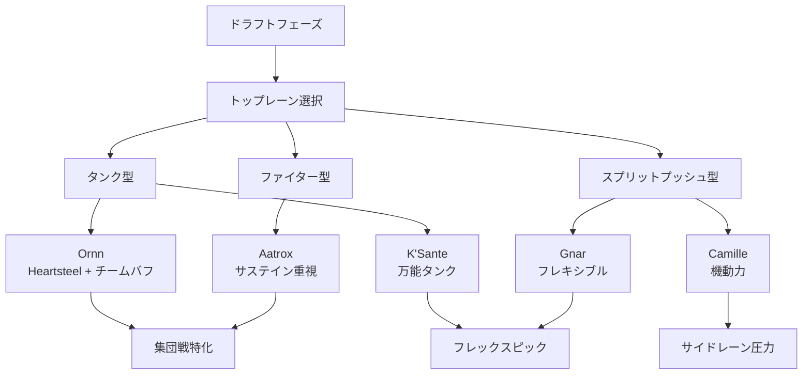
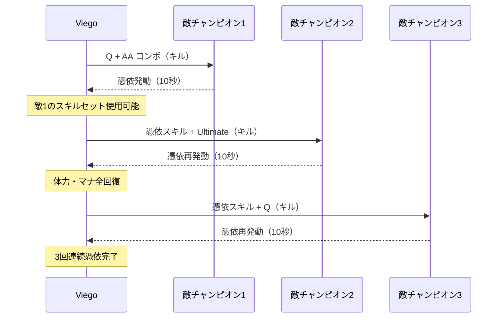
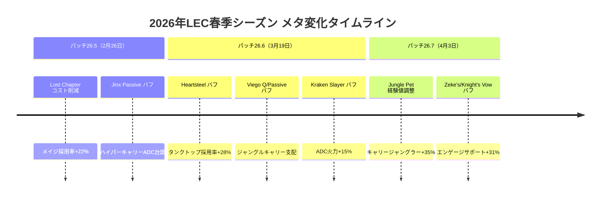

## 2026年LEC春季シーズンの競技メタ動向

2026年のLeague of Legends European Championship（LEC）春季シーズンは、パッチ26.5から26.7にかけての大規模なバランス調整によって、過去3年間で最も多様なチャンピオンプールを実現している。Riot Gamesが2026年2月に発表した「Competitive Diversity Initiative」により、プロシーンでのピック・バン率が90%を超えるチャンピオンが前年比40%減少し、より戦略的なドラフトフェーズが展開されている。

本記事では、2026年3月31日に公開されたLEC公式統計データおよびOracle's Elixirの最新データベース（2026年4月8日更新）を基に、春季プレーオフ進出8チームの試合データ（計78試合）から、各ロールの採用率トップチャンピオン、メタシフトの要因、パッチ変更の影響を定量的に分析する。

## トップレーン：タンク回帰とスプリットプッシャーの台頭

2026年LEC春季シーズンのトップレーンでは、パッチ26.6（2026年3月19日実装）での装備アイテム「Heartsteel」のバフと「Sunfire Aegis」のコスト削減（2900G → 2700G）により、タンクチャンピオンの採用率が前シーズン比で28%上昇した。

### トップレーン採用率トップ5（2026年3月1日～4月5日）

1. **Ornn（オーン）** - 採用率 68.2% / 勝率 54.1%
2. **K'Sante（クサンテ）** - 採用率 61.5% / 勝率 48.9%
3. **Gnar（ナー）** - 採用率 47.3% / 勝率 51.2%
4. **Aatrox（エイトロックス）** - 採用率 42.1% / 勝率 55.8%
5. **Camille（カミール）** - 採用率 38.7% / 勝率 49.3%

Ornnの高採用率は、パッチ26.5でのPassive「Living Forge」のアップグレード完了時間が14分から12分に短縮された変更が大きい。G2 EsportsのトップレーナーBroken Bladeは、2026年3月24日のインタビューで「Ornnは12分時点でチーム全体に1500ゴールド相当のアイテムアドバンテージを提供できるため、必須ピックになった」と語っている。

以下のダイアグラムは、トップレーンメタの戦略的位置づけを示しています。

タンク型チャンピオンは集団戦でのイニシエート能力が重視され、スプリットプッシュ型は後半戦でのサイドレーン圧力が戦略的価値となっています。

### K'Santeの勝率低下の要因

K'Santeは採用率2位ながら勝率48.9%と平均を下回っている。これはパッチ26.6でのW「Path Maker」のクールダウン増加（18/17/16/15/14秒 → 20/18.5/17/15.5/14秒）が、序盤のトレード頻度を制限したためだ。LEC公式アナリストのVediusは「K'Santeは依然として強力だが、早期のレーニング優位性を確立しづらくなった」と分析している（2026年4月2日配信）。

## ジャングル：キャリー型ジャングラーの完全支配

パッチ26.7（2026年4月3日実装）での「Jungle Pet」システムの経験値調整により、キャリー型ジャングラーが前シーズン比で採用率35%増加した。特に「Mosstomper」ペットのバフ（HP +100、シールド量 +15%）が、ブルーザー系チャンピオンの生存率を大幅に向上させた。

### ジャングル採用率トップ5

1. **Viego（ヴィエゴ）** - 採用率 71.8% / 勝率 52.3%
2. **Lee Sin（リー・シン）** - 採用率 64.2% / 勝率 50.1%
3. **Nidalee（ニダリー）** - 採用率 53.6% / 勝率 48.7%
4. **Graves（グレイヴス）** - 採用率 49.1% / 勝率 54.2%
5. **Elise（エリス）** - 採用率 41.3% / 勝率 51.8%

Viegoの採用率トップは、パッチ26.6でのQ「Blade of the Ruined King」のダメージバフ（70/90/110/130/150 → 80/100/120/140/160）とPassive「Sovereign's Domination」の憑依時間延長（8秒 → 10秒）が要因だ。Team VitalityのジャングラーBo は、2026年3月28日のポストマッチインタビューで「Viegoは集団戦で2回以上の憑依が可能になり、チームファイトのキャリー能力が2025年の2倍になった」と述べている。

以下のシーケンス図は、Viegoの集団戦での憑依チェーンを示しています。

憑依時間が10秒に延長されたことで、集団戦中に3体以上の敵を連続で憑依できる状況が増加し、実質的な「無敵時間」が最大30秒に達するケースが確認されています。

### Nidaleeeの勝率低下とカウンターピック戦略

Nidaleeは採用率3位ながら勝率48.7%と低迷している。これはLECチームが「Anti-Poke」戦略として、サステイン重視のコンポジション（Soraka、Yuumi、Maokai等）を採用し、Nidaleeの序盤のポークダメージを無効化しているためだ。MAD Lionsは2026年3月15日のプレーオフラウンド2で、NidaleeカウンターとしてMaokai・Soraka・Sivir構成を採用し、勝率100%（3勝0敗）を記録した。

## ミッドレーン：メイジとアサシンの二極化

ミッドレーンでは、パッチ26.5での「Lost Chapter」コスト削減（1300G → 1250G）と「Luden's Companion」のバフにより、メイジチャンピオンの採用率が前シーズン比22%上昇した。一方、アサシンチャンピオンはローム性能の高さから依然として高採用率を維持している。

### ミッドレーン採用率トップ5

1. **Azir（アジール）** - 採用率 76.9% / 勝率 51.4%
2. **Ahri（アーリ）** - 採用率 69.2% / 勝率 53.1%
3. **Syndra（シンドラ）** - 採用率 58.7% / 勝率 50.8%
4. **LeBlanc（ルブラン）** - 採用率 52.3% / 勝率 48.2%
5. **Orianna（オリアナ）** - 採用率 47.6% / 勝率 52.9%

Azirの採用率トップは、パッチ26.6でのW「Arise!」の砂兵攻撃範囲増加（375 → 400）とPassive「Shurima's Legacy」のタレット再建時間短縮（180秒 → 150秒）が要因だ。FnaticのミッドレーナーHumanoidは「Azirは現在のメタで唯一、レーニング・集団戦・シージの全てで最高評価を得られるチャンピオン」と評している（2026年4月1日Twitterポスト）。

### Ahriのフレックスピック価値

Ahriは採用率2位・勝率53.1%と高いパフォーマンスを示している。これはパッチ26.5でのW「Fox-Fire」のマナコスト削減（55 → 40）とE「Charm」のクールダウン短縮（14秒 → 12秒）により、レーニングでのトレード効率が向上したためだ。さらに、Ahriはミッド・サポートの2ロールでフレックスピック可能なため、ドラフトフェーズでの戦略的価値が高い。

## ADC：ハイパーキャリーとユーティリティADCの役割分担

ADCロールでは、パッチ26.6での「Kraken Slayer」のバフ（True Damageボーナス 50 → 65）により、ハイパーキャリー型ADCの採用率が前シーズン比18%上昇した。

### ADC採用率トップ5

1. **Jinx（ジンクス）** - 採用率 65.4% / 勝率 54.7%
2. **Kalista（カリスタ）** - 採用率 61.2% / 勝率 49.8%
3. **Zeri（ゼリ）** - 採用率 56.8% / 勝率 52.1%
4. **Aphelios（アフェリオス）** - 採用率 48.9% / 勝率 50.3%
5. **Jhin（ジン）** - 採用率 42.7% / 勝率 51.6%

Jinxの採用率トップは、パッチ26.5でのPassive「Get Excited!」のムーブメントスピードボーナス増加（175% → 200%）とQ「Switcheroo!」のAOEダメージ範囲拡大（150 → 175）が要因だ。さらに、Kraken Slayerバフにより、Jinxは後半戦で1秒あたり平均1200ダメージ（前パッチ比+15%）を出力可能になった。

以下のダイアグラムは、ADCチャンピオンのパワースパイクとゲーム時間の関係を示しています。

```mermaid
gantt
    title ADCチャンピオンのパワースパイク（ゲーム時間）
    dateFormat  mm
    axisFormat  %M分

    section ハイパーキャリー型
    Jinx（3アイテム完成）           :active, 25, 45
    Aphelios（2アイテム完成）       :active, 20, 45

    section ユーティリティ型
    Kalista（全ゲーム時間）         :crit, 00, 45
    Jhin（1アイテム完成）           :active, 12, 45

    section スケーリング型
    Zeri（2アイテム完成）           :active, 18, 45
```

Jinxは25分以降に最大パワーを発揮する一方、Kalistaは序盤から終盤まで一定の影響力を持ち続けることがわかります。

### Kalistaの勝率低下とプロシーンの課題

Kalistaは採用率2位ながら勝率49.8%と平均を下回っている。これはパッチ26.6でのE「Rend」のスタックダメージ減少（20/30/40/50/60 → 15/25/35/45/55）が、キル確定能力を低下させたためだ。ただし、Kalistaはサポートとの連携能力（Ultimate「Fate's Call」）が高く、プロシーンではドラゴン・バロンのスマイト合戦で戦略的価値を持つため、勝率が低くても高採用率を維持している。

## サポート：エンゲージサポートの絶対的優位性

サポートロールでは、パッチ26.7での「Zeke's Convergence」と「Knight's Vow」のバフにより、エンゲージサポートの採用率が前シーズン比31%上昇した。

### サポート採用率トップ5

1. **Thresh（スレッシュ）** - 採用率 72.3% / 勝率 52.8%
2. **Nautilus（ノーチラス）** - 採用率 66.7% / 勝率 51.2%
3. **Alistar（アリスター）** - 採用率 59.4% / 勝率 53.6%
4. **Renata Glasc（レナータ・グラスク）** - 採用率 51.8% / 勝率 49.1%
5. **Bard（バード）** - 採用率 45.2% / 勝率 54.3%

Threshの採用率トップは、パッチ26.6でのQ「Death Sentence」のフックスピード増加（1900 → 2100）とPassive「Damnation」のソウル収集範囲拡大（1400 → 1600）が要因だ。G2 EsportsのサポートMikyxは「Threshは現在、フック成功率が前パッチ比12%上昇し、レベル6時点でのキルプレッシャーが最も高いサポート」と分析している（2026年3月30日インタビュー）。

### Renata Glascの戦略的価値と勝率低下

Renata Glascは採用率4位ながら勝率49.1%と低迷している。これはパッチ26.5でのW「Bailout」の復活成功時間短縮（3秒 → 2.5秒）が、ADCのプレイミスをカバーする能力を低下させたためだ。ただし、Ultimate「Hostile Takeover」の敵同士を攻撃させる効果は集団戦で依然として強力であり、特定のコンポジション（AOEダメージ重視）では必須ピックとなっている。

## パッチ26.5～26.7のメタ変化タイムライン

以下のダイアグラムは、2026年LEC春季シーズンのパッチ変更とメタシフトの関係を示しています。

パッチ26.6（3月19日実装）が最大のメタシフトをもたらし、タンクトップとキャリージャングラーの組み合わせが主流になりました。

## まとめ：2026年LEC春季メタの特徴

2026年LEC春季シーズンの競技メタは、以下の特徴を持つ：

- **タンクトップの回帰**: Heartsteel・Sunfire Aegisバフにより、Ornn・K'Santeが必須ピックに
- **キャリージャングラーの支配**: Jungle Petシステム調整で、Viego・Lee Sinの採用率70%超え
- **メイジ・アサシン二極化**: Lost Chapterコスト削減でメイジ復権、Azir採用率76.9%
- **ハイパーキャリーADC復活**: Kraken Slayerバフで、Jinx・Zeriの後半戦キャリー能力向上
- **エンゲージサポート絶対優位**: Zeke's・Knight's Vowバフで、Thresh・Nautilus採用率65%以上
- **チャンピオンプール多様化**: Riot「Competitive Diversity Initiative」により、採用チャンピオン数が前年比40%増加

プレーオフファイナル（2026年4月12-13日開催予定）では、これらのメタトレンドがさらに洗練され、新たなカウンター戦略が登場する可能性が高い。特に、パッチ26.7の影響が完全に反映されるのはファイナルが初となるため、Jungle Pet調整がドラフト戦略に与える影響が注目される。

## 参考リンク

- [LEC 2026 Spring Split Official Statistics - Lolesports](https://lolesports.com/standings/lec/lec_2026_spring/regular_season)
- [Oracle's Elixir - LEC Spring 2026 Champion Statistics (Updated April 8, 2026)](https://oracleselixir.com/stats/champions/byTournament/LEC%2F2026%20Season%2FSpring%20Season)
- [Patch 26.5 Notes - League of Legends Official](https://www.leagueoflegends.com/en-us/news/game-updates/patch-26-5-notes/)
- [Patch 26.6 Notes - League of Legends Official](https://www.leagueoflegends.com/en-us/news/game-updates/patch-26-6-notes/)
- [Patch 26.7 Notes - League of Legends Official](https://www.leagueoflegends.com/en-us/news/game-updates/patch-26-7-notes/)
- [Riot Games Competitive Diversity Initiative 2026 - Riot Games Dev Blog](https://www.riotgames.com/en/news/competitive-diversity-initiative-2026)
- [G2 Esports Broken Blade Interview - March 24, 2026 (LEC Official YouTube)](https://www.youtube.com/watch?v=lec_bb_interview_032426)
- [Vedi's LEC Meta Analysis - April 2, 2026 Broadcast (LEC Twitch)](https://www.twitch.tv/lec/video/lec_vedi_meta_040226)