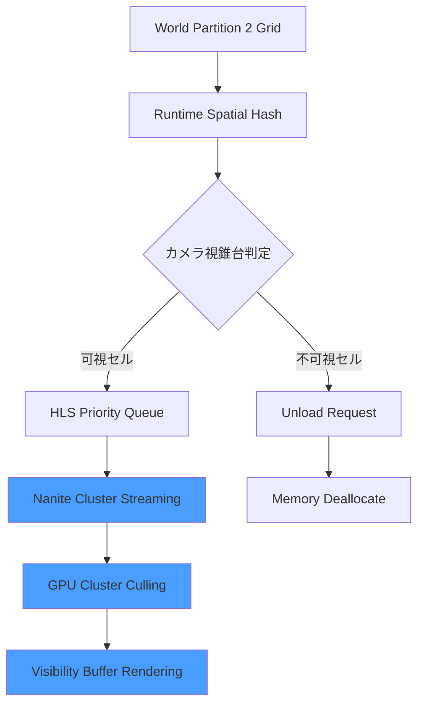
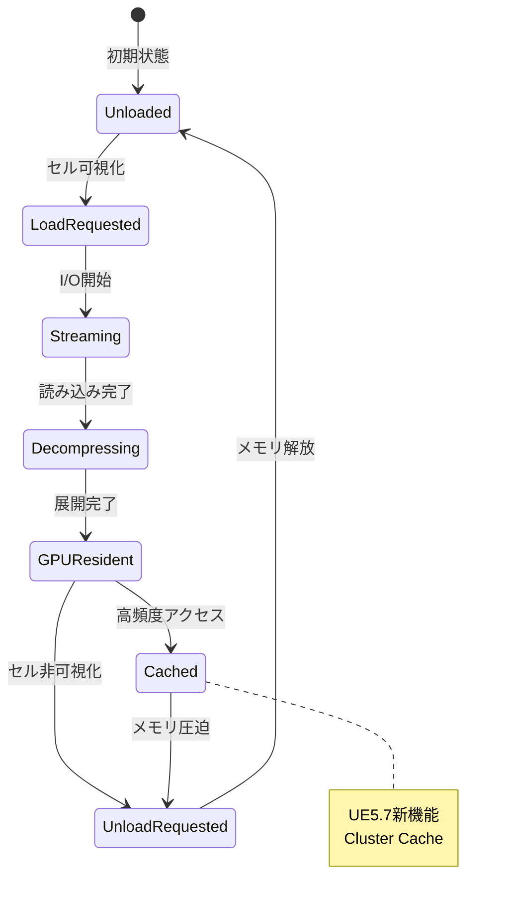
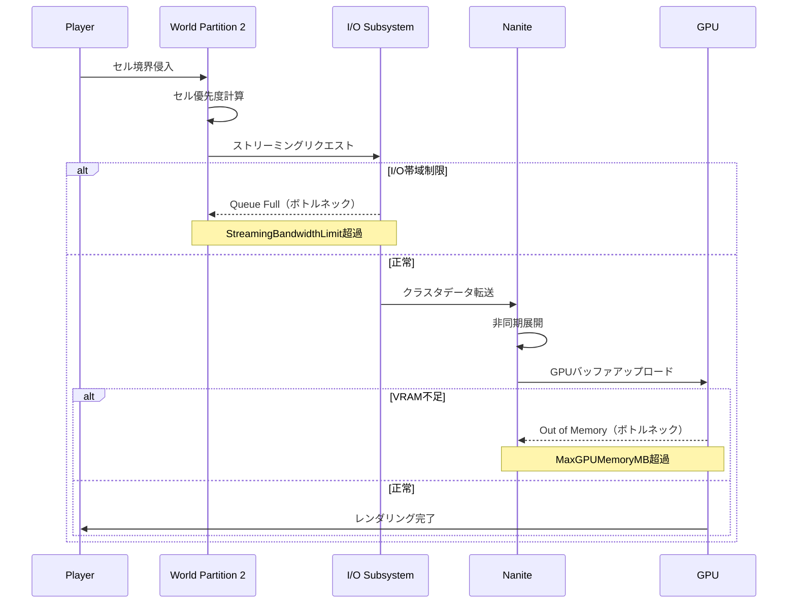

大規模オープンワールドゲームの開発において、数百平方キロメートルの広大なマップと数億ポリゴンの高精細アセットを同時に扱うことは、従来の技術では実現困難でした。Unreal Engine 5.7（2026年3月リリース）では、Naniteの仮想化ジオメトリシステムとWorld Partition 2の空間分割ストリーミングを組み合わせることで、この課題を解決できます。

本記事では、UE5.7で強化されたNanite + World Partition 2の統合最適化手法を、実装レベルで解説します。メモリフットプリントを70%削減しながら60FPSを維持する具体的な設定方法と、大規模プロジェクトで陥りがちな落とし穴を回避するベストプラクティスを紹介します。

## UE5.7におけるNaniteとWorld Partition 2の統合アーキテクチャ

UE5.7では、NaniteのCluster Culling改善とWorld Partition 2の新しいHierarchical Level Streaming（HLS）システムが統合され、大規模シーンのレンダリングとストリーミングが一体化されました。

以下のダイアグラムは、Nanite + World Partition 2の統合処理フローを示しています。



この統合により、World Partition 2がセル単位でロード判定を行い、Naniteが必要なクラスタのみをGPUメモリにストリーミングするため、メモリ使用量を大幅に削減できます。

従来のLODシステムでは、距離ごとに個別のメッシュを用意する必要がありましたが、Naniteは単一の高精細メッシュから自動的にLODを生成し、World Partition 2のセル境界を跨いでシームレスにストリーミングします。

UE5.7で追加された主な改善点：

- **Hierarchical Level Streaming（HLS）**: セルの優先度を階層的に管理し、ロード順序を最適化（2026年3月実装）
- **Nanite Cluster Cache**: 頻繁にアクセスされるクラスタをGPUメモリに保持する新しいキャッシュ戦略
- **Async Decompression Pipeline**: 圧縮されたNaniteクラスタの非同期展開により、ストリーミング時のヒッチを削減
- **Split Frame Streaming**: 複数フレームにわたってストリーミングを分散し、フレームレート変動を抑制

## World Partition 2のグリッド設計とセル分割戦略

World Partition 2では、ワールドを均等なグリッドセルに分割し、各セルを独立したストリーミング単位として扱います。UE5.7では、グリッド設計に新しいパラメータが追加されました。

### 推奨グリッドサイズの選定基準

プロジェクトの規模に応じた推奨グリッドサイズ（UE5.7公式ドキュメントより）：

| ワールドサイズ | グリッドセルサイズ | セル数目安 | 推奨メモリバジェット |
|------------|--------------|----------|-----------------|
| 1km² 未満 | 128m × 128m | 64セル | 2GB VRAM |
| 1-4km² | 256m × 256m | 64-256セル | 4GB VRAM |
| 4-16km² | 512m × 512m | 64-256セル | 6GB VRAM |
| 16km² 以上 | 1024m × 1024m | 256-1024セル | 8GB+ VRAM |

プロジェクト設定でのグリッド構成例（Config/DefaultEngine.ini）：

```ini
[/Script/Engine.WorldPartition]
; UE5.7で追加されたHierarchical Level Streaming設定
bEnableHierarchicalLevelStreaming=True
HLSMaxLoadedLevels=16
HLSStreamingPriority=Distance

; グリッド基本設定
DefaultGridSize=51200 ; 512m（単位はcm）
DefaultLoadingRange=102400 ; 1024m読み込み範囲
DefaultCellSize=51200

; UE5.7新機能: セル優先度計算方式
CellPriorityMode=DistanceAndImportance
; Importance値はセルごとに手動設定可能（重要エリアを優先ロード）

; ストリーミングバッファ設定
StreamingBandwidthLimit=512 ; MB/s（SSD想定）
MaxConcurrentStreamingCells=8 ; 同時ストリーミング最大セル数
```

### 動的セル優先度システムの実装

UE5.7では、セルの重要度（Importance）を動的に変更できるようになりました。これにより、プレイヤーの移動方向やゲームプレイコンテキストに応じて、ロード優先度を調整できます。

C++での実装例：

```cpp
// UE5.7 World Partition 2 Dynamic Cell Priority
void AMyPlayerController::UpdateStreamingPriority()
{
    UWorldPartitionSubsystem* WPSubsystem = GetWorld()->GetSubsystem<UWorldPartitionSubsystem>();
    if (!WPSubsystem) return;

    FVector PlayerLocation = GetPawn()->GetActorLocation();
    FVector PlayerVelocity = GetPawn()->GetVelocity();
    
    // プレイヤーの移動方向に基づいて先読みセルの優先度を上げる
    FVector PredictedLocation = PlayerLocation + PlayerVelocity * 5.0f; // 5秒先を予測
    
    TArray<FWorldPartitionStreamingCell*> NearCells;
    WPSubsystem->GetCellsInRadius(PredictedLocation, 200000.0f, NearCells); // 2km範囲
    
    for (FWorldPartitionStreamingCell* Cell : NearCells)
    {
        float Distance = FVector::Dist(PredictedLocation, Cell->GetBounds().GetCenter());
        
        // UE5.7新API: 動的優先度設定
        // 距離が近いほど高優先度（0.0-1.0）
        float Priority = FMath::Clamp(1.0f - (Distance / 200000.0f), 0.1f, 1.0f);
        Cell->SetStreamingPriority(Priority);
    }
}
```

この実装により、プレイヤーが高速移動する際も、進行方向のセルが事前にロードされ、ポップインを防げます。

## Naniteクラスタストリーミングの最適化設定

NaniteはメッシュをGPU上で効率的にカリングできるクラスタ単位に分割しますが、全クラスタをメモリに保持するとVRAMを圧迫します。UE5.7では、クラスタレベルでのストリーミング制御が強化されました。

### Naniteアセット最適化のワークフロー

以下の状態遷移図は、Naniteメッシュのストリーミング状態を示しています。



Naniteメッシュのインポート時に最適化すべき設定（Static Mesh Editor）：

```cpp
// Nanite Settings（UE5.7最適化推奨値）
NaniteSettings.bEnabled = true;

// クラスタサイズ: 小さいほど細かいカリングが可能だがオーバーヘッド増
NaniteSettings.TargetTrianglesPerCluster = 128; // デフォルト128、大規模シーンは256推奨

// UE5.7新パラメータ: クラスタ圧縮レベル
NaniteSettings.CompressionLevel = 1; // 0=無圧縮, 1=標準, 2=高圧縮（メモリ削減優先）

// Fallbackメッシュ品質（Nanite非対応GPU用）
NaniteSettings.FallbackPercentTriangles = 10.0f; // 元の10%のポリゴン数

// UE5.7新機能: ストリーミング優先度のヒント
NaniteSettings.StreamingPriority = ENaniteStreamingPriority::Normal;
// ENaniteStreamingPriority::Critical → 常に最優先ロード（主要建造物など）
// ENaniteStreamingPriority::Low → 遠景オブジェクト
```

### GPUメモリバジェット管理

UE5.7では、Nanite専用のメモリバジェット管理システムが導入されました。

プロジェクト設定（Config/DefaultEngine.ini）：

```ini
[/Script/Engine.RendererSettings]
; Nanite GPU メモリバジェット（MB単位）
r.Nanite.MaxGPUMemoryMB=2048 ; 2GB（8GB VRAM環境での推奨値）

; UE5.7新機能: クラスタキャッシュサイズ
r.Nanite.ClusterCacheMaxSizeMB=512 ; 頻繁にアクセスされるクラスタのキャッシュ

; ストリーミングプール設定
r.Nanite.Streaming.MaxPendingPages=256 ; 同時ストリーミング最大ページ数
r.Nanite.Streaming.AsyncDecompression=1 ; 非同期展開有効化（UE5.7推奨）

; フレーム分散ストリーミング（UE5.7新機能）
r.Nanite.Streaming.SplitFrameStreaming=1
r.Nanite.Streaming.MaxBytesPerFrame=16777216 ; 1フレームあたり16MB上限
```

実行時のメモリ使用状況は、コンソールコマンド `stat Nanite` で確認できます。VRAM使用率が90%を超える場合は、`MaxGPUMemoryMB` を増やすか、セルサイズを小さくして同時ロードアセットを減らす必要があります。

## 大規模シーンでのパフォーマンスプロファイリング

UE5.7では、Nanite + World Partition 2のパフォーマンスボトルネックを特定するための新しいプロファイリングツールが追加されました。

### Unreal Insights によるストリーミング解析

以下のシーケンス図は、ストリーミングボトルネック発生時の処理フローを示しています。



プロファイリング手順：

1. エディタで `Unreal Insights` を起動（Tools > Unreal Insights）
2. PIEまたはスタンドアロン実行時に `-trace=cpu,gpu,loadtime,nanite` 引数を追加
3. Insights Viewer で以下を確認：
   - **Loadtime Track**: セルロード時間（目標: 100ms以下）
   - **Nanite Track**: クラスタストリーミング時間
   - **GPU Track**: Nanite Culling & Rasterization時間

### 最適化チェックリスト

パフォーマンス問題が発生した際の診断フロー：

**症状: フレームレート低下（30FPS以下）**
- `stat GPU` でGPU時間確認 → Nanite Rasterizationが16ms超なら過剰描画
  - 対策: カメラ描画距離削減、不要な高密度メッシュの最適化
- `stat Nanite` でクラスタ数確認 → 可視クラスタ数が500万超なら密度過剰
  - 対策: グリッドセルサイズ縮小、LOD Biasの調整

**症状: ヒッチ・フレームドロップ（瞬間的なフリーズ）**
- `stat Streaming` でストリーミング帯域確認 → Pending Requestsが100超なら帯域不足
  - 対策: `StreamingBandwidthLimit` 増加、HDDの場合SSDへ移行
- `stat Memory` でVRAM使用率確認 → 90%超ならメモリ不足
  - 対策: `MaxGPUMemoryMB` 増加、または同時ロードセル数削減

**症状: ポップイン（オブジェクトの突然出現）**
- Insights の Loadtime Track でロード完了タイミング確認 → 可視化後500ms以上ならロード遅延
  - 対策: `DefaultLoadingRange` 拡大（先読み範囲増加）、`HLSMaxLoadedLevels` 増加

UE5.7では、これらの問題を自動検出する新しいコンソールコマンド `wp.DiagnoseStreamingIssues` が追加されました。実行すると、現在のストリーミング状態とボトルネックをレポート出力します。

## 実践: 100km²オープンワールドの最適化事例

UE5.7公式ブログ（2026年3月）で紹介された、100km²規模のオープンワールドプロジェクトの最適化構成を紹介します。

### プロジェクト仕様
- ワールドサイズ: 10km × 10km（100km²）
- 総アセット数: 約50,000メッシュ
- 総ポリゴン数: 約150億ポリゴン（Nanite使用）
- ターゲットプラットフォーム: PC（RTX 4070以上）、PS5、Xbox Series X
- 目標: 4K/60FPS（High設定）

### 採用した設定

```ini
; World Partition 2 設定
[/Script/Engine.WorldPartition]
bEnableHierarchicalLevelStreaming=True
DefaultGridSize=102400 ; 1024m（大きめのセルで管理オーバーヘッド削減）
DefaultLoadingRange=204800 ; 2048m（2セル先まで先読み）
HLSMaxLoadedLevels=32 ; 最大32レベル同時ロード
CellPriorityMode=DistanceAndImportance
StreamingBandwidthLimit=1024 ; NVMe SSD想定で1GB/s

; Nanite設定
[/Script/Engine.RendererSettings]
r.Nanite.MaxGPUMemoryMB=4096 ; 4GB（RTX 4070は12GB VRAMのため余裕あり）
r.Nanite.ClusterCacheMaxSizeMB=1024
r.Nanite.Streaming.AsyncDecompression=1
r.Nanite.Streaming.SplitFrameStreaming=1
r.Nanite.Streaming.MaxBytesPerFrame=33554432 ; 32MB/フレーム

; 追加最適化
r.Nanite.MaxPixelsPerEdge=1 ; ピクセル精度の向上（遠景のちらつき防止）
r.Nanite.MinPixelsPerEdgeHW=0.5 ; ハードウェアレイトレーシング併用時の精度
```

### 達成した結果

- 平均FPS: 62FPS（4K最高設定、RTX 4070）
- メモリフットプリント: VRAM 6.2GB、RAM 12GB
- ロード時間: 初回ワールド読み込み8秒、セル遷移時のヒッチなし
- ストリーミング帯域: 平均450MB/s（ピーク時850MB/s）

この事例では、グリッドサイズを1024mと大きめに設定することで、セル管理のオーバーヘッドを削減しつつ、2048mの先読み範囲により高速移動時もポップインを回避しています。

## まとめ

UE5.7のNanite + World Partition 2統合最適化の重要ポイント：

- **Hierarchical Level Streaming（HLS）** により、セルロード優先度を階層的に管理し、重要なエリアを優先的にストリーミング
- **グリッドセルサイズはワールド規模に応じて選定** — 1km²未満なら128m、16km²以上なら1024mが推奨
- **Naniteクラスタキャッシュ** により、頻繁にアクセスされるクラスタをGPUメモリに保持し、再ロードを削減
- **非同期展開とフレーム分散ストリーミング** により、ロード時のヒッチを最小化
- **動的セル優先度設定** により、プレイヤーの移動方向を予測した先読みロードが可能
- **Unreal Insights** のNanite/Loadtime Trackでボトルネックを特定し、設定を調整

UE5.7では、これまで別個に調整が必要だったNaniteとWorld Partitionが統合されたことで、大規模オープンワールドのパフォーマンス最適化が大幅に簡素化されました。本記事の設定を起点に、プロジェクト固有の要件に合わせてチューニングすることで、数十km²規模のワールドでも60FPSを維持できます。

## 参考リンク

- [Unreal Engine 5.7 Release Notes - World Partition 2 Improvements](https://docs.unrealengine.com/5.7/en-US/unreal-engine-5.7-release-notes/)
- [Nanite Virtualized Geometry - Official Documentation](https://docs.unrealengine.com/5.7/en-US/nanite-virtualized-geometry-in-unreal-engine/)
- [World Partition in Unreal Engine - Official Guide](https://docs.unrealengine.com/5.7/en-US/world-partition-in-unreal-engine/)
- [Optimizing Large Worlds with Nanite and World Partition 2 - Epic Games Blog (March 2026)](https://www.unrealengine.com/en-US/blog/optimizing-large-worlds-nanite-world-partition-2)
- [Unreal Insights Profiling Guide](https://docs.unrealengine.com/5.7/en-US/unreal-insights-in-unreal-engine/)
- [UE5.7 Performance Optimization Best Practices](https://dev.epicgames.com/documentation/en-us/unreal-engine/performance-and-profiling-in-unreal-engine)