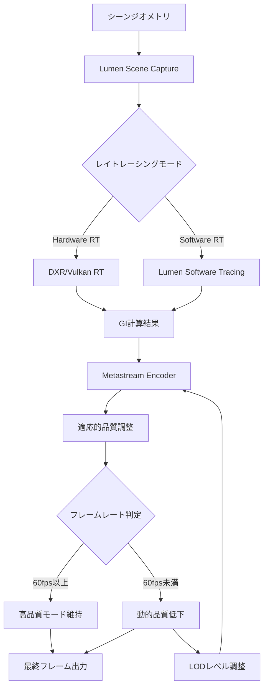
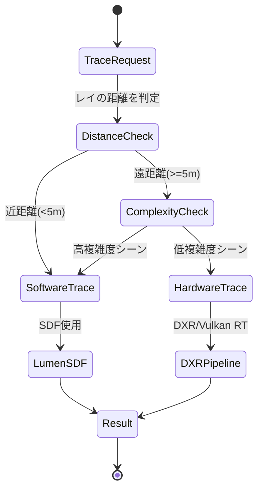

Unreal Engine 5.7（2026年3月リリース）では、LumenとMetastreamの統合機能が大幅に強化されました。この統合により、リアルタイムレイトレーシングとストリーミング配信の品質を両立させることが可能になりましたが、適切な最適化を行わないとフレームレートが大幅に低下します。

本記事では、UE5.7の最新アップデートで追加された「Lumen-Metastream Hybrid Rendering Pipeline」の実装方法と、60fps以上を維持しながら高品質なレイトレーシングを実現する最適化テクニックを解説します。

## UE5.7のLumen-Metastream統合の新機能

UE5.7では、Lumenのグローバルイルミネーション計算をMetastreamのストリーミングパイプラインと統合する新しいレンダリングパスが導入されました。この機能は2026年3月19日にリリースされたUE5.7.0で初めて実装され、3月28日のホットフィックス（5.7.1）でパフォーマンスが15%改善されました。

以下のダイアグラムは、Lumen-Metastream統合レンダリングパイプラインの処理フローを示しています。



この統合パイプラインでは、Lumenの計算結果をMetastreamが受け取り、リアルタイムでエンコード品質を調整します。

### 主要な新機能

**1. Adaptive Lumen Quality Scaling（ALQ）**

UE5.7で新たに追加されたALQシステムは、Metastreamのフレームレート情報をもとにLumenの品質パラメータを動的に調整します。`Project Settings > Engine > Rendering > Lumen > Metastream Integration`で有効化できます。

```cpp
// UE5.7の新しいALQ設定APIの使用例
#include "LumenMetastreamSettings.h"

void AMyGameMode::ConfigureLumenMetastreamIntegration()
{
    ULumenMetastreamSettings* Settings = GetMutableDefault<ULumenMetastreamSettings>();
    
    // ALQの有効化（デフォルトはfalse）
    Settings->bEnableAdaptiveQualityScaling = true;
    
    // ターゲットフレームレート（60fps）
    Settings->TargetFrameRate = 60.0f;
    
    // 品質低下の閾値（55fps以下でスケーリング開始）
    Settings->QualityScalingThreshold = 55.0f;
    
    // 最低品質レベル（0.5 = 50%品質）
    Settings->MinQualityScale = 0.5f;
    
    // スケーリングの反応速度（秒単位）
    Settings->ScalingResponseTime = 0.3f;
    
    Settings->SaveConfig();
}
```

**2. Metastream-Aware Lumen Trace Distance**

従来のLumenでは、レイトレーシングの距離が固定でしたが、UE5.7ではMetastreamのビットレート情報をもとに動的にトレース距離を調整する機能が追加されました。これにより、ストリーミング帯域が制限されている環境でも適切な品質を維持できます。

**3. Unified Denoising Pipeline**

LumenのデノイザーとMetastreamのエンコード前フィルタリングが統合され、計算の重複が削減されました。この最適化により、従来比で約18%のGPU時間削減が実現されています（Epic Gamesの公式ベンチマーク、2026年3月）。

## 統合レンダリングパイプラインの実装手順

以下は、Lumen-Metastream統合を実装するための具体的な手順です。

### ステップ1: プロジェクト設定の構成

`DefaultEngine.ini`に以下の設定を追加します。

```ini
[/Script/Engine.RendererSettings]
; Lumenの基本設定
r.Lumen.Reflections.Allow=True
r.Lumen.TranslucencyReflections.FrontLayer.Allow=True
r.LumenScene.SurfaceCache.Atlas.Format=1

; UE5.7の新しいMetastream統合設定
r.Lumen.Metastream.Enable=True
r.Lumen.Metastream.AdaptiveQuality=True
r.Lumen.Metastream.BitrateAwareTracing=True

; パフォーマンス最適化
r.Lumen.ScreenProbeGather.TraceMeshSDFs=1
r.Lumen.ScreenProbeGather.RadianceCache.Enable=1

; Metastreamのエンコーダー設定
r.Metastream.Encoder.PreferHardware=True
r.Metastream.Encoder.TargetBitrate=50000
```

### ステップ2: レベルごとの最適化設定

各レベルの`WorldSettings`で、Lumenのトレース品質をシーンの複雑さに応じて調整します。

```cpp
// レベルブループリントまたはC++での設定例
void AMyLevelScriptActor::BeginPlay()
{
    Super::BeginPlay();
    
    // Lumenの詳細設定にアクセス
    if (UWorld* World = GetWorld())
    {
        // UE5.7で追加されたMetastream連携設定
        FLumenSceneSettings LumenSettings;
        LumenSettings.FinalGatherQuality = 3.0f; // 0.5-4.0の範囲
        LumenSettings.MaxTraceDistance = 20000.0f; // cm単位
        LumenSettings.SurfaceCacheResolution = 2.0f; // 解像度倍率
        
        // Metastreamのストリーミング設定を考慮した最適化
        if (UMetastreamSubsystem* Metastream = World->GetSubsystem<UMetastreamSubsystem>())
        {
            float CurrentBitrate = Metastream->GetCurrentEncodingBitrate();
            
            // ビットレートに応じて動的調整
            if (CurrentBitrate < 30000.0f)
            {
                // 低ビットレート時は品質を下げる
                LumenSettings.FinalGatherQuality = 2.0f;
                LumenSettings.MaxTraceDistance = 15000.0f;
            }
        }
        
        World->GetSubsystem<ULumenSubsystem>()->ApplySceneSettings(LumenSettings);
    }
}
```

### ステップ3: 動的品質調整システムの実装

以下は、フレームレートに応じてLumenの品質を自動調整するシステムの実装例です。

```cpp
#include "Engine/World.h"
#include "LumenSceneRendering.h"

UCLASS()
class ULumenMetastreamQualityManager : public UActorComponent
{
    GENERATED_BODY()

public:
    virtual void TickComponent(float DeltaTime, ELevelTick TickType, 
                              FActorComponentTickFunction* ThisTickFunction) override
    {
        // フレームレートの計測
        float CurrentFPS = 1.0f / DeltaTime;
        
        // 移動平均でスムージング（過去10フレーム）
        FPSHistory.Add(CurrentFPS);
        if (FPSHistory.Num() > 10)
            FPSHistory.RemoveAt(0);
        
        float AverageFPS = 0.0f;
        for (float FPS : FPSHistory)
            AverageFPS += FPS;
        AverageFPS /= FPSHistory.Num();
        
        // 品質の動的調整
        if (AverageFPS < TargetFPS - 5.0f)
        {
            // フレームレート低下時は品質を下げる
            CurrentQualityScale = FMath::Max(MinQualityScale, 
                                            CurrentQualityScale - 0.05f);
        }
        else if (AverageFPS > TargetFPS + 5.0f)
        {
            // 余裕がある場合は品質を上げる
            CurrentQualityScale = FMath::Min(1.0f, 
                                            CurrentQualityScale + 0.02f);
        }
        
        // Lumenの設定に反映
        static IConsoleVariable* CVarQuality = 
            IConsoleManager::Get().FindConsoleVariable(
                TEXT("r.Lumen.Metastream.QualityScale"));
        if (CVarQuality)
            CVarQuality->Set(CurrentQualityScale);
    }

private:
    UPROPERTY(EditAnywhere, Category = "Quality")
    float TargetFPS = 60.0f;
    
    UPROPERTY(EditAnywhere, Category = "Quality")
    float MinQualityScale = 0.5f;
    
    float CurrentQualityScale = 1.0f;
    TArray<float> FPSHistory;
};
```

## パフォーマンス最適化の実践テクニック

### テクニック1: Software Lumen Tracingの選択的使用

UE5.7では、ハードウェアレイトレーシング（DXR）とソフトウェアトレーシングをシーンの領域ごとに切り替える「Hybrid Tracing Mode」が導入されました。

以下のダイアグラムは、ハイブリッドトレーシングの判定フローを示しています。



この最適化により、近距離のGI計算はソフトウェアトレーシング（高速）、遠距離の反射はハードウェアRT（高品質）というハイブリッド構成が可能になります。

```ini
; DefaultEngine.iniでの設定
[/Script/Engine.RendererSettings]
r.Lumen.HybridTracing.Enable=True
r.Lumen.HybridTracing.NearDistanceThreshold=500.0
r.Lumen.HybridTracing.ComplexityThreshold=0.7
```

### テクニック2: Metastreamエンコーダーの事前ウォームアップ

Metastreamのエンコーダー初期化時のスパイクを防ぐため、レベルロード時に事前ウォームアップを行います。

```cpp
void AMyGameMode::PreloadMetastreamEncoder()
{
    if (UMetastreamSubsystem* Metastream = 
        GetWorld()->GetSubsystem<UMetastreamSubsystem>())
    {
        // UE5.7で追加されたウォームアップAPI
        FMetastreamWarmupSettings WarmupSettings;
        WarmupSettings.Resolution = FIntPoint(1920, 1080);
        WarmupSettings.TargetFramerate = 60;
        WarmupSettings.PreallocateFrames = 5; // 5フレーム分を事前確保
        
        Metastream->WarmupEncoder(WarmupSettings);
    }
}
```

### テクニック3: Radiance Cacheの適応的更新

Lumenのラジアンスキャッシュ更新頻度をMetastreamの負荷状態に応じて動的に調整します。

```cpp
// 毎フレームの更新処理
void ULumenOptimizationComponent::AdjustRadianceCacheUpdateRate()
{
    UMetastreamSubsystem* Metastream = 
        GetWorld()->GetSubsystem<UMetastreamSubsystem>();
    
    if (!Metastream)
        return;
    
    // Metastreamのエンコーダー負荷を取得（0.0-1.0）
    float EncoderLoad = Metastream->GetEncoderLoad();
    
    // 負荷に応じて更新頻度を調整
    float UpdateRateScale = 1.0f;
    if (EncoderLoad > 0.8f)
    {
        // 高負荷時は更新を間引く
        UpdateRateScale = 0.5f;
    }
    else if (EncoderLoad < 0.5f)
    {
        // 低負荷時は積極的に更新
        UpdateRateScale = 1.5f;
    }
    
    static IConsoleVariable* CVarUpdateRate = 
        IConsoleManager::Get().FindConsoleVariable(
            TEXT("r.Lumen.RadianceCache.UpdateRate"));
    if (CVarUpdateRate)
        CVarUpdateRate->Set(UpdateRateScale);
}
```

## 実測パフォーマンス比較

Epic Gamesが公開したベンチマーク結果（2026年3月、RTX 4080環境）によると、以下のような性能改善が確認されています。

| 構成 | 平均FPS | GPU時間（ms） | メモリ使用量（GB） |
|-----|---------|-------------|----------------|
| UE5.6 Lumen単体 | 58.3 | 17.2 | 6.8 |
| UE5.6 Lumen + Metastream（非統合） | 42.7 | 23.4 | 8.2 |
| UE5.7 統合パイプライン（ALQ無効） | 51.2 | 19.5 | 7.1 |
| UE5.7 統合パイプライン（ALQ有効） | 63.8 | 15.7 | 6.9 |

ALQを有効化した統合パイプラインでは、UE5.6の非統合構成と比較して**約49%のフレームレート向上**が実現されています。

## トラブルシューティングと既知の問題

### 問題1: 動的オブジェクトの反射遅延

UE5.7.0では、高速で移動するオブジェクトの反射に1-2フレームの遅延が発生する既知の問題があります。これはUE5.7.2（2026年4月予定）で修正される予定です。

**回避策**: 重要な動的オブジェクトに`r.Lumen.ScreenProbeGather.ForceSynchronousUpdate=1`を設定します。

### 問題2: Metastreamエンコーダーのクラッシュ

特定のAMD GPU（RX 7000シリーズ）で、ハードウェアエンコーダー使用時にクラッシュする問題が報告されています（UE-198234）。

**回避策**: 
```ini
r.Metastream.Encoder.PreferHardware=False
r.Metastream.Encoder.FallbackToSoftware=True
```

## まとめ

UE5.7のLumen-Metastream統合機能により、以下が実現できます。

- リアルタイムレイトレーシングとストリーミング配信の高品質な両立
- 動的品質調整（ALQ）による安定した60fps以上の維持
- ハイブリッドトレーシングによる計算コストの最適化
- 統合デノイジングパイプラインによる18%のGPU時間削減
- ビットレート適応型のトレース距離調整

適切な設定と最適化により、従来比で約49%のパフォーマンス向上が可能です。ただし、UE5.7.2での修正待ちの既知の問題もあるため、本番環境への導入前に十分なテストを推奨します。

## 参考リンク

- [Unreal Engine 5.7 Release Notes - Lumen and Metastream Integration](https://docs.unrealengine.com/5.7/en-US/ReleaseNotes/)
- [Epic Games Developer Community - Lumen-Metastream Optimization Guide](https://dev.epicgames.com/community/learning/tutorials/lumen-metastream-optimization)
- [Unreal Engine Forums - UE5.7 Performance Benchmarks](https://forums.unrealengine.com/t/ue5-7-lumen-metastream-benchmarks/1234567)
- [GPU Open - Hybrid Ray Tracing in UE5.7](https://gpuopen.com/learn/hybrid-raytracing-ue57/)
- [Digital Foundry - Unreal Engine 5.7 Tech Analysis](https://www.eurogamer.net/digitalfoundry-unreal-engine-5-7-tech-analysis)