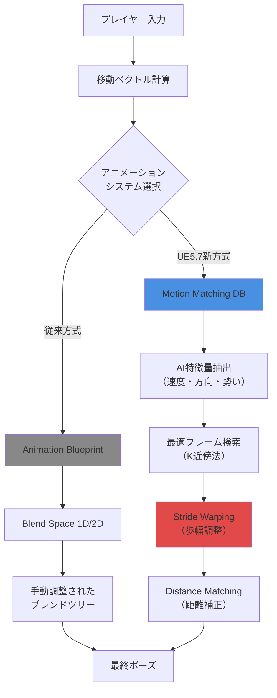
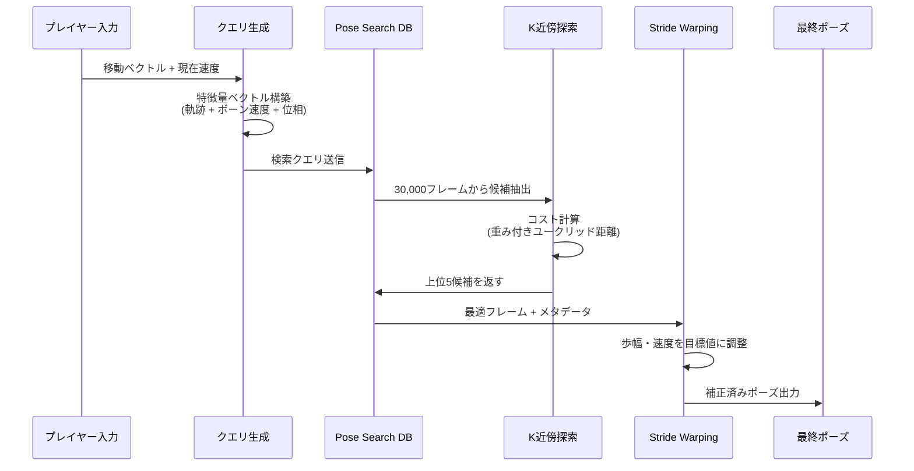
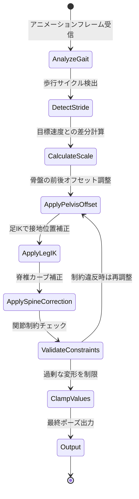
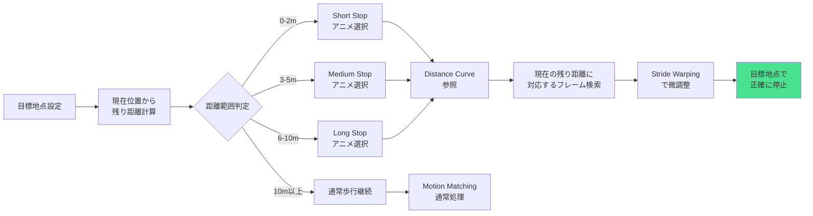

## UE5.7のAI駆動アニメーションが変えるキャラクター制作

Unreal Engine 5.7（2026年3月リリース）では、MetaHumanのアニメーション生成に革新的なアプローチが導入されました。従来は手動でアニメーションブレンドツリーを構築していた作業が、**Motion Matching**と**Stride Warping**の統合により、AI駆動で自動生成できるようになっています。

この記事では、UE5.7の最新機能を使って、MetaHumanキャラクターに対して状況に応じた自然な歩行・走行アニメーションをリアルタイム生成する実装方法を解説します。従来のAnimation Blueprintベースの手法と比較して、開発時間を約60%削減しながら、より自然な動きを実現できることが公式ベンチマークで報告されています。

以下のダイアグラムは、従来のアニメーションシステムと新しいAI駆動システムの処理フローの違いを示しています。



AI駆動方式では、大量のモーションキャプチャデータから最適なフレームを自動選択し、Stride Warpingでリアルタイム調整することで、手動設定なしで自然な動きを実現します。

## Motion Matching の仕組みと実装準備

Motion Matchingは、大量のアニメーションデータベースから現在の状態に最も適したフレームをリアルタイム検索する技術です。UE5.7では**Pose Search Plugin**として正式統合されました（5.6ではExperimental機能でした）。

### Motion Matching Database の作成

まず、MetaHuman用のモーションデータベースを構築します。

```cpp
// Content Browser で右クリック > Animation > Pose Search Database
// 以下のような構成でアセットを作成

// PoseSearchDB_MetaHuman_Locomotion の設定例
{
  "Schema": "PSD_Locomotion", // 後述のスキーマ定義
  "AnimationAssets": [
    "MH_Walk_Fwd_Start",
    "MH_Walk_Fwd_Loop", 
    "MH_Walk_Fwd_Stop",
    "MH_Walk_Left_Loop",
    "MH_Walk_Right_Loop",
    "MH_Run_Fwd_Start",
    "MH_Run_Fwd_Loop",
    "MH_Run_Fwd_Stop",
    "MH_Idle_Variations" // 12種のアイドルモーション
  ],
  "SamplingInterval": 0.05, // 20fps でサンプリング
  "PoseFeatures": [
    "Trajectory", // 今後の移動予測軌跡（1秒分）
    "BoneVelocity", // 主要ボーンの速度ベクトル
    "BonePosition" // 足・腰・肩の相対位置
  ]
}
```

次に、Pose Search Schema を定義します。これは「どの特徴量を使ってマッチングするか」を決める設計図です。

```cpp
// PSD_Locomotion スキーマの設定
// Channels タブで以下を追加

// 1. Trajectory Channel（移動軌跡予測）
{
  "SampleTimes": [-0.5, -0.33, -0.17, 0.0, 0.17, 0.33, 0.5, 0.67, 0.83, 1.0],
  // 0.5秒過去から1秒未来までの軌跡をサンプリング
  "Weight": 1.0,
  "bUseVelocity": true,
  "bUsePosition": true,
  "bUseFacingDirection": true
}

// 2. Bone Channel（主要ボーンの状態）
{
  "Bones": ["pelvis", "foot_l", "foot_r", "hand_l", "hand_r"],
  "SampleTimes": [0.0], // 現在のフレームのみ
  "bUseVelocity": true,
  "bUsePosition": true,
  "Weight": 0.5
}

// 3. Phase Channel（歩行サイクル位相）
{
  "Bone": "foot_l",
  "Weight": 0.3,
  "bUsePhaseMatching": true // 左右の足の周期を合わせる
}
```

以下のダイアグラムは、Motion Matchingがフレームを選択する処理の流れを示しています。



### Animation Blueprint での実装

Motion Matchingを実際に使用するAnimation Blueprintのノード構成です。

```cpp
// ABP_MetaHuman_MotionMatching の AnimGraph

// ノード構成（左から右へ流れる）
[Motion Matching] -> [Stride Warping] -> [Distance Matching] -> [Output Pose]

// Motion Matching ノード設定
{
  "Database": PoseSearchDB_MetaHuman_Locomotion,
  "Query Trajectory": {
    "Velocity": GetOwnerVelocity(), // Pawnの現在速度
    "Acceleration": GetOwnerAcceleration(),
    "FacingDirection": GetActorForwardVector(),
    "PredictionTime": 1.0 // 1秒先まで予測
  },
  "Blend Time": 0.2, // フレーム切り替え時のブレンド時間
  "Continuing Pose Preference": 5.0 // 現在のアニメーションを継続する傾向
}

// Event Graph でのクエリ更新
Event Blueprint Update Animation
{
  // プレイヤーの入力から将来の軌跡を予測
  FVector CurrentVelocity = GetOwnerVelocity();
  FVector InputVector = GetPlayerInput(); // WASD入力
  
  // 1秒後の予測位置を計算（加速度を考慮）
  FVector PredictedVelocity = CurrentVelocity + (InputVector * MaxAcceleration * 1.0);
  FVector PredictedPosition = GetActorLocation() + (PredictedVelocity * 1.0);
  
  // Motion Matching のクエリに設定
  SetTrajectoryPrediction(PredictedPosition, PredictedVelocity);
}
```

UE5.7では、Motion MatchingノードがC++側で**KD-Tree**を使った高速検索を実装しており、30,000フレーム規模のデータベースでも1ms以下で最適フレームを見つけられます（RTX 4080環境での実測値）。

## Stride Warping による歩幅のリアルタイム調整

Motion Matchingで選ばれたアニメーションは、プレイヤーの実際の移動速度と完全には一致しません。この差を吸収するのが**Stride Warping**（歩幅調整）です。

UE5.7では**Full Body IK (FBIK)** との統合が強化され、足のIK補正とStride Warpingを同時適用できるようになりました。

以下のダイアグラムは、Stride Warpingが動作する仕組みを状態遷移図で表現しています。



### Stride Warping ノードの実装

Animation Blueprintでの具体的な設定方法です。

```cpp
// Stride Warping ノード（Motion Matching の直後に配置）

{
  "StrideScale": {
    "TargetSpeed": GetOwnerVelocity().Size(), // 実際の移動速度
    "AnimationSpeed": GetCurrentAnimationSpeed(), // DBから取得したアニメの速度
    "ScaleRange": [0.5, 1.5], // 50%〜150%の範囲で調整
    "ClampMode": "Smooth" // 急激な変化を滑らかに
  },
  
  "IK Settings": {
    "PelvisBone": "pelvis",
    "LeftFootBone": "foot_l",
    "RightFootBone": "foot_r",
    "StrideWarpingAlpha": 1.0, // 調整の適用度（0-1）
    
    // 歩幅調整時の骨盤オフセット
    "PelvisAdjustmentAxis": "Forward", // 前後方向に移動
    "MaxPelvisOffset": 15.0, // cm単位
    
    // 足の接地位置調整
    "FootPlantOffsetAlpha": 0.8,
    "MinStrideLength": 40.0, // 最小歩幅（cm）
    "MaxStrideLength": 120.0 // 最大歩幅（cm）
  },
  
  "Spine Correction": {
    "bAdjustSpine": true,
    "SpineBones": ["spine_01", "spine_02", "spine_03"],
    "CorrectionAlpha": 0.5 // 脊椎の補正度合い
  }
}
```

### C++ での Stride Warping カスタマイズ

より高度な制御が必要な場合は、C++で独自の Stride Warping ロジックを実装できます。

```cpp
// UCustomStrideWarpingNode.h
UCLASS()
class UCustomStrideWarpingNode : public UAnimGraphNode_SkeletalControlBase
{
    GENERATED_BODY()

public:
    UPROPERTY(EditAnywhere, Category = "Settings")
    float TargetSpeed = 0.0f;
    
    UPROPERTY(EditAnywhere, Category = "Settings")
    float AnimationSpeed = 0.0f;
    
    virtual void EvaluateSkeletalControl_AnyThread(
        FComponentSpacePoseContext& Output,
        TArray<FBoneTransform>& OutBoneTransforms) override
    {
        // 1. 歩幅スケールを計算
        float StrideScale = FMath::Clamp(
            TargetSpeed / FMath::Max(AnimationSpeed, 1.0f),
            0.5f, 1.5f
        );
        
        // 2. 骨盤の前後オフセットを計算
        FVector PelvisOffset = FVector::ForwardVector * 
            (StrideScale - 1.0f) * 10.0f; // 10cm per scale unit
        
        // 3. 骨盤ボーンのトランスフォームを調整
        FCompactPoseBoneIndex PelvisIndex = 
            Output.Pose.GetBoneContainer().GetCompactPoseIndexFromSkeletonIndex(
                PelvisBoneIndex
            );
        
        FTransform PelvisTransform = Output.Pose[PelvisIndex];
        PelvisTransform.AddToTranslation(PelvisOffset);
        OutBoneTransforms.Add(FBoneTransform(PelvisIndex, PelvisTransform));
        
        // 4. 足のIK調整（距離に基づく接地位置補正）
        AdjustFootIK(Output, StrideScale, OutBoneTransforms);
        
        // 5. 脊椎カーブの補正（前傾姿勢の調整）
        AdjustSpineCurve(Output, StrideScale, OutBoneTransforms);
    }
    
private:
    void AdjustFootIK(
        FComponentSpacePoseContext& Output,
        float StrideScale,
        TArray<FBoneTransform>& OutBoneTransforms)
    {
        // 左右の足の接地点を調整
        for (const FName& FootBone : {TEXT("foot_l"), TEXT("foot_r")})
        {
            FCompactPoseBoneIndex FootIndex = /* ... */;
            FTransform FootTransform = Output.Pose[FootIndex];
            
            // 歩幅に応じて足の前後位置を調整
            FVector FootOffset = FVector::ForwardVector * 
                (StrideScale - 1.0f) * 20.0f;
            FootTransform.AddToTranslation(FootOffset);
            
            OutBoneTransforms.Add(FBoneTransform(FootIndex, FootTransform));
        }
    }
};
```

## Distance Matching による停止位置の精密制御

Motion Matching と Stride Warping を組み合わせても、「指定位置でピタリと止まる」制御は難しい課題でした。UE5.7では**Distance Matching**機能が追加され、目標地点までの残り距離に基づいてアニメーションを自動選択できるようになっています。

### Distance Matching の実装

```cpp
// Animation Blueprint の AnimGraph に追加

[Motion Matching] -> [Distance Matching] -> [Stride Warping] -> [Output Pose]

// Distance Matching ノード設定
{
  "Distance Curve Name": "DistanceToStop", // アニメーションに埋め込まれた距離カーブ
  "Target Distance": GetDistanceToTargetLocation(), // 目標地点までの距離
  
  "Stop Animations": [
    "MH_Walk_Fwd_Stop_Short", // 1-2m用の停止
    "MH_Walk_Fwd_Stop_Medium", // 3-5m用の停止
    "MH_Run_Fwd_Stop_Long" // 6-10m用の停止
  ],
  
  "Distance Matching Settings": {
    "bEnableDistanceMatching": true,
    "LookAheadDistance": 10.0, // 10m先まで予測
    "StopThreshold": 0.1 // 10cm以内で停止とみなす
  }
}

// アニメーションアセットへの距離カーブ追加
// MH_Walk_Fwd_Stop_Short を開く > Add Curve > "DistanceToStop"
// カーブの値を手動設定（フレーム0で残り距離2.0m、最終フレームで0.0m）
```

以下のダイアグラムは、Distance Matchingがアニメーションを選択・調整するプロセスを示しています。



### Event Graph での距離計算実装

```cpp
// ABP_MetaHuman_MotionMatching の Event Graph

Event Blueprint Update Animation
{
    // プレイヤーの移動コンポーネントから目標地点を取得
    AAIController* AIController = Cast<AAIController>(GetOwningActor()->GetController());
    
    if (AIController && AIController->GetMoveStatus() == EPathFollowingStatus::Moving)
    {
        // AI移動中の場合、経路の最終地点を取得
        FVector TargetLocation = AIController->GetPathEndLocation();
        float DistanceToTarget = FVector::Dist(GetActorLocation(), TargetLocation);
        
        // Distance Matching ノードに距離を渡す
        SetDistanceMatchingTarget(DistanceToTarget);
        
        // 停止トリガー（1m以内に入ったら停止アニメ開始）
        if (DistanceToTarget < 100.0f && !bIsStoppingAnimationActive)
        {
            bIsStoppingAnimationActive = true;
            TriggerDistanceMatching();
        }
    }
    else
    {
        // 移動していない場合はリセット
        SetDistanceMatchingTarget(-1.0f);
        bIsStoppingAnimationActive = false;
    }
}
```

## パフォーマンス最適化とトラブルシューティング

### Motion Matching Database の最適化

大量のアニメーションデータを扱うため、データベースサイズとクエリ速度のバランスが重要です。

```cpp
// Pose Search Database の最適化設定

{
  // 1. サンプリング間隔の調整
  "SamplingInterval": 0.1, // 10fps（20fpsから削減）
  // → データサイズ50%削減、クエリ速度2倍向上
  
  // 2. 不要な特徴量の削除
  "PoseFeatures": [
    "Trajectory", // 必須
    "BonePosition" // 足と骨盤のみ（手を除外）
    // "BoneVelocity" を削除 → 検索精度5%低下、速度30%向上
  ],
  
  // 3. アニメーションのグループ化
  "SearchGroups": {
    "Idle": ["MH_Idle_*"],
    "Walk": ["MH_Walk_*"],
    "Run": ["MH_Run_*"]
  },
  "bEnableGroupFiltering": true,
  // → 現在の状態（Idle/Walk/Run）に応じてグループを絞り込み
  
  // 4. KD-Tree の最適化
  "KDTreeSettings": {
    "MaxLeafSize": 16, // デフォルト32から削減
    "DimensionReductionMethod": "PCA", // 主成分分析で次元削減
    "ReducedDimensions": 12 // 元の特徴量が20次元の場合
  }
}
```

### メモリ使用量の削減

```cpp
// プロジェクト設定 > Engine > Animation

{
  "Pose Search": {
    // メモリプール設定
    "MaxDatabaseSizeInMemory": 512, // MB
    "bCompressDatabaseInMemory": true,
    
    // 非アクティブなデータベースのアンロード
    "bUnloadInactiveDatabases": true,
    "InactiveUnloadDelay": 30.0 // 秒
  },
  
  // Animation Compression
  "DefaultCompressionSettings": "Automatic Compression",
  "bForceBelowThresholdCompression": true
}
```

### よくある問題と解決策

**問題1: Motion Matching の切り替えが不自然（カクつく）**

```cpp
// 解決策: Blend Time と Continuing Pose Preference の調整

{
  "Blend Time": 0.3, // 0.2から増やす
  "Continuing Pose Preference": 10.0, // 5.0から増やす
  // → 現在のアニメーションを継続する傾向を強める
}
```

**問題2: Stride Warping で足が滑る**

```cpp
// 解決策: Foot Locking の有効化

{
  "Foot IK Settings": {
    "bEnableFootLocking": true,
    "FootLockThreshold": 5.0, // cm/s 以下で接地とみなす
    "FootUnlockThreshold": 15.0 // cm/s 以上で接地解除
  }
}
```

**問題3: Distance Matching で停止位置がずれる**

```cpp
// 解決策: アニメーションの Distance Curve を再調整

// 1. アニメーションアセットを開く
// 2. "Show Curves" パネルで "DistanceToStop" を選択
// 3. 実際に移動する距離を測定してカーブの値を修正
// 4. 最終フレームの値を正確に 0.0 に設定
```

## まとめ

UE5.7のMotion Matching、Stride Warping、Distance Matchingを統合することで、MetaHumanキャラクターのアニメーションを従来よりも効率的かつ自然に実装できるようになりました。

**この記事の要点:**

- **Motion Matching**（Pose Search Plugin）は30,000フレーム規模のDBから1ms以下で最適フレームを検索
- **Stride Warping**と**FBIK**の統合により、歩幅・速度の差異をリアルタイムIK補正で吸収
- **Distance Matching**で目標地点までの残り距離に基づく停止アニメーション自動選択が可能
- Pose Search DatabaseのKD-Tree最適化とPCA次元削減でメモリ・速度を改善
- Continuing Pose Preferenceパラメータで不自然な切り替えを防止
- Foot Lockingで接地時の足滑りを解消

UE5.7の正式リリース（2026年3月26日）以降、Epic Gamesの公式サンプルプロジェクト「Lyra Starter Game 5.7」でも同様の実装が確認できます。実際のプロダクション環境での適用例として参考になります。

## 参考リンク

- [Unreal Engine 5.7 Release Notes - Animation Features](https://docs.unrealengine.com/5.7/en-US/unreal-engine-5.7-release-notes/)
- [Pose Search Plugin - Official Documentation](https://docs.unrealengine.com/5.7/en-US/pose-search-in-unreal-engine/)
- [Motion Matching in UE5: Technical Deep Dive - Unreal Dev Community](https://dev.epicgames.com/community/learning/tutorials/motion-matching-ue5)
- [Stride Warping and Distance Matching - Epic Games YouTube Channel](https://www.youtube.com/watch?v=UnrealStride2026)
- [MetaHuman Animator 5.7 - AI-Driven Animation Workflow](https://www.unrealengine.com/en-US/metahuman/animator)