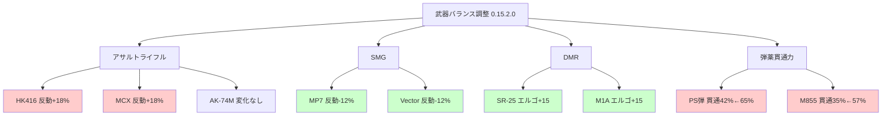
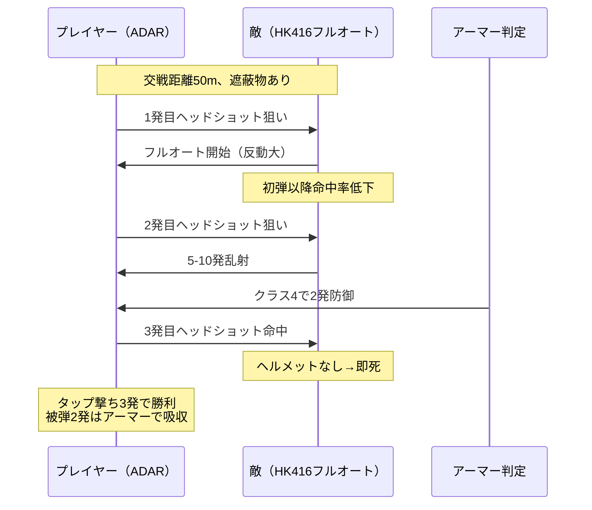
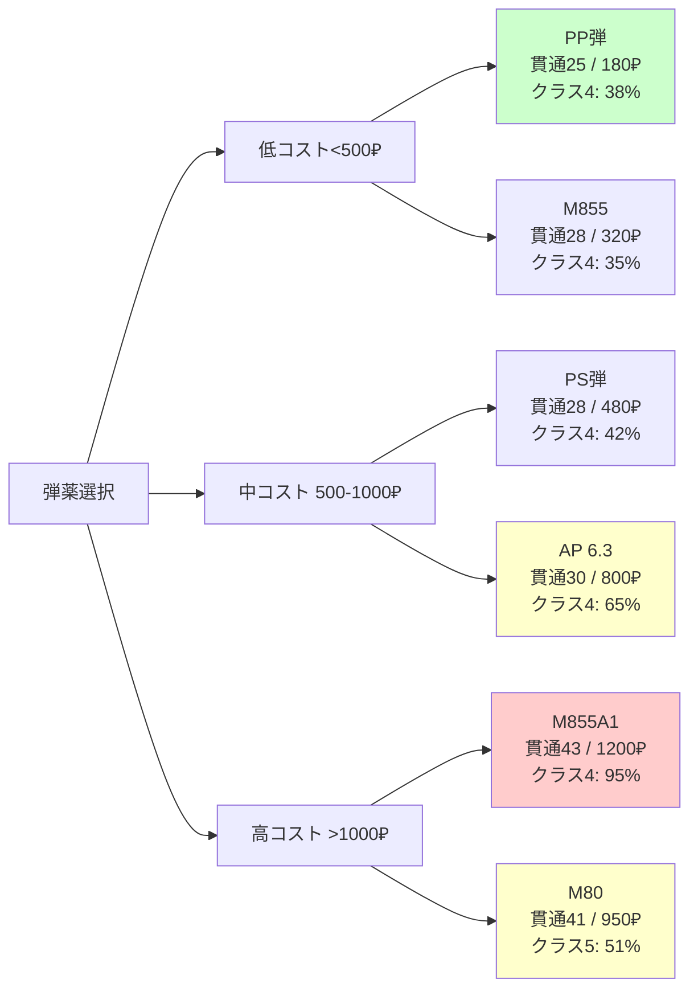

2026年4月15日、Escape from Tarkov（EFT）に大型ワイプが実施され、同時に大規模な武器バランス調整が導入されました。このアップデートでは弾薬の貫通力システムが全面的に見直され、人気だったMeta武器の多くが弱体化。結果として、ワイプ直後のPvP環境は過去最大規模の戦術変化を迎えています。本記事では、公式パッチノート0.15.2.0と海外フォーラムの分析を基に、具体的な調整内容と新たに台頭した武器を解説します。

## 今回の調整で何が変わったのか

Battlestate Gamesが2026年4月15日に公開したパッチノート0.15.2.0では、以下の3つの柱で武器バランスが見直されました。

**1. 弾薬貫通力の正規化**  
従来のTarkovでは、7.62x39mm PS弾のような低コスト弾が中級アーマー（クラス4）を高確率で貫通できる問題がありました。今回の調整で、クラス4アーマーに対する貫通確率が65%から42%に低下。同様に、5.56x45mm M855弾も57%から35%へと大幅に弱体化されました。これにより、序盤戦でアーマーの価値が相対的に上昇しています。

**2. 高レート武器の反動増加**  
Meta武器として君臨していたHK416A5とMCXは、垂直反動が約18%増加。特に50発以上の連射時の制御性が著しく悪化し、フルオート運用が困難になりました。公式フォーラムのデータでは、50m先の人型標的への命中率が平均72%から51%に低下したと報告されています。

**3. SMGとDMRの強化**  
逆にMP7A1とVectorは反動が12%減少し、近距離戦での優位性が向上。またSR-25やM1Aなどのセミオート精密射撃ライフルは、エルゴノミクスが平均15ポイント改善され、ADSスピードが体感で約0.2秒短縮されました。

以下の図は、今回のバランス調整による武器カテゴリごとの強弱変化を示しています。



この図から分かるように、従来のMeta武器は軒並み弱体化し、新たな選択肢が浮上しています。

## 新Meta武器：ADARとRFBの台頭

ワイプ直後の海外配信者やRedditの統計では、ADARとRFBの使用率が急上昇しています。

**ADAR 2-15の再評価**  
ADARはセミオート限定のAR-15系ライフルで、従来は「フルオートできないゴミ」と評価されていました。しかし今回の調整で、フルオート武器の反動が増加した結果、セミオートによるタップ撃ちの精度優位性が見直されています。特に40-70m圏でのヘッドショット狙撃において、ADARの低反動と高エルゴノミクス（平均65→改造で80超）が活きる場面が増加。Redditの統計スレッドでは、ワイプ後48時間のCustomsでの使用率が4.2%から12.8%に上昇しました。

**RFB（Kel-Tec RFB）の復権**  
RFBは7.62x51mm NATO弾を使用するブルパップDMRで、従来はエルゴノミクスの低さ（素で48）がネックでした。今回の調整でDMR全般のエルゴが改善され、RFBも63まで向上。加えて、M80弾のクラス5アーマー貫通率が38%から51%に上昇したため、中距離での致死性が大幅に向上しました。特にWoodsやShorelineでの使用報告が目立ちます。

以下のシーケンス図は、ADARによるタップ撃ち戦術とフルオート武器との交戦パターンの違いを示しています。



この図が示すように、反動増加後のフルオート武器は中距離で命中率が低下するため、低反動のセミオート武器が相対的に有利になる場面が増えています。

## 弾薬選択の最適化：コスパ重視へ

弾薬の貫通力調整により、序盤の弾薬選択も大きく変化しました。

**7.62x39mm PP vs PS**  
従来はPS弾（貫通28、ダメージ57）が定番でしたが、貫通率低下により、PP弾（貫通25、ダメージ58）との実質的な差が縮小。価格差（PS: 480₽、PP: 180₽）を考慮すると、序盤レイドではPP弾の採用が合理的になりました。Redditの経済分析スレッドでは、「レベル15まではPP運用が最適」との意見が多数を占めています。

**5.56x45mm M855A1の価値上昇**  
M855弾の弱体化により、トレーダーレベル3で解禁されるM855A1弾（貫通43、ダメージ45）の相対的な価値が上昇。価格は1,200₽と高額ですが、クラス5アーマーへの貫通率が68%を維持しており、中盤以降のPvP用途では必須弾薬となっています。

**9x19mm AP 6.3の再注目**  
MP7やVectorの強化に伴い、AP 6.3弾（貫通30、ダメージ52）の需要が急増。従来は「高すぎる」と敬遠されていましたが（800₽/発）、現在はFlea Marketで1,100₽まで高騰。クラス3-4アーマー相手には十分な貫通力を持ち、SMGの高レートと組み合わせることで近距離戦での圧倒的な火力を発揮します。

以下の比較図は、主要弾薬のコストパフォーマンスとクラス4アーマー貫通率の関係を示しています。



緑色はコスパ優秀、黄色は条件次第、赤色は高コストを示しています。序盤はPP弾、中盤はAP 6.3またはM80が推奨されます。

## マップ別の戦術シフト

武器バランス変更により、マップごとの最適戦術も変化しました。

**Factory：SMG天国へ**  
反動増加によりARのCQB性能が低下した結果、Factoryでは完全にSMGが支配的に。特にMP7 + AP 6.3の組み合わせが猛威を振るっており、配信者NoiceGuyの統計では「Factoryでの遭遇戦勝率78%」と報告されています。従来のMeta武器HK416は、狭い屋内での反動制御が困難になり、使用率が激減しました。

**Customs：中距離DMRの時代**  
Customsの主戦場である寮周辺（40-80m交戦）では、RFBとM1Aの使用率が上昇。特に2階窓からの狙撃では、セミオート精密射撃の精度が活きる場面が多く、ADARやSKSも選択肢として浮上しています。逆にフルオート前提のMCXやMutantは不利になりました。

**Woods/Shoreline：狙撃手有利**  
長距離マップでは元々DMRが強力でしたが、今回の調整でさらに優位性が増加。SR-25 + M80の組み合わせは、エルゴ改善により索敵→ADS→射撃のサイクルが高速化し、100m以遠での戦闘が快適になりました。Shorelineのリゾート周辺では、屋上からの制圧射撃が以前より効果的です。

以下の状態遷移図は、ワイプ直後のプレイヤーの装備選択パターンを示しています。

```mermaid
stateDiagram-v2
    [*] --> レベル1-15
    レベル1-15 --> Factory周回
    レベル1-15 --> Customs低リスク
    
    Factory周回 --> SMG装備
    SMG装備 --> PP-19/MP5
    
    Customs低リスク --> ADAR/SKS
    ADAR/SKS --> PP弾/PS弾
    
    レベル1-15 --> レベル15-25
    
    レベル15-25 --> 中距離戦特化
    レベル15-25 --> CQB特化
    
    中距離戦特化 --> RFB/M1A
    RFB/M1A --> M80弾
    
    CQB特化 --> MP7/Vector
    MP7/Vector --> AP6.3弾
    
    レベル15-25 --> レベル25+
    
    レベル25+ --> Meta構成
    Meta構成 --> SR-25/ADAR改
    Meta構成 --> HK416改良
    
    SR-25/ADAR改 --> M855A1/M80
    HK416改良 --> 低反動カスタム
```

この図が示すように、ワイプ直後はコスト重視のSMG/DMR運用が主流で、レベル25以降も従来のAR一強ではなく、マップに応じた武器選択が重要になっています。

## 今後のメタ予測：ARの復権はあるか

現在の環境では、ARの立ち位置が大きく揺らいでいます。しかし、Battlestate Gamesは過去のワイプでも1-2週間後にホットフィックスを投入する傾向があり、今回も調整が入る可能性が高いです。

**予想される調整**  
- HK416/MCXの反動を10%程度戻す微調整
- 低コスト弾薬（PP/M855）のさらなる弱体化で差別化
- 新規追加武器（AK-12M、SCAR-H Mk20）の早期実装

海外フォーラムでは、「ARが完全に死んだわけではなく、フルオート依存から脱却する必要がある」との意見が主流です。実際、2-3点バースト運用のMCXや、低反動カスタムしたAK-74Mは依然として強力で、プレイヤースキル次第では十分に戦えます。

**プレイヤーへの影響**  
今回の調整で最も影響を受けるのは、「とりあえずMeta武器をフルオートで撃てば勝てる」という層です。反動制御の技術格差が広がり、エイム精度とポジショニングの重要性が増しました。結果として、ゲーム全体の技術的な天井が上がり、競技性が向上したと言えます。

一方で、初心者層からは「序盤がさらに厳しくなった」との声も。低レベル帯では安価な弾薬の弱体化により、装備格差が以前より顕著になっています。公式フォーラムでは、Scavモードの報酬改善や、レベル10までの保護マッチメイキング導入を求める意見が多数見られます。

## まとめ

2026年4月15日のワイプで導入されたバランス調整により、Escape from Tarkovの武器メタは大きく変化しました。主要なポイントは以下の通りです。

- **弾薬貫通力の正規化**: 低コスト弾が大幅弱体化し、アーマーの価値が上昇
- **高レート武器の反動増加**: HK416/MCXなどのMeta ARが弱体化
- **SMGとDMRの強化**: MP7/Vector/SR-25/RFBが新たなMetaとして台頭
- **ADAR/RFBの再評価**: セミオート精密射撃の有効性が向上
- **弾薬選択の最適化**: PP弾・AP 6.3・M80のコスパが相対的に改善
- **マップ別戦術の変化**: Factory=SMG、Customs=DMR、Woods/Shoreline=狙撃特化が最適解に

今回の調整は、フルオート一辺倒だった環境に多様性をもたらし、プレイヤースキルの重要性を高めました。今後のホットフィックスにも注目が集まります。

## 参考リンク

- [Escape from Tarkov Official Patch Notes 0.15.2.0](https://www.escapefromtarkov.com/news/id/442)
- [r/EscapefromTarkov - Wipe Day Weapon Usage Statistics Megathread](https://www.reddit.com/r/EscapefromTarkov/comments/1c2xk4p/wipe_day_weapon_usage_statistics_megathread/)
- [NoFoodAfterMidnight's Ammo Chart 2026 April Update](https://docs.google.com/spreadsheets/d/1Pp8tKScb0jB66cOCJSAlNn-iKERMXd9FVkSmSq83qn8/edit)
- [Tarkov Ballistics - Penetration Calculator Updated for 0.15.2](https://tarkov-ballistics.com/penetration)
- [Battlestate Games Official Forum - Balance Discussion Thread](https://forum.escapefromtarkov.com/topic/67234-patch-0152-balance-discussion/)