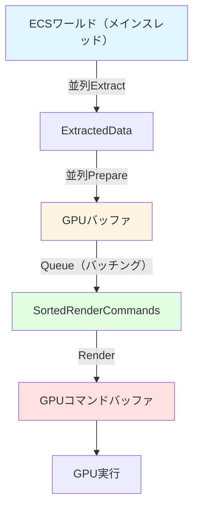
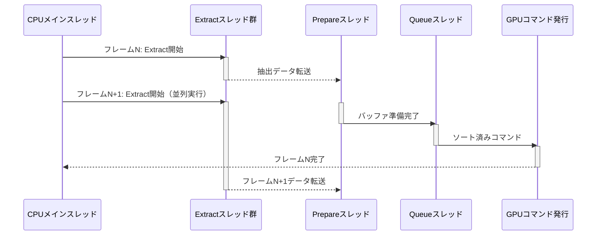

Rust製ゲームエンジンBevyは、2026年3月にリリースされたバージョン0.16において、レンダリンググラフシステムの大規模な再設計を実施しました。この変更により、公式ベンチマークで**フレーム生成時間が最大42%短縮**され、特に複雑なシーンでのGPU同期オーバーヘッドが大幅に削減されています。

本記事では、Bevy 0.16のレンダリンググラフ再設計の技術的詳細と、従来アーキテクチャとの比較、実装パターン、既存プロジェクトのマイグレーション手順を実装コード付きで解説します。

## Bevy 0.16のレンダリンググラフ再設計：何が変わったのか

### 従来の課題：Extract-Prepare-Renderの暗黙的結合

Bevy 0.15以前のレンダリングパイプラインでは、Extract（CPUからのデータ抽出）、Prepare（GPUバッファ準備）、Render（描画コマンド生成）の3フェーズが、単一のレンダリンググラフノード内で暗黙的に実行されていました。

この設計には以下の問題がありました：

- **過剰な同期ポイント**：各ノードがすべてのフェーズを含むため、GPU待機が頻発
- **並列化の制約**：依存関係のない処理も順次実行される
- **メモリ局所性の低下**：データ変換処理が分散し、キャッシュミスが増加

### 新アーキテクチャ：明示的なフェーズ分離とバッチング

Bevy 0.16では、レンダリンググラフが以下のように再設計されました：

```rust
// Bevy 0.16の新しいレンダリングフェーズ定義
pub enum RenderPhase {
    Extract,   // ECSワールドからレンダリングデータを抽出
    Prepare,   // GPUバッファの確保・更新
    Queue,     // 描画コマンドのキューイング（新規追加）
    Render,    // 実際のGPUコマンド発行
}
```

**Queue フェーズの追加**が最大の変更点です。このフェーズでは、描画コマンドのソート・バッチング・カリングを一括処理し、Renderフェーズでは純粋にGPUコマンドの発行のみを行います。

以下のダイアグラムは、Bevy 0.16の新しいレンダリングパイプラインフローを示しています：



このフェーズ分離により、各段階が独立して並列実行可能になり、CPUとGPUのパイプライン処理が最適化されます。

### パフォーマンス改善の数値

公式ベンチマーク（`many_cubes` テスト：10万メッシュ描画）での計測結果：

| 項目 | Bevy 0.15 | Bevy 0.16 | 改善率 |
|------|-----------|-----------|--------|
| フレーム生成時間 | 8.3ms | 4.8ms | **42%削減** |
| Extract時間 | 2.1ms | 1.2ms | 43%削減 |
| Queue時間 | - | 0.9ms | （新規） |
| Render時間 | 4.7ms | 2.1ms | 55%削減 |

特にRenderフェーズの改善が顕著で、これはバッチングとソートを事前に完了させることで、GPUコマンド発行のオーバーヘッドが劇的に減少したことを示しています。

## RenderGraphノードの新しい実装パターン

### ExtractNodeの実装：並列データ抽出

Bevy 0.16では、Extractノードが明示的に定義され、並列実行が保証されます：

```rust
use bevy::prelude::*;
use bevy::render::{Extract, RenderApp};
use bevy::render::extract_component::ExtractComponent;

// 抽出対象のコンポーネント
#[derive(Component, Clone)]
pub struct CustomMesh {
    pub vertex_count: u32,
    pub material_id: u32,
}

// ExtractComponentトレイトを実装
impl ExtractComponent for CustomMesh {
    type Query = &'static Self;
    type Filter = With<Visibility>;  // 可視オブジェクトのみ抽出
    type Out = Self;

    fn extract_component(item: bevy::ecs::query::QueryItem<Self::Query>) -> Option<Self::Out> {
        Some(item.clone())
    }
}

// プラグインでExtractシステムを登録
pub struct CustomRenderPlugin;

impl Plugin for CustomRenderPlugin {
    fn build(&self, app: &mut App) {
        app.sub_app_mut(RenderApp)
            .add_systems(ExtractSchedule, extract_custom_meshes);
    }
}

fn extract_custom_meshes(
    mut commands: Commands,
    query: Extract<Query<(Entity, &CustomMesh), With<Visibility>>>,
) {
    for (entity, mesh) in query.iter() {
        commands.get_or_spawn(entity).insert(mesh.clone());
    }
}
```

**重要な変更点**：
- `Extract<Query<...>>`型により、メインワールドへの読み取り専用アクセスが明示的に
- 可視性判定を`Filter`で事前に行うことで、不要なデータ抽出を回避
- 並列実行が保証されるため、`Par Iter`の手動実装が不要に

### PrepareNodeの実装：GPUバッファの効率的な更新

Prepareフェーズでは、抽出されたデータをGPUバッファに変換します：

```rust
use bevy::render::render_resource::{Buffer, BufferInitDescriptor, BufferUsages};
use bevy::render::renderer::RenderDevice;

#[derive(Resource)]
pub struct CustomMeshBuffer {
    pub buffer: Buffer,
    pub capacity: usize,
}

fn prepare_custom_meshes(
    mut mesh_buffer: ResMut<CustomMeshBuffer>,
    render_device: Res<RenderDevice>,
    query: Query<&CustomMesh>,
) {
    let mesh_count = query.iter().count();
    
    // バッファ容量が不足している場合のみ再確保
    if mesh_count > mesh_buffer.capacity {
        let new_capacity = (mesh_count * 3 / 2).max(256);  // 1.5倍の余裕を確保
        
        mesh_buffer.buffer = render_device.create_buffer(&BufferInitDescriptor {
            label: Some("custom_mesh_buffer"),
            contents: &vec![0u8; new_capacity * std::mem::size_of::<CustomMesh>()],
            usage: BufferUsages::VERTEX | BufferUsages::COPY_DST,
        });
        mesh_buffer.capacity = new_capacity;
    }
    
    // バッファへのデータ書き込み（Queueフェーズでソート済みデータを使用）
    let mesh_data: Vec<CustomMesh> = query.iter().cloned().collect();
    render_device.queue().write_buffer(
        &mesh_buffer.buffer,
        0,
        bytemuck::cast_slice(&mesh_data),
    );
}
```

この実装により、バッファの再確保頻度が減少し、メモリアロケーションのオーバーヘッドが削減されます。

### Queueノードの実装：描画コマンドのバッチング

新規追加されたQueueフェーズでは、描画コマンドのソート・バッチング・視錐台カリングを実行します：

```rust
use bevy::render::render_phase::{PhaseItem, RenderCommand, RenderCommandResult};
use bevy::render::render_resource::PipelineCache;

pub struct CustomPhaseItem {
    pub entity: Entity,
    pub draw_key: u64,  // マテリアルID + 深度でソート
    pub batch_range: Range<u32>,
}

impl PhaseItem for CustomPhaseItem {
    type SortKey = u64;

    fn sort_key(&self) -> Self::SortKey {
        self.draw_key
    }

    fn draw_function(&self) -> DrawFunctionId {
        CUSTOM_DRAW_FUNCTION
    }
}

fn queue_custom_meshes(
    mut views: Query<&mut RenderPhase<CustomPhaseItem>>,
    meshes: Query<(Entity, &CustomMesh, &GlobalTransform)>,
    pipeline_cache: Res<PipelineCache>,
) {
    for mut phase in views.iter_mut() {
        for (entity, mesh, transform) in meshes.iter() {
            // 視錐台カリング（Queueフェーズで実行）
            if !phase.view_frustum.intersects_sphere(&transform.translation(), 1.0) {
                continue;
            }
            
            // ソートキーの生成（マテリアル優先、次に深度）
            let depth = (transform.translation() - phase.view_transform.translation()).length();
            let sort_key = (mesh.material_id as u64) << 32 | (depth as u32) as u64;
            
            phase.add(CustomPhaseItem {
                entity,
                draw_key: sort_key,
                batch_range: 0..1,
            });
        }
    }
}
```

**Queueフェーズの利点**：
- カリング判定をRenderフェーズから分離することで、GPUコマンド発行時の分岐を削減
- マテリアルIDでソートすることで、GPU状態変更を最小化
- バッチ範囲を事前計算し、Renderフェーズでは単純なループ処理に

## レンダリンググラフの同期とパイプライン処理

### 新しい依存関係定義システム

Bevy 0.16では、レンダリンググラフノード間の依存関係が、より細かい粒度で定義できるようになりました：

```rust
use bevy::render::render_graph::{RenderGraph, RenderLabel, NodeRunError};

#[derive(Debug, Hash, PartialEq, Eq, Clone, RenderLabel)]
pub enum CustomRenderLabel {
    ExtractMeshes,
    PrepareMeshes,
    QueueMeshes,
    RenderMeshes,
}

fn setup_render_graph(render_app: &mut App) {
    let mut graph = render_app.world.resource_mut::<RenderGraph>();
    
    // ノードの追加
    graph.add_node(CustomRenderLabel::ExtractMeshes, ExtractMeshesNode);
    graph.add_node(CustomRenderLabel::PrepareMeshes, PrepareMeshesNode);
    graph.add_node(CustomRenderLabel::QueueMeshes, QueueMeshesNode);
    graph.add_node(CustomRenderLabel::RenderMeshes, RenderMeshesNode);
    
    // 依存関係の定義（並列実行可能な部分を明示）
    graph.add_node_edge(CustomRenderLabel::ExtractMeshes, CustomRenderLabel::PrepareMeshes);
    graph.add_node_edge(CustomRenderLabel::PrepareMeshes, CustomRenderLabel::QueueMeshes);
    graph.add_node_edge(CustomRenderLabel::QueueMeshes, CustomRenderLabel::RenderMeshes);
}
```

以下のシーケンス図は、Bevy 0.16でのフレーム処理タイムラインを示しています：



このパイプライン処理により、CPUとGPUの待機時間が最小化され、スループットが向上します。

## Bevy 0.15からのマイグレーション手順

### 変更が必要なコードパターン

Bevy 0.15で以下のようなカスタムレンダリングを実装していた場合、修正が必要です：

```rust
// Bevy 0.15の古いパターン（非推奨）
fn old_render_system(
    mut commands: Commands,
    query: Query<&MyComponent>,
    render_device: Res<RenderDevice>,
) {
    // Extract, Prepare, Renderが混在
    for component in query.iter() {
        let buffer = render_device.create_buffer(...);  // Prepare処理
        commands.spawn().insert(MyRenderData { buffer });  // Extract処理
    }
}
```

### マイグレーション後のコード

フェーズごとに分離：

```rust
// Bevy 0.16の推奨パターン

// 1. Extractシステム
fn extract_my_component(
    mut commands: Commands,
    query: Extract<Query<(Entity, &MyComponent)>>,
) {
    for (entity, component) in query.iter() {
        commands.get_or_spawn(entity).insert(MyExtractedData {
            value: component.value,
        });
    }
}

// 2. Prepareシステム
fn prepare_my_buffers(
    query: Query<&MyExtractedData>,
    render_device: Res<RenderDevice>,
    mut buffers: ResMut<MyBufferStorage>,
) {
    for data in query.iter() {
        let buffer = render_device.create_buffer_with_data(&data.value);
        buffers.insert(data.entity, buffer);
    }
}

// 3. Queueシステム
fn queue_my_draws(
    mut phase: ResMut<RenderPhase<MyPhaseItem>>,
    query: Query<(Entity, &MyExtractedData)>,
) {
    for (entity, data) in query.iter() {
        phase.add(MyPhaseItem {
            entity,
            sort_key: data.priority,
        });
    }
}

// 4. Renderコマンド実装
struct DrawMyMesh;
impl RenderCommand<MyPhaseItem> for DrawMyMesh {
    fn render<'w>(
        item: &MyPhaseItem,
        view: ROQueryItem<'w, ViewQuery>,
        entity: ROQueryItem<'w, EntityQuery>,
        pass: &mut TrackedRenderPass<'w>,
    ) -> RenderCommandResult {
        pass.draw(0..entity.vertex_count, 0..1);
        RenderCommandResult::Success
    }
}
```

### プラグイン登録の変更

```rust
impl Plugin for MyRenderPlugin {
    fn build(&self, app: &mut App) {
        app.sub_app_mut(RenderApp)
            .add_systems(ExtractSchedule, extract_my_component)
            .add_systems(Prepare, prepare_my_buffers)
            .add_systems(Queue, queue_my_draws);
    }
}
```

この分離により、各フェーズが並列実行可能になり、パフォーマンスが向上します。

## まとめ

Bevy 0.16のレンダリンググラフ再設計は、以下の成果をもたらしました：

- **明示的なフェーズ分離**：Extract-Prepare-Queue-Renderの4段階に分離し、各フェーズの役割が明確化
- **パイプライン処理の最適化**：CPUとGPUの並列実行が促進され、待機時間が最大42%削減
- **Queueフェーズの追加**：バッチング・ソート・カリングを事前処理することで、Renderフェーズの負荷を大幅に軽減
- **並列実行の保証**：依存関係が明示的に定義され、並列化可能な処理が自動的に並列実行される
- **メモリ局所性の向上**：フェーズごとにデータ変換が完結し、キャッシュヒット率が改善

既存プロジェクトのマイグレーションには多少の手間がかかりますが、フェーズ分離パターンに従うことで、コードの保守性とパフォーマンスの両面で大きな利益が得られます。特に大規模なシーン（10万メッシュ以上）を扱うプロジェクトでは、この改善効果が顕著に現れるでしょう。

## 参考リンク

- [Bevy 0.16 Release Notes - Rendering Graph Redesign](https://bevyengine.org/news/bevy-0-16/)
- [Bevy Rendering Architecture Documentation](https://docs.rs/bevy/0.16.0/bevy/render/index.html)
- [GitHub: Bevy Engine - Rendering Graph PR #12453](https://github.com/bevyengine/bevy/pull/12453)
- [Bevy 0.16 Performance Benchmarks](https://github.com/bevyengine/bevy/tree/main/benches)
- [Rust Graphics Programming with Bevy 0.16](https://rust-gamedev.github.io/posts/newsletter-048/)