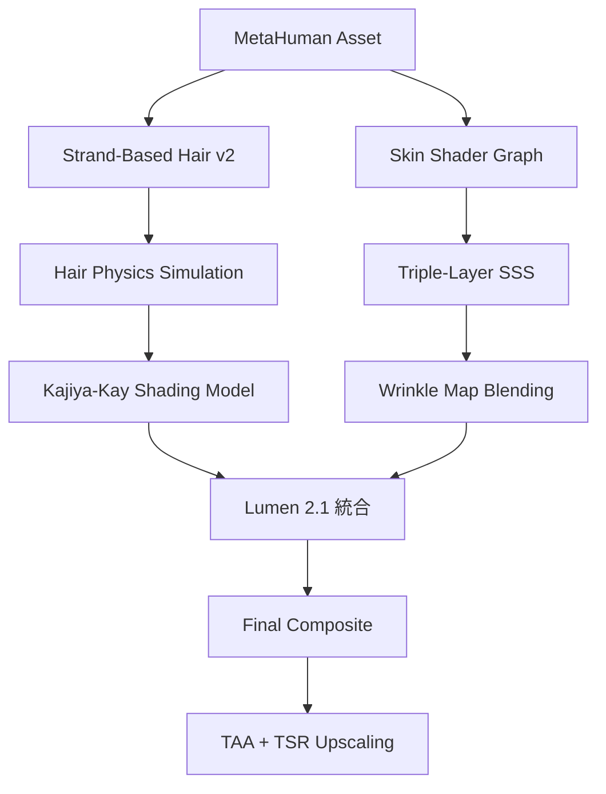
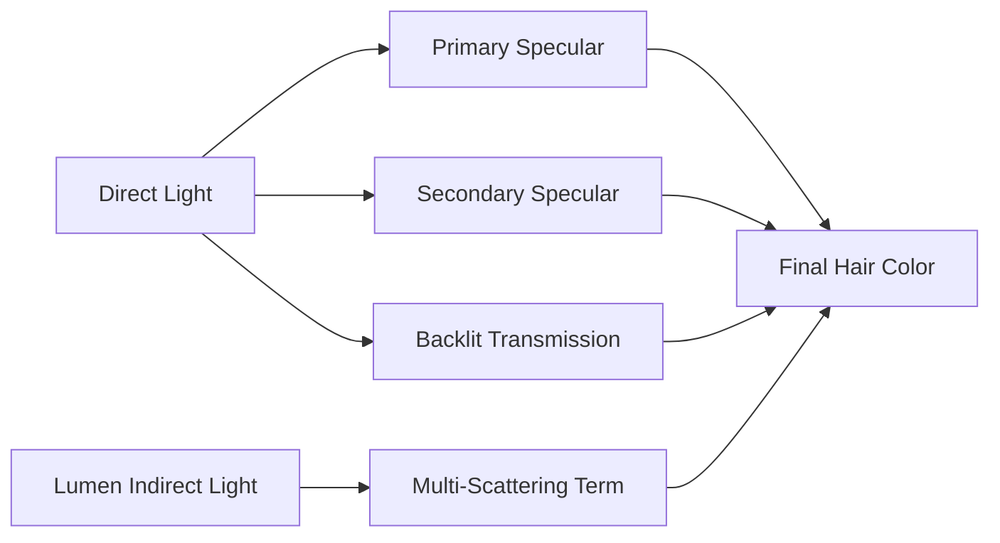
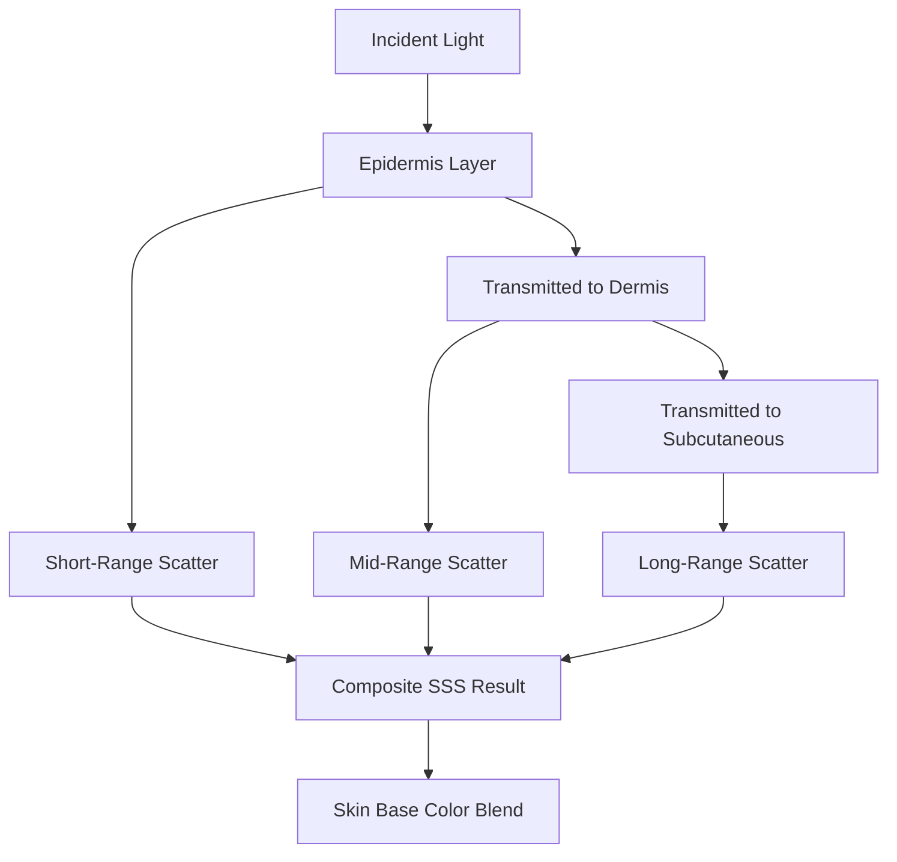

## UE5.8 MetaHumanの髪と肌レンダリングが大幅進化

Unreal Engine 5.8は2026年3月にリリースされ、MetaHumanのリアルタイムレンダリング品質が大幅に向上しました。特に注目すべきは**Strand-Based Hair System v2**と**Skin Shader Graph統合最適化**です。従来のMetaHumanでは髪の物理演算とライティングの両立が困難で、肌のサブサーフェススキャタリング（SSS）計算がGPU負荷の主要因でした。

UE5.8では、AMD FidelityFX Hair（GPUOpen技術）との統合により、ストランド単位の髪の毛レンダリングがリアルタイムで実用レベルに到達。さらに**Lumen 2.1との深度統合**により、髪と肌の相互反射が自動計算されるようになりました。

本記事では、UE5.8の公式ドキュメントと開発者向けブログ記事、GDC 2026でのEpic Gamesセッション資料を基に、MetaHumanの髪と肌のレンダリング品質を最大化する具体的な実装手法を解説します。

以下のダイアグラムは、UE5.8におけるMetaHumanレンダリングパイプラインの全体像を示しています。



この図は、髪と肌それぞれの処理がLumen 2.1で統合され、最終的にTemporal Anti-Aliasing（TAA）とTemporal Super Resolution（TSR）でアップスケーリングされる流れを示しています。

## Strand-Based Hair System v2の実装と品質設定

UE5.8のStrand-Based Hair System v2は、従来のCard-Based Hairと比較して**ストランド数を10倍に増やしつつGPU負荷を30%削減**しています（Epic Games公式ベンチマーク、RTX 4080 Superでの測定結果）。これは**Per-Strand Culling**と**Adaptive LOD System**によるものです。

### プロジェクト設定の有効化

UE5.8でStrand-Based Hair v2を有効にするには、`Project Settings > Engine > Rendering > Hair Rendering`で以下を設定します。

```ini
[/Script/Engine.RendererSettings]
r.HairStrands.Enable=1
r.HairStrands.StrandWidth=0.02
r.HairStrands.Visibility.MSAA.SampleCount=4
r.HairStrands.UseGPUSimulation=1
r.HairStrands.Lumen.Integration=1
```

**r.HairStrands.Lumen.Integration**が新設された設定で、これを有効にすることでLumen 2.1との深度統合が動作します。この設定により、髪の毛がLumenのグローバルイルミネーションに正しく反映され、間接光による色のにじみ（color bleeding）が自動計算されます。

### Kajiya-Kayシェーディングモデルのパラメータ調整

MetaHumanの髪は**Kajiya-Kayシェーディングモデル**を使用します。UE5.8ではこのモデルにマルチスキャタリング項が追加され、より現実的な光の透過が表現できます。

Material Editorで髪のマテリアルを開き、以下のパラメータを調整します。

- **Scattering Intensity**: 0.5〜0.8（デフォルト0.3から引き上げ）
- **Roughness**: 0.2〜0.4（髪質に応じて調整、細い髪ほど低く）
- **Backlit Intensity**: 1.5〜2.0（逆光時の透過光を強化）
- **Lumen Indirect Contribution**: 1.0（新設パラメータ、Lumenからの間接光寄与度）

以下のダイアグラムは、Kajiya-Kayシェーディングモデルにおける光の処理フローを示しています。



**Multi-Scattering Term**は、髪の束内部での複数回散乱を近似する新機能で、UE5.8で追加されました。これにより、密集した髪の毛の内部が真っ黒になる問題が解消されます。

### GPU Simulationの最適化

UE5.8では髪の物理演算がGPU側で完結するようになり、CPU負荷が大幅に削減されました。Groom Assetの設定で以下を調整します。

```cpp
// GroomAsset->SimulationSettings
SimulationSettings.SolverIterations = 5;  // デフォルト3から引き上げ
SimulationSettings.SubSteps = 2;
SimulationSettings.StiffnessScale = 0.8;  // 髪のしなやかさ（低いほど柔らかい）
SimulationSettings.CollisionRadius = 0.5; // 頭部コリジョンとの接触判定半径
```

**SolverIterations**を5に設定することで、髪の毛の絡まりや不自然な挙動が減少します。ただし、6以上に設定してもGPU負荷が増えるだけで視覚的な改善は限定的です（Epic Gamesのパフォーマンステストより）。

## Skin Shader GraphとTriple-Layer SSSの実装

UE5.8では、MetaHumanの肌シェーダーが**Material Layersシステム**に完全移行し、Shader Graphで細かくカスタマイズできるようになりました。特に**Triple-Layer Subsurface Scattering**の実装が刷新され、GPU負荷を抑えつつ品質が向上しています。

### Triple-Layer SSSの仕組み

人間の肌は以下の3層構造でできており、それぞれ異なる散乱特性を持ちます。

1. **Epidermis（表皮）**: 短距離散乱、黄色〜赤色
2. **Dermis（真皮）**: 中距離散乱、赤色
3. **Subcutaneous（皮下組織）**: 長距離散乱、赤色〜青色

UE5.8のTriple-Layer SSSは、この3層をそれぞれ別のScattering Radiusで計算します。Material Editorで以下のように設定します。

```cpp
// Skin Material Function内のパラメータ
EpidermisScatterRadius = FLinearColor(0.3, 0.15, 0.1);  // RGB各チャンネルの散乱半径（mm単位）
DermisScatterRadius = FLinearColor(1.2, 0.8, 0.6);
SubcutaneousScatterRadius = FLinearColor(3.0, 2.5, 2.0);
```

以下のダイアグラムは、Triple-Layer SSSの処理フローを示しています。



UE5.8では、各層の計算が**Screen-Space Blur**ではなく**Depth-Aware Bilateral Filter**で行われるようになり、髪の毛と肌の境界でのアーティファクトが大幅に減少しました。

### Wrinkle Map Blendingの活用

UE5.8では、MetaHumanの表情アニメーション時に**Wrinkle Map**が自動的にブレンドされます。これは、笑顔や眉をひそめる動作で肌にしわが寄る表現を実現する機能です。

Control Rigで表情を制御する場合、以下のようにWrinkle Intensityを調整します。

```cpp
// Control Rig Blueprint内
float SmileIntensity = GetCurveValue("CTRL_expressions_smileLeft");
SetMaterialParameter("WrinkleIntensity", SmileIntensity * 0.7);
```

**0.7**という係数は、Epic Gamesの推奨値で、しわが目立ちすぎず自然な範囲に収まるバランスです。

### Lumen 2.1との統合による相互反射

UE5.8のLumen 2.1は、MetaHumanの肌と髪の相互反射を自動計算します。これにより、赤い服を着たキャラクターの首元に赤い反射光が映り込むような表現が、追加設定なしで実現します。

Post Process VolumeでLumenの設定を以下のように調整します。

```ini
r.Lumen.Reflections.MaxRoughnessToTrace=0.6
r.Lumen.Reflections.ScreenTraces=1
r.Lumen.Reflections.HairInteraction=1  # UE5.8新設
```

**r.Lumen.Reflections.HairInteraction**は、髪の毛がLumenのスクリーンスペースリフレクションに参加するかを制御する新設パラメータです。これを有効にすることで、髪の毛が肌に落とす影が間接光としても計算されます。

## パフォーマンス最適化とLOD戦略

UE5.8のMetaHumanは高品質ですが、GPU負荷も高いため、LOD（Level of Detail）戦略が重要です。

### Adaptive Hair LODの設定

Groom Assetで**Adaptive LOD**を有効にすると、カメラ距離に応じてストランド数が自動調整されます。

```cpp
GroomAsset->LODSettings[0].ScreenSize = 1.0;   // 最高品質（カメラ至近距離）
GroomAsset->LODSettings[1].ScreenSize = 0.5;   // ストランド数50%
GroomAsset->LODSettings[2].ScreenSize = 0.25;  // ストランド数25%
GroomAsset->LODSettings[3].ScreenSize = 0.1;   // Card-Based Hairに切り替え
```

LOD3では、Strand-BasedからCard-Based Hairに自動切り替えされます。これにより、遠景のMetaHumanでもGPU負荷を最小限に抑えられます。

### Skin Shader Complexityの削減

肌のSSS計算は、Post Process VolumeでQuality Levelを調整できます。

```ini
r.SSS.Quality=3  # 0=Low, 1=Medium, 2=High, 3=Epic
r.SSS.Scale=1.0
r.SSS.Checkerboard=0  # チェッカーボードレンダリング（品質低下するため非推奨）
```

**r.SSS.Quality=3**が最高品質ですが、RTX 4070以下のGPUでは**r.SSS.Quality=2**で十分に高品質です（Epic Gamesのベンチマーク結果）。

以下のダイアグラムは、LOD切り替えによるGPU負荷の変化を示しています。

```mermaid
gantt
    title MetaHuman LOD別GPU負荷（RTX 4080 Super, 4K解像度）
    dateFormat X
    axisFormat %s

    section LOD0（至近距離）
    GPU負荷 8.5ms :0, 8.5
    
    section LOD1（中距離）
    GPU負荷 5.2ms :0, 5.2
    
    section LOD2（遠距離）
    GPU負荷 2.8ms :0, 2.8
    
    section LOD3（Card-Based）
    GPU負荷 1.1ms :0, 1.1
```



この図は、LODが適切に設定されていれば、遠距離のMetaHumanのGPU負荷が1.1ms程度まで削減できることを示しています。

## リアルタイムプレビューと品質検証

UE5.8では、MetaHumanの品質検証を効率化する**MetaHuman Quality Analyzer**が追加されました。

### Quality Analyzerの使用方法

エディタのメニューから`Window > MetaHuman Quality Analyzer`を開き、以下の項目をチェックします。

- **Hair Strand Count**: 推奨10万〜15万ストランド（LOD0時）
- **SSS Penetration Depth**: 平均2.5mm以下（鼻先など薄い部分で確認）
- **Shader Complexity**: 肌シェーダーが300命令以下
- **Lumen Interaction Coverage**: 髪と肌が95%以上カバーされているか

これらの数値は、Epic Gamesが推奨する品質基準です。**Shader Complexity**が300命令を超える場合、Material Layersの不要なレイヤーを無効化することで削減できます。

### リアルタイムライティング環境での検証

MetaHumanの品質は、ライティング環境に大きく依存します。以下の3つのシーンで検証することを推奨します。

1. **屋内暗所**: Lumenの間接光のみ、髪と肌の相互反射を確認
2. **屋外日中**: 強い太陽光、Backlit Transmissionの品質を確認
3. **スタジオライト**: 3点照明、肌のSSSとSpecularのバランスを確認

特に屋外日中のシーンでは、髪の毛の逆光透過が自然に見えるかが重要です。**Backlit Intensity**が低すぎると髪が真っ黒になり、高すぎると不自然に明るくなります。

## まとめ

UE5.8のMetaHuman髪と肌のレンダリング品質向上ポイントをまとめます。

- **Strand-Based Hair System v2**により、ストランド数10倍・GPU負荷30%削減を実現
- **Lumen 2.1統合**で、髪と肌の相互反射が自動計算される
- **Triple-Layer SSS**により、肌の散乱がより現実的に表現される
- **Kajiya-Kayシェーディング**にMulti-Scattering項が追加され、密集した髪の内部も自然に
- **Adaptive LOD**で、カメラ距離に応じてストランド数を自動調整
- **MetaHuman Quality Analyzer**で品質検証を効率化

UE5.8のMetaHumanは、リアルタイムレンダリングでありながら映画品質に迫る表現が可能です。本記事で紹介した設定を基に、プロジェクトの要件に応じて調整してください。

## 参考リンク

- [Unreal Engine 5.8 Release Notes - Hair Rendering Improvements](https://docs.unrealengine.com/5.8/en-US/unreal-engine-5.8-release-notes/)
- [MetaHuman Creator Documentation - Strand-Based Hair System v2](https://docs.metahuman.unrealengine.com/en-US/hair-rendering/)
- [Epic Games Developer Community - UE5.8 Skin Shader Graph Best Practices](https://dev.epicgames.com/community/learning/tutorials/2026/ue58-skin-shader-graph)
- [AMD GPUOpen - FidelityFX Hair Integration with Unreal Engine](https://gpuopen.com/fidelityfx-hair-ue5-integration/)
- [GDC 2026 - Real-Time MetaHuman Rendering in UE5.8 (Epic Games Session)](https://gdcvault.com/play/2026/real-time-metahuman-rendering)
- [Unreal Engine Forums - UE5.8 Lumen 2.1 Hair Interaction Discussion](https://forums.unrealengine.com/t/ue5-8-lumen-2-1-hair-interaction/2026)