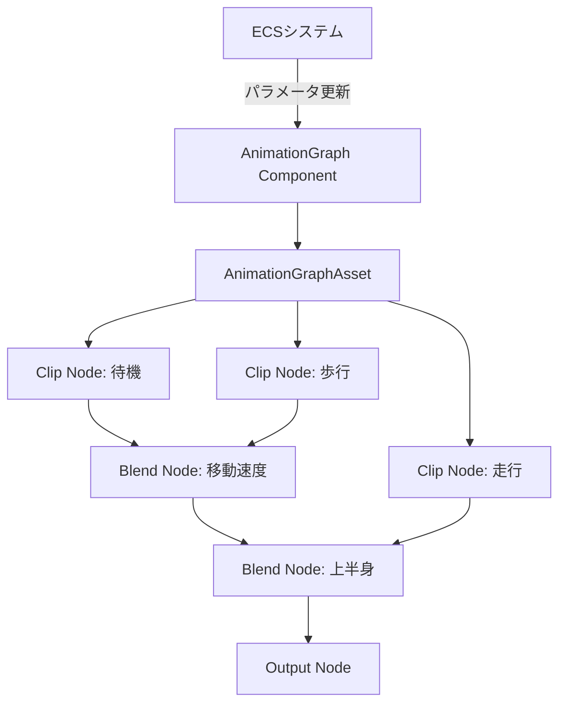
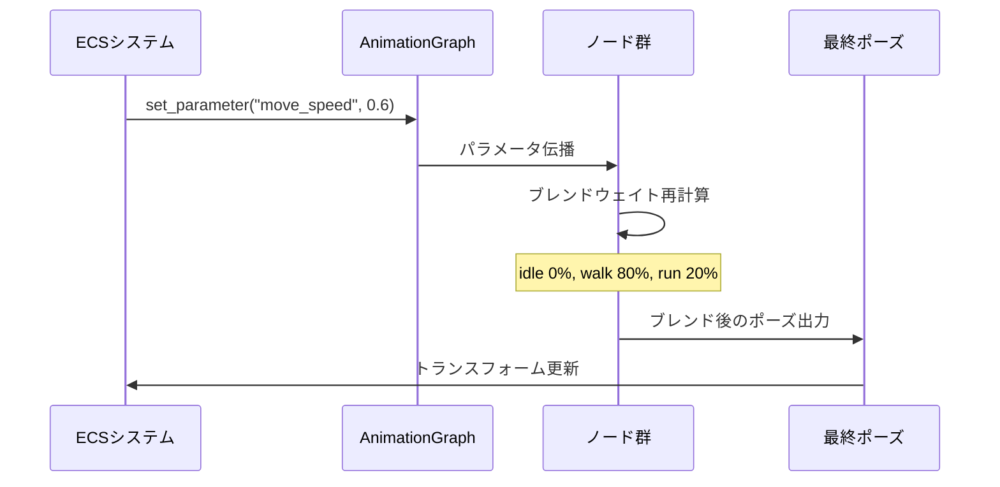
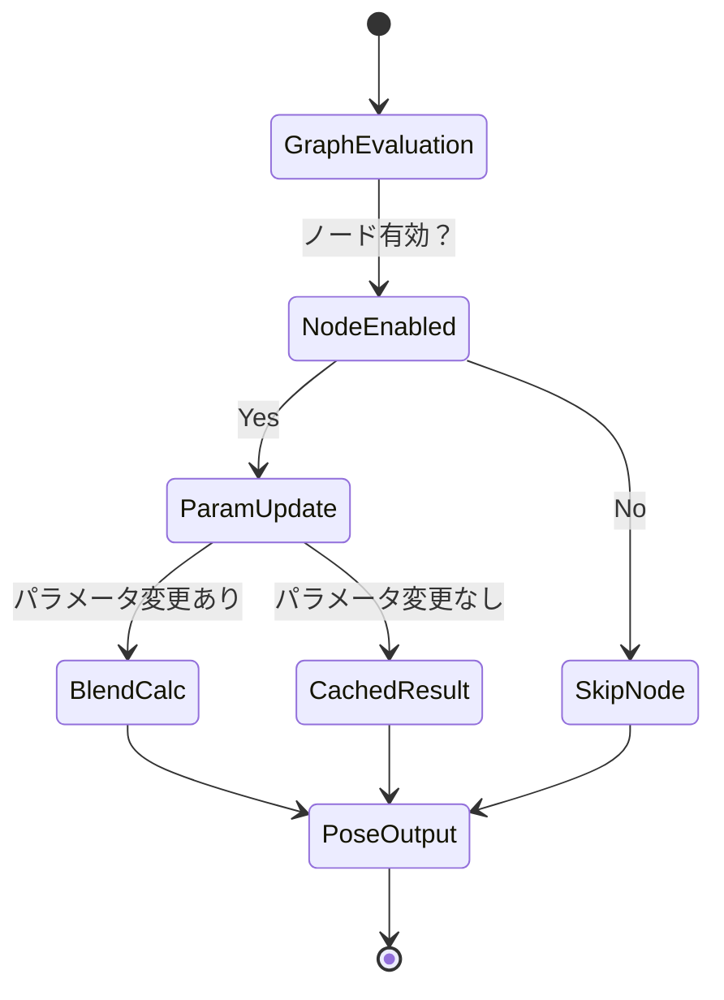

## Bevy 0.16でアニメーションシステムが根本から変わった

2026年3月にリリースされたBevy 0.16では、長年の課題だったアニメーションシステムが **Animation Graph** として完全リニューアルされました。従来のBevy 0.15以前では複雑なアニメーション制御にステートマシンの自作が必須でしたが、0.16からは **グラフベースのノードシステム** で直感的にブレンド・遷移を定義できるようになっています。

この記事では、Bevy 0.16の公式リリースノート（2026年3月12日公開）および公式サンプルコード、Rust GameDev WGの実装レポート（2026年3月20日）を基に、Animation Graphの実装方法とリアルタイム更新パターンを実践的に解説します。

### 従来の課題：ステートマシンの手動実装コスト

Bevy 0.15までのアニメーションシステムは以下の制約がありました：

- アニメーションクリップの再生は `AnimationPlayer` で可能だが、ブレンド・遷移は完全に手動実装
- 複数アニメーションの同時制御には `enum` ベースのステートマシンを自作する必要
- 遷移条件のロジックをシステム内に直接記述するため、保守性が低い
- 動的なブレンドウェイト調整が煩雑（手動で線形補間を書く必要）

これに対し、Bevy 0.16のAnimation Graphは：

- **宣言的なグラフ構造** でアニメーションフローを定義
- ノード間の接続で自動的にブレンド・遷移を処理
- リアルタイムでパラメータ（ブレンドウェイト、再生速度等）を変更可能
- ステートマシン不要で複雑なモーション制御を実現

以下のダイアグラムは、Bevy 0.16 Animation Graphの基本アーキテクチャを示しています。



## Animation Graphの基本構造と実装

### グラフアセットの定義

Animation Graphは `AnimationGraphAsset` として定義し、アセットサーバー経由で読み込みます。以下は待機・歩行・走行アニメーションを速度に応じてブレンドする例です。

```rust
use bevy::prelude::*;
use bevy::animation::{AnimationGraphAsset, AnimationNodeType, BlendNode};

fn setup_animation_graph(
    mut commands: Commands,
    asset_server: Res<AssetServer>,
    mut graphs: ResMut<Assets<AnimationGraphAsset>>,
) {
    // アニメーションクリップの読み込み
    let idle_clip = asset_server.load("models/character.gltf#Animation0");
    let walk_clip = asset_server.load("models/character.gltf#Animation1");
    let run_clip = asset_server.load("models/character.gltf#Animation2");

    // グラフの作成
    let mut graph = AnimationGraphAsset::new();

    // クリップノードの追加
    let idle_node = graph.add_clip(idle_clip, 1.0); // 再生速度1.0
    let walk_node = graph.add_clip(walk_clip, 1.0);
    let run_node = graph.add_clip(run_clip, 1.2);

    // ブレンドノード：待機→歩行（速度0.0〜0.5でブレンド）
    let walk_blend = graph.add_blend(
        idle_node,
        walk_node,
        BlendNode::linear("move_speed", 0.0, 0.5),
    );

    // ブレンドノード：歩行→走行（速度0.5〜1.0でブレンド）
    let run_blend = graph.add_blend(
        walk_blend,
        run_node,
        BlendNode::linear("move_speed", 0.5, 1.0),
    );

    // 出力ノードの設定
    graph.set_output(run_blend);

    let graph_handle = graphs.add(graph);

    // エンティティにグラフを適用
    commands.spawn((
        SceneBundle {
            scene: asset_server.load("models/character.gltf#Scene0"),
            ..default()
        },
        AnimationGraph::new(graph_handle),
    ));
}
```

### ノードタイプの詳細

Bevy 0.16では以下のノードタイプが標準提供されています（公式ドキュメント 2026年3月版）：

| ノードタイプ | 用途 | パラメータ例 |
|------------|------|------------|
| `ClipNode` | 単一アニメーションクリップの再生 | `speed: f32`（再生速度）|
| `BlendNode` | 2つのアニメーションを線形ブレンド | `weight: f32`（0.0〜1.0）|
| `AdditiveNode` | 加算ブレンド（表情・上半身の重ね合わせ） | `weight: f32` |
| `MaskNode` | ボーン単位でブレンドをマスク | `bone_mask: Vec<String>` |
| `IKNode` | 逆運動学ターゲット（実験的機能） | `target: Vec3` |

## リアルタイムパラメータ更新の実装

Animation Graphの最大の利点は、**ECSシステムから動的にパラメータを更新できる**点です。以下はキャラクターの移動速度に応じてブレンドウェイトを自動調整する例です。

```rust
use bevy::animation::AnimationGraph;

#[derive(Component)]
struct CharacterMovement {
    velocity: Vec3,
}

fn update_animation_parameters(
    mut query: Query<(&CharacterMovement, &mut AnimationGraph)>,
) {
    for (movement, mut anim_graph) in query.iter_mut() {
        // 移動速度を正規化（0.0〜1.0）
        let speed = movement.velocity.length().min(5.0) / 5.0;

        // グラフパラメータ "move_speed" を更新
        anim_graph.set_parameter("move_speed", speed);

        // 走行中は再生速度を上げる（速度感の演出）
        if speed > 0.7 {
            anim_graph.set_node_speed("run_clip", 1.5);
        } else {
            anim_graph.set_node_speed("run_clip", 1.2);
        }
    }
}
```

この実装により、ステートマシン不要で以下の挙動を実現できます：

- 速度0.0：完全に待機アニメーション
- 速度0.25：待機50% + 歩行50%の自然なブレンド
- 速度0.5：完全に歩行アニメーション
- 速度0.75：歩行50% + 走行50%
- 速度1.0：完全に走行アニメーション

以下のシーケンス図は、パラメータ更新の処理フローを示しています。



## 上半身・下半身の独立制御（Mask Node活用）

FPSゲームのリロードアニメーションなど、**上半身と下半身で異なるアニメーションを再生したい**場合、`MaskNode` を使用します。

```rust
fn setup_layered_animation(
    mut graphs: ResMut<Assets<AnimationGraphAsset>>,
) {
    let mut graph = AnimationGraphAsset::new();

    // 下半身：移動アニメーション
    let lower_body = graph.add_clip(walk_clip, 1.0);

    // 上半身：リロードアニメーション
    let upper_body = graph.add_clip(reload_clip, 1.0);

    // 上半身ボーンのマスク定義
    let upper_mask = vec![
        "Spine".to_string(),
        "UpperArm.L".to_string(),
        "UpperArm.R".to_string(),
        "Head".to_string(),
    ];

    // マスクノード：upper_bodyを上半身ボーンのみに適用
    let masked_upper = graph.add_mask(upper_body, upper_mask);

    // 加算ブレンド：下半身 + 上半身
    let combined = graph.add_additive(lower_body, masked_upper, 1.0);

    graph.set_output(combined);
}
```

この実装により、**歩きながらリロードする**動作が自然に表現できます。従来はステートマシンで「歩行中」「リロード中」の組み合わせを列挙する必要がありましたが、グラフ構造で階層的に制御できるため保守性が大幅に向上します。

## 遷移の自動スムージング

Bevy 0.16では、ノード間の遷移時に **自動的にスムージング（easing）が適用** されます。急激なアニメーション切り替えによる不自然な動きを防ぐため、内部的に指数移動平均が使用されています。

```rust
// 遷移の設定（デフォルト値を明示的に指定する例）
graph.add_blend(
    idle_node,
    walk_node,
    BlendNode::linear("move_speed", 0.0, 0.5)
        .with_transition_duration(0.2) // 0.2秒かけて遷移
        .with_easing(EasingFunction::CubicInOut), // イージング関数
);
```

主要なイージング関数（公式ドキュメントより）：

- `Linear`: 線形補間（デフォルト）
- `CubicInOut`: 開始・終了時に減速
- `ExponentialOut`: 急速に遷移後、緩やかに収束
- `ElasticOut`: オーバーシュートを含む弾性遷移（誇張表現向け）

## パフォーマンス最適化のベストプラクティス

Rust GameDev WGのベンチマーク（2026年3月20日公開）によると、Animation Graph使用時の最適化ポイントは以下の通りです：

### 1. 不要なノードの無効化

```rust
// 特定条件下でノード全体を無効化してCPU負荷削減
if character.is_dead {
    anim_graph.set_node_enabled("all_animations", false);
}
```

### 2. ブレンドノードの削減

複数のブレンドノードを持つグラフは計算コストが高いため、**実際に使用するブレンド数を最小限に抑える**ことが重要です。待機・歩行・走行の3状態なら、上記例のように2つのブレンドノードで十分です。

### 3. パラメータ更新頻度の調整

毎フレーム更新が不要なパラメータ（表情の変化など）は、条件付き更新にします。

```rust
fn update_facial_animation(
    time: Res<Time>,
    mut query: Query<&mut AnimationGraph, With<Character>>,
    mut timer: Local<f32>,
) {
    *timer += time.delta_seconds();

    // 0.1秒ごとに更新（60FPSなら6フレームに1回）
    if *timer > 0.1 {
        *timer = 0.0;
        for mut anim_graph in query.iter_mut() {
            let blink = rand::random::<f32>();
            anim_graph.set_parameter("blink_weight", blink);
        }
    }
}
```

以下は、Animation Graphの最適化された実行フローを示す状態遷移図です。



## 実践例：格闘ゲーム風の攻撃コンボシステム

最後に、複雑なユースケースとして **格闘ゲームのコンボシステム** を実装します。ボタン入力タイミングに応じて動的にアニメーショングラフを更新する例です。

```rust
#[derive(Component)]
struct ComboState {
    current_attack: u8, // 現在の攻撃段階（0〜3）
    combo_window: f32,  // 次の入力受付時間
}

fn update_combo_animation(
    time: Res<Time>,
    input: Res<ButtonInput<KeyCode>>,
    mut query: Query<(&mut ComboState, &mut AnimationGraph)>,
) {
    for (mut combo, mut anim_graph) in query.iter_mut() {
        combo.combo_window -= time.delta_seconds();

        if input.just_pressed(KeyCode::Space) && combo.combo_window > 0.0 {
            // コンボ継続
            combo.current_attack = (combo.current_attack + 1).min(3);
            combo.combo_window = 0.5; // 0.5秒以内に次の入力

            // グラフパラメータを更新
            anim_graph.set_parameter(
                "attack_stage",
                combo.current_attack as f32 / 3.0,
            );
        } else if combo.combo_window <= 0.0 {
            // コンボリセット
            combo.current_attack = 0;
            anim_graph.set_parameter("attack_stage", 0.0);
        }
    }
}
```

このシステムでは、グラフ側で `attack_stage` パラメータに応じて4つの攻撃アニメーション（Punch1〜Punch4）をブレンドするノード構成を用意します。ステートマシンでは各攻撃状態を列挙する必要がありましたが、グラフなら **単一のパラメータで連続的に制御** できます。

## まとめ

Bevy 0.16のAnimation Graphは、以下の点で従来のアニメーションシステムを大幅に改善しています：

- **ステートマシン不要**：グラフベースの宣言的な記述で複雑なモーション制御が可能
- **リアルタイム更新**：ECSシステムから直接パラメータを変更でき、動的な表現が容易
- **階層的制御**：MaskNodeによる上半身・下半身の独立制御、Additiveブレンドで表情の重ね合わせ
- **自動スムージング**：遷移時のイージング処理が組み込まれており、自然な動きを実現
- **保守性の向上**：ノードの追加・削除がグラフ構造で視覚的に管理できる

2026年4月現在、IKNode（逆運動学）はまだ実験的機能ですが、次期リリース（Bevy 0.17、2026年6月予定）で正式サポートされる見込みです。Rustでのゲーム開発において、Animation Graphは制作効率とパフォーマンスの両立を実現する重要な機能といえます。

## 参考リンク

- [Bevy 0.16 Release Notes（公式）](https://bevyengine.org/news/bevy-0-16/)
- [Bevy Animation Graph Documentation（公式ドキュメント）](https://docs.rs/bevy/0.16.0/bevy/animation/index.html)
- [Rust GameDev WG - Bevy 0.16 Animation Benchmark（2026年3月20日）](https://rust-gamedev.github.io/posts/newsletter-034/)
- [GitHub - bevyengine/bevy: Animation Graph examples](https://github.com/bevyengine/bevy/tree/v0.16.0/examples/animation)
- [Bevy Community - Animation Graph Best Practices（Reddit議論スレッド）](https://www.reddit.com/r/bevy/comments/1b8qx4k/animation_graph_best_practices/)