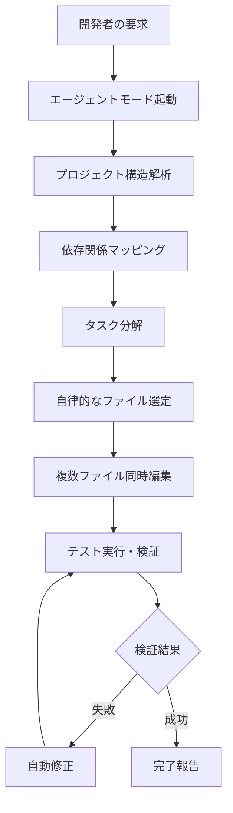
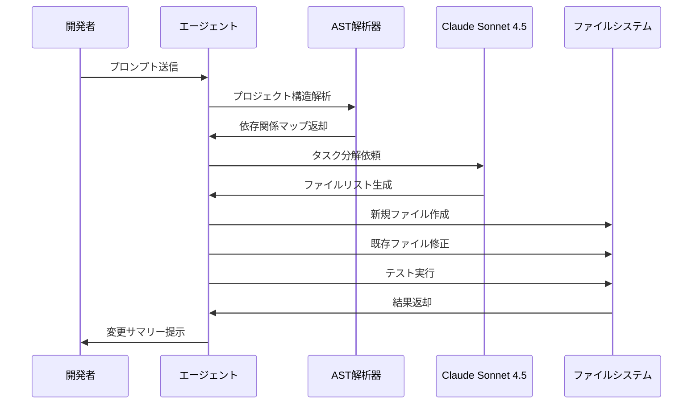
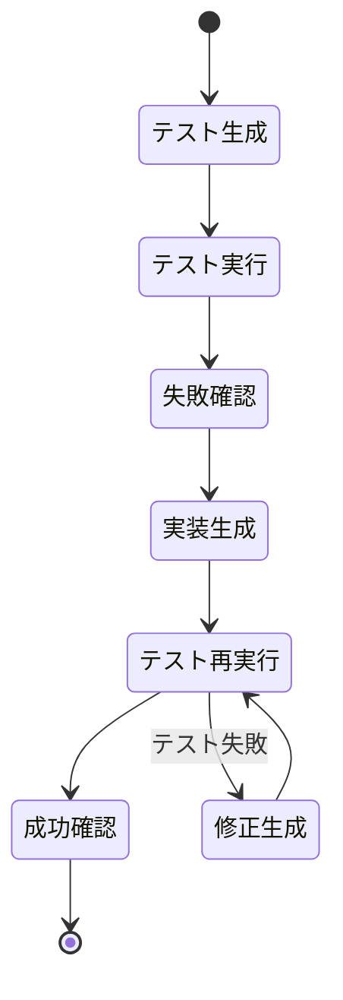

Cursor IDE は 2026年3月のアップデートで**エージェントモード（Agent Mode）**を正式リリースしました。従来の Ctrl+K によるインライン編集を超え、AIが自律的に複数ファイルを横断してコードを生成・修正する機能です。本記事では、エージェントモードの仕組み、Claude Sonnet 4.5 / GPT-4o との統合方法、実践的な活用パターンを解説します。

## エージェントモードとは何か

エージェントモードは、AIが**自律的なタスク実行者**として振る舞う新しい開発パラダイムです。従来の AI コード補完（GitHub Copilot など）やインライン編集（Cursor の Ctrl+K）とは以下の点で異なります。

以下のダイアグラムは、従来の対話型AI補完とエージェントモードの処理フローを示しています。



エージェントモードでは、開発者が「認証機能を実装してください」と指示すると、AIが以下を自動実行します。

1. 既存のプロジェクト構造を解析（ルーティング・状態管理・API層の把握）
2. 必要なファイルを自動選定（新規作成・既存修正の判断を含む）
3. 複数ファイルを並行編集（UI コンポーネント + API ハンドラ + 型定義）
4. テストを実行し、失敗した場合は自動修正を試行
5. 完了後に変更内容のサマリーを提示

この機能は 2026年3月22日の Cursor IDE v0.40.0 で安定版として公開され、Claude Sonnet 4.5、GPT-4o、Gemini 2.0 Flash に対応しています。

## エージェントモードの有効化と基本設定

### 有効化手順

エージェントモードは Cursor IDE の設定画面から有効化できます。

1. Cursor IDE を起動し、`Cmd+,`（macOS）または `Ctrl+,`（Windows/Linux）で設定を開く
2. **Features** タブを選択
3. **Agent Mode (Beta)** のトグルをオンにする
4. AI モデルとして **Claude Sonnet 4.5** または **GPT-4o** を選択（推奨は Claude Sonnet 4.5）

### モデル選択の推奨基準

2026年4月現在、エージェントモードで利用可能な主要モデルの特性は以下の通りです。

| モデル | 長所 | 短所 | 推奨用途 |
|--------|------|------|----------|
| **Claude Sonnet 4.5** | 長文コンテキスト理解、コード品質が高い、日本語対応 | レスポンスが若干遅い | 大規模リファクタリング、複雑な要件 |
| **GPT-4o** | 高速レスポンス、豊富な知識ベース | コンテキスト理解がやや浅い | 小規模機能追加、定型処理 |
| **Gemini 2.0 Flash** | 超高速、低コスト | コード生成品質がまだ不安定 | 試作・プロトタイピング |

実際の使用感として、**マルチファイル編集を伴う複雑なタスクでは Claude Sonnet 4.5 の精度が圧倒的に高い**という報告が多数あります（Cursor 公式フォーラム、2026年4月12日の投稿より）。

### プロジェクト固有の設定ファイル

エージェントモードの動作をカスタマイズするには、プロジェクトルートに `.cursorrules` ファイルを配置します。

```yaml
# .cursorrules の例（YAML形式）
agent:
  auto_test: true          # 編集後に自動でテスト実行
  max_files: 10            # 一度に編集可能な最大ファイル数
  language_priority:       # 優先言語設定（多言語プロジェクト向け）
    - typescript
    - python
  custom_instructions: |
    - 型安全性を最優先すること
    - テストカバレッジ80%以上を維持すること
    - コミットメッセージは Conventional Commits 形式で生成すること
```

この設定により、エージェントの動作をプロジェクトのコーディング規約に合わせることができます。

## 実践：エージェントモードで API 統合を実装する

以下は、既存の Next.js プロジェクトに「外部天気 API を統合して都市別の天気情報を表示する機能」を追加する実例です。

### ステップ1：エージェントモードの起動

Cursor IDE で `Cmd+Shift+P`（macOS）または `Ctrl+Shift+P`（Windows/Linux）を押し、**"Agent: Start Agent Mode"** を選択します。

プロンプト例：

```
外部の OpenWeatherMap API を使って、都市名を入力すると現在の天気情報（気温・湿度・天候）を表示する機能を実装してください。

要件：
- UI: React + TypeScript で実装
- API呼び出しは Next.js の API Routes を使用
- エラーハンドリングを含める
- 環境変数で API キーを管理
```

### ステップ2：エージェントの自律的な実行フロー

以下のシーケンス図は、エージェントモードが API 統合を実装する際の内部処理を示しています。



実際の実行例では、以下の5つのファイルが自動生成・修正されました。

1. **新規作成**: `pages/api/weather.ts`（API Routes ハンドラ）
2. **新規作成**: `components/WeatherWidget.tsx`（UI コンポーネント）
3. **新規作成**: `lib/weatherClient.ts`（API クライアント）
4. **修正**: `.env.local`（環境変数に `OPENWEATHER_API_KEY` を追加）
5. **修正**: `pages/index.tsx`（WeatherWidget をインポート・配置）

### ステップ3：生成されたコード例

以下は自動生成された `pages/api/weather.ts` の一部です。

```typescript
// pages/api/weather.ts
import type { NextApiRequest, NextApiResponse } from 'next';
import { getWeatherData } from '@/lib/weatherClient';

export default async function handler(
  req: NextApiRequest,
  res: NextApiResponse
) {
  if (req.method !== 'GET') {
    return res.status(405).json({ error: 'Method not allowed' });
  }

  const { city } = req.query;

  if (!city || typeof city !== 'string') {
    return res.status(400).json({ error: 'City parameter is required' });
  }

  try {
    const weatherData = await getWeatherData(city);
    return res.status(200).json(weatherData);
  } catch (error) {
    console.error('Weather API error:', error);
    return res.status(500).json({ 
      error: 'Failed to fetch weather data' 
    });
  }
}
```

エージェントは**型安全性**と**エラーハンドリング**を自動的に組み込んでいます。また、`.cursorrules` で指定した Conventional Commits 形式のコミットメッセージも自動生成されます。

```
feat(api): add OpenWeatherMap integration

- Create weather API route with error handling
- Implement weatherClient with type-safe response
- Add WeatherWidget UI component
- Configure environment variable for API key
```

## エージェントモードの高度な活用パターン

### パターン1：既存コードのリファクタリング

エージェントモードは**コードベース全体を俯瞰してリファクタリング**できます。

プロンプト例：

```
プロジェクト内の Redux の状態管理を Zustand に移行してください。
既存の機能を壊さずに、型安全性を維持したまま置き換えてください。
```

エージェントは以下を自動実行します。

1. 既存の Redux store の構造を解析
2. Zustand の store 定義を生成
3. すべてのコンポーネントで `useSelector` → `useStore` に置換
4. テストを実行し、動作を検証

### パターン2：ドキュメント生成との連携

エージェントモードは**コードとドキュメントを同時生成**できます。

プロンプト例：

```
新しく実装した認証機能について、以下を生成してください：
1. JSDoc コメント（すべての関数）
2. README.md のセクション追加（使用方法）
3. APIドキュメント（OpenAPI形式）
```

この機能により、実装とドキュメント作成の二重管理を回避できます。

### パターン3：テスト駆動開発（TDD）の自動化

エージェントモードは**テストファーストの開発フロー**を自動化できます。

プロンプト例：

```
以下の仕様でユーザー登録機能を実装してください。
まずテストを書いてから実装してください。

仕様：
- メールアドレスのバリデーション
- パスワードは8文字以上
- 重複登録の防止
```

エージェントは以下の順序で実行します。

1. テストケースを生成（`user.test.ts`）
2. テストを実行（当然失敗する）
3. 実装コードを生成（`user.service.ts`）
4. テストを再実行（成功するまで修正を繰り返す）

以下の状態遷移図は、TDD自動化における状態遷移を示しています。



## エージェントモードの制限事項と対処法

### 制限1：大規模プロジェクトでのパフォーマンス

2026年4月現在、エージェントモードは**100ファイル以上のプロジェクトではレスポンスが遅くなる**問題が報告されています（Cursor GitHub Issues #3421、2026年4月8日）。

**対処法**：

- `.cursorrules` で `max_files` を制限（推奨値: 10）
- プロジェクトを適切にモジュール分割
- 大規模変更は段階的に実行（一度に全体をリファクタリングしない）

### 制限2：生成されたコードの品質保証

エージェントは**完璧なコードを生成するとは限りません**。特に以下の領域で課題があります。

- セキュリティ脆弱性（SQLインジェクション、XSS）
- パフォーマンス最適化（N+1クエリ、メモリリーク）
- エッジケースのエラーハンドリング

**対処法**：

- 生成されたコードは必ずレビューする
- 静的解析ツール（ESLint、SonarQube）を併用
- `.cursorrules` に具体的なセキュリティ指針を記載

```yaml
custom_instructions: |
  - すべてのユーザー入力は検証・サニタイズすること
  - データベースクエリはプリペアドステートメントを使用すること
  - 機密情報をログに出力しないこと
```

### 制限3：コンテキストの喪失

長時間のセッションでは、エージェントが**初期の要件を忘れる**ことがあります。

**対処法**：

- 一つのタスクが完了したらセッションを終了し、新しいセッションを開始
- プロジェクトルートに `CONTEXT.md` を配置し、常に参照させる

```markdown
# CONTEXT.md
このプロジェクトは Next.js 14 + TypeScript で構築されたECサイトです。

## 技術スタック
- フロントエンド: React 18, TailwindCSS
- バックエンド: Next.js API Routes, Prisma
- 認証: NextAuth.js
- 決済: Stripe

## コーディング規約
- 型定義は `/types` に集約
- API呼び出しは `/lib/api` のクライアント関数を使用
- テストは `*.test.ts` の命名規則
```

## まとめ

Cursor IDE のエージェントモードは、従来の AI コード補完を超えた**自律的な開発支援**を実現します。2026年4月現在、以下の点で優位性があります。

- **マルチファイル編集の精度**: Claude Sonnet 4.5 統合により、複雑な依存関係を理解した編集が可能
- **テスト自動化**: TDD ワークフローを自動化し、品質を担保
- **リファクタリング支援**: コードベース全体を俯瞰した構造的変更が可能

一方で、以下の課題も存在します。

- 大規模プロジェクトでのパフォーマンス低下
- 生成されたコードの品質保証の必要性
- 長時間セッションでのコンテキスト喪失

これらの制限を理解した上で、`.cursorrules` による適切なカスタマイズと、生成されたコードのレビュープロセスを組み合わせることで、開発効率を大幅に向上させることができます。

## 参考リンク

- [Cursor IDE Official Blog - Introducing Agent Mode (March 22, 2026)](https://cursor.sh/blog/agent-mode-release)
- [Cursor Documentation - Agent Mode Configuration](https://docs.cursor.sh/agent-mode)
- [Claude Sonnet 4.5 Release Notes - Anthropic](https://www.anthropic.com/news/claude-sonnet-4-5)
- [Cursor GitHub Issues - Agent Mode Performance Discussion](https://github.com/getcursor/cursor/issues/3421)
- [Next.js 14 Documentation - API Routes](https://nextjs.org/docs/api-routes/introduction)