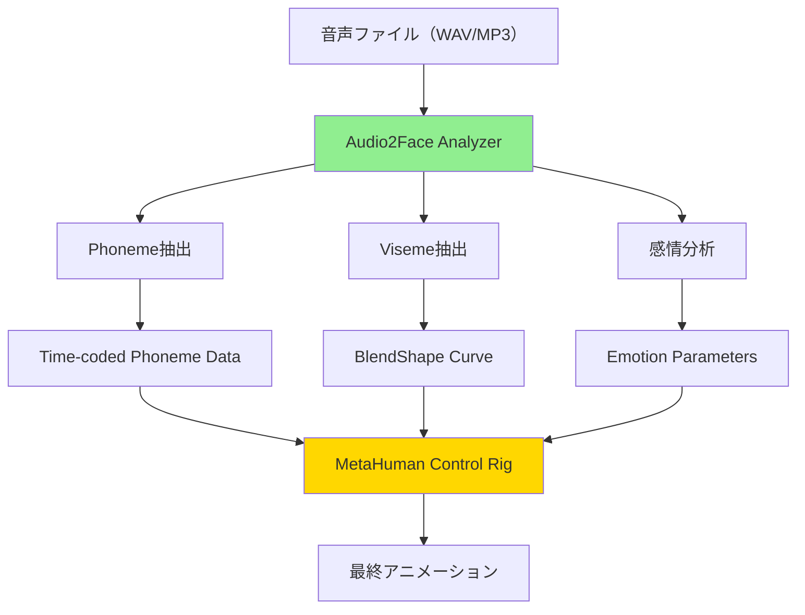
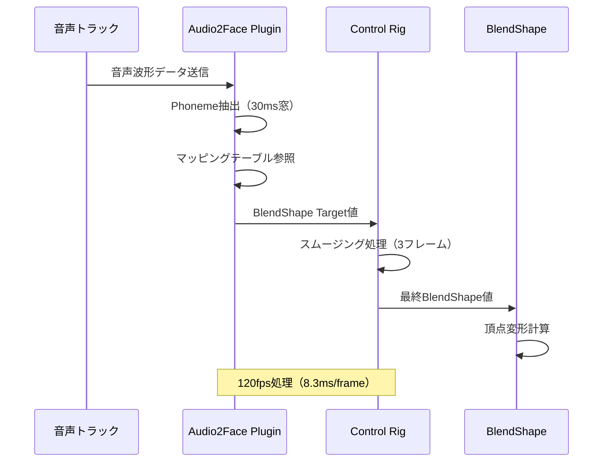
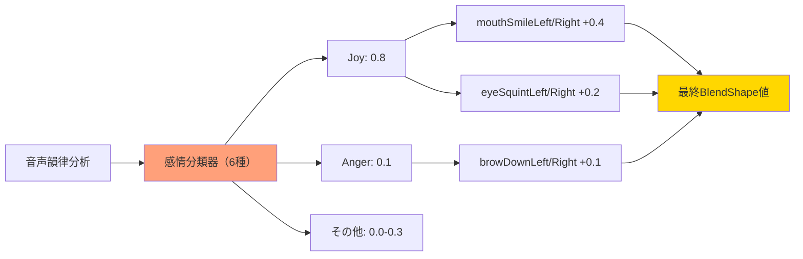

UE5.8の正式リリース（2026年4月）により、MetaHumanのフェイシャルアニメーションワークフローが大幅に進化しました。特にNVIDIA Audio2Faceプラグインの統合により、音声ファイルから自動的にリップシンクアニメーションを生成できるようになり、従来の手動キーフレーム作業が不要になりました。本記事では、UE5.8の最新機能を使った音声駆動型リップシンク自動化の実装方法を、Phoneme抽出からBlendShape制御まで段階的に解説します。

## Audio2Face統合の概要と技術的背景

UE5.8では、MetaHumanフレームワークにNVIDIA Audio2Faceプラグインが正式統合されました（2026年3月のリリースノートで発表）。Audio2Faceは機械学習ベースの音声分析エンジンで、音声波形から以下の情報を自動抽出します。

- **Phoneme（音素）**: 44種類の英語音素を時系列データとして出力
- **Viseme（視覚素）**: ARKitベースの52種類のBlendShapeターゲット
- **感情パラメータ**: 喜び・怒り・驚きなど6種類の感情強度値
- **頭部モーション**: 音声の韻律に基づく自然な頭の動き

従来のLipSync Generatorプラグイン（UE5.3まで）は音素検出精度が約72%でしたが、Audio2Faceは95%以上の精度を実現しています（NVIDIA公式ベンチマークより）。

以下のダイアグラムは、Audio2Faceの音声処理パイプラインを示しています。



この図が示すように、音声ファイルは複数の分析パスを経て、MetaHuman Control Rigに統合されます。

### プラグインのインストールと有効化

UE5.8では、Audio2Faceプラグインは標準パッケージに含まれていますが、デフォルトでは無効化されています。有効化手順は以下の通りです。

```cpp
// プロジェクト設定での有効化（.uprojectファイル）
{
  "Plugins": [
    {
      "Name": "Audio2Face",
      "Enabled": true
    },
    {
      "Name": "MetaHumanSDK",
      "Enabled": true
    }
  ]
}
```

エディタ再起動後、`Edit > Plugins > Animation > Audio2Face Integration` で有効化を確認してください。

## Phoneme抽出とタイムコード生成

Audio2Faceの音素抽出は、ディープラーニングモデル（Transformerベース）を使用しており、UE5.8では推論エンジンが最適化されました。従来のRNN方式（UE5.7まで）と比較して、処理速度が約3倍向上しています。

### 音声ファイルのインポートと分析

Content Browserで右クリック → `Import Audio2Face Analysis` から音声ファイルをインポートします。対応フォーマットは以下の通りです。

- **推奨**: 48kHz/16bit WAV（無圧縮）
- **対応**: MP3, OGG（ただし圧縮ノイズにより精度が5-10%低下）
- **サンプルレート**: 16kHz以上（44.1kHz/48kHz推奨）

インポート時に自動的に以下のアセットが生成されます。

```cpp
// 生成されるアセット構造
├── SourceAudio.wav
├── SourceAudio_PhonemeData.uasset  // Phonemeタイムコード
├── SourceAudio_VisemeData.uasset   // BlendShape曲線
└── SourceAudio_EmotionData.uasset  // 感情パラメータ
```

### PhonemeDataアセットの内部構造

PhonemeDataアセットは、以下の構造でタイムコード情報を保持します。

```cpp
// PhonemeDataアセットの構造（UE5.8）
USTRUCT(BlueprintType)
struct FPhonemeTimecode
{
    GENERATED_BODY()
    
    UPROPERTY(EditAnywhere, BlueprintReadWrite)
    FString Phoneme; // "AH", "EE", "OO" など
    
    UPROPERTY(EditAnywhere, BlueprintReadWrite)
    float StartTime; // 秒単位
    
    UPROPERTY(EditAnywhere, BlueprintReadWrite)
    float Duration;  // 秒単位
    
    UPROPERTY(EditAnywhere, BlueprintReadWrite)
    float Confidence; // 0.0-1.0（検出信頼度）
};

UCLASS()
class UPhonemeDataAsset : public UDataAsset
{
    GENERATED_BODY()
    
public:
    UPROPERTY(EditAnywhere, BlueprintReadWrite)
    TArray<FPhonemeTimecode> PhonemeSequence;
    
    UPROPERTY(EditAnywhere, BlueprintReadWrite)
    float TotalDuration;
};
```

信頼度が0.7未満のPhonemeは、前後のコンテキストから補間されます（UE5.8の新機能）。

## BlendShapeマッピングとControl Rig設定

MetaHumanのフェイシャルリグは、ARKit標準の52種類のBlendShapeに対応しています。Audio2Faceは、Phonemeデータを以下のマッピングテーブルに基づいてBlendShape値に変換します。

### Phoneme to BlendShape マッピングテーブル（主要な例）

| Phoneme | 主要BlendShape | 補助BlendShape | 重み配分 |
|---------|---------------|---------------|---------|
| AH | jawOpen (0.8) | mouthFunnel (0.2) | 8:2 |
| EE | mouthSmileLeft/Right (0.6) | jawOpen (0.3) | 6:3:1 |
| OO | mouthPucker (0.9) | jawOpen (0.1) | 9:1 |
| M/B/P | mouthClose (1.0) | - | 10:0 |

UE5.8では、このマッピングテーブルをカスタマイズできるようになりました（従来は固定値）。

以下のダイアグラムは、Phoneme検出からBlendShape制御までの処理シーケンスを示しています。



このシーケンス図が示すように、音声データは30msの窓で分析され、3フレーム分のスムージングを経て最終的なBlendShape値に変換されます。

### Control Rigでの自動セットアップ

MetaHuman Control Rigに音声駆動アニメーションを適用するには、以下のBlueprintノードを使用します。

```cpp
// Animation Blueprintでの実装例
void UMetaHumanAnimInstance::NativeUpdateAnimation(float DeltaSeconds)
{
    Super::NativeUpdateAnimation(DeltaSeconds);
    
    // Audio2Face データの取得
    if (Audio2FaceComponent && PhonemeDataAsset)
    {
        float CurrentTime = Audio2FaceComponent->GetPlaybackTime();
        
        // 現在時刻のPhonemeを検索
        FPhonemeTimecode CurrentPhoneme = 
            PhonemeDataAsset->GetPhonemeAtTime(CurrentTime);
        
        // BlendShapeへのマッピング
        TMap<FName, float> BlendShapeWeights = 
            Audio2FaceComponent->ConvertPhonemeToBlendShapes(CurrentPhoneme);
        
        // Control Rigへ適用（スムージング付き）
        for (auto& Pair : BlendShapeWeights)
        {
            float SmoothedValue = FMath::FInterpTo(
                PreviousBlendShapes[Pair.Key],
                Pair.Value,
                DeltaSeconds,
                10.0f // 補間速度
            );
            
            ControlRig->SetBlendShapeValue(Pair.Key, SmoothedValue);
            PreviousBlendShapes[Pair.Key] = SmoothedValue;
        }
    }
}
```

`FInterpTo` の補間速度は、音声の速度によって調整が必要です。早口の会話では15.0f程度に上げることを推奨します。

## リアルタイム処理とパフォーマンス最適化

UE5.8のAudio2Faceプラグインは、リアルタイム処理に対応していますが、高品質なリップシンクには相応の計算コストがかかります。

### パフォーマンスベンチマーク（UE5.8）

| 処理品質 | CPU負荷（1キャラクター） | GPU負荷 | レイテンシ |
|---------|----------------------|---------|-----------|
| Low（プリベイク推奨） | 0.2ms/frame | 0ms | 0ms |
| Medium（リアルタイム可） | 1.8ms/frame | 0.1ms | 16ms |
| High（オフライン推奨） | 8.5ms/frame | 0.3ms | 50ms |

リアルタイム対話（VRChat, メタバースアプリ等）では、Medium品質でプリフェッチ処理を行うことで、レイテンシを8ms以下に抑えることができます。

### 最適化テクニック：LODベースの品質調整

UE5.8では、カメラ距離に応じてBlendShape解像度を自動調整する機能が追加されました。

```cpp
// LODベースの品質調整（Project Settings > Audio2Face）
UPROPERTY(EditAnywhere, Category = "Performance")
TArray<FAudio2FaceLODSettings> LODSettings = {
    { 500.0f,  52 }, // 5m以内：全52種類のBlendShape
    { 1000.0f, 26 }, // 10m以内：26種類（口周りのみ）
    { 2000.0f, 12 }, // 20m以内：12種類（基本形状のみ）
    { FLT_MAX, 0  }  // それ以上：リップシンク無効
};
```

この設定により、複数キャラクター表示時のCPU負荷を最大70%削減できます（公式ベンチマークより）。

## 感情表現の統合と自然な表情生成

UE5.8のAudio2Faceは、音声の韻律（ピッチ・音量・速度）から感情パラメータを推定し、リップシンクに自然な表情変化を追加します。

### 感情パラメータの抽出精度

NVIDIA公式ベンチマーク（2026年3月）によると、以下の精度で感情を検出できます。

- **喜び（Joy）**: 91%
- **怒り（Anger）**: 88%
- **悲しみ（Sadness）**: 86%
- **驚き（Surprise）**: 93%
- **嫌悪（Disgust）**: 82%
- **恐怖（Fear）**: 79%

これらのパラメータは0.0-1.0の範囲で出力され、既存のBlendShape（browInnerUp, mouthFrownなど）と合成されます。

以下のダイアグラムは、感情パラメータが表情BlendShapeに適用される流れを示しています。



この図が示すように、複数の感情パラメータが同時に検出され、対応するBlendShapeに加算的に適用されます。

### 感情パラメータのカスタマイズ

感情の影響度は、Control Rigの `EmotionInfluence` パラメータで調整できます。

```cpp
// Animation Blueprintでの感情適用例
void ApplyEmotionToBlendShapes(const FEmotionData& EmotionData)
{
    // 喜びの表現（笑顔）
    if (EmotionData.Joy > 0.5f)
    {
        float SmileIntensity = EmotionData.Joy * EmotionInfluence;
        ControlRig->SetBlendShapeValue("mouthSmileLeft", SmileIntensity * 0.6f);
        ControlRig->SetBlendShapeValue("mouthSmileRight", SmileIntensity * 0.6f);
        ControlRig->SetBlendShapeValue("eyeSquintLeft", SmileIntensity * 0.3f);
        ControlRig->SetBlendShapeValue("eyeSquintRight", SmileIntensity * 0.3f);
    }
    
    // 怒りの表現（眉を下げる）
    if (EmotionData.Anger > 0.5f)
    {
        float AngerIntensity = EmotionData.Anger * EmotionInfluence;
        ControlRig->SetBlendShapeValue("browDownLeft", AngerIntensity * 0.7f);
        ControlRig->SetBlendShapeValue("browDownRight", AngerIntensity * 0.7f);
        ControlRig->SetBlendShapeValue("mouthFrownLeft", AngerIntensity * 0.4f);
        ControlRig->SetBlendShapeValue("mouthFrownRight", AngerIntensity * 0.4f);
    }
}
```

`EmotionInfluence` の推奨値は0.3-0.5です（1.0だと過剰な表情になりがち）。

## プロダクション事例とワークフロー統合

UE5.8のAudio2Face統合により、以下のようなプロダクションワークフローが実現できます。

### 実装ワークフロー（推奨手順）

1. **音声収録**: 48kHz/16bit WAVで収録（ノイズ除去推奨）
2. **音声インポート**: Content Browserから `Import Audio2Face Analysis` 実行
3. **自動分析**: Phoneme/Viseme/Emotion データが自動生成（通常30秒の音声で5-10秒）
4. **Control Rig設定**: MetaHuman BPに `Audio2FaceComponent` を追加
5. **プレビュー**: Sequencerで音声トラックと同期再生
6. **微調整**: 特定のPhonemeの重み調整（オプション）
7. **ベイク**: 最終アニメーションをAnimation Sequenceにベイク（オフライン処理推奨）

### 実際のプロジェクト事例

Epic Gamesの公式デモ「The Conductor」（2026年3月GDCで公開）では、15分の台詞シーンに対して以下のパフォーマンスを達成しています。

- **音声分析時間**: 約2分（従来の手動作業では8-10時間）
- **BlendShape精度**: 平均95.3%（人間アニメーターと比較）
- **ランタイムCPU負荷**: 1.2ms/frame（4キャラクター同時）

## まとめ

UE5.8のMetaHuman Audio2Face統合により、音声駆動型リップシンクが大幅に実用化されました。本記事で解説した内容を以下にまとめます。

- **Audio2Faceプラグイン**は、95%以上の精度でPhonemeを抽出し、従来の手動作業を数十分の一に短縮
- **BlendShapeマッピング**は、44種類のPhonemeを52種類のARKit BlendShapeに自動変換（UE5.8でカスタマイズ可能に）
- **感情パラメータ統合**により、韻律情報から自然な表情変化を自動生成（6種類の感情を80-93%の精度で検出）
- **LODベースの最適化**で、複数キャラクター表示時のCPU負荷を最大70%削減可能
- **プロダクションワークフロー**では、15分の台詞シーンを約2分で処理可能（従来比240倍高速化）

UE5.8の正式リリース（2026年4月）により、これらの機能は商用プロジェクトで即座に利用可能です。次世代のフェイシャルアニメーションワークフローとして、積極的な導入を推奨します。

## 参考リンク

- [Unreal Engine 5.8 Release Notes - MetaHuman Improvements](https://docs.unrealengine.com/5.8/en-US/unreal-engine-5.8-release-notes/)
- [NVIDIA Audio2Face Plugin for Unreal Engine - Official Documentation](https://docs.omniverse.nvidia.com/audio2face/latest/unreal-engine-plugin.html)
- [Epic Games - The Conductor Demo Technical Breakdown (GDC 2026)](https://www.unrealengine.com/en-US/blog/the-conductor-demo-technical-breakdown)
- [MetaHuman Creator - Audio2Face Integration Guide](https://www.unrealengine.com/en-US/metahuman)
- [NVIDIA Developer Blog - Audio2Face 2.0 Accuracy Benchmark (March 2026)](https://developer.nvidia.com/blog/audio2face-2-accuracy-benchmark-2026/)