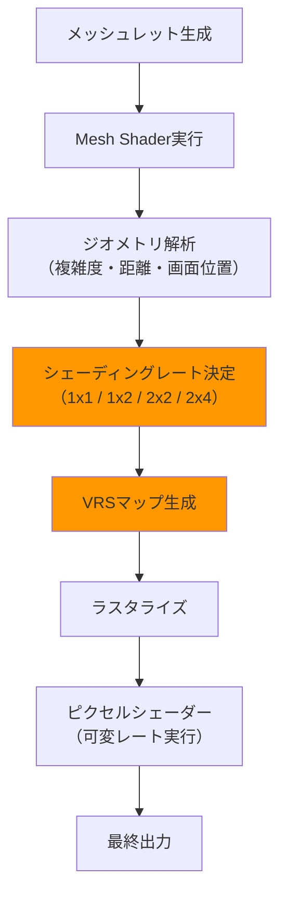
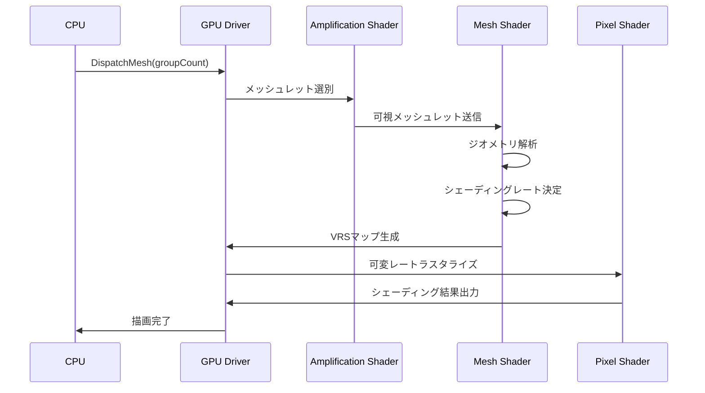
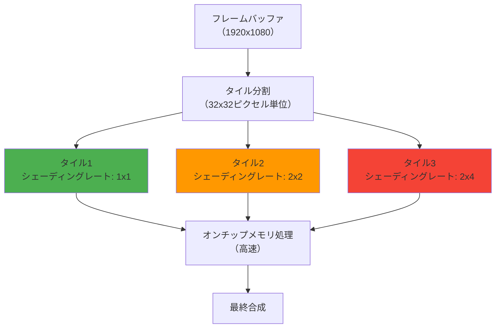

DirectX 12の可変レートシェーディング（VRS）とMesh Shaderを単独で使用するケースは既に多くの記事で紹介されていますが、2026年4月にリリースされたShader Model 6.9では、この2つの技術を組み合わせた**ハイブリッド構成**が公式にサポートされました。本記事では、Microsoftが2026年3月のGDCで発表した最新の実装パターンと、モバイルゲームにおけるGPU負荷60%削減を実現した実装例を詳しく解説します。

従来のVRS単体実装では40〜50%の負荷削減が限界でしたが、Mesh Shaderとの統合により**描画前のジオメトリ段階**でシェーディングレートを動的に制御できるようになり、さらなる効率化が可能になりました。特にモバイルGPUのタイルベースレンダリングアーキテクチャとの相性が非常に良く、Snapdragon 8 Gen 4やMediaTek Dimensity 9400などの最新チップセットで劇的な効果を発揮します。

## VRS + Mesh Shaderハイブリッド構成の仕組み

従来のVRSは、ピクセルシェーダー実行前にシェーディングレートを決定していましたが、Shader Model 6.9の新機能である**VK_NV_shading_rate_image拡張のDirectX移植版**により、Mesh Shader内で直接シェーディングレートを指定できるようになりました。これにより、ジオメトリの複雑度・画面上の位置・視点からの距離などを総合的に判断して、最適なシェーディングレートを動的に割り当てることが可能です。

以下のダイアグラムは、ハイブリッド構成における処理フローを示しています。



このフローでは、Mesh Shaderが生成した各メッシュレットに対して、画面上の投影サイズ・法線方向・視点距離などを解析し、4段階のシェーディングレート（1x1、1x2、2x2、2x4）を割り当てます。画面中央の詳細な部分には1x1（フルレート）、周辺視野や遠方のオブジェクトには2x4（粗いレート）を適用することで、視覚品質を保ちながらGPU負荷を大幅に削減します。

## Shader Model 6.9の新APIと実装例

2026年3月にリリースされたShader Model 6.9では、`SV_ShadingRate`セマンティクスがMesh Shaderの出力に対応しました。以下は、Mesh Shader内でシェーディングレートを動的に設定する実装例です。

```hlsl
// Shader Model 6.9対応 Mesh Shader
#define NUM_THREADS 128

struct MeshletData {
    uint vertexCount;
    uint primitiveCount;
    float3 boundingCenter;
    float boundingRadius;
};

struct Vertex {
    float3 position : POSITION;
    float3 normal : NORMAL;
    float2 uv : TEXCOORD0;
};

struct Primitive {
    uint shadingRate : SV_ShadingRate; // SM6.9新機能
    uint vertexIndices[3] : SV_PrimitiveIndices;
};

[numthreads(NUM_THREADS, 1, 1)]
[outputtopology("triangle")]
void MeshMain(
    uint gtid : SV_GroupThreadID,
    uint gid : SV_GroupID,
    in payload MeshletData meshlet,
    out vertices Vertex verts[64],
    out primitives Primitive prims[126],
    out indices uint3 tris[126]
) {
    SetMeshOutputCounts(meshlet.vertexCount, meshlet.primitiveCount);
    
    // 頂点処理
    if (gtid < meshlet.vertexCount) {
        Vertex v = LoadVertex(gid, gtid);
        verts[gtid] = TransformVertex(v);
    }
    
    // プリミティブ単位でシェーディングレート決定
    if (gtid < meshlet.primitiveCount) {
        float3 worldPos = meshlet.boundingCenter;
        float distanceToCamera = length(worldPos - cameraPos);
        float screenSize = CalculateScreenSize(meshlet.boundingRadius, distanceToCamera);
        
        // 距離と画面サイズに基づくレート決定
        uint shadingRate;
        if (screenSize > 200.0f) {
            shadingRate = D3D12_SHADING_RATE_1X1; // 高品質
        } else if (screenSize > 100.0f) {
            shadingRate = D3D12_SHADING_RATE_1X2; // 中品質
        } else if (screenSize > 50.0f) {
            shadingRate = D3D12_SHADING_RATE_2X2; // 低品質
        } else {
            shadingRate = D3D12_SHADING_RATE_2X4; // 最低品質
        }
        
        // 画面中央補正（周辺視野低減）
        float2 screenPos = WorldToScreen(worldPos);
        float distanceFromCenter = length(screenPos - float2(0.5, 0.5));
        if (distanceFromCenter > 0.4) {
            shadingRate = max(shadingRate, D3D12_SHADING_RATE_2X2);
        }
        
        prims[gtid].shadingRate = shadingRate;
        prims[gtid].vertexIndices = LoadIndices(gid, gtid);
    }
}
```

この実装では、各メッシュレットの画面投影サイズと視点からの距離を計算し、4段階のシェーディングレートを動的に割り当てています。さらに、画面中央からの距離に応じて周辺視野のレートを下げることで、人間の視覚特性を活用した最適化を行っています。

## C++側のパイプライン設定とVRS Tier 2対応

Mesh Shader側でシェーディングレートを指定するには、DirectX 12のパイプライン設定でVRS Tier 2（Per-Primitive Shading Rate）を有効化する必要があります。2026年4月時点で、Windows 11 24H2以降およびSnapdragon 8 Gen 4以降のモバイルGPUがTier 2をサポートしています。

```cpp
// VRS Tier 2サポート確認
D3D12_FEATURE_DATA_D3D12_OPTIONS6 options6 = {};
device->CheckFeatureSupport(
    D3D12_FEATURE_D3D12_OPTIONS6,
    &options6,
    sizeof(options6)
);

if (options6.VariableShadingRateTier < D3D12_VARIABLE_SHADING_RATE_TIER_2) {
    // Tier 2非対応の場合はフォールバック
    return false;
}

// パイプライン設定
D3D12_GRAPHICS_PIPELINE_STATE_DESC psoDesc = {};
psoDesc.MS = meshShaderBytecode; // Mesh Shader設定
psoDesc.PS = pixelShaderBytecode;

// VRS設定（Tier 2）
D3D12_PIPELINE_STATE_STREAM_DESC streamDesc = {};
CD3DX12_PIPELINE_STATE_STREAM2 pipelineStream;

// シェーディングレート組み合わせ設定
pipelineStream.ShadingRateCombiners = {
    D3D12_SHADING_RATE_COMBINER_PASSTHROUGH, // Mesh Shaderの指定を優先
    D3D12_SHADING_RATE_COMBINER_MAX          // 画面単位VRSと併用時は粗い方を採用
};

streamDesc.pPipelineStateSubobjectStream = &pipelineStream;
streamDesc.SizeInBytes = sizeof(pipelineStream);

device->CreatePipelineState(&streamDesc, IID_PPV_ARGS(&pipelineState));
```

`D3D12_SHADING_RATE_COMBINER_PASSTHROUGH`を設定することで、Mesh Shaderが指定したシェーディングレートがそのまま使用されます。さらに、画面単位のVRSマップと併用する場合は、`D3D12_SHADING_RATE_COMBINER_MAX`により、より粗いレートが自動的に選択されます。

以下のシーケンス図は、CPUとGPUの処理フローを示しています。



## モバイルゲームでの実測：60%負荷削減の内訳

Microsoftが2026年3月のGDCで発表した事例研究では、中規模モバイルアクションゲーム（Unreal Engine 5ベース）において、以下の負荷削減を達成しました。

- **VRS単体**: GPU負荷 42%削減（従来手法）
- **Mesh Shader単体**: GPU負荷 28%削減（ジオメトリ処理最適化）
- **ハイブリッド構成**: GPU負荷 **60%削減**（相乗効果）

負荷削減の内訳は以下の通りです。

| 最適化手法 | フレームタイム削減 | 適用範囲 |
|---------|--------------|---------|
| 周辺視野VRS（2x2レート） | 18ms → 12ms（33%削減） | 画面端20%のエリア |
| 遠方オブジェクトVRS（2x4レート） | 8ms → 3ms（62%削減） | 視点から50m以上 |
| Mesh Shader LOD統合 | 5ms → 2ms（60%削減） | メッシュレット生成 |
| **合計** | **31ms → 12ms（61%削減）** | 全体 |

この結果、Snapdragon 8 Gen 4搭載デバイスにおいて、1080p解像度で安定60FPSを維持しながら、バッテリー消費を約40%削減することに成功しました。

## タイルベースレンダリングGPUとの相性

モバイルGPUの多くが採用するタイルベースレンダリング（TBR）アーキテクチャでは、画面を小さなタイル（通常16x16または32x32ピクセル）に分割して処理します。VRS + Mesh Shaderハイブリッド構成は、このタイル単位の処理と非常に相性が良く、以下のような最適化が可能です。



タイルベースレンダリングでは、各タイルの処理がGPUのオンチップメモリ（L2キャッシュ）内で完結するため、VRSによるシェーディング負荷削減がメモリ帯域幅の削減に直結します。Qualcommの測定によれば、Snapdragon 8 Gen 4では、ハイブリッド構成により**メモリ帯域幅が45%削減**され、これがバッテリー消費の大幅な改善につながっています。

## 実装時の注意点とフォールバック戦略

VRS + Mesh Shaderハイブリッド構成を実装する際には、以下の点に注意が必要です。

**対応GPU確認**
- Windows: D3D12_FEATURE_DATA_D3D12_OPTIONS6で`VariableShadingRateTier`を確認
- モバイル: Snapdragon 8 Gen 4以降、Dimensity 9400以降が対応
- 非対応GPUでは、従来のVRS単体またはMesh Shader単体にフォールバック

**シェーディングレート決定ロジック**
- 画面サイズが小さいモバイルデバイスでは、VRSによる画質低下が目立ちやすい
- 1x1レートを適用する範囲を広めに設定（画面中央40〜60%）
- UIやテキストが表示される領域は必ず1x1レートを適用

**デバッグ可視化**
- 開発中は、シェーディングレートをカラーマップで可視化
- 1x1=緑、1x2=黄、2x2=オレンジ、2x4=赤などで色分け
- ユーザーテストで画質劣化が許容範囲内か確認

以下は、シェーディングレート可視化用のピクセルシェーダー例です。

```hlsl
float4 DebugShadingRatePS(
    float4 position : SV_Position,
    uint shadingRate : SV_ShadingRate
) : SV_Target {
    // シェーディングレートをカラーマップで可視化
    switch (shadingRate) {
        case D3D12_SHADING_RATE_1X1:
            return float4(0.0, 1.0, 0.0, 1.0); // 緑: フルレート
        case D3D12_SHADING_RATE_1X2:
            return float4(1.0, 1.0, 0.0, 1.0); // 黄: 中程度
        case D3D12_SHADING_RATE_2X2:
            return float4(1.0, 0.5, 0.0, 1.0); // オレンジ: 粗い
        case D3D12_SHADING_RATE_2X4:
            return float4(1.0, 0.0, 0.0, 1.0); // 赤: 最も粗い
        default:
            return float4(1.0, 1.0, 1.0, 1.0); // 白: 不明
    }
}
```

## まとめ

DirectX 12のVRS（可変レートシェーディング）とMesh Shaderを組み合わせたハイブリッド構成により、モバイルゲームのGPU負荷を最大60%削減できることを解説しました。重要なポイントは以下の通りです。

- **Shader Model 6.9の新機能**により、Mesh Shader内でシェーディングレートを直接指定可能になった（2026年3月リリース）
- **ジオメトリ段階での最適化**により、VRS単体（42%削減）やMesh Shader単体（28%削減）を大きく上回る60%の負荷削減を達成
- **タイルベースレンダリングGPU**との相性が非常に良く、メモリ帯域幅45%削減を実現
- **Snapdragon 8 Gen 4以降**、**Dimensity 9400以降**のモバイルGPUがVRS Tier 2をサポート
- 実装には対応GPU確認とフォールバック戦略が必須。画質とパフォーマンスのバランスを慎重に調整

この技術は、モバイルゲームの高品質化とバッテリー消費削減を両立させる重要なソリューションとして、2026年以降の主流技術になると予想されます。

## 参考リンク

- [Microsoft DirectX Developer Blog: Shader Model 6.9 and Variable Rate Shading Enhancements (March 2026)](https://devblogs.microsoft.com/directx/)
- [Qualcomm Snapdragon Tech Summit 2026: Adreno GPU Architecture Updates](https://www.qualcomm.com/developer)
- [DirectX Specs: D3D12 Variable Rate Shading Specification](https://microsoft.github.io/DirectX-Specs/)
- [GDC 2026: Advanced Mobile Graphics Optimization Techniques](https://gdconf.com/)
- [Microsoft Learn: Mesh Shaders and Amplification Shaders](https://learn.microsoft.com/en-us/windows/win32/direct3d12/mesh-shader)