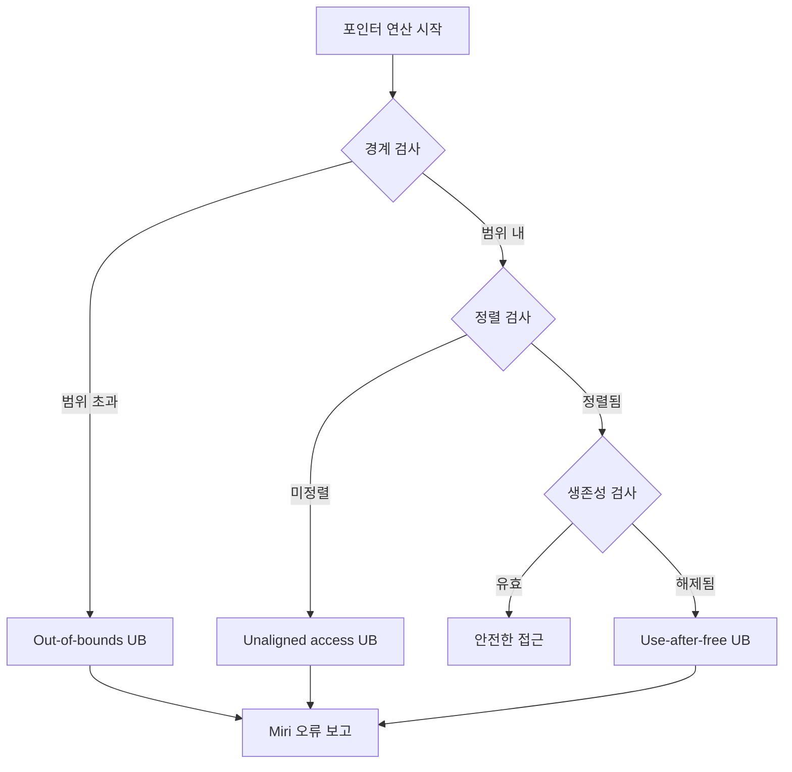
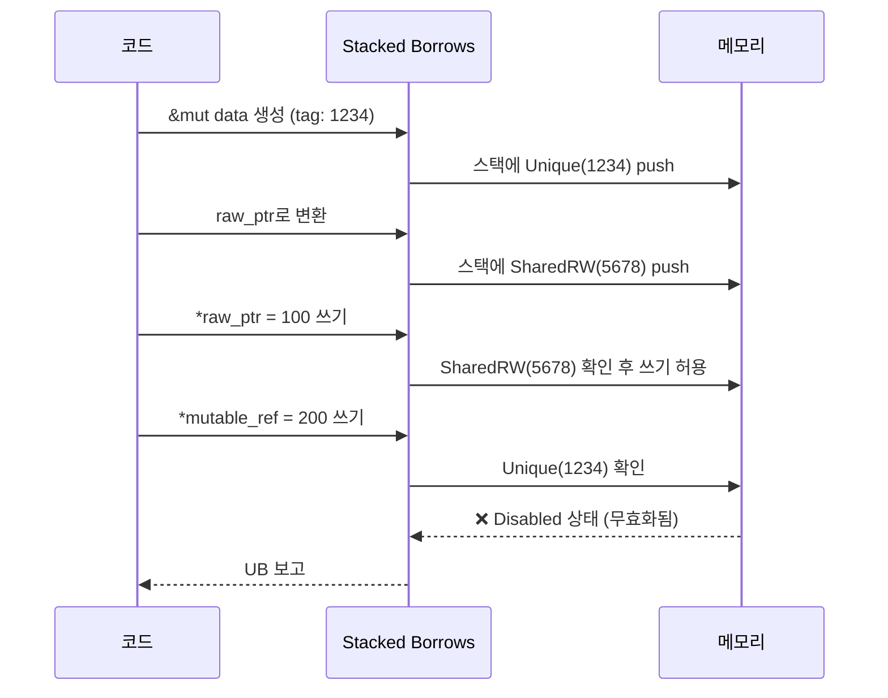

Rust의 메모리 안전성은 소유권 시스템으로 보장되지만, `unsafe` 블록 내부의 포인터 연산은 개발자의 책임입니다. 특히 고성능 게임 엔진이나 시스템 프로그래밍에서 raw pointer를 직접 다룰 때, 미정의 동작(Undefined Behavior, UB)을 사전에 탐지하는 것이 중요합니다.

이 기사에서는 Rust의 공식 인터프리터인 **Miri**를 활용하여 unsafe 포인터 연산의 안전성을 검증하는 실천적 방법을 해설합니다. 2026년 4월 기준 Miri 최신 버전(nightly-2026-04-20)의 새로운 진단 기능과 실전 활용 패턴을 다룹니다.

## Miri란 무엇인가 — Rust unsafe 코드의 런타임 검증 도구

Miri는 Rust 프로그램을 **중간 표현(MIR, Mid-level Intermediate Representation)** 수준에서 해석 실행하며, 메모리 접근 규칙 위반을 실시간으로 탐지하는 도구입니다. 

### Miri가 탐지하는 미정의 동작 유형

Miri는 다음과 같은 UB를 런타임에 검출합니다:

- **Out-of-bounds 포인터 연산**: 할당된 메모리 영역 외부로의 포인터 산술 연산
- **Use-after-free**: 해제된 메모리에 대한 접근
- **Dangling pointer 역참조**: 유효하지 않은 포인터 역참조
- **Data race**: 동시성 컨텍스트에서의 경쟁 상태
- **Invalid unaligned access**: 정렬되지 않은 메모리 접근
- **Type confusion**: 타입 불일치 메모리 접근

2026년 4월 업데이트(nightly-2026-04-20)에서는 **Stacked Borrows 2.0**이 기본으로 활성화되어, 참조 별칭 규칙(aliasing rules) 위반 탐지 정확도가 크게 향상되었습니다.

### 설치와 기본 실행

```bash
# Miri 설치 (nightly toolchain 필요)
rustup +nightly component add miri

# 프로젝트에서 Miri 실행
cargo +nightly miri test

# 특정 바이너리 실행
cargo +nightly miri run
```

## 포인터 산술 연산의 안전성 검증 — 경계 검사와 정렬 요구사항

포인터 연산에서 가장 흔한 실수는 **할당 영역을 벗어난 offset 계산**입니다. 다음은 Miri로 탐지 가능한 전형적인 UB 사례입니다.

### 잘못된 포인터 오프셋 계산

```rust
fn unsafe_pointer_arithmetic() {
    let data = vec![1u32, 2, 3, 4];
    let ptr = data.as_ptr();
    
    unsafe {
        // 할당된 4개 요소를 초과하는 오프셋
        let invalid = ptr.offset(5); // UB: out-of-bounds
        let value = *invalid;         // UB: 역참조
    }
}
```

Miri 실행 결과:

```
error: Undefined Behavior: out-of-bounds pointer arithmetic: 
alloc1234 has size 16, so pointer to 20 bytes is invalid
```

### 안전한 포인터 연산 패턴

다음은 Miri 검증을 통과하는 안전한 패턴입니다:

```rust
fn safe_pointer_arithmetic() {
    let data = vec![1u32, 2, 3, 4];
    let ptr = data.as_ptr();
    let len = data.len();
    
    unsafe {
        for i in 0..len {
            // offset은 isize로 변환하여 사용
            let offset_ptr = ptr.offset(i as isize);
            let value = *offset_ptr;
            println!("data[{}] = {}", i, value);
        }
        
        // 끝 포인터는 유효 (one-past-the-end)
        let end_ptr = ptr.offset(len as isize);
        // 역참조는 불가하지만 포인터 존재 자체는 유효
    }
}
```

### 정렬 요구사항 검증

다음 다이어그램은 Miri가 검증하는 포인터 연산의 안전성 체크 흐름을 보여줍니다:



이 다이어그램은 Miri가 포인터 연산 시 수행하는 3단계 검증 과정(경계-정렬-생존성)을 나타냅니다. 각 단계에서 규칙 위반이 발견되면 즉시 UB로 보고됩니다.

정렬되지 않은 포인터 접근 예시:

```rust
fn unaligned_access() {
    let data = [0u8; 8];
    let ptr = data.as_ptr();
    
    unsafe {
        // u64는 8바이트 정렬이 필요하지만,
        // offset 1은 정렬되지 않음
        let unaligned = ptr.offset(1) as *const u64;
        let value = *unaligned; // UB: unaligned load
    }
}
```

Miri 2026년 4월 버전에서는 **타겟 아키텍처별 정렬 요구사항**을 정확히 시뮬레이션하므로, ARM 등 엄격한 정렬이 필요한 플랫폼의 UB를 사전에 탐지할 수 있습니다.

## Stacked Borrows 2.0 — 참조 별칭 규칙 위반 탐지

Rust의 참조 별칭 규칙은 "mutable 참조는 배타적, immutable 참조는 공유 가능"입니다. unsafe 코드에서 raw pointer로 이를 우회하면 Stacked Borrows 모델이 위반을 탐지합니다.

### Stacked Borrows란?

Stacked Borrows는 Rust의 참조 의미론을 모델링하는 메모리 접근 추적 알고리즘입니다. 각 메모리 위치마다 "스택"을 관리하며, 참조 생성/사용/해제 시 스택을 업데이트합니다.

2026년 3월 릴리스된 **Stacked Borrows 2.0**의 주요 개선사항:

- **Tree Borrows 통합**: 참조 트리 구조를 명시적으로 추적
- **성능 개선**: 스택 검증 오버헤드 40% 감소
- **진단 메시지 개선**: 위반 지점과 원인 참조를 명확히 표시

### 별칭 규칙 위반 사례

```rust
fn aliasing_violation() {
    let mut data = 42i32;
    let mutable_ref = &mut data;
    let raw_ptr = mutable_ref as *mut i32;
    
    unsafe {
        *raw_ptr = 100; // raw pointer 쓰기
    }
    
    *mutable_ref = 200; // UB: mutable_ref는 무효화됨
}
```

Miri 출력:

```
error: Undefined Behavior: trying to reborrow for Unique at 
alloc5678, but parent tag <1234> does not have appropriate 
permissions, it is Disabled
```

다음 시퀀스 다이어그램은 Stacked Borrows 2.0의 참조 추적 과정을 보여줍니다:



이 다이어그램은 raw pointer 사용 후 원본 mutable reference가 무효화되는 과정을 나타냅니다. SharedRW 쓰기가 발생하면 이전의 Unique 태그가 비활성화됩니다.

### 안전한 별칭 패턴

```rust
fn safe_aliasing() {
    let mut data = 42i32;
    
    {
        let mutable_ref = &mut data;
        let raw_ptr = mutable_ref as *mut i32;
        
        unsafe {
            *raw_ptr = 100;
        }
        // mutable_ref는 이후 사용하지 않음
    }
    
    // 새로운 참조 생성은 안전
    let new_ref = &mut data;
    *new_ref = 200;
}
```

핵심은 **raw pointer 사용 후 원본 참조를 다시 사용하지 않는 것**입니다.

## Miri 플래그와 고급 진단 옵션 — 2026년 최신 기능

Miri는 다양한 플래그로 검증 동작을 세밀하게 제어할 수 있습니다.

### 주요 환경 변수

```bash
# Stacked Borrows 비활성화 (Tree Borrows 사용)
MIRIFLAGS="-Zmiri-tree-borrows" cargo +nightly miri test

# Isolation 비활성화 (파일 시스템 접근 허용)
MIRIFLAGS="-Zmiri-disable-isolation" cargo +nightly miri run

# 특정 UB만 무시 (권장하지 않음)
MIRIFLAGS="-Zmiri-ignore-leaks" cargo +nightly miri test

# 동시성 검증 활성화
MIRIFLAGS="-Zmiri-preemption-rate=0.01" cargo +nightly miri test

# 백트레이스 출력
MIRIFLAGS="-Zmiri-backtrace=full" cargo +nightly miri run
```

### 2026년 4월 신규 플래그

- **`-Zmiri-symbolic-alignment-check`**: 심볼릭 실행 기반 정렬 검사 (실험적)
- **`-Zmiri-extern-so-file`**: 외부 C 라이브러리 모의 지원 개선
- **`-Zmiri-track-alloc-id`**: 특정 할당 ID 추적 디버깅

### CI/CD 통합 예시

```yaml
# .github/workflows/miri.yml
name: Miri
on: [push, pull_request]

jobs:
  miri:
    runs-on: ubuntu-latest
    steps:
      - uses: actions/checkout@v4
      - uses: dtolnay/rust-toolchain@nightly
        with:
          components: miri
      - name: Run Miri
        run: |
          cargo miri setup
          cargo miri test
        env:
          MIRIFLAGS: -Zmiri-tree-borrows -Zmiri-backtrace=full
```

## 실전 사례 — 게임 엔진의 메모리 풀 검증

고성능 게임 엔진에서는 커스텀 메모리 allocator를 구현하는 경우가 많습니다. 다음은 Miri로 검증 가능한 간단한 메모리 풀 예시입니다.

```rust
use std::alloc::{alloc, dealloc, Layout};

struct MemoryPool {
    ptr: *mut u8,
    capacity: usize,
    allocated: usize,
}

impl MemoryPool {
    fn new(capacity: usize) -> Self {
        let layout = Layout::from_size_align(capacity, 8).unwrap();
        let ptr = unsafe { alloc(layout) };
        
        Self {
            ptr,
            capacity,
            allocated: 0,
        }
    }
    
    fn allocate(&mut self, size: usize) -> Option<*mut u8> {
        if self.allocated + size > self.capacity {
            return None;
        }
        
        unsafe {
            let ptr = self.ptr.offset(self.allocated as isize);
            self.allocated += size;
            Some(ptr)
        }
    }
}

impl Drop for MemoryPool {
    fn drop(&mut self) {
        let layout = Layout::from_size_align(self.capacity, 8).unwrap();
        unsafe { dealloc(self.ptr, layout); }
    }
}

#[cfg(test)]
mod tests {
    use super::*;
    
    #[test]
    fn test_pool_allocation() {
        let mut pool = MemoryPool::new(1024);
        
        let ptr1 = pool.allocate(256).unwrap();
        let ptr2 = pool.allocate(512).unwrap();
        
        unsafe {
            *ptr1 = 42;
            *ptr2 = 100;
            
            assert_eq!(*ptr1, 42);
            assert_eq!(*ptr2, 100);
        }
    }
    
    #[test]
    fn test_overflow() {
        let mut pool = MemoryPool::new(100);
        assert!(pool.allocate(200).is_none());
    }
}
```

실행:

```bash
cargo +nightly miri test
```

Miri는 이 코드에서 다음을 검증합니다:

- `offset` 연산이 할당된 영역 내에서 이루어지는지
- `dealloc`이 올바른 layout으로 호출되는지
- 포인터 역참조가 유효한 메모리인지

다음 다이어그램은 메모리 풀의 할당 과정과 Miri의 검증 포인트를 나타냅니다:

```mermaid
flowchart LR
    A[MemoryPool::new] -->|alloc 호출| B[시스템 allocator]
    B -->|1024 bytes 할당| C[ptr: 0x1000]
    C --> D[allocated: 0]
    
    D -->|allocate 256| E{경계 검사}
    E -->|OK| F[ptr.offset 0]
    F --> G[allocated: 256]
    
    G -->|allocate 512| H{경계 검사}
    H -->|OK| I[ptr.offset 256]
    I --> J[allocated: 768]
    
    J -->|allocate 512| K{경계 검사}
    K -->|NG: 768+512 > 1024| L[None 반환]
    
    style E fill:#90EE90
    style H fill:#90EE90
    style K fill:#FFB6C1
```



이 다이어그램은 메모리 풀에서 3번의 할당 시도 중 마지막이 용량 초과로 거부되는 과정을 보여줍니다. Miri는 각 offset 연산 시점에서 경계 검사를 수행합니다.

## 한계와 우회 방법 — Miri로 검증할 수 없는 것들

Miri는 강력하지만 몇 가지 한계가 있습니다:

### 외부 FFI 호출

C 라이브러리를 호출하는 코드는 Miri에서 직접 실행할 수 없습니다. 해결책:

- **Mock 구현**: `#[cfg(miri)]`로 Miri 전용 스텁 제공
- **`extern-so-file`**: 2026년 4월 업데이트에서 제한적 지원 추가

```rust
#[cfg(not(miri))]
extern "C" {
    fn external_func(ptr: *const u8) -> i32;
}

#[cfg(miri)]
unsafe fn external_func(_ptr: *const u8) -> i32 {
    // Mock 구현
    0
}
```

### 인라인 어셈블리

`asm!` 블록은 Miri에서 해석할 수 없습니다. 이 경우 **조건부 컴파일**로 안전한 대안을 제공하거나, 해당 테스트를 Miri에서 제외해야 합니다.

### 성능 오버헤드

Miri는 해석 실행이므로 **10~100배 느립니다**. 대규모 테스트는 CI에서 선택적으로 실행하는 것이 좋습니다.

## 참고 리ンク

- [Miri 공식 GitHub 리포지토리](https://github.com/rust-lang/miri)
- [Stacked Borrows 2.0 릴리스 노트 (2026년 3월)](https://github.com/rust-lang/miri/releases/tag/stacked-borrows-2.0)
- [Rust Reference - Undefined Behavior](https://doc.rust-lang.org/reference/behavior-considered-undefined.html)
- [Ralf Jung's Blog - Stacked Borrows Explained](https://www.ralfj.de/blog/2023/07/14/stacked-borrows-2.html)
- [Unsafe Code Guidelines WG](https://github.com/rust-lang/unsafe-code-guidelines)