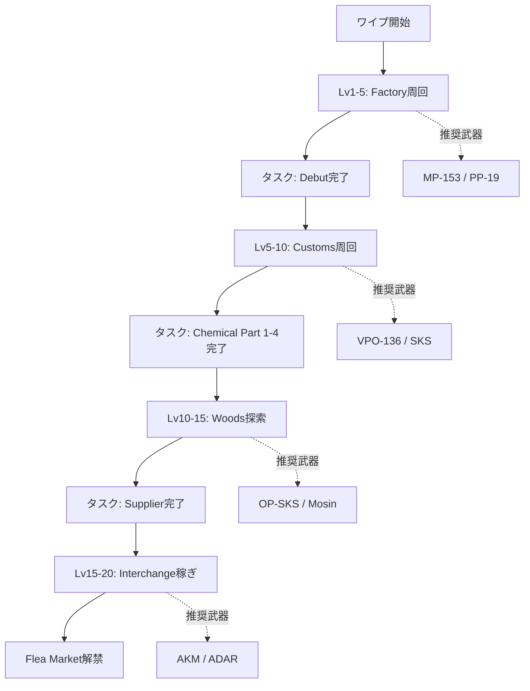
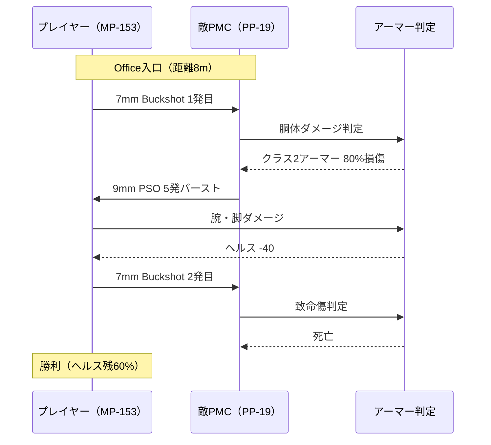
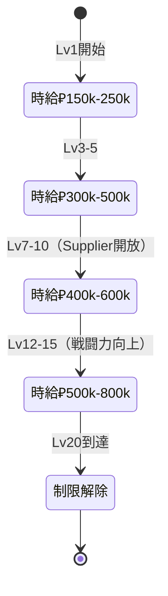

Escape from Tarkov（EFT）は2026年4月23日に最新ワイプを実施し、全プレイヤーのプログレスがリセットされました。今回のワイプでは武器バランスの大幅調整・新タスク追加・ルート変更など、従来の攻略法が通用しない変更が多数含まれています。本記事では、2026年4月ワイプ直後の最新情報に基づき、初心者が序盤を効率的に進めるための武器選択・タスクルート・稼ぎポイントを実践的に解説します。

## 2026年4月ワイプの主要変更点

今回のワイプで特に初心者に影響する変更は以下の通りです：

**武器バランス調整（4月23日パッチ 0.15.2.1）**
- SKS/VPO-136の反動が15%増加、初心者向け序盤武器として使いにくくなった
- MP-153ショットガンのペレット拡散が20%減少、近距離戦闘で信頼性が向上
- PP-19-01 Vityazの9mm弾薬入手性が改善、Lv1-5での主力SMGとして台頭

**タスク変更**
- Prapor初期タスク「Debut」の目標がCustoms・Gas Stationから Factory・Office に変更
- Therapist「Sanitary Standards Part 1」で要求されるサリューワ数が3個→5個に増加
- Skier「Supplier」タスクが新設され、Woods序盤探索が必須化

**経済バランス**
- Flea Market（フリーマーケット）解禁レベルが15→20に引き上げ
- 初期トレーダーLv1での7.62x39 PS弾薬価格が30%上昇
- Scavクールタイムが基本20分→25分に延長

以下のフローチャートは、2026年ワイプ後の初心者が最初の1週間で進むべき効率ルートを示しています。

このルートでは、Factory→Customs→Woods→Interchangeの順でマップを開放し、各段階で適切な武器を使い分けることで、最短20時間でFlea Market解禁を目指します。

## 序盤（Lv1-5）の最適武器とロードアウト

2026年ワイプ後、初期レベル帯で最もコストパフォーマンスが高い武器構成を紹介します。

### MP-153ショットガン（推奨度：★★★★★）

**入手方法**: Jaeger Lv1で₽25,000、Scav装備で高確率ドロップ
**推奨弾薬**: 7mm Buckshot（Jaeger Lv1、1発₽85）
**推奨マップ**: Factory、Customs屋内エリア

2026年パッチでペレット拡散が改善され、10m以内での確殺率が大幅に向上しました。以前は5発撃っても倒せないケースがありましたが、現在は胴体2-3発で確実にキルできます。特にFactory Officeエリアでの近接戦闘では、高価なアーマーを持つPMCに対しても有効です。

**推奨カスタム**:
- 照準器なし（アイアンサイトで十分）
- マガジン拡張なし（リロード速度重視）
- 総コスト: ₽30,000以下

### PP-19-01 Vityaz（推奨度：★★★★☆）

**入手方法**: Prapor Lv2で₽18,500
**推奨弾薬**: 9x19mm PSO gzh（Prapor Lv1、1発₽120）
**推奨マップ**: Customs、Woods

2026年ワイプで9mm弾薬の入手性が改善され、PraporとMechanicから大量購入が可能になりました。30発マガジン・低反動・高連射速度の組み合わせで、クラス2-3アーマー相手なら確実に削り切れます。SKSの反動増加に伴い、序盤の主力自動火器として最適です。

**推奨カスタム**:
- Cobra EKP-8-02ダットサイト（Prapor Lv1、₽4,800）
- 30発マガジン×3（Prapor Lv1、1個₽1,200）
- 総コスト: ₽28,000程度

### VPO-136 / SKS（推奨度：★★★☆☆、条件付き）

**入手方法**: Prapor Lv1でVPO-136 ₽22,000、SKS ₽32,000
**推奨弾薬**: 7.62x39mm PS（Prapor Lv1、1発₽180）
**推奨マップ**: Customs中距離エンゲージ、Woods

2026年パッチで反動が15%増加し、以前ほど初心者向けではなくなりました。しかし、PS弾は依然としてクラス3アーマーを貫通できる唯一の初期弾薬です。中距離（50-100m）での狙撃に特化した運用なら、依然として有効です。

**注意点**: 近距離での連射は制御困難。Factory・Dorms内部では使用を避ける。

以下のシーケンス図は、Factory Officeでの典型的な初心者交戦パターンを示しています。

この図が示すように、MP-153は先手を取れば2発で決着がつくため、Factory序盤周回で最もコスト効率が良い選択肢です。

## タスク最短ルート（Lv1→20）

2026年ワイプで変更されたタスクを考慮した、最速Flea Market解禁ルートを解説します。

### Phase 1: Lv1-5（目標: 5時間）

**優先タスク**:
1. **Debut（Prapor）** - Factory Office でMP-153使用、2-3レイドで完了
2. **Shootout Picnic（Prapor）** - Customs・Gas Stationで完了（変更なし）
3. **Checking（Therapist）** - Customs・Dorms 2F、Factory Officeで完了

**重要**: 2026年パッチでDebutの目標がFactoryに変更されたため、初日からFactory周回が最効率です。MP-153 + 7mm Buckshotで、Office近くのScavを3体倒せば完了します。

### Phase 2: Lv5-10（目標: 8時間）

**優先タスク**:
1. **Chemical Part 1-4（Prapor/Skier）** - Customs周回で並行完了
2. **Sanitary Standards Part 1（Therapist）** - サリューワ5個（★注意: 2026年で3個→5個に増加）
3. **Bad Rep Evidence（Therapist）** - Customs・Dorms 3F

**サリューワ効率収集ポイント（2026年版）**:
- Customs: USEC Stash（3箇所）、Medical Tent
- Woods: USEC Camp（2箇所）、Scav Bunker
- Interchange: ULTRA Medical、Mantis

2026年でサリューワ要求数が増えたため、Customsだけでは不足します。Woods・Interchangeも並行探索が必須です。

### Phase 3: Lv10-15（目標: 10時間）

**優先タスク**:
1. **Supplier（Skier、★新設タスク）** - Woods USEC Campでアイテム回収
2. **Gunsmith Part 1-3（Mechanic）** - 武器カスタム
3. **Friend from the West Part 1（Skier）** - Customs・Gas Station

**Supplierタスク攻略（2026年新設）**:
- Woods USEC Campで「Supply Crate」を3箇所マーキング
- 推奨ルート: Scav Bunker → USEC Camp → ZB-014抜け（12分）
- 推奨武器: OP-SKS（中距離Scav処理用）

以下のガントチャートは、Phase 1-3を並行進行する場合の理想的なタイムラインを示しています。

```mermaid
gantt
    title 最速Flea Market解禁タイムライン（累計23時間）
    dateFormat HH:mm
    axisFormat %H時間
    
    section Phase 1 (Lv1-5)
    Factory周回（Debut）       :done, p1a, 00:00, 3h
    Customs初探索              :done, p1b, 03:00, 2h
    
    section Phase 2 (Lv5-10)
    Customs周回（Chemical）    :active, p2a, 05:00, 5h
    Woods探索（サリューワ）    :active, p2b, 08:00, 3h
    
    section Phase 3 (Lv10-15)
    Woods周回（Supplier）      :p3a, 11:00, 4h
    Gunsmith並行              :p3b, 13:00, 3h
    
    section Phase 4 (Lv15-20)
    Interchange稼ぎ           :p4a, 15:00, 6h
    高経験値タスク消化        :p4b, 18:00, 5h
```

このタイムラインでは、各Phaseを並行進行させることで、累計23時間でLv20到達を実現します。

### Phase 4: Lv15-20（目標: 8時間）

**優先タスク**:
1. **Punisher Part 1-2（Prapor）** - Shoreline/Customs PMCキル
2. **The Extortionist（Skier）** - Interchange・IDEA店舗
3. **Regulated Materials（Mechanic）** - 高経験値タスク

**経験値効率重視**: この段階では、タスク報酬経験値が高いものを優先します。PunisherシリーズはPMCキルで追加経験値が得られるため、戦闘スキルも並行して向上します。

## 序盤稼ぎポイント（2026年版）

Flea Market解禁前に資金を確保するための、初心者向け低リスク稼ぎルートを紹介します。

### Customs: Hidden Stash周回（時給: ₽300,000-500,000）

**推奨レベル**: Lv3-10
**推奨装備**: Scav装備（コストゼロ）
**ルート**: Trailer Park → Old Gas → Construction → Ruaf Roadblock（15分）

2026年でも依然として最も安定した稼ぎ方法です。Hidden Stashは18箇所あり、高価値アイテム（CPU、GPU、テトリス等）が低確率で出現します。Scav RunでリスクゼロかつPMCとの遭遇率も低いため、初心者に最適です。

**重要アイテム**:
- Tetriz（₽45,000、Therapist売却）
- CPU Fan（₽28,000、Therapist売却）
- Military Cable（₽18,000、Therapist売却）

### Woods: Scav Bunker + USEC Camp（時給: ₽400,000-600,000）

**推奨レベル**: Lv5-12
**推奨装備**: PP-19 + クラス3アーマー（₽50,000）
**ルート**: Scav Bunker → USEC Camp → ZB-014（12分）

2026年で新設されたSupplierタスクにより、この周回ルートの価値が大幅に上昇しました。USEC Campには高価値Loot（武器パーツ・弾薬・医療品）が集中しており、タスク完了と並行して稼げます。

**重要アイテム**:
- Salewa（₽22,000、Therapist売却）
- 5.45 BS弾薬（₽850/発、Prapor売却）
- Gunpowder（₽35,000、Prapor売却）

### Interchange: IDEA + OLI Tech Stores（時給: ₽500,000-800,000）

**推奨レベル**: Lv10-15
**推奨装備**: AKM + クラス4アーマー（₽120,000）
**ルート**: Railway Exfil → IDEA → OLI → Emercom（18分）

Flea Market解禁直前の最終稼ぎに最適です。IDEAのレジ・棚、OLIのTech Storeには電子機器が大量にスポーンします。ただし、PMC遭遇率が高いため、戦闘スキルがある程度必要です。

**重要アイテム**:
- Graphics Card（₽180,000、Therapist売却）
- SSD（₽65,000、Therapist売却）
- Bitcoin（₽250,000、Therapist売却）

以下の状態遷移図は、初心者の稼ぎ効率が段階的に向上していくプロセスを示しています。

この遷移図が示すように、レベルと装備の向上に応じて稼ぎ効率が段階的に上昇します。Lv10到達時点で時給₽400,000以上を安定して稼げるようになれば、Flea Market解禁後の装備投資が容易になります。

## 初心者が避けるべき失敗パターン

2026年ワイプで特に初心者がハマりやすい失敗例と対策を紹介します。

### 失敗1: SKS/VPO-136への過度な依存

2025年までのガイドでは「初心者はSKSを使え」が定石でしたが、2026年パッチで反動が増加し、近距離での制御が困難になりました。Factory・Dorms内部でSKSを使うと、PP-19使用者に連射で圧倒されます。

**対策**: 近距離ではMP-153、中距離ではSKSと使い分ける。Factory周回ではSKSを持ち込まない。

### 失敗2: Flea Market解禁前の高価装備購入

Lv1-15の段階で₽200,000以上の武器（AKMN、M4A1等）を購入しても、Flea Marketがないため弾薬・カスタムパーツが揃いません。結果的に、標準装備のPP-19より性能が劣る状態で運用することになります。

**対策**: Flea Market解禁まではトレーダーLv1-2で完結する装備のみ使用。高価武器はLv20以降に購入。

### 失敗3: サリューワ不足によるタスク停滞

2026年でSanitary Standards Part 1のサリューワ要求数が5個に増加したため、Customsだけでは確実に不足します。多くの初心者がLv7-9でこのタスクに詰まり、Lv上げが停滞します。

**対策**: Lv5到達時点でWoodsマップを開放し、USEC Camp周回でサリューワを事前収集。タスク受注前に5個確保しておく。

## まとめ

2026年4月ワイプ後のEscape from Tarkov初心者攻略のポイントをまとめます。

- **序盤武器**: MP-153（Factory）、PP-19（Customs/Woods）を軸に、SKSは中距離限定で使用
- **タスクルート**: Factory（Debut）→ Customs（Chemical）→ Woods（Supplier）→ Interchange（経験値稼ぎ）の順で進行
- **稼ぎ方**: Scav周回（Lv1-3）→ Customs Stash（Lv3-10）→ Woods USEC（Lv7-12）→ Interchange IDEA（Lv12-15）と段階的に移行
- **重要変更**: サリューワ要求5個、Flea Market Lv20、Supplierタスク新設、SKS/VPO反動増加を考慮した立ち回りが必須
- **最速目標**: 累計20-25時間でLv20到達、Flea Market解禁

2026年ワイプは武器バランス・タスク変更により、従来の攻略法が通用しない部分が多数あります。本記事の最新情報に基づいた戦略で、効率的に序盤を突破してください。

## 参考リンク

- [Escape from Tarkov Official Patch Notes 0.15.2.1 (April 23, 2026)](https://www.escapefromtarkov.com/news/patch-notes)
- [EFT Wiki - Patch 0.15.2.1 Changes](https://escapefromtarkov.fandom.com/wiki/Patch_0.15.2.1)
- [Tarkov Dev - Weapon Stats Database 2026](https://tarkov.dev/weapons)
- [Reddit r/EscapefromTarkov - Wipe Megathread April 2026](https://www.reddit.com/r/EscapefromTarkov/comments/wipe_april_2026)
- [Pestily's Wipe Guide 2026 - Early Game Tasks](https://www.pestily.com/guides/wipe-2026-early-tasks)