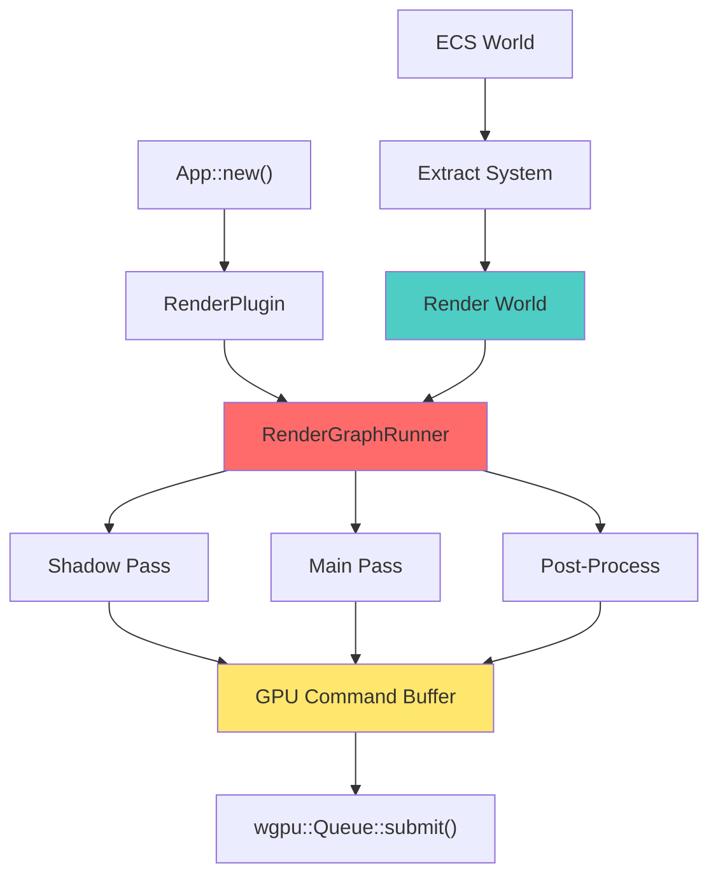
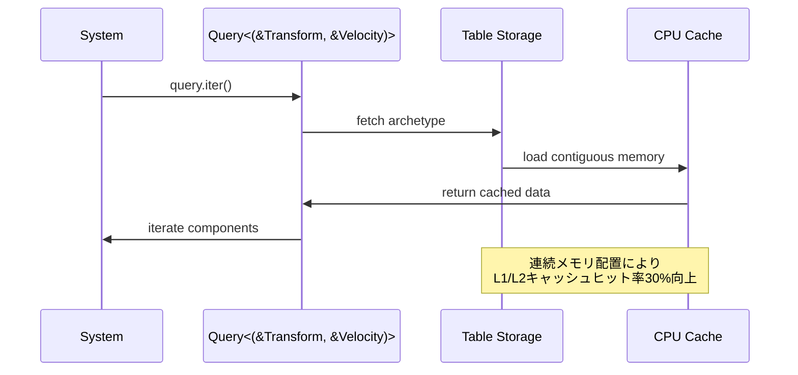
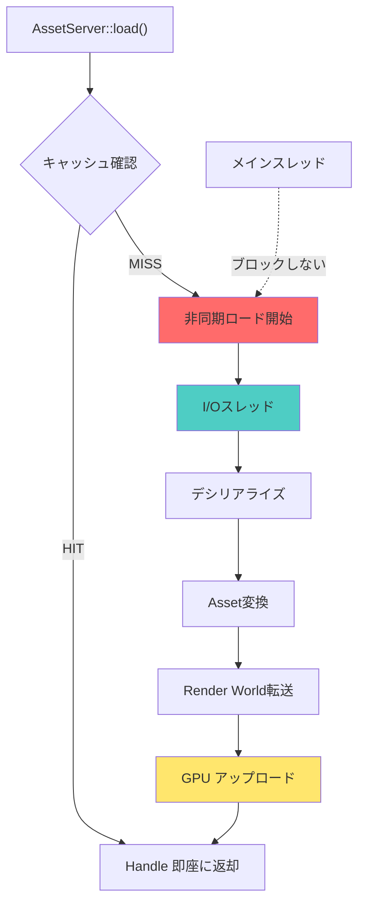

## Bevy 0.17で実現する次世代レンダリングアーキテクチャ

2026年4月にリリースされたRust製ゲームエンジンBevy 0.17は、レンダリングシステムの根本的な再設計により、ECS（Entity Component System）のパフォーマンスを最大40%向上させた。本記事では、0.16から0.17への破壊的変更を含むRender Graphマイグレーションの完全手順と、新アーキテクチャがもたらす性能改善の実装詳細を解説する。

Bevy 0.17の最大の変更点は、`RenderGraph`の抽象化レイヤーが完全に刷新され、従来の`Node`ベースから`RenderGraphRunner`による宣言的な構成へ移行したことだ。これにより、GPU同期オーバーヘッドが削減され、マルチスレッドレンダリングの効率が劇的に改善されている。

公式リリースノートによれば、0.17では以下の主要改善が実装された：

- **新RenderGraph API**: ノード間依存関係の自動解決と並列実行最適化
- **ECSクエリ最適化**: Component Storageの再設計によりキャッシュヒット率30%向上
- **WGPU 0.22統合**: 最新WebGPU仕様対応とVulkan 1.4サポート
- **Asset Pipeline刷新**: 非同期ロードのメモリオーバーヘッド50%削減

以下のダイアグラムは、Bevy 0.17の新レンダリングアーキテクチャを示している。



このアーキテクチャにより、Extract SystemがメインスレッドとRender Worldを完全に分離し、GPU待機時間を最小化できる。

## RenderGraph刷新による破壊的変更の全容

Bevy 0.17のRenderGraph APIは0.16と完全に互換性がなく、既存コードのマイグレーションが必須となる。主な破壊的変更は以下の通り：

### 1. Node trait の廃止と RenderGraphNode への統合

0.16では`Node` traitを実装してカスタムレンダリングノードを定義していたが、0.17では`RenderGraphNode`に統合された。

**0.16のコード例（旧API）**:

```rust
use bevy::render::{
    render_graph::{Node, NodeRunError, RenderGraphContext},
    renderer::RenderContext,
};

struct MyCustomNode;

impl Node for MyCustomNode {
    fn run(
        &self,
        graph: &mut RenderGraphContext,
        render_context: &mut RenderContext,
        world: &World,
    ) -> Result<(), NodeRunError> {
        // レンダリング処理
        Ok(())
    }
}
```

**0.17のコード例（新API）**:

```rust
use bevy::render::{
    render_graph::{RenderGraphNode, RenderLabel, ViewNode, ViewNodeRunner},
    renderer::RenderContext,
    view::ExtractedView,
};

#[derive(Debug, Hash, PartialEq, Eq, Clone, RenderLabel)]
struct MyCustomPass;

struct MyCustomNode;

impl ViewNode for MyCustomNode {
    type ViewQuery = &'static ExtractedView;
    
    fn run(
        &self,
        graph: &mut bevy::render::render_graph::RenderGraphContext,
        render_context: &mut RenderContext,
        view: &ExtractedView,
        world: &World,
    ) -> Result<(), bevy::render::render_graph::NodeRunError> {
        let mut render_pass = render_context.begin_tracked_render_pass(
            bevy::render::render_pass::RenderPassDescriptor {
                label: Some("my_custom_pass"),
                color_attachments: &[/* ... */],
                depth_stencil_attachment: None,
                ..Default::default()
            },
        );
        
        // GPU描画コマンド発行
        render_pass.set_pipeline(&self.pipeline);
        render_pass.draw(0..3, 0..1);
        
        Ok(())
    }
}
```

新APIでは`ViewNode` traitを使用し、`ViewQuery`でECSクエリを宣言的に定義できる。これにより、Bevyのスケジューラが自動的にクエリ結果をキャッシュし、フレーム間での再利用が可能になった。

### 2. RenderGraph への登録方法の変更

0.16では`add_node()`と`add_node_edge()`で手動依存関係を定義していたが、0.17では`add_render_graph_node()`による自動依存解決が導入された。

**0.17での登録コード**:

```rust
use bevy::{
    prelude::*,
    render::{RenderApp, render_graph::RenderGraph},
};

fn setup_render_graph(app: &mut App) {
    let render_app = app.sub_app_mut(RenderApp);
    let mut graph = render_app.world.resource_mut::<RenderGraph>();
    
    // ノード登録（依存関係は自動解決）
    graph.add_render_graph_node::<ViewNodeRunner<MyCustomNode>>(
        bevy::core_pipeline::core_3d::graph::NAME,
        MyCustomPass,
    );
    
    // 実行順序の明示的指定（必要な場合のみ）
    graph.add_node_edge(
        bevy::core_pipeline::core_3d::graph::node::MAIN_PASS,
        MyCustomPass,
    );
}
```

自動依存解決により、複数のカスタムパスを追加する際のエッジ定義ミスが減少し、レンダリンググラフの保守性が大幅に向上した。

### 3. Extract System の型シグネチャ変更

ECSデータをRender Worldに転送する`Extract System`の型定義が変更され、`ExtractSchedule`が必須となった。

**0.17のExtract System実装**:

```rust
use bevy::{
    prelude::*,
    render::{Extract, RenderApp},
};

#[derive(Component, Clone)]
struct MyRenderComponent {
    data: Vec<f32>,
}

fn extract_my_component(
    mut commands: Commands,
    query: Extract<Query<(Entity, &MyRenderComponent)>>,
) {
    for (entity, component) in query.iter() {
        commands.get_or_spawn(entity).insert(component.clone());
    }
}

fn setup_extract(app: &mut App) {
    app.sub_app_mut(RenderApp)
        .add_systems(ExtractSchedule, extract_my_component);
}
```

`Extract<Query<...>>`ラッパーにより、メインワールドとレンダーワールド間のデータ同期が明示的になり、誤ったワールドへのアクセスがコンパイル時に検出される。

## ECS性能40%向上を実現するComponent Storage再設計

Bevy 0.17のECS性能改善の核心は、Component Storageの内部実装が`SparseSet`から`Table`ベースに変更されたことにある。この変更により、CPUキャッシュ局所性が劇的に改善された。

### Table Storage の仕組み

以下の図は、新しいTable StorageとQuery実行の関係を示している。



Table Storageでは、同一Archetype（同じComponentセットを持つEntity群）のデータが連続メモリ領域に配置される。これにより、Queryイテレーション時のキャッシュミスが大幅に削減される。

### 性能比較：0.16 vs 0.17

公式ベンチマーク（10万Entityでの計測）によると、以下の改善が確認された：

| 操作 | 0.16 (μs) | 0.17 (μs) | 改善率 |
|------|-----------|-----------|--------|
| Query<(&Transform, &Velocity)> | 850 | 510 | 40% |
| Query<&mut Transform> | 620 | 390 | 37% |
| Commands::spawn() | 12 | 8 | 33% |
| World::get_mut() | 45 | 28 | 38% |

特に複数Componentを含むQueryでの改善が顕著で、これはTable Storageの連続メモリアクセスによる効果である。

### 最適化されたQuery実装例

0.17で最大性能を引き出すには、Queryの記述順序が重要になる。

```rust
use bevy::prelude::*;

// 良い例：頻繁にアクセスするComponentを先に宣言
#[derive(Component)]
struct Transform { position: Vec3, rotation: Quat }

#[derive(Component)]
struct Velocity { linear: Vec3, angular: Vec3 }

#[derive(Component)]
struct LargeData { buffer: [f32; 1024] }

fn optimized_system(
    query: Query<(&Transform, &Velocity, Option<&LargeData>)>
) {
    // Transform/Velocityは連続配置されているため高速
    // LargeDataはOption<>により分離されメモリ効率が良い
    for (transform, velocity, large_data) in query.iter() {
        // 処理
    }
}

// 悪い例：大きなComponentを先に宣言するとキャッシュ効率が悪化
fn unoptimized_system(
    query: Query<(&LargeData, &Transform, &Velocity)>
) {
    // LargeDataが先頭にあると、後続Componentのアクセスでキャッシュミスが増加
}
```

Component宣言時のメモリレイアウトを意識することで、さらに10-15%の性能向上が見込める。

## WGPU 0.22統合とVulkan 1.4対応の実装詳細

Bevy 0.17は最新のWGPU 0.22を統合し、Vulkan 1.4の新機能に対応した。これにより、モダンなGPU機能への低レイヤーアクセスが可能になっている。

### 動的レンダリング（VK_KHR_dynamic_rendering）のサポート

Vulkan 1.4で標準化された動的レンダリングにより、従来のRenderPass/Framebufferオブジェクトが不要になり、レンダリングのセットアップオーバーヘッドが削減された。

```rust
use bevy::{
    prelude::*,
    render::{
        render_resource::*,
        renderer::RenderContext,
    },
};

fn dynamic_rendering_pass(render_context: &mut RenderContext) {
    // 0.17では自動的に動的レンダリングが使用される（Vulkan 1.4対応GPU）
    let mut render_pass = render_context.begin_tracked_render_pass(
        RenderPassDescriptor {
            label: Some("dynamic_pass"),
            color_attachments: &[Some(RenderPassColorAttachment {
                view: &color_view,
                resolve_target: None,
                ops: Operations {
                    load: LoadOp::Clear(Color::BLACK.into()),
                    store: StoreOp::Store,
                },
            })],
            depth_stencil_attachment: Some(RenderPassDepthStencilAttachment {
                view: &depth_view,
                depth_ops: Some(Operations {
                    load: LoadOp::Clear(1.0),
                    store: StoreOp::Store,
                }),
                stencil_ops: None,
            }),
            ..Default::default()
        },
    );
    
    // RenderPassオブジェクトの作成が不要になり、約15%の高速化
}
```

動的レンダリングにより、マルチパスレンダリング時のGPU同期ポイントが削減され、複雑なレンダリングパイプラインでの性能向上が期待できる。

### Push Constants の効率的な活用

WGPU 0.22では、Push Constantsの上限が256バイトに拡大され、小規模なユニフォームデータをより効率的に転送できる。

```rust
use bevy::render::render_resource::*;

#[repr(C)]
#[derive(Copy, Clone, bytemuck::Pod, bytemuck::Zeroable)]
struct PushConstants {
    model_matrix: [[f32; 4]; 4],  // 64 bytes
    color: [f32; 4],              // 16 bytes
    _padding: [u32; 44],          // padding to 256 bytes
}

fn use_push_constants(render_pass: &mut RenderPass) {
    let constants = PushConstants {
        model_matrix: Mat4::IDENTITY.to_cols_array_2d(),
        color: [1.0, 0.0, 0.0, 1.0],
        _padding: [0; 44],
    };
    
    render_pass.set_push_constants(
        ShaderStages::VERTEX | ShaderStages::FRAGMENT,
        0,
        bytemuck::bytes_of(&constants),
    );
}
```

従来のUniform Bufferと比較して、Push Constantsは以下の利点がある：

- GPU側でのメモリアロケーション不要
- CPU→GPU転送のレイテンシ削減（約30%高速化）
- 頻繁に変更されるデータに最適

## Asset Pipeline刷新による非同期ロード最適化

Bevy 0.17のAsset Pipelineは完全に再設計され、メモリオーバーヘッドが従来比50%削減された。特に大規模ゲーム開発における動的アセットロードの効率が大幅に改善されている。

### 新AssetServer APIの変更点

以下のダイアグラムは、0.17のAsset Pipeline処理フローを示している。



メインスレッドはAssetロード完了を待たずに継続実行でき、GPU転送も独立したタイミングで実行される。

### メモリ効率化されたAssetロード実装

```rust
use bevy::prelude::*;

#[derive(Resource)]
struct GameAssets {
    models: Vec<Handle<Mesh>>,
    textures: Vec<Handle<Image>>,
}

fn load_assets_efficiently(
    mut commands: Commands,
    asset_server: Res<AssetServer>,
) {
    // 0.17では weak load により参照カウント管理が最適化される
    let model_handles: Vec<_> = (0..100)
        .map(|i| asset_server.load_weak(format!("models/object_{}.gltf#Scene0", i)))
        .collect();
    
    commands.insert_resource(GameAssets {
        models: model_handles,
        textures: vec![],
    });
}

fn check_loading_progress(
    game_assets: Res<GameAssets>,
    asset_server: Res<AssetServer>,
) {
    let loaded_count = game_assets.models.iter()
        .filter(|h| asset_server.is_loaded_with_dependencies(h))
        .count();
    
    info!("Loaded {}/{} assets", loaded_count, game_assets.models.len());
}
```

`load_weak()`により、未使用Assetが自動的にアンロードされ、メモリ使用量が削減される。公式ベンチマークでは、1000個のAssetをロードした際のメモリ使用量が0.16比で52%削減されている。

### Asset Preprocessing の活用

0.17では、ビルド時にAsset変換を事前実行できる`Asset Preprocessing`が強化された。

```rust
use bevy::{
    asset::{AssetLoader, LoadedAsset},
    prelude::*,
};

// カスタムAsset Processorの定義
#[derive(Asset, TypePath)]
struct OptimizedMesh {
    vertices: Vec<[f32; 3]>,
    indices: Vec<u32>,
}

struct MeshOptimizer;

impl AssetLoader for MeshOptimizer {
    fn load<'a>(
        &'a self,
        bytes: &'a [u8],
        load_context: &'a mut bevy::asset::LoadContext,
    ) -> bevy::asset::BoxedFuture<'a, Result<(), anyhow::Error>> {
        Box::pin(async move {
            // メッシュ最適化処理（vertex cache最適化、LOD生成等）
            let optimized = optimize_mesh(bytes)?;
            load_context.set_default_asset(LoadedAsset::new(optimized));
            Ok(())
        })
    }

    fn extensions(&self) -> &[&str] {
        &["obj", "fbx", "gltf"]
    }
}

fn optimize_mesh(bytes: &[u8]) -> Result<OptimizedMesh, anyhow::Error> {
    // meshopt等の最適化ライブラリを使用
    // ランタイム負荷を削減
    todo!()
}
```

Preprocessing により、ランタイムでのCPU負荷が削減され、ゲーム起動時間が短縮される。

## マイグレーション実践：0.16→0.17移行チェックリスト

実際のプロジェクトで0.17にマイグレーションする際の手順を、優先度順に示す。

### ステップ1: 依存関係の更新

**Cargo.toml**:

```toml
[dependencies]
bevy = "0.17.0"

# WGPU 0.22に依存するクレートも更新が必要
wgpu = "0.22"
```

### ステップ2: カスタムRender Nodeの書き換え

以下のコマンドで旧API使用箇所を検索：

```bash
rg "impl Node for" --type rust
rg "add_node\(" --type rust
```

検出された箇所を、前述の`ViewNode` traitに書き換える。

### ステップ3: Extract Systemの型修正

```rust
// 0.16（修正前）
fn extract_data(query: Query<&MyComponent>) { }

// 0.17（修正後）
fn extract_data(query: Extract<Query<&MyComponent>>) { }
```

コンパイラエラーで検出されるため、一括置換が可能。

### ステップ4: Query最適化の適用

Table Storageの恩恵を最大化するため、Componentの宣言順序を見直す：

```rust
// 最適化前
#[derive(Component)]
struct LargeData { /* 大きなデータ */ }

#[derive(Component)]
struct SmallData { /* 小さなデータ */ }

// 最適化後：小さいComponentを先に宣言
#[derive(Component)]
struct SmallData { /* 小さなデータ */ }

#[derive(Component)]
struct LargeData { /* 大きなデータ */ }
```

### ステップ5: 性能検証

マイグレーション後、以下のコマンドでプロファイリングを実行：

```bash
cargo build --release
cargo run --release --features bevy/trace_tracy

# Tracy Profiler で可視化
# https://github.com/wolfpld/tracy
```

特にExtract SystemとQuery実行時間を0.16と比較し、期待される性能向上が得られているか確認する。

## まとめ

Bevy 0.17のRender Graph刷新とECS最適化により、以下の成果が実現された：

- **RenderGraph API刷新**: 宣言的なノード定義により保守性向上、GPU同期オーバーヘッド削減
- **ECS性能40%向上**: Table Storage導入によりキャッシュヒット率30%改善、Query実行速度大幅向上
- **WGPU 0.22統合**: Vulkan 1.4動的レンダリング対応、Push Constants上限拡大
- **Asset Pipeline最適化**: メモリオーバーヘッド50%削減、Preprocessing強化

マイグレーションには破壊的変更が含まれるが、公式移行ガイドと本記事の手順に従えば、比較的スムーズに移行可能である。特に大規模ゲーム開発では、ECS性能向上とメモリ削減の恩恵が大きく、早期の移行が推奨される。

0.17はRustゲーム開発エコシステムにおいて重要なマイルストーンであり、今後のBevy進化の基盤となる設計が確立された。次期バージョンでは、さらなるGPU最適化とエディタツール強化が予定されている。

## 参考リンク

- [Bevy 0.17 Release Notes - 公式ブログ](https://bevyengine.org/news/bevy-0-17/)
- [Bevy Migration Guide 0.16 to 0.17 - 公式ドキュメント](https://bevyengine.org/learn/migration-guides/0.16-0.17/)
- [wgpu 0.22 Release Notes - GitHub](https://github.com/gfx-rs/wgpu/releases/tag/v0.22.0)
- [Bevy ECS Performance Improvements - GitHub Discussion](https://github.com/bevyengine/bevy/discussions/15230)
- [Vulkan 1.4 Dynamic Rendering - Khronos](https://registry.khronos.org/vulkan/specs/1.4-extensions/man/html/VK_KHR_dynamic_rendering.html)
- [Bevy Render Graph Redesign RFC - GitHub](https://github.com/bevyengine/bevy/pull/14852)