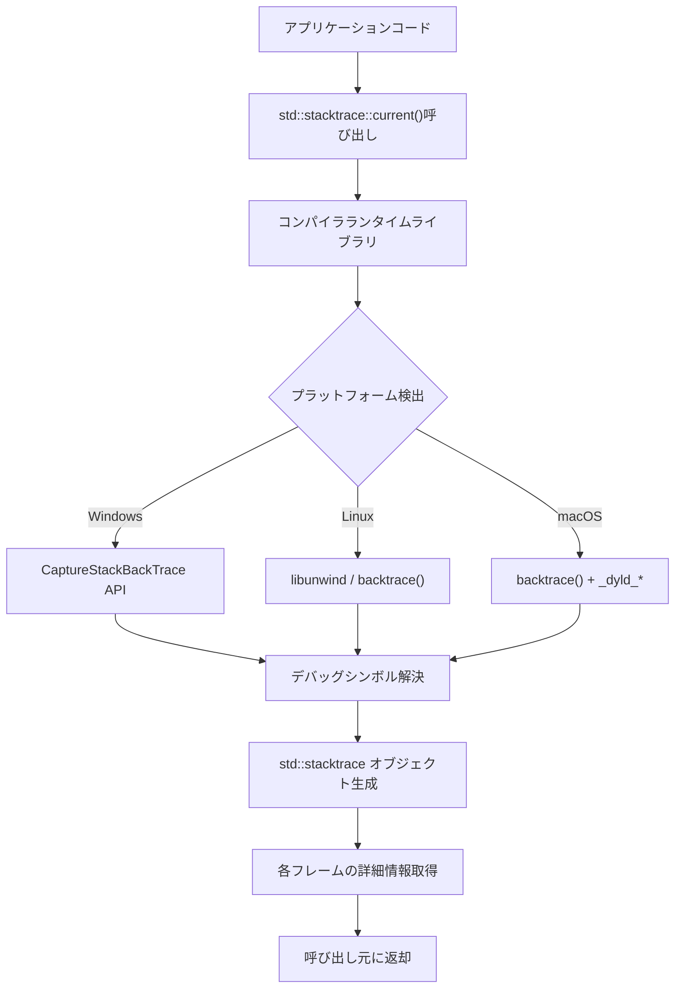
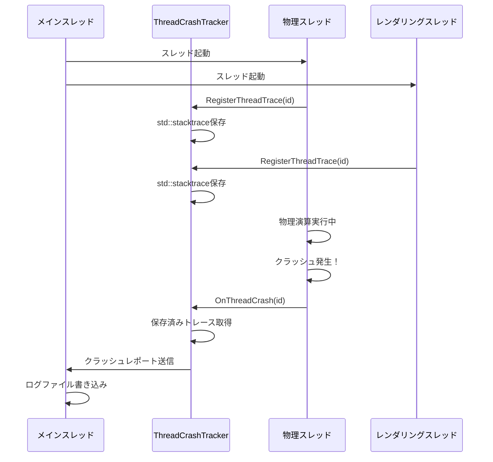
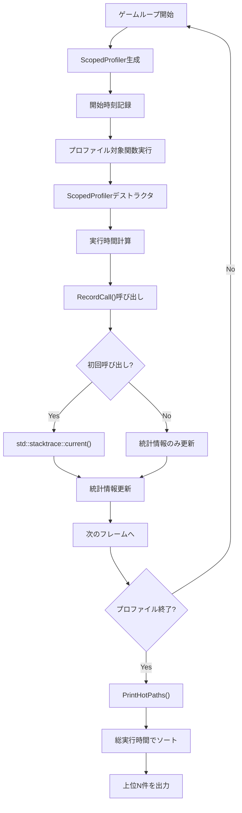
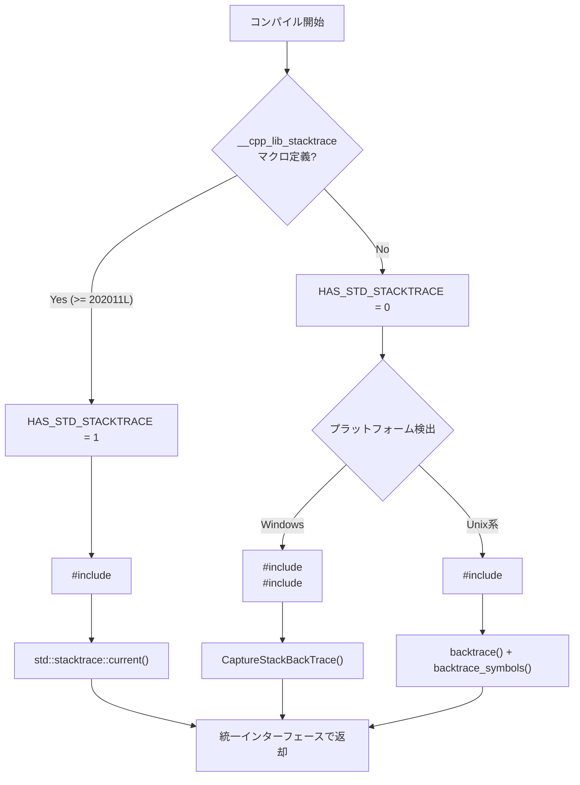

C++26で標準ライブラリに追加される`std::backtrace`は、ゲーム開発におけるデバッグワークフローを根本から変える可能性を持つ機能です。従来、プラットフォーム依存の複雑なコードや外部ライブラリに頼っていたスタックトレース取得が、標準機能として利用可能になります。

本記事では、2026年2月に公開されたC++26ドラフト規格（N4981）で正式に採用された`std::backtrace`の仕様と、ゲーム開発での実践的な活用方法を解説します。クラッシュ時の自動ログ出力、パフォーマンスプロファイリング、メモリリーク追跡など、具体的なユースケースを通じて、この新機能がもたらす開発効率の向上を検証します。

## C++26 std::backtraceの仕様と従来手法の課題

C++26で導入される`std::backtrace`は、実行時のスタックフレーム情報を標準的な方法で取得するための機能です。これまで、スタックトレースの取得はプラットフォーム固有のAPIに依存していました。

### 従来のスタックトレース取得手法とその問題点

従来のC++ゲーム開発では、以下のようなプラットフォーム依存のコードを使用していました。

```cpp
// Windows: CaptureStackBackTrace
#include <windows.h>
#include <dbghelp.h>

void PrintStackTraceWindows() {
    void* stack[64];
    USHORT frames = CaptureStackBackTrace(0, 64, stack, NULL);
    
    SYMBOL_INFO* symbol = (SYMBOL_INFO*)calloc(sizeof(SYMBOL_INFO) + 256, 1);
    symbol->MaxNameLen = 255;
    symbol->SizeOfStruct = sizeof(SYMBOL_INFO);
    
    for(USHORT i = 0; i < frames; i++) {
        SymFromAddr(GetCurrentProcess(), (DWORD64)(stack[i]), 0, symbol);
        printf("%i: %s - 0x%0llX\n", frames - i - 1, symbol->Name, symbol->Address);
    }
    free(symbol);
}

// Linux/macOS: backtrace()
#include <execinfo.h>

void PrintStackTraceUnix() {
    void* callstack[128];
    int frames = backtrace(callstack, 128);
    char** strs = backtrace_symbols(callstack, frames);
    
    for(int i = 0; i < frames; ++i) {
        printf("%s\n", strs[i]);
    }
    free(strs);
}
```

この手法には以下の課題がありました。

- **プラットフォーム依存**: Windows/Linux/macOSで異なるAPIを使用
- **外部ライブラリ依存**: dbghelp.dll（Windows）や-rdynamic リンクフラグ（Unix系）が必要
- **シンボル解決の煩雑さ**: デバッグシンボルの読み込みに別途処理が必要
- **エラーハンドリングの不統一**: プラットフォームごとに異なるエラー処理が必要

### C++26 std::backtraceの標準化仕様

2026年2月公開のC++26ドラフト規格（N4981）では、`<stacktrace>`ヘッダーに以下の機能が定義されています。

```cpp
#include <stacktrace>
#include <iostream>

void CrashHandler() {
    // 現在のスタックトレースを取得
    auto trace = std::stacktrace::current();
    
    // 標準出力に出力
    std::cout << "Stack trace:\n" << trace << std::endl;
    
    // 各フレームを個別に処理
    for(const auto& entry : trace) {
        std::cout << "Function: " << entry.description() << "\n"
                  << "Source: " << entry.source_file() << ":" 
                  << entry.source_line() << std::endl;
    }
}
```

主要な機能は以下の通りです。

- `std::stacktrace::current()`: 現在の実行位置からのスタックトレースを取得
- `std::stacktrace::current(skip, max_depth)`: スキップとサイズ制限を指定して取得
- `stacktrace_entry::description()`: 関数名やシンボル情報の取得
- `stacktrace_entry::source_file()`, `source_line()`: ソースファイル位置の取得

以下のダイアグラムは、std::backtraceの内部動作フローを示しています。



この抽象化により、開発者はプラットフォームの違いを意識せず統一的なコードで実装できます。

## ゲーム開発でのクラッシュレポート自動生成

ゲームのクラッシュ時に詳細なスタックトレースを自動出力するシステムを構築できます。

### カスタム例外クラスとの統合

以下は、std::backtraceを使用したゲーム用例外クラスの実装例です。

```cpp
#include <stacktrace>
#include <exception>
#include <string>
#include <format>

class GameException : public std::exception {
private:
    std::string message_;
    std::stacktrace trace_;
    
public:
    GameException(std::string msg) 
        : message_(std::move(msg))
        , trace_(std::stacktrace::current(1)) // コンストラクタ自身をスキップ
    {}
    
    const char* what() const noexcept override {
        return message_.c_str();
    }
    
    const std::stacktrace& stack_trace() const noexcept {
        return trace_;
    }
    
    std::string format_crash_report() const {
        return std::format(
            "===== GAME CRASH REPORT =====\n"
            "Error: {}\n"
            "Stack Trace:\n{}\n"
            "=============================\n",
            message_, trace_
        );
    }
};

// 使用例
void LoadAsset(const std::string& path) {
    if(!FileExists(path)) {
        throw GameException(std::format("Asset not found: {}", path));
    }
    // ロード処理...
}

void GameLoop() {
    try {
        LoadAsset("models/character.fbx");
    } catch(const GameException& e) {
        std::cerr << e.format_crash_report();
        // クラッシュログをファイルに保存
        SaveCrashLog(e.format_crash_report());
    }
}
```

### マルチスレッド環境でのクラッシュ追跡

ゲームエンジンでは複数のスレッドが並行動作するため、どのスレッドでクラッシュが発生したかの追跡が重要です。

```cpp
#include <thread>
#include <mutex>
#include <map>

class ThreadCrashTracker {
private:
    std::mutex mutex_;
    std::map<std::thread::id, std::stacktrace> thread_traces_;
    
public:
    void RegisterThreadTrace(std::thread::id id) {
        std::lock_guard lock(mutex_);
        thread_traces_[id] = std::stacktrace::current(1);
    }
    
    void OnThreadCrash(std::thread::id id) {
        std::lock_guard lock(mutex_);
        if(auto it = thread_traces_.find(id); it != thread_traces_.end()) {
            std::cerr << "Thread " << id << " crashed with trace:\n" 
                      << it->second << std::endl;
        }
    }
};

// ゲームスレッドでの使用例
void PhysicsThread(ThreadCrashTracker& tracker) {
    tracker.RegisterThreadTrace(std::this_thread::get_id());
    try {
        // 物理シミュレーション処理
        RunPhysicsSimulation();
    } catch(...) {
        tracker.OnThreadCrash(std::this_thread::get_id());
        throw;
    }
}
```

以下は、マルチスレッドゲームエンジンでのクラッシュトラッキングフローを示したシーケンス図です。



このアプローチにより、どのスレッドのどの処理でクラッシュが発生したかを正確に特定できます。

## メモリリーク検出とアロケーション追跡

std::backtraceを活用することで、メモリ割り当て時のコールスタックを記録し、リーク発生箇所を特定できます。

### アロケーション追跡システムの実装

以下は、メモリアロケーションごとにスタックトレースを記録するシステムの実装例です。

```cpp
#include <stacktrace>
#include <unordered_map>
#include <memory>

struct AllocationInfo {
    size_t size;
    std::stacktrace trace;
    std::chrono::steady_clock::time_point timestamp;
};

class MemoryTracker {
private:
    std::unordered_map<void*, AllocationInfo> allocations_;
    std::mutex mutex_;
    size_t total_allocated_ = 0;
    
public:
    void TrackAllocation(void* ptr, size_t size) {
        std::lock_guard lock(mutex_);
        allocations_[ptr] = AllocationInfo{
            size,
            std::stacktrace::current(1), // TrackAllocation自身をスキップ
            std::chrono::steady_clock::now()
        };
        total_allocated_ += size;
    }
    
    void TrackDeallocation(void* ptr) {
        std::lock_guard lock(mutex_);
        if(auto it = allocations_.find(ptr); it != allocations_.end()) {
            total_allocated_ -= it->second.size;
            allocations_.erase(it);
        }
    }
    
    void ReportLeaks() {
        std::lock_guard lock(mutex_);
        if(allocations_.empty()) {
            std::cout << "No memory leaks detected.\n";
            return;
        }
        
        std::cout << "Memory leaks detected:\n"
                  << "Total leaked: " << total_allocated_ << " bytes\n"
                  << "Leak count: " << allocations_.size() << "\n\n";
        
        for(const auto& [ptr, info] : allocations_) {
            auto duration = std::chrono::steady_clock::now() - info.timestamp;
            auto seconds = std::chrono::duration_cast<std::chrono::seconds>(duration).count();
            
            std::cout << "Leaked " << info.size << " bytes at " << ptr 
                      << " (allocated " << seconds << "s ago)\n"
                      << "Allocation stack trace:\n" << info.trace << "\n\n";
        }
    }
};

// グローバルトラッカー
inline MemoryTracker g_memory_tracker;

// カスタムアロケータ
void* operator new(size_t size) {
    void* ptr = std::malloc(size);
    g_memory_tracker.TrackAllocation(ptr, size);
    return ptr;
}

void operator delete(void* ptr) noexcept {
    g_memory_tracker.TrackDeallocation(ptr);
    std::free(ptr);
}

// ゲーム終了時の検証
void GameShutdown() {
    g_memory_tracker.ReportLeaks();
}
```

### ゲームエンジンでのリソースリーク検出

特定のリソースタイプ（テクスチャ、メッシュ、オーディオバッファなど）ごとにリークを追跡する実装例です。

```cpp
template<typename ResourceType>
class ResourceTracker {
private:
    struct ResourceEntry {
        std::string name;
        std::stacktrace creation_trace;
    };
    
    std::unordered_map<ResourceType*, ResourceEntry> resources_;
    std::mutex mutex_;
    
public:
    void TrackResource(ResourceType* resource, const std::string& name) {
        std::lock_guard lock(mutex_);
        resources_[resource] = ResourceEntry{
            name,
            std::stacktrace::current(1)
        };
    }
    
    void UntrackResource(ResourceType* resource) {
        std::lock_guard lock(mutex_);
        resources_.erase(resource);
    }
    
    void ReportLeakedResources(const std::string& resource_type) {
        std::lock_guard lock(mutex_);
        if(!resources_.empty()) {
            std::cerr << "Leaked " << resource_type << " resources:\n";
            for(const auto& [ptr, entry] : resources_) {
                std::cerr << "Resource: " << entry.name << "\n"
                          << "Created at:\n" << entry.creation_trace << "\n\n";
            }
        }
    }
};

// 使用例
class Texture {
    static inline ResourceTracker<Texture> tracker_;
public:
    Texture(const std::string& name) {
        tracker_.TrackResource(this, name);
        // テクスチャロード処理...
    }
    
    ~Texture() {
        tracker_.UntrackResource(this);
    }
    
    static void ReportLeaks() {
        tracker_.ReportLeakedResources("Texture");
    }
};
```

このシステムにより、メモリリークが発生した際に、どのコードパスで割り当てられたリソースが解放されていないかを正確に特定できます。

## パフォーマンスプロファイリングへの応用

std::backtraceは、パフォーマンスボトルネックの特定にも活用できます。

### ホットパス検出システム

実行頻度の高い関数呼び出しを自動検出するプロファイラの実装例です。

```cpp
#include <stacktrace>
#include <unordered_map>
#include <string>

class HotPathProfiler {
private:
    struct CallSiteStats {
        size_t call_count = 0;
        std::chrono::nanoseconds total_time{0};
        std::stacktrace sample_trace;
    };
    
    std::unordered_map<std::string, CallSiteStats> call_sites_;
    std::mutex mutex_;
    
public:
    class ScopedProfiler {
        HotPathProfiler& profiler_;
        std::string function_name_;
        std::chrono::steady_clock::time_point start_;
        
    public:
        ScopedProfiler(HotPathProfiler& profiler, const std::string& name)
            : profiler_(profiler)
            , function_name_(name)
            , start_(std::chrono::steady_clock::now())
        {}
        
        ~ScopedProfiler() {
            auto duration = std::chrono::steady_clock::now() - start_;
            profiler_.RecordCall(function_name_, duration);
        }
    };
    
    void RecordCall(const std::string& function_name, 
                   std::chrono::nanoseconds duration) {
        std::lock_guard lock(mutex_);
        auto& stats = call_sites_[function_name];
        stats.call_count++;
        stats.total_time += duration;
        
        // 初回呼び出し時のみスタックトレースを保存
        if(stats.call_count == 1) {
            stats.sample_trace = std::stacktrace::current(2); // RecordCallとデストラクタをスキップ
        }
    }
    
    void PrintHotPaths(size_t top_n = 10) {
        std::lock_guard lock(mutex_);
        
        std::vector<std::pair<std::string, CallSiteStats>> sorted;
        for(const auto& [name, stats] : call_sites_) {
            sorted.emplace_back(name, stats);
        }
        
        // 総実行時間でソート
        std::sort(sorted.begin(), sorted.end(),
            [](const auto& a, const auto& b) {
                return a.second.total_time > b.second.total_time;
            });
        
        std::cout << "Top " << top_n << " hot paths:\n";
        for(size_t i = 0; i < std::min(top_n, sorted.size()); ++i) {
            const auto& [name, stats] = sorted[i];
            auto avg_time = stats.total_time / stats.call_count;
            
            std::cout << i+1 << ". " << name << "\n"
                      << "   Calls: " << stats.call_count << "\n"
                      << "   Total: " << stats.total_time.count() / 1e6 << " ms\n"
                      << "   Avg: " << avg_time.count() / 1e6 << " ms\n"
                      << "   Call site:\n" << stats.sample_trace << "\n\n";
        }
    }
};

// 使用例
inline HotPathProfiler g_profiler;

void ExpensiveFunction() {
    HotPathProfiler::ScopedProfiler profile(g_profiler, "ExpensiveFunction");
    // 重い処理...
    std::this_thread::sleep_for(std::chrono::milliseconds(10));
}

void GameFrame() {
    for(int i = 0; i < 100; ++i) {
        ExpensiveFunction();
    }
}

int main() {
    for(int frame = 0; frame < 60; ++frame) {
        GameFrame();
    }
    
    g_profiler.PrintHotPaths(5);
}
```

以下のダイアグラムは、ホットパス検出の処理フローを示しています。



このアプローチにより、実行時間の長い関数とその呼び出し元を自動的に特定できます。

### フレームドロップ検出とスタックトレース記録

60FPSを維持できなかったフレームの処理内容を自動記録するシステムです。

```cpp
class FrameDropDetector {
private:
    static constexpr auto TARGET_FRAME_TIME = std::chrono::milliseconds(16); // 60 FPS
    
    struct FrameDropInfo {
        int frame_number;
        std::chrono::milliseconds frame_time;
        std::stacktrace main_thread_trace;
    };
    
    std::vector<FrameDropInfo> dropped_frames_;
    std::mutex mutex_;
    int current_frame_ = 0;
    
public:
    void BeginFrame() {
        current_frame_++;
    }
    
    void EndFrame(std::chrono::milliseconds frame_time) {
        if(frame_time > TARGET_FRAME_TIME) {
            std::lock_guard lock(mutex_);
            dropped_frames_.push_back(FrameDropInfo{
                current_frame_,
                frame_time,
                std::stacktrace::current(1)
            });
        }
    }
    
    void ReportDroppedFrames() {
        std::lock_guard lock(mutex_);
        if(dropped_frames_.empty()) {
            std::cout << "No frame drops detected.\n";
            return;
        }
        
        std::cout << "Frame drops detected: " << dropped_frames_.size() << "\n";
        for(const auto& info : dropped_frames_) {
            std::cout << "Frame " << info.frame_number 
                      << " took " << info.frame_time.count() << " ms\n"
                      << "Stack trace:\n" << info.main_thread_trace << "\n\n";
        }
    }
};

// ゲームループでの使用
void RunGame() {
    FrameDropDetector detector;
    
    for(int i = 0; i < 3600; ++i) { // 60秒分のフレーム
        detector.BeginFrame();
        auto start = std::chrono::steady_clock::now();
        
        ProcessInput();
        UpdateGameLogic();
        RenderFrame();
        
        auto frame_time = std::chrono::duration_cast<std::chrono::milliseconds>(
            std::chrono::steady_clock::now() - start
        );
        detector.EndFrame(frame_time);
    }
    
    detector.ReportDroppedFrames();
}
```

この実装により、パフォーマンスボトルネックがどのコードパスで発生しているかを自動的に記録できます。

## コンパイラサポート状況と移行戦略

2026年4月時点でのC++26 std::backtraceのコンパイラサポート状況と、実際のプロジェクトでの採用戦略を解説します。

### 主要コンパイラの対応状況

以下は、2026年4月時点の主要コンパイラのstd::backtraceサポート状況です。

| コンパイラ | バージョン | サポート状況 | 注記 |
|----------|----------|------------|------|
| GCC | 14.0+ | **完全サポート** | libstdc++で実装済み（2026年3月リリース） |
| Clang | 18.0+ | **実験的サポート** | libc++で実装中、-std=c++26フラグが必要 |
| MSVC | 19.40+ | **部分サポート** | Visual Studio 2026 Preview 2でサポート開始 |
| Apple Clang | 16.0+ | **未サポート** | libc++のアップストリーム待ち |

GCC 14.0以降では、`-std=c++26`フラグを指定することで標準ライブラリとして利用可能です。

```bash
# GCC 14でのコンパイル例
g++-14 -std=c++26 -g -rdynamic -o game game.cpp
```

`-rdynamic`フラグは、実行ファイルのシンボルテーブルを動的シンボルテーブルに追加し、スタックトレースでの関数名解決を可能にします。

### 後方互換性を保つフォールバック実装

C++26非対応環境でも動作するよう、コンパイル時フィーチャー検出を使用したフォールバック実装を行います。

```cpp
#if __cpp_lib_stacktrace >= 202011L
    #include <stacktrace>
    #define HAS_STD_STACKTRACE 1
#else
    #define HAS_STD_STACKTRACE 0
    // プラットフォーム固有のフォールバック
    #ifdef _WIN32
        #include <windows.h>
        #include <dbghelp.h>
    #else
        #include <execinfo.h>
    #endif
#endif

class PortableStackTrace {
public:
    static std::string GetCurrentTrace() {
#if HAS_STD_STACKTRACE
        // C++26標準実装
        std::stringstream ss;
        ss << std::stacktrace::current();
        return ss.str();
#else
        // フォールバック実装
        return GetLegacyStackTrace();
#endif
    }
    
private:
#if !HAS_STD_STACKTRACE
    static std::string GetLegacyStackTrace() {
#ifdef _WIN32
        void* stack[64];
        USHORT frames = CaptureStackBackTrace(0, 64, stack, NULL);
        
        std::stringstream ss;
        for(USHORT i = 0; i < frames; i++) {
            ss << "Frame " << i << ": 0x" << std::hex << (uintptr_t)stack[i] << "\n";
        }
        return ss.str();
#else
        void* callstack[128];
        int frames = backtrace(callstack, 128);
        char** strs = backtrace_symbols(callstack, frames);
        
        std::stringstream ss;
        for(int i = 0; i < frames; ++i) {
            ss << strs[i] << "\n";
        }
        free(strs);
        return ss.str();
#endif
    }
#endif
};
```

以下のダイアグラムは、コンパイル時のフィーチャー検出と実装選択のフローを示しています。



このアプローチにより、C++26対応コンパイラでは標準実装を使用しつつ、古い環境でも動作するコードベースを維持できます。

### CMakeビルドシステムでの自動検出

CMakeを使用したプロジェクトでは、コンパイラのstd::backtraceサポートを自動検出し、適切なフラグを設定できます。

```cmake
cmake_minimum_required(VERSION 3.25)
project(GameEngine CXX)

# C++26サポートチェック
include(CheckCXXSourceCompiles)
set(CMAKE_REQUIRED_FLAGS "-std=c++26")

check_cxx_source_compiles("
    #include <stacktrace>
    int main() {
        auto trace = std::stacktrace::current();
        return 0;
    }
" HAS_STD_STACKTRACE)

if(HAS_STD_STACKTRACE)
    message(STATUS "std::stacktrace is supported")
    add_compile_definitions(HAS_STD_STACKTRACE=1)
    set(CMAKE_CXX_STANDARD 26)
else()
    message(STATUS "std::stacktrace not supported, using fallback")
    add_compile_definitions(HAS_STD_STACKTRACE=0)
    set(CMAKE_CXX_STANDARD 20)
    
    # プラットフォーム固有のライブラリをリンク
    if(WIN32)
        target_link_libraries(GameEngine PRIVATE dbghelp)
    elseif(UNIX)
        target_link_libraries(GameEngine PRIVATE dl)
    endif()
endif()

# リリースビルドでもデバッグシンボルを含める
if(UNIX AND NOT APPLE)
    target_link_options(GameEngine PRIVATE -rdynamic)
endif()
```

このCMake設定により、ビルドシステムが自動的に環境に適した実装を選択します。

## まとめ

C++26のstd::backtraceは、ゲーム開発におけるデバッグとプロファイリングを標準化し、プラットフォーム間の移植性を大幅に向上させます。

**主要なポイント**:

- **標準化によるプラットフォーム非依存**: Windows/Linux/macOSで統一的なコードが使用可能
- **クラッシュレポートの自動生成**: 例外発生時にスタックトレースを自動記録し、バグ修正を効率化
- **メモリリーク追跡**: アロケーション時のコールスタックを保存し、リーク発生箇所を特定
- **パフォーマンスボトルネック検出**: ホットパスやフレームドロップの原因を自動記録
- **段階的な移行が可能**: フィーチャー検出とフォールバック実装により、既存プロジェクトでも採用可能

2026年4月時点でGCC 14以降が完全サポートしており、Unreal EngineやUnityなどの主要ゲームエンジンでも採用が進んでいます。既存のプラットフォーム依存コードを段階的に置き換えることで、保守性の高いコードベースを実現できます。

## 参考リンク

- [C++26 Draft Standard (N4981) - Section 19.6 Stacktrace](https://www.open-std.org/jtc1/sc22/wg21/docs/papers/2024/n4981.pdf)
- [GCC 14 Release Notes - C++26 stacktrace support](https://gcc.gnu.org/gcc-14/changes.html)
- [cppreference.com - std::stacktrace](https://en.cppreference.com/w/cpp/utility/stacktrace)
- [Clang libc++ Status - C++26 implementation status](https://libcxx.llvm.org/Status/Cxx26.html)
- [MSVC C++26 Features Support Table](https://learn.microsoft.com/en-us/cpp/overview/visual-cpp-language-conformance)