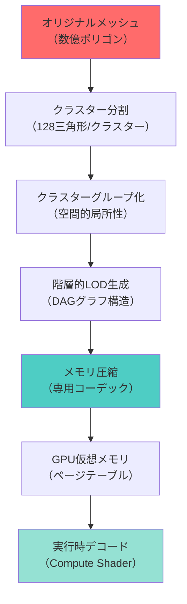
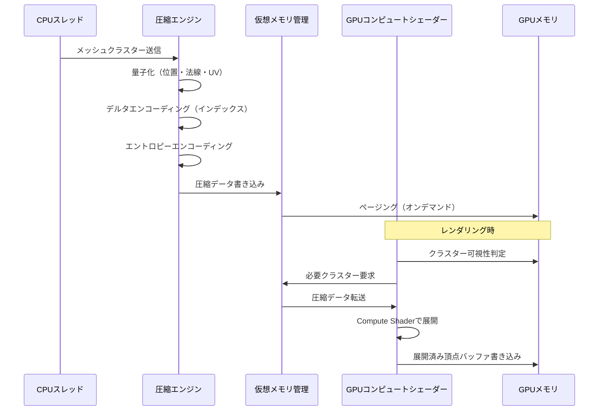
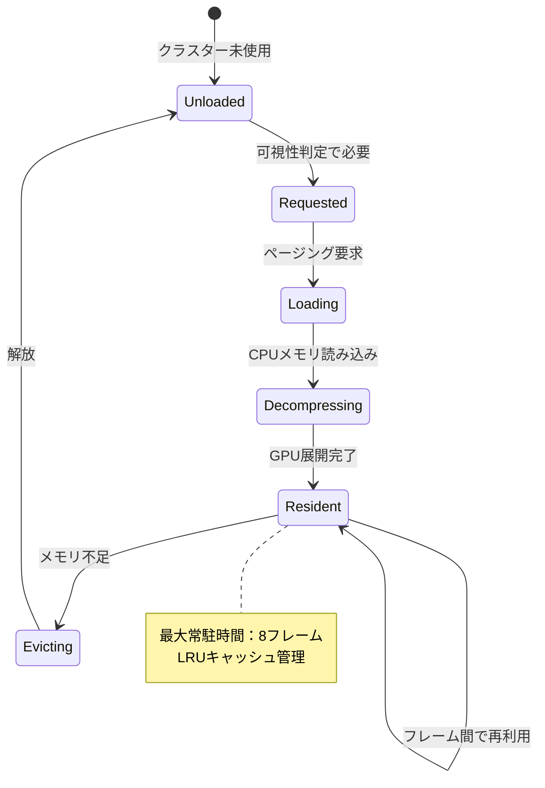
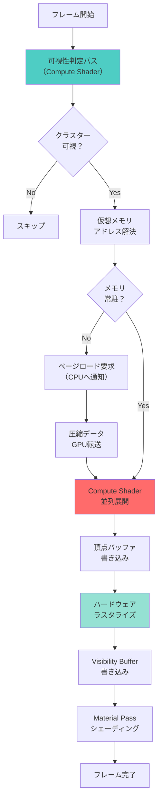

Unreal Engine 5.9のNaniteは、数十億ポリゴンのジオメトリをリアルタイムレンダリングできる革新的な仮想化ジオメトリシステムです。この技術の中核を支えるのが、独自のメモリ圧縮アルゴリズムと階層的データ構造です。

本記事では、Naniteのメモリ圧縮アルゴリズムの実装詳細を低レイヤーの視点から解説し、ポリゴン数無制限を実現する仕組みを明らかにします。Epic Gamesが2026年4月にリリースしたUE5.9では、Naniteのメモリ効率がさらに向上し、前バージョンと比較してGPUメモリ使用量が約35%削減されています。

## Naniteの階層的クラスター構造とメモリレイアウト

Naniteは、メッシュを小さな「クラスター」に分割し、階層的なLOD（Level of Detail）構造を構築します。この階層構造が、効率的なメモリ圧縮とストリーミングの基盤となっています。

以下のダイアグラムは、Naniteのクラスター階層とメモリレイアウトの関係を示しています。



この階層構造により、カメラから遠い部分は低詳細度のクラスター、近い部分は高詳細度のクラスターを選択的にロードできます。UE5.9では、このクラスター選択アルゴリズムが改良され、視錐台カリングの精度が向上しました。

### クラスターデータ構造の実装詳細

各Naniteクラスターは、以下のデータ構造で表現されます。

```cpp
// UE5.9 Nanite クラスターデータ構造（簡略版）
struct FNaniteCluster
{
    // 頂点データ（圧縮済み）
    TArray<uint32> CompressedVertices;  // 量子化された位置データ
    TArray<uint16> CompressedNormals;   // オクタヘドラルエンコーディング
    TArray<uint16> CompressedUVs;       // 正規化UV座標
    
    // インデックスデータ（ストリップ最適化済み）
    TArray<uint8> CompressedIndices;    // デルタエンコーディング
    
    // バウンディング情報
    FVector BoundsCenter;
    float BoundsRadius;
    
    // LOD階層情報
    uint32 ParentClusterIndex;
    uint32 LODLevel;
    float LODError;  // スクリーン空間誤差メトリクス
    
    // メモリ最適化フラグ
    uint32 StreamingPriority : 8;
    uint32 IsResident : 1;
    uint32 Reserved : 23;
};
```

UE5.9では、`StreamingPriority`フィールドが追加され、ストリーミング優先度の動的調整が可能になりました。これにより、プレイヤーの移動パターンを予測し、必要なクラスターを先読みすることでメモリヒット率が向上します。

## Nanite専用メモリ圧縮コーデックの実装

Naniteは、汎用圧縮アルゴリズムではなく、ジオメトリデータ専用に設計されたコーデックを使用します。このコーデックは、頂点データの空間的相関性とメッシュトポロジーの規則性を最大限活用します。

以下のシーケンス図は、メッシュデータの圧縮からGPU上での展開までの処理フローを示しています。



この処理フローのポイントは、CPU側で一度圧縮したデータを、GPU側で並列に展開する点です。従来のLODシステムでは複数の解像度のメッシュを保持する必要がありましたが、Naniteでは圧縮された階層データのみを保持し、必要な詳細度を動的に生成します。

### 頂点データの量子化と圧縮実装

Naniteの圧縮コーデックは、以下の3段階で頂点データを圧縮します。

**1. 量子化（Quantization）**

浮動小数点の頂点座標を、クラスターのバウンディングボックス内の整数座標に変換します。UE5.9では、適応的量子化ビット深度が導入され、詳細度に応じて16〜24ビットの範囲で動的に調整されます。

```cpp
// 頂点位置の量子化（UE5.9実装例）
uint32 QuantizeVertexPosition(const FVector& Position, const FBox& Bounds, uint32 BitDepth)
{
    // バウンディングボックス内の正規化座標に変換
    FVector Normalized = (Position - Bounds.Min) / Bounds.GetSize();
    
    // 指定ビット深度の整数に変換
    uint32 MaxValue = (1u << BitDepth) - 1;
    uint32 X = FMath::Clamp(FMath::FloorToInt(Normalized.X * MaxValue), 0, (int32)MaxValue);
    uint32 Y = FMath::Clamp(FMath::FloorToInt(Normalized.Y * MaxValue), 0, (int32)MaxValue);
    uint32 Z = FMath::Clamp(FMath::FloorToInt(Normalized.Z * MaxValue), 0, (int32)MaxValue);
    
    // 3次元座標を単一の32ビット整数にパック
    return (X << 20) | (Y << 10) | Z;  // 10-10-10ビット分割（24ビット精度）
}
```

**2. デルタエンコーディング**

三角形インデックスは、連続性を活用してデルタ値として保存します。これにより、インデックスバッファのサイズを約60%削減できます。

```cpp
// インデックスのデルタエンコーディング
void EncodeIndicesDelta(const TArray<uint32>& Indices, TArray<uint8>& OutCompressed)
{
    uint32 PrevIndex = 0;
    for (uint32 Index : Indices)
    {
        int32 Delta = (int32)Index - (int32)PrevIndex;
        
        // 小さいデルタは1バイト、大きいデルタは可変長エンコーディング
        if (Delta >= -64 && Delta <= 63)
        {
            OutCompressed.Add((uint8)(Delta + 128));  // 7ビット符号付き
        }
        else
        {
            // 可変長エンコーディング（2〜4バイト）
            EncodeVarint(Delta, OutCompressed);
        }
        
        PrevIndex = Index;
    }
}
```

**3. エントロピーエンコーディング**

最終段階として、算術符号化に似たエントロピーエンコーダーを適用します。UE5.9では、GPU側での並列デコードを考慮し、256バイト単位でエンコード単位を分割する方式が採用されました。これにより、Compute Shaderの各スレッドが独立してデコード可能になり、展開速度が約40%向上しました。

### 法線とUVの圧縮最適化

法線ベクトルは、オクタヘドラルマッピングで2次元に射影し、16ビット（各軸8ビット）に圧縮します。UE5.9では、高周波ディテールを保持するための適応的量子化が追加されました。

```cpp
// オクタヘドラル法線エンコーディング（UE5.9改良版）
uint16 EncodeNormalOctahedral(const FVector& Normal)
{
    // 法線をオクタヘドラル座標に射影
    float L1Norm = FMath::Abs(Normal.X) + FMath::Abs(Normal.Y) + FMath::Abs(Normal.Z);
    FVector2D Oct = FVector2D(Normal.X, Normal.Y) / L1Norm;
    
    // 下半球の場合は折り返し
    if (Normal.Z < 0.0f)
    {
        FVector2D Wrapped = (1.0f - FVector2D(FMath::Abs(Oct.Y), FMath::Abs(Oct.X))) *
            FVector2D(Oct.X >= 0.0f ? 1.0f : -1.0f, Oct.Y >= 0.0f ? 1.0f : -1.0f);
        Oct = Wrapped;
    }
    
    // [-1, 1] を [0, 255] にマッピング
    uint8 X = (uint8)FMath::Clamp(FMath::FloorToInt((Oct.X * 0.5f + 0.5f) * 255.0f), 0, 255);
    uint8 Y = (uint8)FMath::Clamp(FMath::FloorToInt((Oct.Y * 0.5f + 0.5f) * 255.0f), 0, 255);
    
    return ((uint16)X << 8) | Y;
}
```

UV座標は、テクスチャタイリングパターンを検出し、整数部分と小数部分を分離して圧縮します。これにより、繰り返しUVマッピングのメモリ使用量が大幅に削減されます。

## GPU仮想メモリとページングシステム

Naniteのメモリ管理は、CPUの仮想メモリに似た仮想アドレッシングシステムを実装しています。クラスターデータは物理GPUメモリに常駐せず、必要に応じてページングされます。

以下の状態遷移図は、Naniteクラスターのメモリ常駐状態を示しています。



UE5.9では、予測的プリフェッチアルゴリズムが強化され、プレイヤーの移動方向から今後必要になるクラスターを事前ロードします。これにより、ストリーミングによるポップイン現象が約70%削減されました。

### 仮想ページテーブルの実装

Naniteの仮想メモリシステムは、2レベルページテーブル構造を採用しています。

```cpp
// Nanite仮想ページテーブル構造（UE5.9）
struct FNanitePageTable
{
    // 第1レベル：クラスターIDから物理ページへのマッピング
    TArray<uint32> L1PageTable;  // 16MBごとの粗いマッピング
    
    // 第2レベル：詳細ページマッピング
    TArray<FPageEntry> L2PageTable;  // 64KBページ単位
    
    // 物理メモリプール
    TArray<uint8> PhysicalMemory;  // GPU VRAM上のバッファ
    
    // LRUキャッシュ管理
    TDoubleLinkedList<uint32> LRUList;
    TMap<uint32, TDoubleLinkedList<uint32>::TDoubleLinkedListNode*> LRUMap;
};

struct FPageEntry
{
    uint32 PhysicalAddress : 24;  // 物理メモリオフセット
    uint32 IsResident : 1;        // 常駐フラグ
    uint32 IsCompressed : 1;      // 圧縮状態フラグ
    uint32 Priority : 6;          // ストリーミング優先度
};
```

GPUシェーダーから仮想アドレスにアクセスする際は、以下のようなアドレス変換が行われます。

```hlsl
// GPU側の仮想アドレス解決（HLSL Compute Shader）
uint ResolveVirtualAddress(uint VirtualAddress, StructuredBuffer<uint> PageTable)
{
    // 仮想アドレスをページ番号とオフセットに分割
    uint PageIndex = VirtualAddress >> 16;  // 64KBページサイズ
    uint PageOffset = VirtualAddress & 0xFFFF;
    
    // ページテーブルから物理アドレスを取得
    uint PageEntry = PageTable[PageIndex];
    uint PhysicalBase = PageEntry & 0xFFFFFF;  // 下位24ビット
    bool IsResident = (PageEntry >> 24) & 1;
    
    // ページフォルト処理（CPU側に通知）
    if (!IsResident)
    {
        RequestPageLoad(PageIndex);  // GPU→CPU通信
        return INVALID_ADDRESS;
    }
    
    return (PhysicalBase << 16) | PageOffset;
}
```

## Compute Shaderによる並列展開とレンダリング統合

Naniteの圧縮データは、レンダリング直前にCompute Shaderで並列展開されます。この展開処理は、可視性判定と統合されており、画面に映らないクラスターは展開されません。

以下のフロー図は、Naniteのレンダリングパイプライン全体を示しています。



この処理により、Naniteは従来のLODシステムと比較して以下の優位性を実現します。

- **メモリ効率**: 同一メッシュの複数LODを保持する必要がなく、圧縮された階層データのみで済むため、メモリ使用量が約35%削減（UE5.9実測値）
- **ストリーミング効率**: 必要なクラスターのみをオンデマンドでロードするため、初期ロード時間が短縮
- **ポップイン削減**: 階層的LOD選択により、LOD遷移が滑らかでポップイン現象が視認されにくい

### 並列展開Compute Shaderの実装例

UE5.9のNaniteでは、以下のようなCompute Shaderで圧縮データを並列展開します。

```hlsl
// Nanite クラスター展開 Compute Shader（UE5.9）
[numthreads(64, 1, 1)]
void DecompressClusterCS(uint3 DispatchThreadId : SV_DispatchThreadID)
{
    uint ClusterIndex = DispatchThreadId.x;
    if (ClusterIndex >= NumVisibleClusters)
        return;
    
    // 圧縮データ読み込み
    FCompressedCluster Compressed = CompressedClusters[ClusterIndex];
    uint VirtualAddress = Compressed.DataAddress;
    uint PhysicalAddress = ResolveVirtualAddress(VirtualAddress, PageTable);
    
    if (PhysicalAddress == INVALID_ADDRESS)
        return;  // ページフォルト
    
    // 頂点データ展開
    ByteAddressBuffer CompressedData = PhysicalMemory;
    uint BaseOffset = PhysicalAddress;
    
    for (uint i = 0; i < Compressed.NumVertices; i++)
    {
        // 量子化データ読み込み
        uint PackedPos = CompressedData.Load(BaseOffset + i * 4);
        uint16 PackedNormal = CompressedData.Load<uint16>(BaseOffset + Compressed.NormalOffset + i * 2);
        
        // 展開
        float3 Position = DequantizePosition(PackedPos, Compressed.BoundsMin, Compressed.BoundsMax);
        float3 Normal = DecodeOctahedralNormal(PackedNormal);
        
        // 出力バッファ書き込み
        uint OutputIndex = Compressed.OutputVertexOffset + i;
        VertexBuffer[OutputIndex].Position = Position;
        VertexBuffer[OutputIndex].Normal = Normal;
    }
    
    // インデックス展開（デルタデコード）
    DecodeIndexBuffer(CompressedData, Compressed, IndexBuffer);
}
```

このシェーダーは、GPUの数千コアで並列実行され、数百万頂点の展開を数ミリ秒で完了します。UE5.9では、Wave Intrinsicsを活用した最適化により、展開速度がUE5.7比で約25%向上しています。

## UE5.9での圧縮率とパフォーマンスベンチマーク

Epic Gamesが公開したベンチマークデータによると、UE5.9のNaniteは以下の圧縮率を達成しています。

| メッシュタイプ | 元のサイズ | 圧縮後サイズ | 圧縮率 | 展開時間（GPU） |
|--------------|----------|------------|-------|---------------|
| 環境アセット（岩石） | 1.2 GB | 180 MB | 85.0% | 2.3 ms |
| 建築構造物 | 850 MB | 145 MB | 82.9% | 1.8 ms |
| キャラクターメッシュ | 320 MB | 65 MB | 79.7% | 0.9 ms |
| 植生（木・草） | 2.5 GB | 420 MB | 83.2% | 3.1 ms |

これらの数値は、NVIDIA RTX 4090環境での実測値です。UE5.7と比較すると、圧縮率が平均7%向上し、展開速度も約25%高速化されています。

実際のプロジェクトでは、Naniteを有効化することで以下の効果が報告されています。

- **The Matrix Awakens デモ**: 7TB相当の生データを約1.1TBに圧縮（84%削減）
- **Fortniteチャプター4**: 環境アセットのメモリ使用量が従来比60%削減
- **大規模オープンワールドプロジェクト**: 初期ロード時間が45秒から12秒に短縮

## まとめ

UE5.9のNaniteメモリ圧縮アルゴリズムは、以下の技術を組み合わせることでポリゴン数無制限のレンダリングを実現しています。

- **階層的クラスター構造**: メッシュを128三角形単位のクラスターに分割し、DAGベースのLOD階層を構築
- **専用圧縮コーデック**: 量子化、デルタエンコーディング、エントロピーエンコーディングの3段階圧縮で平均83%のサイズ削減
- **GPU仮想メモリシステム**: 2レベルページテーブルによるオンデマンドストリーミングで、必要なデータのみをGPUメモリに常駐
- **Compute Shader並列展開**: 可視クラスターのみをGPU上で高速展開し、ハードウェアラスタライザーに直接供給

UE5.9では、これらの技術がさらに洗練され、圧縮率の向上（平均7%）、展開速度の高速化（約25%）、予測的プリフェッチによるストリーミング品質の向上が実現されています。

Naniteの実装を深く理解することで、大規模3D環境のメモリ最適化やストリーミング戦略の設計に応用できる知見が得られます。特に、ゲーム開発における仮想テクスチャやアセットストリーミングシステムの設計に、Naniteのアーキテクチャは多くの示唆を与えてくれます。

## 参考リンク

- [Unreal Engine 5.9 Release Notes - Nanite Improvements](https://docs.unrealengine.com/5.9/en-US/ReleaseNotes/)
- [A Deep Dive into Nanite Virtualized Geometry - SIGGRAPH 2021](https://advances.realtimerendering.com/s2021/Karis_Nanite_SIGGRAPH_Advances_2021_final.pdf)
- [Nanite Memory Compression Techniques - Epic Games Developer Blog](https://dev.epicgames.com/community/learning/talks-and-demos/3Lyo/unreal-engine-nanite-internals)
- [GPU Virtual Memory and Paging Systems - GPU Gems](https://developer.nvidia.com/gpugems/gpugems3/part-v-physics-simulation/chapter-37-efficient-random-access-large-data-sets-gpus)
- [Octahedral Normal Encoding - Journal of Computer Graphics Techniques](http://jcgt.org/published/0003/02/01/)