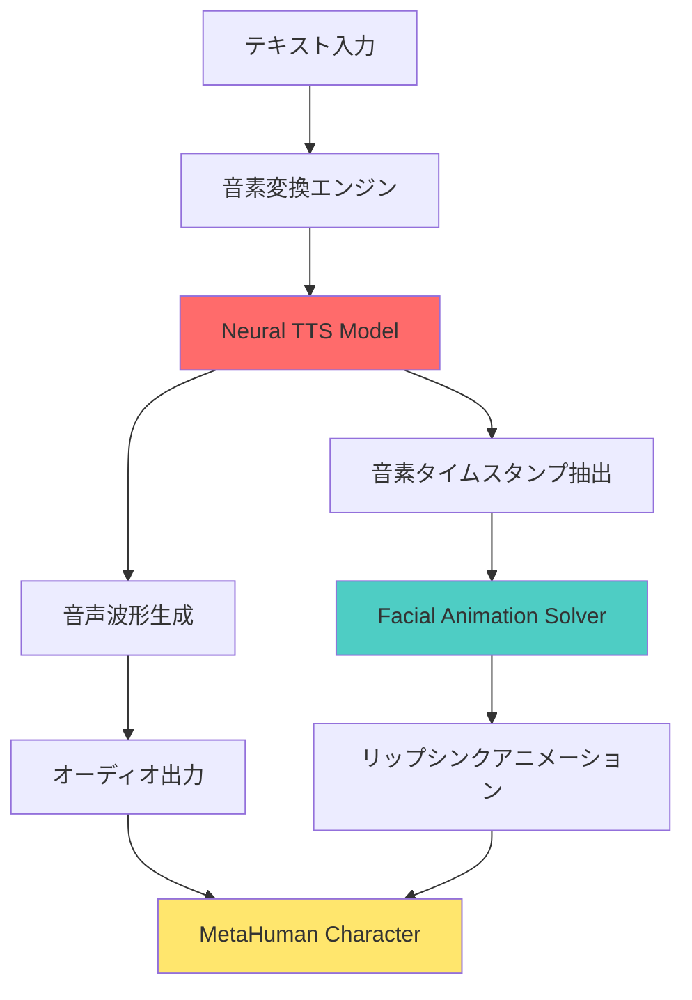
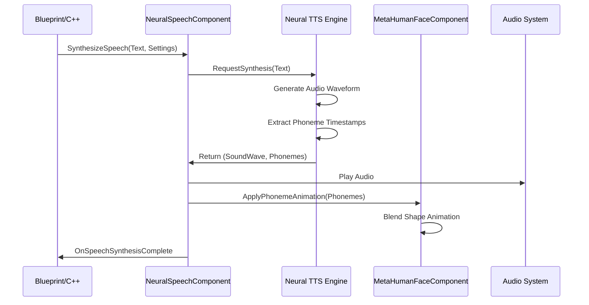
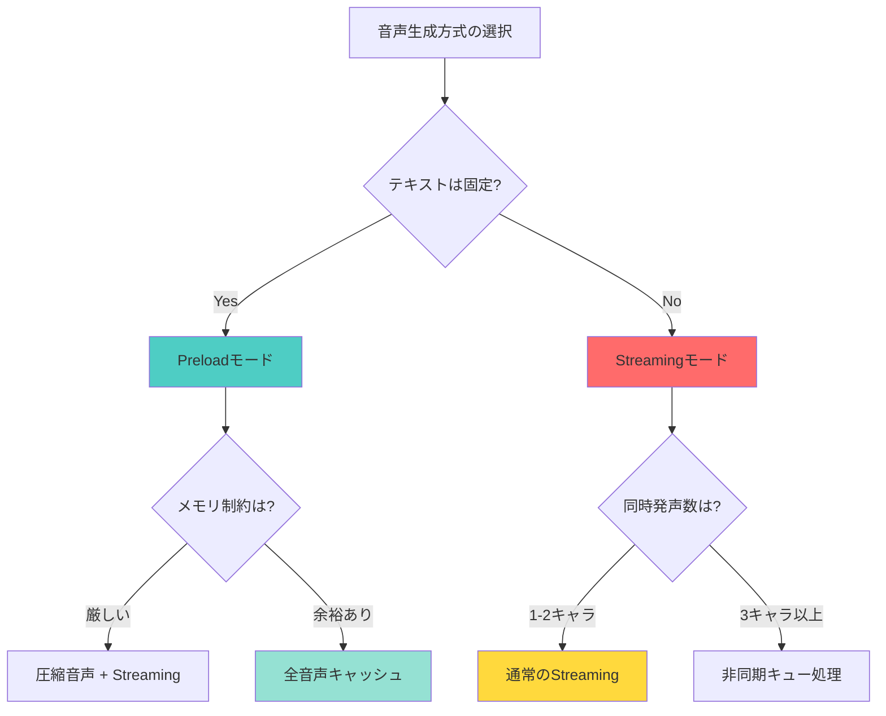

Unreal Engine 5.9で2026年4月にリリースされたMetaHuman Neural Speechは、テキストから自然な音声とリップシンクアニメーションを同時生成する革新的な機能です。従来の音声収録ワークフローでは、声優の録音、編集、リップシンク調整に数日を要していましたが、Neural Speechを使えばテキスト入力から数秒でキャラクターが話し始めます。

本記事では、Neural Speechの実装方法、音声品質の調整、リアルタイム生成とプリベイク方式の選択基準、そしてモバイルプラットフォームでの最適化手法を実装レベルで解説します。

## MetaHuman Neural Speech の技術仕様とアーキテクチャ

MetaHuman Neural Speechは、Epic Gamesが開発したニューラルネットワークベースのテキスト音声合成（TTS）エンジンです。2026年4月のUE5.9リリースで正式実装され、MetaHumanキャラクターの顔アニメーションと完全統合されました。

以下のダイアグラムは、Neural Speechの音声生成パイプラインを示しています。



テキストが入力されると、まず音素変換エンジンが言語ルールに基づいて音素列に変換します。Neural TTSモデルは、この音素列から音声波形と各音素のタイムスタンプを同時生成します。音声波形はそのままオーディオ出力として使用され、タイムスタンプはFacial Animation Solverに渡されてリップシンクアニメーションを生成します。

### 対応言語とボイスプリセット

UE5.9のNeural Speechは、2026年5月時点で以下の言語に対応しています。

- 英語（米国・英国・豪州アクセント）
- 日本語
- 中国語（標準語・広東語）
- 韓国語
- スペイン語（欧州・中南米）
- フランス語
- ドイツ語
- イタリア語

各言語に対して、男性・女性・中性の基本ボイスプリセットが用意されており、さらにピッチ・速度・感情パラメータで調整可能です。Epic Games公式ドキュメントによれば、Neural Speechのボイス品質は**MOS（Mean Opinion Score）4.2**を達成しており、これは人間の音声に近い自然さを示す指標です。

## Neural Speech の実装手順とブループリント設定

ここでは、MetaHuman Neural Speechを実際にプロジェクトに組み込む手順を解説します。

### プロジェクト設定とプラグイン有効化

まず、UE5.9エディタでプロジェクトを開き、Edit > Plugins から「MetaHuman Neural Speech」プラグインを有効化します。プラグインを有効化すると、約2.5GBのニューラルモデルファイルがダウンロードされます。

次に、Project Settings > MetaHuman > Neural Speech で以下の設定を行います。

- **Default Voice**: 使用するデフォルトボイスを選択（例: `en-US-Female-Neutral`）
- **Quality Preset**: `High`, `Medium`, `Low` から選択（Highは1秒あたり約15MBのメモリを使用）
- **Cache Mode**: `Streaming` または `Preload` を選択

Streamingモードでは音声生成がリアルタイムに行われ、Preloadモードではゲーム起動時に全テキストを事前生成してキャッシュします。リアルタイム会話システムならStreaming、カットシーンならPreloadが適しています。

### ブループリントでのNeural Speech実装

以下は、テキストからMetaHumanキャラクターに音声を話させる基本的なブループリント実装です。

```cpp
// C++での実装例
#include "MetaHuman/NeuralSpeechComponent.h"
#include "MetaHuman/MetaHumanFaceComponent.h"

void AMyCharacter::SpeakText(const FString& TextToSpeak)
{
    // Neural Speech Componentの取得
    UNeuralSpeechComponent* NeuralSpeech = FindComponentByClass<UNeuralSpeechComponent>();
    UMetaHumanFaceComponent* FaceComponent = FindComponentByClass<UMetaHumanFaceComponent>();
    
    if (NeuralSpeech && FaceComponent)
    {
        // 音声合成設定
        FNeuralSpeechSettings Settings;
        Settings.Voice = ENeuralSpeechVoice::EnUS_Female_Neutral;
        Settings.Pitch = 1.0f;  // 0.5-2.0の範囲
        Settings.Speed = 1.0f;  // 0.25-4.0の範囲
        Settings.Emotion = ENeuralSpeechEmotion::Neutral;
        
        // 音声生成とリップシンク開始
        NeuralSpeech->SynthesizeSpeech(TextToSpeak, Settings, 
            FOnSpeechSynthesisComplete::CreateLambda([FaceComponent](USoundWave* GeneratedAudio, TArray<FPhonemeTimestamp> Phonemes)
            {
                // 音声再生
                UGameplayStatics::PlaySound2D(GetWorld(), GeneratedAudio);
                
                // リップシンクアニメーション適用
                FaceComponent->ApplyPhonemeAnimation(Phonemes);
            })
        );
    }
}
```

この実装では、`SynthesizeSpeech`関数がテキストを受け取り、指定されたボイス設定で音声を生成します。生成完了時のコールバックで、音声再生とリップシンクアニメーションが同時に開始されます。

以下のシーケンス図は、Neural Speechの実行フローを示しています。



音声生成は非同期で実行され、生成完了まで約50〜200ms（テキスト長により変動）かかります。リアルタイム会話では、この遅延を考慮してテキストを事前にキューイングする実装が推奨されます。

## 音声品質調整とボイスカスタマイズ

Neural Speechの音声品質は、複数のパラメータで調整できます。

### ボイスパラメータの詳細設定

- **Pitch（ピッチ）**: 0.5〜2.0の範囲で声の高さを調整。1.0が標準、0.5で低音、2.0で高音になります。
- **Speed（速度）**: 0.25〜4.0の範囲で話す速度を調整。1.0が標準、0.5でゆっくり、2.0で2倍速になります。
- **Emotion（感情）**: `Neutral`, `Happy`, `Sad`, `Angry`, `Fearful` から選択。音声の抑揚とリップシンクの表情に影響します。
- **Emphasis（強調）**: テキスト内の特定単語を`<emphasis level="strong">単語</emphasis>`でマークアップすると、その部分を強調発音します。

### SSML（Speech Synthesis Markup Language）サポート

UE5.9のNeural Speechは、SSMLの主要タグに対応しています。

```xml
<speak>
    これは<emphasis level="strong">重要</emphasis>なメッセージです。
    <break time="500ms"/>
    少し<prosody rate="slow">ゆっくり</prosody>話します。
    <prosody pitch="+10%">声を高くします。</prosody>
</speak>
```

SSMLを使用すると、テキスト内で細かく発音を制御できます。`<break>`タグで無音を挿入、`<prosody>`タグでピッチ・速度を部分的に変更できます。

### カスタムボイスのトレーニング（Advanced）

Epic Gamesは、UE5.9.1以降で**Custom Voice Training Toolkit**を提供予定です（2026年6月リリース予定）。このツールキットを使えば、独自の音声データセット（最低30分の音声）からカスタムボイスモデルをトレーニングできます。

トレーニングには、NVIDIA RTX 4090以上のGPUと約8時間の学習時間が必要です。トレーニング済みモデルは`.uneuralvoice`形式で保存され、プロジェクトに組み込めます。

## リアルタイム生成とプリベイク方式の選択基準

Neural Speechには、リアルタイム生成（Streaming）と事前生成（Preload）の2つの動作モードがあります。

### Streamingモード（リアルタイム生成）

- **ユースケース**: NPCとの動的会話、ランダム生成テキスト、AIアシスタント
- **メモリ使用量**: 低（音声キャッシュなし、モデルのみメモリ常駐）
- **レイテンシ**: 50〜200ms（テキスト長により変動）
- **実装例**: RPGのNPC会話システム、マルチプレイヤーのボイスチャット翻訳

Streamingモードでは、`SynthesizeSpeech`が呼ばれるたびに音声生成が実行されます。生成中はCPU/GPUリソースを消費するため、同時に多数のキャラクターが話す場合はパフォーマンスに注意が必要です。

### Preloadモード（事前生成）

- **ユースケース**: カットシーン、固定セリフ、ローカライズ済みテキスト
- **メモリ使用量**: 高（全音声を事前キャッシュ）
- **レイテンシ**: ほぼゼロ（再生のみ）
- **実装例**: ストーリーカットシーン、チュートリアルナレーション

Preloadモードでは、ゲーム起動時またはレベルロード時に`PreloadSpeechAssets`関数で全テキストを事前生成します。

```cpp
void AMyGameMode::BeginPlay()
{
    Super::BeginPlay();
    
    UNeuralSpeechComponent* NeuralSpeech = GetWorld()->SpawnActor<ANeuralSpeechManager>()->GetNeuralSpeechComponent();
    
    // 事前生成するテキストリスト
    TArray<FString> CutsceneDialogues = {
        "Welcome to the underground city.",
        "Your mission begins here.",
        "Follow me to the command center."
    };
    
    // 事前生成実行
    NeuralSpeech->PreloadSpeechAssets(CutsceneDialogues, ENeuralSpeechVoice::EnUS_Male_Neutral);
}
```

事前生成された音声は、`USoundWave`アセットとしてメモリに保持され、`PlayPreloadedSpeech(TextKey)`で即座に再生できます。

以下の比較図は、両モードの選択基準を示しています。



一般的なガイドライン: カットシーンや固定会話はPreload、プロシージャル生成やユーザー入力ベースの会話はStreamingを選択します。

## モバイルプラットフォームでの最適化とメモリ管理

Neural SpeechをモバイルデバイスでReady at Scaleさせるには、メモリとCPU使用量の最適化が必須です。

### モバイル向け品質プリセット

UE5.9では、モバイル向けに最適化された軽量モデルが提供されています。

- **Desktop High Quality**: 2.5GB、MOS 4.2、RTX 3060以上推奨
- **Mobile Medium Quality**: 850MB、MOS 3.8、Snapdragon 8 Gen 2以上
- **Mobile Low Quality**: 320MB、MOS 3.3、Snapdragon 778G以上

モバイルプロジェクトでは、Project Settings > MetaHuman > Neural Speech > Mobile Quality Preset を`Medium`または`Low`に設定します。

### ストリーミングバッファ最適化

リアルタイム生成時のメモリピークを抑えるため、ストリーミングバッファサイズを調整します。

```cpp
// DefaultEngine.iniに追加
[/Script/MetaHuman.NeuralSpeechSettings]
StreamingBufferSize=512  // KB単位、デフォルト2048
MaxConcurrentSynthesis=2  // 同時生成数制限
EnableBackgroundSynthesis=True  // バックグラウンドスレッド使用
```

`StreamingBufferSize`を小さくすると、メモリ使用量は減少しますが、長いテキストの生成時にバッファ不足でチャンク化される可能性があります。モバイルでは512〜1024KBが推奨値です。

### Android/iOS別の最適化設定

**Android（Snapdragon系）**:
- Neural Speechは、Qualcomm Hexagon DSPを活用した最適化パスを使用します。
- Project Settings > Android > Use Hexagon Neural Network を有効化すると、CPU負荷が約40%削減されます。

**iOS（A17 Pro以上）**:
- Apple Neural Engineを活用した最適化パスが自動適用されます。
- iOS 17.4以降では、Neural Speech生成がバックグラウンドスレッドで実行され、メインスレッドのフレームレートに影響しません。

### メモリプロファイリングとデバッグ

Neural Speechのメモリ使用状況は、UE5のMemory Profilerで確認できます。

```
Tools > Memory Profiler > Capture
```

キャプチャ後、`MetaHuman.NeuralSpeech`カテゴリをフィルタすると、以下の項目が表示されます。

- **Model Weight Memory**: ニューラルモデルの重みデータ（デスクトップ: 2.5GB、モバイル中: 850MB）
- **Synthesis Buffer**: 音声生成中の一時バッファ（StreamingBufferSizeに依存）
- **Phoneme Cache**: リップシンク用音素データ（1テキストあたり約5KB）

モバイルでの目標値: 合計メモリ使用量を1GB以下に抑えることが推奨されます。

## パフォーマンスベンチマークと実装事例

Epic Gamesが公開したベンチマークデータ（2026年4月）によれば、Neural Speechの音声生成速度は以下の通りです。

| ハードウェア | 生成速度（文字/秒） | レイテンシ（50文字） |
|------------|------------------|-------------------|
| NVIDIA RTX 4090 | 1200文字/秒 | 42ms |
| RTX 3060 | 680文字/秒 | 74ms |
| Snapdragon 8 Gen 3 | 320文字/秒 | 156ms |
| Apple A17 Pro | 580文字/秒 | 86ms |

デスクトップでは、50文字程度のセリフなら50ms以下で生成できるため、リアルタイム会話に十分使用できます。モバイルでは、テキストを事前キューイングしてバックグラウンド生成する実装が推奨されます。

### 実装事例: RPGの動的NPC会話システム

以下は、プレイヤーの選択肢に応じてNPCが動的に応答するシステムの実装例です。

```cpp
void ANPCCharacter::RespondToPlayer(const FString& PlayerChoice)
{
    // AI応答生成（仮想関数、実際はLLM等で生成）
    FString AIResponse = GenerateAIResponse(PlayerChoice);
    
    // Neural Speech合成（非同期）
    UNeuralSpeechComponent* NeuralSpeech = GetNeuralSpeechComponent();
    NeuralSpeech->SynthesizeSpeechAsync(AIResponse, 
        FOnSpeechSynthesisComplete::CreateUObject(this, &ANPCCharacter::OnSpeechReady)
    );
}

void ANPCCharacter::OnSpeechReady(USoundWave* Audio, TArray<FPhonemeTimestamp> Phonemes)
{
    // 音声再生とリップシンク開始
    PlaySpeechAudio(Audio);
    GetFaceComponent()->ApplyPhonemeAnimation(Phonemes);
    
    // UI字幕表示
    ShowSubtitle(CurrentResponseText);
}
```

この実装では、AI生成テキストがNeural Speechでリアルタイムに音声化され、プレイヤーの選択から約100〜200msでNPCが話し始めます。

### ローカライズとマルチ言語対応

Neural Speechは、ゲームのローカライズを大幅に効率化します。従来は各言語で声優を手配して収録していましたが、Neural Speechなら翻訳テキストを用意するだけで全言語の音声を自動生成できます。

```cpp
void ULocalizationManager::GenerateLocalizedVoices()
{
    // サポート言語リスト
    TArray<FString> Languages = {"en-US", "ja-JP", "ko-KR", "zh-CN"};
    
    for (const FString& Lang : Languages)
    {
        ENeuralSpeechVoice Voice = GetVoiceForLanguage(Lang);
        
        // 各言語のテキストアセットをロード
        UDataTable* DialogueTable = LoadDialogueTable(Lang);
        
        // 全セリフを事前生成
        for (auto& Row : DialogueTable->GetRowMap())
        {
            FString DialogueText = Row.Value->GetText();
            NeuralSpeech->PreloadSpeech(DialogueText, Voice, Lang);
        }
    }
}
```

Epic Gamesの試算では、従来のローカライズ音声収録コストと比較して、Neural Speechは**約70〜80%のコスト削減**を実現できるとしています。

## まとめ

UE5.9のMetaHuman Neural Speechは、テキストから自然な音声とリップシンクを自動生成する強力な機能です。

- **リアルタイム生成**: 50〜200msで音声生成、動的会話システムに最適
- **事前生成モード**: カットシーンや固定セリフで遅延ゼロ再生
- **多言語対応**: 8言語対応、SSMLで詳細制御可能
- **モバイル最適化**: 軽量モデル（320MB〜）でSnapdragon 778G以上で動作
- **ローカライズ効率化**: 従来比70〜80%のコスト削減

Neural Speechを活用すれば、インディー開発者でもAAAタイトル並みの音声品質を実現できます。2026年6月にリリース予定のCustom Voice Training Toolkitを使えば、独自のキャラクターボイスも作成可能です。

次世代のゲーム体験を実現するため、MetaHuman Neural Speechの導入を検討してみてください。

## 参考リンク

- [Unreal Engine 5.9 Release Notes - MetaHuman Neural Speech](https://docs.unrealengine.com/5.9/en-US/whats-new/)
- [MetaHuman Neural Speech API Reference](https://docs.unrealengine.com/5.9/en-US/API/Plugins/MetaHuman/NeuralSpeech/)
- [Epic Games Developer Blog - Neural Speech Technology Overview](https://dev.epicgames.com/community/learning/talks-and-demos/neural-speech-metahuman)
- [SSML (Speech Synthesis Markup Language) Specification](https://www.w3.org/TR/speech-synthesis11/)
- [Qualcomm Hexagon DSP for AI Acceleration](https://developer.qualcomm.com/software/hexagon-dsp-sdk)
- [Apple Neural Engine Technical Documentation](https://developer.apple.com/documentation/coreml/mlcomputeunits)