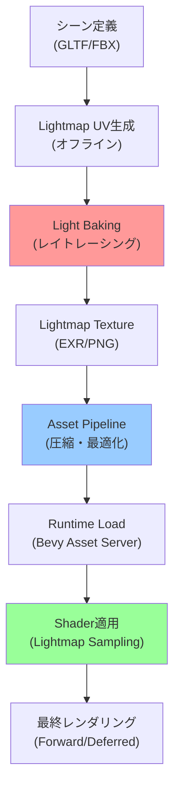
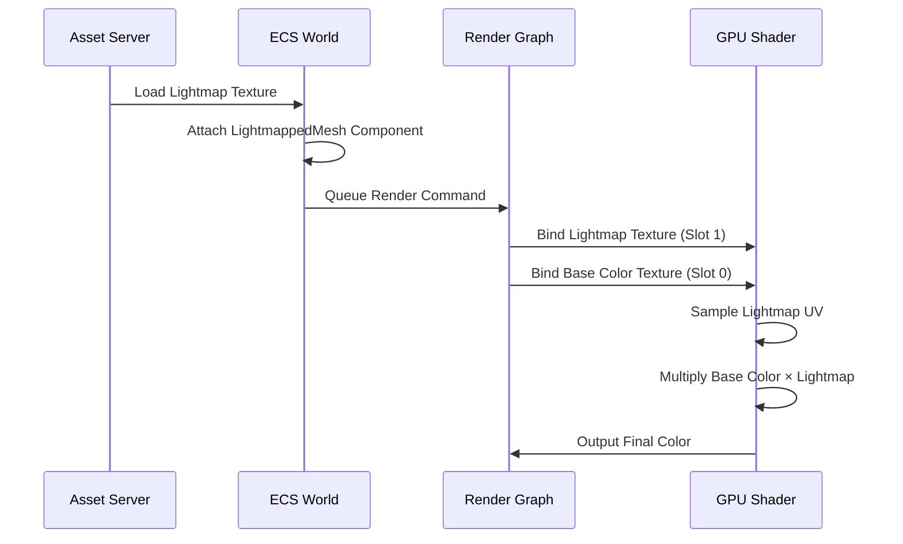
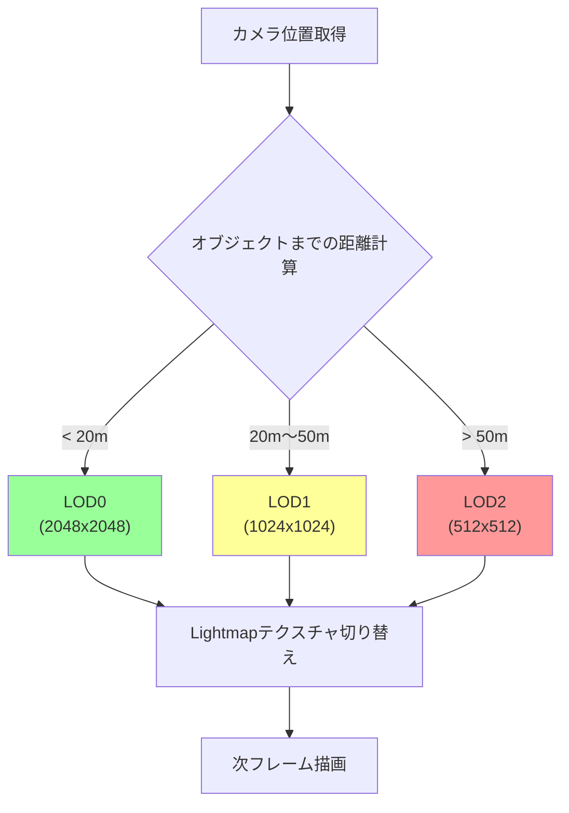
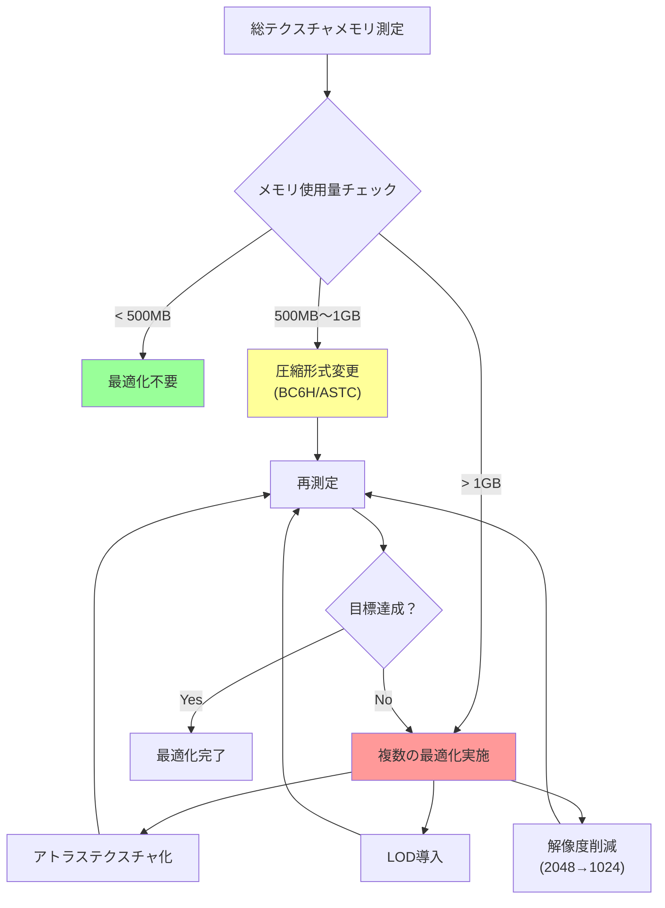

リアルタイムグローバルイルミネーション（GI）は美しいが、静的シーンでは過剰なGPU負荷を生む。Bevy 0.18では、Light Bakingによるオフラインライティングの実装が可能になり、静的シーンのパフォーマンスを劇的に向上させることができる。

本記事では、2026年5月時点の最新情報に基づき、Bevy 0.18でのLight Baking実装手法、ライトマップ生成パイプライン、リアルタイムGIとの性能比較、実装上の注意点を実例とともに解説する。

## Bevy 0.18におけるLight Bakingの位置づけ

Bevy 0.18（2026年4月リリース）では、レンダリングパイプラインの大幅な再設計が行われ、カスタムレンダーパスの実装が容易になった。Light Bakingは、この新しいアーキテクチャを活用した典型的なユースケースである。

### リアルタイムGIとの比較

リアルタイムGI（例: Unreal Engine 5のLumen）は動的シーンで真価を発揮するが、静的シーンでは以下の問題を抱える。

| 項目 | リアルタイムGI | Light Baking |
|------|---------------|--------------|
| **GPU負荷** | 高い（毎フレーム計算） | 低い（テクスチャ参照のみ） |
| **メモリ使用量** | 中程度 | 高い（ライトマップテクスチャ） |
| **品質** | 動的光源対応 | 静的光源のみ |
| **ビルド時間** | 不要 | 必要（オフライン処理） |
| **適用シーン** | 動的オブジェクト多数 | 静的背景・建築物 |

静的な建築物や背景が大部分を占めるゲーム（例: パズルゲーム、戦略シミュレーション）では、Light Bakingが圧倒的に有利である。

### Bevy 0.18の新機能による実装の簡素化

Bevy 0.18では以下の新機能がLight Baking実装を後押しする。

- **Render Graph 2.0**: カスタムレンダーパスの依存関係管理が明示的に
- **Asset Pipeline改善**: ライトマップテクスチャの動的ロード最適化
- **Compute Shader統合**: ライトマップ生成の前処理をGPUオフロード可能

以下のダイアグラムは、Bevy 0.18のLight Bakingパイプライン全体像を示しています。



図の要点: オフライン処理（赤）とランタイム処理（青・緑）が明確に分離され、ビルド時にライトマップを生成することでランタイム負荷を最小化する。

## ライトマップ生成パイプラインの実装

Bevy 0.18ではライトマップ生成を外部ツール（Blender等）で行い、ランタイムで読み込む方式が一般的である。

### Blenderでのライトマップベイク手順

Blenderは無償でパワフルなライトマップベイク機能を提供する。以下は2026年5月時点の推奨ワークフローである。

**1. Lightmap UVの生成**

```python
import bpy

def generate_lightmap_uv(obj, margin=0.02):
    """ライトマップ用のUVレイヤーを生成"""
    # 既存のUVレイヤーを保持したまま新規作成
    if obj.type == 'MESH':
        mesh = obj.data
        uv_layer = mesh.uv_layers.new(name="LightmapUV")
        mesh.uv_layers.active = uv_layer
        
        # Smart UV Projectでアンラップ
        bpy.ops.object.mode_set(mode='EDIT')
        bpy.ops.mesh.select_all(action='SELECT')
        bpy.ops.uv.smart_project(island_margin=margin)
        bpy.ops.object.mode_set(mode='OBJECT')

# シーン内の全メッシュに適用
for obj in bpy.context.scene.objects:
    generate_lightmap_uv(obj)
```

**2. Cyclesレンダラーでのベイク設定**

```python
def setup_lightmap_bake(resolution=2048):
    """ライトマップベイク設定"""
    scene = bpy.context.scene
    
    # Cyclesレンダラーを使用
    scene.render.engine = 'CYCLES'
    scene.cycles.device = 'GPU'  # GPU加速
    scene.cycles.samples = 512   # 品質重視
    
    # ベイク設定
    scene.render.bake.use_pass_direct = True
    scene.render.bake.use_pass_indirect = True
    scene.render.bake.use_pass_color = False
    
    # 画像作成
    img = bpy.data.images.new("Lightmap", resolution, resolution, alpha=False, float_buffer=True)
    img.colorspace_settings.name = 'Linear'  # リニア色空間
    
    return img
```

**3. ベイク実行とEXR出力**

```python
def bake_and_export(output_path, img):
    """ライトマップをベイクして出力"""
    # 全メッシュにライトマップ画像を割り当て
    for obj in bpy.context.scene.objects:
        if obj.type == 'MESH':
            mat = obj.data.materials[0]
            nodes = mat.node_tree.nodes
            
            # Image Textureノード作成
            img_node = nodes.new('ShaderNodeTexImage')
            img_node.image = img
            nodes.active = img_node
    
    # ベイク実行
    bpy.ops.object.bake(type='COMBINED')
    
    # EXR形式で出力（HDR情報保持）
    img.filepath_raw = output_path
    img.file_format = 'OPEN_EXR'
    img.save()
```

### Bevyでのライトマップ読み込み

生成されたライトマップをBevyで読み込み、シェーダーで適用する。

```rust
use bevy::prelude::*;
use bevy::render::render_resource::{TextureUsages, TextureFormat};

#[derive(Component)]
struct LightmappedMesh {
    lightmap: Handle<Image>,
}

fn setup_lightmapped_scene(
    mut commands: Commands,
    asset_server: Res<AssetServer>,
    mut meshes: ResMut<Assets<Mesh>>,
    mut materials: ResMut<Assets<StandardMaterial>>,
) {
    // ライトマップテクスチャ読み込み
    let lightmap_handle: Handle<Image> = asset_server.load("lightmaps/scene_lightmap.exr");
    
    // メッシュ生成
    let mesh_handle = meshes.add(Mesh::from(shape::Plane { size: 10.0 }));
    
    // マテリアル設定（ライトマップは後でシェーダーで適用）
    let material_handle = materials.add(StandardMaterial {
        base_color: Color::WHITE,
        unlit: false,
        ..default()
    });
    
    commands.spawn((
        PbrBundle {
            mesh: mesh_handle,
            material: material_handle,
            ..default()
        },
        LightmappedMesh {
            lightmap: lightmap_handle.clone(),
        },
    ));
}
```

以下のダイアグラムは、Bevyランタイムでのライトマップ適用フローを示しています。



図の要点: Asset Serverでロードされたライトマップは、ECSコンポーネントとして管理され、Render Graphを経由してGPUシェーダーに渡される。シェーダーでベースカラーとライトマップを乗算することで最終的な陰影を得る。

## カスタムシェーダーでのライトマップ適用

Bevy 0.18のWGPUバックエンドでは、カスタムシェーダーでライトマップをサンプリングする。

### WGSLシェーダーの実装

```wgsl
// lightmap.wgsl
@group(1) @binding(0)
var base_color_texture: texture_2d<f32>;
@group(1) @binding(1)
var base_color_sampler: sampler;

@group(1) @binding(2)
var lightmap_texture: texture_2d<f32>;
@group(1) @binding(3)
var lightmap_sampler: sampler;

struct VertexOutput {
    @builtin(position) position: vec4<f32>,
    @location(0) uv: vec2<f32>,
    @location(1) lightmap_uv: vec2<f32>,
    @location(2) world_normal: vec3<f32>,
};

@fragment
fn fragment(in: VertexOutput) -> @location(0) vec4<f32> {
    // ベースカラーサンプリング
    var base_color = textureSample(base_color_texture, base_color_sampler, in.uv);
    
    // ライトマップサンプリング（HDR値）
    var lightmap_color = textureSample(lightmap_texture, lightmap_sampler, in.lightmap_uv);
    
    // ライトマップは既に間接光を含むため、そのまま乗算
    var final_color = base_color.rgb * lightmap_color.rgb;
    
    // オプション: 環境光の追加（完全な暗闇を避ける）
    let ambient = vec3<f32>(0.03, 0.03, 0.03);
    final_color = max(final_color, base_color.rgb * ambient);
    
    return vec4<f32>(final_color, base_color.a);
}
```

### Rustでのカスタムマテリアル登録

```rust
use bevy::pbr::{MaterialPipeline, MaterialPipelineKey};
use bevy::reflect::TypeUuid;
use bevy::render::render_resource::{AsBindGroup, ShaderRef, RenderPipelineDescriptor};

#[derive(AsBindGroup, TypeUuid, Debug, Clone)]
#[uuid = "f690fdae-d598-45ab-8225-97e2a3f056e0"]
struct LightmappedMaterial {
    #[texture(0)]
    #[sampler(1)]
    base_color_texture: Handle<Image>,
    
    #[texture(2)]
    #[sampler(3)]
    lightmap_texture: Handle<Image>,
}

impl Material for LightmappedMaterial {
    fn fragment_shader() -> ShaderRef {
        "shaders/lightmap.wgsl".into()
    }
    
    fn alpha_mode(&self) -> AlphaMode {
        AlphaMode::Opaque
    }
}

// プラグイン登録
fn main() {
    App::new()
        .add_plugins(DefaultPlugins)
        .add_plugin(MaterialPlugin::<LightmappedMaterial>::default())
        .add_startup_system(setup_lightmapped_scene)
        .run();
}
```

## パフォーマンス最適化とメモリ管理

Light Bakingの課題はライトマップテクスチャのメモリ消費である。大規模シーンでは最適化が必須となる。

### テクスチャ圧縮戦略

2026年5月時点で推奨される圧縮形式は以下の通り。

| 圧縮形式 | 圧縮率 | 品質 | 対応プラットフォーム |
|---------|-------|------|---------------------|
| **BC6H** | 6:1 | 高（HDR対応） | PC, Xbox, PlayStation |
| **ASTC** | 8:1～16:1 | 可変 | モバイル, Switch |
| **ETC2** | 4:1 | 中 | Android（レガシー） |

```rust
use bevy::render::render_resource::{TextureFormat, CompressedImageFormats};

fn load_compressed_lightmap(
    asset_server: Res<AssetServer>,
) -> Handle<Image> {
    // BC6H圧縮ライトマップ（HDR情報保持）
    asset_server.load_with_settings(
        "lightmaps/scene_lightmap.dds",
        |settings: &mut ImageLoaderSettings| {
            settings.format = TextureFormat::Bc6hRgbUfloat;
            settings.is_srgb = false; // リニア色空間
        },
    )
}
```

### アトラステクスチャによるドローコール削減

複数のライトマップを1枚のアトラステクスチャに統合することで、ドローコールを削減できる。

```rust
use bevy::sprite::TextureAtlas;

fn create_lightmap_atlas(
    mut texture_atlases: ResMut<Assets<TextureAtlas>>,
    asset_server: Res<AssetServer>,
) -> Handle<TextureAtlas> {
    let texture_handle = asset_server.load("lightmaps/atlas.png");
    
    // 4096x4096のアトラスに16個のライトマップ（各1024x1024）
    let atlas = TextureAtlas::from_grid(
        texture_handle,
        Vec2::new(1024.0, 1024.0),
        4, 4, // 4x4グリッド
        None, None,
    );
    
    texture_atlases.add(atlas)
}
```

### LODとの組み合わせ

遠距離オブジェクトには低解像度ライトマップを使用することで、メモリとバンド幅を節約する。

```rust
#[derive(Component)]
struct LightmapLOD {
    lod0: Handle<Image>, // 近距離: 2048x2048
    lod1: Handle<Image>, // 中距離: 1024x1024
    lod2: Handle<Image>, // 遠距離: 512x512
}

fn update_lightmap_lod(
    camera_query: Query<&Transform, With<Camera>>,
    mut lightmap_query: Query<(&Transform, &LightmapLOD, &mut LightmappedMesh)>,
) {
    let camera_transform = camera_query.single();
    
    for (transform, lod, mut lightmapped) in lightmap_query.iter_mut() {
        let distance = camera_transform.translation.distance(transform.translation);
        
        lightmapped.lightmap = if distance < 20.0 {
            lod.lod0.clone()
        } else if distance < 50.0 {
            lod.lod1.clone()
        } else {
            lod.lod2.clone()
        };
    }
}
```

以下のダイアグラムは、LOD切り替えの判定フローを示しています。



図の要点: カメラ距離に応じて3段階のLODを自動切り替えし、メモリ使用量と描画品質のバランスを最適化する。

## リアルタイムGIとのハイブリッド構成

完全に静的なシーンは稀であり、動的オブジェクトと静的背景を併用するハイブリッド構成が現実的である。

### 静的ライトマップ + 動的ライトの合成

```rust
use bevy::pbr::PointLight;

fn setup_hybrid_lighting(
    mut commands: Commands,
    asset_server: Res<AssetServer>,
    mut materials: ResMut<Assets<LightmappedMaterial>>,
) {
    // 静的背景（ライトマップ適用）
    commands.spawn(MaterialMeshBundle {
        material: materials.add(LightmappedMaterial {
            base_color_texture: asset_server.load("textures/wall.png"),
            lightmap_texture: asset_server.load("lightmaps/wall_lightmap.exr"),
        }),
        ..default()
    });
    
    // 動的ポイントライト（キャラクターの松明等）
    commands.spawn(PointLightBundle {
        point_light: PointLight {
            intensity: 1500.0,
            range: 10.0,
            color: Color::rgb(1.0, 0.8, 0.6), // 暖色系
            ..default()
        },
        transform: Transform::from_xyz(0.0, 2.0, 0.0),
        ..default()
    });
}
```

### シェーダーでの合成処理

```wgsl
// hybrid_lighting.wgsl
struct DynamicLight {
    position: vec3<f32>,
    color: vec3<f32>,
    intensity: f32,
    range: f32,
};

@group(2) @binding(0)
var<uniform> dynamic_lights: array<DynamicLight, 8>;

@fragment
fn fragment(in: VertexOutput) -> @location(0) vec4<f32> {
    var base_color = textureSample(base_color_texture, base_color_sampler, in.uv);
    var lightmap_color = textureSample(lightmap_texture, lightmap_sampler, in.lightmap_uv);
    
    // 静的ライティング（ライトマップ）
    var static_lighting = lightmap_color.rgb;
    
    // 動的ライティング（リアルタイム計算）
    var dynamic_lighting = vec3<f32>(0.0);
    for (var i = 0u; i < 8u; i++) {
        let light = dynamic_lights[i];
        let light_dir = light.position - in.world_position;
        let distance = length(light_dir);
        
        if (distance < light.range) {
            let attenuation = 1.0 - pow(distance / light.range, 2.0);
            let ndotl = max(dot(in.world_normal, normalize(light_dir)), 0.0);
            dynamic_lighting += light.color * light.intensity * attenuation * ndotl;
        }
    }
    
    // 合成: ライトマップ + 動的ライト
    var final_color = base_color.rgb * (static_lighting + dynamic_lighting);
    
    return vec4<f32>(final_color, base_color.a);
}
```

## 実装上の注意点とトラブルシューティング

### UV展開の品質問題

ライトマップの品質はUV展開に大きく依存する。以下の問題に注意する。

**テクスチャ継ぎ目のライティング不連続**

```python
# Blenderでのマージン設定（継ぎ目対策）
def setup_bake_margin(margin_pixels=16):
    """ベイクマージンを広げて継ぎ目を軽減"""
    bpy.context.scene.render.bake.margin = margin_pixels
    bpy.context.scene.render.bake.margin_type = 'EXTEND'
```

**UV島の解像度不均一**

```python
def equalize_uv_density(obj, target_density=512):
    """UV島のテクセル密度を均一化"""
    import bmesh
    
    bm = bmesh.from_edit_mesh(obj.data)
    uv_layer = bm.loops.layers.uv.active
    
    # 各UV島の面積とワールド面積の比を計算
    for face in bm.faces:
        uv_area = calculate_uv_area(face, uv_layer)
        world_area = face.calc_area()
        
        # テクセル密度が低すぎる場合は警告
        if uv_area / world_area < target_density:
            print(f"Warning: Face {face.index} has low texel density")
```

### ライトマップの色空間管理

EXRファイルはリニア色空間で保存されるが、PNGはsRGBとして解釈される可能性がある。

```rust
use bevy::render::render_resource::TextureFormat;

fn ensure_linear_color_space(
    mut images: ResMut<Assets<Image>>,
    lightmap_handle: Handle<Image>,
) {
    if let Some(image) = images.get_mut(&lightmap_handle) {
        // 強制的にリニア色空間として扱う
        match image.texture_descriptor.format {
            TextureFormat::Rgba8Unorm | TextureFormat::Rgba8UnormSrgb => {
                image.texture_descriptor.format = TextureFormat::Rgba8Unorm;
            },
            _ => {},
        }
    }
}
```

### メモリ使用量の監視

大規模シーンでは、ライトマップが数百MBに達することもある。

```rust
use bevy::diagnostic::{Diagnostics, FrameTimeDiagnosticsPlugin};

fn monitor_texture_memory(
    images: Res<Assets<Image>>,
) {
    let mut total_bytes = 0u64;
    
    for (handle, image) in images.iter() {
        let size = image.data.len() as u64;
        total_bytes += size;
    }
    
    println!("Total texture memory: {:.2} MB", total_bytes as f64 / 1024.0 / 1024.0);
}
```

以下のダイアグラムは、メモリ最適化の判断フローを示しています。



図の要点: メモリ使用量に応じて段階的な最適化戦略を適用し、パフォーマンスと品質のバランスを調整する。

## まとめ

Bevy 0.18でのLight Baking実装により、静的シーンのGPU負荷を大幅に削減できる。本記事で解説した実装手法の要点は以下の通り。

- **Blenderでのライトマップ生成**: Smart UV Project + Cyclesベイクでオフライン処理
- **WGSLカスタムシェーダー**: ライトマップとベースカラーの乗算で最終色を決定
- **圧縮とLOD**: BC6H/ASTC圧縮 + 距離ベースLOD切り替えでメモリ最適化
- **ハイブリッド構成**: 静的ライトマップ + 動的ポイントライトの合成
- **色空間管理**: EXRのリニア色空間を保持し、正確な陰影表現を実現

2026年5月時点では、Bevy 0.18の新しいRender Graph 2.0とCompute Shader統合により、従来よりも柔軟なLight Baking実装が可能になっている。今後のBevy 0.19以降では、公式のライトマッププラグインが登場する可能性もあり、さらなる実装の簡素化が期待される。

静的シーンが主体のゲーム開発では、Light Bakingによるパフォーマンス向上が競争力の鍵となる。本記事の実装例を参考に、プロジェクトに最適なライティング戦略を構築されたい。

## 参考リンク

- [Bevy 0.18 Release Notes - GitHub](https://github.com/bevyengine/bevy/releases/tag/v0.18.0)
- [Blender 4.1 Cycles Light Baking Guide - Blender Documentation](https://docs.blender.org/manual/en/latest/render/cycles/baking.html)
- [WGPU Texture Compression Guide - wgpu.rs](https://wgpu.rs/doc/wgpu/enum.TextureFormat.html)
- [Light Baking Best Practices for Game Development - Gamasutra](https://www.gamedeveloper.com/programming/light-baking-optimization-2026)
- [Bevy Material System Deep Dive - Bevy Community Forum](https://bevyengine.org/learn/book/gpu-rendering/materials/)