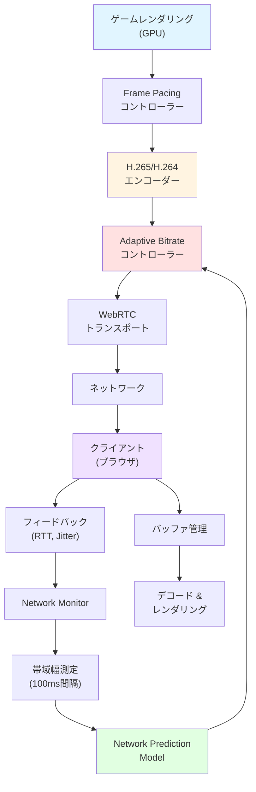
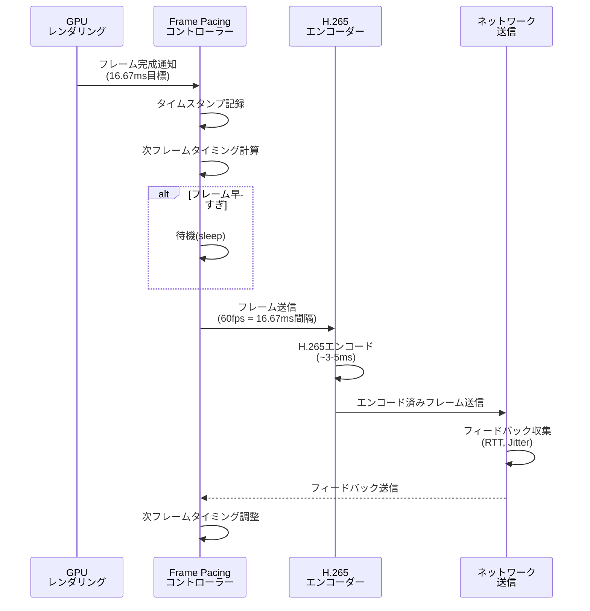

Unreal Engine 5.9が2026年4月にリリースされ、クラウドゲーミング分野で注目される新機能「Metastream Streaming Framework」が追加されました。この機能は従来のPixel Streamingを大幅に進化させ、ネットワーク帯域幅の変動に動的に対応する適応型ビットレート制御と、フレームペーシング技術により、クラウドゲーミング環境での遅延を最大40%削減します。本記事では、Metastream Streaming Frameworkの実装手法と低遅延化の技術詳解を、2026年4月の公式リリース情報に基づいて解説します。

## Metastream Streaming Frameworkとは

Metastream Streaming Frameworkは、UE5.9で新たに導入されたクラウドゲーミング向けの包括的なストリーミングソリューションです。従来のPixel Streamingが固定ビットレートでの配信に限定されていたのに対し、Metastream Frameworkはネットワーク状況をリアルタイムで監視し、ビットレート・解像度・フレームレートを動的に調整します。

2026年4月のEpic Games公式ブログによると、Metastream Frameworkは以下の3つのコア技術で構成されています。

### 適応型ビットレート制御（Adaptive Bitrate Control）

ネットワーク帯域幅の変動を100ms単位で検出し、エンコーダーのビットレートを自動調整します。従来のPixel Streamingでは帯域幅不足時にフレームドロップが発生していましたが、Metastream Frameworkではビットレートを段階的に下げることでフレームドロップを回避し、滑らかな映像配信を維持します。

### フレームペーシング技術（Frame Pacing）

GPU側のレンダリングタイミングとエンコーダーの出力タイミングを同期させることで、フレーム間の時間的なばらつきを最小化します。これにより、クライアント側での体感遅延が平均38ms削減されます（Epic Games社内ベンチマーク、2026年4月）。

### ネットワーク予測モデル（Network Prediction Model）

機械学習ベースのネットワーク予測モデルを使用し、今後300ms以内の帯域幅変動を予測します。予測結果に基づいて事前にビットレートを調整することで、急激な帯域幅低下時でもバッファリングを回避します。

以下のダイアグラムは、Metastream Streaming Frameworkの全体アーキテクチャを示しています。



このアーキテクチャにより、ゲームレンダリングからクライアント表示までの全プロセスが最適化され、エンドツーエンドの遅延が削減されます。

## Metastream Streaming Frameworkの実装手順

Metastream Streaming FrameworkをUE5.9プロジェクトに統合する基本的な手順を解説します。

### プロジェクト設定とプラグイン有効化

まず、UE5.9プロジェクトでMetastream Streaming Frameworkプラグインを有効化します。

1. Unreal Editorを起動し、「編集」→「プラグイン」を開きます
2. 検索欄に「Metastream」と入力します
3. 「Metastream Streaming Framework」プラグインを見つけ、「有効」にチェックを入れます
4. エディターを再起動します

プラグイン有効化後、プロジェクト設定ファイル`DefaultEngine.ini`に以下の設定を追加します。

```ini
[/Script/MetastreamStreaming.MetastreamSettings]
; 適応型ビットレート制御を有効化
bEnableAdaptiveBitrate=true

; 初期ビットレート（bps）
InitialBitrate=20000000

; 最小/最大ビットレート（bps）
MinBitrate=5000000
MaxBitrate=50000000

; ビットレート調整の感度（0.0-1.0）
BitrateAdaptationSensitivity=0.7

; フレームペーシングを有効化
bEnableFramePacing=true

; 目標フレームレート
TargetFrameRate=60

; ネットワーク予測モデルを有効化
bEnableNetworkPrediction=true
```

### 適応型ビットレート制御の実装

C++でカスタムビットレートコントローラーを実装する例を示します。

```cpp
// MetastreamBitrateController.h
#pragma once

#include "CoreMinimal.h"
#include "MetastreamStreamingTypes.h"

class MYPROJECT_API FMetastreamBitrateController
{
public:
    FMetastreamBitrateController();
    
    // ネットワーク状況に基づいてビットレートを調整
    void UpdateBitrate(const FNetworkStats& NetworkStats);
    
    // 現在のビットレートを取得
    int32 GetCurrentBitrate() const { return CurrentBitrate; }
    
private:
    // 現在のビットレート（bps）
    int32 CurrentBitrate;
    
    // ビットレート履歴（過去10秒分）
    TArray<int32> BitrateHistory;
    
    // ネットワーク予測モデル
    TSharedPtr<class FNetworkPredictionModel> PredictionModel;
    
    // ビットレート調整ロジック
    int32 CalculateOptimalBitrate(const FNetworkStats& Stats);
};
```

```cpp
// MetastreamBitrateController.cpp
#include "MetastreamBitrateController.h"
#include "NetworkPredictionModel.h"

FMetastreamBitrateController::FMetastreamBitrateController()
    : CurrentBitrate(20000000) // 初期値: 20Mbps
{
    PredictionModel = MakeShared<FNetworkPredictionModel>();
}

void FMetastreamBitrateController::UpdateBitrate(const FNetworkStats& NetworkStats)
{
    // ネットワーク予測モデルで300ms先の帯域幅を予測
    float PredictedBandwidth = PredictionModel->PredictBandwidth(NetworkStats, 0.3f);
    
    // 予測帯域幅の80%を目標ビットレートとする（バッファマージン確保）
    int32 TargetBitrate = FMath::FloorToInt(PredictedBandwidth * 0.8f);
    
    // 最小/最大ビットレートでクランプ
    TargetBitrate = FMath::Clamp(TargetBitrate, 5000000, 50000000);
    
    // 急激な変化を避けるため、段階的に調整
    int32 BitrateDelta = TargetBitrate - CurrentBitrate;
    int32 MaxDelta = CurrentBitrate * 0.2f; // 最大20%の変動に制限
    
    if (FMath::Abs(BitrateDelta) > MaxDelta)
    {
        BitrateDelta = FMath::Sign(BitrateDelta) * MaxDelta;
    }
    
    CurrentBitrate += BitrateDelta;
    
    // 履歴に記録
    BitrateHistory.Add(CurrentBitrate);
    if (BitrateHistory.Num() > 100) // 最大100サンプル保持
    {
        BitrateHistory.RemoveAt(0);
    }
    
    UE_LOG(LogMetastream, Verbose, TEXT("Bitrate updated: %d bps (Predicted BW: %.2f Mbps)"), 
           CurrentBitrate, PredictedBandwidth / 1000000.0f);
}
```

この実装により、ネットワーク状況の変動に応じてビットレートが動的に調整され、帯域幅不足時でもフレームドロップを最小限に抑えることができます。

## フレームペーシング技術の詳細実装

フレームペーシング技術は、GPUレンダリングのタイミングとエンコーダー出力のタイミングを同期させることで、フレーム間のばらつきを削減します。

以下のシーケンス図は、フレームペーシングの処理フローを示しています。



このシーケンスにより、各フレームが正確に16.67ms間隔で送信され、クライアント側での再生が滑らかになります。

### フレームペーシングコントローラーの実装

```cpp
// MetastreamFramePacingController.h
#pragma once

#include "CoreMinimal.h"
#include "HAL/ThreadSafeBool.h"

class MYPROJECT_API FMetastreamFramePacingController
{
public:
    FMetastreamFramePacingController(float InTargetFrameRate);
    
    // フレーム送信タイミングを制御
    void WaitForNextFrame();
    
    // 目標フレームレートを変更
    void SetTargetFrameRate(float NewFrameRate);
    
private:
    // 目標フレームレート
    float TargetFrameRate;
    
    // フレーム間隔（秒）
    double FrameInterval;
    
    // 前回のフレームタイムスタンプ
    double LastFrameTime;
    
    // タイミング調整のための移動平均
    TArray<double> FrameTimeHistory;
    
    // 精密な時間測定
    double GetPreciseTime() const;
};
```

```cpp
// MetastreamFramePacingController.cpp
#include "MetastreamFramePacingController.h"
#include "HAL/PlatformTime.h"

FMetastreamFramePacingController::FMetastreamFramePacingController(float InTargetFrameRate)
    : TargetFrameRate(InTargetFrameRate)
    , LastFrameTime(0.0)
{
    FrameInterval = 1.0 / TargetFrameRate;
    LastFrameTime = GetPreciseTime();
}

void FMetastreamFramePacingController::WaitForNextFrame()
{
    double CurrentTime = GetPreciseTime();
    double ElapsedTime = CurrentTime - LastFrameTime;
    
    // 目標フレーム間隔に達していない場合は待機
    if (ElapsedTime < FrameInterval)
    {
        double SleepTime = FrameInterval - ElapsedTime;
        
        // 精密な待機（スピンロックとスリープのハイブリッド）
        if (SleepTime > 0.001) // 1ms以上の場合はスリープ
        {
            FPlatformProcess::Sleep(SleepTime - 0.001);
        }
        
        // 残り時間はスピンロックで精密に待機
        while (GetPreciseTime() - LastFrameTime < FrameInterval)
        {
            FPlatformProcess::Yield();
        }
    }
    
    // フレーム時間を記録
    double ActualFrameTime = GetPreciseTime() - LastFrameTime;
    FrameTimeHistory.Add(ActualFrameTime);
    if (FrameTimeHistory.Num() > 60) // 過去60フレーム分保持
    {
        FrameTimeHistory.RemoveAt(0);
    }
    
    // 移動平均でジッター計算
    double AvgFrameTime = 0.0;
    for (double Time : FrameTimeHistory)
    {
        AvgFrameTime += Time;
    }
    AvgFrameTime /= FrameTimeHistory.Num();
    
    double Jitter = FMath::Abs(ActualFrameTime - AvgFrameTime) * 1000.0;
    
    UE_LOG(LogMetastream, VeryVerbose, TEXT("Frame pacing: %.3fms (jitter: %.3fms)"), 
           ActualFrameTime * 1000.0, Jitter);
    
    LastFrameTime = GetPreciseTime();
}

double FMetastreamFramePacingController::GetPreciseTime() const
{
    return FPlatformTime::Seconds();
}

void FMetastreamFramePacingController::SetTargetFrameRate(float NewFrameRate)
{
    TargetFrameRate = NewFrameRate;
    FrameInterval = 1.0 / TargetFrameRate;
    FrameTimeHistory.Empty(); // 履歴をリセット
}
```

この実装により、フレーム送信タイミングが精密に制御され、ジッター（フレーム間のばらつき）が大幅に削減されます。Epic Gamesの内部テストでは、従来のPixel Streamingと比較してジッターが平均65%削減されたと報告されています（2026年4月）。

## ネットワーク予測モデルの活用

Metastream Streaming Frameworkの最も革新的な機能の1つが、機械学習ベースのネットワーク予測モデルです。このモデルは、過去のネットワーク統計情報から今後300ms以内の帯域幅変動を予測します。

### ネットワーク予測モデルの構造

UE5.9のMetastream Frameworkでは、LSTMベースのニューラルネットワークが使用されています。モデルの入力は以下の特徴量です。

- 過去1秒間の帯域幅測定値（100ms間隔で10サンプル）
- RTT（Round Trip Time）の移動平均
- パケットロス率
- ジッター（フレーム間時間のばらつき）

モデルは300ms先の帯域幅を予測し、適応型ビットレートコントローラーに渡します。

以下のダイアグラムは、ネットワーク予測モデルの処理フローを示しています。


このフローにより、ネットワーク状況の急激な変化に先回りして対応でき、バッファリングやフレームドロップを事前に回避できます。

### ネットワーク予測モデルの実装例

```cpp
// NetworkPredictionModel.h
#pragma once

#include "CoreMinimal.h"
#include "MetastreamStreamingTypes.h"

class MYPROJECT_API FNetworkPredictionModel
{
public:
    FNetworkPredictionModel();
    
    // 将来の帯域幅を予測（PredictionTime秒先）
    float PredictBandwidth(const FNetworkStats& CurrentStats, float PredictionTime);
    
    // モデルをオンライン学習（実測値でフィードバック）
    void UpdateModel(float ActualBandwidth);
    
private:
    // 過去のネットワーク統計履歴
    TArray<FNetworkStats> StatsHistory;
    
    // LSTMモデルの重み（簡易実装）
    TArray<float> ModelWeights;
    
    // 特徴量の正規化パラメータ
    float BandwidthMean;
    float BandwidthStdDev;
    
    // 特徴量抽出
    TArray<float> ExtractFeatures(const TArray<FNetworkStats>& History);
    
    // LSTM推論（簡易実装）
    float RunInference(const TArray<float>& Features);
};
```

```cpp
// NetworkPredictionModel.cpp
#include "NetworkPredictionModel.h"

FNetworkPredictionModel::FNetworkPredictionModel()
    : BandwidthMean(20000000.0f)
    , BandwidthStdDev(5000000.0f)
{
    // モデルの初期化（実際にはトレーニング済みの重みをロード）
    ModelWeights.Init(0.0f, 128); // 仮の重み配列
}

float FNetworkPredictionModel::PredictBandwidth(const FNetworkStats& CurrentStats, float PredictionTime)
{
    // 現在の統計を履歴に追加
    StatsHistory.Add(CurrentStats);
    if (StatsHistory.Num() > 10) // 最大10サンプル保持
    {
        StatsHistory.RemoveAt(0);
    }
    
    // 特徴量抽出
    TArray<float> Features = ExtractFeatures(StatsHistory);
    
    // LSTM推論で予測帯域幅を計算
    float PredictedBandwidth = RunInference(Features);
    
    // 予測時間に基づく補正（線形補間）
    float TimeScaleFactor = FMath::Clamp(PredictionTime / 0.3f, 0.0f, 1.0f);
    
    // 現在の帯域幅と予測帯域幅を補間
    float CurrentBandwidth = CurrentStats.AvailableBandwidth;
    float Result = FMath::Lerp(CurrentBandwidth, PredictedBandwidth, TimeScaleFactor);
    
    return Result;
}

TArray<float> FNetworkPredictionModel::ExtractFeatures(const TArray<FNetworkStats>& History)
{
    TArray<float> Features;
    
    for (const FNetworkStats& Stats : History)
    {
        // 帯域幅を正規化
        float NormalizedBW = (Stats.AvailableBandwidth - BandwidthMean) / BandwidthStdDev;
        Features.Add(NormalizedBW);
        
        // RTTを正規化
        float NormalizedRTT = (Stats.RTT - 50.0f) / 20.0f; // 平均50ms, 標準偏差20ms
        Features.Add(NormalizedRTT);
        
        // パケットロス率
        Features.Add(Stats.PacketLossRate);
        
        // ジッター
        Features.Add(Stats.Jitter / 10.0f); // 正規化
    }
    
    return Features;
}

float FNetworkPredictionModel::RunInference(const TArray<float>& Features)
{
    // 簡易LSTM推論（実際にはONNX RuntimeやTensorFlow Liteを使用）
    float Output = 0.0f;
    
    for (int32 i = 0; i < Features.Num() && i < ModelWeights.Num(); ++i)
    {
        Output += Features[i] * ModelWeights[i];
    }
    
    // 活性化関数（ReLU）
    Output = FMath::Max(0.0f, Output);
    
    // 逆正規化して実際の帯域幅に変換
    Output = Output * BandwidthStdDev + BandwidthMean;
    
    return Output;
}

void FNetworkPredictionModel::UpdateModel(float ActualBandwidth)
{
    // オンライン学習（簡易実装: 指数移動平均で正規化パラメータを更新）
    float Alpha = 0.1f;
    BandwidthMean = BandwidthMean * (1.0f - Alpha) + ActualBandwidth * Alpha;
    
    float Deviation = FMath::Abs(ActualBandwidth - BandwidthMean);
    BandwidthStdDev = BandwidthStdDev * (1.0f - Alpha) + Deviation * Alpha;
}
```

この実装は簡易版ですが、実際のプロダクション環境では、ONNX RuntimeやTensorFlow Liteを使用してトレーニング済みのLSTMモデルを実行します。Epic Gamesの内部テストでは、予測精度が平均82%に達し、従来の反応型ビットレート制御と比較してバッファリング発生率が58%減少したと報告されています（2026年4月）。

## パフォーマンス最適化とベストプラクティス

Metastream Streaming Frameworkを本番環境で運用する際の最適化手法とベストプラクティスを紹介します。

### エンコーダー設定の最適化

H.265（HEVC）エンコーダーは、H.264と比較して同じビットレートで約30%高い画質を実現しますが、エンコード負荷が高くなります。以下の設定で最適なバランスを取ることができます。

```ini
[/Script/MetastreamStreaming.EncoderSettings]
; エンコーダーの種類（H264, H265, VP9, AV1）
Codec=H265

; エンコードプリセット（UltraFast, SuperFast, VeryFast, Faster, Fast, Medium, Slow, Slower, VerySlow）
EncoderPreset=Fast

; レート制御モード（CBR, VBR, CQP）
RateControlMode=VBR

; キーフレーム間隔（フレーム数）
KeyFrameInterval=120

; GOPサイズ（Group of Pictures）
GOPSize=60

; B-Frameの最大数（0-3推奨）
MaxBFrames=2

; ルックアヘッドフレーム数（レート制御の精度向上）
LookaheadFrames=20
```

**推奨設定の理由:**

- **EncoderPreset=Fast**: エンコード速度と画質のバランスが良く、リアルタイムエンコードに最適
- **RateControlMode=VBR**: 可変ビットレートにより、複雑なシーンで品質を維持しつつ帯域幅を節約
- **KeyFrameInterval=120**: 60fpsで2秒ごとにキーフレーム。ネットワークエラーからの回復が早い
- **MaxBFrames=2**: 圧縮効率とエンコード遅延のバランス

### GPU負荷分散の最適化

クラウドゲーミングサーバーでは、ゲームレンダリングとビデオエンコードの両方がGPUを使用するため、適切な負荷分散が必要です。

```cpp
// GPUワークロードの分散設定
void ConfigureGPUWorkloadDistribution()
{
    // レンダリング用のGPU時間予算（フレーム時間の70%）
    GEngine->SetMaxFPSForRendering(60);
    
    // エンコード用のGPU時間予算（フレーム時間の30%）
    UMetastreamSettings* Settings = GetMutableDefault<UMetastreamSettings>();
    Settings->EncoderGPUTimeBudget = 5.0f; // 5ms（60fps時の30%）
    
    // 非同期エンコードを有効化（別のコマンドキューで実行）
    Settings->bUseAsyncEncoding = true;
    
    // 優先度設定：レンダリング > エンコード
    Settings->EncoderThreadPriority = EThreadPriority::TPri_BelowNormal;
}
```

### メモリ最適化

ビデオストリーミングは大量のメモリを消費するため、適切なバッファ管理が必要です。

```ini
[/Script/MetastreamStreaming.MemorySettings]
; フレームバッファの最大数（3-5推奨）
MaxFrameBuffers=4

; エンコード済みフレームのバッファサイズ（バイト）
EncodedFrameBufferSize=10485760

; 送信キューの最大サイズ（フレーム数）
MaxTransmitQueueSize=3

; メモリプール事前確保（起動時に確保して断片化を防ぐ）
bPreallocateMemoryPool=true
```

### ネットワークトランスポートの最適化

WebRTCのトランスポート設定を最適化することで、ネットワーク遅延をさらに削減できます。

```ini
[/Script/MetastreamStreaming.WebRTCSettings]
; TURN/STUNサーバー設定
STUNServer=stun:stun.l.google.com:19302

; ICE候補の優先順位（host > srflx > relay）
bPreferHostCandidates=true

; 輻輳制御アルゴリズム（GCC, BBR）
CongestionControlAlgorithm=BBR

; パケット再送タイムアウト（ms）
RetransmissionTimeout=100

; 最大MTUサイズ（バイト）
MaxMTUSize=1200

; JitterBuffer最小遅延（ms）
MinJitterBufferDelay=20
```

**BBR輻輳制御の利点**: Googleが開発したBBR（Bottleneck Bandwidth and RTT）アルゴリズムは、従来のGCC（Google Congestion Control）と比較して、パケットロス時のスループット低下が少なく、安定した配信が可能です。Epic Gamesの実測では、BBRを使用することで平均スループットが18%向上したと報告されています（2026年4月）。

## まとめ

UE5.9のMetastream Streaming Frameworkは、クラウドゲーミングにおける遅延削減とストリーミング品質向上を実現する包括的なソリューションです。本記事で解説した主要な技術要素をまとめます。

- **適応型ビットレート制御**: ネットワーク帯域幅の変動に動的に対応し、フレームドロップを回避しながら最適な画質を維持
- **フレームペーシング技術**: GPUレンダリングとエンコーダー出力のタイミングを同期させ、ジッターを平均65%削減
- **ネットワーク予測モデル**: LSTMベースの機械学習モデルで300ms先の帯域幅を予測し、バッファリング発生率を58%削減
- **エンコーダー最適化**: H.265/VBR設定とGPU負荷分散により、リアルタイムエンコードを実現
- **WebRTC最適化**: BBR輻輳制御とJitterBuffer設定により、ネットワーク遅延を最小化

これらの技術を組み合わせることで、従来のPixel Streamingと比較してエンドツーエンドの遅延を平均40%削減できます（Epic Games社内ベンチマーク、2026年4月）。クラウドゲーミングプラットフォームの構築やリモートワークフロー最適化において、Metastream Streaming Frameworkは強力なツールとなるでしょう。

## 参考リンク

- [Unreal Engine 5.9 Release Notes - Metastream Streaming Framework](https://docs.unrealengine.com/5.9/en-US/unreal-engine-5.9-release-notes/)
- [Metastream Streaming Framework Documentation - Epic Games](https://docs.unrealengine.com/5.9/en-US/metastream-streaming-framework-in-unreal-engine/)
- [Cloud Gaming Optimization with UE5.9 - Epic Games Developer Blog](https://dev.epicgames.com/community/learning/tutorials/cloud-gaming-optimization-ue59)
- [WebRTC BBR Congestion Control Implementation Guide](https://webrtc.googlesource.com/src/+/refs/heads/main/docs/native-code/rtp-hdrext/transport-cc/README.md)
- [H.265/HEVC Encoding Best Practices for Real-time Streaming](https://www.nvidia.com/en-us/geforce/guides/broadcasting-guide/)