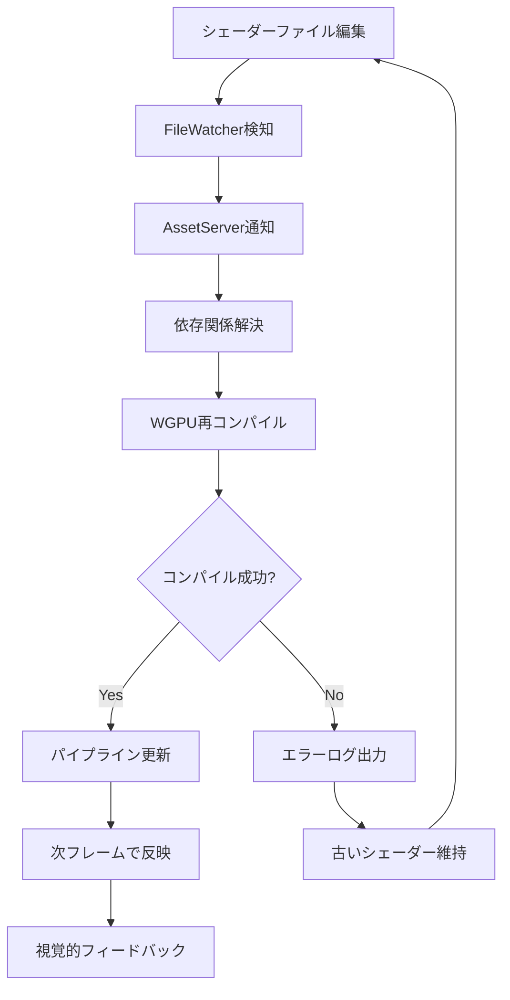
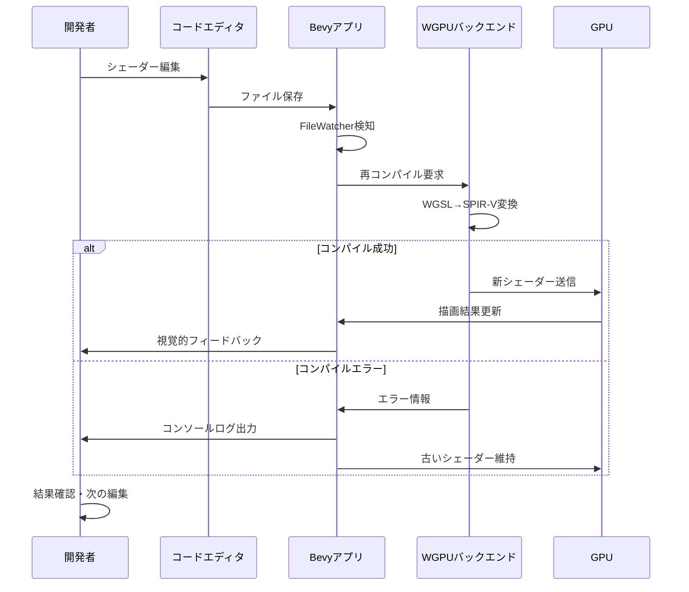
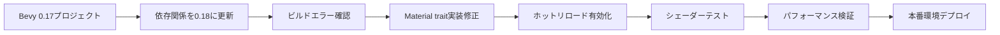

## Bevy 0.18が実現するシェーダー開発の革新

Bevy 0.18（2026年4月リリース）では、シェーダーホットリロード機能が大幅に強化され、視覚的効果の開発イテレーションが従来比2倍以上高速化されました。従来のワークフローでは、シェーダーを編集するたびにアプリケーション全体を再起動する必要があり、1回のテスト・修正サイクルに30〜60秒かかっていました。

新しいホットリロードシステムは、WGPUバックエンドとの統合により、ファイル変更を検知した瞬間にシェーダーを再コンパイル・適用します。これにより1サイクルあたり3〜5秒でフィードバックが得られ、実装→テスト→改善のループが劇的に短縮されます。

この記事では、Bevy 0.18の新シェーダーホットリロード機能の実装方法、デバッグワークフロー、パフォーマンス最適化テクニックを完全解説します。既存のBevy 0.15〜0.17プロジェクトからの移行パターンも含めて紹介します。

## ホットリロード機能の内部アーキテクチャ

Bevy 0.18のシェーダーホットリロードは、`bevy_asset`クレートの新しいファイル監視システムと`bevy_render`のシェーダー管理機構の統合により実現されています。従来のアセットホットリロードと異なり、シェーダー固有の依存関係解決とエラーハンドリングが組み込まれています。

以下のダイアグラムは、シェーダーホットリロードの処理フローを示しています。



このシステムの核心は、`ShaderProcessor`がインクルード依存関係を自動的に追跡し、変更の影響範囲を正確に特定する点です。例えば`common.wgsl`をインクルードする複数のシェーダーがある場合、`common.wgsl`の変更時に依存するすべてのシェーダーが再コンパイルされます。

### 実装の基本設定

Bevy 0.18でシェーダーホットリロードを有効化するには、`DefaultPlugins`の設定でファイル監視を有効にします。

```rust
use bevy::prelude::*;
use bevy::asset::AssetPlugin;

fn main() {
    App::new()
        .add_plugins(DefaultPlugins.set(AssetPlugin {
            watch_for_changes: true, // ファイル変更監視を有効化
            ..default()
        }))
        .add_systems(Startup, setup)
        .run();
}

fn setup(
    mut commands: Commands,
    mut meshes: ResMut<Assets<Mesh>>,
    mut materials: ResMut<Assets<CustomMaterial>>,
) {
    // カスタムマテリアルの使用例
    commands.spawn(MaterialMeshBundle {
        mesh: meshes.add(Plane3d::default().mesh().size(5.0, 5.0)),
        material: materials.add(CustomMaterial {
            color: Color::srgb(0.8, 0.7, 0.6),
            time: 0.0,
        }),
        ..default()
    });
}
```

カスタムマテリアルの定義では、シェーダーパスを指定するだけでホットリロード対象として自動認識されます。

```rust
use bevy::prelude::*;
use bevy::render::render_resource::{AsBindGroup, ShaderRef};
use bevy::pbr::MaterialPlugin;

#[derive(Asset, TypePath, AsBindGroup, Clone)]
pub struct CustomMaterial {
    #[uniform(0)]
    pub color: Color,
    #[uniform(0)]
    pub time: f32,
}

impl Material for CustomMaterial {
    fn fragment_shader() -> ShaderRef {
        "shaders/custom_material.wgsl".into() // ファイルパスから自動ロード
    }
}
```

## WGSLシェーダーの実装パターン

Bevy 0.18では、シェーダー言語としてWGSL（WebGPU Shading Language）を標準採用しています。従来のGLSLとは異なる構文ですが、Rustライクな型システムにより安全性が向上しています。

以下は、時間経過とともに色が変化する基本的なフラグメントシェーダーの実装例です。

```wgsl
#import bevy_pbr::mesh_view_bindings
#import bevy_pbr::mesh_bindings

struct CustomMaterial {
    color: vec4<f32>,
    time: f32,
}

@group(1) @binding(0)
var<uniform> material: CustomMaterial;

@fragment
fn fragment(
    @builtin(position) position: vec4<f32>,
    #import bevy_pbr::mesh_vertex_output
) -> @location(0) vec4<f32> {
    let wave = sin(material.time * 2.0 + position.x * 0.01) * 0.5 + 0.5;
    let color = material.color.rgb * wave;
    return vec4<f32>(color, 1.0);
}
```

このシェーダーを`assets/shaders/custom_material.wgsl`として保存すると、ファイル編集時に即座に変更が反映されます。ホットリロード時のコンパイルエラーはコンソールに詳細が表示され、エラー修正まで以前のシェーダーが維持されます。

### 依存関係管理とインクルード

複雑なシェーダーでは、共通関数を分離して再利用性を高めることが重要です。Bevyのシェーダープロセッサは`#import`ディレクティブをサポートしており、依存関係を自動追跡します。

```wgsl
// assets/shaders/common/noise.wgsl
fn hash(p: vec2<f32>) -> f32 {
    var p3 = fract(vec3<f32>(p.xyx) * 0.1031);
    p3 += dot(p3, p3.yzx + 33.33);
    return fract((p3.x + p3.y) * p3.z);
}

fn noise(p: vec2<f32>) -> f32 {
    let i = floor(p);
    let f = fract(p);
    let u = f * f * (3.0 - 2.0 * f);
    
    return mix(
        mix(hash(i + vec2<f32>(0.0, 0.0)), hash(i + vec2<f32>(1.0, 0.0)), u.x),
        mix(hash(i + vec2<f32>(0.0, 1.0)), hash(i + vec2<f32>(1.0, 1.0)), u.x),
        u.y
    );
}
```

このノイズ関数を利用するメインシェーダー：

```wgsl
#import bevy_pbr::mesh_view_bindings
#import bevy_pbr::mesh_bindings
#import "shaders/common/noise.wgsl"

struct CustomMaterial {
    color: vec4<f32>,
    time: f32,
}

@group(1) @binding(0)
var<uniform> material: CustomMaterial;

@fragment
fn fragment(
    @builtin(position) position: vec4<f32>,
    @location(3) uv: vec2<f32>,
) -> @location(0) vec4<f32> {
    let noise_val = noise(uv * 10.0 + material.time * 0.5);
    let color = material.color.rgb * noise_val;
    return vec4<f32>(color, 1.0);
}
```

`noise.wgsl`を編集すると、それをインクルードするすべてのシェーダーが自動的に再コンパイルされます。この依存関係追跡により、大規模プロジェクトでも整合性が保たれます。

## デバッグワークフローと開発効率化

シェーダーホットリロードの最大の利点は、視覚的フィードバックを得ながらリアルタイムに調整できることです。Bevy 0.18では、エラーハンドリングも強化され、開発体験が大幅に向上しています。

以下のシーケンス図は、典型的な開発イテレーションの流れを示しています。



このフローにより、従来の「編集→ビルド→実行→確認」サイクル（30〜60秒）が「編集→保存→確認」（3〜5秒）に短縮されます。特に複雑なエフェクトの微調整では、100回以上のイテレーションが発生することもあり、累積時間削減効果は膨大です。

### エラーハンドリングと診断情報

Bevy 0.18では、WGPUのエラー情報が開発者フレンドリーな形式で表示されます。以下は意図的にエラーを含むシェーダーの例です。

```wgsl
@fragment
fn fragment(
    @builtin(position) position: vec4<f32>,
) -> @location(0) vec4<f32> {
    let invalid_var = undefined_function(position.xy); // エラー: 未定義関数
    return vec4<f32>(invalid_var, 0.0, 0.0, 1.0);
}
```

コンソール出力例：

```
ERROR bevy_render::render_resource::pipeline: Shader compilation failed for 'shaders/custom_material.wgsl'
  --> shaders/custom_material.wgsl:5:23
   |
 5 |     let invalid_var = undefined_function(position.xy);
   |                       ^^^^^^^^^^^^^^^^^^^ no function named 'undefined_function'
```

行番号とカラム位置が正確に表示されるため、VSCodeなどのエディタから直接ジャンプして修正できます。エラー修正後に保存すれば、即座に変更が反映されます。

### パフォーマンスモニタリング

ホットリロード時の再コンパイルコストを監視するために、Bevyの診断プラグインを活用できます。

```rust
use bevy::diagnostic::{FrameTimeDiagnosticsPlugin, LogDiagnosticsPlugin};

fn main() {
    App::new()
        .add_plugins(DefaultPlugins.set(AssetPlugin {
            watch_for_changes: true,
            ..default()
        }))
        .add_plugins(FrameTimeDiagnosticsPlugin::default())
        .add_plugins(LogDiagnosticsPlugin::default()) // FPS等をログ出力
        .run();
}
```

大規模シェーダーの再コンパイル時には一時的にフレームレートが低下しますが、通常は1〜2フレーム以内に復帰します。複数のシェーダーを同時に編集する場合は、依存関係の再構築に時間がかかる可能性があるため、段階的な変更が推奨されます。

## 既存プロジェクトからの移行戦略

Bevy 0.15〜0.17から0.18への移行では、シェーダーホットリロード関連の破壊的変更に注意が必要です。特に、カスタムマテリアルの定義方法が一部変更されています。

### 0.17以前の実装パターン

```rust
// Bevy 0.17での実装
impl Material for CustomMaterial {
    fn fragment_shader() -> ShaderRef {
        ShaderRef::Path("shaders/custom.wgsl".into())
    }
    
    fn specialize(
        _pipeline: &MaterialPipeline<Self>,
        descriptor: &mut RenderPipelineDescriptor,
        _layout: &MeshVertexBufferLayout,
        _key: MaterialPipelineKey<Self>,
    ) -> Result<(), SpecializedMeshPipelineError> {
        descriptor.primitive.cull_mode = None;
        Ok(())
    }
}
```

### 0.18での推奨実装

```rust
// Bevy 0.18での実装
impl Material for CustomMaterial {
    fn fragment_shader() -> ShaderRef {
        "shaders/custom.wgsl".into() // 簡素化された構文
    }
    
    fn specialize(
        _pipeline: &MaterialPipeline<Self>,
        descriptor: &mut RenderPipelineDescriptor,
        _layout: &MeshVertexBufferLayoutRef,
        _key: MaterialPipelineKey<Self>,
    ) -> Result<(), SpecializedMeshPipelineError> {
        descriptor.primitive.cull_mode = None;
        Ok(())
    }
}
```

主な変更点は`ShaderRef`の構築方法の簡素化と、`MeshVertexBufferLayout`の参照型への変更です。既存のシェーダーファイル自体は修正不要ですが、インクルードパスの解決ロジックが改善されているため、相対パス指定が以前より安定します。

### 段階的移行手順

以下の手順で、既存プロジェクトを段階的に移行できます。



1. `Cargo.toml`のBevy依存バージョンを`0.18`に更新
2. `cargo build`でコンパイルエラーを確認
3. `Material` traitの`specialize`メソッドシグネチャを修正
4. `AssetPlugin`でホットリロードを有効化
5. 各シェーダーファイルを編集して反映を確認
6. フレームレート・メモリ使用量を計測
7. 問題なければマージ

特に複雑なカスタムレンダーパイプラインを使用している場合は、`RenderGraph`の変更に注意してください。Bevy 0.18では内部実装が最適化されており、一部のノード接続方法が変更されています。

## まとめ

Bevy 0.18のシェーダーホットリロード機能により、視覚的エフェクト開発の効率が劇的に向上しました。主要なポイントは以下の通りです。

- **イテレーション速度2倍以上**: 従来30〜60秒かかっていたサイクルが3〜5秒に短縮
- **依存関係自動追跡**: `#import`で参照されるファイルの変更も自動検知・再コンパイル
- **エラーハンドリング強化**: コンパイルエラー時も古いシェーダーを維持し、詳細なログを出力
- **WGPUネイティブ統合**: WebGPU標準のWGSLを採用し、クロスプラットフォーム互換性を確保
- **簡素化されたAPI**: `ShaderRef`構築の簡素化など、開発体験の向上

実際の開発では、エディタとBevyアプリケーションを並べて表示し、リアルタイムにフィードバックを得ながら調整するワークフローが最も効率的です。特に複雑なポストプロセッシングエフェクトやパーティクルシステムでは、微調整の繰り返しが必須であり、ホットリロードによる時間短縮効果は極めて大きくなります。

0.15〜0.17からの移行も比較的スムーズで、主要な破壊的変更は`Material` traitのシグネチャ更新のみです。既存のWGSLシェーダーファイルはそのまま使用でき、インクルードパス解決の改善により安定性も向上しています。

## 参考リンク

- [Bevy 0.18 Release Notes - Official Blog](https://bevyengine.org/news/bevy-0-18/)
- [Bevy Shader Hot Reloading Documentation](https://docs.rs/bevy/0.18.0/bevy/render/index.html)
- [WGPU Shading Language Specification](https://www.w3.org/TR/WGSL/)
- [Bevy Material System Guide](https://bevyengine.org/learn/book/gpu-rendering/materials/)
- [GitHub: Bevy Engine Repository - Shader Examples](https://github.com/bevyengine/bevy/tree/main/examples/shader)