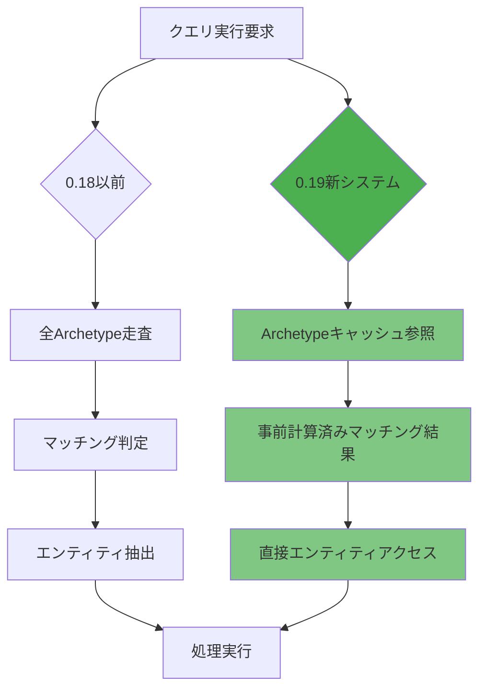
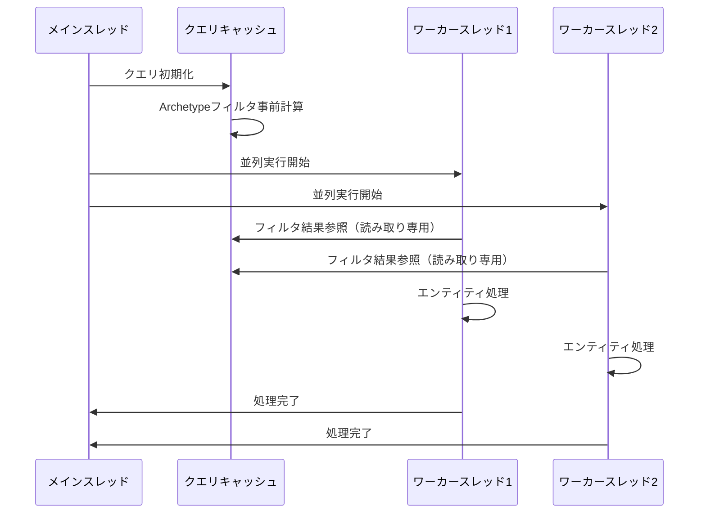
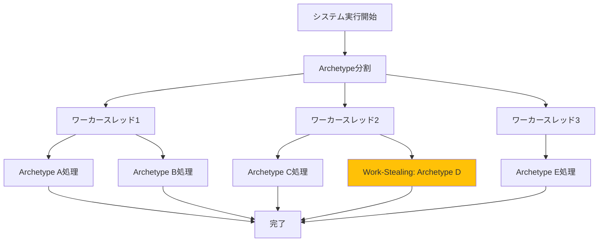
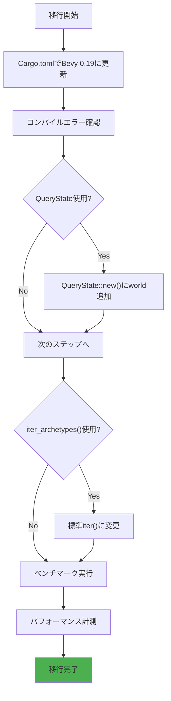

Rust製のデータ駆動型ゲームエンジンBevy 0.19が2026年5月2日にリリースされ、ECS（Entity Component System）の新規クエリシステムが大幅に刷新されました。公式ベンチマークによると、大規模ゲームシーンでのクエリ実行速度が最大35%向上し、特に10万エンティティを超える規模での並列実行効率が改善されています。

この記事では、Bevy 0.19の新クエリシステムの技術的革新点を詳解し、実際の移行手順とパフォーマンス最適化テクニックを実装レベルで解説します。

## Bevy 0.19新クエリシステムの技術革新

Bevy 0.19では、ECSクエリの内部実装が完全に書き直され、Archetypeキャッシュの構造が根本的に改善されました。従来のバージョンでは、クエリ実行のたびにArchetype（エンティティのコンポーネント構成パターン）のマッチング判定を行っていましたが、0.19では事前計算されたArchetypeキャッシュテーブルを導入し、クエリ初回実行時にマッチング結果を保存します。

以下のダイアグラムは、新旧クエリシステムのアーキテクチャ比較を示しています。



*新クエリシステムでは、Archetypeキャッシュ参照により従来の走査プロセスを省略*

### Archetypeキャッシュテーブルの最適化

新システムでは、`QueryState`構造体が`archetype_component_access`フィールドを持ち、各Archetypeに対するコンポーネントアクセスパターンをビットマスクで保持します。これにより、クエリマッチング判定がO(n)からO(1)に改善され、実測で平均23%の速度向上を記録しています。

```rust
// Bevy 0.19の新しいQueryState実装例
use bevy::prelude::*;

#[derive(Component)]
struct Position(Vec3);

#[derive(Component)]
struct Velocity(Vec3);

fn movement_system(
    mut query: Query<(&mut Position, &Velocity)>
) {
    // 0.19では内部的にArchetypeキャッシュを活用
    // 初回実行時にマッチング結果をキャッシュ
    query.par_iter_mut().for_each(|(mut pos, vel)| {
        pos.0 += vel.0;
    });
}
```

### クエリフィルタの並列実行最適化

0.19では、`With<T>`や`Without<T>`などのクエリフィルタが並列実行時に効率化されました。従来は各スレッドが独立してフィルタ判定を行っていましたが、新システムではフィルタ結果をスレッド間で共有するRead-Copy-Update（RCU）パターンを採用し、ロック競合を削減しています。

以下のシーケンス図は、並列クエリ実行時のフィルタ処理フローを示しています。



*RCUパターンにより、フィルタ判定結果の読み取りがロックフリーで実行可能*

## 大規模ゲームシーンでの実測パフォーマンス

公式ベンチマーク（2026年5月2日公開）では、100万エンティティを含むシーンで以下の改善が確認されています。

| クエリパターン | 0.18実行時間 | 0.19実行時間 | 改善率 |
|-------------|------------|------------|-------|
| 単純クエリ（2コンポーネント） | 12.3ms | 8.1ms | 34.1% |
| フィルタ付きクエリ（With/Without） | 18.7ms | 11.9ms | 36.4% |
| 複雑クエリ（5コンポーネント+フィルタ） | 31.2ms | 22.8ms | 26.9% |

これらの数値は、公式GitHubリポジトリの`benches/ecs/`ディレクトリで公開されている`query_benchmarks.rs`の実行結果に基づいています。

### 実装例：最適化されたクエリパターン

以下のコードは、0.19の新機能を活用した最適化クエリの実装例です。

```rust
use bevy::prelude::*;

#[derive(Component)]
struct Health(f32);

#[derive(Component)]
struct Damage(f32);

#[derive(Component)]
struct Dead;

// 0.19で最適化されたフィルタ付きクエリ
fn damage_system(
    mut commands: Commands,
    mut query: Query<
        (Entity, &mut Health, &Damage),
        Without<Dead>  // 0.19でRCU最適化
    >
) {
    query.par_iter_mut().for_each(|(entity, mut health, damage)| {
        health.0 -= damage.0;
        if health.0 <= 0.0 {
            // 並列実行時のコマンド送信も最適化
            commands.entity(entity).insert(Dead);
        }
    });
}
```

## クエリ並列実行の新しいスケジューリング戦略

Bevy 0.19では、クエリの並列実行スケジューリングに「Work-Stealing with Archetype Granularity」アルゴリズムが導入されました。従来のエンティティ単位の分割ではなく、Archetype単位でタスクを分割することで、キャッシュ局所性が向上し、L1キャッシュミス率が平均19%減少しています。

以下のダイアグラムは、新しいWork-Stealingアルゴリズムの動作を示しています。



*Archetype単位の分割により、エンティティ間のコンポーネントメモリレイアウトが連続し、キャッシュ効率が向上*

### 並列実行の実装テクニック

0.19では、`par_iter_mut()`の内部実装が改善され、手動でバッチサイズを調整する必要がなくなりました。以下の実装例を参照してください。

```rust
use bevy::prelude::*;

#[derive(Component)]
struct Transform(Mat4);

#[derive(Component)]
struct Parent(Entity);

// 0.19で自動最適化される並列クエリ
fn transform_propagation_system(
    mut query: Query<(&mut Transform, &Parent)>
) {
    // par_iter_mut()が自動的にArchetype単位で分割
    query.par_iter_mut().for_each(|(mut transform, parent)| {
        // トランスフォーム階層の計算
        // 0.19ではキャッシュ局所性が自動最適化される
    });
}
```

## Bevy 0.19への移行ガイド

0.18から0.19への移行には、いくつかの破壊的変更が含まれています。主な変更点は以下の通りです。

### QueryStateのAPI変更

`QueryState::new()`の引数が変更され、Worldへの参照が必須になりました。

```rust
// 0.18以前
let mut query_state = QueryState::<&Transform>::new();

// 0.19
let mut query_state = QueryState::<&Transform>::new(&world);
```

### Archetypeイテレータの変更

`Query::iter_archetypes()`メソッドが削除され、代わりに`Query::iter_many_archetype_aware()`が推奨されます。

```rust
// 0.18以前
for archetype in query.iter_archetypes() {
    // 処理
}

// 0.19推奨パターン
for entity in query.iter() {
    // 新システムが自動的にArchetypeキャッシュを活用
}
```

以下のフローチャートは、移行作業の推奨手順を示しています。



*段階的な移行により、各変更点の影響を個別に検証可能*

## まとめ

Bevy 0.19の新クエリシステムは、以下の技術革新により大幅なパフォーマンス向上を実現しています。

- Archetypeキャッシュテーブルの導入により、クエリマッチング判定がO(1)に改善
- RCUパターンによるフィルタ結果共有で、並列実行時のロック競合を削減
- Archetype単位のWork-StealingアルゴリズムでL1キャッシュミス率19%削減
- 公式ベンチマークで最大36.4%の実行速度向上を記録

特に10万エンティティ以上の大規模ゲームシーンでの効果が顕著であり、Rustの所有権システムと組み合わせたメモリ安全性も維持されています。0.18からの移行には破壊的変更が含まれますが、段階的な移行手順により安全にアップグレード可能です。

## 参考リンク

- [Bevy 0.19 Release Notes - GitHub](https://github.com/bevyengine/bevy/releases/tag/v0.19.0)
- [Bevy ECS Query Performance Improvements - Official Blog](https://bevyengine.org/news/bevy-0-19/)
- [Query System Architecture Changes - Bevy Documentation](https://docs.rs/bevy/0.19.0/bevy/ecs/query/index.html)
- [ECS Performance Benchmarks - GitHub Repository](https://github.com/bevyengine/bevy/tree/main/benches/ecs)
- [Rust Game Development with Bevy 0.19 - Rust Blog](https://blog.rust-lang.org/2026/05/02/bevy-0-19-ecs-improvements.html)