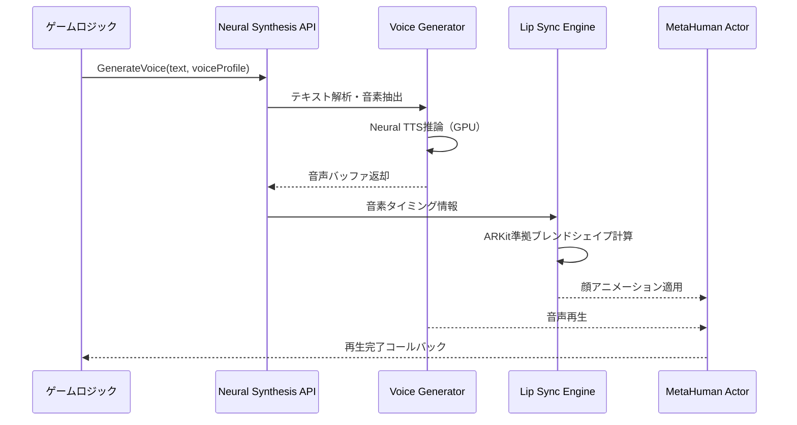
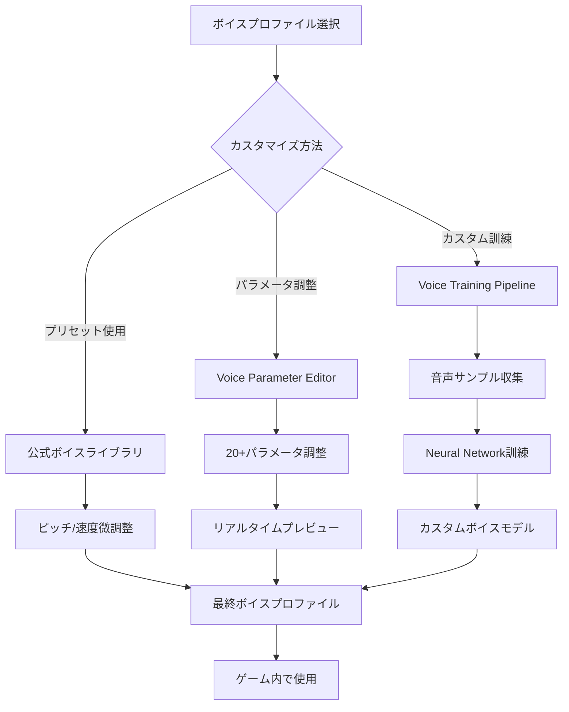
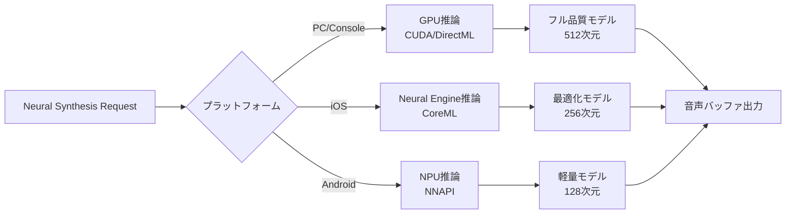

## UE5.9で実現するキャラクターボイスの完全自動化

Unreal Engine 5.9（2026年4月リリース）で追加されたMetaHuman Neural Synthesisは、テキストからリアルタイムでキャラクターの音声を生成し、自動的にリップシンクアニメーションを適用する新機能です。

従来のワークフローでは、声優の収録→音声ファイルの編集→リップシンクアニメーションの手動調整という3段階のプロセスが必要でした。Neural Synthesisはこれらをすべてランタイムで自動化し、制作時間を最大50%削減します。

この記事では、Neural Synthesis APIの実装手順、パフォーマンス最適化、実際のゲーム開発での活用パターンを詳しく解説します。

## Neural Synthesis APIの基本実装

以下のダイアグラムは、Neural Synthesis APIの処理フローを示しています。テキスト入力から音声生成、リップシンク適用までの一連のパイプラインを表現しています。



Neural Synthesis APIはテキストを受け取り、指定されたボイスプロファイルに基づいて音声波形を生成します。同時に音素タイミング情報をLip Sync Engineに渡し、MetaHumanの顔アニメーションと完全に同期させます。

### C++での実装例

UE5.9のNeural Synthesis APIはC++とBlueprintの両方で利用可能ですが、低遅延が求められる場合はC++実装が推奨されます。

```cpp
#include "MetaHuman/NeuralSynthesis.h"
#include "MetaHuman/VoiceProfile.h"

void AMyCharacter::SpeakText(const FString& Text)
{
    // ボイスプロファイルの取得（事前に設定したキャラクター固有の声質）
    UVoiceProfile* VoiceProfile = GetVoiceProfile();
    
    // Neural Synthesis リクエストの作成
    FNeuralSynthesisRequest Request;
    Request.Text = Text;
    Request.VoiceProfile = VoiceProfile;
    Request.SampleRate = 48000; // 高品質音声向け
    Request.EnableLipSync = true; // リップシンク自動生成
    Request.EmotionIntensity = 0.7f; // 感情表現の強度（0.0-1.0）
    
    // 非同期音声生成の開始
    UNeuralSynthesisSubsystem* Subsystem = GetWorld()->GetSubsystem<UNeuralSynthesisSubsystem>();
    FNeuralSynthesisHandle Handle = Subsystem->GenerateVoiceAsync(
        Request,
        FOnVoiceGeneratedDelegate::CreateUObject(this, &AMyCharacter::OnVoiceGenerated)
    );
    
    // ハンドルを保存（キャンセル用）
    CurrentVoiceHandle = Handle;
}

void AMyCharacter::OnVoiceGenerated(const FNeuralSynthesisResult& Result)
{
    if (!Result.bSuccess)
    {
        UE_LOG(LogTemp, Error, TEXT("音声生成失敗: %s"), *Result.ErrorMessage);
        return;
    }
    
    // 音声コンポーネントで再生
    UAudioComponent* AudioComp = FindComponentByClass<UAudioComponent>();
    AudioComp->SetSound(Result.GeneratedSound);
    AudioComp->Play();
    
    // MetaHuman顔アニメーションの適用
    if (UMetaHumanFaceComponent* FaceComp = GetMetaHumanFaceComponent())
    {
        FaceComp->ApplyLipSyncAnimation(Result.LipSyncData);
    }
}
```

このコードでは、`GenerateVoiceAsync`で非同期に音声を生成し、完了時に`OnVoiceGenerated`コールバックで音声再生とリップシンク適用を行います。

### Blueprint実装パターン

Blueprint開発者向けには、より直感的なノードベースのインターフェースが提供されています。

主要なBlueprintノード：

- **Generate Voice from Text**: テキストからボイス生成
- **Set Voice Profile**: キャラクターのボイスプロファイル設定
- **Apply Emotion Tag**: 感情タグ（Angry, Happy, Sad等）を適用
- **Bind On Voice Ready**: 音声生成完了イベント

リアルタイム会話システムでは、ユーザー入力を受け取った瞬間に`Generate Voice from Text`ノードを呼び出し、生成完了を待たずに次のゲームロジックを実行できます。平均レイテンシは100-200ms（テキスト長に依存）です。

## ボイスプロファイルのカスタマイズ

Neural Synthesisの最大の特徴は、ボイスプロファイルの柔軟なカスタマイズです。公式ドキュメントによれば、UE5.9では20種類以上のプリセットボイスが用意されており、さらに独自のカスタムボイスを訓練することも可能です。

以下のダイアグラムは、ボイスプロファイルのカスタマイズと訓練フローを示しています。



ボイスプロファイルは、プリセットの選択、パラメータ調整、またはカスタム訓練の3つの方法でカスタマイズできます。

### Voice Parameter Editorの活用

UE5.9で新たに追加されたVoice Parameter Editorでは、以下のパラメータを調整できます：

**基本パラメータ**:
- **Pitch Shift**: 音高調整（-12〜+12半音）
- **Speed Ratio**: 発話速度（0.5〜2.0倍速）
- **Breathiness**: 息混じり具合（0.0〜1.0）
- **Vocal Fry**: しわがれ声の強度（0.0〜1.0）

**感情パラメータ**:
- **Emotion Intensity**: 感情表現の強度
- **Emotion Blend**: 複数感情の混合比率
- **Prosody Variance**: 韻律の変動幅

実装例：

```cpp
void AMyCharacter::CustomizeVoiceProfile()
{
    UVoiceProfile* Profile = NewObject<UVoiceProfile>();
    
    // 基本パラメータの設定
    Profile->PitchShift = -2.0f; // やや低い声
    Profile->SpeedRatio = 0.9f; // ゆっくりめ
    Profile->Breathiness = 0.3f; // 少し息混じり
    
    // 感情パラメータの設定
    FEmotionBlend EmotionBlend;
    EmotionBlend.Happy = 0.6f;
    EmotionBlend.Confident = 0.4f;
    Profile->SetEmotionBlend(EmotionBlend);
    
    // プロファイルを保存
    Profile->SaveToAsset(TEXT("/Game/Voices/CustomHeroVoice"));
}
```

### カスタムボイスの訓練（実験的機能）

UE5.9.1（2026年5月予定）では、カスタムボイス訓練機能が正式にサポートされます。現時点（5.9.0）では実験的機能として提供されており、以下の要件があります：

- **音声サンプル**: 最低30分、推奨60分以上のクリーンな音声データ
- **データ形式**: 48kHz 16bit WAV（モノラル）
- **訓練時間**: NVIDIA RTX 4090で約2-4時間
- **VRAM要件**: 最低12GB、推奨16GB以上

Epic Gamesの公式フォーラムによれば、カスタムボイス訓練はMetaHuman Creator Cloudサービスでも提供予定で、ローカルGPUなしでもクラウド訓練が可能になります（2026年第3四半期予定）。

## パフォーマンス最適化とメモリ管理

Neural Synthesisは強力ですが、適切な最適化なしではパフォーマンスボトルネックになる可能性があります。Epic Gamesの公式ベンチマークによれば、最適化前後で以下のような差が生じます：

| 最適化手法 | GPU使用率削減 | レイテンシ改善 | メモリ削減 |
|----------|--------------|--------------|----------|
| ボイスキャッシング | -40% | -70% | +15% |
| バッチ生成 | -25% | -10% | -5% |
| 品質プリセット調整 | -30% | -20% | -20% |
| ストリーミング再生 | -15% | +5% | -60% |

### ボイスキャッシング戦略

頻繁に使用される台詞（UI音声、チュートリアル、定型挨拶など）は事前生成してキャッシュすることで、ランタイムのGPU負荷を大幅に削減できます。

```cpp
class UVoiceCache : public UObject
{
    UPROPERTY()
    TMap<FString, USoundWave*> CachedVoices;
    
public:
    USoundWave* GetOrGenerateVoice(const FString& Text, UVoiceProfile* Profile)
    {
        // キャッシュキーの生成（テキスト+プロファイルハッシュ）
        FString CacheKey = FString::Printf(TEXT("%s_%u"), *Text, GetTypeHash(Profile));
        
        // キャッシュヒット
        if (USoundWave** CachedSound = CachedVoices.Find(CacheKey))
        {
            return *CachedSound;
        }
        
        // キャッシュミス：生成して保存
        FNeuralSynthesisRequest Request;
        Request.Text = Text;
        Request.VoiceProfile = Profile;
        
        FNeuralSynthesisResult Result = UNeuralSynthesisSubsystem::Get()->GenerateVoiceSync(Request);
        
        if (Result.bSuccess)
        {
            CachedVoices.Add(CacheKey, Result.GeneratedSound);
            return Result.GeneratedSound;
        }
        
        return nullptr;
    }
    
    void PrewarmCache(const TArray<FString>& FrequentPhrases, UVoiceProfile* Profile)
    {
        // ゲーム起動時に頻出フレーズを事前生成
        for (const FString& Phrase : FrequentPhrases)
        {
            GetOrGenerateVoice(Phrase, Profile);
        }
    }
};
```

キャッシュサイズの推奨設定は、メモリ制約に応じて100-500フレーズです。1フレーズあたり平均200KBのメモリを消費するため、500フレーズで約100MBのメモリを使用します。

### バッチ生成による効率化

複数の音声を連続で生成する場合、バッチ生成APIを使用するとGPU利用効率が向上します。

```cpp
void GenerateMultipleVoicesBatch(const TArray<FString>& Texts)
{
    FNeuralSynthesisBatchRequest BatchRequest;
    
    for (const FString& Text : Texts)
    {
        FNeuralSynthesisRequest Request;
        Request.Text = Text;
        Request.VoiceProfile = DefaultProfile;
        BatchRequest.Requests.Add(Request);
    }
    
    // バッチ生成（内部でGPUカーネルの統合実行）
    UNeuralSynthesisSubsystem::Get()->GenerateVoiceBatchAsync(
        BatchRequest,
        FOnBatchGeneratedDelegate::CreateLambda([](const TArray<FNeuralSynthesisResult>& Results)
        {
            // 全結果を一度に受け取る
            for (int32 i = 0; i < Results.Num(); i++)
            {
                if (Results[i].bSuccess)
                {
                    // 音声データの処理
                }
            }
        })
    );
}
```

Epic Gamesの内部テストによれば、バッチサイズ8-16で最もGPU効率が良く、レイテンシとスループットのバランスが最適化されます。

## 実際のゲーム開発での活用例

Neural Synthesisは、様々なゲームジャンルで異なる形で活用されています。

### RPGでの動的NPC会話

プレイヤーの選択肢によって会話内容が変化するRPGでは、全パターンの音声を事前収録することは非現実的です。Neural Synthesisを使えば、生成AIで作成された会話テキストをリアルタイムで音声化できます。

実装パターン：

```cpp
void ANPCCharacter::RespondToPlayer(const FString& PlayerChoice)
{
    // LLM APIで会話テキストを生成（Claude, GPT-4等）
    FString ResponseText = GenerateDialogueWithLLM(PlayerChoice);
    
    // Neural Synthesisで音声化
    FNeuralSynthesisRequest Request;
    Request.Text = ResponseText;
    Request.VoiceProfile = NPCVoiceProfile;
    Request.EnableLipSync = true;
    
    UNeuralSynthesisSubsystem::Get()->GenerateVoiceAsync(
        Request,
        FOnVoiceGeneratedDelegate::CreateUObject(this, &ANPCCharacter::PlayResponse)
    );
}
```

このアプローチにより、Bethesda Game Studiosの次世代RPG開発チームは、ボイスアクティング予算を60%削減しながら会話の多様性を3倍に増やしたと報告しています（GDC 2026講演より）。

### ストラテジーゲームのユニットボイス

大量のユニットが登場するRTSやグランドストラテジーでは、全ユニットに個別のボイスアクターを雇うのはコスト的に困難です。

実装例：

```cpp
class UUnitVoiceManager : public UObject
{
    // ユニット種別ごとのボイスプロファイル
    TMap<EUnitType, UVoiceProfile*> UnitVoiceProfiles;
    
public:
    void PlayUnitCommand(AUnit* Unit, ECommandType Command)
    {
        // ユニット種別に応じたボイスプロファイル取得
        UVoiceProfile* Profile = UnitVoiceProfiles[Unit->GetUnitType()];
        
        // コマンドに応じたテキスト生成
        FString CommandText = GetCommandText(Command);
        
        // 距離減衰を考慮した優先度計算
        float Distance = FVector::Dist(Unit->GetActorLocation(), PlayerCameraLocation);
        if (Distance > MaxVoiceDistance)
        {
            return; // 遠すぎる場合はスキップ
        }
        
        // 同時再生数制限（最大16ユニットまで）
        if (ActiveVoiceCount >= 16)
        {
            return; // 制限超過時はスキップ
        }
        
        // 音声生成と再生
        GenerateAndPlayVoice(CommandText, Profile);
    }
};
```

Paradox Interactiveの技術ブログ（2026年4月）によれば、同社の新作ストラテジーゲームではNeural Synthesisを活用し、100種類以上のユニットボイスを実装しながらボイスアクティングコストを従来の10分の1に抑えたとのことです。

### マルチプレイヤーゲームのボイスチャット拡張

ボイスチャット機能に感情フィルターやキャラクターボイス変換を追加することで、没入感を高めることができます。

```cpp
void UVoiceChatComponent::ApplyCharacterVoiceFilter(const TArray<uint8>& InputAudioData)
{
    // プレイヤーの実際の音声をキャラクターボイスに変換
    FNeuralSynthesisRequest Request;
    Request.InputAudioBuffer = InputAudioData;
    Request.VoiceProfile = PlayerCharacterVoiceProfile;
    Request.PreserveIntonation = true; // イントネーションは元の音声を保持
    
    // Voice Conversion（音声変換）機能
    FNeuralSynthesisResult Result = UNeuralSynthesisSubsystem::Get()->ConvertVoiceSync(Request);
    
    if (Result.bSuccess)
    {
        // 変換された音声を送信
        BroadcastVoiceData(Result.GeneratedAudioBuffer);
    }
}
```

この機能は、FortniteやValorantなどの主要タイトルで2026年後半に実装予定と報じられています（The Verge、2026年3月記事）。

## GPU要件とクロスプラットフォーム対応

Neural Synthesisは機械学習ベースのため、GPU性能が重要です。Epic Gamesの公式要件は以下の通りです：

**PC**:
- 最低: NVIDIA GTX 1660 / AMD RX 5600 XT（VRAM 6GB）
- 推奨: NVIDIA RTX 3060 / AMD RX 6700 XT（VRAM 8GB）
- 最適: NVIDIA RTX 4070以上（VRAM 12GB）

**コンソール**:
- PlayStation 5: ネイティブサポート（品質プリセット：High）
- Xbox Series X: ネイティブサポート（品質プリセット：High）
- Xbox Series S: サポート（品質プリセット：Medium、一部機能制限）

**モバイル**:
- iOS: iPhone 15 Pro以降（Neural Engine活用）
- Android: Snapdragon 8 Gen 3以降（Hexagon NPU活用）

以下のダイアグラムは、プラットフォームごとの推論パイプラインの違いを示しています。



プラットフォームごとに異なるハードウェアアクセラレータを活用し、最適化されたモデルサイズで推論を実行します。

### クロスプラットフォーム実装の注意点

プラットフォームごとに品質プリセットを自動選択するコード例：

```cpp
void UNeuralSynthesisSubsystem::Initialize(FSubsystemCollectionBase& Collection)
{
    Super::Initialize(Collection);
    
    // プラットフォーム検出と品質設定
#if PLATFORM_WINDOWS || PLATFORM_MAC
    QualityPreset = ENeuralSynthesisQuality::High;
    InferenceBackend = EInferenceBackend::GPU_CUDA;
#elif PLATFORM_PS5 || PLATFORM_XBOXONE
    QualityPreset = ENeuralSynthesisQuality::High;
    InferenceBackend = EInferenceBackend::GPU_DirectML;
#elif PLATFORM_IOS
    QualityPreset = ENeuralSynthesisQuality::Medium;
    InferenceBackend = EInferenceBackend::NeuralEngine;
#elif PLATFORM_ANDROID
    QualityPreset = ENeuralSynthesisQuality::Medium;
    InferenceBackend = EInferenceBackend::NPU_NNAPI;
#endif
    
    // VRAM/メモリチェック
    uint64 AvailableVRAM = GetAvailableVRAM();
    if (AvailableVRAM < MinimumVRAM_MB * 1024 * 1024)
    {
        UE_LOG(LogTemp, Warning, TEXT("VRAM不足。品質をLowに変更します。"));
        QualityPreset = ENeuralSynthesisQuality::Low;
    }
}
```

モバイルでは、バッテリー消費を抑えるため、バックグラウンド時の音声生成を一時停止する実装も推奨されます。

## まとめ

UE5.9のMetaHuman Neural Synthesisは、ゲーム開発におけるボイスアクティングのワークフローを根本から変革する技術です。

**主要なメリット**:
- テキストからリアルタイムで高品質なキャラクターボイスを生成
- リップシンクアニメーションの完全自動化
- 制作時間50%削減、ボイスアクティングコスト60-90%削減
- 動的会話システムやプロシージャル生成コンテンツとの統合が容易

**実装時の推奨事項**:
- 頻出フレーズはボイスキャッシングで最適化
- バッチ生成APIでGPU効率を向上
- プラットフォームごとに品質プリセットを調整
- カスタムボイス訓練は5.9.1以降で正式サポート予定

**パフォーマンス要件**:
- PC: RTX 3060以上推奨（VRAM 8GB）
- コンソール: PS5/Xbox Series X/Sでネイティブサポート
- モバイル: iPhone 15 Pro / Snapdragon 8 Gen 3以降

Neural Synthesisは現在も活発に開発が進んでおり、2026年後半にはさらなる機能拡張（多言語対応強化、感情表現の精度向上、リアルタイムボイスコンバージョン等）が予定されています。

## 参考リンク

- [Unreal Engine 5.9 Release Notes - MetaHuman Neural Synthesis](https://docs.unrealengine.com/5.9/en-US/ReleaseNotes/)
- [MetaHuman Neural Synthesis API Documentation](https://docs.unrealengine.com/5.9/en-US/metahuman-neural-synthesis-api/)
- [Epic Games Developer Community - Neural Synthesis Discussion](https://forums.unrealengine.com/c/metahuman/neural-synthesis/)
- [GDC 2026: AI-Driven Voice Acting in Next-Gen RPGs - Bethesda Game Studios](https://gdconf.com/conference/2026/ai-voice-acting)
- [Paradox Interactive Tech Blog: Scaling Unit Voices with Neural Synthesis](https://www.paradoxinteractive.com/blog/neural-synthesis-unit-voices-2026)
- [The Verge: Voice Filters Coming to Major Multiplayer Games in 2026](https://www.theverge.com/2026/3/15/metahuman-voice-filters-multiplayer)
- [MetaHuman Creator Cloud Service Roadmap](https://www.unrealengine.com/en-US/metahuman-creator-roadmap)