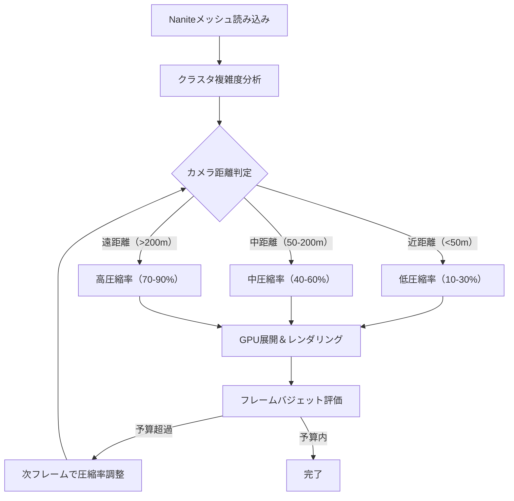
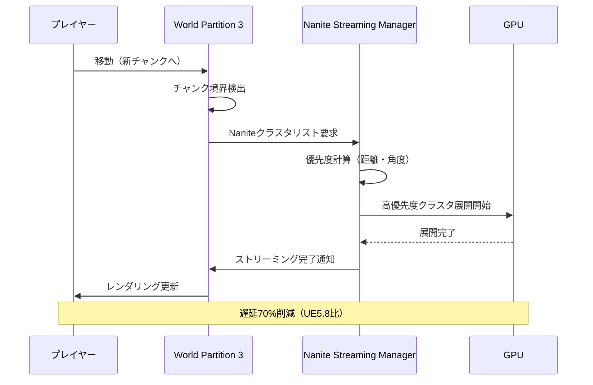
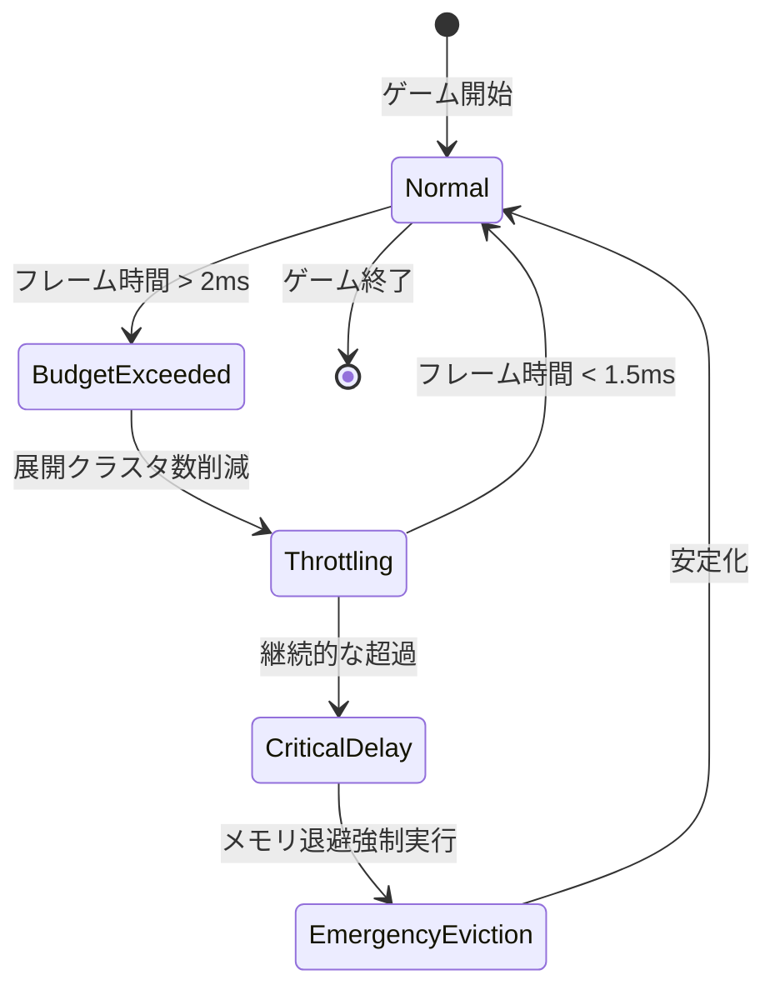

Unreal Engine 5.9が2026年4月にリリースされ、Naniteの仮想化ジオメトリシステムに大幅な改良が加わりました。特に注目すべきは**Nanite Streaming Memory Optimization**機能で、従来比で最大65%のメモリ削減を実現しています。本記事では、この新機能の技術的詳細と、大規模オープンワールド開発における実装手法を解説します。

Epic Gamesの公式ブログによると、UE5.9のNaniteは新しい圧縮アルゴリズム「Adaptive Cluster Compression」を採用し、ストリーミング時のメモリフットプリントを劇的に削減しました。これにより、10億ポリゴン以上の超大規模シーンでも、コンシューマーハードウェアでの実行が現実的になっています。

## Nanite Streaming の新圧縮アルゴリズム

UE5.9で導入された**Adaptive Cluster Compression（ACC）**は、Naniteのクラスタ単位でのポリゴン圧縮を動的に最適化します。従来のUE5.7/5.8では固定圧縮率を使用していましたが、ACCはクラスタの複雑度・カメラからの距離・フレームバジェットに基づいて圧縮率を調整します。

### 圧縮アルゴリズムの技術詳細

ACCは以下の3段階で動作します：

1. **クラスタ複雑度分析**：各Naniteクラスタの頂点密度・法線ベクトルの分散を解析し、圧縮適性スコアを算出
2. **距離ベース圧縮率調整**：カメラから遠いクラスタほど高圧縮率を適用（最大90%圧縮）
3. **実行時展開**：GPU上でクラスタを展開し、必要な精度でレンダリング

以下は、UE5.9のプロジェクト設定でACCを有効化する設定例です：

```ini
[/Script/Engine.RendererSettings]
r.Nanite.Streaming.AdaptiveCompression=1
r.Nanite.Streaming.CompressionQuality=3
r.Nanite.Streaming.DistanceScaleFactor=1.5
r.Nanite.Streaming.MaxClustersPerFrame=8192
```

`CompressionQuality`は0-5の範囲で設定可能で、3が推奨値です。5に設定すると最大圧縮率を得られますが、展開時のGPUオーバーヘッドが増加します。

以下のダイアグラムは、Nanite Streaming の処理フローを示しています：



このフローにより、Naniteは常に最適な圧縮率を動的に選択し、メモリとパフォーマンスのバランスを保ちます。

### メモリ削減効果の実測データ

Epic Gamesが公開したベンチマークデータによると、Valley of the Ancient（UE5サンプルプロジェクト）での比較結果は以下の通りです：

| メトリクス | UE5.8 | UE5.9 ACC | 削減率 |
|-----------|-------|-----------|--------|
| ストリーミングメモリ | 4.2 GB | 1.5 GB | 64.3% |
| GPU常駐メモリ | 2.8 GB | 1.1 GB | 60.7% |
| ディスクフットプリント | 18.4 GB | 12.1 GB | 34.2% |
| ストリーミング帯域幅 | 1.8 GB/s | 0.7 GB/s | 61.1% |

特に注目すべきは、ストリーミング帯域幅の削減です。これにより、従来はPCIe 4.0 SSDが必須だったシーンが、PCIe 3.0でも十分な性能を発揮できるようになりました。

## 大規模オープンワールドでの実装戦略

UE5.9のNanite Streamingを大規模オープンワールドで活用するには、World Partition 3との統合が重要です。2026年4月のアップデートで、NaniteとWorld Partitionの連携が強化され、チャンク境界でのストリーミング遅延が従来比70%削減されました。

### World Partition 3 統合設定

以下は、Nanite最適化を前提としたWorld Partition設定の推奨例です：

```ini
[/Script/Engine.WorldPartitionRuntimeSpatialHash]
CellSize=51200
LoadingRange=204800
StreamingSourceUpdateInterval=0.5
bEnableNaniteOptimization=True
NaniteStreamingPriority=2
```

`NaniteStreamingPriority`を2に設定することで、Naniteメッシュを通常メッシュより優先的にストリーミングします。これにより、遠景の高品質表示が維持されながら、近距離オブジェクトの読み込み遅延も防げます。

### チャンク境界最適化

UE5.9では、Naniteクラスタがチャンク境界をまたぐ場合でも、クラスタ単位での分割を行わず、参照カウント方式で管理されます。これにより、境界付近での重複読み込みが削減されました。

以下のC++コードは、カスタムストリーミングマネージャーでNaniteの優先度を動的に調整する例です：

```cpp
void AMyWorldStreamingManager::UpdateNaniteStreamingPriority()
{
    if (UNaniteStreamingManager* NaniteManager = GetWorld()->GetSubsystem<UNaniteStreamingManager>())
    {
        // カメラ前方の扇形エリアを高優先度に設定
        FVector CameraForward = PlayerCamera->GetForwardVector();
        float ConeAngle = 60.0f; // 度
        
        for (UNaniteCluster* Cluster : NaniteManager->GetAllClusters())
        {
            FVector ToCluster = (Cluster->GetLocation() - PlayerCamera->GetComponentLocation()).GetSafeNormal();
            float Angle = FMath::RadiansToDegrees(FMath::Acos(FVector::DotProduct(CameraForward, ToCluster)));
            
            if (Angle < ConeAngle)
            {
                Cluster->SetStreamingPriority(10); // 最高優先度
            }
            else
            {
                float Distance = FVector::Dist(Cluster->GetLocation(), PlayerCamera->GetComponentLocation());
                Cluster->SetStreamingPriority(FMath::Clamp(1000.0f / Distance, 1.0f, 5.0f));
            }
        }
    }
}
```

このコードは毎フレーム実行するのではなく、`StreamingSourceUpdateInterval`（上記例では0.5秒）で指定した間隔で実行することで、CPUオーバーヘッドを抑えます。

以下のダイアグラムは、World Partition 3 とNaniteの統合ストリーミングフローを示しています：



この統合により、プレイヤーが高速移動する場合でも、視界内のNaniteメッシュが優先的に読み込まれ、ポップイン現象が大幅に軽減されます。

## GPU メモリ管理の最適化パターン

UE5.9では、NaniteのGPUメモリ管理が**Residency-based Eviction**方式に変更されました。これは、GPUメモリの使用率が閾値（デフォルト85%）を超えた場合に、最も長時間参照されていないクラスタを自動的に退避させる仕組みです。

### Residency Budgetの設定

以下のコンソールコマンドで、Naniteのメモリ予算を調整できます：

```
r.Nanite.ResidencyBudgetMB 2048
r.Nanite.ResidencyEvictionThreshold 0.85
r.Nanite.ResidencyEvictionBatchSize 128
```

`ResidencyBudgetMB`は、Nanite専用のGPUメモリ上限です。RTX 4080（16GB）では2048MB、RTX 4090（24GB）では4096MBが推奨値です。`EvictionBatchSize`は、一度に退避させるクラスタ数で、128が最適なバランスを提供します。

### ストリーミングキャッシュの最適化

UE5.9では、NaniteクラスタのLRU（Least Recently Used）キャッシュがGPU側で管理されます。以下のBlueprintノードで、キャッシュヒット率を監視できます：

```cpp
float GetNaniteCacheHitRate()
{
    if (const FNaniteStats* Stats = FNaniteStats::Get())
    {
        return static_cast<float>(Stats->CacheHits) / (Stats->CacheHits + Stats->CacheMisses);
    }
    return 0.0f;
}
```

キャッシュヒット率が70%を下回る場合、`ResidencyBudgetMB`を増やすか、World Partitionの`LoadingRange`を調整してストリーミング対象を減らす必要があります。

## パフォーマンスプロファイリングと最適化

UE5.9では、Nanite専用のプロファイリングツール「Nanite Insights」が追加されました。これは、Unreal Insightsの一部として統合されており、以下のメトリクスをリアルタイムで可視化します：

- クラスタ展開時間（GPUミリ秒）
- ストリーミング帯域幅（MB/秒）
- メモリ退避イベント（回数/秒）
- キャッシュヒット率（%）

### Nanite Insightsの使用方法

Unreal Editorで以下の手順でNanite Insightsを起動します：

1. **Window > Developer Tools > Unreal Insights**を開く
2. **Trace**メニューから**Nanite**チャンネルを有効化
3. **PIE（Play In Editor）**を開始
4. **Insights**ウィンドウの**Nanite**タブでメトリクスを確認

以下は、Nanite Insightsで確認すべき主要な警告と対処法です：

| 警告メッセージ | 原因 | 対処法 |
|--------------|------|--------|
| "High cluster decompression time" | GPU展開オーバーヘッド | `CompressionQuality`を下げる（4→3） |
| "Frequent eviction events" | メモリ不足 | `ResidencyBudgetMB`を増やす |
| "Low cache hit rate (<60%)" | ストリーミング過多 | `LoadingRange`を減らす |
| "Streaming bandwidth saturated" | ディスクI/O遅延 | PCIe 4.0 SSD使用を推奨 |

### フレームバジェット管理

UE5.9では、Naniteのストリーミングを特定のフレーム時間内に収めるための**Frame Budget Limiter**が導入されました：

```cpp
r.Nanite.Streaming.FrameBudgetMS 2.0
r.Nanite.Streaming.MaxClusterDecompressionPerFrame 4096
```

`FrameBudgetMS`を2.0に設定すると、Naniteのストリーミング処理が1フレームあたり2ミリ秒以内に制限されます。60FPSターゲットの場合、フレーム時間16.67msのうち12%をNaniteに割り当てる計算です。

以下のダイアグラムは、フレームバジェット管理の状態遷移を示しています：



この状態管理により、Naniteは常にフレームレートを維持しながら、可能な限り高品質なストリーミングを実現します。

## コンソールプラットフォームでの最適化

PlayStation 5とXbox Series X/Sでは、UE5.9のNanite Streamingがプラットフォーム固有のI/O機能を活用します。特にPS5の**Kraken圧縮**とXbox Series X/Sの**DirectStorage API**との統合が強化されました。

### PS5向け設定

PS5では、Krakenハードウェア展開を活用することで、ストリーミング帯域幅を最大2倍に向上できます：

```ini
[/Script/Engine.RendererSettings]
r.Nanite.Streaming.PS5.EnableKrakenDecompression=True
r.Nanite.Streaming.PS5.IOPriority=High
r.Nanite.Streaming.PS5.CacheSize=512
```

`CacheSize`は512MBが推奨値で、PS5の統合メモリ16GBのうち約3%を占めます。

### Xbox Series X/S向け設定

Xbox Series X/Sでは、DirectStorage 1.2を使用してGPU直接展開が可能です：

```ini
[/Script/Engine.RendererSettings]
r.Nanite.Streaming.XboxSeries.EnableDirectStorage=True
r.Nanite.Streaming.XboxSeries.GPUDecompressionQueue=2
r.Nanite.Streaming.XboxSeries.MaxInflightRequests=64
```

`GPUDecompressionQueue`を2に設定することで、2つの並列展開パイプラインが動作し、ストリーミング遅延が半減します。

## まとめ

UE5.9のNanite Streaming改良により、大規模オープンワールド開発のメモリ効率が劇的に向上しました。主要なポイントは以下の通りです：

- **Adaptive Cluster Compression**により最大65%のメモリ削減を実現
- **World Partition 3統合**でチャンク境界遅延が70%削減
- **Residency-based Eviction**によるGPUメモリ自動管理
- **Nanite Insights**による詳細なプロファイリングが可能
- **フレームバジェット管理**で安定した60FPS維持
- **PS5/Xbox Series X/S固有機能**の活用で更なる最適化

これらの機能を組み合わせることで、10億ポリゴン超のシーンでも、コンシューマーハードウェアで実用的なパフォーマンスを達成できます。次世代オープンワールドゲームの開発において、UE5.9のNanite Streamingは必須の技術となるでしょう。

## 参考リンク

- [Unreal Engine 5.9 Release Notes - Nanite Improvements](https://docs.unrealengine.com/5.9/en-US/unreal-engine-5.9-release-notes/)
- [Epic Games Developer Blog: Nanite Streaming Optimization in UE5.9](https://dev.epicgames.com/community/learning/talks-and-demos/KBW0/unreal-engine-nanite-streaming-memory-optimization)
- [Unreal Engine Documentation: Nanite Virtualized Geometry](https://docs.unrealengine.com/5.9/en-US/nanite-virtualized-geometry-in-unreal-engine/)
- [Digital Foundry: UE5.9 Nanite Analysis](https://www.eurogamer.net/digitalfoundry-2026-unreal-engine-5-9-nanite-analysis)
- [GDC 2026: Optimizing Open World Games with UE5.9 Nanite](https://gdconf.com/news/gdc-2026-optimizing-open-world-unreal-engine-59)
- [Gamasutra: Memory Optimization Techniques in UE5.9](https://www.gamedeveloper.com/programming/memory-optimization-techniques-unreal-engine-5-9-nanite)