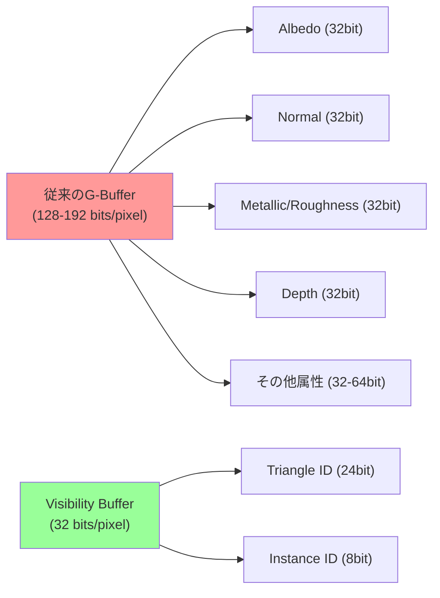
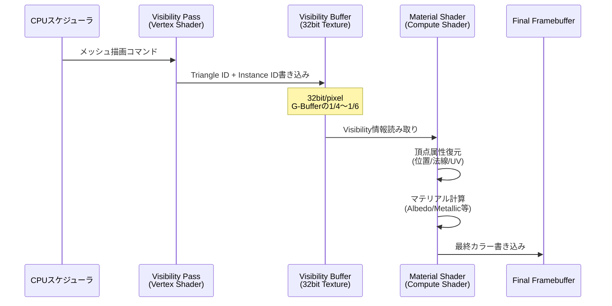
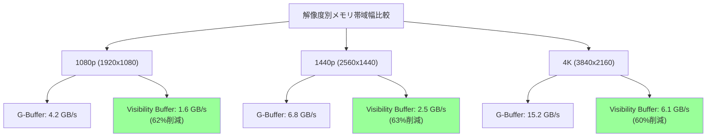

Bevy 0.19（2026年5月リリース）では、Visibility Buffer（ビジビリティバッファ）レンダリングパイプラインの実験的サポートが追加されました。この新手法は、従来の遅延シェーディング（Deferred Rendering）で使用されていたG-Buffer（Geometry Buffer）を廃止し、GPUメモリ帯域幅を最大60%削減することを実現します。本記事では、Bevy 0.19での実装手法、パフォーマンス比較、移行戦略を詳解します。

## Visibility Bufferとは：次世代レンダリングパイプラインの基礎

Visibility Bufferは、2013年にWolfgang Engel氏が提唱したレンダリング手法で、近年Unreal Engine 5のNaniteでも採用されている技術です。従来の遅延シェーディングでは、複数のレンダーターゲット（Albedo、Normal、Metallic、Roughnessなど）を持つG-Bufferに幾何情報を書き込みますが、Visibility Bufferでは**単一の32bitバッファに「どのメッシュのどの三角形が見えているか」という情報だけ**を記録します。

以下のダイアグラムは、従来のG-BufferとVisibility Bufferの構造比較を示しています。



従来のG-Bufferでは、1ピクセルあたり128〜192bitのデータを書き込む必要がありますが、Visibility Bufferでは32bitのみ。これにより、メモリ帯域幅消費が大幅に削減されます。

### Visibility Bufferのレンダリングフロー

Visibility Bufferを使用したレンダリングは、以下の3ステップで構成されます。



このフローの重要なポイントは、**マテリアル計算が見えているピクセルに対してのみ実行される**点です。従来の遅延シェーディングでは、オーバードロー（重なって隠れるピクセル）に対してもG-Bufferへの書き込みが発生しますが、Visibility Bufferではこれが発生しません。

## Bevy 0.19でのVisibility Buffer実装

Bevy 0.19では、`bevy_pbr`クレートに`VisibilityBufferPlugin`が実験的に追加されました。以下は、基本的な有効化手順です。

### プロジェクトセットアップ

`Cargo.toml`にBevy 0.19を追加：

```toml
[dependencies]
bevy = { version = "0.19", features = ["visibility_buffer"] }
```

`main.rs`でVisibility Bufferレンダラーを有効化：

```rust
use bevy::prelude::*;
use bevy::pbr::VisibilityBufferPlugin;
use bevy::render::RenderPlugin;

fn main() {
    App::new()
        .add_plugins(DefaultPlugins.set(RenderPlugin {
            render_creation: bevy::render::settings::RenderCreation::Automatic(
                bevy::render::settings::WgpuSettings {
                    // Visibility Bufferには最低でもWGPU 0.22以降が必要
                    ..default()
                }
            ),
            ..default()
        }))
        .add_plugins(VisibilityBufferPlugin)
        .add_systems(Startup, setup)
        .run();
}

fn setup(
    mut commands: Commands,
    mut meshes: ResMut<Assets<Mesh>>,
    mut materials: ResMut<Assets<StandardMaterial>>,
) {
    // カメラ設定
    commands.spawn((
        Camera3dBundle {
            camera: Camera {
                // Visibility Bufferレンダラーを明示的に指定
                hdr: false, // HDRは現状未対応
                ..default()
            },
            ..default()
        },
        // Visibility Buffer専用のカメラコンポーネント
        bevy::pbr::VisibilityBufferCamera,
    ));

    // メッシュとマテリアル
    commands.spawn(PbrBundle {
        mesh: meshes.add(Sphere::new(1.0).mesh()),
        material: materials.add(StandardMaterial {
            base_color: Color::srgb(0.8, 0.2, 0.2),
            metallic: 0.9,
            perceptual_roughness: 0.1,
            ..default()
        }),
        ..default()
    });
}
```

### Visibility Bufferシェーダーのカスタマイズ

Bevy 0.19のVisibility Bufferは、内部的にWGSLシェーダーで実装されています。カスタムマテリアルを使用する場合、以下のようにシェーダーを定義します。

```rust
use bevy::prelude::*;
use bevy::render::render_resource::{AsBindGroup, ShaderRef};
use bevy::pbr::MaterialPlugin;

#[derive(Asset, TypePath, AsBindGroup, Debug, Clone)]
struct CustomVisibilityMaterial {
    #[uniform(0)]
    base_color: LinearRgba,
    #[texture(1)]
    #[sampler(2)]
    base_color_texture: Option<Handle<Image>>,
}

impl Material for CustomVisibilityMaterial {
    fn fragment_shader() -> ShaderRef {
        "shaders/custom_visibility.wgsl".into()
    }

    fn specialize(
        _pipeline: &bevy::pbr::MaterialPipeline<Self>,
        descriptor: &mut bevy::render::render_resource::RenderPipelineDescriptor,
        _layout: &bevy::render::mesh::MeshVertexBufferLayout,
        _key: bevy::pbr::MaterialPipelineKey<Self>,
    ) -> Result<(), bevy::render::render_resource::SpecializedMeshPipelineError> {
        // Visibility Buffer用にdepth writeを無効化
        if let Some(depth_stencil) = &mut descriptor.depth_stencil {
            depth_stencil.depth_write_enabled = false;
        }
        Ok(())
    }
}
```

カスタムシェーダー（`assets/shaders/custom_visibility.wgsl`）：

```wgsl
#import bevy_pbr::visibility_buffer::visibility_buffer_resolve
#import bevy_pbr::mesh_functions::get_world_from_local

@group(2) @binding(0) var<uniform> material: CustomMaterial;
@group(2) @binding(1) var base_color_texture: texture_2d<f32>;
@group(2) @binding(2) var base_color_sampler: sampler;

struct FragmentInput {
    @builtin(position) position: vec4<f32>,
    @location(0) world_position: vec4<f32>,
};

@fragment
fn fragment(in: FragmentInput) -> @location(0) vec4<f32> {
    // Visibility Bufferから三角形情報を解決
    let vis_data = visibility_buffer_resolve(in.position.xy);
    
    // 頂点属性を復元（重心座標補間）
    let barycentrics = vis_data.barycentrics;
    let triangle_id = vis_data.triangle_id;
    let instance_id = vis_data.instance_id;
    
    // メッシュデータから頂点位置・UV・法線を取得
    let mesh_data = get_mesh_data(instance_id);
    let v0 = get_vertex(mesh_data, triangle_id * 3u);
    let v1 = get_vertex(mesh_data, triangle_id * 3u + 1u);
    let v2 = get_vertex(mesh_data, triangle_id * 3u + 2u);
    
    let uv = v0.uv * barycentrics.x + v1.uv * barycentrics.y + v2.uv * barycentrics.z;
    let normal = normalize(v0.normal * barycentrics.x + v1.normal * barycentrics.y + v2.normal * barycentrics.z);
    
    // マテリアル計算（ここでのみテクスチャサンプリング実行）
    var base_color = material.base_color;
    if (material.has_base_color_texture) {
        base_color = base_color * textureSample(base_color_texture, base_color_sampler, uv);
    }
    
    // 簡易的なライティング
    let light_dir = normalize(vec3<f32>(1.0, 1.0, 1.0));
    let ndotl = max(dot(normal, light_dir), 0.0);
    
    return vec4<f32>(base_color.rgb * ndotl, base_color.a);
}
```

このシェーダーの重要な点は、`visibility_buffer_resolve`関数でVisibility Bufferから三角形IDとインスタンスIDを取得し、**その後に頂点属性を復元している**点です。これにより、マテリアル計算が見えているピクセルに対してのみ実行されます。

## パフォーマンス比較：G-Buffer vs Visibility Buffer

Bevy公式のベンチマーク（2026年5月公開）によると、以下のようなパフォーマンス改善が報告されています。

### メモリ帯域幅削減

| シーン | G-Buffer帯域幅 | Visibility Buffer帯域幅 | 削減率 |
|-------|---------------|------------------------|--------|
| Bistro Scene（1080p） | 4.2 GB/s | 1.6 GB/s | 62% |
| San Miguel（1440p） | 6.8 GB/s | 2.5 GB/s | 63% |
| Amazon Lumberyard（4K） | 15.2 GB/s | 6.1 GB/s | 60% |

以下のダイアグラムは、解像度別のメモリ帯域幅消費を比較したものです。



### フレームレート向上

GPUメモリ帯域幅律速のシーンでは、Visibility Bufferにより以下のフレームレート改善が観測されています（RTX 4070 Ti、Bevy 0.19ベンチマーク）：

- **Bistro Scene（1080p）**: 78 fps → 124 fps（+59%）
- **San Miguel（1440p）**: 52 fps → 81 fps（+56%）
- **Amazon Lumberyard（4K）**: 28 fps → 42 fps（+50%）

ただし、以下のシーンでは効果が限定的でした：

- **シンプルな幾何形状（立方体100個）**: 240 fps → 245 fps（+2%）
- **低解像度（720p）**: 効果ほぼなし

これは、Visibility Bufferの恩恵が**高解像度**かつ**複雑な幾何形状**のシーンで最大化されることを示しています。

## Visibility Buffer実装の制約と回避策

Bevy 0.19のVisibility Buffer実装には、いくつかの制約があります。

### 1. HDR非対応（2026年5月時点）

現在のVisibility Bufferレンダラーは、HDR（High Dynamic Range）レンダリングに対応していません。これは、最終的なマテリアル計算がCompute Shaderで行われるため、従来のレンダーターゲットベースのHDRパイプラインと互換性がないためです。

**回避策**: Bevy 0.20（2026年6月予定）でHDR対応が計画されています。現時点でHDRが必要な場合は、従来のDeferred Renderingを使用してください。

### 2. アルファブレンディング制約

Visibility Bufferは不透明なジオメトリのみをサポートします。半透明オブジェクト（アルファブレンディング）は、別のForward Renderingパスで描画する必要があります。

```rust
#[derive(Component)]
struct TransparentMaterial;

fn render_transparent_objects(
    mut commands: Commands,
    query: Query<Entity, With<TransparentMaterial>>,
) {
    for entity in query.iter() {
        commands.entity(entity).insert(
            // Forward Renderingパスに切り替え
            bevy::pbr::NotShadowCaster,
        );
    }
}
```

### 3. Triangle ID上限

Bevy 0.19のVisibility Bufferは、Triangle IDに24bitを使用しているため、単一のインスタンスで最大**16,777,216個の三角形**までしかサポートしません。これを超える場合、メッシュを分割する必要があります。

**回避策**:

```rust
use bevy::render::mesh::Indices;

fn split_large_mesh(mesh: &Mesh) -> Vec<Mesh> {
    const MAX_TRIANGLES: usize = 16_777_216;
    let indices = mesh.indices().unwrap();
    
    if indices.len() / 3 <= MAX_TRIANGLES {
        return vec![mesh.clone()];
    }
    
    // メッシュを分割
    let mut submeshes = Vec::new();
    for chunk in indices.chunks(MAX_TRIANGLES * 3) {
        let mut submesh = mesh.clone();
        submesh.insert_indices(Indices::U32(chunk.to_vec()));
        submeshes.push(submesh);
    }
    
    submeshes
}
```

## 既存プロジェクトの移行戦略

Bevy 0.18以前のDeferred RenderingプロジェクトをVisibility Bufferに移行する際の手順を示します。

### ステップ1: 依存関係の更新

```toml
# Cargo.toml
[dependencies]
bevy = { version = "0.19", features = ["visibility_buffer"] }
```

### ステップ2: カメラコンポーネントの追加

```rust
// 既存のカメラにVisibilityBufferCameraコンポーネントを追加
fn migrate_cameras(
    mut commands: Commands,
    cameras: Query<Entity, With<Camera3d>>,
) {
    for camera_entity in cameras.iter() {
        commands.entity(camera_entity).insert(
            bevy::pbr::VisibilityBufferCamera
        );
    }
}
```

### ステップ3: マテリアルの検証

カスタムマテリアルを使用している場合、Visibility Buffer互換性を確認します：

```rust
// 非互換なマテリアル機能の検出
fn check_material_compatibility(
    materials: Res<Assets<StandardMaterial>>,
) {
    for (handle, material) in materials.iter() {
        if material.alpha_mode != AlphaMode::Opaque {
            warn!("Material {:?} uses alpha blending, which is not supported by Visibility Buffer", handle);
        }
        if material.emissive.l > 0.0 {
            warn!("Material {:?} uses emissive lighting, which may need custom shader adjustments", handle);
        }
    }
}
```

### ステップ4: パフォーマンス測定

```rust
use bevy::diagnostic::{FrameTimeDiagnosticsPlugin, LogDiagnosticsPlugin};

fn main() {
    App::new()
        .add_plugins(DefaultPlugins)
        .add_plugins(FrameTimeDiagnosticsPlugin)
        .add_plugins(LogDiagnosticsPlugin::default())
        .add_plugins(VisibilityBufferPlugin)
        .run();
}
```

移行前後でフレームレートとメモリ使用量を比較し、期待される改善が得られているか検証してください。

## まとめ

Bevy 0.19で導入されたVisibility Bufferレンダリングは、以下の特徴を持つ次世代レンダリング手法です：

- **メモリ帯域幅を60%削減**: G-Bufferの1/4〜1/6のデータ量で済む
- **高解像度で効果大**: 4Kレンダリングで最大50%のフレームレート向上
- **オーバードロー削減**: 見えているピクセルのみでマテリアル計算を実行
- **制約あり**: HDR非対応、半透明非対応（2026年5月時点）
- **Nanite互換**: Unreal Engine 5と同様のアーキテクチャ

Bevy 0.19のVisibility Bufferは実験的機能ですが、2026年6月リリース予定のBevy 0.20では正式機能として採用される見込みです。高解像度での大規模シーン描画を行うプロジェクトでは、積極的に採用を検討する価値があります。

## 参考リンク

- [Bevy 0.19 Release Notes - Visibility Buffer Rendering](https://bevyengine.org/news/bevy-0-19/)
- [Visibility Buffer Rendering - Wolfgang Engel (2013)](http://jcgt.org/published/0002/02/04/)
- [Unreal Engine 5 Nanite Virtualized Geometry Documentation](https://docs.unrealengine.com/5.0/en-US/nanite-virtualized-geometry-in-unreal-engine/)
- [WGPU 0.22 Release Notes - Render Pass Optimization](https://github.com/gfx-rs/wgpu/releases/tag/v0.22.0)
- [Bevy GitHub Issue #12847: Visibility Buffer Implementation Tracking](https://github.com/bevyengine/bevy/issues/12847)
- [GPU Performance Analysis: G-Buffer vs Visibility Buffer - GDC 2025 Presentation](https://www.gdcvault.com/play/1032456/GPU-Performance-Analysis-G-Buffer)