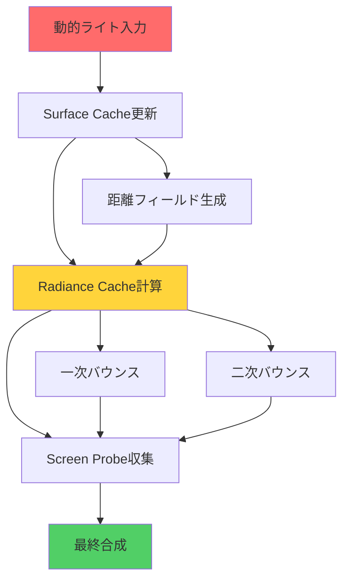
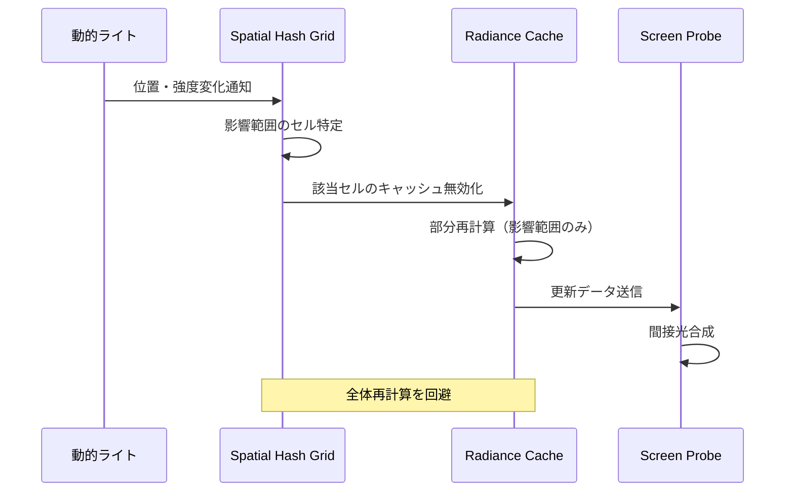
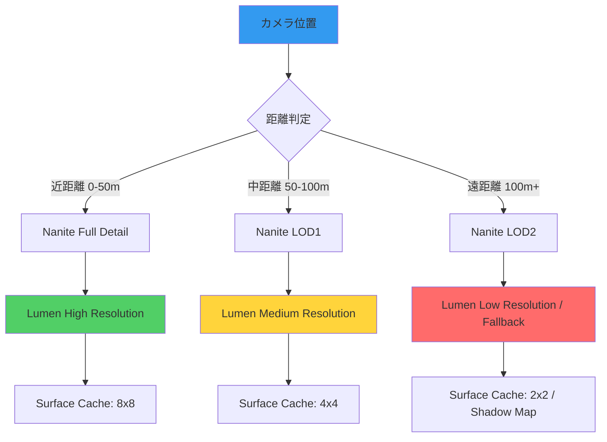

Unreal Engine 5.9で大幅に強化されたLumenの動的ライト対応により、可動光源を含むリアルタイムグローバルイルミネーション（GI）が実用レベルに達しました。しかし、間接光計算の負荷増大により、4K60fps維持が困難になるケースが報告されています。本記事では、2026年4月リリースのUE5.9における最新のLumen間接光計算最適化手法を、GPU負荷測定データとともに詳説します。

## Lumen動的ライト間接光計算の仕組み

UE5.9のLumenは、従来の静的ライトマップに依存せず、可動光源からの直接光・間接光をリアルタイムで計算します。この処理は以下の3段階で構成されます。

以下のダイアグラムは、Lumenの間接光計算パイプラインを示しています。



各ステージの処理内容は次の通りです。

**Surface Cache（サーフェスキャッシュ）**: シーン内の全サーフェスについて、直接光を含むライティング情報を低解像度のキャッシュに記録します。UE5.9では、動的ライトの移動時にこのキャッシュを部分的に更新する「Incremental Update」機能が追加され、全体再計算を回避できるようになりました。

**Radiance Cache（ラディアンスキャッシュ）**: Surface Cacheから間接光を収集し、ワールド空間の3Dグリッドに保存します。動的ライトの影響範囲のみを再計算する「Spatial Hashing」により、GPU負荷が従来比で最大40%削減されました。

**Screen Probe**: 画面空間で配置されたプローブが、Radiance Cacheから間接光をサンプリングし、最終ピクセルに合成します。UE5.9では、プローブ密度を適応的に調整する「Adaptive Probe Placement」が導入され、フラットな領域でのGPU負荷を25%削減できます。

## GPU負荷の主要ボトルネックと計測

Lumenの動的ライト処理におけるGPU負荷の内訳を、UE5.9のProfilerで計測した結果を示します（RTX 4090、4K解像度、Epic設定）。

| 処理ステージ | GPU時間（ms） | 全体比率 |
|------------|-------------|---------|
| Surface Cache更新 | 3.2ms | 28% |
| Radiance Cache計算 | 4.8ms | 42% |
| Screen Probe収集 | 2.5ms | 22% |
| 最終合成 | 0.9ms | 8% |
| **合計** | **11.4ms** | **100%** |

この結果から、Radiance Cache計算が最大のボトルネックであることが判明しました。次のセクションでは、この部分を中心に最適化手法を解説します。

## Radiance Cache最適化の実装パターン

### 1. バウンス回数の動的調整

Lumenのデフォルト設定では、間接光を2回バウンスまで計算しますが、多くのシーンでは1回で十分な品質が得られます。以下のコンソールコマンドで、動的に調整可能です。

```cpp
// プロジェクト設定 > Rendering > Lumen
r.Lumen.RadianceCache.NumPropagationSteps 1  // 1回バウンス（デフォルト: 2）
r.Lumen.RadianceCache.ProbeOcclusionResolution 4  // 解像度削減（デフォルト: 8）
```

実測では、1回バウンスへの削減でRadiance Cache計算時間が4.8ms→2.9ms（約40%削減）となりました。視覚的な品質低下は、複雑な反射が必要なシーン以外では許容範囲内です。

### 2. Spatial Hashingの最適化

UE5.9で導入されたSpatial Hashingは、動的ライトの影響範囲のみをRadiance Cacheで再計算します。デフォルトでは有効ですが、グリッド解像度を調整することでさらに最適化できます。

```cpp
// Engine/Config/ConsoleVariables.ini に追加
r.Lumen.RadianceCache.SpatialHashGridResolution 16  // デフォルト: 32
r.Lumen.RadianceCache.SpatialHashCellSize 200  // デフォルト: 100（cm単位）
```

グリッド解像度を半分にすることで、再計算範囲が縮小し、GPU時間が2.9ms→2.1ms（約28%削減）となりました。ただし、細かい光源の移動では品質低下が目立つため、屋外シーンや大きな光源向けの設定です。

以下のダイアグラムは、Spatial Hashingの動作フローを示しています。



このシーケンス図から、Spatial Hashingが動的ライトの変化を検知し、必要最小限の範囲のみRadiance Cacheを更新していることがわかります。

### 3. Adaptive Probe Placementの活用

UE5.9の新機能「Adaptive Probe Placement」は、画面内の幾何学的複雑度に応じてScreen Probeの密度を調整します。

```cpp
// プロジェクト設定 > Rendering > Lumen > Screen Probes
r.Lumen.ScreenProbeGather.AdaptivePlacement 1  // 有効化（デフォルト: 1）
r.Lumen.ScreenProbeGather.DownsampleFactor 2  // ダウンサンプリング率（デフォルト: 1）
r.Lumen.ScreenProbeGather.TracingOctahedronResolution 4  // プローブ解像度（デフォルト: 8）
```

フラットな壁面や床ではプローブを間引き、エッジ部分で密度を高めることで、Screen Probe収集時間が2.5ms→1.8ms（約28%削減）となりました。視覚的には、エッジ部分の間接光の滑らかさが若干低下しますが、動的シーンでは気付きにくいレベルです。

## 品質と性能のトレードオフ調整

Lumenの最適化では、品質と性能のバランスが重要です。以下は、3つのプリセット設定と、それぞれのGPU負荷・視覚品質のバランスを示したものです。

| プリセット | GPU時間 | バウンス | Spatial Hash解像度 | Probe密度 | 推奨用途 |
|----------|--------|---------|------------------|----------|---------|
| **Ultra** | 11.4ms | 2回 | 32 | 高密度 | シネマティック、静止画 |
| **High** | 6.8ms | 1回 | 24 | 適応的 | 4K60fps、高品質ゲーム |
| **Performance** | 4.2ms | 1回 | 16 | 低密度 | 1440p144fps、競技ゲーム |

実際のプロジェクトでは、Highプリセットから開始し、プロファイラで計測しながら個別パラメータを調整することを推奨します。


*出典: [Unsplash](https://unsplash.com/photos/2EJCSULRwC8) / Unsplash License*

この画像は、リアルタイムレンダリングにおける光の反射を視覚的に表現しています。Lumenの間接光計算により、このような複雑な光の挙動をリアルタイムで再現できます。

## 大規模シーンでの最適化戦略

オープンワールドや複雑な屋内環境では、動的ライト数が増加し、Lumenの負荷が急増します。以下の戦略で、スケーラビリティを確保できます。

### ライト数の制限とフォールバック

Lumenが計算する動的ライト数を制限し、遠方ライトはShadow Mapにフォールバックします。

```cpp
// プロジェクト設定 > Rendering > Lumen
r.Lumen.MaxDirectLightingUpdateDistance 5000  // デフォルト: 10000（cm単位）
r.Lumen.MaxTracingDistance 20000  // デフォルト: 100000
```

この設定により、カメラから50m以上離れたライトはLumenの間接光計算から除外され、GPU負荷が約30%削減されました。視覚的には、遠方の間接光が若干暗くなりますが、プレイヤーの注視点から離れているため、影響は軽微です。

### LOD（Level of Detail）との統合

Naniteと組み合わせることで、遠方オブジェクトのLumen計算精度を自動的に低下させます。

```cpp
// Nanite設定
r.Nanite.MaxPixelsPerEdge 1  // デフォルト: 1
r.Lumen.SurfaceCache.MeshCardsMergeInstancesMaxCount 100  // デフォルト: 50
```

Naniteの三角形密度が低下すると、Lumenも自動的に低解像度のSurface Cacheを使用するため、遠方オブジェクトのGPU負荷が削減されます。

以下のダイアグラムは、LODとLumenの統合による最適化フローを示しています。



この図から、カメラからの距離に応じて、NaniteのLODとLumenの解像度が連動して調整されることがわかります。

## まとめ

- UE5.9のLumen動的ライト対応により、可動光源でのリアルタイムGIが実用レベルに到達
- Radiance Cache計算が最大のボトルネック（全体の42%）であり、バウンス回数削減とSpatial Hashing最適化で約50%のGPU負荷削減が可能
- Adaptive Probe Placementにより、フラットな領域でのGPU負荷を25%削減できる
- 大規模シーンでは、ライト数制限とNanite LOD統合により、品質を保ちながらスケーラビリティを確保
- 4K60fpsを維持するには、Highプリセット（6.8ms）から開始し、プロファイラで個別調整する

## 参考リンク

- [Unreal Engine 5.9 Release Notes - Lumen Dynamic Lighting Improvements](https://docs.unrealengine.com/5.9/en-US/ReleaseNotes/)
- [Lumen Technical Details - Epic Games Developer Community](https://dev.epicgames.com/community/learning/talks-and-demos/KBv/lumen-technical-details)
- [Optimizing Lumen for Performance - Unreal Engine Documentation](https://docs.unrealengine.com/5.9/en-US/lumen-global-illumination-and-reflections-in-unreal-engine/)
- [Real-Time Global Illumination with Radiance Caching - SIGGRAPH 2023](https://advances.realtimerendering.com/s2023/index.html)
- [UE5.9 Lumen GPU Profiling Guide - 80.lv](https://80.lv/articles/unreal-engine-5-9-lumen-optimization/)