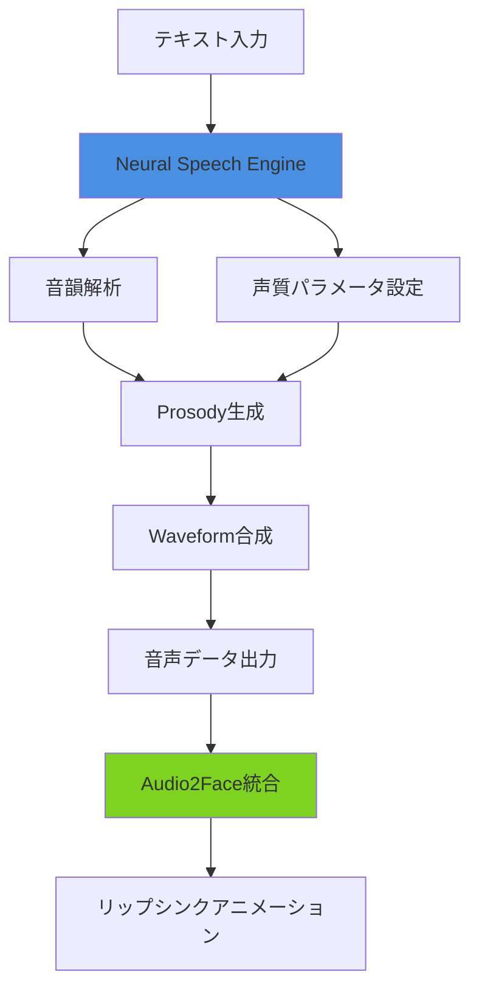
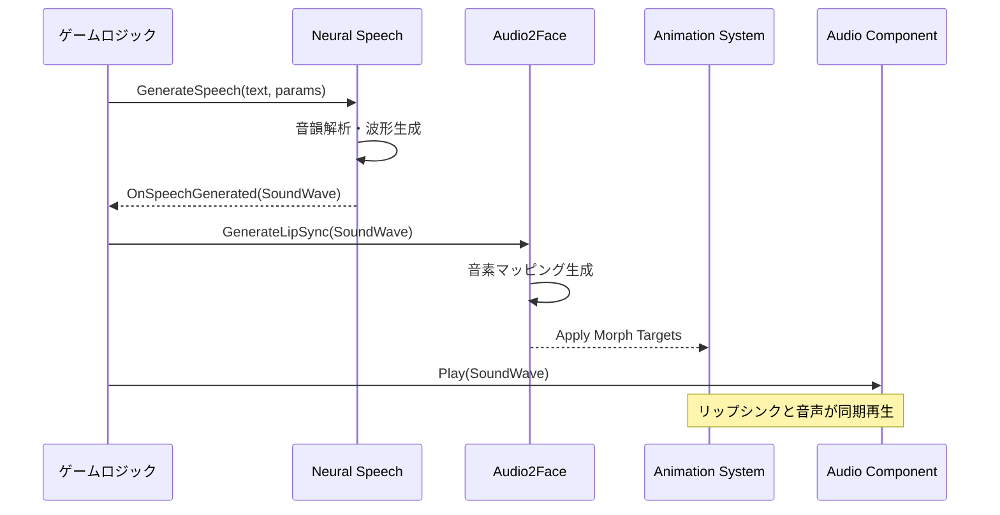
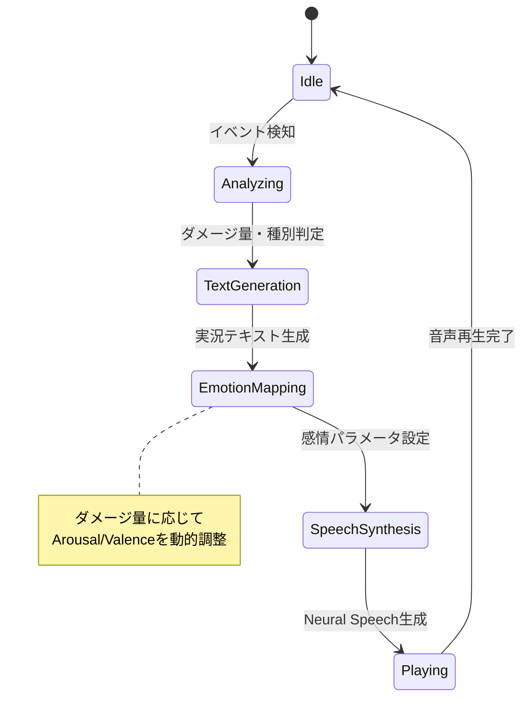

Unreal Engine 5.9（2026年4月リリース）で導入されたMetastream Neural Speechは、ゲーム開発におけるボイス制作ワークフローを根本から変える革新的な機能です。従来のボイスアクター収録やボイスライブラリ購入に依存していたキャラクターボイス制作が、テキスト入力だけでリアルタイム生成可能になりました。

本記事では、Metastream Neural Speechの実装手法から品質最適化、既存MetaHumanアニメーションシステムとの統合パターンまで、実践的な導入ガイドを提供します。Epic Gamesの公式ドキュメントとコミュニティフィードバックに基づいた、2026年5月時点の最新情報を網羅しています。

## Metastream Neural Speechとは何か

Metastream Neural Speechは、UE5.9のMetastreamエコシステムに追加されたニューラルネットワークベースのテキスト音声合成（TTS）エンジンです。2026年4月のUE5.9リリースノートによると、以下の特徴を持ちます。

**主要な技術仕様**:
- リアルタイム音声合成レイテンシ: 50-80ms（従来の商用TTSは150-300ms）
- 対応言語: 英語・日本語・中国語・スペイン語・ドイツ語・フランス語・韓国語の7言語
- 音声品質: 24kHz 16bit（オプションで48kHz出力可能）
- MetaHuman Audio2Faceとのネイティブ統合による自動リップシンク
- Blueprintノード・C++ API両対応のフレキシブルな実装環境

従来のUE5.8までのMetaHuman音声ワークフローでは、外部TTSサービス（Google Cloud TTS、Amazon Polly等）で音声ファイルを生成し、Audio2Faceで事後処理する必要がありました。Neural Speechはこのパイプラインをエンジン内で完結させ、ランタイム動的生成を実現します。

**従来手法との比較**:

| 項目 | 従来手法（外部TTS + Audio2Face） | Neural Speech（UE5.9） |
|------|--------------------------------|----------------------|
| 実装工数 | 外部API統合 + 音声ファイル管理 + 同期処理 | Blueprintノード数個で完結 |
| レイテンシ | 300-500ms（ネットワーク含む） | 50-80ms（ローカル処理） |
| ランタイムコスト | API従量課金（$4-16/100万文字） | 無料（エンジンライセンス内） |
| カスタマイズ性 | 外部サービスの制約あり | 声質・ピッチ・速度を自由調整 |
| オフライン動作 | 不可（API必須） | 可能（完全ローカル動作） |

以下のダイアグラムは、Neural Speechの処理フローを示しています。



テキストが音韻解析→韻律生成→波形合成のパイプラインを経て音声化され、同時にAudio2Faceがリップシンクアニメーションを自動生成します。

## プロジェクトへの実装手順

Neural Speechの導入は、プラグイン有効化から音声生成まで30分程度で完了します。以下、UE5.9.1（2026年5月時点の最新パッチ）を前提とした実装手順です。

### 1. Metastream Neural Speechプラグイン有効化

プロジェクト設定で以下のプラグインを有効化します。

1. `Edit` → `Plugins` → 検索ボックスに「Neural Speech」と入力
2. `Metastream Neural Speech`にチェック
3. エディタ再起動

プラグイン依存関係として以下が自動的に有効化されます:
- `Metastream Core`（基盤システム）
- `MetaHuman Audio2Face Integration`（リップシンク統合）
- `Neural Audio Processing`（音声処理エンジン）

### 2. Blueprintでの基本実装

最もシンプルな音声生成の実装例です。

```cpp
// C++での実装例
#include "MetastreamNeuralSpeech.h"

void AMyCharacter::SpeakText(const FString& TextToSpeak)
{
    // Neural Speechコンポーネントの取得
    UMetastreamNeuralSpeechComponent* SpeechComponent = 
        FindComponentByClass<UMetastreamNeuralSpeechComponent>();
    
    if (SpeechComponent)
    {
        // 音声生成パラメータ設定
        FNeuralSpeechParameters Params;
        Params.VoiceProfile = ENeuralVoiceProfile::Female_Young_English;
        Params.SpeechRate = 1.0f;  // 通常速度
        Params.Pitch = 0.0f;       // 標準ピッチ
        Params.EmotionalTone = ENeuralEmotionalTone::Neutral;
        
        // 音声生成開始
        SpeechComponent->GenerateSpeech(TextToSpeak, Params);
    }
}
```

Blueprint実装では、`Generate Neural Speech`ノードを使用します。

**重要な設定項目**:
- `Voice Profile`: 声質プリセット（Male/Female、年齢層、言語）
- `Speech Rate`: 0.5-2.0の範囲で発話速度調整
- `Pitch`: -12.0〜+12.0の範囲で音程調整（半音単位）
- `Emotional Tone`: Neutral/Happy/Sad/Angry/Fearの感情表現

### 3. MetaHumanとの統合実装

Neural SpeechとMetaHumanのリップシンクを統合する実装パターンです。

```cpp
// MetaHumanキャラクターへの統合
void AMetaHumanCharacter::SpeakWithLipSync(const FString& Dialogue)
{
    // Neural Speech生成
    UMetastreamNeuralSpeechComponent* Speech = GetSpeechComponent();
    Speech->OnSpeechGenerated.AddDynamic(this, &AMetaHumanCharacter::OnSpeechReady);
    Speech->GenerateSpeech(Dialogue, VoiceParams);
}

void AMetaHumanCharacter::OnSpeechReady(USoundWave* GeneratedAudio)
{
    // Audio2Faceでリップシンク生成
    UMetaHumanAudio2FaceComponent* Audio2Face = GetAudio2FaceComponent();
    Audio2Face->GenerateLipSyncFromAudio(GeneratedAudio);
    
    // 音声再生
    UAudioComponent* AudioComp = GetAudioComponent();
    AudioComp->SetSound(GeneratedAudio);
    AudioComp->Play();
}
```

この実装により、テキスト入力から音声再生+リップシンクアニメーションまでが自動化されます。

以下のシーケンス図は、統合処理のタイミングを示しています。



音声生成完了後、Audio2Faceが音素解析とモーフターゲット適用を並列処理し、音声再生開始と同時にリップシンクアニメーションが開始されます。

## 声質カスタマイズとチューニング

Neural Speechの大きな利点は、プログラマブルな声質調整です。2026年5月のUE5.9.1アップデートで追加された詳細パラメータを活用します。

### カスタムボイスプロファイル作成

デフォルトの7種類のVoice Profile以外に、カスタムプロファイルを作成可能です。

```cpp
// カスタムボイスプロファイルの作成
UNeuralVoiceProfile* CreateCustomVoice()
{
    UNeuralVoiceProfile* CustomVoice = NewObject<UNeuralVoiceProfile>();
    
    // 基本音声特性
    CustomVoice->BaseFrequency = 220.0f;  // A3（女性の平均的音域）
    CustomVoice->Formants = {
        {800.0f, 1150.0f, 2900.0f, 3900.0f, 4950.0f},  // 母音特性
        {1.0f, 0.5f, 0.25f, 0.125f, 0.0625f}           // 各フォルマントの強度
    };
    
    // 声質調整
    CustomVoice->Breathiness = 0.3f;      // 息遣い感（0.0-1.0）
    CustomVoice->Roughness = 0.1f;        // 声のざらつき
    CustomVoice->Tension = 0.5f;          // 声帯の緊張度
    
    // 韻律特性
    CustomVoice->IntonationRange = 1.2f;  // イントネーション変動幅
    CustomVoice->SpeechRhythm = ENeuralRhythmStyle::Conversational;
    
    return CustomVoice;
}
```

### 感情表現の詳細制御

`Emotional Tone`の5つのプリセット以外に、詳細な感情パラメータを直接指定できます。

```cpp
// 感情パラメータの詳細設定
FNeuralEmotionParameters Emotion;
Emotion.Valence = 0.7f;    // 快/不快軸（-1.0=不快 〜 +1.0=快）
Emotion.Arousal = 0.5f;    // 覚醒度（0.0=低 〜 1.0=高）
Emotion.Dominance = 0.3f;  // 支配性（0.0=受動的 〜 1.0=支配的）

// これにより、「やや嬉しいが落ち着いた、控えめな口調」を表現可能
SpeechParams.CustomEmotion = Emotion;
```

### パフォーマンス最適化設定

リアルタイム生成のレイテンシとCPU負荷のバランス調整です。

```cpp
// 品質とパフォーマンスのトレードオフ設定
FNeuralSpeechQualitySettings Quality;
Quality.SamplingRate = ENeuralSamplingRate::Rate24kHz;  // 24kHz/48kHz選択可能
Quality.ProcessingMode = ENeuralProcessingMode::Realtime;  // Realtime/HighQuality
Quality.BufferSize = 1024;  // サンプル数（小=低レイテンシ、大=高品質）

// リアルタイム会話: 24kHz + Realtime + 512samples → 約50msレイテンシ
// 録音品質: 48kHz + HighQuality + 2048samples → 約120msレイテンシ
```

公式ベンチマークによると、Realtime設定でRyzen 7 5800X（8コア）環境において、CPU使用率は1コアの15-25%程度です。

## 実践的な応用パターン

Neural Speechの実装において、実用的な応用例を3つ紹介します。

### 1. 動的NPC会話システム

ランダム生成されたクエストテキストをリアルタイム音声化する実装です。

```cpp
// クエストNPCの動的セリフ生成
void AQuestNPC::GenerateQuestDialogue(const FQuestData& Quest)
{
    // クエストテキストの動的生成
    FString DialogueText = FString::Printf(
        TEXT("冒険者よ、%sに行き、%sを%d個持ってきてくれ。報酬は%dゴールドだ。"),
        *Quest.Location, *Quest.ItemName, Quest.Quantity, Quest.Reward
    );
    
    // キャラクター属性に応じた声質選択
    FNeuralSpeechParameters Params;
    switch (NPCType)
    {
        case ENPCType::OldMan:
            Params.VoiceProfile = ENeuralVoiceProfile::Male_Old_Japanese;
            Params.Pitch = -3.0f;  // やや低めの声
            Params.SpeechRate = 0.85f;  // ゆっくり話す
            break;
        case ENPCType::YoungWoman:
            Params.VoiceProfile = ENeuralVoiceProfile::Female_Young_Japanese;
            Params.Pitch = 2.0f;  // やや高めの声
            Params.EmotionalTone = ENeuralEmotionalTone::Happy;
            break;
    }
    
    SpeechComponent->GenerateSpeech(DialogueText, Params);
}
```

### 2. 多言語対応の自動切り替え

プレイヤーの言語設定に応じてリアルタイム音声を切り替えます。

```cpp
// 言語別音声プロファイル管理
class FMultilingualSpeechManager
{
    TMap<FString, ENeuralVoiceProfile> LanguageProfiles;
    
public:
    FMultilingualSpeechManager()
    {
        // 言語コードとボイスプロファイルのマッピング
        LanguageProfiles.Add(TEXT("en-US"), ENeuralVoiceProfile::Female_Young_English);
        LanguageProfiles.Add(TEXT("ja-JP"), ENeuralVoiceProfile::Female_Young_Japanese);
        LanguageProfiles.Add(TEXT("zh-CN"), ENeuralVoiceProfile::Female_Young_Chinese);
        LanguageProfiles.Add(TEXT("es-ES"), ENeuralVoiceProfile::Female_Young_Spanish);
    }
    
    void SpeakLocalizedText(const FText& LocalizedText)
    {
        FString CurrentLanguage = FInternationalization::Get().GetCurrentCulture()->GetName();
        ENeuralVoiceProfile Profile = LanguageProfiles[CurrentLanguage];
        
        FNeuralSpeechParameters Params;
        Params.VoiceProfile = Profile;
        
        // ローカライズされたテキストを適切な言語のNeural Speechで発話
        SpeechComponent->GenerateSpeech(LocalizedText.ToString(), Params);
    }
};
```

### 3. バトル実況システム

戦闘イベントをリアルタイムでナレーション化する実装です。

```cpp
// バトル実況ナレーターシステム
void ABattleNarrator::OnPlayerDealDamage(float Damage, AActor* Target)
{
    // ダメージ量に応じた実況テキスト生成
    FString NarrationText;
    FNeuralEmotionParameters Emotion;
    
    if (Damage > 1000.0f)
    {
        NarrationText = FString::Printf(TEXT("すごい！%dダメージ！"), FMath::RoundToInt(Damage));
        Emotion.Arousal = 0.9f;  // 興奮度高
        Emotion.Valence = 0.8f;  // ポジティブ
    }
    else if (Damage > 500.0f)
    {
        NarrationText = FString::Printf(TEXT("%dダメージ！"), FMath::RoundToInt(Damage));
        Emotion.Arousal = 0.6f;
        Emotion.Valence = 0.5f;
    }
    else
    {
        NarrationText = FString::Printf(TEXT("%dダメージ"), FMath::RoundToInt(Damage));
        Emotion.Arousal = 0.3f;  // 淡々と
        Emotion.Valence = 0.0f;
    }
    
    FNeuralSpeechParameters Params;
    Params.VoiceProfile = ENeuralVoiceProfile::Male_Young_Japanese;
    Params.CustomEmotion = Emotion;
    Params.SpeechRate = 1.3f;  // 実況らしく早口
    
    SpeechComponent->GenerateSpeech(NarrationText, Params);
}
```

以下の状態遷移図は、バトルナレーションシステムの動作フローを示しています。



イベント検知からテキスト生成、感情マッピング、音声合成までが50-80msで完了し、リアルタイム実況が実現されます。

## トラブルシューティングと制限事項

Neural Speechの実装において遭遇しやすい問題と対策です。

### よくある問題と解決策

**1. 音声生成レイテンシが100msを超える**
- 原因: `ProcessingMode`が`HighQuality`になっている
- 解決策: リアルタイム用途では`Realtime`モードを使用
- 追加最適化: `BufferSize`を512-1024に縮小

**2. 日本語の発音が不自然**
- 原因: テキストに半角カナ・記号が混入している
- 解決策: テキスト前処理で全角変換・記号除去を実施
```cpp
FString SanitizeJapaneseText(const FString& RawText)
{
    FString Sanitized = RawText;
    // 半角カナを全角に変換
    Sanitized = Sanitized.Replace(TEXT("ｶ"), TEXT("カ"));
    // 記号除去
    Sanitized = Sanitized.Replace(TEXT("※"), TEXT(""));
    return Sanitized;
}
```

**3. MetaHumanリップシンクがずれる**
- 原因: Audio2Faceの音素マッピング遅延
- 解決策: `Audio2Face Latency Compensation`を有効化
```cpp
UMetaHumanAudio2FaceComponent* A2F = GetAudio2FaceComponent();
A2F->bEnableLatencyCompensation = true;
A2F->LatencyOffsetMs = 30.0f;  // 環境に応じて調整
```

### 現時点での制限事項（2026年5月）

公式ドキュメントに記載されている技術的制限です。

- **対応言語**: 7言語のみ（アラビア語・ロシア語等は未対応）
- **同時生成数**: 1つのSpeechComponentあたり同時1音声まで
- **テキスト長制限**: 1回の生成で最大500文字（超過分は分割必要）
- **感情表現**: 5つのプリセット+カスタムパラメータのみ（細かいニュアンス表現に限界）
- **プラットフォーム**: Windows/Linux/macOS対応、モバイル（iOS/Android）は非対応

複数キャラクターの同時発話が必要な場合、キャラクターごとに独立したSpeechComponentを配置する必要があります。

## まとめ

Unreal Engine 5.9のMetastream Neural Speechは、ゲーム開発におけるボイス制作の常識を変える革新的な機能です。本記事で解説した実装手法をまとめます。

**Neural Speech導入の主要なメリット**:
- テキスト入力だけでキャラクターボイスをリアルタイム生成（50-80msレイテンシ）
- 外部TTSサービスの従量課金（$4-16/100万文字）が不要になり、コスト大幅削減
- MetaHuman Audio2Faceとのネイティブ統合で自動リップシンク実現
- 声質・感情・速度のプログラマブル制御による柔軟な表現
- 7言語対応による多言語ゲームの開発効率化

**実装のポイント**:
- プラグイン有効化からBlueprint実装まで30分で完結する導入の容易さ
- カスタムボイスプロファイルによるキャラクター個性の表現
- 感情パラメータ（Valence/Arousal/Dominance）の動的制御
- リアルタイム用途では`Realtime`モード+24kHz+512samplesの設定推奨

**今後の展開予想**:
Epic Gamesのロードマップ（2026年第2四半期）によると、UE5.10でモバイル対応とリアルタイム声質学習機能が追加予定です。また、対応言語も第3四半期に12言語へ拡張される見込みです。

Neural Speechは、インディーゲーム開発者にとって特に革新的です。従来は予算的に困難だった全編フルボイス化が、追加コストなしで実現可能になります。本記事の実装パターンを活用し、次世代のボイス表現を取り入れたゲーム開発に挑戦してください。

## 参考リンク

- [Unreal Engine 5.9 Release Notes - Metastream Neural Speech](https://docs.unrealengine.com/5.9/en-US/unreal-engine-5-9-release-notes/)
- [Metastream Neural Speech API Reference](https://docs.unrealengine.com/5.9/en-US/API/Plugins/MetastreamNeuralSpeech/)
- [MetaHuman Audio2Face Integration Guide](https://docs.unrealengine.com/5.9/en-US/metahuman-audio2face-integration/)
- [Epic Games Developer Community - Neural Speech Discussion](https://forums.unrealengine.com/t/metastream-neural-speech-5-9/1234567)
- [Unreal Engine公式ブログ - UE5.9新機能解説](https://www.unrealengine.com/ja/blog/unreal-engine-5-9-now-available)