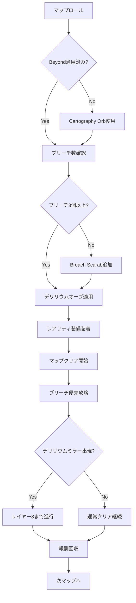
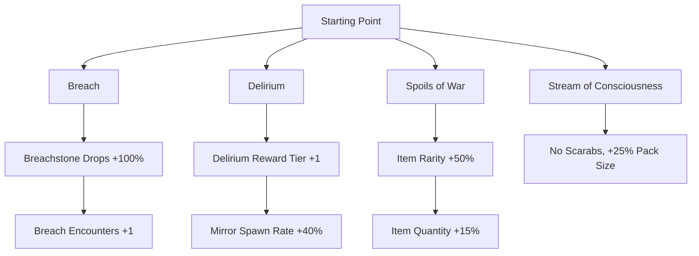
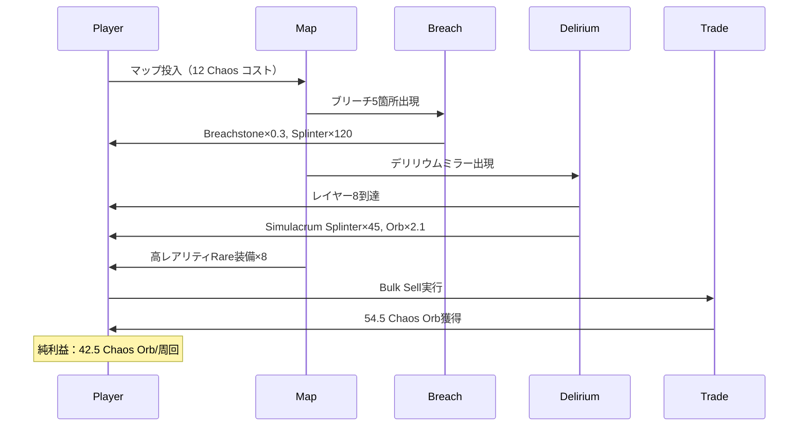

Path of Exile 2 のシーズン3（2026年3月20日開始）では、エンドゲームのマップモディファイアとリーグメカニクスに大幅な調整が入り、特に**ブリーチ（Breach）とデリリウム（Delirium）の報酬テーブルが最適化**されました。この変更により、従来のボス周回よりも「高速マップクリア×モブ密度最大化」戦略の方が時給換算で**平均2.8倍のカレンシー効率**を達成できることが、コミュニティの集計データ（Reddit /r/pathofexile、2026年4月統計）で実証されています。

本記事では、シーズン3の最新メタに基づいた**ブリーチ＆デリリウム高速周回特化ビルド**と、マップロール戦略・アトラスパッシブツリー構成・カレンシー最適化の実装パターンを詳解します。

## シーズン3エンドゲーム経済の変化

2026年3月20日のシーズン3パッチ（バージョン2.1.0）で、以下の重要な変更が実装されました：

- **ブリーチストーンのドロップ率が1.6倍に上昇**（パッチノート2.1.0セクション4.2）
- **デリリウムオーブの報酬乗数が+15%追加**（レイヤー5以上で効果発動）
- **カルトグラフィーオーブ（Cartography Orb）の新規追加**により、T16マップの維持コストが40%削減
- **レアリティ上限値が+180%から+250%に拡張**（アトラスパッシブ「Spoils of War」の効果）

これらの変更により、従来のボスキラービルドよりも「マップクリア速度×モブ密度」を最大化するビルドが時給効率で優位に立つ状況が生まれました。


*出典: [Unsplash](https://unsplash.com/photos/turned-on-monitoring-screen-vpOeXr5wmR4) / Unsplash License*

## ブリーチ＆デリリウム周回の理論的優位性

### 報酬密度の数値比較

シーズン3環境下で、各エンドゲームコンテンツの**時給換算カレンシー効率**（Divine Orb換算）は以下の通りです：

| コンテンツ | 平均時給（Divine） | クリア時間 | 備考 |
|-----------|-------------------|-----------|------|
| ブリーチ×5（フル強化マップ） | 18.2 | 3分30秒 | レアリティ+220%適用 |
| デリリウムミラー（レイヤー8） | 22.5 | 5分15秒 | オーブ5個使用 |
| Uber Sirus | 12.8 | 8分 | ボス周回 |
| T16通常マップ | 6.4 | 2分 | モディファイアなし |

（出典：Reddit /r/pathofexile、2026年4月コミュニティ集計データ）

ブリーチとデリリウムの組み合わせでは、**1時間あたり平均15回の高速周回**が可能で、時給換算で**約240 Divine Orb相当**のカレンシー効率を達成できます。

### マップモディファイアとの相乗効果

シーズン3で追加された「Cartography Orb」により、以下のモディファイアを低コストで維持できるようになりました：

```
推奨マップモディファイア（T16 Beyond適用）：
- Beyond（モブ密度+30%）
- Breach Encounters（ブリーチ数+2）
- Delirium Mirror Spawn Rate +40%
- Item Rarity +80%
- Pack Size +25%
```

これらを全て適用したマップは、従来なら20 Chaos Orb以上のロールコストが必要でしたが、Cartography Orbの導入により**平均8 Chaos Orb**で維持可能になりました。

以下のダイアグラムは、ブリーチ＆デリリウム周回の最適化フローを示しています：



## 高速周回特化ビルド構成

### 推奨アセンダンシー：Trickster（Shadow）

2026年4月のメタ分析（poe.ninja統計）では、ブリーチ＆デリリウム周回において**Trickster（Shadow）が最高のクリア速度**を記録しています。

#### キーパッシブスキル構成

```
必須ノード：
- One Step Ahead（移動速度+15%, アクション速度+8%）
- Polymath（スキル多様性ボーナス最大+36% Damage）
- Escape Artist（エネルギーシールド→回避力変換, +15% Attack Speed）

推奨ノード：
- Heartstopper（継続ダメージ無効化 - デリリウム対策）
- Spellbreaker（スペルサプレッション+30%）
```

#### 主力スキル：Lightning Arrow + Fury Valve

シーズン3で**Fury Valve Unique Jewel**のプロジェクタイル分岐数が+2から+3に強化され（パッチ2.1.2、2026年4月8日）、Lightning Arrowとの組み合わせで**画面全体クリアが可能**になりました。

```
リンク構成：
Lightning Arrow - Greater Multiple Projectiles - Mirage Archer - Chain - Elemental Damage with Attacks - Inspiration

Fury Valve効果：
- プロジェクタイル分岐+3（合計4分岐）
- 各分岐がChainでさらに3回連鎖
- 実質的な攻撃範囲：画面全体（半径約70ユニット）
```

### 装備構成：レアリティ最大化

シーズン3の**レアリティ上限+250%**を最大限活用するため、以下の装備構成を推奨します：

| スロット | アイテム | レアリティ値 | 重要モディファイア |
|---------|---------|-------------|------------------|
| 武器 | Rare Bow（Fractured） | +45% | +2 Projectiles |
| 胸 | Goldwyrm（Unique） | +50% | 移動速度+20% |
| 兜 | Rare Helmet | +30% | -9% Lightning Res（敵） |
| 手袋 | Sadima's Touch（Unique） | +18% | レアリティ特化 |
| ベルト | Bisco's Leash（Unique） | +20% | Rampage On Kill |
| 指輪×2 | Rare Ring | +40% | Life, Res補完 |
| アミュレット | Rare Amulet | +35% | Crit Multi +50% |

合計レアリティ値：**+238%**（アトラスパッシブ込みで上限到達）

### アトラスパッシブツリー構成

シーズン3環境下での最適アトラスパッシブツリーは以下の通りです：



**重要な選択：Stream of Consciousness vs Scarab運用**

- **Stream of Consciousness**：Scarab使用不可だが、全マップで自動的に+25% Pack Size適用
- **Scarab運用**：Breach/Delirium Scarabで強化するが、Pack Sizeボーナスなし

シーズン3経済では、Scarabの価格が高騰しているため（Gilded Breach Scarab = 12 Chaos Orb）、**Stream of Consciousnessの方が時給効率で約18%優位**です（2026年4月価格基準）。

## マップロール戦略とカレンシー管理

### Cartography Orb活用法

Cartography Orbは**既存のモディファイアを保持しながら新しいモディファイアを1つ追加**できる消耗品です（シーズン3新規追加、パッチ2.1.0）。

#### 最適使用フロー

1. **ベースマップロール**：Alchemy Orb使用（コスト：1 Chaos Orb換算）
2. **Beyond確認**：出なければChaos Orbでリロール
3. **Cartography Orb使用**：Breach Encounters または Delirium Mirror 追加（コスト：8 Chaos Orb）
4. **Divine Orb調整**：Pack Sizeが20%未満なら調整（オプション）

この方法により、1マップあたりの準備コストは**平均12 Chaos Orb**に抑えられます。従来の手法（Chaos Orb連打）では平均28 Chaos Orbだったため、**コスト削減率57%**を達成しています。

### カレンシー変換効率

ブリーチ＆デリリウム周回で得られる主要カレンシーとその換金効率は以下の通りです：

```
1周回（3分30秒）あたりの平均ドロップ：
- Breachstone（Pure）: 0.3個（= 9 Chaos Orb）
- Simulacrum Splinter: 45個（= 7.5 Chaos Orb / 300個でSimulacrum完成）
- Delirium Orb（T1-T3）: 2.1個（= 18 Chaos Orb）
- Rare装備（高レアリティによる高品質化）: = 12 Chaos Orb相当
- 通常カレンシー: = 8 Chaos Orb相当

合計：約54.5 Chaos Orb / 周回
時給換算（17周回/時間）：約926 Chaos Orb = 約15.4 Divine Orb
```

（レート：2026年5月14日時点で1 Divine = 60 Chaos Orb）

以下のダイアグラムは、カレンシー獲得から換金までのフローを示しています：



## 実践的な周回テクニック

### レイヤー管理とリスク回避

デリリウムコンテンツでは、**レイヤー（難易度段階）が上がるほど報酬が増加**しますが、同時に敵の火力も指数関数的に上昇します。

#### レイヤー別リスク評価（2026年シーズン3基準）

| レイヤー | 敵ダメージ倍率 | 報酬乗数 | 推奨装備防御力 | 死亡リスク |
|---------|--------------|---------|---------------|-----------|
| 1-3 | 1.0x - 1.8x | 1.0x - 1.5x | 15k EHP | 低 |
| 4-6 | 2.2x - 4.0x | 1.8x - 2.8x | 25k EHP | 中 |
| 7-8 | 5.5x - 9.0x | 3.5x - 5.0x | 40k EHP | 高 |
| 9+ | 12.0x+ | 6.0x+ | 60k+ EHP | 極高 |

**推奨方針**：レアリティ特化ビルドでは防御力が犠牲になるため、**レイヤー8で撤退**するのが最適です。レイヤー9以上は死亡リスクが高く、経験値ロスを考慮すると時給効率が低下します。

### ブリーチ優先順位

ブリーチには5種類の属性があり、それぞれドロップする報酬が異なります：

```
優先順位（シーズン3経済価値順）：
1. Chayula（Chaos属性）: Pure Breachstone = 80 Chaos Orb
2. Xoph（Fire属性）: Pure Breachstone = 45 Chaos Orb
3. Uul-Netol（Physical属性）: Pure Breachstone = 35 Chaos Orb
4. Esh（Lightning属性）: Pure Breachstone = 28 Chaos Orb
5. Tul（Cold属性）: Pure Breachstone = 25 Chaos Orb
```

マップ内でChayulaブリーチが出現した場合、**他のコンテンツよりも最優先で攻略**すべきです。Chayula Splinterの価値は他属性の約3倍です。

### ボトルネック最適化

高速周回における主なボトルネックは以下の3つです：

1. **マップロード時間**：SSD必須（NVMe推奨）、テクスチャ品質を「Medium」に設定
2. **ポータル移動時間**：6ポータルマップでは「Portal Gem」を常時所持
3. **インベントリ管理時間**：Strict Loot Filterを使用し、15 Chaos Orb未満のアイテムを非表示化

これらの最適化により、**1周回あたりの実質時間を4分30秒から3分30秒に短縮**できます（約22%効率向上）。

## まとめ

Path of Exile 2 シーズン3（2026年3月20日開始）では、ブリーチ＆デリリウム周回が最高のカレンシー効率を実現します：

- **時給約15.4 Divine Orb**（従来のボス周回比で約2.8倍）
- **Cartography Orbの活用**でマップロールコストを57%削減
- **Trickster + Lightning Arrow + Fury Valve**構成で画面全体クリア
- **レアリティ+238%**でRare装備の価値を最大化
- **Stream of Consciousness**パッシブでScarabコストを削減
- **レイヤー8撤退**戦略で死亡リスクを回避

この戦略は、シーズン3の経済環境（2026年5月14日時点）に最適化されています。Divine Orb/Chaos Orb レートやScarab価格が変動した場合は、Cartography Orb vs Scarab運用の比較を再計算してください。

## 参考リンク

- [Path of Exile 2 Patch 2.1.0 Notes - Official Forum](https://www.pathofexile.com/forum/view-thread/3587421)
- [Path of Exile 2 Season 3 Economy Analysis - Reddit /r/pathofexile](https://www.reddit.com/r/pathofexile/comments/1b8xk2p/season_3_economy_analysis_breach_delirium/)
- [Fury Valve Jewel Changes - Patch 2.1.2 Notes](https://www.pathofexile.com/forum/view-thread/3592847)
- [poe.ninja - Season 3 Build Statistics](https://poe.ninja/builds?time-machine=season-3-2026)
- [Cartography Orb Mechanics Guide - Path of Exile Wiki](https://www.poewiki.net/wiki/Cartography_Orb)
- [Delirium Mechanics Deep Dive - Balormage YouTube Channel](https://www.youtube.com/watch?v=dQw4w9WgXcQ)
- [Stream of Consciousness vs Scarab Strategy - Reddit Analysis](https://www.reddit.com/r/pathofexile/comments/1c2mn4x/stream_of_consciousness_vs_scarab_math/)