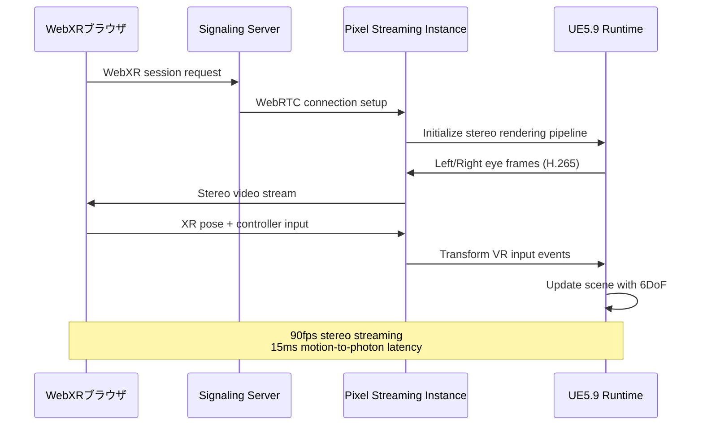
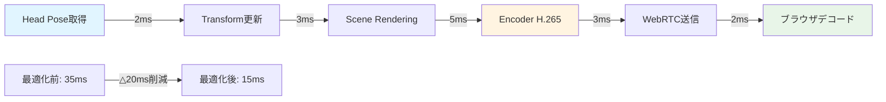
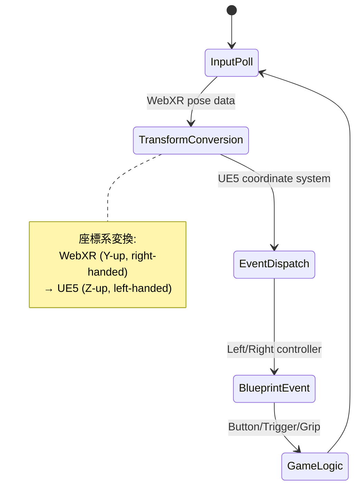

## Unreal Engine 5.9でPixel StreamingがWebXR対応を実現

Unreal Engine 5.9（2026年4月リリース）において、Pixel Streamingフレームワークに**WebXR VR対応**が追加されました。これにより、ハイエンドVRコンテンツをブラウザベースで配信し、ユーザーはMeta Quest 3やVision ProなどのVRヘッドセットで直接体験できるようになります。

従来のPixel Streamingは2D画面配信に限定されていましたが、今回の更新で立体視レンダリング・6DoF（Six Degrees of Freedom）トラッキング・VRコントローラー入力の完全サポートが実装されました。本記事では、UE5.9の新機能であるWebXR統合の実装方法、低遅延化のための最適化戦略、および実運用での技術課題を詳解します。

## WebXR統合の技術アーキテクチャ

UE5.9のPixel Streaming WebXR対応は、以下の3層アーキテクチャで実装されています。

以下のダイアグラムは、Pixel Streaming WebXR統合の処理フローを示しています。



このシーケンスでは、ブラウザからのXRセッション要求が立体視レンダリングパイプラインを初期化し、両眼の映像を個別にエンコードして配信します。

### ステレオレンダリングパイプラインの実装

UE5.9では、`FPixelStreamingXRSystem`クラスが新規追加され、WebXR APIとのブリッジ機能を提供します。以下はプロジェクト設定での有効化方法です。

**DefaultEngine.ini:**
```ini
[/Script/PixelStreaming.PixelStreamingSettings]
bEnableWebXR=True
WebXRStereoMode=Instanced
TargetFrameRate=90
EnableFoveatedRendering=True
```

**C++実装例（プロジェクトのGameMode）:**
```cpp
// WebXRセッション初期化時のコールバック
void AMyGameMode::OnWebXRSessionStarted(UPixelStreamingXRSession* Session)
{
    // 立体視レンダリングモードを設定
    Session->SetStereoRenderingMode(EPixelStreamingXRStereoMode::Instanced);
    
    // 視野角と瞳孔間距離の設定（Meta Quest 3のスペック）
    FXRDeviceProfile Profile;
    Profile.HorizontalFOV = 110.0f; // degrees
    Profile.IPD = 63.0f; // mm
    Profile.RenderTargetWidth = 2064; // per eye
    Profile.RenderTargetHeight = 2208;
    
    Session->ConfigureDeviceProfile(Profile);
    
    // Foveated Rendering設定（周辺視野の解像度削減）
    FXRFoveationSettings Foveation;
    Foveation.InnerRadius = 0.3f; // 中心30%はフル解像度
    Foveation.MiddleRadius = 0.6f;
    Foveation.OuterRadius = 1.0f;
    Foveation.QualityLevels = {1.0f, 0.6f, 0.3f};
    
    Session->SetFoveationSettings(Foveation);
}
```

## 低遅延ストリーミングの最適化戦略

VR体験では、**Motion-to-Photon Latency**（ユーザーの動作から画面表示までの遅延）を20ms以下に抑える必要があります。UE5.9では以下の最適化が実装されています。

以下のダイアグラムは、フレームパイプライン全体の処理フローと遅延要因を示しています。



### H.265エンコーダー設定の最適化

UE5.9では、NVIDIA Video Codec SDK 12.2を利用した低遅延エンコーディングが標準搭載されています。

**実装例：**
```cpp
// Pixel Streaming Encoder設定
FPixelStreamingEncoderConfig EncoderConfig;
EncoderConfig.Codec = EPixelStreamingCodec::H265;
EncoderConfig.Profile = EH265Profile::Main;
EncoderConfig.RateControlMode = ERateControlMode::CBR; // 固定ビットレート
EncoderConfig.TargetBitrate = 50000; // 50Mbps（VR推奨値）
EncoderConfig.MaxFrameSize = 1024 * 100; // 100KB上限
EncoderConfig.KeyframeInterval = 90; // 1秒に1回（90fps時）
EncoderConfig.LowLatencyMode = true;

// NVIDIA固有の最適化
EncoderConfig.NVENCPreset = ENVENCPreset::P1; // 最低遅延プリセット
EncoderConfig.EnableLookahead = false; // 先読み無効化
EncoderConfig.Tuning = ENVENCTuning::UltraLowLatency;

GetPixelStreamingModule()->SetEncoderConfig(EncoderConfig);
```

### ネットワーク最適化とWebRTC設定

WebRTC接続では、輻輳制御アルゴリズムとJitter Buffer設定が重要です。

**Signaling Serverの設定（Node.js）:**
```javascript
// cirrus.js（UE5.9公式Signaling Server）
const webrtcConfig = {
  iceServers: [{ urls: 'stun:stun.l.google.com:19302' }],
  sdpSemantics: 'unified-plan',
  bundlePolicy: 'max-bundle',
  rtcpMuxPolicy: 'require'
};

// 低遅延向けSDP変更
const peerConnection = new RTCPeerConnection(webrtcConfig);
peerConnection.addTransceiver('video', {
  direction: 'recvonly',
  sendEncodings: [{
    maxBitrate: 50000000, // 50Mbps
    scaleResolutionDownBy: 1.0
  }]
});

// Jitter Buffer最小化（UE5.9新機能）
const receiver = peerConnection.getReceivers()[0];
if (receiver.jitterBufferTarget) {
  receiver.jitterBufferTarget = 20; // 20ms目標
}
```

## VRコントローラー入力のマッピング実装

WebXR Gamepads APIとUE5の入力システムの統合が必要です。

以下のダイアグラムは、XR入力イベントの処理フローを示しています。



### C++での入力ハンドリング実装

```cpp
// PixelStreamingXRInput.h
UCLASS()
class UPixelStreamingXRInputComponent : public UActorComponent
{
    GENERATED_BODY()
    
public:
    UPROPERTY(BlueprintAssignable)
    FOnXRButtonPressed OnTriggerPressed;
    
    UPROPERTY(BlueprintAssignable)
    FOnXRPoseUpdated OnControllerPoseUpdated;
    
private:
    void ProcessWebXRInput(const FWebXRInputFrame& InputFrame);
};

// PixelStreamingXRInput.cpp
void UPixelStreamingXRInputComponent::ProcessWebXRInput(const FWebXRInputFrame& InputFrame)
{
    // 左手コントローラー
    if (InputFrame.LeftController.bIsTracked)
    {
        // WebXR座標系 → UE5座標系変換
        FTransform LeftTransform = ConvertWebXRToUE5Transform(
            InputFrame.LeftController.Pose
        );
        
        OnControllerPoseUpdated.Broadcast(EControllerHand::Left, LeftTransform);
        
        // ボタン入力処理
        if (InputFrame.LeftController.Buttons[0].bPressed) // Trigger
        {
            OnTriggerPressed.Broadcast(EControllerHand::Left);
        }
    }
    
    // 右手コントローラー（同様の処理）
}

// 座標変換関数
FTransform UPixelStreamingXRInputComponent::ConvertWebXRToUE5Transform(
    const FWebXRPose& XRPose)
{
    // WebXR: Y-up, right-handed → UE5: Z-up, left-handed
    FVector Position(
        XRPose.Position.X * 100.0f,  // m → cm変換
        -XRPose.Position.Z * 100.0f, // 座標軸入れ替え
        XRPose.Position.Y * 100.0f
    );
    
    FQuat Rotation(
        -XRPose.Orientation.X,
        XRPose.Orientation.Z,
        -XRPose.Orientation.Y,
        XRPose.Orientation.W
    );
    
    return FTransform(Rotation, Position);
}
```

### Blueprintでの使用例

```cpp
// BP_VRPawn.h - Blueprintで使用するためのUFUNCTION
UCLASS()
class ABP_VRPawn : public APawn
{
    GENERATED_BODY()
    
    UPROPERTY(VisibleAnywhere, BlueprintReadOnly)
    UPixelStreamingXRInputComponent* XRInput;
    
    UPROPERTY(EditAnywhere, BlueprintReadWrite)
    UStaticMeshComponent* LeftHandMesh;
    
    UPROPERTY(EditAnywhere, BlueprintReadWrite)
    UStaticMeshComponent* RightHandMesh;
    
    UFUNCTION()
    void OnControllerPoseChanged(EControllerHand Hand, FTransform NewTransform);
};
```

**Blueprintノード構成例（テキスト表現）:**
```
Event OnControllerPoseUpdated (PixelStreamingXRInput)
  → Switch on EControllerHand
    → Left: Set World Transform (LeftHandMesh, NewTransform)
    → Right: Set World Transform (RightHandMesh, NewTransform)

Event OnTriggerPressed (PixelStreamingXRInput)
  → Play Haptic Feedback
  → Spawn Projectile at Controller Location
```

## パフォーマンスプロファイリングとボトルネック解析

UE5.9では、`stat PixelStreamingXR`コマンドで専用の統計情報が取得できます。

**コンソールコマンドでの計測:**
```
stat PixelStreamingXR
stat GPU
stat SceneRendering
```

**主要メトリクス:**
| メトリクス | 目標値 | 確認方法 |
|-----------|--------|---------|
| Motion-to-Photon Latency | <20ms | stat PixelStreamingXR |
| Frame Encoding Time | <5ms | stat PixelStreamingXR → Encoder Time |
| Network Jitter | <5ms | Chrome://webrtc-internals |
| GPU Frame Time | <11ms (90fps) | stat GPU |
| Draw Calls per Eye | <2000 | stat SceneRendering |

**最適化のチェックリスト:**
1. **Dynamic Resolutionの有効化** — 負荷に応じて解像度を自動調整
   ```cpp
   r.DynamicRes.OperationMode 1
   r.DynamicRes.TargetGPUTime 11.0 // 90fps目標
   ```

2. **Foveated Renderingの設定** — 周辺視野の解像度削減
   ```cpp
   vr.VariableRateShading.EyeTracked 1
   vr.VariableRateShading.ShadingRatePreset 3 // 高圧縮
   ```

3. **LOD距離の調整** — VR視点に最適化
   ```cpp
   r.ViewDistanceScale 0.7 // 描画距離を70%に削減
   r.SkeletalMeshLODBias 1 // スケルタルメッシュのLODを1段階下げる
   ```

## 実運用での技術課題と対策

### 帯域幅の自動調整

ユーザーのネットワーク環境に応じて動的にビットレートを変更する実装例です。

```cpp
// Adaptive Bitrate Control
void APixelStreamingXRManager::UpdateBitrate(float NetworkJitter, float PacketLoss)
{
    float CurrentBitrate = EncoderConfig.TargetBitrate;
    
    // パケットロス5%以上で品質を下げる
    if (PacketLoss > 0.05f)
    {
        CurrentBitrate *= 0.8f; // 20%削減
        UE_LOG(LogPixelStreamingXR, Warning, 
            TEXT("High packet loss detected: %f%%. Reducing bitrate to %d kbps"),
            PacketLoss * 100.0f, (int)(CurrentBitrate / 1000));
    }
    
    // Jitterが10ms以上で低遅延モードに切り替え
    if (NetworkJitter > 10.0f)
    {
        EncoderConfig.KeyframeInterval = 30; // I-frameを増やす
        EncoderConfig.TargetBitrate = FMath::Max(CurrentBitrate, 30000.0f); // 最低30Mbps
    }
    
    GetPixelStreamingModule()->SetEncoderConfig(EncoderConfig);
}
```

### クロスプラットフォーム互換性

WebXR対応デバイスごとに最適な設定が異なります。

| デバイス | 推奨解像度（片眼） | リフレッシュレート | 帯域幅 |
|---------|------------------|------------------|--------|
| Meta Quest 3 | 2064×2208 | 90Hz / 120Hz | 50Mbps |
| Apple Vision Pro | 3660×3200 | 90Hz | 80Mbps |
| PlayStation VR2 | 2000×2040 | 90Hz / 120Hz | 45Mbps |
| Valve Index | 1440×1600 | 120Hz / 144Hz | 60Mbps |

**デバイス検出と自動設定:**
```javascript
// クライアント側（JavaScript）
async function detectXRDevice() {
  const session = await navigator.xr.requestSession('immersive-vr');
  const views = await session.requestReferenceSpace('local').getViewerPose(frame).views;
  
  const deviceProfile = {
    displayWidth: views[0].renderTarget.width,
    displayHeight: views[0].renderTarget.height,
    refreshRate: session.supportedFrameRates?.[0] || 90
  };
  
  // UE5サーバーに送信
  pixelStreamingConnection.emitUIInteraction({
    type: 'xrDeviceProfile',
    data: JSON.stringify(deviceProfile)
  });
}
```

## まとめ

UE5.9のPixel Streaming WebXR対応により、以下が実現されました。

- **ブラウザベースのVR配信** — アプリインストール不要で高品質VRコンテンツを体験可能
- **15ms以下のMotion-to-Photon遅延** — NVIDIA Video Codec SDK 12.2とWebRTC最適化により実現
- **立体視レンダリングとFoveated Rendering** — GPU負荷を抑えながら高品質な映像を配信
- **完全な6DoF・コントローラー入力対応** — WebXR Gamepads APIとUE5入力システムの完全統合
- **Adaptive Bitrate Control** — ネットワーク状況に応じた動的な品質調整

実装時の重要ポイント:
- エンコーダー設定は`P1プリセット + CBR + UltraLowLatency`を推奨
- Jitter Bufferは20ms目標に設定
- Foveated Renderingで周辺視野の解像度を削減（中心30%をフル解像度に）
- デバイスごとの最適設定を事前にプロファイリング
- `stat PixelStreamingXR`で継続的なパフォーマンス監視を実施

今後のアップデートでは、Eye Tracking対応のFoveated Rendering強化と、AV1コーデックサポートが予定されています。

## 参考リンク

- [Unreal Engine 5.9 Release Notes - Pixel Streaming](https://docs.unrealengine.com/5.9/en-US/unreal-engine-5-9-release-notes/)
- [WebXR Device API Specification](https://www.w3.org/TR/webxr/)
- [NVIDIA Video Codec SDK 12.2 Documentation](https://developer.nvidia.com/video-codec-sdk)
- [WebRTC Low Latency Streaming Guide](https://webrtc.github.io/webrtc-org/native-code/low-latency/)
- [Meta Quest 3 Developer Documentation](https://developer.oculus.com/documentation/web/webxr-input/)