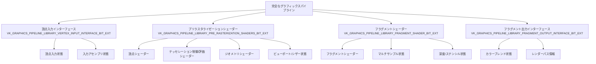
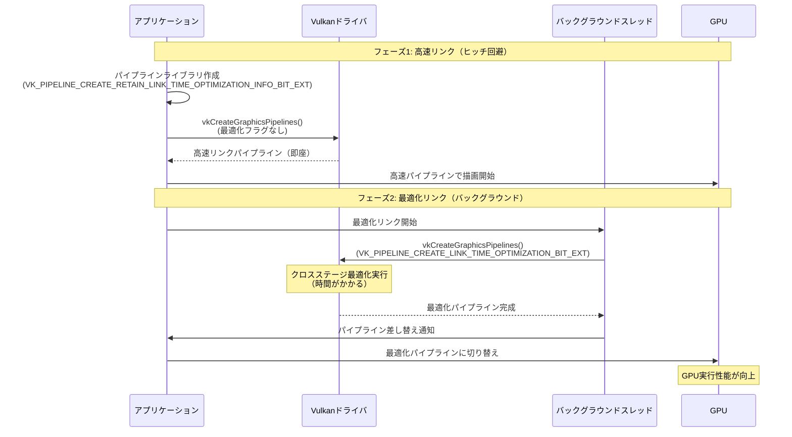

Vulkanのモノリシックなパイプライン作成モデルは、理論上は事前コンパイルによって実行時のヒッチを回避できるはずだった。しかし現実には、多くのゲームエンジンにとって、全ての状態を事前に用意することは実用的ではなく、結果としてパイプラインキャッシュが肥大化するか、描画時のヒッチが残り続けるという課題があった。

2022年にKhronosが発表した**VK_EXT_graphics_pipeline_library**拡張は、この問題に対する根本的な解決策を提供する。この拡張により、グラフィックスパイプラインを4つの独立したパーツ（頂点入力、プリラスタライゼーションシェーダー、フラグメントシェーダー、フラグメント出力）に分割してコンパイルし、後でリンクすることが可能になった。

本記事では、VK_EXT_graphics_pipeline_libraryを活用したパイプラインキャッシュ戦略と、GPU初期化遅延を劇的に削減する実装手法を詳解する。2026年5月時点で、NVIDIA・AMDの両主要ベンダーがこの拡張をサポートしており、実践的な導入が可能になっている。

## VK_EXT_graphics_pipeline_library 拡張の基本構造

VK_EXT_graphics_pipeline_library拡張は、従来のモノリシックなパイプライン作成を4つの独立したライブラリに分割する。

以下のダイアグラムは、パイプラインライブラリの分割構造と各パーツの役割を示している。



このダイアグラムから分かるように、各パーツは明確に分離された責務を持っており、独立してコンパイル可能になっている。

### 4つのパイプラインライブラリパーツ

**1. 頂点入力インターフェース（VK_GRAPHICS_PIPELINE_LIBRARY_VERTEX_INPUT_INTERFACE_BIT_EXT）**

頂点バッファのフォーマットと入力アセンブリの状態を定義する最も軽量なパーツ。頂点シェーダーへのインターフェースを確定させる。

**2. プリラスタライゼーションシェーダー（VK_GRAPHICS_PIPELINE_LIBRARY_PRE_RASTERIZATION_SHADERS_BIT_EXT）**

頂点シェーダー、テッセレーション、ジオメトリシェーダーなど、ラスタライゼーション前に実行される全てのシェーダーステージを含む。ビューポート・シザー状態も含まれる。

**3. フラグメントシェーダー（VK_GRAPHICS_PIPELINE_LIBRARY_FRAGMENT_SHADER_BIT_EXT）**

フラグメントシェーダーステージと、マルチサンプリング・深度/ステンシルテスト状態を含む。

**4. フラグメント出力インターフェース（VK_GRAPHICS_PIPELINE_LIBRARY_FRAGMENT_OUTPUT_INTERFACE_BIT_EXT）**

カラーブレンド状態とレンダーパス設定を含む、最終的な出力設定を定義する。

これらのパーツは独立してコンパイルされ、`VkPipelineLibraryCreateInfoKHR`構造体を通じてリンクされる。重要な点として、複数のライブラリで同じパーツを提供してはならず、リンク時には全てのパーツが揃っている必要がある。

## 高速リンク vs 最適化リンク：二段階コンパイル戦略

VK_EXT_graphics_pipeline_libraryの最も強力な機能は、描画時のヒッチを完全に回避しながら、最終的にはGPU実行性能を最大化できる二段階リンク戦略だ。

以下のシーケンスダイアグラムは、この二段階リンク戦略の実行フローを示している。



このフローから分かるように、高速リンクでヒッチを回避しつつ、バックグラウンドで最適化版を作成することで、ユーザー体験とGPU性能の両方を実現している。

### フェーズ1: 高速リンクによるヒッチ回避

描画コマンド記録時に新しいパイプライン状態が必要になった際、まず`VK_PIPELINE_CREATE_LINK_TIME_OPTIMIZATION_BIT_EXT`フラグを**設定せずに**パイプラインをリンクする。

```c
// フェーズ1: 高速リンク用のパイプライン作成
VkPipelineLibraryCreateInfoKHR libraryInfo = {};
libraryInfo.sType = VK_STRUCTURE_TYPE_PIPELINE_LIBRARY_CREATE_INFO_KHR;
libraryInfo.libraryCount = 4;
libraryInfo.pLibraries = libraryParts; // 事前にコンパイル済みの4パーツ

VkGraphicsPipelineCreateInfo pipelineInfo = {};
pipelineInfo.sType = VK_STRUCTURE_TYPE_GRAPHICS_PIPELINE_CREATE_INFO;
pipelineInfo.pNext = &libraryInfo;
// VK_PIPELINE_CREATE_LINK_TIME_OPTIMIZATION_BIT_EXT は設定しない
pipelineInfo.flags = 0;

VkPipeline fastPipeline;
vkCreateGraphicsPipelines(device, pipelineCache, 1, &pipelineInfo, nullptr, &fastPipeline);
```

このフラグを設定しない場合、ドライバは最小限のリンク処理のみを行い、**非常に高速に**パイプライン作成を完了する。Khronosの公式ブログによれば、この高速リンクはほぼ即座に完了することが期待されており、描画時のヒッチを完全に回避できる。

ただし、ベンダーの推定によれば、高速リンクされたパイプラインは最適化版と比較して**最大50%のGPU性能ペナルティ**を受ける可能性がある。一部の実装ではさらに悪化するケースもあるため、これはあくまで一時的な措置として使用する。

### フェーズ2: バックグラウンドでの最適化リンク

高速リンクパイプラインを使用して描画を開始した直後、バックグラウンドスレッドで最適化版のコンパイルを開始する。

```c
// バックグラウンドスレッドで実行
void compileOptimizedPipeline(/* パラメータ */) {
    VkPipelineLibraryCreateInfoKHR libraryInfo = {};
    libraryInfo.sType = VK_STRUCTURE_TYPE_PIPELINE_LIBRARY_CREATE_INFO_KHR;
    libraryInfo.libraryCount = 4;
    libraryInfo.pLibraries = libraryParts; // 同じライブラリパーツを使用
    
    VkGraphicsPipelineCreateInfo pipelineInfo = {};
    pipelineInfo.sType = VK_STRUCTURE_TYPE_GRAPHICS_PIPELINE_CREATE_INFO;
    pipelineInfo.pNext = &libraryInfo;
    // リンク時最適化を有効化
    pipelineInfo.flags = VK_PIPELINE_CREATE_LINK_TIME_OPTIMIZATION_BIT_EXT;
    
    VkPipeline optimizedPipeline;
    vkCreateGraphicsPipelines(device, pipelineCache, 1, &pipelineInfo, nullptr, &optimizedPipeline);
    
    // 完成したらメインスレッドに通知し、パイプラインを差し替え
    notifyPipelineReady(optimizedPipeline);
}
```

`VK_PIPELINE_CREATE_LINK_TIME_OPTIMIZATION_BIT_EXT`を設定すると、ドライバはクロスステージ最適化を実行する。これには時間がかかるが、最終的なGPU実行性能は大幅に向上する。

重要な前提条件として、個々のパイプラインライブラリ作成時に`VK_PIPELINE_CREATE_RETAIN_LINK_TIME_OPTIMIZATION_INFO_BIT_EXT`フラグを設定しておく必要がある。

```c
// ライブラリパーツ作成時
VkGraphicsPipelineCreateInfo libraryCreateInfo = {};
// ... 各種設定 ...
libraryCreateInfo.flags = VK_PIPELINE_CREATE_LIBRARY_BIT_KHR | 
                         VK_PIPELINE_CREATE_RETAIN_LINK_TIME_OPTIMIZATION_INFO_BIT_EXT;

vkCreateGraphicsPipelines(device, nullptr, 1, &libraryCreateInfo, nullptr, &libraryPart);
```

このフラグにより、ドライバは後のリンク時最適化に必要な情報を保持する。

## パイプラインキャッシュ戦略とメモリ効率化

VK_EXT_graphics_pipeline_libraryを使用する際のパイプラインキャッシュ戦略は、従来のモノリシックパイプラインとは異なるアプローチが必要になる。

### ステージ別キャッシュ分離戦略

Khronosの推奨によれば、**異なるステージタイプを同じVkPipelineCacheに混在させるべきではない**。不要なルックアップオーバーヘッドを避けるため、ステージごとに独立したキャッシュを使用する。

```c
// ステージ別のパイプラインキャッシュを作成
VkPipelineCache vertexInputCache;
VkPipelineCache preRasterizationCache;
VkPipelineCache fragmentShaderCache;
VkPipelineCache fragmentOutputCache;

VkPipelineCacheCreateInfo cacheInfo = {};
cacheInfo.sType = VK_STRUCTURE_TYPE_PIPELINE_CACHE_CREATE_INFO;

vkCreatePipelineCache(device, &cacheInfo, nullptr, &vertexInputCache);
vkCreatePipelineCache(device, &cacheInfo, nullptr, &preRasterizationCache);
vkCreatePipelineCache(device, &cacheInfo, nullptr, &fragmentShaderCache);
vkCreatePipelineCache(device, &cacheInfo, nullptr, &fragmentOutputCache);

// 頂点入力ライブラリ作成時
vkCreateGraphicsPipelines(device, vertexInputCache, 1, &vertexInputInfo, nullptr, &vertexInputLib);

// プリラスタライゼーションシェーダーライブラリ作成時
vkCreateGraphicsPipelines(device, preRasterizationCache, 1, &preRasterInfo, nullptr, &preRasterLib);
```

この分離戦略により、キャッシュルックアップの効率が向上し、不要な比較処理が削減される。

### 最適化パイプライン用の優先キャッシュ

高速リンクと最適化リンクで異なるキャッシュを使用する戦略も有効だ。

```c
VkPipelineCache fastLinkCache;   // 高速リンク専用
VkPipelineCache optimizedCache;  // 最適化パイプライン専用

// 高速リンク作成
vkCreateGraphicsPipelines(device, fastLinkCache, 1, &fastPipelineInfo, nullptr, &fastPipeline);

// 最適化パイプライン作成（バックグラウンド）
vkCreateGraphicsPipelines(device, optimizedCache, 1, &optimizedPipelineInfo, nullptr, &optimizedPipeline);
```

Khronosドキュメントによれば、**実装はこれらのキャッシュから最適化されたパイプラインを返すことを優先すべき**とされている。これにより、アプリケーション再起動後も最適化版を即座に利用できる。

### キャッシュの永続化

パイプラインキャッシュをファイルに保存し、アプリケーション起動時にロードすることで、初回起動後のコンパイル時間を大幅に削減できる。

```c
// キャッシュデータの取得
size_t cacheSize;
vkGetPipelineCacheData(device, optimizedCache, &cacheSize, nullptr);

std::vector<uint8_t> cacheData(cacheSize);
vkGetPipelineCacheData(device, optimizedCache, &cacheSize, cacheData.data());

// ファイルに保存
std::ofstream file("pipeline_cache.bin", std::ios::binary);
file.write(reinterpret_cast<const char*>(cacheData.data()), cacheSize);
file.close();

// 次回起動時にロード
std::ifstream loadFile("pipeline_cache.bin", std::ios::binary);
std::vector<uint8_t> loadedData((std::istreambuf_iterator<char>(loadFile)),
                                std::istreambuf_iterator<char>());

VkPipelineCacheCreateInfo loadCacheInfo = {};
loadCacheInfo.sType = VK_STRUCTURE_TYPE_PIPELINE_CACHE_CREATE_INFO;
loadCacheInfo.initialDataSize = loadedData.size();
loadCacheInfo.pInitialData = loadedData.data();

vkCreatePipelineCache(device, &loadCacheInfo, nullptr, &optimizedCache);
```

この永続化戦略により、2回目以降の起動では最適化済みパイプラインを即座に利用でき、初期化遅延がほぼゼロになる。

## ディスクリプタセット独立性とリンク時の互換性

VK_EXT_graphics_pipeline_libraryを使用する際の重要な考慮点として、異なるライブラリパーツが異なるディスクリプタセットを使用する場合の衝突回避がある。

### VK_PIPELINE_LAYOUT_CREATE_INDEPENDENT_SETS_BIT_EXT の役割

パイプラインレイアウト作成時に`VK_PIPELINE_LAYOUT_CREATE_INDEPENDENT_SETS_BIT_EXT`フラグを設定することで、ドライバはディスクリプタセットの衝突を適切に処理できる。

```c
VkPipelineLayoutCreateInfo layoutInfo = {};
layoutInfo.sType = VK_STRUCTURE_TYPE_PIPELINE_LAYOUT_CREATE_INFO;
layoutInfo.flags = VK_PIPELINE_LAYOUT_CREATE_INDEPENDENT_SETS_BIT_EXT;
layoutInfo.setLayoutCount = 3; // 複数のディスクリプタセットレイアウト
layoutInfo.pSetLayouts = descriptorSetLayouts;

VkPipelineLayout pipelineLayout;
vkCreatePipelineLayout(device, &layoutInfo, nullptr, &pipelineLayout);
```

このフラグにより、異なるシェーダーステージ（プリラスタライゼーションとフラグメント）が異なるディスクリプタセットを使用している場合でも、リンク時に正しく統合される。

### リンク時の状態一致要件

複数のパイプラインライブラリで同じ状態が定義されている場合、それらは**厳密に一致**していなければならない。例えば、プリラスタライゼーションシェーダーライブラリとフラグメントシェーダーライブラリの両方で同じパイプラインレイアウトを使用する場合、それらは完全に同一のVkPipelineLayoutオブジェクトでなければならない。

```c
// 正しい例：同じレイアウトオブジェクトを再利用
VkPipelineLayout sharedLayout;
vkCreatePipelineLayout(device, &layoutInfo, nullptr, &sharedLayout);

// プリラスタライゼーションライブラリで使用
preRasterCreateInfo.layout = sharedLayout;

// フラグメントシェーダーライブラリで使用
fragmentCreateInfo.layout = sharedLayout;
```

この要件により、リンク時の整合性が保証され、ドライバの最適化処理が正しく機能する。

## 実践的な実装パターン：マテリアルシステムへの統合

VK_EXT_graphics_pipeline_libraryを実際のゲームエンジンに統合する際の実践的なパターンを見ていく。

### シェーダー/マテリアル単位での早期コンパイル

新しいシェーダーやマテリアルの組み合わせが検出された際、通常のアセットストリーミング（テクスチャ/メッシュ読み込み）と並行して、個別のパイプラインライブラリとしてコンパイルする。

```c
class MaterialSystem {
    // シェーダーごとにライブラリをキャッシュ
    std::unordered_map<ShaderHash, VkPipeline> fragmentShaderLibraries;
    std::unordered_map<ShaderHash, VkPipeline> vertexShaderLibraries;
    
    // マテリアルキャッシュ（アプリケーション独自）
    std::unordered_map<MaterialID, MaterialCache> materialCache;
    
    void loadMaterial(MaterialID id, const ShaderCode& fragmentShader, 
                      const ShaderCode& vertexShader) {
        // フラグメントシェーダーライブラリを作成（まだなければ）
        ShaderHash fragHash = hash(fragmentShader);
        if (fragmentShaderLibraries.find(fragHash) == fragmentShaderLibraries.end()) {
            VkPipeline fragLib = createFragmentShaderLibrary(fragmentShader);
            fragmentShaderLibraries[fragHash] = fragLib;
        }
        
        // 頂点シェーダーライブラリを作成（プリラスタライゼーションパーツ）
        ShaderHash vertHash = hash(vertexShader);
        if (vertexShaderLibraries.find(vertHash) == vertexShaderLibraries.end()) {
            VkPipeline vertLib = createPreRasterizationLibrary(vertexShader);
            vertexShaderLibraries[vertHash] = vertLib;
        }
        
        // マテリアルキャッシュに保存
        MaterialCache cache;
        cache.fragmentLibrary = fragmentShaderLibraries[fragHash];
        cache.preRasterizationLibrary = vertexShaderLibraries[vertHash];
        materialCache[id] = cache;
    }
};
```

Khronosブログによれば、アプリケーションが独自のマテリアルキャッシュを持っている場合、ライブラリもそこにキャッシュすべきとされている。これにより、同じシェーダーを使用する複数のマテリアル間でライブラリを共有でき、メモリ効率が大幅に向上する。

### 描画時の動的リンク

描画コマンド記録時には、頂点入力フォーマットとレンダーターゲット設定を基に残りのライブラリパーツを決定し、高速リンクを実行する。

```c
void recordDrawCommand(VkCommandBuffer cmd, const DrawCall& drawCall) {
    // 頂点入力インターフェースを決定（メッシュフォーマットに基づく）
    VkPipeline vertexInputLib = getVertexInputLibrary(drawCall.meshFormat);
    
    // フラグメント出力インターフェースを決定（レンダーパス/ブレンド設定に基づく）
    VkPipeline fragmentOutputLib = getFragmentOutputLibrary(drawCall.renderTarget);
    
    // マテリアルキャッシュからシェーダーライブラリを取得
    const MaterialCache& material = materialCache[drawCall.materialID];
    
    // 4つのパーツを組み合わせた高速リンクパイプラインを取得/作成
    VkPipeline pipeline = getOrCreateFastLinkedPipeline(
        vertexInputLib,
        material.preRasterizationLibrary,
        material.fragmentLibrary,
        fragmentOutputLib
    );
    
    vkCmdBindPipeline(cmd, VK_PIPELINE_BIND_POINT_GRAPHICS, pipeline);
    // 描画コマンド実行...
}

VkPipeline getOrCreateFastLinkedPipeline(VkPipeline vertInput, VkPipeline preRaster,
                                          VkPipeline fragment, VkPipeline fragOutput) {
    PipelineKey key = hash(vertInput, preRaster, fragment, fragOutput);
    
    auto it = fastLinkedPipelines.find(key);
    if (it != fastLinkedPipelines.end()) {
        return it->second;
    }
    
    // 高速リンク実行
    VkPipeline libraries[4] = { vertInput, preRaster, fragment, fragOutput };
    VkPipeline fastPipeline = createFastLinkedPipeline(libraries);
    fastLinkedPipelines[key] = fastPipeline;
    
    // バックグラウンドで最適化版を作成開始
    kickOffOptimizedCompilation(libraries, key);
    
    return fastPipeline;
}
```

このパターンにより、従来のモノリシックパイプラインでは不可能だった、小さなインターフェース（頂点入力/フラグメント出力）のハッシュ化による効率的なパイプライン管理が実現できる。Khronosブログでは、この手法により「恐ろしいヒッチ」を完全に回避できると述べられている。

## ドライバサポート状況と2026年の最新動向

VK_EXT_graphics_pipeline_library拡張のドライバサポート状況は、2026年5月時点で大きく改善している。

### NVIDIA

NVIDIAはこの拡張の開発段階から積極的に関与しており、早期からドライバサポートを提供している。Piers Daniell氏（NVIDIA）が初期ドライバサポートを担当した。

デスクトップGPUでは`graphicsPipelineLibraryFastLinking`機能がサポートされており、高速リンク戦略が効果的に機能する。

### AMD

AMDのサポート状況は、プラットフォームによって異なる展開を見せている。

**Linux（RADVドライバ）**

オープンソースのRADV（Radeon Vulkan）ドライバは、VK_EXT_graphics_pipeline_library拡張のサポートを段階的に実装してきた。2026年現在、デフォルトでこの拡張が有効化されている。

**Windows**

Windows向けAMDドライバでは、バージョン25.3.1以降でVK_EXT_graphics_pipeline_library拡張と`graphicsPipelineLibraryIndependentInterpolationDecoration`機能が追加された。それ以前のバージョンでは統合に問題があったが、25.3.1で実用的なサポートが実現している。

### オープンソースドライバの進展

2026年4月、オープンソースのNVK（NVIDIA Vulkan）ドライバがVK_EXT_graphics_pipeline_library拡張のサポートをマージした。これにより、Linuxプラットフォームでのオープンソースドライバエコシステム全体がこの拡張を利用可能になりつつある。

### DXVK統合の実績

DirectXからVulkanへの変換レイヤーであるDXVKは、VK_EXT_graphics_pipeline_library拡張を積極的に活用している。実際のゲームタイトルでの動作実績が豊富であり、この拡張の実用性が証明されている。

ただし、一部のドライババージョンでは認識に問題があるケースも報告されており、ドライバの最新版を使用することが推奨される。

## まとめ

VK_EXT_graphics_pipeline_library拡張は、Vulkanのパイプライン作成モデルを根本的に改善し、初期化遅延の大幅な削減を実現する。

主要なポイントは以下の通り:

- **4パーツ分割**: グラフィックスパイプラインを頂点入力、プリラスタライゼーション、フラグメントシェーダー、フラグメント出力の4つに分割し、独立コンパイル可能にする
- **二段階リンク戦略**: 高速リンクで即座にパイプラインを作成してヒッチを回避し、バックグラウンドで最適化版を作成してGPU性能を最大化する
- **ステージ別キャッシュ**: 異なるステージタイプを別々のVkPipelineCacheで管理し、ルックアップ効率を向上させる
- **早期コンパイル**: マテリアル読み込み時にシェーダーライブラリを作成し、描画時には軽量な頂点入力/フラグメント出力のみをハッシュ化してリンクする
- **ドライバサポート**: 2026年5月時点でNVIDIA・AMD両者が実用的なサポートを提供しており、実践導入が可能

Khronosの公式ブログでは、この拡張により「モノリシックパイプラインの約束」が真に実現されると述べられている。実装の複雑さは増すが、得られるパフォーマンス向上とユーザー体験の改善は、その労力に十分見合うものだ。

2026年以降の大規模Vulkanアプリケーション開発では、VK_EXT_graphics_pipeline_libraryの活用が標準的なベストプラクティスになっていくだろう。

## 参考リンク

- [Reducing Draw Time Hitching with VK_EXT_graphics_pipeline_library - Khronos Blog](https://www.khronos.org/blog/reducing-draw-time-hitching-with-vk_ext_graphics_pipeline_library)
- [VK_EXT_graphics_pipeline_library :: Vulkan Documentation Project](https://docs.vulkan.org/features/latest/features/proposals/VK_EXT_graphics_pipeline_library.html)
- [Graphics pipeline libraries :: Vulkan Documentation Project - Sample Code](https://docs.vulkan.org/samples/latest/samples/extensions/graphics_pipeline_library/README.html)
- [VK_EXT_graphics_pipeline_library Proposal - Vulkan-Docs GitHub](https://github.com/KhronosGroup/Vulkan-Docs/blob/main/proposals/VK_EXT_graphics_pipeline_library.adoc)
- [DXVK Driver Support Wiki - VK_EXT_graphics_pipeline_library Status](https://github.com/doitsujin/dxvk/wiki/Driver-support)
- [RADV Driver Enables Graphics Pipeline Library Support - Phoronix](https://www.phoronix.com/news/RADV-Starts-GPL-Extension)
- [Vulkan-Samples Graphics Pipeline Library Example - Khronos GitHub](https://github.com/KhronosGroup/Vulkan-Samples/tree/main/samples/extensions/graphics_pipeline_library)