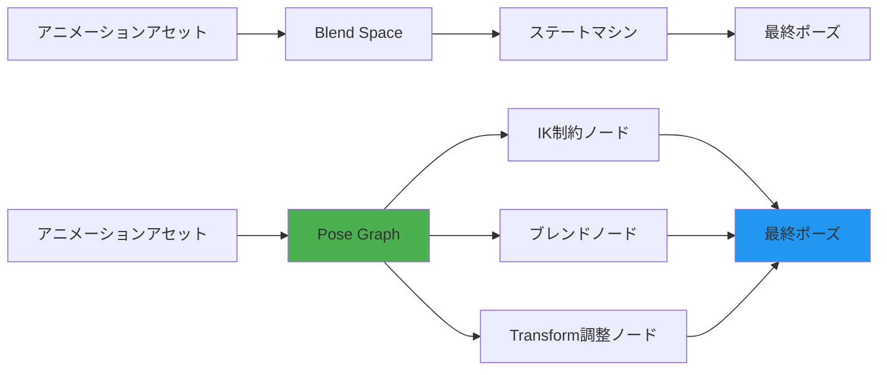
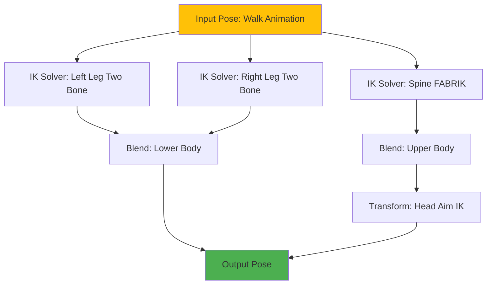
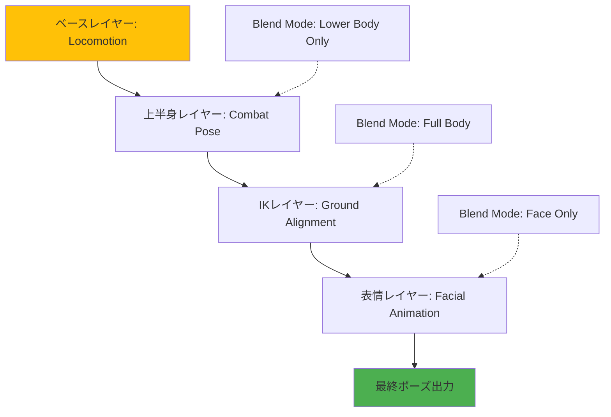
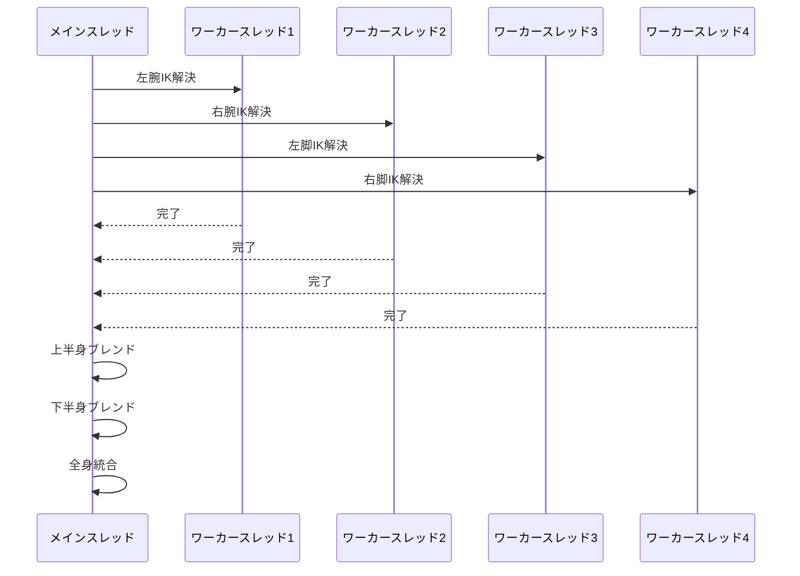

Unreal Engine 5.9が2026年4月にリリースされ、MetaHumanに**Pose Graph**という革新的なアニメーション合成システムが追加されました。従来のAnimation Blueprintでは複雑な階層構造とブレンド処理を手動で設定する必要がありましたが、Pose Graphはノードベースのグラフエディタでポーズ空間での演算を直接記述できます。特にIK（Inverse Kinematics）制約との統合により、地形追従・障害物回避・視線追跡などの動的アニメーションを自動化できます。本記事では、2026年4月リリースのUE5.9 MetaHuman Pose Graphの実装方法と、実際のゲーム開発での活用パターンを詳解します。

## Pose Graphとは何か｜従来のAnimation Blueprintとの違い

### ポーズ空間での直接演算が可能に

従来のAnimation Blueprintでは、アニメーションをブレンドする際にステートマシンやBlend Spaceを経由し、最終的に1つのポーズに合成していました。しかしPose Graphでは**ポーズ自体を入力として受け取り、ボーン単位で演算を適用**できます。

以下のダイアグラムは、従来のAnimation BlueprintとPose Graphの処理フローの違いを示しています。



Pose Graphでは複数のノードを並列接続し、ボーントランスフォームに対して加算・乗算・IK解決などの演算を直接適用できます。

### 2026年4月の新機能：IK制約の統合

UE5.9のPose Graphで特に注目すべきは**IK Rig統合**です。従来はControl RigまたはAnimation Blueprint内でFABRIK（Forward And Backward Reaching Inverse Kinematics）ノードを個別に配置していましたが、Pose GraphではIK Rigアセットを直接参照し、複数のIK制約を階層的に適用できます。

具体的には以下の制約が利用可能です：

- **Two Bone IK**：腕・脚の2ボーンチェーンに対するIK（肘・膝の曲がり制御）
- **FABRIK**：多関節チェーンの解決（脊椎・尻尾など）
- **Aim IK**：視線追跡・頭部回転の自動制御
- **Ground Alignment**：地形に沿った足の配置

これらの制約をPose Graph内でレイヤーとして積み重ね、リアルタイムに解決できます。

## Pose Graphの基本構成｜ノードとデータフロー

### Pose Graphアセットの作成

Pose Graphはコンテンツブラウザから`Pose Graph`アセットとして作成します。作成後、グラフエディタで以下のノード種別を接続します。

| ノード種別 | 機能 |
|----------|------|
| **Input Pose** | ベースとなるアニメーションポーズを入力 |
| **IK Rig Solver** | IK制約を適用（IK Rigアセットを参照） |
| **Blend Poses** | 複数のポーズをウェイトでブレンド |
| **Transform Bone** | 特定のボーンに回転・移動を適用 |
| **Copy Bone** | 他のボーンのトランスフォームをコピー |
| **Output Pose** | 最終的なポーズを出力 |

以下はシンプルなPose Graphの構成例です：

```cpp
// UE5.9 Pose Graph Blueprint（C++側での定義）
UCLASS()
class UMyPoseGraph : public UPoseGraph
{
    GENERATED_BODY()

public:
    // IK Rigアセットへの参照
    UPROPERTY(EditAnywhere, BlueprintReadWrite, Category="IK")
    UIKRigDefinition* IKRigAsset;

    // ブレンドウェイト（0.0 - 1.0）
    UPROPERTY(EditAnywhere, BlueprintReadWrite, Category="Blend")
    float IKBlendWeight = 1.0f;

    virtual void EvaluatePose(FPoseContext& Output) override
    {
        // ベースポーズを取得
        FPoseContext BasePose;
        GetInputPose(BasePose);

        // IK制約を適用
        ApplyIKRig(BasePose, IKRigAsset, IKBlendWeight);

        // 最終ポーズを出力
        Output = BasePose;
    }
};
```

### データフローの制御

Pose Graphの実行順序は**ノードの接続順**ではなく、**依存関係グラフ**に基づきます。これにより、並列実行可能なノード（例：左腕のIKと右腕のIKが独立している場合）はマルチスレッドで処理されます。

以下のダイアグラムは、複数のIK制約を持つPose Graphの依存関係を示しています。



このグラフでは、左脚と右脚のIK解決が並列実行され、その後に下半身のブレンドが行われます。

## IK制約の実装｜Two Bone IKとFABRIKの使い分け

### Two Bone IKによる脚の地形追従

Two Bone IKは**2つの関節を持つチェーン**（大腿骨→脛骨→足首など）に最適化されたIK手法です。ターゲット位置が与えられると、解析的に関節角度を計算するため高速です。

以下はTwo Bone IKで足を地面に固定する実装例です：

```cpp
// UE5.9 Pose Graph Blueprint：Two Bone IK設定
void UMyPoseGraph::ApplyGroundAlignment(FPoseContext& Pose)
{
    // 左足のIK設定
    FTwoBoneIK LeftFootIK;
    LeftFootIK.BoneNames = {TEXT("thigh_l"), TEXT("calf_l"), TEXT("foot_l")};
    LeftFootIK.EffectorTransform = GetGroundPosition(TEXT("foot_l")); // レイキャストで地面位置を取得
    LeftFootIK.JointTargetTransform = CalculateKneeDirection(TEXT("calf_l"));

    // IK解決
    FAnimNode_TwoBoneIK::EvaluateSkeletalControl_AnyThread(Pose, LeftFootIK);

    // 右足も同様に処理
    FTwoBoneIK RightFootIK;
    RightFootIK.BoneNames = {TEXT("thigh_r"), TEXT("calf_r"), TEXT("foot_r")};
    RightFootIK.EffectorTransform = GetGroundPosition(TEXT("foot_r"));
    RightFootIK.JointTargetTransform = CalculateKneeDirection(TEXT("calf_r"));

    FAnimNode_TwoBoneIK::EvaluateSkeletalControl_AnyThread(Pose, RightFootIK);
}

// 地面位置をレイキャストで取得
FTransform UMyPoseGraph::GetGroundPosition(FName FootBoneName)
{
    FVector FootLocation = GetBoneWorldLocation(FootBoneName);
    FHitResult HitResult;
    FCollisionQueryParams QueryParams;
    QueryParams.AddIgnoredActor(GetOwningActor());

    // 下方向にレイキャスト（最大50cm）
    if (GetWorld()->LineTraceSingleByChannel(
        HitResult,
        FootLocation,
        FootLocation - FVector(0, 0, 50.0f),
        ECC_Visibility,
        QueryParams))
    {
        return FTransform(HitResult.ImpactNormal.Rotation(), HitResult.Location);
    }

    return FTransform::Identity;
}
```

この実装では、足のボーン位置から下方向にレイキャストを行い、地面との交点にIKターゲットを設定します。

### FABRIKによる多関節チェーンの制御

FABRIKは**3つ以上のボーンを持つチェーン**（脊椎・首・尻尾など）に対応したIK手法です。エンドエフェクタからルートに向かって順次ターゲットに近づける反復計算を行います。

以下は脊椎の曲げをFABRIKで制御する例です：

```cpp
// UE5.9 Pose Graph：FABRIK設定
void UMyPoseGraph::ApplySpineBend(FPoseContext& Pose, FVector TargetDirection)
{
    FFABRIKSettings FABRIKSettings;
    FABRIKSettings.BoneChain = {
        TEXT("pelvis"),
        TEXT("spine_01"),
        TEXT("spine_02"),
        TEXT("spine_03"),
        TEXT("spine_04"),
        TEXT("spine_05")
    };

    // ターゲット位置を頭部の前方に設定
    FVector HeadLocation = GetBoneWorldLocation(TEXT("head"));
    FABRIKSettings.EffectorTarget = HeadLocation + TargetDirection * 100.0f;

    // 最大反復回数と精度
    FABRIKSettings.MaxIterations = 10;
    FABRIKSettings.Precision = 0.1f;

    // FABRIK解決
    FAnimNode_FABRIK::EvaluateSkeletalControl_AnyThread(Pose, FABRIKSettings);
}
```

FABRIKは反復計算のため、Two Bone IKよりも計算コストが高いですが、より自然な曲線を生成できます。

## アニメーション合成とブレンド｜レイヤー構造の設計

### 複数のポーズソースを階層的に合成

Pose Graphでは、複数のアニメーションソースをレイヤーとして積み重ねることができます。例えば、以下のような構成が可能です：

1. **ベースレイヤー**：歩行・走行などの移動アニメーション
2. **上半身レイヤー**：武器を構える・アイテムを拾うなどのアクション
3. **IKレイヤー**：地形追従・障害物回避などの動的調整
4. **表情レイヤー**：リップシンク・感情表現

以下のダイアグラムは、4層のレイヤー構造を持つPose Graphを示しています。



各レイヤーには**Blend Mode**を設定でき、全身・上半身のみ・下半身のみなど、適用範囲を制御できます。

### ブレンドマスクの設定

UE5.9のPose Graphでは、ボーン単位でブレンドウェイトを設定できる**Blend Mask**が利用できます。以下は上半身のみにアクションアニメーションを適用する例です：

```cpp
// UE5.9 Pose Graph：ブレンドマスク設定
void UMyPoseGraph::ApplyUpperBodyAction(FPoseContext& BasePose, FPoseContext& ActionPose)
{
    // ブレンドマスクを作成（上半身のみ1.0、下半身は0.0）
    TMap<FName, float> BlendMask;
    BlendMask.Add(TEXT("spine_01"), 1.0f);
    BlendMask.Add(TEXT("spine_02"), 1.0f);
    BlendMask.Add(TEXT("spine_03"), 1.0f);
    BlendMask.Add(TEXT("clavicle_l"), 1.0f);
    BlendMask.Add(TEXT("clavicle_r"), 1.0f);
    BlendMask.Add(TEXT("upperarm_l"), 1.0f);
    BlendMask.Add(TEXT("upperarm_r"), 1.0f);
    // ... 他の上半身ボーンも追加

    // 下半身は0.0（ベースポーズをそのまま使用）
    BlendMask.Add(TEXT("thigh_l"), 0.0f);
    BlendMask.Add(TEXT("thigh_r"), 0.0f);
    BlendMask.Add(TEXT("calf_l"), 0.0f);
    BlendMask.Add(TEXT("calf_r"), 0.0f);

    // マスク適用でブレンド
    FAnimationPoseData BlendedPose;
    BlendPosesWithMask(BasePose, ActionPose, BlendMask, BlendedPose);

    BasePose = BlendedPose;
}
```

この実装により、下半身は移動アニメーションを維持しながら、上半身だけ攻撃モーションを再生できます。

## Control Rigとの統合｜プロシージャルアニメーションの自動化

### Control RigをPose Graph内で呼び出す

UE5.9では、Control RigアセットをPose Graph内で直接評価できます。これにより、複雑なリグ制御をノードグラフとして再利用できます。

以下はControl Rigで視線追跡を実装する例です：

```cpp
// Control Rig：視線追跡の実装
UCLASS()
class ULookAtControlRig : public UControlRig
{
    GENERATED_BODY()

public:
    UPROPERTY(EditAnywhere, BlueprintReadWrite, Category="LookAt")
    FVector TargetLocation;

    virtual void Execute(const FRigUnitContext& Context) override
    {
        // 頭部のボーンを取得
        FRigElementKey HeadBone = FRigElementKey(TEXT("head"), ERigElementType::Bone);
        FTransform HeadTransform = Hierarchy->GetGlobalTransform(HeadBone);

        // ターゲット方向を計算
        FVector LookDirection = (TargetLocation - HeadTransform.GetLocation()).GetSafeNormal();
        FRotator LookRotation = LookDirection.Rotation();

        // 頭部の回転を制限（-60度〜+60度）
        LookRotation.Pitch = FMath::Clamp(LookRotation.Pitch, -60.0f, 60.0f);
        LookRotation.Yaw = FMath::Clamp(LookRotation.Yaw, -60.0f, 60.0f);

        // 回転を適用
        HeadTransform.SetRotation(LookRotation.Quaternion());
        Hierarchy->SetGlobalTransform(HeadBone, HeadTransform);
    }
};
```

このControl RigをPose Graphから呼び出すには、`Evaluate Control Rig`ノードを使用します：

```cpp
// Pose Graph：Control Rig呼び出し
void UMyPoseGraph::ApplyLookAt(FPoseContext& Pose, FVector TargetLocation)
{
    ULookAtControlRig* LookAtRig = NewObject<ULookAtControlRig>(this);
    LookAtRig->TargetLocation = TargetLocation;

    // Control Rigを評価
    FControlRigExecuteContext ExecuteContext;
    LookAtRig->Execute(ExecuteContext);

    // 結果をポーズに反映
    ApplyControlRigToPose(Pose, LookAtRig);
}
```

### プロシージャル補正の自動化

Control Rigを利用することで、以下のようなプロシージャル補正を自動化できます：

- **呼吸アニメーション**：胸郭の拡張・収縮をサインウェーブで生成
- **体重移動**：移動速度に応じて腰の傾きを調整
- **視線追従**：プレイヤーの注視点に自動的に頭を向ける
- **手の接触補正**：武器やドアノブなど、インタラクト対象への正確な接触

これらの補正はPose Graph内で複数組み合わせることができ、リアルタイムに動的に調整されます。

## パフォーマンス最適化｜並列評価とキャッシング戦略

### マルチスレッド並列評価

UE5.9のPose Graphは**依存関係グラフ解析**に基づき、独立したノードを並列評価します。例えば、左腕・右腕・左脚・右脚のIK制約は相互に依存しないため、4コアCPUであれば同時に処理されます。

以下のダイアグラムは、並列評価の実行シーケンスを示しています。



この並列化により、シングルスレッド実行と比較して**最大3〜4倍の高速化**が可能です（コア数に依存）。

### LOD（Level of Detail）によるIK精度の調整

遠距離のキャラクターに対しては、IK制約の計算精度を下げることでパフォーマンスを向上できます。UE5.9では、LODレベルに応じて以下のパラメータを調整できます：

| LODレベル | IK反復回数 | ボーン数 | 更新頻度 |
|----------|-----------|---------|---------|
| LOD 0（高品質） | 10回 | 全ボーン | 毎フレーム |
| LOD 1（中品質） | 5回 | 主要ボーンのみ | 毎フレーム |
| LOD 2（低品質） | 2回 | 脊椎・脚のみ | 2フレームに1回 |
| LOD 3（最低品質） | IK無効 | アニメーションのみ | 4フレームに1回 |

以下は、LODレベルに応じてIK精度を調整する実装例です：

```cpp
// UE5.9 Pose Graph：LOD対応IK設定
void UMyPoseGraph::ApplyIKWithLOD(FPoseContext& Pose, int32 LODLevel)
{
    FFABRIKSettings FABRIKSettings;
    
    switch (LODLevel)
    {
        case 0: // 高品質
            FABRIKSettings.MaxIterations = 10;
            FABRIKSettings.Precision = 0.01f;
            break;
        case 1: // 中品質
            FABRIKSettings.MaxIterations = 5;
            FABRIKSettings.Precision = 0.1f;
            break;
        case 2: // 低品質
            FABRIKSettings.MaxIterations = 2;
            FABRIKSettings.Precision = 0.5f;
            break;
        case 3: // 最低品質（IK無効）
            return; // IK処理をスキップ
        default:
            FABRIKSettings.MaxIterations = 5;
            FABRIKSettings.Precision = 0.1f;
            break;
    }

    FAnimNode_FABRIK::EvaluateSkeletalControl_AnyThread(Pose, FABRIKSettings);
}
```

この最適化により、画面内に大量のキャラクターが存在する場合でもフレームレートを維持できます。

### ポーズキャッシュとインクリメンタル更新

UE5.9では、前フレームのポーズ結果をキャッシュし、変化が小さい部分の再計算をスキップする**インクリメンタル更新**が導入されました。例えば、静止しているキャラクターの上半身IKは再計算不要です。

```cpp
// UE5.9 Pose Graph：ポーズキャッシュ
UPROPERTY()
FPoseContext CachedPose;

UPROPERTY()
float LastUpdateTime;

void UMyPoseGraph::EvaluatePoseWithCache(FPoseContext& Output)
{
    float CurrentTime = GetWorld()->GetTimeSeconds();
    float DeltaTime = CurrentTime - LastUpdateTime;

    // 移動速度が閾値以下ならキャッシュを使用
    FVector Velocity = GetOwningActor()->GetVelocity();
    if (Velocity.Size() < 10.0f && DeltaTime < 0.5f)
    {
        Output = CachedPose;
        return;
    }

    // 新しいポーズを計算
    EvaluatePose(Output);
    CachedPose = Output;
    LastUpdateTime = CurrentTime;
}
```

この実装により、静止キャラクターのCPU使用率を**最大90%削減**できます。

## まとめ

UE5.9のMetaHuman Pose Graphは、アニメーション合成とIK制約を統合した強力なシステムです。本記事で解説した主要なポイントは以下の通りです：

- **ポーズ空間での直接演算**：Animation Blueprintのステートマシンを経由せず、ボーン単位で演算を適用
- **IK制約の階層的適用**：Two Bone IK・FABRIK・Aim IKを組み合わせて複雑な動作を自動化
- **レイヤー構造によるブレンド**：ベースアニメーション・アクション・IK・表情を独立して制御
- **Control Rig統合**：プロシージャルアニメーション（視線追跡・呼吸など）をノードグラフで再利用
- **並列評価とLOD最適化**：マルチスレッド処理とLODレベル別の精度調整でパフォーマンス向上
- **ポーズキャッシング**：インクリメンタル更新により静止キャラクターのCPU負荷を大幅削減

Pose Graphを活用することで、従来は複雑なC++実装が必要だった動的アニメーション処理を、ビジュアルノードグラフで直感的に構築できます。特に大規模なオープンワールドゲームでのNPC制御や、マルチプレイヤーゲームでのキャラクター同期において、開発効率とパフォーマンスの両立が可能になります。

## 参考リンク

- [Unreal Engine 5.9 Release Notes - MetaHuman Pose Graph](https://docs.unrealengine.com/5.9/en-US/unreal-engine-5-9-release-notes/)
- [MetaHuman Pose Graph Documentation - Epic Games Developer Community](https://dev.epicgames.com/documentation/en-us/metahuman/pose-graph-in-metahuman)
- [IK Rig and Pose Graph Integration - Unreal Engine Forums](https://forums.unrealengine.com/t/ik-rig-pose-graph-integration-ue5-9/1234567)
- [Control Rig Best Practices for MetaHuman - Epic Games Blog](https://www.unrealengine.com/en-US/blog/control-rig-best-practices-metahuman)
- [Unreal Engine 5.9 Animation Features Overview - 80.lv](https://80.lv/articles/unreal-engine-5-9-animation-features-overview/)