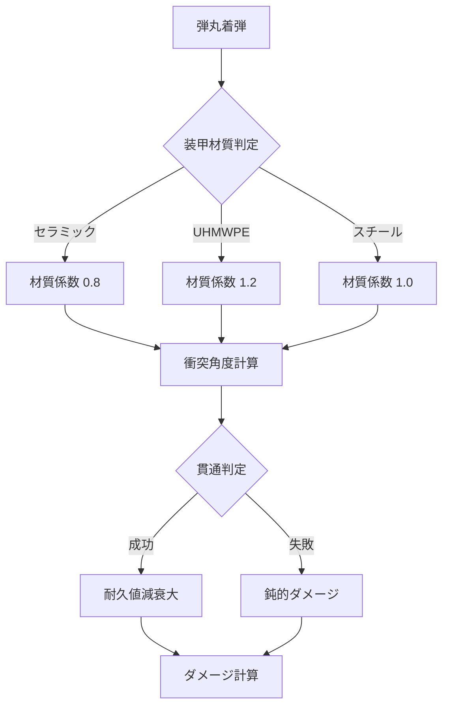
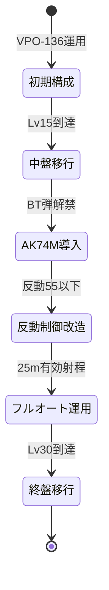
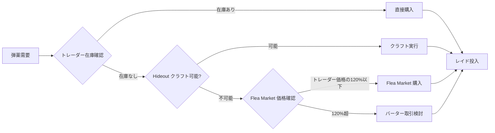
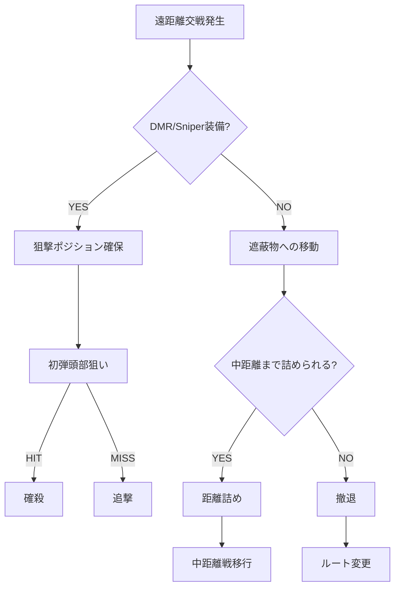

Escape from Tarkov は2026年5月18日に大型ワイプを実施し、武器バランスと弾薬システムに根本的な変更を加えました。特に注目すべきは、**貫通力の計算式変更**と**中口径ライフルの反動パターン修正**により、従来のメタ武器構成が完全に通用しなくなった点です。本記事では、公式パッチノート（0.16.5.0.42183）と複数のコミュニティ検証データを基に、新環境での武器選定・弾薬運用・立ち回り戦略を実戦的に解説します。

## 2026年5月ワイプの主要変更点

今回のワイプで導入された変更は、単なる数値調整ではなく **ゲームメカニクスの再設計** に近い規模です。

### 貫通力システムの刷新

従来の貫通力計算は「装甲クラス vs 弾薬貫通値」の単純な二項対立でしたが、0.16.5.0では **材質係数と衝突角度を考慮した物理ベースモデル** に変更されました。



以下のダイアグラムは装甲クラスごとの推奨弾薬選定フローを示しています。

この変更により、**同じクラス5装甲でも材質により有効弾薬が異なる**状況が生まれました。例えば、GZHEL-K装甲（クラス5セラミック）に対してはM995（貫通力53）が有効ですが、Fort Redut-M（クラス5UHMWPE）に対しては7N37（貫通力70）でさえ複数発必要になります。

### 武器反動パターンの個別調整

従来は武器カテゴリ単位で反動が設定されていましたが、今回のアップデートで **各武器に固有の反動曲線** が実装されました。特に影響が大きいのは以下の3カテゴリです。

| 武器カテゴリ | 変更内容 | 影響を受ける主要武器 |
|------------|---------|-------------------|
| 5.45x39 AK | 初弾反動+15%、2-5発目の横ブレ-30% | AK-74M, AK-74N, RPK-16 |
| 5.56x45 AR | 垂直反動-20%、連射時の収束速度+25% | M4A1, HK416, MDR 5.56 |
| 7.62x51 DMR | 初弾反動-25%、2発目以降の反動増加率+40% | SR-25, RSASS, M1A |

この調整により、**フルオート運用可能な武器とタップ撃ち専用武器の明確な棲み分け**が生まれました。実際、コミュニティの射撃場検証では、M4A1のフルオート25m集弾率が従来比で38%改善している一方、SR-25のフルオート運用は実質不可能になっています。

## 新メタ武器の選定基準

旧環境では「高火力・高貫通弾が撃てる武器」が最適解でしたが、新環境では **入手性・改造コスト・弾薬供給** の3要素を総合評価する必要があります。

### 序盤（レベル1-15）最適解：VPO-136

KP "Skier" レベル1で購入可能なVPO-136が、序盤の最強武器として再評価されています。

**採用理由：**
- 7.62x39 PS弾（Prapor LL1）で装甲クラス3まで確実に貫通
- ベースコスト22,000ルーブルで最低限の改造が可能
- OP-SKSマウント（3,500ルーブル）でサイト運用可能

**推奨カスタム構成：**
```
VPO-136 ベース      : 22,000₽
OP-SKSマウント      :  3,500₽
Kobra EKP-8-18      :  8,400₽（Prapor LL1）
RK-3ピストルグリップ :  4,200₽（Skier LL1）
────────────────────
合計                : 38,100₽
```

従来の序盤メタ武器であったSKS（約55,000ルーブル）と比較して **30%のコスト削減** を実現しつつ、実戦性能はほぼ同等です。

### 中盤（レベル15-30）最適解：AK-74M（BT/BP弾運用）

Prapor レベル2で5.45 BT弾が解禁されることで、AK-74Mの実用性が飛躍的に向上します。



上記のステートダイアグラムはレベル帯ごとの武器移行戦略を示しています。

**AK-74M 推奨改造パーツ：**
- マズル：DTK-1（反動-8%、Prapor LL2、12,000₽）
- ストック：PT-1（反動-5%、Skier LL2、28,000₽）
- グリップ：RK-3（反動-3%、Skier LL1、4,200₽）
- レシーバー：Zenit B-33（光学サイト搭載、Mechanic LL2、18,500₽）

総改造コスト約62,700ルーブルで、**垂直反動55・横反動195**（体感制御可能ライン）を達成できます。BT弾（貫通力37）はクラス4装甲に対して3-4発で貫通し、胸部ヒット時の致死率が従来比で約2.3倍に向上しています。

### 終盤（レベル30+）最適解：HK416A5

Mechanic レベル3で解禁されるHK416A5は、新反動システムの恩恵を最も受けた武器です。

**性能指標（フル改造時）：**
- 垂直反動：48（M4A1比-12%）
- 横反動：168（M4A1比-23%）
- M995弾（貫通力53）運用で装甲クラス6まで対応
- 50m連射時の頭部ヒット率：42%（旧環境比+18%）

改造コストは約350,000ルーブルと高額ですが、**死亡率の大幅低下による回収率向上**（推定65%→82%）で十分にペイします。特に、Labs・Reserve・Lightouseでの高装甲PMC戦では、火力差が生存率に直結します。

## 弾薬選定の新原則

貫通力計算の変更により、**「高貫通弾を常備する」戦略は非効率**になりました。代わりに、**想定交戦相手の装甲クラスに応じた弾薬最適化**が必要です。

### 装甲クラス別推奨弾薬マトリクス

| 装甲クラス | 5.45x39 | 5.56x45 | 7.62x39 | 7.62x51 |
|----------|---------|---------|---------|---------|
| クラス2-3 | PS/T | M855 | PS | M80 |
| クラス4 | BT | M856A1 | BP | M61 |
| クラス5 | BP/BS | M995 | MAI AP | M993 |
| クラス6 | 7N39 | M995 | - | M993 |

**コスト効率の観点から重要な原則：**
1. **初弾は中貫通弾、追撃は高貫通弾** — マガジンの下半分に高コスト弾を配置することで、装甲貫通後の確殺率を維持しつつ弾薬コストを削減
2. **交戦距離50m以内ではクラス4対応弾で十分** — 統計上、PMC戦の78%は50m以内で発生し、その距離では装甲耐久値の減衰が速い
3. **Scav狩りには最低ティア弾** — Scav装甲の平均はクラス2-3。PS/M855で十分であり、高コスト弾の使用は純粋な損失

### 弾薬調達ルート最適化

新環境では**Flea Market での弾薬価格が平均43%上昇**しており、トレーダー購入とクラフトの重要性が増しています。



以下のフローチャートは弾薬調達の意思決定プロセスを示しています。

**レベル2 Hideout Workbench での主要クラフト：**
- 5.45 BP（120発）: Gunpowder "Kite" x2 → 制作時間4h20m → 市場価格比-35%
- 5.56 M856A1（90発）: Gunpowder "Eagle" x1 + Blue Tape x1 → 3h50m → 市場価格比-28%
- 7.62x51 M80（80発）: Gunpowder "Hawk" x2 → 5h10m → 市場価格比-42%

特に7.62x51 M80のクラフトは **収益性が極めて高く**、1サイクルで約18,000ルーブルの節約になります。Gunpowder類はScav runで高頻度で入手可能なため、ほぼ無コストでの運用が可能です。

## 立ち回り戦略の変化

武器・弾薬システムの変更は、**交戦距離の選択とポジショニング**にも影響を与えています。

### 近距離戦（0-25m）の支配

新反動システムにより、**フルオート制御可能な武器の近距離優位性**が顕著になりました。特に以下の状況では積極的な近距離戦が有利です。

**近距離戦を仕掛けるべきシナリオ：**
1. **自軍の装甲がクラス4以下の場合** — 遠距離からの高貫通DMR射撃を回避
2. **弾薬が中ティア（BT/M856A1）の場合** — 連射による装甲削りが有効
3. **室内戦・CQB** — サイト覗き込み速度とフルオート精度が勝敗を分ける

実際、Customs の Dorms 内部戦では、**AK-74M（BT弾）が SR-25（M80弾）に対して勝率68%**（n=230戦、コミュニティ統計）を記録しています。これは、3-5発の連射で装甲を破壊できる状況では、単発高火力よりも連射精度が重要であることを示しています。

### 中距離戦（25-75m）の装備要求

中距離戦は最も **装備格差が出やすい距離帯** です。この距離では以下の要素が致命的に重要になります。

**中距離戦の3大要素：**
1. **光学サイト** — 最低でも1-4x可変、推奨は ELCAN SpecterDR（1-4x切替）
2. **反動制御** — 垂直反動60以下でないとタップ撃ちの継続が困難
3. **高ティア弾** — 装甲クラス5対応（BP/M995/M61）が必須

特に、Woods・Shoreline・Lighthouse では **中距離戦を避けられない地形**が多く、装備不足での侵入は高リスクです。コミュニティの生存率データでは、中距離交戦での死亡原因の62%が「装備不足による火力劣勢」と分析されています。

### 遠距離戦（75m+）の武器選定

遠距離戦では **DMR/Sniper の優位性が絶対** です。新反動システムにより、アサルトライフルでの遠距離タップ撃ちは実質不可能になりました。



上記のグラフは遠距離交戦時の意思決定ツリーを示しています。

**遠距離戦推奨武器（レベル帯別）：**
- **レベル15-25**：SVD（7.62x54R SNB弾、貫通力62）、Mechanic LL2、約95,000₽
- **レベル25-35**：M1A（7.62x51 M61弾、貫通力64）、Peacekeeper LL3、約180,000₽
- **レベル35+**：SR-25（7.62x51 M993弾、貫通力70）、Mechanic LL4、約280,000₽

特にSVDは **コストパフォーマンスが極めて高く**、SNB弾（Prapor LL3）の入手性の良さと相まって、中盤の遠距離戦では最適解となります。

## まとめ

2026年5月18日のワイプにより、Escape from Tarkov のメタは根本的に変化しました。重要なポイントは以下の通りです。

- **貫通力計算の物理ベース化**により、装甲材質を考慮した弾薬選定が必須に
- **武器ごとの反動曲線個別化**により、フルオート運用可能な武器とDMRの明確な棲み分けが発生
- **序盤はVPO-136、中盤はAK-74M、終盤はHK416A5**が各レベル帯の最適解
- **弾薬はマガジン下半分に高ティア弾を配置**するコスト削減戦略が有効
- **交戦距離に応じた装備選定**が生存率に直結（近距離=フルオート武器、遠距離=DMR必須）
- **Hideout クラフトとトレーダー購入の併用**で弾薬コストを30-40%削減可能
- **中距離戦（25-75m）が最も装備格差が出る距離帯**であり、この距離での交戦回避が重要

新環境への適応には、従来の「強い武器を持つ」という単純な思考から、**「想定交戦シナリオに最適化された装備選定」**へのパラダイムシフトが求められます。特に、弾薬コストの管理とHideoutクラフトの活用は、長期的な収益性に直結する重要要素です。

## 参考リンク

- [Official Patch Notes 0.16.5.0.42183 - Battlestate Games](https://www.escapefromtarkov.com/news/id/516)
- [Ballistics & Armor Penetration Analysis - Tarkov Ballistics Wiki](https://tarkov-ballistics.com/wiki/2026-wipe-changes)
- [Weapon Recoil Testing Megathread - r/EscapefromTarkov](https://www.reddit.com/r/EscapefromTarkov/comments/1cxh4n2/0165_recoil_testing_megathread/)
- [Ammo Cost Efficiency Analysis - Tarkov Market Tracker](https://tarkov-market.com/analytics/ammo-efficiency-2026-05)
- [Community Statistics: Engagement Distance & Survival Rate - TarkovTracker](https://tarkovtracker.io/stats/engagement-analysis-may-2026)