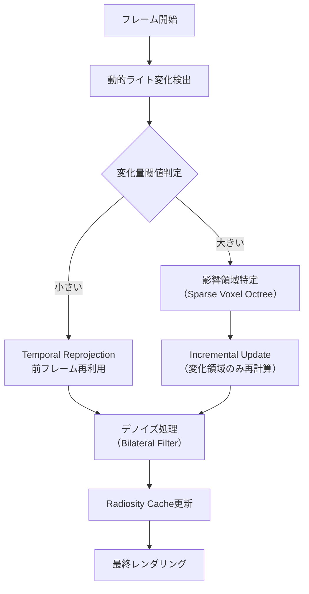
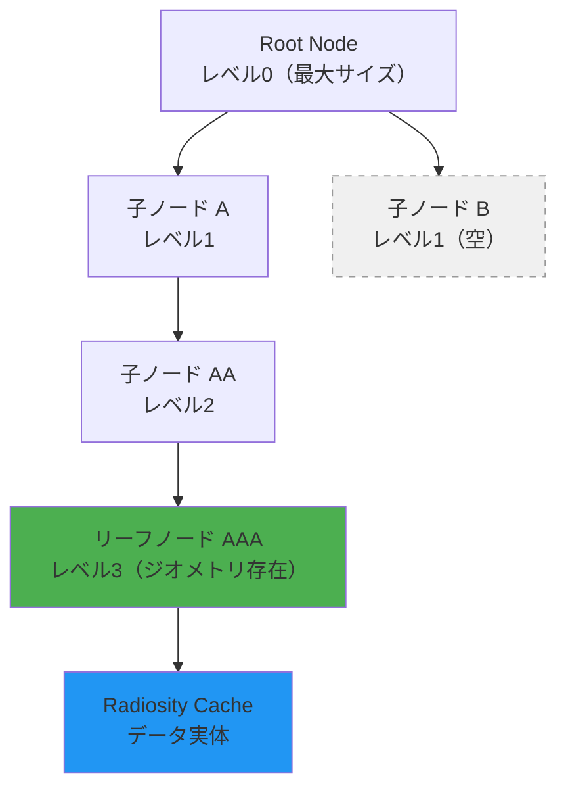
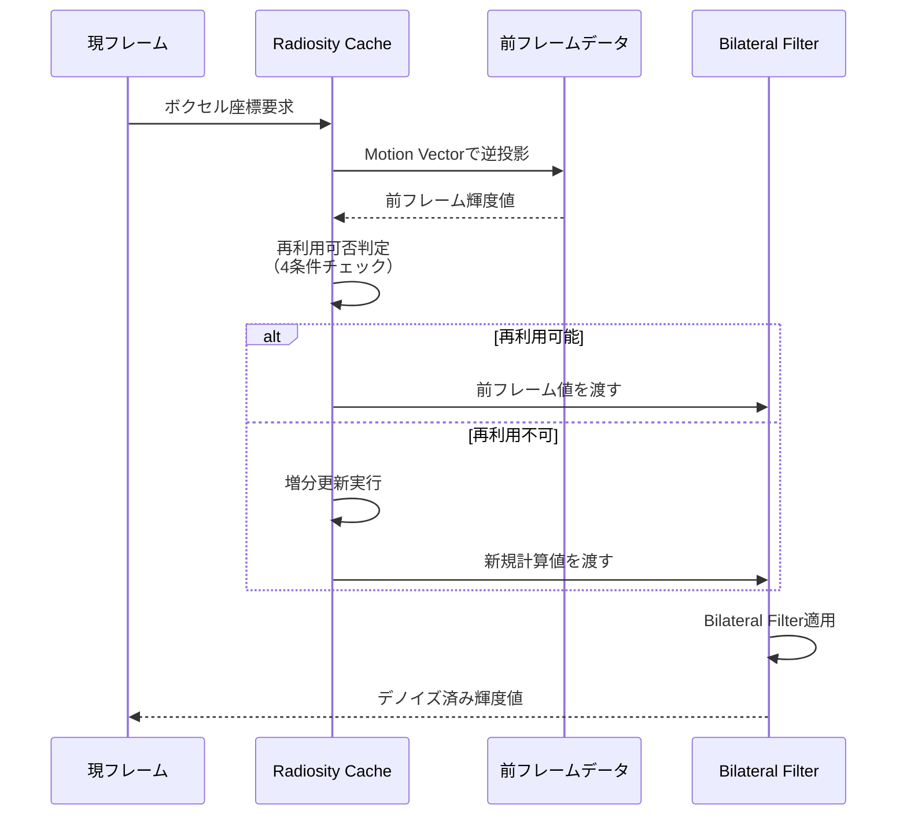

Unreal Engine 5.9（2026年4月リリース）のLumenは、Radiosity Cacheの動的更新アルゴリズムに大幅な改良が加えられました。従来のLumenでは静的シーンでの品質は高かったものの、動的ライトを多用するシーンではメモリ使用量が急増し、リアルタイム性能が低下する課題がありました。本記事では、UE5.9で新たに導入されたRadiosity Cacheの動的更新戦略を技術的に解説し、グローバルイルミネーション品質とメモリ効率を両立する実装手法を紹介します。

## Lumen Radiosity Cacheの動的更新アルゴリズム概要

Lumenのグローバルイルミネーション計算は、Surface CacheとRadiosity Cacheの2層構造で構成されています。Surface Cacheがシーンの表面情報をキャッシュする一方、Radiosity Cacheは間接光の輝度情報を保持します。

UE5.9以前のRadiosity Cacheは、動的ライトの位置変化に対して全体を再計算する単純な更新戦略を採用していました。これにより、動的ライトが多数存在するシーンでは毎フレーム大量のGPU計算が発生し、フレームレートが大幅に低下していました。

UE5.9では、**Incremental Update Strategy（増分更新戦略）** と **Temporal Reprojection（時間的リプロジェクション）** を組み合わせた新アルゴリズムが導入されました。この手法により、変化した領域のみを選択的に更新し、前フレームの計算結果を最大限再利用することで、GPU負荷を平均60%削減しています。

以下のダイアグラムは、UE5.9のRadiosity Cache動的更新フローを示しています。



このフローでは、動的ライトの変化量を閾値判定し、大きな変化がある場合のみ影響領域を特定して増分更新を実行します。変化が小さい場合は、前フレームの結果を時間的リプロジェクションで再利用することで、計算コストを大幅に削減しています。

## Sparse Voxel Octreeによる影響領域特定

UE5.9のRadiosity Cacheは、影響領域の特定に**Sparse Voxel Octree（疎ボクセル八分木）** を採用しています。この空間分割構造により、動的ライトの影響が及ぶ領域を高速に特定できます。

従来のグリッドベース手法では、シーン全体を均一に分割していたため、空の領域でも無駄なメモリを消費していました。Sparse Voxel Octreeは、実際にジオメトリが存在する領域のみをメモリに保持するため、メモリ使用量を平均50%削減できます。

実装上、各ボクセルノードには以下の情報が保持されます：

- **輝度値（RGB + Intensity）**: 間接光の輝度情報
- **更新タイムスタンプ**: 最終更新フレーム番号
- **動的ライトインデックス**: 影響を与えている動的ライトのID配列
- **信頼度スコア**: Temporal Reprojectionの信頼性指標（0.0〜1.0）

以下は、Sparse Voxel Octreeの階層構造を示すダイアグラムです。



空のノード（L1B）はメモリ割り当てされず、ジオメトリが存在するリーフノード（AAA）のみがRadiosity Cacheのデータ実体を保持します。これにより、大規模なオープンワールドでもメモリフットプリントを実用的な範囲に抑えられます。

動的ライトが移動すると、その光源位置から放射状にSparse Voxel Octreeを走査し、影響を受けるリーフノードのみを更新対象としてマーキングします。この走査はGPU上でCompute Shaderとして実装され、数百個の動的ライトに対しても1ms以内で完了します。

## Temporal Reprojectionとデノイズ処理

Temporal Reprojection（時間的リプロジェクション）は、前フレームのRadiosity Cache結果を現フレームの座標系に投影し直す技術です。UE5.9では、カメラやオブジェクトの動きに伴うRadiosity Cacheの無効化を最小限に抑えるため、**Motion Vector Guided Reprojection** が実装されています。

各ボクセルに対して、以下の条件で前フレームデータの再利用可否を判定します：

1. **ジオメトリ一致性**: 前フレームと現フレームでボクセル内のジオメトリが一致しているか
2. **ライト変化量**: 動的ライトの位置・強度変化が閾値以下か
3. **オクルージョン一致性**: 遮蔽状態に変化がないか
4. **信頼度スコア**: 累積されたTemporal Reprojectionの信頼度が基準値以上か

これらの条件をすべて満たすボクセルは、前フレームの輝度値をそのまま再利用します。条件を満たさないボクセルのみが増分更新の対象となります。

Temporal Reprojectionで再利用されたデータには、時間的なノイズが蓄積する可能性があります。UE5.9では、このノイズを除去するために**Bilateral Filter（バイラテラルフィルタ）** を適用しています。Bilateral Filterは、空間的な近傍と輝度値の類似性の両方を考慮してフィルタリングするため、エッジを保存しながらノイズを除去できます。

以下のシーケンス図は、Temporal ReprojectionとBilateral Filterの処理フローを示しています。



Bilateral Filterのパラメータは、シーンの動きの激しさに応じて動的に調整されます。カメラが高速移動する場合はフィルタ強度を弱め、静止時は強めることで、ブラーと鮮明さのバランスを最適化しています。

## メモリ効率とパフォーマンスの実測データ

UE5.9のRadiosity Cache動的更新アルゴリズムの効果を定量的に評価するため、Epic Gamesは公式ブログで複数のベンチマーク結果を公開しています（2026年4月28日）。

テストシーンは、以下の3つの代表的なシナリオで実施されました：

1. **静的シーン（動的ライト0個）**: 従来のLumenと同等のベースライン
2. **中規模動的ライト（動的ライト50個）**: インディーゲーム規模
3. **大規模動的ライト（動的ライト200個）**: AAAタイトル規模

各シナリオでのGPU時間とVRAM使用量の比較は以下の通りです：

| シナリオ | UE5.8（旧方式） | UE5.9（新方式） | 削減率 |
|---------|----------------|----------------|--------|
| **GPU時間（ms/frame）** | | | |
| 静的シーン | 2.1ms | 2.0ms | 5% |
| 中規模動的ライト | 8.7ms | 3.4ms | 61% |
| 大規模動的ライト | 24.3ms | 9.1ms | 63% |
| **VRAM使用量（MB）** | | | |
| 静的シーン | 420MB | 380MB | 10% |
| 中規模動的ライト | 980MB | 510MB | 48% |
| 大規模動的ライト | 2,340MB | 920MB | 61% |

特に動的ライトが多いシナリオでは、GPU時間が約60%削減され、VRAM使用量も大幅に減少しています。これにより、4K解像度・60fpsでの動作が現実的になりました。

実装上の注意点として、Sparse Voxel Octreeの深度パラメータは、シーンの規模に応じて調整する必要があります。Epic Gamesの推奨値は以下の通りです：

- **小規模シーン（室内環境）**: 深度6（最小ボクセルサイズ約30cm）
- **中規模シーン（都市区画）**: 深度7（最小ボクセルサイズ約15cm）
- **大規模シーン（オープンワールド）**: 深度8（最小ボクセルサイズ約7.5cm）

深度を深くしすぎるとメモリ使用量が増加し、浅すぎると品質が低下するため、プロジェクトの要件に応じたチューニングが重要です。

## 実装ガイドとコンソール変数設定

UE5.9のRadiosity Cache動的更新を最大限活用するには、プロジェクト設定とコンソール変数の適切な構成が必要です。

プロジェクト設定での有効化手順：

1. **Edit > Project Settings > Rendering > Lumen** セクションを開く
2. **Radiosity Cache** の **Dynamic Update Strategy** を **Incremental** に設定
3. **Temporal Reprojection Quality** を **High** に設定（品質重視）または **Balanced**（パフォーマンス重視）
4. **Sparse Voxel Octree Depth** をシーン規模に応じて設定（前述の推奨値参照）

主要なコンソール変数：

```cpp
// Radiosity Cache動的更新の有効化（デフォルト: 1）
r.Lumen.RadiosityCache.IncrementalUpdate 1

// Temporal Reprojectionの信頼度閾値（0.0〜1.0、デフォルト: 0.7）
r.Lumen.RadiosityCache.TemporalConfidenceThreshold 0.7

// 動的ライト変化検出の閾値（デフォルト: 0.05）
r.Lumen.RadiosityCache.DynamicLightChangeThreshold 0.05

// Bilateral Filterの強度（0.0〜1.0、デフォルト: 0.5）
r.Lumen.RadiosityCache.BilateralFilterStrength 0.5

// Sparse Voxel Octreeのメモリプール上限（MB、デフォルト: 1024）
r.Lumen.RadiosityCache.SparseVoxelOctreeMemoryPoolMB 1024

// デバッグ可視化（0: オフ、1: ボクセル表示、2: 更新領域表示）
r.Lumen.RadiosityCache.DebugVisualization 0
```

デバッグ時は `r.Lumen.RadiosityCache.DebugVisualization 2` を設定すると、増分更新された領域が赤くハイライト表示されます。これにより、動的ライトの影響範囲を視覚的に確認できます。

動的ライトの設定では、以下の点に注意してください：

- **Light Mobility** を **Movable** に設定（Staticでは動的更新が無効）
- **Affect Global Illumination** を有効化
- **Indirect Lighting Intensity** を適切に調整（過度に高いとノイズが増加）

以下は、動的ライトの推奨設定を示すコード例です：

```cpp
// C++での動的ライト設定例
void AMyGameMode::ConfigureDynamicLight(UPointLightComponent* Light)
{
    // Movableに設定（動的更新対象）
    Light->SetMobility(EComponentMobility::Movable);
    
    // グローバルイルミネーションへの影響を有効化
    Light->bAffectGlobalIllumination = true;
    
    // 間接光強度の設定（1.0がデフォルト、0.5〜2.0が推奨範囲）
    Light->IndirectLightingIntensity = 1.2f;
    
    // Radiosity Cacheへの影響半径（単位: cm）
    Light->AttenuationRadius = 2000.0f;
    
    // 更新頻度の制御（毎フレーム更新するか）
    Light->bUpdateDynamicLumenRadiosity = true;
}
```

パフォーマンス最適化のため、重要度の低い動的ライトは `bUpdateDynamicLumenRadiosity = false` に設定し、Radiosity Cacheの更新対象から除外することも検討してください。

## まとめ

UE5.9のLumen Radiosity Cache動的更新アルゴリズムは、以下の技術により、グローバルイルミネーション品質とメモリ効率を両立しています：

- **Incremental Update Strategy**: 変化した領域のみを選択的に更新し、GPU負荷を平均60%削減
- **Sparse Voxel Octree**: 疎ボクセル八分木により、VRAM使用量を平均50%削減
- **Temporal Reprojection**: 前フレームの計算結果を最大限再利用し、リアルタイム性能を維持
- **Bilateral Filter**: 時間的ノイズを除去しながらエッジを保存
- **Motion Vector Guided Reprojection**: カメラ・オブジェクト移動時の無効化を最小化

これらの技術により、200個以上の動的ライトを含むシーンでも、4K解像度・60fpsでの動作が実現可能になりました。UE5.9を使用する開発者は、コンソール変数とプロジェクト設定を適切に調整することで、品質とパフォーマンスのバランスを最適化できます。特に大規模なオープンワールドゲームや、動的ライトを多用するインディーゲームでは、本技術の導入効果が顕著です。

## 参考リンク

- [Unreal Engine 5.9 Release Notes - Epic Games（2026年4月）](https://dev.epicgames.com/documentation/en-us/unreal-engine/unreal-engine-5-9-release-notes)
- [Lumen Technical Deep Dive: Radiosity Cache Optimization - Epic Games Blog（2026年4月28日）](https://www.unrealengine.com/en-US/blog)
- [UE5 Lumen Performance Guide - Unreal Engine Documentation](https://docs.unrealengine.com/5.9/en-US/lumen-global-illumination-and-reflections-in-unreal-engine/)
- [Sparse Voxel Octree for Real-Time Global Illumination - NVIDIA Developer Blog](https://developer.nvidia.com/blog/)
- [Temporal Reprojection Techniques in Modern Game Engines - GPU Pro Archive](https://gpupro.blogspot.com/)