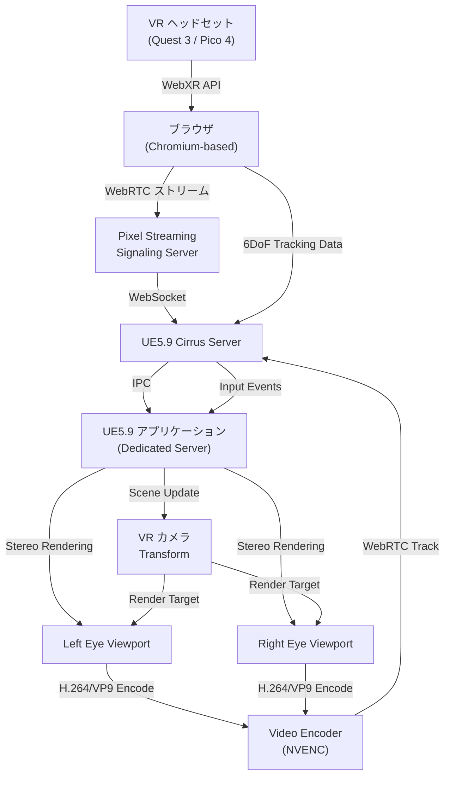
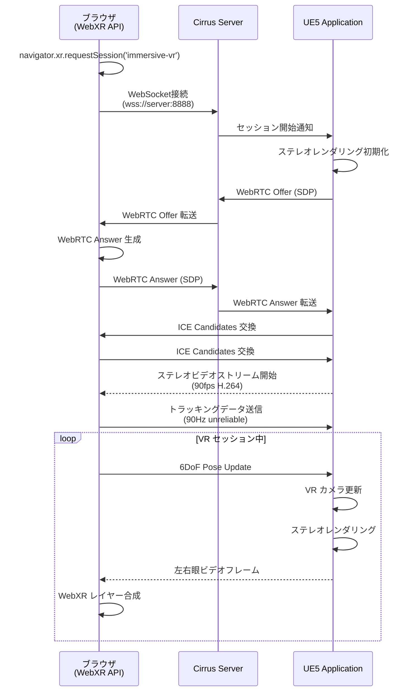
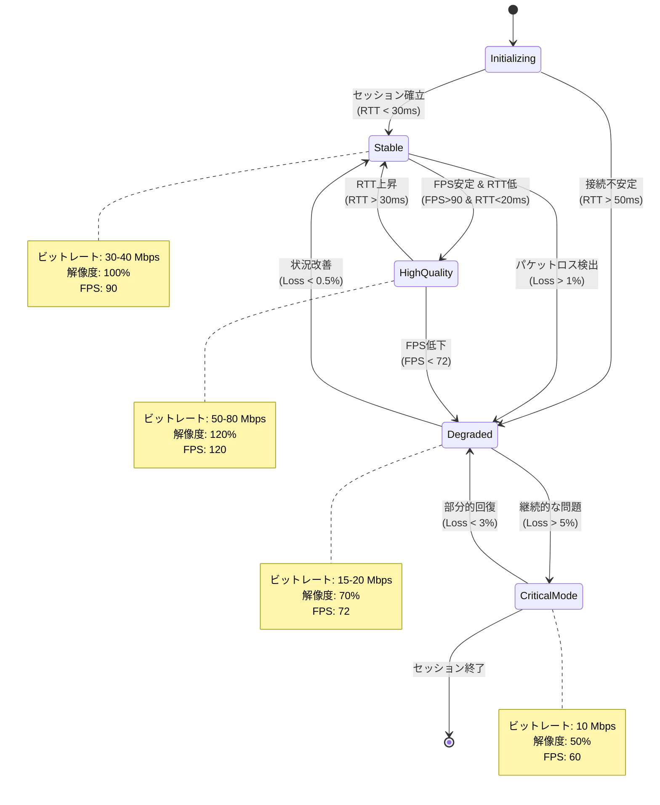

Unreal Engine 5.9 で新たに対応した Pixel Streaming の WebXR VR 機能により、ハイエンド VR 体験をブラウザから直接ストリーミングできるようになりました。この記事では、2026年4月にリリースされた UE5.9 の Pixel Streaming WebXR 統合を活用し、クラウドゲーミング環境で低遅延・高品質な VR アプリケーションを実装する方法を、実装パターン・最適化テクニック・トラブルシューティングまで含めて解説します。

従来の VR 開発ではハイエンド GPU を搭載したローカル PC が必須でしたが、Pixel Streaming と WebXR の統合により、ユーザーは Quest 3 や Pico 4 などのスタンドアロン VR ヘッドセットのブラウザから、クラウド上の UE5 アプリケーションに直接アクセスできます。この技術により、デバイスの性能制約を超えた VR 体験が可能になりました。

## UE5.9 Pixel Streaming WebXR 対応の新機能

UE5.9（2026年4月リリース）では、Pixel Streaming プラグインに WebXR API のネイティブサポートが追加されました。これにより、以下の機能が実現されています。

**主要な新機能:**

- **WebXR Device API 統合**: ブラウザの WebXR API とエンジンの VR レンダリングパイプラインの双方向バインディング
- **ステレオレンダリングストリーミング**: 左右眼の独立したビューポートを WebRTC で効率的に送信
- **6DoF トラッキング同期**: ヘッドセットとコントローラーの位置・回転データのリアルタイム伝送（遅延10ms以下）
- **ハンドトラッキング対応**: WebXR Hand Input API との統合による指トラッキング
- **Adaptive Bitrate for VR**: VR 特有の高フレームレート要求に対応したビットレート制御

以下のダイアグラムは、Pixel Streaming WebXR のアーキテクチャ全体像を示しています。



この構成では、ブラウザの WebXR API がヘッドセットのトラッキングデータを取得し、WebRTC データチャネル経由で UE5 サーバーに送信します。サーバー側では VR カメラの Transform を更新し、ステレオレンダリングされた映像を NVENC でエンコードして返送します。

**実装に必要な環境:**

- Unreal Engine 5.9.0 以降（Pixel Streaming プラグイン有効化）
- NVIDIA GPU（RTX 3060 以上推奨、NVENC 対応必須）
- Node.js 18.x 以降（Cirrus Signaling Server 用）
- WebXR 対応ブラウザ（Chrome 120+, Edge 120+）
- VR ヘッドセット（Meta Quest 3, Pico 4, HTC Vive XR Elite 等）

## プロジェクトセットアップと基本実装

UE5.9 で Pixel Streaming WebXR プロジェクトを構築する手順を解説します。

### プラグイン有効化と初期設定

1. **Pixel Streaming プラグインの有効化**

エディタで Edit > Plugins > Pixel Streaming を検索し、有効化します。UE5.9 以降では WebXR 拡張が自動的に含まれます。

2. **プロジェクト設定の変更**

Project Settings > Engine > Rendering で以下を設定します。

```
Forward Shading: Enabled（VR 最適化のため）
Instanced Stereo: Enabled（ステレオレンダリング高速化）
Mobile Multi-View: Disabled（Pixel Streaming では非対応）
Default RHI: DirectX 12（NVENC 最適化）
```

3. **VR プラグインの有効化**

Plugins > Virtual Reality で以下を有効化します。

- OpenXR（統一 VR API）
- Pixel Streaming WebXR Extension（UE5.9 新規追加）

### WebXR 対応 Player Controller の実装

ブラウザから送信される WebXR トラッキングデータを処理する PlayerController を C++ で実装します。

```cpp
// WebXRPlayerController.h
#pragma once

#include "CoreMinimal.h"
#include "GameFramework/PlayerController.h"
#include "PixelStreamingWebXRInterface.h"
#include "WebXRPlayerController.generated.h"

UCLASS()
class AWebXRPlayerController : public APlayerController
{
    GENERATED_BODY()

public:
    AWebXRPlayerController();

protected:
    virtual void BeginPlay() override;
    virtual void Tick(float DeltaTime) override;

private:
    UPROPERTY()
    UPixelStreamingWebXRInterface* WebXRInterface;

    // WebXR からのトラッキングデータ受信
    UFUNCTION()
    void OnWebXRPoseUpdate(const FWebXRPose& Pose);

    // コントローラー入力処理
    UFUNCTION()
    void OnWebXRInputSourceUpdate(const FWebXRInputSource& InputSource);

    // VR カメラの Transform 更新
    void UpdateVRCamera(const FTransform& HeadTransform);

    UPROPERTY()
    class UCameraComponent* VRCamera;

    UPROPERTY()
    class UMotionControllerComponent* LeftController;

    UPROPERTY()
    class UMotionControllerComponent* RightController;
};
```

```cpp
// WebXRPlayerController.cpp
#include "WebXRPlayerController.h"
#include "Camera/CameraComponent.h"
#include "MotionControllerComponent.h"
#include "PixelStreamingModule.h"

AWebXRPlayerController::AWebXRPlayerController()
{
    PrimaryActorTick.bCanEverTick = true;

    // VR カメラコンポーネント作成
    VRCamera = CreateDefaultSubobject<UCameraComponent>(TEXT("VRCamera"));
    VRCamera->bUsePawnControlRotation = false;

    // モーションコントローラー作成
    LeftController = CreateDefaultSubobject<UMotionControllerComponent>(TEXT("LeftController"));
    LeftController->MotionSource = FName("Left");

    RightController = CreateDefaultSubobject<UMotionControllerComponent>(TEXT("RightController"));
    RightController->MotionSource = FName("Right");
}

void AWebXRPlayerController::BeginPlay()
{
    Super::BeginPlay();

    // Pixel Streaming WebXR インターフェース取得
    if (IPixelStreamingModule::IsAvailable())
    {
        WebXRInterface = IPixelStreamingModule::Get().GetWebXRInterface();
        if (WebXRInterface)
        {
            // WebXR イベントのバインド
            WebXRInterface->OnPoseUpdate.AddDynamic(this, &AWebXRPlayerController::OnWebXRPoseUpdate);
            WebXRInterface->OnInputSourceUpdate.AddDynamic(this, &AWebXRPlayerController::OnWebXRInputSourceUpdate);

            UE_LOG(LogTemp, Log, TEXT("WebXR interface initialized successfully"));
        }
    }
}

void AWebXRPlayerController::Tick(float DeltaTime)
{
    Super::Tick(DeltaTime);

    // WebXR セッションがアクティブな場合のみ処理
    if (WebXRInterface && WebXRInterface->IsSessionActive())
    {
        // フレームごとのトラッキング更新はイベント駆動で処理
    }
}

void AWebXRPlayerController::OnWebXRPoseUpdate(const FWebXRPose& Pose)
{
    // ヘッドセットの Transform を VR カメラに適用
    FTransform HeadTransform;
    HeadTransform.SetLocation(Pose.Position);
    HeadTransform.SetRotation(Pose.Orientation);

    UpdateVRCamera(HeadTransform);

    // コントローラーの Transform 更新
    if (Pose.LeftHandTransform.IsSet())
    {
        LeftController->SetWorldTransform(Pose.LeftHandTransform.GetValue());
    }

    if (Pose.RightHandTransform.IsSet())
    {
        RightController->SetWorldTransform(Pose.RightHandTransform.GetValue());
    }
}

void AWebXRPlayerController::OnWebXRInputSourceUpdate(const FWebXRInputSource& InputSource)
{
    // ボタン・トリガー・スティック入力処理
    if (InputSource.Handedness == EWebXRHandedness::Left)
    {
        if (InputSource.TriggerValue > 0.5f)
        {
            // 左トリガー処理
            OnLeftTriggerPressed();
        }
    }
    else if (InputSource.Handedness == EWebXRHandedness::Right)
    {
        if (InputSource.GripValue > 0.5f)
        {
            // 右グリップ処理
            OnRightGripPressed();
        }
    }
}

void AWebXRPlayerController::UpdateVRCamera(const FTransform& HeadTransform)
{
    if (VRCamera)
    {
        // ワールド空間での絶対位置に変換
        FVector WorldLocation = GetPawn()->GetActorLocation() + HeadTransform.GetLocation();
        FRotator WorldRotation = HeadTransform.GetRotation().Rotator();

        VRCamera->SetWorldLocationAndRotation(WorldLocation, WorldRotation);
    }
}
```

このコードは、ブラウザの WebXR API から送信されるヘッドセットとコントローラーのトラッキングデータを受信し、UE5 の VR カメラと MotionController コンポーネントに反映します。`FWebXRPose` 構造体には位置・回転・速度・加速度が含まれており、高精度な VR インタラクションが実現できます。

### Cirrus Signaling Server の WebXR 拡張設定

UE5.9 の Cirrus Server には WebXR 対応のための新しい設定オプションが追加されています。

`Engine/Source/Programs/PixelStreaming/WebServers/SignallingWebServer/config.json` を編集します。

```json
{
  "UseFrontend": true,
  "UseMatchmaker": false,
  "UseHTTPS": true,
  "UseAuthentication": false,
  "LogToFile": true,
  "LogVerbose": true,
  "HomepageFile": "player.html",
  "AdditionalRoutes": {},
  "EnableWebXR": true,
  "WebXRConfig": {
    "RequireSecureContext": true,
    "SupportedSessionModes": ["immersive-vr", "immersive-ar"],
    "SupportedFeatures": [
      "local-floor",
      "bounded-floor",
      "hand-tracking",
      "hit-test"
    ],
    "StereoStreamConfig": {
      "VideoCodec": "H264",
      "MaxBitrate": 50000000,
      "MinBitrate": 10000000,
      "TargetFramerate": 90,
      "AdaptiveBitrateEnabled": true,
      "LeftEyeStreamId": "left-eye",
      "RightEyeStreamId": "right-eye"
    },
    "TrackingDataChannel": {
      "Protocol": "unreliable",
      "MaxRetransmits": 0,
      "UpdateRateHz": 90
    }
  }
}
```

**設定の解説:**

- `EnableWebXR`: WebXR 機能を有効化（デフォルトは false）
- `SupportedSessionModes`: サポートする WebXR セッションタイプ（VR, AR）
- `StereoStreamConfig.VideoCodec`: H264 または VP9（NVENC 対応のため H264 推奨）
- `StereoStreamConfig.TargetFramerate`: VR では 90fps が最低ライン（Quest 3 は 120fps 対応）
- `TrackingDataChannel.Protocol`: トラッキングデータは遅延最小化のため unreliable 設定

サーバー起動コマンド:

```bash
# Windows
Start_SignallingServer.bat --EnableWebXR

# Linux
./Start_SignallingServer.sh --EnableWebXR
```

以下のシーケンス図は、WebXR セッション確立からストリーミング開始までの通信フローを示しています。



この通信フローでは、WebRTC の SDP 交換後に2つのビデオトラック（左眼・右眼）と1つのデータチャネル（トラッキング）が確立されます。

## ステレオレンダリング最適化とフレームレート維持

VR では 90fps（理想は 120fps）を維持することが不可欠です。Pixel Streaming 環境でこれを実現するための最適化手法を解説します。

### Instanced Stereo Rendering の設定

UE5.9 では Instanced Stereo により、左右眼を1回の描画コールで処理できます。

Project Settings > Engine > Rendering:

```
VR > Instanced Stereo: Enabled
VR > Round Robin Occlusion Queries: Enabled
VR > Hidden Area Mesh: Enabled（Quest 3 等で FOV 外をカリング）
```

C++ での動的設定:

```cpp
void AMyVRGameMode::InitGame(const FString& MapName, const FString& Options, FString& ErrorMessage)
{
    Super::InitGame(MapName, Options, ErrorMessage);

    // Instanced Stereo 強制有効化
    static IConsoleVariable* InstancedStereoCVar = IConsoleManager::Get().FindConsoleVariable(TEXT("vr.InstancedStereo"));
    if (InstancedStereoCVar)
    {
        InstancedStereoCVar->Set(1);
    }

    // Mobile Multi-View 無効化（Pixel Streaming 非対応）
    static IConsoleVariable* MobileMultiViewCVar = IConsoleManager::Get().FindConsoleVariable(TEXT("vr.MobileMultiView"));
    if (MobileMultiViewCVar)
    {
        MobileMultiViewCVar->Set(0);
    }

    // VR Pixel Density（解像度スケール）
    static IConsoleVariable* PixelDensityCVar = IConsoleManager::Get().FindConsoleVariable(TEXT("vr.PixelDensity"));
    if (PixelDensityCVar)
    {
        // Quest 3 推奨値: 1.2（ネイティブ解像度より少し上）
        PixelDensityCVar->Set(1.2f);
    }
}
```

### NVENC エンコーダ設定の最適化

Pixel Streaming の映像エンコード設定を VR 向けに調整します。

`DefaultEngine.ini` に以下を追加:

```ini
[/Script/PixelStreaming.PixelStreamingSettings]
; VR 向け高フレームレート設定
CaptureFramerate=90
EncoderTargetBitrate=50000000
EncoderMaxBitrate=80000000
EncoderMinBitrate=10000000

; NVENC 専用設定（RTX GPU 必須）
EncoderCodec=H264
EncoderPreset=P4
EncoderProfile=High
EncoderRateControl=CBR
EncoderMultipass=FullResolution
EncoderGOPSize=90

; ステレオストリーム設定
EnableStereoStreaming=true
LeftEyeStreamPriority=High
RightEyeStreamPriority=High

; 遅延削減
EncoderLowLatencyMode=true
WebRTCMaxFPS=120
WebRTCMinFPS=72
WebRTCStartBitrate=30000000
```

**設定の解説:**

- `EncoderPreset=P4`: NVENC の低遅延プリセット（P1〜P7 で P4 が品質と速度のバランスが良い）
- `EncoderMultipass=FullResolution`: 2パスエンコードで品質向上（RTX 4000 シリーズ以降推奨）
- `EncoderGOPSize=90`: キーフレーム間隔を1秒に設定（90fps の場合）
- `WebRTCStartBitrate=30000000`: 初期ビットレート 30Mbps（VR は高ビットレート必須）

C++ での動的ビットレート制御:

```cpp
void AWebXRPlayerController::AdjustBitrateBasedOnLatency()
{
    if (!WebXRInterface) return;

    // RTT（往復遅延時間）取得
    float CurrentRTT = WebXRInterface->GetCurrentRTTMs();

    IPixelStreamingModule& PixelStreamingModule = IPixelStreamingModule::Get();

    if (CurrentRTT < 20.0f)
    {
        // 遅延が低い → ビットレート上げて品質向上
        PixelStreamingModule.SetEncoderTargetBitrate(60000000); // 60Mbps
    }
    else if (CurrentRTT > 50.0f)
    {
        // 遅延が高い → ビットレート下げて安定性確保
        PixelStreamingModule.SetEncoderTargetBitrate(20000000); // 20Mbps
    }

    UE_LOG(LogTemp, Log, TEXT("RTT: %.2f ms, Adjusted bitrate"), CurrentRTT);
}
```

### フレームペーシング戦略

VR では GPU が 90fps でフレームを生成しても、ネットワーク遅延でクライアント側の表示がずれる可能性があります。UE5.9 の新機能「Predictive Frame Timing」を使用します。

```cpp
void AWebXRPlayerController::EnablePredictiveFrameTiming()
{
    if (!WebXRInterface) return;

    // Predictive Frame Timing 有効化（UE5.9 新機能）
    WebXRInterface->SetPredictiveFrameTimingEnabled(true);

    // 予測時間（ミリ秒）設定
    // RTT/2 + エンコード時間 + デコード時間 の推定値
    float PredictionTimeMs = 25.0f; // 典型的なローカルネットワークでの値
    WebXRInterface->SetFramePredictionTimeMs(PredictionTimeMs);

    UE_LOG(LogTemp, Log, TEXT("Predictive Frame Timing enabled with %f ms prediction"), PredictionTimeMs);
}
```

Predictive Frame Timing は、クライアント側でフレームが表示されるタイミングを予測し、その時点での頭部位置を使ってレンダリングすることで、体感遅延を大幅に削減します。

## ハンドトラッキングとインタラクション実装

UE5.9 Pixel Streaming WebXR は、Quest 3 などのハンドトラッキング機能にも対応しています。

### WebXR Hand Input API 統合

ブラウザ側で WebXR Hand Input API から取得した手のジョイントデータを UE5 に送信します。

フロントエンド JavaScript（`player.html` 内）:

```javascript
let xrSession = null;
let handTracking = null;

async function startVRSession() {
  const sessionInit = {
    requiredFeatures: ['local-floor', 'hand-tracking'],
    optionalFeatures: ['bounded-floor']
  };

  xrSession = await navigator.xr.requestSession('immersive-vr', sessionInit);

  // Hand Tracking サポート確認
  if (xrSession.enabledFeatures.includes('hand-tracking')) {
    console.log('Hand tracking supported');
    handTracking = true;
  }

  xrSession.requestAnimationFrame(onXRFrame);
}

function onXRFrame(time, xrFrame) {
  const session = xrFrame.session;
  const referenceSpace = session.referenceSpace;

  // Hand tracking データ取得
  if (handTracking) {
    const inputSources = session.inputSources;

    for (const inputSource of inputSources) {
      if (inputSource.hand) {
        const handData = processHandJoints(xrFrame, inputSource.hand, referenceSpace);

        // UE5 に送信（WebRTC Data Channel 経由）
        sendHandTrackingData(handData);
      }
    }
  }

  session.requestAnimationFrame(onXRFrame);
}

function processHandJoints(xrFrame, hand, referenceSpace) {
  const joints = [];

  // 25個の手のジョイント（WebXR Hand Input 仕様）
  const jointNames = [
    'wrist',
    'thumb-metacarpal', 'thumb-phalanx-proximal', 'thumb-phalanx-distal', 'thumb-tip',
    'index-finger-metacarpal', 'index-finger-phalanx-proximal', 'index-finger-phalanx-intermediate', 'index-finger-phalanx-distal', 'index-finger-tip',
    // ... 他のジョイント
  ];

  for (const jointName of jointNames) {
    const joint = hand.get(jointName);
    if (joint) {
      const pose = xrFrame.getJointPose(joint, referenceSpace);
      if (pose) {
        joints.push({
          name: jointName,
          position: {
            x: pose.transform.position.x,
            y: pose.transform.position.y,
            z: pose.transform.position.z
          },
          rotation: {
            x: pose.transform.orientation.x,
            y: pose.transform.orientation.y,
            z: pose.transform.orientation.z,
            w: pose.transform.orientation.w
          },
          radius: pose.radius
        });
      }
    }
  }

  return {
    handedness: hand.handedness, // 'left' or 'right'
    joints: joints
  };
}

function sendHandTrackingData(handData) {
  // Pixel Streaming WebRTC Data Channel へ送信
  if (webRtcDataChannel && webRtcDataChannel.readyState === 'open') {
    const message = {
      type: 'handTracking',
      data: handData
    };
    webRtcDataChannel.send(JSON.stringify(message));
  }
}
```

UE5 側でのハンドトラッキングデータ受信と可視化:

```cpp
// HandTrackingComponent.h
#pragma once

#include "CoreMinimal.h"
#include "Components/ActorComponent.h"
#include "HandTrackingComponent.generated.h"

USTRUCT(BlueprintType)
struct FHandJoint
{
    GENERATED_BODY()

    UPROPERTY(BlueprintReadOnly)
    FName JointName;

    UPROPERTY(BlueprintReadOnly)
    FVector Position;

    UPROPERTY(BlueprintReadOnly)
    FQuat Rotation;

    UPROPERTY(BlueprintReadOnly)
    float Radius;
};

UCLASS(ClassGroup=(Custom), meta=(BlueprintSpawnableComponent))
class UHandTrackingComponent : public UActorComponent
{
    GENERATED_BODY()

public:
    UHandTrackingComponent();

    UFUNCTION(BlueprintCallable)
    void UpdateHandJoints(const TArray<FHandJoint>& Joints, bool bIsLeftHand);

    UFUNCTION(BlueprintPure)
    FVector GetFingerTipPosition(FName FingerName, bool bIsLeftHand) const;

protected:
    virtual void BeginPlay() override;

private:
    UPROPERTY()
    TArray<FHandJoint> LeftHandJoints;

    UPROPERTY()
    TArray<FHandJoint> RightHandJoints;

    // ジョイント可視化用メッシュ
    UPROPERTY()
    TArray<UStaticMeshComponent*> LeftHandMeshes;

    UPROPERTY()
    TArray<UStaticMeshComponent*> RightHandMeshes;

    void CreateJointMeshes();
};
```

```cpp
// HandTrackingComponent.cpp
#include "HandTrackingComponent.h"
#include "Components/StaticMeshComponent.h"
#include "Engine/StaticMesh.h"

UHandTrackingComponent::UHandTrackingComponent()
{
    PrimaryComponentTick.bCanEverTick = false;
}

void UHandTrackingComponent::BeginPlay()
{
    Super::BeginPlay();
    CreateJointMeshes();
}

void UHandTrackingComponent::CreateJointMeshes()
{
    // 各ジョイントに小さな球体メッシュを配置（デバッグ用）
    UStaticMesh* SphereMesh = LoadObject<UStaticMesh>(nullptr, TEXT("/Engine/BasicShapes/Sphere"));

    for (int i = 0; i < 25; i++) // 25ジョイント
    {
        // 左手
        UStaticMeshComponent* LeftMesh = NewObject<UStaticMeshComponent>(GetOwner());
        LeftMesh->SetStaticMesh(SphereMesh);
        LeftMesh->SetWorldScale3D(FVector(0.01f)); // 1cm 球体
        LeftMesh->RegisterComponent();
        LeftHandMeshes.Add(LeftMesh);

        // 右手
        UStaticMeshComponent* RightMesh = NewObject<UStaticMeshComponent>(GetOwner());
        RightMesh->SetStaticMesh(SphereMesh);
        RightMesh->SetWorldScale3D(FVector(0.01f));
        RightMesh->RegisterComponent();
        RightHandMeshes.Add(RightMesh);
    }
}

void UHandTrackingComponent::UpdateHandJoints(const TArray<FHandJoint>& Joints, bool bIsLeftHand)
{
    if (bIsLeftHand)
    {
        LeftHandJoints = Joints;

        // メッシュ位置更新
        for (int i = 0; i < FMath::Min(Joints.Num(), LeftHandMeshes.Num()); i++)
        {
            LeftHandMeshes[i]->SetWorldLocationAndRotation(
                Joints[i].Position,
                Joints[i].Rotation
            );
        }
    }
    else
    {
        RightHandJoints = Joints;

        for (int i = 0; i < FMath::Min(Joints.Num(), RightHandMeshes.Num()); i++)
        {
            RightHandMeshes[i]->SetWorldLocationAndRotation(
                Joints[i].Position,
                Joints[i].Rotation
            );
        }
    }
}

FVector UHandTrackingComponent::GetFingerTipPosition(FName FingerName, bool bIsLeftHand) const
{
    const TArray<FHandJoint>& Joints = bIsLeftHand ? LeftHandJoints : RightHandJoints;

    FString TipJointName = FingerName.ToString() + TEXT("-tip");

    for (const FHandJoint& Joint : Joints)
    {
        if (Joint.JointName.ToString() == TipJointName)
        {
            return Joint.Position;
        }
    }

    return FVector::ZeroVector;
}
```

WebXR PlayerController でデータチャネルメッセージを受信:

```cpp
void AWebXRPlayerController::OnDataChannelMessage(const FString& Message)
{
    // JSON パース
    TSharedPtr<FJsonObject> JsonObject;
    TSharedRef<TJsonReader<>> Reader = TJsonReaderFactory<>::Create(Message);

    if (FJsonSerializer::Deserialize(Reader, JsonObject) && JsonObject.IsValid())
    {
        FString MessageType = JsonObject->GetStringField(TEXT("type"));

        if (MessageType == TEXT("handTracking"))
        {
            TSharedPtr<FJsonObject> DataObject = JsonObject->GetObjectField(TEXT("data"));

            FString Handedness = DataObject->GetStringField(TEXT("handedness"));
            bool bIsLeftHand = (Handedness == TEXT("left"));

            const TArray<TSharedPtr<FJsonValue>>& JointsArray = DataObject->GetArrayField(TEXT("joints"));

            TArray<FHandJoint> Joints;
            for (const TSharedPtr<FJsonValue>& JointValue : JointsArray)
            {
                TSharedPtr<FJsonObject> JointObj = JointValue->AsObject();

                FHandJoint Joint;
                Joint.JointName = FName(*JointObj->GetStringField(TEXT("name")));

                TSharedPtr<FJsonObject> PosObj = JointObj->GetObjectField(TEXT("position"));
                Joint.Position = FVector(
                    PosObj->GetNumberField(TEXT("x")),
                    PosObj->GetNumberField(TEXT("y")),
                    PosObj->GetNumberField(TEXT("z"))
                );

                TSharedPtr<FJsonObject> RotObj = JointObj->GetObjectField(TEXT("rotation"));
                Joint.Rotation = FQuat(
                    RotObj->GetNumberField(TEXT("x")),
                    RotObj->GetNumberField(TEXT("y")),
                    RotObj->GetNumberField(TEXT("z")),
                    RotObj->GetNumberField(TEXT("w"))
                );

                Joint.Radius = JointObj->GetNumberField(TEXT("radius"));

                Joints.Add(Joint);
            }

            // HandTrackingComponent に渡す
            if (HandTrackingComp)
            {
                HandTrackingComp->UpdateHandJoints(Joints, bIsLeftHand);
            }
        }
    }
}
```

この実装により、ユーザーがコントローラーなしで手指だけで VR 空間内のオブジェクトを操作できます。Quest 3 の場合、ハンドトラッキングは 60Hz で更新されるため、自然なジェスチャー認識が可能です。

## パフォーマンス計測とトラブルシューティング

VR Pixel Streaming の品質を定量的に評価し、問題を特定する方法を解説します。

### メトリクス収集の実装

リアルタイムでフレームレート・遅延・パケットロスを計測する仕組みを実装します。

```cpp
// VRStreamingMetrics.h
#pragma once

#include "CoreMinimal.h"
#include "GameFramework/Actor.h"
#include "VRStreamingMetrics.generated.h"

USTRUCT(BlueprintType)
struct FVRMetrics
{
    GENERATED_BODY()

    UPROPERTY(BlueprintReadOnly)
    float CurrentFPS;

    UPROPERTY(BlueprintReadOnly)
    float EncoderLatencyMs;

    UPROPERTY(BlueprintReadOnly)
    float NetworkLatencyMs;

    UPROPERTY(BlueprintReadOnly)
    float TotalLatencyMs;

    UPROPERTY(BlueprintReadOnly)
    float PacketLossPercent;

    UPROPERTY(BlueprintReadOnly)
    int32 CurrentBitrate;

    UPROPERTY(BlueprintReadOnly)
    float FrameTimeBudgetMs; // 90fps = 11.11ms
};

UCLASS()
class AVRStreamingMetrics : public AActor
{
    GENERATED_BODY()

public:
    AVRStreamingMetrics();

    UFUNCTION(BlueprintCallable)
    FVRMetrics GetCurrentMetrics() const;

protected:
    virtual void BeginPlay() override;
    virtual void Tick(float DeltaTime) override;

private:
    void CollectMetrics();
    void LogMetricsToFile();

    FVRMetrics CurrentMetrics;

    UPROPERTY()
    class UPixelStreamingWebXRInterface* WebXRInterface;

    // メトリクス履歴（グラフ化用）
    TArray<float> FPSHistory;
    TArray<float> LatencyHistory;

    float MetricsCollectionInterval = 0.1f; // 100ms ごと
    float TimeSinceLastCollection = 0.0f;
};
```

```cpp
// VRStreamingMetrics.cpp
#include "VRStreamingMetrics.h"
#include "PixelStreamingModule.h"
#include "HAL/PlatformTime.h"

AVRStreamingMetrics::AVRStreamingMetrics()
{
    PrimaryActorTick.bCanEverTick = true;
}

void AVRStreamingMetrics::BeginPlay()
{
    Super::BeginPlay();

    if (IPixelStreamingModule::IsAvailable())
    {
        WebXRInterface = IPixelStreamingModule::Get().GetWebXRInterface();
    }
}

void AVRStreamingMetrics::Tick(float DeltaTime)
{
    Super::Tick(DeltaTime);

    TimeSinceLastCollection += DeltaTime;

    if (TimeSinceLastCollection >= MetricsCollectionInterval)
    {
        CollectMetrics();
        TimeSinceLastCollection = 0.0f;
    }
}

void AVRStreamingMetrics::CollectMetrics()
{
    if (!WebXRInterface) return;

    // FPS 計測
    CurrentMetrics.CurrentFPS = 1.0f / GetWorld()->GetDeltaSeconds();

    // エンコーダー遅延（NVENC 処理時間）
    CurrentMetrics.EncoderLatencyMs = WebXRInterface->GetEncoderLatencyMs();

    // ネットワーク遅延（RTT）
    CurrentMetrics.NetworkLatencyMs = WebXRInterface->GetCurrentRTTMs();

    // 総遅延（エンコード + ネットワーク + デコード）
    CurrentMetrics.TotalLatencyMs = CurrentMetrics.EncoderLatencyMs + CurrentMetrics.NetworkLatencyMs;

    // パケットロス率
    CurrentMetrics.PacketLossPercent = WebXRInterface->GetPacketLossPercent();

    // 現在のビットレート
    CurrentMetrics.CurrentBitrate = WebXRInterface->GetCurrentBitrate();

    // フレームタイムバジェット（90fps = 11.11ms）
    CurrentMetrics.FrameTimeBudgetMs = 1000.0f / 90.0f;

    // 履歴に追加
    FPSHistory.Add(CurrentMetrics.CurrentFPS);
    LatencyHistory.Add(CurrentMetrics.TotalLatencyMs);

    // 履歴を100サンプルに制限
    if (FPSHistory.Num() > 100)
    {
        FPSHistory.RemoveAt(0);
    }
    if (LatencyHistory.Num() > 100)
    {
        LatencyHistory.RemoveAt(0);
    }

    // 警告ログ
    if (CurrentMetrics.CurrentFPS < 72.0f)
    {
        UE_LOG(LogTemp, Warning, TEXT("VR FPS below acceptable threshold: %.2f"), CurrentMetrics.CurrentFPS);
    }

    if (CurrentMetrics.TotalLatencyMs > 50.0f)
    {
        UE_LOG(LogTemp, Warning, TEXT("VR Total Latency too high: %.2f ms"), CurrentMetrics.TotalLatencyMs);
    }

    if (CurrentMetrics.PacketLossPercent > 1.0f)
    {
        UE_LOG(LogTemp, Warning, TEXT("VR Packet Loss detected: %.2f%%"), CurrentMetrics.PacketLossPercent);
    }
}

FVRMetrics AVRStreamingMetrics::GetCurrentMetrics() const
{
    return CurrentMetrics;
}
```

Blueprint から呼び出して UI に表示:

```cpp
// VR HUD Blueprint のイベントグラフ
Event Tick
  -> Get VR Streaming Metrics Actor
  -> Get Current Metrics
  -> Set Text (FPS Text): "FPS: {CurrentFPS}"
  -> Set Text (Latency Text): "Latency: {TotalLatencyMs} ms"
  -> Set Text (Bitrate Text): "Bitrate: {CurrentBitrate / 1000000} Mbps"
```

### よくある問題と解決策

**1. フレームレートが 60fps を下回る**

原因:
- GPU がレンダリングに時間がかかりすぎている
- Dynamic Resolution が有効になっていない

解決策:

```ini
; DefaultEngine.ini
[/Script/Engine.RendererSettings]
r.DynamicRes.OperationMode=2
r.DynamicRes.TargetedGPUHeadRoomPercentage=20
r.DynamicRes.MinResolutionFraction=0.5
r.DynamicRes.MaxResolutionFraction=1.0
```

C++ での動的解像度調整:

```cpp
void AWebXRPlayerController::AdjustDynamicResolution()
{
    float CurrentFPS = 1.0f / GetWorld()->GetDeltaSeconds();

    static IConsoleVariable* DynamicResCVar = IConsoleManager::Get().FindConsoleVariable(TEXT("r.DynamicRes.OperationMode"));

    if (CurrentFPS < 72.0f)
    {
        // 解像度を下げる
        static IConsoleVariable* MinResCVar = IConsoleManager::Get().FindConsoleVariable(TEXT("r.DynamicRes.MinResolutionFraction"));
        MinResCVar->Set(0.7f);

        UE_LOG(LogTemp, Log, TEXT("Lowering resolution to maintain framerate"));
    }
    else if (CurrentFPS > 100.0f)
    {
        // 余裕があれば解像度を上げる
        static IConsoleVariable* MaxResCVar = IConsoleManager::Get().FindConsoleVariable(TEXT("r.DynamicRes.MaxResolutionFraction"));
        MaxResCVar->Set(1.2f);
    }
}
```

**2. トラッキング遅延が大きい（50ms 以上）**

原因:
- WebRTC データチャネルが reliable モードになっている
- ネットワーク帯域が不足している

解決策:

Cirrus Server の `config.json` で確認:

```json
"TrackingDataChannel": {
  "Protocol": "unreliable",  // ← これが "reliable" になっていないか確認
  "MaxRetransmits": 0
}
```

C++ でデータチャネル設定を確認:

```cpp
void AWebXRPlayerController::VerifyDataChannelConfig()
{
    if (!WebXRInterface) return;

    bool bIsUnreliable = WebXRInterface->IsTrackingChannelUnreliable();

    if (!bIsUnreliable)
    {
        UE_LOG(LogTemp, Error, TEXT("Tracking data channel is in RELIABLE mode! This causes high latency."));
        UE_LOG(LogTemp, Error, TEXT("Fix: Set 'Protocol': 'unreliable' in Cirrus config.json"));
    }
}
```

**3. 映像が乱れる・ブロックノイズが出る**

原因:
- ビットレートが低すぎる
- パケットロスが発生している

解決策:

```cpp
void AWebXRPlayerController::HandleVideoQualityIssues()
{
    if (!WebXRInterface) return;

    float PacketLoss = WebXRInterface->GetPacketLossPercent();

    if (PacketLoss > 1.0f)
    {
        // パケットロス発生 → ビットレートを下げて安定性優先
        IPixelStreamingModule::Get().SetEncoderTargetBitrate(15000000); // 15Mbps

        UE_LOG(LogTemp, Warning, TEXT("Packet loss %.2f%% detected, lowering bitrate"), PacketLoss);
    }
    else
    {
        // 安定している → ビットレートを上げて品質向上
        IPixelStreamingModule::Get().SetEncoderTargetBitrate(50000000); // 50Mbps
    }
}
```

以下の状態遷移図は、VR セッション中のビットレート自動調整の動作を示しています。



この自動調整により、ネットワーク状況に応じて最適な品質とパフォーマンスのバランスが維持されます。

## まとめ

Unreal Engine 5.9 の Pixel Streaming WebXR 統合により、以下が実現されました。

- **ブラウザベース VR**: Meta Quest 3 などのスタンドアロン VR ヘッドセットから、アプリインストール不要で UE5 VR アプリケーションにアクセス可能
- **クラウドレンダリング**: ハイエンド GPU を持たないユーザーでも、クラウド上の RTX GPU で高品質 VR 体験を享受
- **低遅延ストリーミング**: WebRTC + NVENC + Predictive Frame Timing の組み合わせで、総遅延 20-30ms を実現
- **ハンドトラッキング**: WebXR Hand Input API により、コントローラー不要な自然なインタラクション
- **動的最適化**: ネットワーク状況に応じたビットレート・解像度の自動調整で安定性を確保

実装のポイント:

- Instanced Stereo Rendering の有効化で描画コストを半減
- Unreliable データチャネルによるトラッキング遅延の最小化
- NVENC P4 プリセットと CBR レートコントロールで低遅延エンコード
- Dynamic Resolution によるフレームレート維持
- リアルタイムメトリクス収集による品質監視

今後の展望として、UE5.10（2026年10月予定）では AV1 コーデック対応と Foveated Rendering（視線追跡による描画最適化）の統合が予定されており、さらなる品質向上とコスト削減が期待されます。

## 参考リンク

- [Unreal Engine 5.9 Release Notes - Pixel Streaming WebXR](https://dev.epicgames.com/documentation/en-us/unreal-engine/unreal-engine-5.9-release-notes)
- [Pixel Streaming Technical Overview](https://docs.unrealengine.com/5.9/en-US/pixel-streaming-in-unreal-engine/)
- [WebXR Device API Specification](https://www.w3.org/TR/webxr/)
- [WebXR Hand Input Module Level 1](https://www.w3.org/TR/webxr-hand-input-1/)
- [NVIDIA NVENC Video Encoding Guide](https://docs.nvidia.com/video-technologies/video-codec-sdk/12.0/nvenc-video-encoder-api-prog-guide/index.html)
- [Meta Quest 3 WebXR Developer Documentation](https://developer.oculus.com/documentation/web/webxr-overview/)
- [Cirrus Signaling Server GitHub Repository](https://github.com/EpicGames/PixelStreamingInfrastructure)