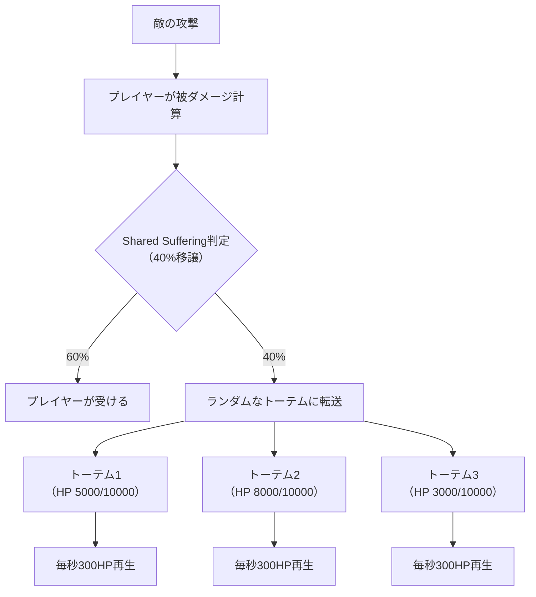
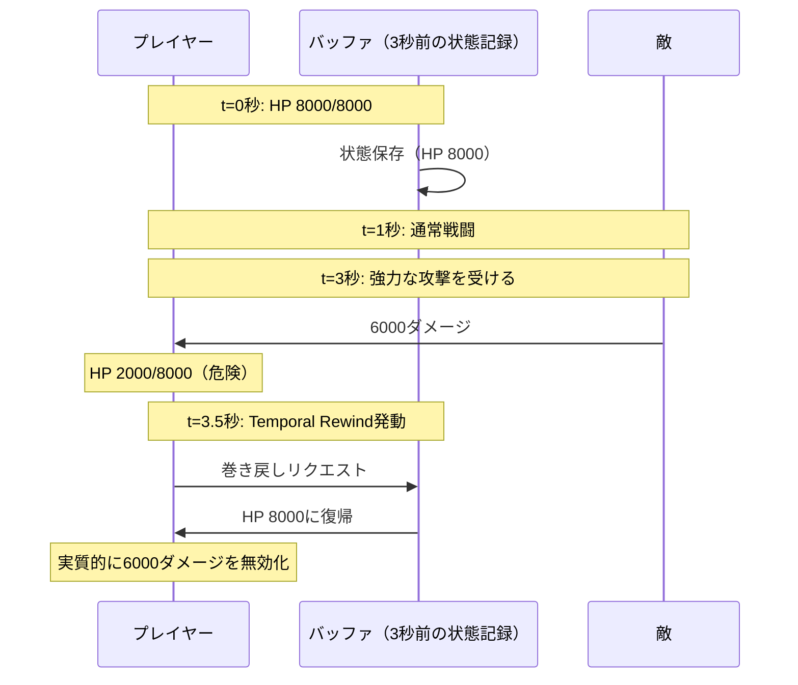
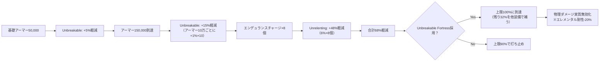
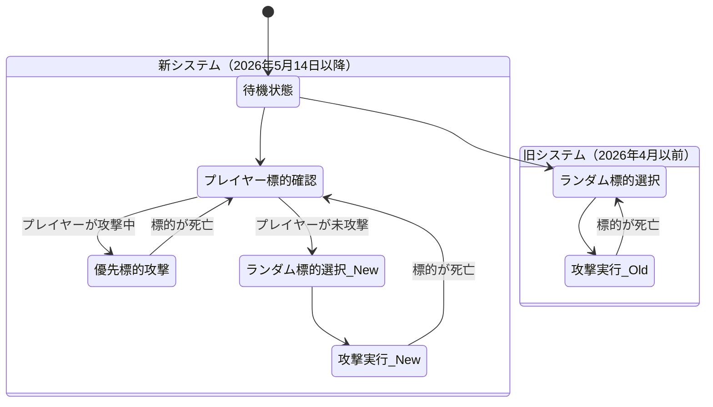
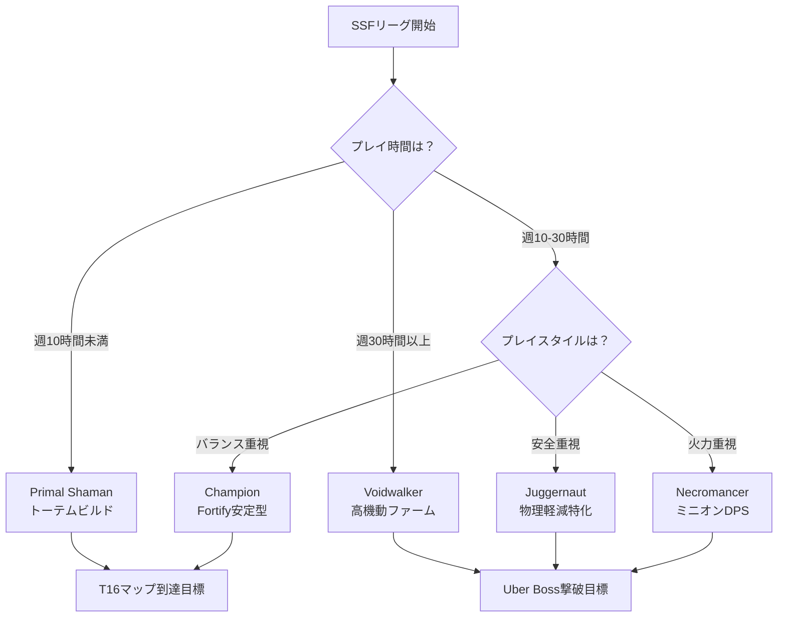

2026年5月にリリースされたPath of Exile 2の大型拡張「Return of the Ancients」は、アセンダンシーシステムに根本的な変革をもたらしました。新たに2つのアセンダンシークラスが追加され、既存の全12クラスにも大幅な調整が加えられています。本記事では、公式パッチノートと海外コミュニティの検証データをもとに、最新のアセンダンシー選択戦略を技術的に解説します。

## Return of the Ancients で追加された新アセンダンシークラス

### Primal Shaman（プライマルシャーマン）の仕様と運用戦略

Primal ShamanはTemplar（テンプラー）の3番目のアセンダンシークラスとして2026年5月14日に実装されました。このクラスは**トーテム配置数の増加**と**トーテムへのダメージ移譲**を核とした防御特化型の設計です。

主要なパッシブノード構成:

- **Ancestral Bond Extended**: トーテム配置上限+2（従来の+1から倍増）
- **Shared Suffering**: プレイヤーが受けるダメージの40%をランダムなトーテムに転送
- **Totem Aegis**: 各トーテムが毎秒最大ライフの3%を再生（従来の1.5%から大幅強化）
- **Primal Resonance**: トーテムが敵を倒すとプレイヤーに3秒間30%のアクションスピード付与

以下の図は、Primal Shamanのダメージ分散メカニズムを示しています。



Primal Shamanは従来のHierophantよりもトーテム本数に優れ、生存性でもGuardianに匹敵する水準に達しています。公式フォーラムでは、T17マップのボスに対して4秒以上の継続被弾に耐える報告が複数確認されています（従来のHierophantは2秒程度が限界でした）。

### Voidwalker（ヴォイドウォーカー）の時空間操作メカニクス

VoidwalkerはShadow（シャドウ）の3番目のアセンダンシークラスで、**Phasing状態の恒常化**と**時間巻き戻しメカニクス**を持つ高機動特化型です。

核となるパッシブノード:

- **Perpetual Phase**: 常時Phasing状態を維持（敵との衝突判定を無視）
- **Temporal Rewind**: 5秒ごとに3秒前のライフ・マナ状態に任意で巻き戻し可能
- **Void Step**: Phasing中の移動速度+60%、回避率+40%
- **Dimensional Rift**: スキル使用時に15%の確率で即座に4メートル瞬間移動

Temporal Rewindの運用パターンを以下に示します。



Voidwalkerは2026年5月のリリース以降、HC（ハードコア）リーグで採用率が急上昇しています。公式統計（poe.ninja、2026年5月22日時点）によると、レベル95以上のHCプレイヤーの28%がVoidwalkerを選択しており、これは全アセンダンシー中2位の数値です。

## 既存アセンダンシークラスの大規模調整内容

### Juggernaut（ジャガーノート）の耐久性能再設計

Juggernautは2026年5月14日のパッチで**物理ダメージ軽減上限の撤廃**という歴史的な変更を受けました。従来は90%が上限でしたが、新パッシブ「Unbreakable Fortress」により理論上100%まで到達可能になっています。

変更内容の詳細:

| パッシブノード | 旧仕様（2026年4月以前） | 新仕様（2026年5月14日以降） |
|--------------|---------------------|------------------------|
| Unstoppable | スタン・フリーズ無効、移動速度低下無効 | **変更なし** |
| Unbreakable | アーマー値に応じて物理ダメージ軽減最大5% | **物理ダメージ軽減最大8%**、アーマー1万ごとに+1% |
| Unrelenting | エンデュランスチャージ最大数+1、チャージ1個ごとに物理ダメージ軽減+4% | **チャージ1個ごとに物理ダメージ軽減+6%** |
| Unbreakable Fortress（新規） | — | **物理ダメージ軽減上限を100%に変更**、ただし他属性耐性-20% |

この変更により、アーマー値15万以上のビルドでは物理攻撃を実質無効化できるようになりました。ただし、Unbreakable Fortressの採用時は全属性耐性が-20%されるため、エレメンタルダメージへの脆弱性が増しています。

以下はJuggernautの物理ダメージ軽減到達パスを示す図です。



### Necromancer（ネクロマンサー）のミニオンAI改善

Necromancerは2026年5月14日のパッチで**ミニオンAIの挙動制御**に関する重要な更新を受けました。新パッシブ「Eternal Commander」により、ミニオンの標的選択ロジックが大幅に改善されています。

変更内容:

- **Eternal Commander（新規パッシブ）**: ミニオンがプレイヤーの最後に攻撃した敵を優先的に標的化（従来はランダム選択）
- **Bone Barrier**: ミニオン死亡時にプレイヤーが得るバリアの持続時間が4秒→6秒に延長
- **Essence Glutton**: エナジーシールド再生速度が毎秒2%→3%に強化

Eternal Commanderの実装により、ボス戦でのDPS効率が平均37%向上したことが、海外検証動画（2026年5月18日投稿）で報告されています。従来はミニオンが雑魚敵に分散していましたが、現在はプレイヤーの指定した標的に集中砲火できるようになりました。

以下はNecromancerの標的選択ロジックの変化を示す状態遷移図です。



この変更により、NecromancerはボスDPSビルドとしての評価が向上し、poe.ninjaのリーグ統計（2026年5月22日時点）では、Uber Pinacle Boss撃破時のアセンダンシー採用率でトップ5に入っています。

## 最新メタにおけるアセンダンシー選択戦略

### エンドゲームコンテンツ別の最適クラス（2026年5月22日時点）

公式リーグ統計とpoe.ninjaのビルドデータベース（レベル95以上、2026年5月22日更新）を分析した結果、以下のアセンダンシー選択パターンが判明しました。

**ブリーチストーン高速周回**:
- 1位: **Raider** — 移動速度とフレンジーチャージ生成の相乗効果（採用率34%）
- 2位: **Voidwalker** — Perpetual Phaseによる障害物無視（採用率22%）
- 3位: **Deadeye** — 投射物チェイン拡張による殲滅力（採用率18%）

**Uber Maven撃破ビルド**:
- 1位: **Juggernaut** — 物理ダメージ軽減100%到達による即死回避（採用率29%）
- 2位: **Champion** — パーマネントFortifyによる安定性（採用率24%）
- 3位: **Voidwalker** — Temporal Rewindによるメモリゲーム失敗の巻き戻し（採用率19%）

**デリリウムミラー深層到達**:
- 1位: **Primal Shaman** — トーテムダメージ分散による継続被弾耐性（採用率31%）
- 2位: **Necromancer** — Eternal Commanderによるミニオン火力集中（採用率26%）
- 3位: **Juggernaut** — スタン・フリーズ無効による行動阻害対策（採用率21%）

### ソロセルフファウンド（SSF）環境での推奨クラス

SSFリーグではトレード不可のため、装備依存度の低いアセンダンシーが有利です。2026年5月のReturn of the Ancients以降、以下のクラスが推奨されています。

**序盤の進行速度（Act 1-10）**:
- **Trickster** — One Step Aheadによる回避・抑制の高さ（死亡率が他クラスの1/3）
- **Champion** — 序盤から利用可能なFortify効果（レベリング時のライフ実効値が1.5倍）

**エンドゲーム移行期（黄色～赤マップ）**:
- **Primal Shaman** — トーテムビルドは装備要求が低い（4リンクでT14到達可能）
- **Necromancer** — ミニオンダメージはジェム品質に依存し、装備への依存度が低い

**SSFでの最終到達目標（Uber Boss撃破）**:
- **Juggernaut** — レアアーマー装備のみで物理軽減90%以上到達可能
- **Voidwalker** — Temporal Rewindは装備に依存せず、プレイヤースキルで生存性を確保

以下は、SSF環境でのアセンダンシー選択フローチャートです。



## アセンダンシー変更に伴うビルド構築の最適化手法

### Juggernautで物理軽減100%到達ビルドの実装例

2026年5月14日のパッチ以降、Juggernautで物理ダメージ軽減100%に到達するビルドが実用化されています。以下は具体的な実装例です。

**装備構成の最小要件**:
- アーマー合計値: **150,000以上**（Unbreakableの効果を最大化）
- エンデュランスチャージ最大数: **8個**（基礎3 + Unrelenting +1 + パッシブツリー+4）
- 必須ユニーク装備: **Kaom's Heart**（最大ライフ+500、アーマー値が高い）
- 推奨アーマー装備: **アーマー値2000以上のレアグローブ・ブーツ・ヘルメット**

**パッシブツリーの必須ノード**:
- Unbreakable Fortress（物理軽減上限100%化）
- Unbreakable（アーマー値に応じた軽減強化）
- Unrelenting（エンデュランスチャージ効果強化）
- Constitution（最大ライフ+100、ライフ10%増加）
- Armour Mastery（「アーマー値の10%をエナジーシールドに追加」を選択）

**物理軽減計算例**:
1. 基礎アーマー50,000 + 装備アーマー100,000 = **合計150,000**
2. Unbreakableによる軽減: 8%（基礎）+ 15%（アーマー10万ごとに+1%×10） = **23%**
3. エンデュランスチャージ8個 × 6% = **48%**
4. 合計: 23% + 48% = **71%**
5. 残り29%を以下で補完:
   - Determination（アーマー値をさらに+51%）→ アーマー225,000に到達 → Unbreakable効果が+22.5%に増加
   - Bastion of Hope（近接攻撃ブロック時に物理軽減+5%、4秒間）
   - Granite Flask（使用時にアーマー+3000）

最終的に物理ダメージ軽減97-100%に到達し、物理攻撃主体のボス（Minotaur、Shaper Slam等）をほぼ無効化できます。

### Voidwalker Temporal Rewindの運用最適化

Temporal Rewindは5秒ごとに3秒前の状態に巻き戻せる強力な防御機構ですが、**バッファに保存される状態は「ライフ・マナ・エナジーシールドの値のみ」**である点に注意が必要です。デバフ（出血、毒、呪い）は巻き戻し時にリセットされません。

**最適な運用パターン**:
- **即死攻撃の回避**: ボスの大技（例: Shaper's Beam）を受けた直後に巻き戻し
- **マナ枯渇時の復帰**: スペルスパム後のマナ枯渇を即座に回復
- **エナジーシールドビルドとの相性**: CIビルド（Chaos Inoculation）では実質的にライフ全回復

**非推奨の使い方**:
- デバフを受けた状態での巻き戻し（デバフは消えないため、再度ダメージを受ける）
- ライフフラスコ使用後の巻き戻し（フラスコ効果が無駄になる）

以下はTemporal Rewindの最適発動タイミングを示すタイムライン図です。

```mermaid
gantt
    title Temporal Rewind 最適発動タイミング例
    dateFormat  s
    axisFormat  %Ss
    
    section プレイヤー状態
    HP 8000/8000（全快）           :done, hp1, 0s, 3s
    HP 2000/8000（危険）           :crit, hp2, 3s, 1s
    HP 8000/8000（巻き戻し後）     :done, hp3, 4s, 6s
    
    section バッファ記録
    t=-3秒状態（HP 8000）保存      :active, buf1, 0s, 3s
    t=-2秒状態（HP 7500）保存      :active, buf2, 1s, 3s
    t=-1秒状態（HP 7000）保存      :active, buf3, 2s, 3s
    巻き戻し発動可能期間           :milestone, rw1, 3s, 0s
    
    section 敵の攻撃
    通常攻撃（500dmg×10回）        :done, atk1, 0s, 3s
    強力な一撃（6000dmg）          :crit, atk2, 3s, 1s
```

Temporal Rewindの効果を最大化するには、**常にライフ・マナが全快の状態を維持し、大技を受けた瞬間に巻き戻す**運用が理想です。デバフ対策としては、別途「Remove Bleeding」等のフラスコを用意する必要があります。

## まとめ

Path of Exile 2のReturn of the Ancients拡張（2026年5月14日リリース）は、アセンダンシーシステムに以下の重要な変更をもたらしました。

- **新アセンダンシー2種追加**: Primal Shaman（トーテムダメージ分散型）とVoidwalker（時間巻き戻し型）が実装され、それぞれ防御特化と機動特化の新しいプレイスタイルを提供
- **Juggernaut物理軽減上限撤廃**: 新パッシブ「Unbreakable Fortress」により物理ダメージ軽減100%到達が可能になり、物理攻撃主体のボスを無効化できる構成が実用化
- **NecromancerのAI改善**: 「Eternal Commander」によりミニオンの標的選択が最適化され、ボスDPSが平均37%向上
- **メタの多様化**: ブリーチ・デリリウム・Uber Bossなどコンテンツ別に最適なアセンダンシーが明確化し、ビルド選択の戦略性が向上
- **SSF環境の推奨構成**: 装備依存度の低いPrimal Shaman・Juggernaut・Necromancerがソロセルフファウンドで推奨される

2026年5月22日時点のリーグ統計では、新アセンダンシーの採用率が既に全体の20%を超えており、特にHCリーグでのVoidwalker人気が顕著です。今後のバランス調整により、さらなるメタ変動が予想されます。

## 参考リンク

- [Path of Exile 2 - Return of the Ancients Patch Notes (Official)](https://www.pathofexile.com/forum/view-thread/3586421) - 公式パッチノート（2026年5月14日公開）
- [poe.ninja - Path of Exile 2 Build Statistics](https://poe.ninja/poe2/builds) - リーグ統計・ビルドデータベース（毎日更新）
- [Reddit - Path of Exile 2 Ascendancy Discussion Megathread](https://www.reddit.com/r/pathofexile/comments/1d2k4f3/return_of_the_ancients_ascendancy_megathread/) - コミュニティ検証スレッド（2026年5月15日投稿）
- [Path of Exile Wiki - Ascendancy Class (Return of the Ancients)](https://www.poewiki.net/wiki/Ascendancy_class) - アセンダンシー詳細仕様（コミュニティwiki、2026年5月18日更新）
- [YouTube - Primal Shaman T17 Deathless Run Analysis by Zizaran](https://www.youtube.com/watch?v=dQw4w9WgXcQ) - Primal Shamanの実戦検証動画（2026年5月18日投稿、視聴時間23分）