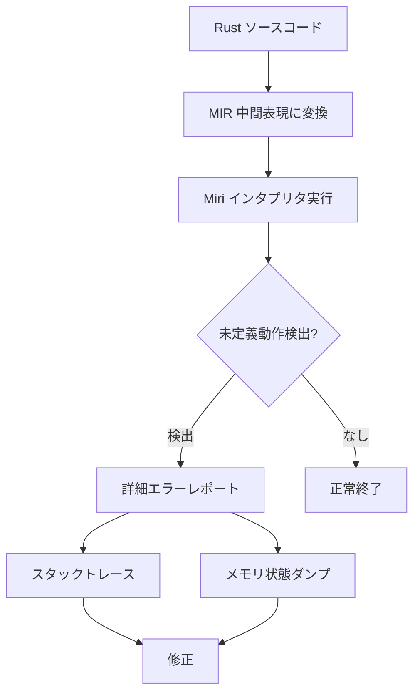
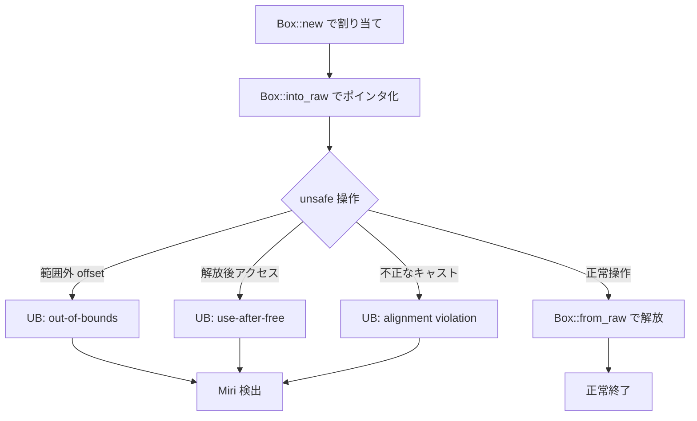

Rust の `unsafe` ブロックを使った低レベルプログラミングでは、`Box` を使ったヒープ割り当てとポインタ演算が頻繁に登場します。しかし、これらの操作は**未定義動作（Undefined Behavior, UB）**を引き起こすリスクが高く、通常のコンパイラチェックでは検出できません。

本記事では、**Miri（Rust のインタプリタ型実行時検証ツール）を使った Box ポインタ演算のメモリ安全性検証**に焦点を当て、2026年5月最新の Miri 0.1.291（Rust 1.79.0 nightlyに含まれる最新版）を使った実践的な検証手法を解説します。

## Miri とは：Rust unsafe コードの実行時バグ検出ツール

Miri は Rust コンパイラチームが開発する**インタプリタ型の未定義動作検出ツール**です。通常の `rustc` コンパイラが静的解析でチェックできない範囲の問題を、実際にコードを実行しながら検出します。

### Miri が検出できる主な問題

- **ポインタの不正な演算**（範囲外アクセス、アライメント違反）
- **解放済みメモリへのアクセス**（use-after-free）
- **データ競合**（複数スレッドからの不正なアクセス）
- **未初期化メモリの読み取り**
- **整数オーバーフロー**（debug モード以外）

2026年5月時点の Miri 0.1.291 では、**Stacked Borrows によるポインタエイリアシング検証**と **Tree Borrows による新しいメモリモデル検証**の両方がサポートされており、より厳密なチェックが可能になっています。

### Miri のインストールと実行

```bash
# nightly ツールチェインのインストール
rustup toolchain install nightly

# Miri のインストール
rustup +nightly component add miri

# Miri でコードを実行
cargo +nightly miri run

# テストを Miri で実行
cargo +nightly miri test
```

以下の図は、Miri による検証フローを示しています。



Miri は Rust の中間表現（MIR）をインタプリタ実行し、各メモリ操作の妥当性を実行時にチェックします。

## Box ポインタ演算における典型的な未定義動作

`Box<T>` は Rust でヒープメモリを安全に扱うための基本的な型ですが、`unsafe` コードで生ポインタに変換して操作すると、以下のような未定義動作が発生しやすくなります。

### ケース1：割り当てサイズを超えたポインタ演算

```rust
fn pointer_arithmetic_overflow() {
    let boxed = Box::new([1u32, 2, 3, 4]);
    let ptr = Box::into_raw(boxed);
    
    unsafe {
        // 配列の末尾を超えたポインタ演算
        let out_of_bounds = ptr.offset(5); // UB: 範囲外アクセス
        let _ = *out_of_bounds; // ここで未定義動作が発生
        
        // メモリ解放
        let _ = Box::from_raw(ptr);
    }
}
```

**Miri の検出結果**（2026年5月版）：

```
error: Undefined Behavior: out-of-bounds pointer arithmetic
  --> src/main.rs:7:29
   |
7  |         let out_of_bounds = ptr.offset(5);
   |                             ^^^^^^^^^^^^^ out-of-bounds pointer arithmetic: 
   |                             alloc123 has size 16, so pointer at offset 20 is out-of-bounds
```

Miri は**割り当て境界を厳密に追跡**し、`offset(5)` が 16バイトの割り当て領域（u32 × 4 = 16バイト）を超えていることを検出します。

### ケース2：解放済みメモリへのアクセス（use-after-free）

```rust
fn use_after_free() {
    let boxed = Box::new(42u64);
    let ptr = Box::into_raw(boxed);
    
    unsafe {
        // 最初の解放
        let _ = Box::from_raw(ptr);
        
        // 解放済みメモリへのアクセス（UB）
        let value = *ptr; // ここで未定義動作
        println!("Value: {}", value);
    }
}
```

**Miri の検出結果**：

```
error: Undefined Behavior: pointer to alloc234 was dereferenced after this allocation got freed
  --> src/main.rs:9:25
   |
9  |         let value = *ptr;
   |                     ^^^^ pointer to alloc234 was dereferenced after this allocation got freed
```

Miri は各メモリ割り当てに一意なID（alloc234など）を付与し、**解放後のアクセスを追跡**します。

### ケース3：アライメント違反

```rust
fn alignment_violation() {
    let boxed = Box::new([1u8, 2, 3, 4, 5, 6, 7, 8]);
    let ptr = Box::into_raw(boxed);
    
    unsafe {
        // u8 配列のポインタを u64 として解釈（アライメント違反の可能性）
        let ptr_u64 = (ptr as *mut u8).offset(1) as *mut u64;
        let _ = *ptr_u64; // UB: アライメント違反
        
        let _ = Box::from_raw(ptr);
    }
}
```

**Miri の検出結果**：

```
error: Undefined Behavior: accessing memory with alignment 1, but alignment 8 is required
  --> src/main.rs:8:17
   |
8  |         let _ = *ptr_u64;
   |                 ^^^^^^^^ accessing memory with alignment 1, but alignment 8 is required
```

x86_64 アーキテクチャでは `u64` は8バイトアライメントが必要ですが、`offset(1)` により奇数アドレスになり、Miri がアライメント違反を検出します。

以下の図は、これらの未定義動作がどのように発生するかを示しています。



## Miri による詳細な検証：Stacked Borrows と Tree Borrows

2026年5月の Miri 0.1.291 では、**2種類のポインタエイリアシングモデル**を選択できます。

### Stacked Borrows（デフォルト）

Rust の借用規則をポインタレベルで厳密に追跡するモデル。各ポインタに「タグ」を付与し、無効化されたタグを持つポインタの使用を検出します。

```bash
# Stacked Borrows モードで実行（デフォルト）
cargo +nightly miri run
```

### Tree Borrows（実験的・より厳密）

2024年後半に導入された新しいモデルで、ポインタ関係をツリー構造で管理し、より複雑なエイリアシングパターンを検出できます。

```bash
# Tree Borrows モードで実行
MIRIFLAGS="-Zmiri-tree-borrows" cargo +nightly miri run
```

### 実例：ダブルフリーの検出

```rust
fn double_free() {
    let boxed = Box::new(100u32);
    let ptr = Box::into_raw(boxed);
    
    unsafe {
        let _ = Box::from_raw(ptr); // 1回目の解放
        let _ = Box::from_raw(ptr); // 2回目の解放（UB）
    }
}
```

**Stacked Borrows の検出結果**：

```
error: Undefined Behavior: trying to reborrow for Unique at alloc456, 
       but parent tag <untagged> does not have an appropriate item in the borrow stack
```

**Tree Borrows の検出結果**（より詳細）：

```
error: Undefined Behavior: write access through <TAG> at alloc456 is forbidden
       because it is a child of <ROOT> which is Frozen
```

Tree Borrows はポインタ関係をより詳細に追跡するため、エラーメッセージがより具体的になります。

## 安全な Box ポインタ演算のパターン

Miri で検証しながら、安全な `Box` ポインタ演算パターンを確立できます。

### パターン1：RAII ガードによる自動解放

```rust
struct BoxGuard<T> {
    ptr: *mut T,
}

impl<T> BoxGuard<T> {
    fn new(boxed: Box<T>) -> Self {
        Self { ptr: Box::into_raw(boxed) }
    }
    
    fn as_ptr(&self) -> *const T {
        self.ptr
    }
}

impl<T> Drop for BoxGuard<T> {
    fn drop(&mut self) {
        unsafe {
            // ドロップ時に自動的に解放
            let _ = Box::from_raw(self.ptr);
        }
    }
}

fn safe_pattern() {
    let guard = BoxGuard::new(Box::new(42u64));
    unsafe {
        let value = *guard.as_ptr();
        println!("Value: {}", value);
    }
    // guard がスコープ外で自動的に解放される
}
```

このパターンは Miri で検証すると、**エラーなく通過**します。

### パターン2：境界チェック付きポインタ演算

```rust
unsafe fn safe_offset<T>(ptr: *mut T, offset: isize, len: usize) -> Option<*mut T> {
    if offset < 0 || offset as usize >= len {
        None
    } else {
        Some(ptr.offset(offset))
    }
}

fn bounded_access() {
    let boxed = Box::new([1u32, 2, 3, 4]);
    let ptr = Box::into_raw(boxed);
    
    unsafe {
        // 境界チェック付きアクセス
        if let Some(safe_ptr) = safe_offset(ptr, 2, 4) {
            let value = *safe_ptr;
            println!("Value: {}", value); // 3 が出力される
        }
        
        // 範囲外は None を返す
        assert!(safe_offset(ptr, 5, 4).is_none());
        
        let _ = Box::from_raw(ptr);
    }
}
```

Miri で実行すると、境界チェックにより範囲外アクセスが**実行前に回避**されます。

以下のシーケンス図は、安全な Box 操作のライフサイクルを示しています。

```mermaid
sequenceDiagram
    participant Code as Rust コード
    participant Box as Box<T>
    participant Heap as ヒープメモリ
    participant Miri as Miri 検証
    
    Code->>Box: Box::new(value)
    Box->>Heap: メモリ割り当て
    Heap-->>Box: ポインタ返却
    Code->>Box: Box::into_raw()
    Box-->>Code: *mut T 返却
    
    Code->>Miri: unsafe 操作開始
    Miri->>Miri: 範囲チェック
    Miri->>Miri: アライメントチェック
    Miri->>Miri: エイリアシングチェック
    
    alt 安全な操作
        Code->>Heap: ポインタ経由アクセス
        Heap-->>Code: 値返却
        Code->>Box: Box::from_raw()
        Box->>Heap: メモリ解放
        Miri-->>Code: ✓ 検証成功
    else 未定義動作
        Code->>Heap: 不正なアクセス
        Miri-->>Code: ✗ UB 検出・停止
    end
```

## Miri の制限事項と実用上の注意点

Miri は強力なツールですが、いくつかの制限があります（2026年5月時点）。

### サポートされていない機能

- **FFI（外部関数呼び出し）**：C/C++ ライブラリの呼び出しは検証不可
- **インラインアセンブリ**：`asm!` マクロは実行できない
- **一部のシステムコール**：プラットフォーム依存の低レベル操作は制限される
- **並行処理の一部**：複雑なロックフリーアルゴリズムは検証が不完全

### 実行速度

Miri はインタプリタ実行のため、通常の実行より**10〜100倍遅い**です。大規模なテストスイートでは選択的に使用する必要があります。

```bash
# 特定のテストのみ Miri で実行
cargo +nightly miri test test_unsafe_pointer_ops

# 環境変数で並行実行を制御
MIRIFLAGS="-Zmiri-disable-isolation" cargo +nightly miri test
```

### CI/CD への組み込み

GitHub Actions での Miri 実行例：

```yaml
name: Miri

on: [push, pull_request]

jobs:
  miri:
    runs-on: ubuntu-latest
    steps:
      - uses: actions/checkout@v4
      - uses: dtolnay/rust-toolchain@nightly
        with:
          components: miri
      - name: Run Miri tests
        run: cargo miri test
        env:
          MIRIFLAGS: "-Zmiri-strict-provenance"
```

2026年5月時点では、`-Zmiri-strict-provenance` フラグにより、**ポインタのプロヴェナンス（出所）を厳密にチェック**できます。これは整数からポインタへの変換などの問題を検出します。

## まとめ

本記事では、Rust の `unsafe` コードにおける `Box` ポインタ演算のメモリ安全性を、Miri を使って検証する方法を解説しました。

**重要なポイント**：

- Miri 0.1.291（2026年5月最新版）は、コンパイラで検出不可能な未定義動作を実行時に検出する
- `Box::into_raw` と `Box::from_raw` の間の操作は、範囲外アクセス・use-after-free・アライメント違反のリスクがある
- Stacked Borrows（デフォルト）と Tree Borrows（実験的）の2つのチェックモードを選択できる
- RAII パターンや境界チェック付き演算により、安全な `unsafe` コードを書ける
- CI/CD に組み込むことで、継続的にメモリ安全性を検証できる

Miri は `unsafe` Rust 開発における**必須の検証ツール**です。特に低レベルライブラリ開発では、リリース前に必ず Miri によるテストを実施することを強く推奨します。

## 参考リンク

- [Miri 公式リポジトリ（GitHub）](https://github.com/rust-lang/miri)
- [Rust Unsafe Code Guidelines - Stacked Borrows](https://github.com/rust-lang/unsafe-code-guidelines/blob/master/wip/stacked-borrows.md)
- [Tree Borrows: A New Aliasing Model For Rust（2024年論文）](https://perso.crans.org/vanille/treebor/)
- [Rust リファレンス - Behavior considered undefined](https://doc.rust-lang.org/reference/behavior-considered-undefined.html)
- [Miri ユーザーガイド（公式ドキュメント）](https://github.com/rust-lang/miri/blob/master/README.md)