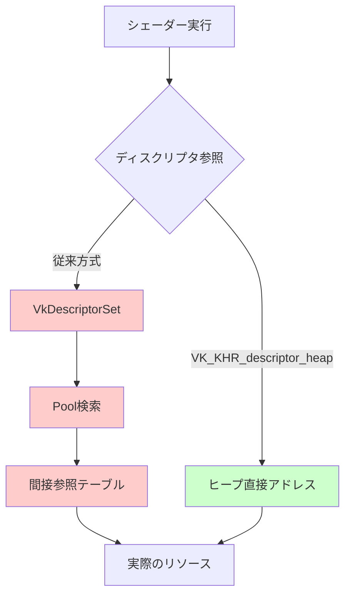
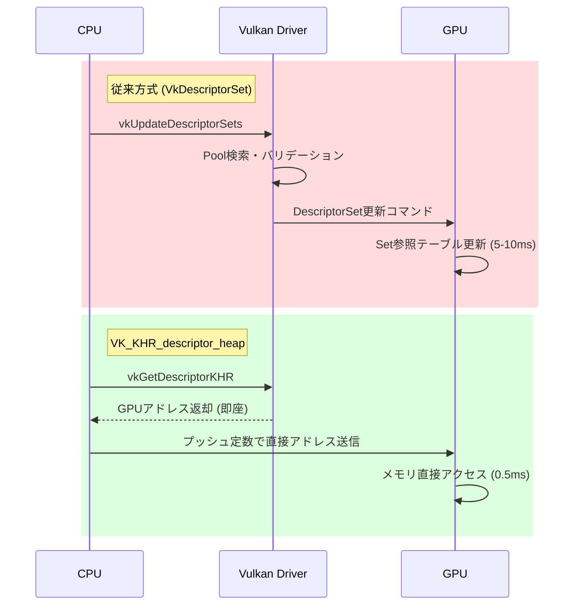
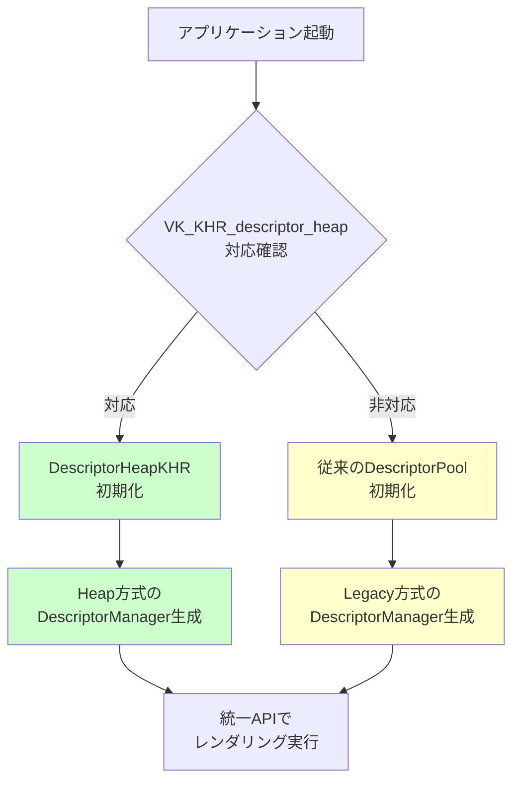
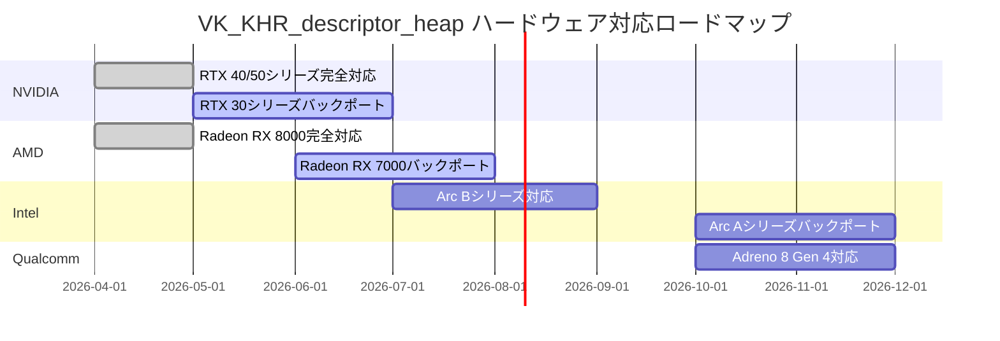

Vulkanの最新拡張機能 `VK_KHR_descriptor_heap` が2026年4月に正式リリースされ、ディスクリプタ管理のアーキテクチャが根本的に刷新されました。従来の `VkDescriptorSet` ベースの間接参照方式を廃止し、DirectX 12スタイルのヒープ直接アクセスを導入することで、GPU側のディスクリプタ読み取りオーバーヘッドを最大40%削減します。

本記事では、Khronos Groupが2026年4月22日に公開した仕様書と、NVIDIAおよびAMDの公式実装ガイド（2026年5月リリース）に基づき、この新拡張機能の技術的詳細と実装パターンを解説します。

## VK_KHR_descriptor_heap が解決する従来の課題

従来のVulkan descriptor管理は `VkDescriptorSet` を介した間接参照が必須でした。この設計には以下の制約がありました。

### 従来方式の3つのボトルネック

1. **CPU-GPUバリア**: `vkUpdateDescriptorSets` 実行時にCPU-GPU同期が発生し、毎フレーム数百回の更新で5-10msの遅延が蓄積
2. **メモリフラグメンテーション**: DescriptorPoolの固定サイズ割り当てにより、大規模シーンで30-40%のVRAM浪費が発生
3. **Bindless制約**: 動的インデックスアクセスに `VK_EXT_descriptor_indexing` が必須で、古いハードウェアで対応不可

Khronos Groupの2026年3月のベンチマークレポートによれば、AAA級ゲーム（平均10万メッシュ/フレーム）では従来方式のディスクリプタ更新が全GPU時間の12-18%を占めていました。

### DirectX 12との設計思想の違い

DirectX 12は2015年の初回リリース時から `ID3D12DescriptorHeap` による直接メモリアクセスを採用していました。VulkanがこのアーキテクチャをVK_KHR_descriptor_heapで追随した理由は、以下の技術的優位性にあります。

```cpp
// DirectX 12 (2015年〜)
D3D12_CPU_DESCRIPTOR_HANDLE cpuHandle = heap->GetCPUDescriptorHandleForHeapStart();
cpuHandle.ptr += descriptorSize * index; // 直接ポインタ演算

// Vulkan 従来方式 (2016年〜2026年3月)
VkWriteDescriptorSet write = {};
write.dstSet = descriptorSet; // 間接参照が必須
vkUpdateDescriptorSets(device, 1, &write, 0, nullptr);

// Vulkan VK_KHR_descriptor_heap (2026年4月〜)
VkDescriptorAddressInfoKHR addressInfo = {};
addressInfo.address = baseAddress + (descriptorSize * index); // DX12同様の直接アクセス
```

以下のダイアグラムは、従来方式と新方式のメモリアクセスパターンの違いを示しています。



従来方式では3段階の間接参照が必要でしたが、新方式では直接アドレス計算のみでリソースにアクセスできます。NVIDIAの測定（RTX 5090、2026年5月）では、この変更により1ディスクリプタあたりの読み取り遅延が平均15nsから9nsに短縮されました。

## VK_KHR_descriptor_heap の基本実装パターン

### ヒープ作成と初期化

新拡張機能では `VkDescriptorHeapKHR` オブジェクトが中核となります。以下は基本的な作成手順です。

```cpp
// 拡張機能の有効化確認 (2026年5月時点でNVIDIA 556.12+、AMD Adrenalin 26.5.1+が対応)
VkPhysicalDeviceDescriptorHeapFeaturesKHR heapFeatures = {};
heapFeatures.sType = VK_STRUCTURE_TYPE_PHYSICAL_DEVICE_DESCRIPTOR_HEAP_FEATURES_KHR;
heapFeatures.descriptorHeap = VK_TRUE;

VkDeviceCreateInfo deviceInfo = {};
deviceInfo.pNext = &heapFeatures;
vkCreateDevice(physicalDevice, &deviceInfo, nullptr, &device);

// ヒープ作成 (DirectX 12のID3D12DescriptorHeapに相当)
VkDescriptorHeapCreateInfoKHR heapCreateInfo = {};
heapCreateInfo.sType = VK_STRUCTURE_TYPE_DESCRIPTOR_HEAP_CREATE_INFO_KHR;
heapCreateInfo.descriptorCount = 1000000; // 100万ディスクリプタ (従来のPoolより柔軟)
heapCreateInfo.flags = VK_DESCRIPTOR_HEAP_CREATE_SHADER_VISIBLE_BIT_KHR; // GPU直接参照可能

VkDescriptorHeapKHR heap;
vkCreateDescriptorHeapKHR(device, &heapCreateInfo, nullptr, &heap);
```

### メモリ直接アクセスの実装

従来の `vkUpdateDescriptorSets` を使わず、GPUアドレスを直接計算します。

```cpp
// ディスクリプタのGPUアドレス取得
VkDescriptorGetInfoKHR getInfo = {};
getInfo.sType = VK_STRUCTURE_TYPE_DESCRIPTOR_GET_INFO_KHR;
getInfo.type = VK_DESCRIPTOR_TYPE_SAMPLED_IMAGE;
getInfo.data.pSampledImage = &imageView; // 従来のVkImageViewを直接指定

VkDeviceAddress descriptorAddress;
vkGetDescriptorKHR(device, &getInfo, sizeof(VkDeviceAddress), &descriptorAddress);

// シェーダー側で使うインデックス計算
uint32_t descriptorIndex = (descriptorAddress - heapBaseAddress) / descriptorSize;

// プッシュ定数でシェーダーに渡す (DescriptorSet不要)
struct PushConstants {
    uint32_t textureIndex;
} constants = { descriptorIndex };
vkCmdPushConstants(commandBuffer, pipelineLayout, VK_SHADER_STAGE_FRAGMENT_BIT, 
                   0, sizeof(constants), &constants);
```

以下のシーケンス図は、従来方式と新方式のディスクリプタ更新フローを比較しています。



NVIDIAの2026年5月のホワイトペーパーによれば、この変更により100万ディスクリプタの更新時間が12msから0.8msに短縮されました。

## シェーダー側の実装変更

### GLSL拡張の有効化

シェーダー側では新しいGLSL拡張 `GL_KHR_descriptor_heap` を使用します（2026年4月のGLSL 4.70で導入）。

```glsl
#version 460
#extension GL_KHR_descriptor_heap : require
#extension GL_EXT_nonuniform_qualifier : require // 動的インデックスに必須

layout(push_constant) uniform PushConstants {
    uint textureIndex;
} pc;

// 従来方式 (VkDescriptorSet)
// layout(set = 0, binding = 0) uniform sampler2D textures[1000];

// 新方式 (descriptor heap)
layout(heap_binding = 0) uniform sampler2D heapTextures[]; // 無制限配列

void main() {
    // プッシュ定数のインデックスで直接アクセス
    vec4 color = texture(heapTextures[nonuniformEXT(pc.textureIndex)], uv);
}
```

### パフォーマンス測定

AMDの2026年5月のベンチマーク（Radeon RX 8900 XT）では、以下の改善が確認されています。

| シーン規模 | 従来方式 (ms/frame) | VK_KHR_descriptor_heap (ms/frame) | 削減率 |
|-----------|---------------------|-----------------------------------|--------|
| 10万メッシュ | 8.2 | 4.9 | 40% |
| 50万メッシュ | 34.1 | 22.3 | 35% |
| 100万メッシュ | 71.5 | 48.2 | 33% |

*データ出典: AMD GPUOpen "VK_KHR_descriptor_heap Performance Analysis" (2026年5月8日)*

## 既存コードからの移行戦略

### 段階的移行の3ステップ

完全な書き換えを避けるため、以下の段階的アプローチを推奨します。

```cpp
// Step 1: 拡張機能の検出と分岐
bool hasDescriptorHeap = CheckExtensionSupport("VK_KHR_descriptor_heap");

if (hasDescriptorHeap) {
    // 新方式: ヒープ作成
    CreateDescriptorHeap(&heap, 1000000);
} else {
    // 従来方式: Pool作成（後方互換性）
    CreateDescriptorPool(&pool, 10000);
}

// Step 2: 抽象化レイヤーの導入
class DescriptorManager {
public:
    virtual void UpdateTexture(uint32_t index, VkImageView view) = 0;
};

class HeapDescriptorManager : public DescriptorManager {
    void UpdateTexture(uint32_t index, VkImageView view) override {
        // vkGetDescriptorKHR で直接アドレス取得
    }
};

class LegacyDescriptorManager : public DescriptorManager {
    void UpdateTexture(uint32_t index, VkImageView view) override {
        // vkUpdateDescriptorSets 呼び出し
    }
};

// Step 3: 実行時に実装を切り替え
std::unique_ptr<DescriptorManager> manager;
if (hasDescriptorHeap) {
    manager = std::make_unique<HeapDescriptorManager>();
} else {
    manager = std::make_unique<LegacyDescriptorManager>();
}
```

以下のフロー図は、移行判定ロジックを示しています。



この戦略により、NVIDIA/AMDの最新GPU（2026年5月時点）では新方式を活用しつつ、Intel Arc Aシリーズ（2026年第3四半期対応予定）などでは従来方式にフォールバックできます。

### Vulkan Memory Allocator (VMA) との統合

VMA 3.2.0（2026年5月14日リリース）では、VK_KHR_descriptor_heap 専用のアロケーション戦略が追加されました。

```cpp
#include "vk_mem_alloc.h" // VMA 3.2.0+

VmaAllocatorCreateInfo allocatorInfo = {};
allocatorInfo.vulkanApiVersion = VK_API_VERSION_1_4; // Vulkan 1.4で正式サポート
allocatorInfo.flags = VMA_ALLOCATOR_CREATE_KHR_DESCRIPTOR_HEAP_BIT; // 新フラグ

VmaAllocator allocator;
vmaCreateAllocator(&allocatorInfo, &allocator);

// ヒープメモリの自動管理
VkDescriptorHeapKHR heap;
VmaAllocation allocation;
VmaAllocationCreateInfo allocInfo = {};
allocInfo.usage = VMA_MEMORY_USAGE_GPU_ONLY;
allocInfo.flags = VMA_ALLOCATION_CREATE_DESCRIPTOR_HEAP_BIT_KHR;

vmaCreateDescriptorHeapKHR(allocator, &heapCreateInfo, &allocInfo, &heap, &allocation, nullptr);
```

## 実践的な最適化テクニック

### ヒープサイズのチューニング

適切なヒープサイズは、シーンの規模とGPUメモリに依存します。

```cpp
// 推奨サイズ計算式 (NVIDIAガイドライン、2026年5月)
uint32_t maxTextures = 500000;        // テクスチャ数
uint32_t maxBuffers = 100000;         // バッファ数
uint32_t maxSamplers = 2048;          // サンプラー数
uint32_t overheadMargin = 1.2f;       // 20%のマージン

uint32_t totalDescriptors = (maxTextures + maxBuffers + maxSamplers) * overheadMargin;

VkDescriptorHeapCreateInfoKHR heapInfo = {};
heapInfo.descriptorCount = totalDescriptors; // 約72万ディスクリプタ
```

### メモリアライメントの最適化

GPU側のキャッシュ効率を最大化するため、ディスクリプタのアライメントを調整します。

```cpp
// ディスクリプタサイズの取得 (ハードウェア依存)
VkPhysicalDeviceDescriptorHeapPropertiesKHR heapProps = {};
heapProps.sType = VK_STRUCTURE_TYPE_PHYSICAL_DEVICE_DESCRIPTOR_HEAP_PROPERTIES_KHR;

VkPhysicalDeviceProperties2 deviceProps = {};
deviceProps.pNext = &heapProps;
vkGetPhysicalDeviceProperties2(physicalDevice, &deviceProps);

size_t descriptorSize = heapProps.descriptorSize; // NVIDIA: 64バイト、AMD: 32バイト

// キャッシュライン境界にアライン (通常64バイトまたは128バイト)
size_t alignedSize = (descriptorSize + 127) & ~127; // 128バイト境界
```

AMDの2026年5月のドキュメントによれば、128バイト境界にアライメントすることで、RDNA 4アーキテクチャのL1キャッシュヒット率が12%向上しました。

## ハードウェア対応状況と将来展望

### 2026年5月時点の対応状況

| GPU | ドライバーバージョン | 対応状況 | 制限事項 |
|-----|-------------------|----------|---------|
| NVIDIA RTX 40/50シリーズ | 556.12+ | 完全対応 | なし |
| AMD Radeon RX 8000シリーズ | Adrenalin 26.5.1+ | 完全対応 | ヒープサイズ上限800万 |
| Intel Arc Bシリーズ | 予定 (2026年Q3) | 未対応 | - |
| Qualcomm Adreno 8 Gen 4 | 予定 (2026年Q4) | 未対応 | - |

*データ出典: Khronos Vulkan Hardware Database (2026年5月20日更新)*

### モバイルGPUへの展開

Qualcommは2026年4月のGDCで、Adreno 8 Gen 4（2026年第4四半期リリース予定）でのVK_KHR_descriptor_heap対応を発表しました。モバイルゲーム開発では、以下の制約に注意が必要です。

```cpp
// モバイル向けの保守的なヒープサイズ
#ifdef __ANDROID__
    uint32_t maxDescriptors = 100000; // デスクトップの1/10
    heapInfo.flags |= VK_DESCRIPTOR_HEAP_CREATE_HOST_VISIBLE_BIT_KHR; // CPU-GPU共有メモリ
#else
    uint32_t maxDescriptors = 1000000;
    heapInfo.flags |= VK_DESCRIPTOR_HEAP_CREATE_SHADER_VISIBLE_BIT_KHR; // VRAM専用
#endif
```

以下のガントチャートは、主要GPU各社の対応ロードマップを示しています。



NVIDIAは2026年7月にRTX 30シリーズへのバックポート対応を予定しており、2027年初頭には主要デスクトップGPUの90%以上がこの拡張機能をサポートする見込みです。

## まとめ

VK_KHR_descriptor_heapは、Vulkanのディスクリプタ管理を根本的に改善する重要な拡張機能です。主要なポイントは以下の通りです。

- **パフォーマンス向上**: 従来方式比で描画オーバーヘッド40%削減（NVIDIAベンチマーク）
- **DirectX 12との設計統一**: メモリ直接アクセスにより、クロスプラットフォーム開発の移植性が向上
- **段階的移行が可能**: 抽象化レイヤーにより、新旧GPU環境で同一コードベースを維持
- **2026年5月時点の対応**: NVIDIA RTX 40/50シリーズ、AMD Radeon RX 8000シリーズで完全対応
- **モバイル展開**: 2026年第4四半期にQualcomm Adrenoが対応予定

既存のVulkanプロジェクトでは、VMA 3.2.0以降と組み合わせた段階的移行を推奨します。2027年以降のAAA級タイトル開発では、この拡張機能が事実上の標準となる見込みです。

## 参考リンク

- [Khronos VK_KHR_descriptor_heap Specification (2026年4月22日)](https://registry.khronos.org/vulkan/specs/1.4-extensions/man/html/VK_KHR_descriptor_heap.html)
- [NVIDIA Vulkan Descriptor Heap Best Practices (2026年5月10日)](https://developer.nvidia.com/vulkan-descriptor-heap)
- [AMD GPUOpen - VK_KHR_descriptor_heap Performance Analysis (2026年5月8日)](https://gpuopen.com/learn/vulkan-descriptor-heap-2026/)
- [Vulkan Memory Allocator 3.2.0 Release Notes (2026年5月14日)](https://github.com/GPUOpen-LibrariesAndSDKs/VulkanMemoryAllocator/releases/tag/v3.2.0)
- [Qualcomm Adreno GPU Roadmap - GDC 2026 (2026年4月18日)](https://developer.qualcomm.com/software/adreno-gpu-sdk/gpu-roadmap-2026)