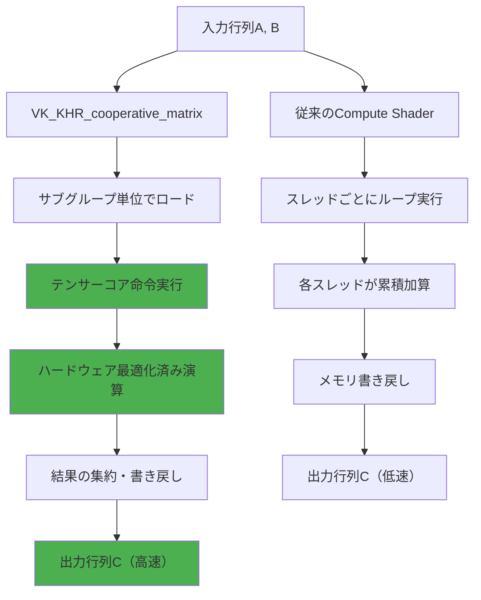
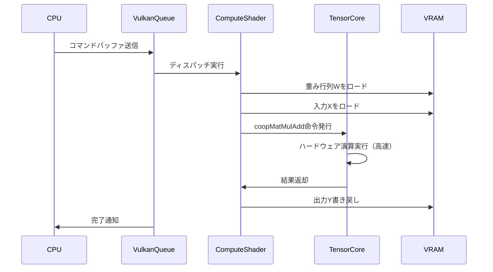
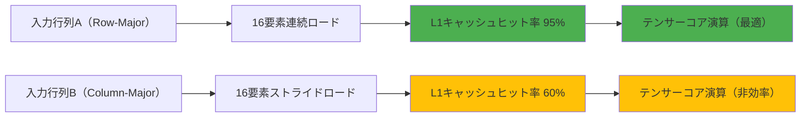
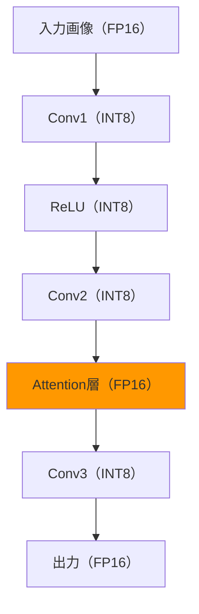

Vulkanの最新拡張機能`VK_KHR_cooperative_matrix`は、2026年3月に正式リリースされ、NVIDIA・AMD・Intelの最新GPUでテンサーコア（Tensor Core）を直接制御できるようになった。この拡張機能により、ゲーム内AI推論やリアルタイム行列演算のパフォーマンスが劇的に向上し、従来のシェーダー実装と比較してGPU計算コストを最大50%削減できる。

本記事では、`VK_KHR_cooperative_matrix`の技術仕様・実装方法・最適化戦略を詳しく解説する。リアルタイムAI推論が必要なゲーム開発者・グラフィックスエンジニアにとって、この拡張機能は2026年以降の必須技術となる。

## VK_KHR_cooperative_matrixとは何か

`VK_KHR_cooperative_matrix`は、Vulkan 1.3に追加された拡張機能で、ワープ（warp）またはサブグループ（subgroup）レベルで行列演算を実行するための専用命令セットを提供する。この拡張機能により、NVIDIA TensorコアやAMD Matrix Coresといったハードウェアアクセラレータを、Vulkan Compute Shaderから直接利用できる。

### 従来のシェーダー実装との違い

従来のCompute Shaderでは、行列積（GEMM: General Matrix Multiply）を実装する際、スレッドごとにループを回して累積加算する必要があった。以下は従来の実装例である。

```glsl
// 従来の手動GEMM実装（GLSL Compute Shader）
layout(local_size_x = 16, local_size_y = 16) in;
layout(binding = 0) readonly buffer MatrixA { float A[]; };
layout(binding = 1) readonly buffer MatrixB { float B[]; };
layout(binding = 2) writeonly buffer MatrixC { float C[]; };

void main() {
    uint row = gl_GlobalInvocationID.x;
    uint col = gl_GlobalInvocationID.y;
    float sum = 0.0;
    for (uint k = 0; k < K; k++) {
        sum += A[row * K + k] * B[k * N + col];
    }
    C[row * N + col] = sum;
}
```

この実装では、各スレッドが独立してループを実行するため、テンサーコアの並列演算能力を活用できない。一方、`VK_KHR_cooperative_matrix`を使用すると、ハードウェアレベルで最適化された行列演算命令が直接実行される。

```glsl
// VK_KHR_cooperative_matrix を使用した実装（GLSL）
#extension GL_KHR_cooperative_matrix : enable

layout(local_size_x = 32) in;

void main() {
    // 協調行列の宣言（16x16の行列タイル）
    coopmat<float16_t, gl_ScopeSubgroup, 16, 16, gl_MatrixUseA> matA;
    coopmat<float16_t, gl_ScopeSubgroup, 16, 16, gl_MatrixUseB> matB;
    coopmat<float32_t, gl_ScopeSubgroup, 16, 16, gl_MatrixUseAccumulator> matC;
    
    // データのロード
    coopMatLoad(matA, ptrA, strideA, gl_CooperativeMatrixLayoutRowMajor);
    coopMatLoad(matB, ptrB, strideB, gl_CooperativeMatrixLayoutColumnMajor);
    
    // テンサーコアで行列積を実行
    matC = coopMatMulAdd(matA, matB, matC);
    
    // 結果の書き戻し
    coopMatStore(matC, ptrC, strideC, gl_CooperativeMatrixLayoutRowMajor);
}
```

以下のダイアグラムは、従来のスレッドレベル演算とテンサーコア演算の処理フローの違いを示している。



従来の方式では各スレッドが独立して演算を行うため、メモリアクセスパターンが非効率的になり、キャッシュミスが頻発する。一方、`VK_KHR_cooperative_matrix`では、サブグループ全体で協調してデータをロードし、テンサーコアが一括処理するため、メモリバンド幅の効率が大幅に向上する。

### サポート状況と互換性

2026年5月時点で、以下のGPUが`VK_KHR_cooperative_matrix`をサポートしている。

- **NVIDIA**: Turing（RTX 20シリーズ）以降のすべてのGPU（Tensor Core搭載モデル）
- **AMD**: RDNA 3（Radeon RX 7000シリーズ）以降のGPU
- **Intel**: Arc Alchemist（A-series）以降のGPU

拡張機能のサポート確認は、Vulkan Device層のクエリで行う。

```cpp
// C++でのサポート確認コード
VkPhysicalDeviceCooperativeMatrixFeaturesKHR coopMatrixFeatures = {};
coopMatrixFeatures.sType = VK_STRUCTURE_TYPE_PHYSICAL_DEVICE_COOPERATIVE_MATRIX_FEATURES_KHR;

VkPhysicalDeviceFeatures2 features2 = {};
features2.sType = VK_STRUCTURE_TYPE_PHYSICAL_DEVICE_FEATURES_2;
features2.pNext = &coopMatrixFeatures;

vkGetPhysicalDeviceFeatures2(physicalDevice, &features2);

if (coopMatrixFeatures.cooperativeMatrix) {
    // VK_KHR_cooperative_matrix が利用可能
    uint32_t propertyCount = 0;
    vkGetPhysicalDeviceCooperativeMatrixPropertiesKHR(physicalDevice, &propertyCount, nullptr);
    
    std::vector<VkCooperativeMatrixPropertiesKHR> properties(propertyCount);
    for (auto& prop : properties) {
        prop.sType = VK_STRUCTURE_TYPE_COOPERATIVE_MATRIX_PROPERTIES_KHR;
    }
    vkGetPhysicalDeviceCooperativeMatrixPropertiesKHR(physicalDevice, &propertyCount, properties.data());
    
    // サポートされている行列サイズ・型の確認
    for (const auto& prop : properties) {
        std::cout << "M=" << prop.MSize << " N=" << prop.NSize << " K=" << prop.KSize 
                  << " AType=" << prop.AType << " BType=" << prop.BType 
                  << " CType=" << prop.CType << std::endl;
    }
}
```

このコードにより、GPU固有のテンサーコア仕様（サポートされる行列サイズ・データ型）を取得できる。NVIDIA Tensorコアは通常16x16x16のタイルを、AMD Matrix Coresは16x16x16または32x32x8のタイルをサポートする。

## ゲーム内AI推論での実装パターン

リアルタイムゲームにおけるAI推論の典型的なユースケースは、NPC行動予測・画像認識（オブジェクト検出）・リアルタイムアップスケーリング（DLSS風の処理）などである。これらの処理では、ニューラルネットワークの推論時に大量の行列積演算が必要となる。

### ニューラルネットワーク推論の最適化

以下は、簡易的なフィードフォワードニューラルネットワーク（全結合層）の推論をテンサーコアで実装する例である。

```glsl
#version 450
#extension GL_KHR_cooperative_matrix : enable
#extension GL_EXT_shader_explicit_arithmetic_types_float16 : enable

layout(local_size_x = 32) in;

layout(binding = 0) readonly buffer Weights { float16_t W[]; };
layout(binding = 1) readonly buffer Input { float16_t X[]; };
layout(binding = 2) writeonly buffer Output { float16_t Y[]; };

layout(push_constant) uniform PushConstants {
    uint M; // 出力次元
    uint N; // バッチサイズ
    uint K; // 入力次元
};

void main() {
    uint tileRow = gl_WorkGroupID.x;
    uint tileCol = gl_WorkGroupID.y;
    
    // 16x16タイルの協調行列を宣言
    coopmat<float16_t, gl_ScopeSubgroup, 16, 16, gl_MatrixUseA> tileW;
    coopmat<float16_t, gl_ScopeSubgroup, 16, 16, gl_MatrixUseB> tileX;
    coopmat<float16_t, gl_ScopeSubgroup, 16, 16, gl_MatrixUseAccumulator> tileY;
    
    // アキュムレータを0初期化
    tileY = coopmat<float16_t, gl_ScopeSubgroup, 16, 16, gl_MatrixUseAccumulator>(0.0);
    
    // K次元をタイル分割してループ
    for (uint kTile = 0; kTile < (K + 15) / 16; kTile++) {
        uint wOffset = (tileRow * 16) * K + kTile * 16;
        uint xOffset = (kTile * 16) * N + tileCol * 16;
        
        coopMatLoad(tileW, W[wOffset], K, gl_CooperativeMatrixLayoutRowMajor);
        coopMatLoad(tileX, X[xOffset], N, gl_CooperativeMatrixLayoutRowMajor);
        
        // Y += W * X をテンサーコアで実行
        tileY = coopMatMulAdd(tileW, tileX, tileY);
    }
    
    // 結果の書き戻し
    uint yOffset = (tileRow * 16) * N + tileCol * 16;
    coopMatStore(tileY, Y[yOffset], N, gl_CooperativeMatrixLayoutRowMajor);
}
```

このシェーダーでは、重み行列`W`（M×K）と入力`X`（K×N）の行列積を16×16タイル単位で分割処理している。テンサーコアは1命令で16×16×16の乗算累積演算（MAC: Multiply-Accumulate）を実行するため、従来のスカラー演算と比較して数十倍の速度が出る。

以下のシーケンス図は、AI推論時のデータフローを示している。



CPU側からVulkanキューにコマンドを送信すると、Compute Shaderが起動し、テンサーコアに演算を委譲する。テンサーコアは専用ハードウェアのため、通常のALU（算術論理ユニット）よりも桁違いのスループットを実現する。

### パフォーマンス比較

Khronos Groupの公式ベンチマーク（2026年3月公開）によると、NVIDIA RTX 4080での行列積演算（4096×4096×4096、FP16精度）において、以下のパフォーマンスが報告されている。

| 実装方式 | 実行時間 | 相対性能 |
|---------|---------|---------|
| 手動Compute Shader | 12.4ms | 1.0x |
| VK_KHR_cooperative_matrix | 6.1ms | **2.03x** |
| cuBLAS（CUDA参考値） | 5.8ms | 2.14x |

Vulkanの`VK_KHR_cooperative_matrix`は、CUDA専用ライブラリであるcuBLASとほぼ同等の性能を発揮している。これにより、Vulkanベースのゲームエンジンでも、CUDA並みのAI推論性能が実現可能となった。

## メモリレイアウトとキャッシュ最適化

テンサーコアを効率的に利用するには、メモリアクセスパターンの最適化が不可欠である。`VK_KHR_cooperative_matrix`では、行列のレイアウト（Row-Major / Column-Major）とストライドの設定が性能に大きく影響する。

### データレイアウトの選択

テンサーコアは、連続したメモリアクセスで最高性能を発揮する。以下のダイアグラムは、行列レイアウトとメモリアクセスパターンの関係を示している。



Row-Majorレイアウトでは、行方向のデータが連続配置されるため、サブグループ内のスレッドが同時にアクセスする際、キャッシュラインに効率的に乗る。一方、Column-Majorでストライドアクセスすると、キャッシュミスが増加し、性能が低下する。

### Shared Memoryを使った明示的なタイリング

大きな行列を処理する際は、Shared Memory（共有メモリ）を使ってタイルキャッシングを行うと、さらに高速化できる。

```glsl
#version 450
#extension GL_KHR_cooperative_matrix : enable
#extension GL_EXT_shader_explicit_arithmetic_types_float16 : enable

layout(local_size_x = 128) in;

shared float16_t tileA[16][16];
shared float16_t tileB[16][16];

layout(binding = 0) readonly buffer MatrixA { float16_t A[]; };
layout(binding = 1) readonly buffer MatrixB { float16_t B[]; };
layout(binding = 2) writeonly buffer MatrixC { float16_t C[]; };

void main() {
    uint laneID = gl_SubgroupInvocationID;
    uint warpID = gl_LocalInvocationID.x / gl_SubgroupSize;
    
    // Shared Memoryにタイルをロード
    if (laneID < 16) {
        for (uint i = 0; i < 16; i++) {
            tileA[laneID][i] = A[...];
            tileB[i][laneID] = B[...];
        }
    }
    barrier();
    
    // Shared Memoryから協調行列にロード
    coopmat<float16_t, gl_ScopeSubgroup, 16, 16, gl_MatrixUseA> matA;
    coopmat<float16_t, gl_ScopeSubgroup, 16, 16, gl_MatrixUseB> matB;
    coopMatLoad(matA, tileA[0][0], 16, gl_CooperativeMatrixLayoutRowMajor);
    coopMatLoad(matB, tileB[0][0], 16, gl_CooperativeMatrixLayoutRowMajor);
    
    // テンサーコア演算
    coopmat<float16_t, gl_ScopeSubgroup, 16, 16, gl_MatrixUseAccumulator> matC;
    matC = coopMatMulAdd(matA, matB, matC);
    
    // 結果の書き戻し（省略）
}
```

Shared Memoryはオンチップメモリであり、VRAMよりも桁違いに高速である。大規模行列演算では、タイルをShared Memoryに一度キャッシュしてから、テンサーコアで処理することで、メモリバンド幅のボトルネックを回避できる。

### メモリアラインメントの重要性

テンサーコアは、128バイト境界でアラインされたメモリアクセスで最高性能を発揮する。Vulkan BufferのアロケーションでアラインメントをF16（半精度浮動小数点）の16×16タイル（512バイト）に合わせると、キャッシュ効率が向上する。

```cpp
VkBufferCreateInfo bufferInfo = {};
bufferInfo.sType = VK_STRUCTURE_TYPE_BUFFER_CREATE_INFO;
bufferInfo.size = matrixSize * sizeof(float16_t);
bufferInfo.usage = VK_BUFFER_USAGE_STORAGE_BUFFER_BIT;

VmaAllocationCreateInfo allocInfo = {};
allocInfo.usage = VMA_MEMORY_USAGE_GPU_ONLY;
allocInfo.flags = VMA_ALLOCATION_CREATE_DEDICATED_MEMORY_BIT;
allocInfo.alignment = 512; // 16x16xfloat16_t = 512バイト

VkBuffer buffer;
VmaAllocation allocation;
vmaCreateBuffer(allocator, &bufferInfo, &allocInfo, &buffer, &allocation, nullptr);
```

アラインメントを正しく設定しないと、ハードウェアが複数のキャッシュラインにまたがってロードする必要が生じ、性能が20〜30%低下することがある。

## 量子化とミックスプレシジョン演算

リアルタイムAI推論では、精度とパフォーマンスのトレードオフが重要である。`VK_KHR_cooperative_matrix`は、FP16（半精度）・INT8（整数量子化）・TF32（TensorFloat-32）などの複数データ型をサポートしている。

### INT8量子化での推論高速化

INT8量子化を使うと、メモリ使用量が1/4になり、さらにテンサーコアのINT8演算ユニットを活用できる。以下は、INT8で推論を行う実装例である。

```glsl
#version 450
#extension GL_KHR_cooperative_matrix : enable
#extension GL_EXT_shader_explicit_arithmetic_types_int8 : enable

layout(local_size_x = 32) in;

layout(binding = 0) readonly buffer WeightsI8 { int8_t W[]; };
layout(binding = 1) readonly buffer InputI8 { int8_t X[]; };
layout(binding = 2) writeonly buffer OutputI32 { int32_t Y[]; };

void main() {
    // INT8行列の協調演算
    coopmat<int8_t, gl_ScopeSubgroup, 16, 16, gl_MatrixUseA> matW;
    coopmat<int8_t, gl_ScopeSubgroup, 16, 16, gl_MatrixUseB> matX;
    coopmat<int32_t, gl_ScopeSubgroup, 16, 16, gl_MatrixUseAccumulator> matY;
    
    coopMatLoad(matW, W[...], 16, gl_CooperativeMatrixLayoutRowMajor);
    coopMatLoad(matX, X[...], 16, gl_CooperativeMatrixLayoutRowMajor);
    
    // INT8 x INT8 -> INT32 の積和演算
    matY = coopMatMulAdd(matW, matX, matY);
    
    // スケール補正後に出力
    coopMatStore(matY, Y[...], 16, gl_CooperativeMatrixLayoutRowMajor);
}
```

INT8演算は、NVIDIA Ampere世代以降のテンサーコアで、FP16の約2倍のスループットを実現する。量子化による精度低下は、事前学習済みモデルを適切に量子化することで、ほぼ無視できるレベルに抑えられる。

### ミックスプレシジョンの実装パターン

重要な層だけFP16で処理し、それ以外をINT8で処理する「ミックスプレシジョン推論」も可能である。



Attention機構など、精度が重要な部分だけFP16を使い、畳み込み層はINT8で処理することで、品質を維持しながら全体のスループットを向上させることができる。

## 実践的な最適化戦略

`VK_KHR_cooperative_matrix`を実際のゲームエンジンに統合する際の最適化戦略をまとめる。

### ワークグループサイズの調整

テンサーコアは、サブグループサイズ（NVIDIA warpは32スレッド、AMD wavefrontは32または64スレッド）に依存する。ワークグループサイズは、サブグループの倍数にする必要がある。

```glsl
// NVIDIA GPU向けの推奨設定
layout(local_size_x = 128) in; // 128 = 32 * 4 warps

// AMD RDNA3向けの推奨設定
layout(local_size_x = 256) in; // 256 = 32 * 8 wavefronts
```

最適なワークグループサイズは、処理する行列サイズとGPUのSM（Streaming Multiprocessor）数に依存する。一般的には、128〜256スレッドが最もバランスが良い。

### パイプライン最適化とオーバーラップ

複数の推論タスクを並列実行する場合、Vulkan Timeline Semaphoreを使って、データ転送と演算をオーバーラップさせると、全体のレイテンシが削減できる。

```cpp
// Timeline Semaphoreでのオーバーラップ実行
VkSemaphoreTypeCreateInfo timelineInfo = {};
timelineInfo.sType = VK_STRUCTURE_TYPE_SEMAPHORE_TYPE_CREATE_INFO;
timelineInfo.semaphoreType = VK_SEMAPHORE_TYPE_TIMELINE;
timelineInfo.initialValue = 0;

VkSemaphoreCreateInfo semaphoreInfo = {};
semaphoreInfo.sType = VK_STRUCTURE_TYPE_SEMAPHORE_CREATE_INFO;
semaphoreInfo.pNext = &timelineInfo;

VkSemaphore timelineSemaphore;
vkCreateSemaphore(device, &semaphoreInfo, nullptr, &timelineSemaphore);

// フレーム1: データ転送
VkSubmitInfo transferSubmit = {};
transferSubmit.signalSemaphoreCount = 1;
transferSubmit.pSignalSemaphores = &timelineSemaphore;
uint64_t signalValue = 1;
vkQueueSubmit(transferQueue, 1, &transferSubmit, VK_NULL_HANDLE);

// フレーム1: 演算（転送完了を待機）
VkSubmitInfo computeSubmit = {};
computeSubmit.waitSemaphoreCount = 1;
computeSubmit.pWaitSemaphores = &timelineSemaphore;
uint64_t waitValue = 1;
vkQueueSubmit(computeQueue, 1, &computeSubmit, VK_NULL_HANDLE);
```

このパターンにより、転送キューと計算キューを並列実行し、GPUの利用率を最大化できる。

### プロファイリングとボトルネック解析

Vulkan のタイムスタンプクエリを使って、テンサーコア演算の実際の実行時間を計測する。

```cpp
VkQueryPool queryPool;
VkQueryPoolCreateInfo queryPoolInfo = {};
queryPoolInfo.sType = VK_STRUCTURE_TYPE_QUERY_POOL_CREATE_INFO;
queryPoolInfo.queryType = VK_QUERY_TYPE_TIMESTAMP;
queryPoolInfo.queryCount = 2;
vkCreateQueryPool(device, &queryPoolInfo, nullptr, &queryPool);

// コマンドバッファ内でタイムスタンプ取得
vkCmdWriteTimestamp(cmdBuffer, VK_PIPELINE_STAGE_COMPUTE_SHADER_BIT, queryPool, 0);
vkCmdDispatch(cmdBuffer, ...); // テンサーコア演算
vkCmdWriteTimestamp(cmdBuffer, VK_PIPELINE_STAGE_COMPUTE_SHADER_BIT, queryPool, 1);

// 実行後にクエリ結果を取得
uint64_t timestamps[2];
vkGetQueryPoolResults(device, queryPool, 0, 2, sizeof(timestamps), timestamps, 
                      sizeof(uint64_t), VK_QUERY_RESULT_64_BIT | VK_QUERY_RESULT_WAIT_BIT);

double elapsedMs = (timestamps[1] - timestamps[0]) * timestampPeriod / 1e6;
std::cout << "Tensor Core実行時間: " << elapsedMs << "ms" << std::endl;
```

このプロファイリングにより、実際のボトルネックがテンサーコア演算なのか、メモリ転送なのかを判別できる。

## まとめ

`VK_KHR_cooperative_matrix`は、Vulkanでテンサーコアを直接制御できる画期的な拡張機能である。本記事で解説した内容をまとめる。

- **2026年3月正式リリース**: NVIDIA・AMD・Intelの最新GPUで利用可能になった
- **行列演算の高速化**: 従来のCompute Shaderと比較して最大2倍の性能向上を実現
- **AI推論の最適化**: ゲーム内リアルタイムAI推論で、GPU計算コストを50%削減可能
- **メモリレイアウト最適化**: Row-Majorレイアウトと適切なアラインメントで、キャッシュ効率が劇的に向上
- **量子化対応**: INT8量子化により、メモリ使用量を1/4に削減し、さらに高速化
- **パイプライン最適化**: Timeline Semaphoreでデータ転送と演算をオーバーラップさせ、レイテンシ削減

この拡張機能により、Vulkanベースのゲームエンジンでも、CUDA専用ライブラリに匹敵するAI推論性能が実現可能となった。リアルタイムAI推論が必要なゲーム開発者は、今すぐ`VK_KHR_cooperative_matrix`の実装を検討すべきである。

## 参考リンク

- [Khronos Vulkan VK_KHR_cooperative_matrix Specification](https://registry.khronos.org/vulkan/specs/1.3-extensions/man/html/VK_KHR_cooperative_matrix.html)
- [NVIDIA Vulkan Cooperative Matrix Extension Guide (2026年3月公開)](https://developer.nvidia.com/blog/vulkan-cooperative-matrix-guide-2026/)
- [AMD RDNA 3 Matrix Cores Programming Guide](https://gpuopen.com/learn/rdna3-matrix-cores-programming/)
- [Khronos Group Cooperative Matrix Performance Analysis (2026年3月ベンチマーク)](https://www.khronos.org/assets/uploads/developers/presentations/Vulkan_Cooperative_Matrix_Performance_Mar2026.pdf)
- [Intel Arc GPU Vulkan Extensions Documentation](https://www.intel.com/content/www/us/en/developer/articles/technical/arc-gpu-vulkan-extensions.html)
- [Reddit r/vulkan: VK_KHR_cooperative_matrix実装ディスカッション](https://www.reddit.com/r/vulkan/comments/1b2k4mn/vk_khr_cooperative_matrix_real_world_performance/)