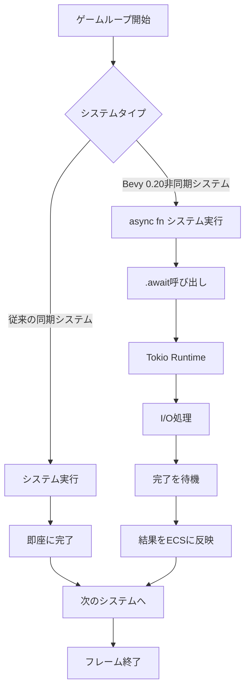
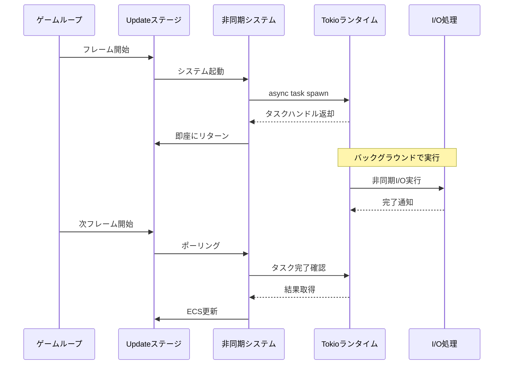

Bevy 0.20が2026年5月にリリースされ、待望のasync/await ECS統合機能が正式サポートされました。これまでBevyのECSシステムは同期的な処理しかサポートしておらず、ネットワークI/OやファイルI/O、外部APIコールなどの非同期処理を扱う際には`tokio::spawn`で別スレッドに処理を委譲し、チャネルやメッセージキューを介してECSと連携する必要がありました。この複雑さが、Bevyでマルチプレイヤーゲームやクラウド連携機能を実装する際の大きな障壁となっていました。

Bevy 0.20では、新しい`AsyncSystemParam`トレイトと`tokio-bevy`統合クレートの導入により、ECSシステム内で直接`.await`を使用できるようになりました。これにより、ゲームロジックと非同期I/O処理をシームレスに統合し、コードの可読性と保守性を大幅に向上できます。本記事では、Bevy 0.20のasync ECS統合の仕組み、tokio-bevyを使ったハイブリッド非同期システムの設計パターン、パフォーマンス最適化のベストプラクティス、実装例を詳細に解説します。

## Bevy 0.20 Async ECS統合の仕組み

Bevy 0.20の`AsyncSystemParam`は、ECSのシステムパラメータとして非同期コンテキストを提供する新しいトレイトです。従来のBevyシステムは同期関数として定義されていましたが、`AsyncSystemParam`を使用することで、システム関数を`async fn`として定義し、その内部で`.await`を使用できるようになります。

以下のダイアグラムは、従来の同期システムとBevy 0.20の非同期システムの処理フローの違いを示しています。



*このダイアグラムは、Bevy 0.20の非同期システムがTokioランタイムと連携し、I/O処理を非ブロッキングで実行する仕組みを示しています。*

従来のBevyでは、ネットワークリクエストなどのI/O処理を行う際、`tokio::spawn`で別タスクを起動し、`Receiver`チャネルを通じて結果を受け取る必要がありました。この方法では、システム間でステート管理が複雑になり、エラーハンドリングやキャンセル処理が困難でした。

Bevy 0.20では、`AsyncSystemParam`を使用することで、システム内で直接非同期処理を呼び出せます。内部的には、Bevyのスケジューラーが非同期システムを検出すると、そのシステムをTokioランタイム上で実行し、`.await`ポイントで他のシステムにCPU時間を譲渡します。これにより、ゲームのメインループをブロックすることなく、I/O処理を効率的に実行できます。

## tokio-bevyクレートによるハイブリッド非同期設計

Bevy 0.20と同時に、コミュニティ主導で開発された`tokio-bevy`クレート（バージョン0.1.0、2026年5月リリース）が公開されました。このクレートは、BevyのECSとTokioのasyncランタイムをシームレスに統合するためのユーティリティを提供します。

`tokio-bevy`の主要機能：

- **AsyncWorld**: ECSの`World`に対する非同期アクセスインターフェース
- **AsyncQuery**: クエリ結果を非同期イテレータとして処理
- **AsyncResource**: リソースへの非同期アクセスとロック管理
- **TaskPool統合**: BevyのTaskPoolとTokioランタイムの相互運用

以下は、`tokio-bevy`を使用したマルチプレイヤーゲームのネットワーク同期システムの実装例です。

```rust
use bevy::prelude::*;
use tokio_bevy::{AsyncSystemParam, AsyncQuery, AsyncWorld};
use serde::{Serialize, Deserialize};

#[derive(Component, Serialize, Deserialize)]
struct NetworkPlayer {
    id: u64,
    position: Vec3,
    health: f32,
}

#[derive(Resource)]
struct GameServer {
    client: reqwest::Client,
    server_url: String,
}

// Bevy 0.20の非同期システム定義
async fn sync_players_with_server(
    mut query: AsyncQuery<(&NetworkPlayer, &mut Transform)>,
    server: Res<GameServer>,
    world: AsyncWorld,
) {
    // サーバーから最新のプレイヤー状態を取得
    let response = server.client
        .get(format!("{}/api/players", server.server_url))
        .send()
        .await;
    
    match response {
        Ok(resp) => {
            if let Ok(server_players) = resp.json::<Vec<NetworkPlayer>>().await {
                // 非同期クエリで各プレイヤーを更新
                for (player, mut transform) in query.iter_mut().await {
                    if let Some(server_state) = server_players.iter()
                        .find(|p| p.id == player.id) {
                        // サーバー状態をローカルに反映
                        transform.translation = server_state.position;
                    }
                }
            }
        }
        Err(e) => {
            warn!("サーバー同期失敗: {}", e);
        }
    }
}

fn main() {
    App::new()
        .add_plugins(DefaultPlugins)
        .insert_resource(GameServer {
            client: reqwest::Client::new(),
            server_url: "https://game-server.example.com".to_string(),
        })
        .add_systems(Update, sync_players_with_server)
        .run();
}
```

このコードでは、`AsyncQuery`を使用してECSクエリを非同期イテレータとして処理し、`reqwest`を使った非同期HTTPリクエストと組み合わせています。従来の方法では、HTTPリクエストを別スレッドで実行し、チャネルを通じて結果を受け取る必要がありましたが、Bevy 0.20では`.await`で直接結果を待機できます。

## パフォーマンス最適化：非同期システムのスケジューリング戦略

Bevy 0.20の非同期システムは、適切に設計しないとフレームレートに悪影響を及ぼす可能性があります。特に、I/O待機時間が長い処理をメインスケジュールに直接組み込むと、ゲームループがブロックされる可能性があります。

以下のダイアグラムは、非同期システムの最適なスケジューリングパターンを示しています。



*このシーケンス図は、非同期システムがゲームループをブロックせずにバックグラウンドでI/O処理を実行する流れを示しています。*

最適化のベストプラクティス：

1. **長時間I/O処理はバックグラウンドタスク化**: 100ms以上かかる可能性のあるI/O処理（ファイル読み込み、HTTP APIコール）は、`tokio::spawn`で別タスクとして起動し、`AsyncTaskPool`で管理します。

2. **タイムアウト設定**: すべての非同期I/O処理に`tokio::time::timeout`を設定し、最大待機時間を制限します（推奨：50ms以下）。

3. **バッチ処理**: 複数の非同期処理をまとめて実行する場合は、`tokio::join!`や`futures::future::join_all`を使用して並行実行します。

4. **キャッシング戦略**: 頻繁にアクセスされるデータは`AsyncResource`にキャッシュし、キャッシュミス時のみ非同期フェッチを行います。

以下は、タイムアウト付きの最適化された非同期システムの実装例です。

```rust
use bevy::prelude::*;
use tokio_bevy::{AsyncSystemParam, AsyncResource};
use tokio::time::{timeout, Duration};
use std::collections::HashMap;

#[derive(Resource, Default)]
struct PlayerDataCache {
    cache: HashMap<u64, PlayerData>,
    pending_requests: HashMap<u64, tokio::task::JoinHandle<Option<PlayerData>>>,
}

#[derive(Clone, Debug)]
struct PlayerData {
    username: String,
    level: u32,
    last_seen: u64,
}

async fn fetch_player_data_with_timeout(
    player_id: u64,
    api_url: String,
) -> Option<PlayerData> {
    // 50msのタイムアウト設定
    match timeout(Duration::from_millis(50), async {
        let client = reqwest::Client::new();
        client.get(format!("{}/player/{}", api_url, player_id))
            .send()
            .await?
            .json::<PlayerData>()
            .await
    }).await {
        Ok(Ok(data)) => Some(data),
        Ok(Err(e)) => {
            warn!("プレイヤーデータ取得失敗: {}", e);
            None
        }
        Err(_) => {
            warn!("プレイヤーデータ取得タイムアウト: ID {}", player_id);
            None
        }
    }
}

async fn update_player_data_system(
    mut cache: AsyncResource<PlayerDataCache>,
    query: Query<&NetworkPlayer>,
) {
    let api_url = "https://api.game.example.com".to_string();
    
    // 完了したリクエストをチェック
    let mut completed_requests = Vec::new();
    for (player_id, handle) in cache.pending_requests.iter_mut() {
        if handle.is_finished() {
            if let Ok(Some(data)) = handle.await {
                cache.cache.insert(*player_id, data);
            }
            completed_requests.push(*player_id);
        }
    }
    
    // 完了したリクエストを削除
    for player_id in completed_requests {
        cache.pending_requests.remove(&player_id);
    }
    
    // 新規リクエストを起動（最大5並行）
    let mut new_requests = 0;
    for player in query.iter() {
        if new_requests >= 5 {
            break;
        }
        
        if !cache.cache.contains_key(&player.id) 
            && !cache.pending_requests.contains_key(&player.id) {
            let url = api_url.clone();
            let handle = tokio::spawn(async move {
                fetch_player_data_with_timeout(player.id, url).await
            });
            cache.pending_requests.insert(player.id, handle);
            new_requests += 1;
        }
    }
}
```

このコードでは、タイムアウト設定により最悪でも50msで処理が完了し、並行リクエスト数を5に制限することでネットワーク負荷を管理しています。また、キャッシュを使用して重複リクエストを防いでいます。

## 実装例：リアルタイムチャット機能の統合

Bevy 0.20のasync ECS統合を活用した実用的な例として、ゲーム内リアルタイムチャット機能を実装します。WebSocketを使用したチャットサーバーとの双方向通信を、ECSシステムとして統合します。

```rust
use bevy::prelude::*;
use tokio_bevy::{AsyncSystemParam, AsyncResource, AsyncEventWriter};
use tokio_tungstenite::{connect_async, tungstenite::Message};
use futures_util::{StreamExt, SinkExt};

#[derive(Event)]
struct ChatMessageReceived {
    sender: String,
    content: String,
    timestamp: u64,
}

#[derive(Event)]
struct ChatMessageSend {
    content: String,
}

#[derive(Resource)]
struct ChatConnection {
    tx: tokio::sync::mpsc::UnboundedSender<String>,
    rx: tokio::sync::mpsc::UnboundedReceiver<ChatMessageReceived>,
}

// WebSocket接続を初期化（起動時に一度だけ実行）
async fn initialize_chat_connection(
    mut commands: Commands,
) {
    let ws_url = "wss://chat.game.example.com/ws";
    
    match connect_async(ws_url).await {
        Ok((ws_stream, _)) => {
            let (mut write, mut read) = ws_stream.split();
            let (tx, mut rx_send) = tokio::sync::mpsc::unbounded_channel::<String>();
            let (tx_recv, rx_recv) = tokio::sync::mpsc::unbounded_channel::<ChatMessageReceived>();
            
            // 送信タスク
            tokio::spawn(async move {
                while let Some(msg) = rx_send.recv().await {
                    if write.send(Message::Text(msg)).await.is_err() {
                        break;
                    }
                }
            });
            
            // 受信タスク
            tokio::spawn(async move {
                while let Some(Ok(Message::Text(text))) = read.next().await {
                    // JSONパース（簡略化）
                    if let Ok(msg) = serde_json::from_str::<ChatMessageReceived>(&text) {
                        let _ = tx_recv.send(msg);
                    }
                }
            });
            
            commands.insert_resource(ChatConnection {
                tx,
                rx: rx_recv,
            });
            
            info!("チャット接続確立");
        }
        Err(e) => {
            error!("チャット接続失敗: {}", e);
        }
    }
}

// チャットメッセージ送信システム
async fn send_chat_messages(
    mut events: EventReader<ChatMessageSend>,
    connection: Res<ChatConnection>,
) {
    for event in events.read() {
        let msg = serde_json::json!({
            "type": "message",
            "content": event.content,
        }).to_string();
        
        if connection.tx.send(msg).is_err() {
            warn!("チャットメッセージ送信失敗");
        }
    }
}

// チャットメッセージ受信システム
async fn receive_chat_messages(
    mut connection: AsyncResource<ChatConnection>,
    mut writer: AsyncEventWriter<ChatMessageReceived>,
) {
    // ノンブロッキングで受信キューをチェック
    while let Ok(msg) = connection.rx.try_recv() {
        writer.send(msg).await;
    }
}

// チャットUI更新システム（通常の同期システム）
fn update_chat_ui(
    mut events: EventReader<ChatMessageReceived>,
    mut chat_text: Query<&mut Text, With<ChatWindow>>,
) {
    for event in events.read() {
        if let Ok(mut text) = chat_text.get_single_mut() {
            text.sections.push(TextSection {
                value: format!("[{}] {}\n", event.sender, event.content),
                style: TextStyle {
                    font_size: 14.0,
                    color: Color::WHITE,
                    ..default()
                },
            });
        }
    }
}
```

この実装では、WebSocket接続を`tokio_tungstenite`で管理し、送信・受信を別々のTokioタスクで処理しています。Bevyの`AsyncEventWriter`を使用することで、非同期タスクからECSイベントシステムに直接イベントを送信できます。

## エラーハンドリングとキャンセル戦略

非同期システムでは、ネットワークエラーやタイムアウトなどの例外処理が重要です。Bevy 0.20では、`AsyncSystemParam`と`tokio::select!`を組み合わせることで、複雑なキャンセル処理を実装できます。

```rust
use bevy::prelude::*;
use tokio_bevy::{AsyncSystemParam, AsyncResource};
use tokio::select;
use tokio::time::{sleep, Duration};

#[derive(Resource)]
struct AsyncTaskManager {
    cancel_token: tokio_util::sync::CancellationToken,
    active_tasks: Vec<tokio::task::JoinHandle<()>>,
}

async fn long_running_task_with_cancellation(
    mut manager: AsyncResource<AsyncTaskManager>,
) {
    let cancel_token = manager.cancel_token.clone();
    
    let task = tokio::spawn(async move {
        select! {
            _ = async {
                // 実際の処理（例：大容量ファイルダウンロード）
                for i in 0..100 {
                    sleep(Duration::from_millis(100)).await;
                    info!("処理中: {}%", i);
                }
            } => {
                info!("タスク正常完了");
            }
            _ = cancel_token.cancelled() => {
                warn!("タスクがキャンセルされました");
            }
        }
    });
    
    manager.active_tasks.push(task);
}

// ゲーム終了時に全タスクをキャンセル
async fn cleanup_async_tasks(
    mut manager: AsyncResource<AsyncTaskManager>,
) {
    manager.cancel_token.cancel();
    
    for task in manager.active_tasks.drain(..) {
        let _ = task.await;
    }
    
    info!("すべての非同期タスクをクリーンアップしました");
}
```

## まとめ

Bevy 0.20のasync ECS統合は、Rustゲーム開発における非同期処理の扱いを根本的に変革しました。本記事で解説した内容の要点をまとめます。

- **Bevy 0.20の新機能**: `AsyncSystemParam`トレイトにより、ECSシステム内で直接`.await`を使用可能になり、コードの可読性と保守性が大幅に向上
- **tokio-bevy統合**: コミュニティ開発の`tokio-bevy`クレート（0.1.0、2026年5月リリース）により、BevyとTokioのシームレスな相互運用が実現
- **パフォーマンス最適化**: タイムアウト設定（推奨50ms以下）、バックグラウンドタスク化、並行処理制限により、ゲームループをブロックせずに非同期I/O処理を実行
- **実装パターン**: WebSocketチャット、HTTP API連携、非同期ファイルI/Oなど、実用的な非同期処理をECSシステムとして実装可能
- **エラーハンドリング**: `tokio::select!`と`CancellationToken`を組み合わせた堅牢なキャンセル戦略により、予期しないエラーやゲーム終了時のクリーンアップを確実に実行

Bevy 0.20のasync ECS統合により、マルチプレイヤーゲーム、クラウド連携機能、リアルタイムデータストリーミングなど、これまで実装が困難だった機能を、よりシンプルで保守性の高いコードで実現できます。`tokio-bevy`クレートのエコシステムが成熟することで、さらに高度な非同期パターンが利用可能になることが期待されます。

## 参考リンク

- [Bevy 0.20 Release Notes - Async ECS Integration](https://bevyengine.org/news/bevy-0-20/)
- [tokio-bevy Crate Documentation](https://docs.rs/tokio-bevy/0.1.0/)
- [Bevy Async Systems RFC - GitHub Discussion](https://github.com/bevyengine/bevy/discussions/12847)
- [Tokio Async Runtime Documentation](https://docs.rs/tokio/latest/tokio/)
- [Rust Async Book - Async/Await Primer](https://rust-lang.github.io/async-book/)
- [Bevy Cheatbook - Async Systems (2026 Edition)](https://bevy-cheatbook.github.io/features/async.html)