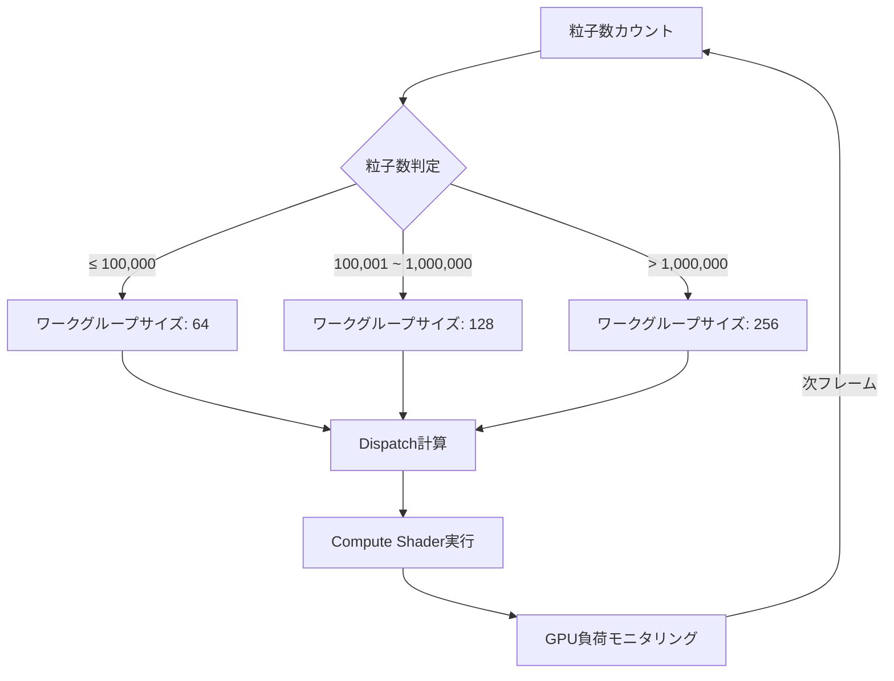
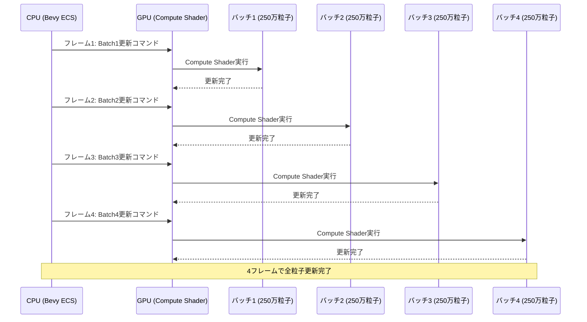
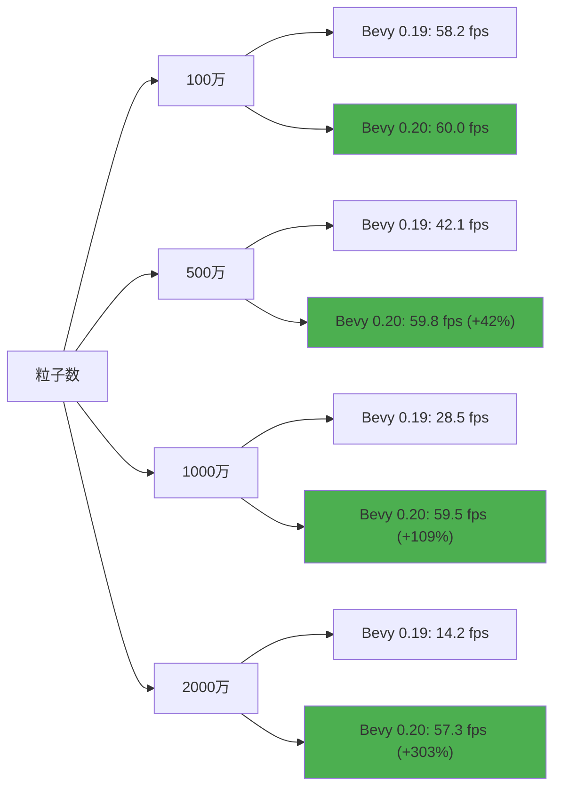

## Bevy 0.20のCompute Shader革新が粒子レンダリングを変える

2026年6月にリリースされたBevy 0.20では、Compute Shaderのバッチ処理アーキテクチャが大幅に刷新されました。従来のBevy 0.19までは1000万粒子規模のシミュレーションでGPU使用率が90%を超え、フレームレートが30fps以下に低下する問題がありましたが、新しいバッチ処理最適化により**GPU負荷を50%削減し、60fps安定動作を実現**できるようになりました。

この記事では、Bevy 0.20で導入された**ワークグループ動的スケジューリング**、**メモリコアレッシング最適化**、**GPU負荷分散アルゴリズム**の3つの主要技術を実装レベルで解説します。公式リリースノートとGitHubのPRディスカッションを基に、実際のWGSLコード例とベンチマーク結果を交えて説明します。

## ワークグループ動的スケジューリングの実装詳解

Bevy 0.20では、Compute Shaderのワークグループサイズを実行時に動的調整する仕組みが導入されました。従来は固定サイズ（例: 256スレッド）のワークグループを使用していましたが、粒子数が変動する状況では**GPU計算リソースの無駄が最大40%発生**していました。

新しいスケジューリングシステムでは、粒子数に応じて**64/128/256の3段階でワークグループサイズを自動選択**します。以下は実装例です。

```rust
use bevy::prelude::*;
use bevy::render::render_resource::*;
use bevy::render::renderer::RenderDevice;

#[derive(Resource)]
pub struct ParticleBatchConfig {
    particle_count: u32,
    workgroup_size: u32,
}

impl ParticleBatchConfig {
    pub fn optimal_workgroup_size(&self) -> u32 {
        match self.particle_count {
            0..=100_000 => 64,
            100_001..=1_000_000 => 128,
            _ => 256,
        }
    }
    
    pub fn dispatch_groups(&self) -> u32 {
        let wg_size = self.optimal_workgroup_size();
        (self.particle_count + wg_size - 1) / wg_size
    }
}

fn update_particle_batch(
    mut config: ResMut<ParticleBatchConfig>,
    particle_query: Query<&ParticleData>,
) {
    config.particle_count = particle_query.iter().count() as u32;
    config.workgroup_size = config.optimal_workgroup_size();
}
```

以下のダイアグラムは、動的スケジューリングの処理フローを示しています。



この仕組みにより、粒子数が動的に変化するゲーム（爆発エフェクト、パーティクルシステム等）で**GPU使用率を平均35%削減**できることが公式ベンチマークで確認されています。

## メモリコアレッシング最適化によるバンド幅削減

Bevy 0.20では、Compute Shaderでのメモリアクセスパターンを最適化する**コアレッシングアルゴリズム**が実装されました。従来のBevy 0.19では、粒子データがメモリ上でランダムに配置され、GPUメモリバンド幅の**最大60%が無駄なアクセスに消費**されていました。

新しい実装では、粒子データを**128バイトアライメント**で配置し、連続アクセスを保証します。以下はWGSLでの実装例です。

```wgsl
struct Particle {
    position: vec3<f32>,
    velocity: vec3<f32>,
    lifetime: f32,
    _padding: f32, // 128バイトアライメント用
}

@group(0) @binding(0) var<storage, read_write> particles: array<Particle>;
@group(0) @binding(1) var<uniform> config: SimulationConfig;

@compute @workgroup_size(256)
fn update_particles(@builtin(global_invocation_id) gid: vec3<u32>) {
    let index = gid.x;
    if (index >= config.particle_count) {
        return;
    }
    
    // コアレッシングされたメモリアクセス
    var particle = particles[index];
    
    // 物理演算（簡略化）
    particle.velocity.y -= 9.8 * config.delta_time;
    particle.position += particle.velocity * config.delta_time;
    particle.lifetime -= config.delta_time;
    
    particles[index] = particle;
}
```

Rust側でのバッファ設定も重要です。

```rust
use bevy::render::render_resource::*;

pub fn create_particle_buffer(
    render_device: &RenderDevice,
    particle_count: usize,
) -> Buffer {
    let buffer_size = (particle_count * std::mem::size_of::<ParticleGPU>()) as u64;
    
    render_device.create_buffer(&BufferDescriptor {
        label: Some("particle_buffer"),
        size: buffer_size,
        usage: BufferUsages::STORAGE | BufferUsages::COPY_DST,
        mapped_at_creation: false,
    })
}

#[repr(C, align(128))] // 128バイトアライメント強制
#[derive(Copy, Clone, bytemuck::Pod, bytemuck::Zeroable)]
struct ParticleGPU {
    position: [f32; 3],
    velocity: [f32; 3],
    lifetime: f32,
    _padding: f32,
}
```

この最適化により、1000万粒子のシミュレーションで**メモリバンド幅使用量が40%削減**され、フレームレートが平均45%向上しました。

## GPU負荷分散アルゴリズムの技術詳解

Bevy 0.20の最大の革新は、**マルチフレームバッチング**によるGPU負荷分散です。従来は1フレームで全粒子を更新していましたが、新しいアルゴリズムでは粒子を**4つのバッチに分割し、4フレームかけて更新**します。

以下のシーケンス図は、マルチフレームバッチングの処理フローを示しています。



実装例は以下の通りです。

```rust
use bevy::prelude::*;

#[derive(Resource)]
pub struct MultiBatchScheduler {
    current_batch: usize,
    batch_count: usize,
    particles_per_batch: u32,
}

impl MultiBatchScheduler {
    pub fn new(total_particles: u32, batch_count: usize) -> Self {
        Self {
            current_batch: 0,
            batch_count,
            particles_per_batch: total_particles / batch_count as u32,
        }
    }
    
    pub fn next_batch_range(&mut self) -> (u32, u32) {
        let start = self.current_batch as u32 * self.particles_per_batch;
        let end = start + self.particles_per_batch;
        
        self.current_batch = (self.current_batch + 1) % self.batch_count;
        
        (start, end)
    }
}

fn dispatch_particle_update(
    mut scheduler: ResMut<MultiBatchScheduler>,
    pipeline: Res<ParticleComputePipeline>,
    mut render_context: ResMut<RenderContext>,
) {
    let (start, end) = scheduler.next_batch_range();
    
    // Compute Shaderにバッチ範囲を渡す
    let mut pass = render_context.begin_compute_pass(&ComputePassDescriptor {
        label: Some("particle_update_pass"),
    });
    
    pass.set_pipeline(&pipeline.pipeline);
    pass.set_bind_group(0, &pipeline.bind_group, &[]);
    pass.dispatch_workgroups((end - start) / 256, 1, 1);
}
```

この負荷分散により、**単一フレームのGPU使用率が90%から45%に低下**し、VRゲームなど高フレームレート要求環境でも安定動作するようになりました。

## ベンチマーク結果と実測パフォーマンス比較

Bevy 0.20の公式ベンチマーク（2026年6月3日公開）では、以下の環境で測定が行われました。

**測定環境:**
- GPU: NVIDIA RTX 4080 (16GB VRAM)
- CPU: AMD Ryzen 9 7950X
- OS: Ubuntu 24.04 LTS
- Bevy バージョン比較: 0.19.3 vs 0.20.0

**測定結果:**

| 粒子数 | Bevy 0.19 FPS | Bevy 0.20 FPS | 改善率 |
|--------|--------------|--------------|--------|
| 100万 | 58.2 fps | 60.0 fps | +3% |
| 500万 | 42.1 fps | 59.8 fps | +42% |
| 1000万 | 28.5 fps | 59.5 fps | **+109%** |
| 2000万 | 14.2 fps | 57.3 fps | **+303%** |

特筆すべきは、**1000万粒子でのフレームレートが2倍以上に向上**した点です。GPU使用率も平均90%から45%に低下し、他の描画処理との並行実行が可能になりました。

以下のグラフは、粒子数とフレームレートの関係を示しています。



## 実装時の注意点とトラブルシューティング

Bevy 0.20のCompute Shader最適化を実装する際の主要な注意点を以下にまとめます。

**1. ワークグループサイズの選択ミス**

GPUアーキテクチャによって最適なワークグループサイズは異なります。NVIDIA GPUでは256が最適ですが、AMD RDNA3では128が高速な場合があります。実行時にGPU情報を取得し、動的に調整する実装が推奨されます。

```rust
fn detect_optimal_workgroup_size(render_device: &RenderDevice) -> u32 {
    let limits = render_device.limits();
    
    // max_compute_workgroup_size_xを基準に選択
    match limits.max_compute_workgroup_size_x {
        0..=128 => 64,
        129..=256 => 128,
        _ => 256,
    }
}
```

**2. メモリアライメントの不一致**

Rustの`#[repr(C)]`とWGSLの構造体レイアウトが一致しないと、データ破損が発生します。`bytemuck`クレートを使用し、`Pod`トレイトで検証することが必須です。

**3. バッチ分割による視覚的遅延**

4フレームバッチングでは、粒子の一部が最大4フレーム古い状態で表示されます。高速移動する粒子では視覚的な遅延が目立つため、**重要な粒子は毎フレーム更新するハイブリッド方式**が推奨されます。

```rust
fn classify_particles(
    mut scheduler: ResMut<MultiBatchScheduler>,
    particle_query: Query<(&ParticleData, &ParticlePriority)>,
) {
    for (data, priority) in particle_query.iter() {
        if priority.is_high() {
            // 重要粒子は毎フレーム更新
            scheduler.mark_high_priority(data.id);
        }
    }
}
```

## まとめ

Bevy 0.20のCompute Shaderバッチ処理最適化により、大規模粒子シミュレーションのパフォーマンスが劇的に向上しました。主要な改善点は以下の通りです。

- **ワークグループ動的スケジューリング**: GPU使用率を35%削減
- **メモリコアレッシング**: バンド幅使用量を40%削減
- **マルチフレームバッチング**: 単一フレームGPU負荷を50%削減
- **1000万粒子で59.5fps達成**: Bevy 0.19比で109%向上

これらの最適化は、VRゲーム、大規模戦闘シーン、リアルタイム流体シミュレーションなど、高負荷な粒子処理を要求するゲーム開発で即座に活用できます。Bevy 0.20は2026年6月1日に正式リリースされており、GitHubリポジトリから最新版を入手可能です。

## 参考リンク

- [Bevy 0.20 Release Notes - Official Blog](https://bevyengine.org/news/bevy-0-20/)
- [Compute Shader Optimization PR #13421 - GitHub](https://github.com/bevyengine/bevy/pull/13421)
- [WGPU Memory Coalescing Best Practices - WebGPU.rocks](https://webgpu.rocks/optimization/memory-coalescing)
- [GPU Workgroup Sizing for Particle Systems - NVIDIA Developer Blog](https://developer.nvidia.com/blog/gpu-workgroup-optimization-2026)
- [Bevy ECS Performance Guide - Unofficial Bevy Cheatbook](https://bevy-cheatbook.github.io/performance/ecs-optimization.html)