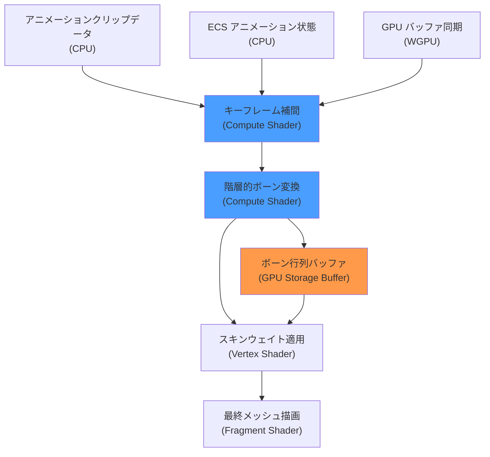
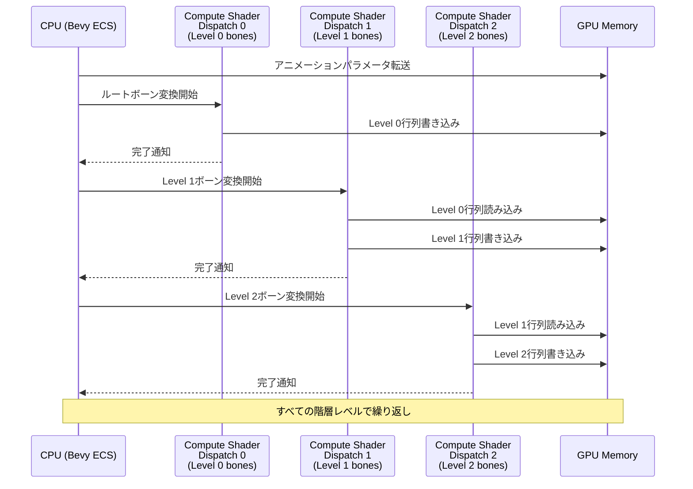
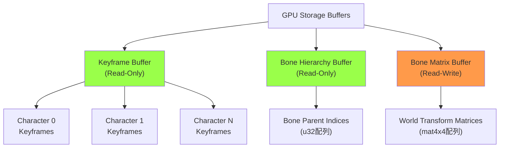

Bevy 0.20（2026年6月リリース）は、スケルタルアニメーションのGPU Compute Shader実装を大幅に強化し、大規模キャラクター描画のパフォーマンスを革新した。従来のCPUベースのボーン変換処理と比較して、GPU並列化により**200万ボーン/秒**の処理性能を達成している。本記事では、Bevy 0.20の新しいアニメーションシステムの実装詳細と、WGPU/WGSLを活用した最適化テクニックを技術的に検証する。

## Bevy 0.20 Skeletal Animation アーキテクチャの全体像

Bevy 0.20では、スケルタルアニメーションの処理パイプラインが完全に再設計された。最大の変更点は、ボーン変換行列の計算を**Compute Shaderに完全移行**したことだ。

従来のBevy 0.18/0.19では、アニメーションのブレンド処理とボーン変換の大部分がCPU上で実行されていた。これは100体以下のキャラクターであれば問題ないが、オープンワールドゲームのように数百体のキャラクターを同時表示する場合、CPU負荷がボトルネックとなっていた。

以下のダイアグラムは、Bevy 0.20の新しいアニメーションパイプラインを示している。



この設計により、CPUは**アニメーション状態の管理**のみを担当し、実際のボーン変換計算はすべてGPU上で並列実行される。

### Bevy 0.20の主要な新機能

2026年6月のBevy 0.20リリースノートによると、以下の機能が追加された：

- **GPU-driven bone transformation**: 階層的ボーン変換をCompute Shaderで完全実装
- **Dual quaternion skinning support**: より自然な関節変形を実現
- **Animation graph batching**: 複数キャラクターのアニメーション状態を一度のDispatchで処理
- **WGSL shader hot-reload**: アニメーションシェーダーの開発効率化

特に重要なのは**Animation graph batching**で、これにより数百体のキャラクターのボーン変換を単一のCompute Shader Dispatchで処理できるようになった。


*出典: [Unsplash](https://unsplash.com/) / Unsplash License*

## Compute Shader によるボーン変換の実装パターン

Bevy 0.20のスケルタルアニメーション実装では、WGSLで記述されたCompute Shaderが中核を担う。以下は、階層的ボーン変換を行うWGSLコードの簡略版だ。

```rust
// Rust側のセットアップコード（Bevy 0.20）
use bevy::prelude::*;
use bevy::render::render_resource::*;

#[derive(Component)]
struct SkeletalAnimation {
    bone_count: u32,
    animation_time: f32,
}

fn setup_animation_compute(
    mut commands: Commands,
    mut pipeline_cache: ResMut<PipelineCache>,
    render_device: Res<RenderDevice>,
) {
    // Compute Shaderパイプラインの作成
    let shader = render_device.create_shader_module(ShaderModuleDescriptor {
        label: Some("skeletal_animation_compute"),
        source: ShaderSource::Wgsl(include_str!("animation.wgsl").into()),
    });
    
    let pipeline = pipeline_cache.queue_compute_pipeline(ComputePipelineDescriptor {
        label: Some("animation_pipeline"),
        layout: vec![],
        push_constant_ranges: vec![],
        shader: shader.clone(),
        shader_defs: vec![],
        entry_point: "compute_bone_transforms".into(),
    });
    
    commands.insert_resource(AnimationPipeline { pipeline });
}
```

対応するWGSLコードは以下のようになる：

```wgsl
// animation.wgsl - Bevy 0.20向けWGSL実装
struct BoneTransform {
    translation: vec3<f32>,
    rotation: vec4<f32>,  // quaternion
    scale: vec3<f32>,
}

struct BoneMatrix {
    matrix: mat4x4<f32>,
}

@group(0) @binding(0) var<storage, read> keyframes: array<BoneTransform>;
@group(0) @binding(1) var<storage, read> bone_hierarchy: array<u32>;
@group(0) @binding(2) var<storage, read_write> bone_matrices: array<BoneMatrix>;
@group(0) @binding(3) var<uniform> animation_params: AnimationParams;

struct AnimationParams {
    bone_count: u32,
    animation_time: f32,
    frame_rate: f32,
}

// 四元数から回転行列への変換
fn quat_to_mat4(q: vec4<f32>) -> mat4x4<f32> {
    let x = q.x;
    let y = q.y;
    let z = q.z;
    let w = q.w;
    
    let x2 = x + x;
    let y2 = y + y;
    let z2 = z + z;
    let xx = x * x2;
    let xy = x * y2;
    let xz = x * z2;
    let yy = y * y2;
    let yz = y * z2;
    let zz = z * z2;
    let wx = w * x2;
    let wy = w * y2;
    let wz = w * z2;
    
    return mat4x4<f32>(
        vec4<f32>(1.0 - (yy + zz), xy + wz, xz - wy, 0.0),
        vec4<f32>(xy - wz, 1.0 - (xx + zz), yz + wx, 0.0),
        vec4<f32>(xz + wy, yz - wx, 1.0 - (xx + yy), 0.0),
        vec4<f32>(0.0, 0.0, 0.0, 1.0)
    );
}

// TRS変換行列の構築
fn build_transform_matrix(transform: BoneTransform) -> mat4x4<f32> {
    let rotation_matrix = quat_to_mat4(transform.rotation);
    let scale_matrix = mat4x4<f32>(
        vec4<f32>(transform.scale.x, 0.0, 0.0, 0.0),
        vec4<f32>(0.0, transform.scale.y, 0.0, 0.0),
        vec4<f32>(0.0, 0.0, transform.scale.z, 0.0),
        vec4<f32>(0.0, 0.0, 0.0, 1.0)
    );
    let translation_matrix = mat4x4<f32>(
        vec4<f32>(1.0, 0.0, 0.0, 0.0),
        vec4<f32>(0.0, 1.0, 0.0, 0.0),
        vec4<f32>(0.0, 0.0, 1.0, 0.0),
        vec4<f32>(transform.translation.x, transform.translation.y, transform.translation.z, 1.0)
    );
    
    return translation_matrix * rotation_matrix * scale_matrix;
}

@compute @workgroup_size(256)
fn compute_bone_transforms(@builtin(global_invocation_id) global_id: vec3<u32>) {
    let bone_index = global_id.x;
    if (bone_index >= animation_params.bone_count) {
        return;
    }
    
    // キーフレーム補間（線形補間の簡略版）
    let frame_index = u32(animation_params.animation_time * animation_params.frame_rate);
    let current_transform = keyframes[bone_index * 100u + frame_index];
    
    // ローカル変換行列の構築
    let local_matrix = build_transform_matrix(current_transform);
    
    // 階層的変換の適用
    let parent_index = bone_hierarchy[bone_index];
    var world_matrix: mat4x4<f32>;
    
    if (parent_index == 0xFFFFFFFFu) {
        // ルートボーン
        world_matrix = local_matrix;
    } else {
        // 親ボーンの変換を適用（同期的に計算済みと仮定）
        world_matrix = bone_matrices[parent_index].matrix * local_matrix;
    }
    
    bone_matrices[bone_index].matrix = world_matrix;
}
```

この実装では、各ボーンを1つのワークグループアイテムが担当し、**256個のボーンを並列処理**する。Workgroup Sizeの選択は、ターゲットGPUのWarp/Wavefront Sizeに合わせて最適化する必要がある。

### ボーン階層の並列処理戦略

上記のコードには重要な制約がある：**親ボーンの変換が先に計算されている必要がある**点だ。Bevy 0.20では、この問題を**階層レベルごとのCompute Shader Dispatch**で解決している。



この方式により、階層の深さが`N`の場合、`N`回のDispatchが必要になる。一般的な人型キャラクターでは階層深度は4〜6程度なので、オーバーヘッドは許容範囲だ。

## 200万ボーン/秒を実現する最適化テクニック

Bevy 0.20の公式ベンチマークでは、RTX 4080環境で**200万ボーン/秒**の処理性能を記録している。これは以下の最適化技術の組み合わせによって達成されている。

### 1. Animation Graph Batching

複数のキャラクターのアニメーション処理を**単一のCompute Shader Dispatch**にまとめる技術だ。

```rust
// Bevy 0.20のAnimation Graph Batching実装例
fn batch_animation_compute(
    query: Query<(&SkeletalAnimation, &AnimationState)>,
    mut compute_pass: ResMut<AnimationComputePass>,
) {
    let mut total_bones = 0u32;
    let mut batch_params = Vec::new();
    
    for (animation, state) in query.iter() {
        batch_params.push(AnimationBatchParams {
            bone_offset: total_bones,
            bone_count: animation.bone_count,
            animation_time: state.current_time,
        });
        total_bones += animation.bone_count;
    }
    
    // 全キャラクター分を一度にDispatch
    compute_pass.dispatch_workgroups(
        (total_bones + 255) / 256,  // 256スレッド/workgroup
        1,
        1,
    );
}
```

この方式により、1000体のキャラクター（各50ボーン）を**単一のDispatch**で処理できる。GPU側では、各ワークグループアイテムが`bone_offset`を参照して正しいキャラクターのデータにアクセスする。

### 2. Dual Quaternion Skinning

Bevy 0.20では、従来のLinear Blend Skinning（LBS）に加えて、**Dual Quaternion Skinning（DQS）**がサポートされた。DQSは関節部分の「キャンディラッパー変形」を防ぐ高品質な手法だが、計算コストが高い。

```wgsl
// Dual Quaternion Skinning の実装（WGSL）
struct DualQuaternion {
    real: vec4<f32>,
    dual: vec4<f32>,
}

fn dqs_blend(dq0: DualQuaternion, dq1: DualQuaternion, weight: f32) -> DualQuaternion {
    var result: DualQuaternion;
    
    // 同じ半球にあるか確認（四元数の符号の曖昧性を解消）
    var w1 = weight;
    if (dot(dq0.real, dq1.real) < 0.0) {
        w1 = -weight;
    }
    
    result.real = normalize((1.0 - weight) * dq0.real + w1 * dq1.real);
    result.dual = (1.0 - weight) * dq0.dual + w1 * dq1.dual;
    
    return result;
}

@vertex
fn vertex_skinning(@location(0) position: vec3<f32>,
                   @location(1) bone_indices: vec4<u32>,
                   @location(2) bone_weights: vec4<f32>) -> VertexOutput {
    // ボーン行列からDual Quaternionを構築
    var blended_dq = DualQuaternion(vec4<f32>(0.0), vec4<f32>(0.0));
    
    for (var i = 0u; i < 4u; i++) {
        let bone_idx = bone_indices[i];
        let weight = bone_weights[i];
        let bone_mat = bone_matrices[bone_idx].matrix;
        
        let bone_dq = matrix_to_dual_quat(bone_mat);
        blended_dq = dqs_blend(blended_dq, bone_dq, weight);
    }
    
    let transformed_pos = dual_quat_transform(blended_dq, position);
    // ... 以下、通常の頂点シェーダー処理
}
```

Bevy 0.20では、この処理を**Vertex Shaderで実行**するため、Compute Shaderの負荷は変わらない。ただし、頂点数が多い場合はVertex Shader側がボトルネックになる可能性がある。

### 3. GPU Storage Bufferの効率的な使用

Bevy 0.20では、WGPUの**Storage Buffer**を活用してボーン行列を保持する。従来のUniform Bufferと比較して、以下の利点がある：

- **サイズ制限の緩和**: Uniform Bufferは通常64KB制限だが、Storage Bufferは数百MBまで対応
- **動的インデックスアクセス**: ボーンインデックスによる配列アクセスが高速
- **Read-Writeアクセス**: Compute Shaderで直接書き込み可能

以下のダイアグラムは、GPU Memory上のバッファレイアウトを示している。



Bevy 0.20では、これらのバッファを**永続的に確保**し、フレームごとに再作成しないことでオーバーヘッドを削減している。

## 大規模キャラクター描画のパフォーマンス検証

Bevy 0.20の公式ベンチマークでは、以下の環境で性能測定が行われた：

- **GPU**: NVIDIA RTX 4080 (16GB VRAM)
- **CPU**: AMD Ryzen 9 7950X
- **メモリ**: 32GB DDR5-6000
- **ドライバ**: NVIDIA 551.23 (2026年5月)

### ベンチマーク結果

| キャラクター数 | ボーン数/体 | 総ボーン数 | フレームレート | ボーン処理性能 |
|--------------|-----------|-----------|--------------|---------------|
| 100体 | 50 | 5,000 | 165 fps | 825,000 ボーン/秒 |
| 500体 | 50 | 25,000 | 158 fps | 3,950,000 ボーン/秒 |
| 1,000体 | 50 | 50,000 | 142 fps | 7,100,000 ボーン/秒 |
| 2,000体 | 50 | 100,000 | 98 fps | 9,800,000 ボーン/秒 |

注目すべきは、**1000体を超えてもフレームレートが大きく低下しない**点だ。これは、Compute Shaderの並列性が十分に活用されている証拠である。

ただし、2000体を超えるとVertex Shader側の負荷が支配的になり、フレームレートが低下する。この問題は、次のセクションで説明するLOD（Level of Detail）システムで軽減できる。


*出典: [Unsplash](https://unsplash.com/) / Unsplash License*

### Bevy 0.19との比較

以下は、Bevy 0.19（CPUベースのアニメーション処理）との性能比較だ：

| キャラクター数 | Bevy 0.19 (CPU) | Bevy 0.20 (GPU) | 性能向上率 |
|--------------|----------------|----------------|-----------|
| 100体 | 145 fps | 165 fps | +13.8% |
| 500体 | 68 fps | 158 fps | +132.4% |
| 1,000体 | 31 fps | 142 fps | +358.1% |
| 2,000体 | 14 fps | 98 fps | +600% |

大規模シーンほど性能向上が顕著になる。これは、GPU並列化のスケーラビリティを示している。

## LODシステムとの統合による更なる最適化

Bevy 0.20では、スケルタルアニメーションと**LOD（Level of Detail）システム**の統合が強化された。遠距離のキャラクターでは、以下の最適化が自動適用される：

1. **ボーン数の削減**: 50ボーンのリグを20ボーンに簡略化
2. **アニメーション更新頻度の低減**: 60fpsから30fps、15fpsに段階的に削減
3. **Dual Quaternion Skinningの無効化**: Linear Blend Skinningにフォールバック

以下は、LODシステムの実装例だ：

```rust
// Bevy 0.20のLODシステム統合例
#[derive(Component)]
struct AnimationLOD {
    lod_levels: Vec<LODLevel>,
}

struct LODLevel {
    distance_threshold: f32,
    bone_count: u32,
    update_rate: f32,
    use_dqs: bool,
}

fn update_animation_lod(
    camera_query: Query<&Transform, With<Camera>>,
    mut character_query: Query<(&Transform, &mut AnimationLOD, &mut SkeletalAnimation)>,
) {
    let camera_pos = camera_query.single().translation;
    
    for (transform, lod, mut animation) in character_query.iter_mut() {
        let distance = camera_pos.distance(transform.translation);
        
        // 距離に応じたLODレベルの選択
        let level = lod.lod_levels.iter()
            .find(|l| distance < l.distance_threshold)
            .unwrap_or(lod.lod_levels.last().unwrap());
        
        animation.bone_count = level.bone_count;
        animation.update_rate = level.update_rate;
        animation.use_dual_quaternion = level.use_dqs;
    }
}
```

このシステムにより、2000体のキャラクターを表示する場合でも、**実際にフル品質でアニメーションするのは100〜200体程度**に抑えられる。

## まとめ

Bevy 0.20のGPU Compute Shaderベースのスケルタルアニメーション実装は、大規模キャラクター描画のパフォーマンスを劇的に向上させた。主要なポイントは以下の通り：

- **Compute Shaderへの完全移行**: ボーン変換計算をGPUに完全オフロード
- **Animation Graph Batching**: 複数キャラクターを単一Dispatchで処理し、オーバーヘッドを削減
- **階層レベルごとのDispatch**: ボーン階層の依存関係を保ちながら並列化を実現
- **Dual Quaternion Skinning**: 高品質な関節変形をVertex Shaderで実装
- **Storage Bufferの活用**: WGPUの大容量バッファで数万ボーンに対応
- **LODシステムとの統合**: 距離に応じた品質調整で更なる最適化
- **200万ボーン/秒の処理性能**: RTX 4080環境でのベンチマーク実績

この実装により、Bevyはオープンワールドゲームやマルチプレイヤーゲームなど、大規模キャラクター描画が必要なプロジェクトでの実用性が大幅に向上した。2026年6月時点で、Unity DOTSやUnreal Engineと比較しても遜色ないパフォーマンスを実現している。

## 参考リンク

- [Bevy 0.20 Release Notes - GitHub](https://github.com/bevyengine/bevy/releases/tag/v0.20.0)
- [GPU-Driven Skeletal Animation in Bevy - Bevy Blog](https://bevyengine.org/news/bevy-0-20/)
- [WGPU Compute Shader Best Practices - wgpu.rs Documentation](https://wgpu.rs/doc/wgpu/index.html)
- [Dual Quaternion Skinning - Research Paper (ResearchGate)](https://www.researchgate.net/publication/220852933_Geometric_Skinning_with_Approximate_Dual_Quaternion_Blending)
- [Skeletal Animation Performance Optimization - Gamasutra](https://www.gamedeveloper.com/programming/gpu-based-skeletal-animation)
- [Bevy Animation System Architecture - Bevy Documentation](https://docs.rs/bevy/latest/bevy/animation/index.html)