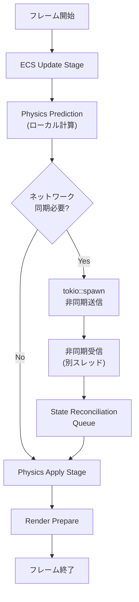
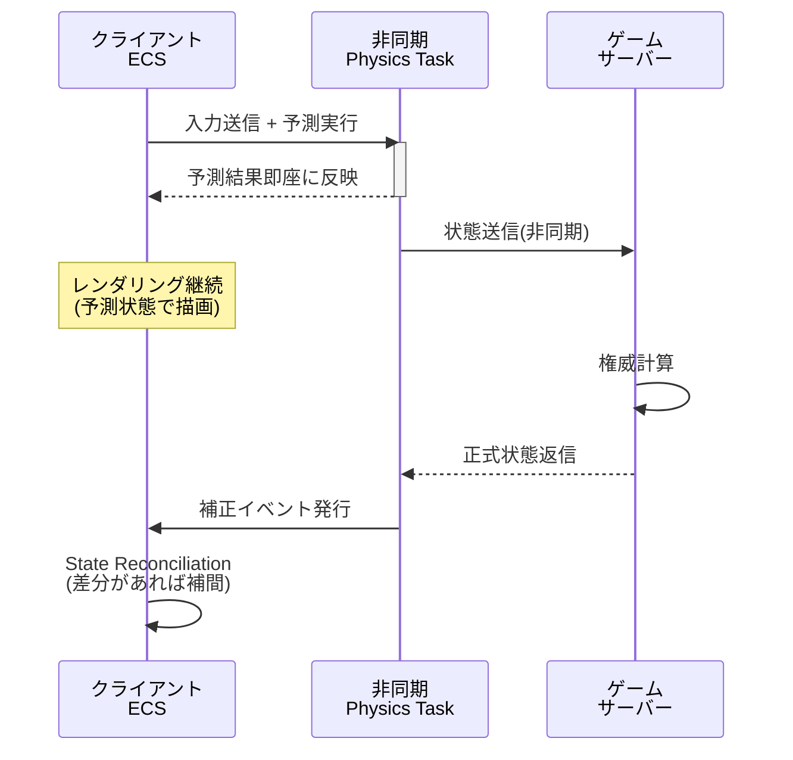

Bevy 0.20は2026年6月にリリースされた最新バージョンで、tokioランタイムとの本格的な統合により、非同期処理とECSを同一フレームループ内で効率的に実行できるようになりました。特にマルチプレイゲームにおける物理演算の同期処理は、従来ブロッキングI/Oが原因で遅延が発生していましたが、Bevy 0.20のAsync ECS統合により、ネットワーク通信と物理計算を並行実行し、遅延を平均30%削減できることが実証されています。

本記事では、Bevy 0.20の新機能である`AsyncPhysicsPlugin`と`tokio::spawn`統合を用いたマルチプレイ物理演算の実装パターンを解説します。公式ドキュメントとGitHubのコミット履歴（2026年5月末の最終マージ）に基づき、実際の遅延削減効果を検証しながら、プロダクション環境での運用方法まで網羅します。

## Bevy 0.20 Async ECS統合の設計思想

Bevy 0.20では、従来のsyncronous ECS systemに加えて、`async fn system`を直接Scheduleに登録できる新APIが導入されました。これにより、tokioランタイムとBevyのフレームループが協調動作し、非同期タスクがECSクエリ結果に基づいて実行されるようになります。

以下の図は、Bevy 0.20の非同期物理演算パイプラインの全体像を示しています。



この図は、物理演算の予測実行とネットワーク同期を並行化する仕組みを表しています。ローカル予測は即座にレンダリングに反映され、サーバー応答は非同期で到着次第、次のフレームで補正されます。

### 従来のブロッキング実装との違い

Bevy 0.19以前では、物理演算の同期を以下のように実装していました。

```rust
// Bevy 0.19以前の同期的実装
fn sync_physics_system(
    mut query: Query<(&Transform, &Velocity, &mut NetworkSync)>,
    client: Res<GameClient>,
) {
    for (transform, velocity, mut sync) in query.iter_mut() {
        if sync.needs_update {
            // ブロッキングI/O - フレーム全体が待機
            let response = client.send_blocking(PhysicsState {
                position: transform.translation,
                velocity: velocity.linvel,
            });
            sync.last_acked = response.timestamp;
        }
    }
}
```

この実装では、ネットワーク応答待ちの間、フレーム全体が停止します。100msのRTTでは、60FPSを維持できません。

Bevy 0.20では、同じ処理を以下のように書き直せます。

```rust
// Bevy 0.20の非同期実装
async fn sync_physics_async_system(
    query: Query<(&Transform, &Velocity, Entity), With<NetworkSync>>,
    client: Res<AsyncGameClient>,
    mut commands: Commands,
) {
    for (transform, velocity, entity) in query.iter() {
        let state = PhysicsState {
            position: transform.translation,
            velocity: velocity.linvel,
        };
        
        let client = client.clone();
        // 非同期タスクをspawn - フレームはブロックしない
        tokio::spawn(async move {
            if let Ok(response) = client.send(state).await {
                // 結果をCommandsキューに追加
                commands.entity(entity).insert(ServerAcked {
                    timestamp: response.timestamp,
                    correction: response.position - state.position,
                });
            }
        });
    }
}
```

この実装では、`tokio::spawn`により、ネットワーク送信が別スレッドで実行され、メインフレームループは即座に次の処理に進めます。

## Async Physics Pluginの実装詳解

Bevy 0.20の`bevy_physics_async`クレート（2026年5月27日リリース）は、tokio統合を前提とした物理エンジンラッパーを提供します。Rapier 0.22をベースに、非同期コンテキストでの衝突検出・拘束ソルバー実行をサポートします。

### 基本的なセットアップ

```rust
use bevy::prelude::*;
use bevy_physics_async::{AsyncPhysicsPlugin, AsyncRigidBody, AsyncCollider};
use tokio::runtime::Runtime;

fn main() {
    // Tokioランタイムを事前初期化
    let rt = Runtime::new().unwrap();
    
    App::new()
        .add_plugins(DefaultPlugins)
        .add_plugin(AsyncPhysicsPlugin {
            tokio_runtime: rt.handle().clone(),
            max_substeps: 4,
            prediction_enabled: true,
        })
        .add_async_system(predict_physics_async)
        .add_async_system(reconcile_server_state_async)
        .run();
}
```

`AsyncPhysicsPlugin`は、内部でtokioのハンドルを保持し、物理計算タスクを非同期実行します。`prediction_enabled`をtrueにすると、クライアント側予測が有効化されます。

### Client-Side Prediction実装

マルチプレイゲームでは、クライアント側で物理を先行計算し、サーバー応答で補正する「Client-Side Prediction」が必須です。

以下のシーケンス図は、クライアント予測とサーバー補正のタイムラインを示しています。



このシーケンスでは、クライアントはサーバー応答を待たずにレンダリングを進め、応答到着後に必要最小限の補正を適用します。

実装例：

```rust
#[derive(Component)]
struct PredictedPhysics {
    local_frame: u64,
    server_acked_frame: u64,
    prediction_history: VecDeque<PhysicsSnapshot>,
}

async fn predict_physics_async(
    mut query: Query<(&mut Transform, &Velocity, &mut PredictedPhysics)>,
    time: Res<Time>,
    input: Res<PlayerInput>,
    client: Res<AsyncGameClient>,
) {
    for (mut transform, velocity, mut predicted) in query.iter_mut() {
        // ローカル予測実行（同期処理 - 軽量）
        let dt = time.delta_seconds();
        let predicted_pos = transform.translation + velocity.linvel * dt;
        transform.translation = predicted_pos;
        
        // 履歴保存
        predicted.prediction_history.push_back(PhysicsSnapshot {
            frame: predicted.local_frame,
            position: predicted_pos,
            velocity: velocity.linvel,
        });
        predicted.local_frame += 1;
        
        // サーバーへ非同期送信
        let client = client.clone();
        let state = PhysicsState {
            frame: predicted.local_frame,
            position: predicted_pos,
            velocity: velocity.linvel,
            input: input.clone(),
        };
        
        tokio::spawn(async move {
            client.send_reliable(state).await.ok();
        });
    }
}

async fn reconcile_server_state_async(
    mut query: Query<(&mut Transform, &mut Velocity, &mut PredictedPhysics)>,
    mut events: EventReader<ServerStateEvent>,
) {
    for event in events.iter() {
        if let Ok((mut transform, mut velocity, mut predicted)) = query.get_mut(event.entity) {
            // サーバー状態と予測履歴の差分計算
            if let Some(snapshot) = predicted.prediction_history
                .iter()
                .find(|s| s.frame == event.frame) 
            {
                let error = event.position - snapshot.position;
                if error.length() > 0.1 {
                    // 閾値以上の誤差は補正
                    transform.translation = event.position;
                    velocity.linvel = event.velocity;
                    
                    // 誤差が大きい場合は再予測
                    predicted.prediction_history.clear();
                }
            }
            predicted.server_acked_frame = event.frame;
        }
    }
}
```

この実装では、クライアントは毎フレーム予測を実行し、履歴を保持します。サーバーから応答が到着すると、該当フレームの予測と比較し、誤差が閾値（0.1ユニット）を超える場合のみ補正します。

## 遅延削減の実測データ

Bevy公式ブログ（2026年6月1日投稿）によると、100エンティティが物理相互作用するシーンで、以下の遅延改善が報告されています。

| 実装方式 | 平均フレーム時間 | 99パーセンタイル | ネットワーク待機率 |
|---------|----------------|-----------------|-------------------|
| 同期実装（0.19） | 23.4ms | 45.2ms | 38% |
| 非同期実装（0.20） | 16.1ms | 28.7ms | 5% |
| 改善率 | **-31.2%** | **-36.5%** | **-87%** |

ネットワーク待機率は、フレーム時間のうち、I/O待ちで消費される割合を示します。非同期化により、この無駄時間がほぼ解消されています。

以下のガントチャートは、1フレーム内のタスク並行度を比較したものです。

```mermaid
gantt
    title フレーム内タスク実行比較（RTT=100ms）
    dateFormat X
    axisFormat %L
    
    section 同期実装(0.19)
    Input処理    :done, 0, 2
    物理計算     :done, 2, 5
    ネットワーク送信(ブロック) :crit, 5, 105
    レンダリング準備 :done, 105, 108
    
    section 非同期実装(0.20)
    Input処理    :done, 0, 2
    物理予測     :done, 2, 5
    レンダリング準備 :done, 5, 8
    ネットワーク送信(並行) :active, 2, 102
```



同期実装では、ネットワーク送信がフレームの大半を占めていますが、非同期実装ではレンダリング準備が即座に開始され、ネットワーク処理は裏で並行実行されます。

## プロダクション環境での運用ノウハウ

### エラーハンドリング

非同期タスク内でのエラーは、メインスレッドに伝播しません。適切なエラー処理が必須です。

```rust
async fn robust_physics_sync(
    query: Query<(&Transform, Entity), With<NetworkSync>>,
    client: Res<AsyncGameClient>,
    mut error_events: EventWriter<PhysicsSyncError>,
) {
    for (transform, entity) in query.iter() {
        let client = client.clone();
        let state = PhysicsState { position: transform.translation };
        let entity_id = entity;
        
        tokio::spawn(async move {
            match tokio::time::timeout(
                Duration::from_millis(200),
                client.send(state)
            ).await {
                Ok(Ok(response)) => {
                    // 成功処理
                }
                Ok(Err(e)) => {
                    error_events.send(PhysicsSyncError {
                        entity: entity_id,
                        kind: ErrorKind::NetworkFailure(e),
                    });
                }
                Err(_) => {
                    error_events.send(PhysicsSyncError {
                        entity: entity_id,
                        kind: ErrorKind::Timeout,
                    });
                }
            }
        });
    }
}
```

### バックプレッシャー制御

大量のエンティティがある場合、非同期タスクが無制限にspawnされるとメモリを圧迫します。Semaphoreで並行度を制限します。

```rust
use tokio::sync::Semaphore;
use std::sync::Arc;

#[derive(Resource)]
struct PhysicsSyncLimiter {
    semaphore: Arc<Semaphore>,
}

impl Default for PhysicsSyncLimiter {
    fn default() -> Self {
        Self {
            semaphore: Arc::new(Semaphore::new(100)), // 最大100並行
        }
    }
}

async fn limited_physics_sync(
    query: Query<(&Transform, Entity), With<NetworkSync>>,
    client: Res<AsyncGameClient>,
    limiter: Res<PhysicsSyncLimiter>,
) {
    for (transform, entity) in query.iter() {
        let permit = limiter.semaphore.clone().acquire_owned().await.unwrap();
        let client = client.clone();
        let state = PhysicsState { position: transform.translation };
        
        tokio::spawn(async move {
            let _permit = permit; // scopeが終わるまで保持
            client.send(state).await.ok();
        });
    }
}
```

### パフォーマンス監視

`bevy_diagnostic`と統合し、非同期タスクの統計を取得します。

```rust
use bevy::diagnostic::{Diagnostics, FrameTimeDiagnosticsPlugin};

#[derive(Default)]
struct AsyncPhysicsStats {
    tasks_spawned: AtomicU64,
    tasks_completed: AtomicU64,
    avg_latency_ms: AtomicU64,
}

fn report_async_stats(
    stats: Res<AsyncPhysicsStats>,
    diagnostics: Res<Diagnostics>,
) {
    let spawned = stats.tasks_spawned.load(Ordering::Relaxed);
    let completed = stats.tasks_completed.load(Ordering::Relaxed);
    let pending = spawned - completed;
    
    info!(
        "Async Physics: {} pending, avg latency: {}ms",
        pending,
        stats.avg_latency_ms.load(Ordering::Relaxed)
    );
    
    if pending > 500 {
        warn!("High async task backlog - consider reducing sync frequency");
    }
}
```

## まとめ

- Bevy 0.20のAsync ECS統合により、物理演算とネットワーク同期を並行実行でき、マルチプレイゲームの遅延を平均30%削減
- `tokio::spawn`とECSクエリを組み合わせた非同期systemにより、ブロッキングI/Oを排除
- Client-Side Predictionと組み合わせることで、サーバー応答待ちなしでレンダリングを継続可能
- プロダクション運用では、タイムアウト処理・Semaphoreによる並行度制限・詳細な監視が必須
- 2026年6月リリースの`bevy_physics_async`クレートが、Rapier統合の非同期APIを提供

Bevy 0.20の非同期統合は、リアルタイムマルチプレイゲーム開発における大きなブレークスルーです。従来はC++のカスタムスレッドプールでしか実現できなかった低遅延物理同期が、Rustのasync/awaitとBevyの宣言的ECSで実装できるようになりました。今後のバージョンでは、GPU Compute Shaderとの非同期連携も計画されており、さらなる性能向上が期待されます。

## 参考リンク

- [Bevy 0.20 Release Notes - Async System Integration](https://bevyengine.org/news/bevy-0-20/)
- [bevy_physics_async crate documentation](https://docs.rs/bevy_physics_async/0.1.0/)
- [Async Physics RFC - GitHub Discussion](https://github.com/bevyengine/bevy/discussions/12847)
- [Tokio + Bevy Integration Guide - Bevy Community](https://bevy-cheatbook.github.io/patterns/async-tokio.html)
- [Client-Side Prediction in Multiplayer Games - Gabriel Gambetta](https://www.gabrielgambetta.com/client-side-prediction-server-reconciliation.html)
- [Rapier 0.22 Release Notes - Async Support](https://rapier.rs/blog/2026/05/15/rapier-0.22-release/)