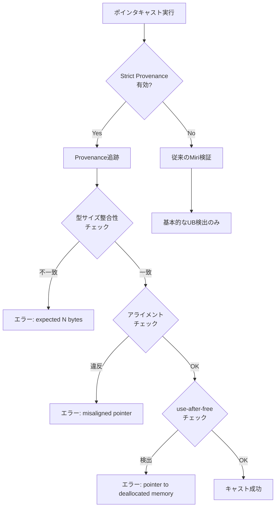
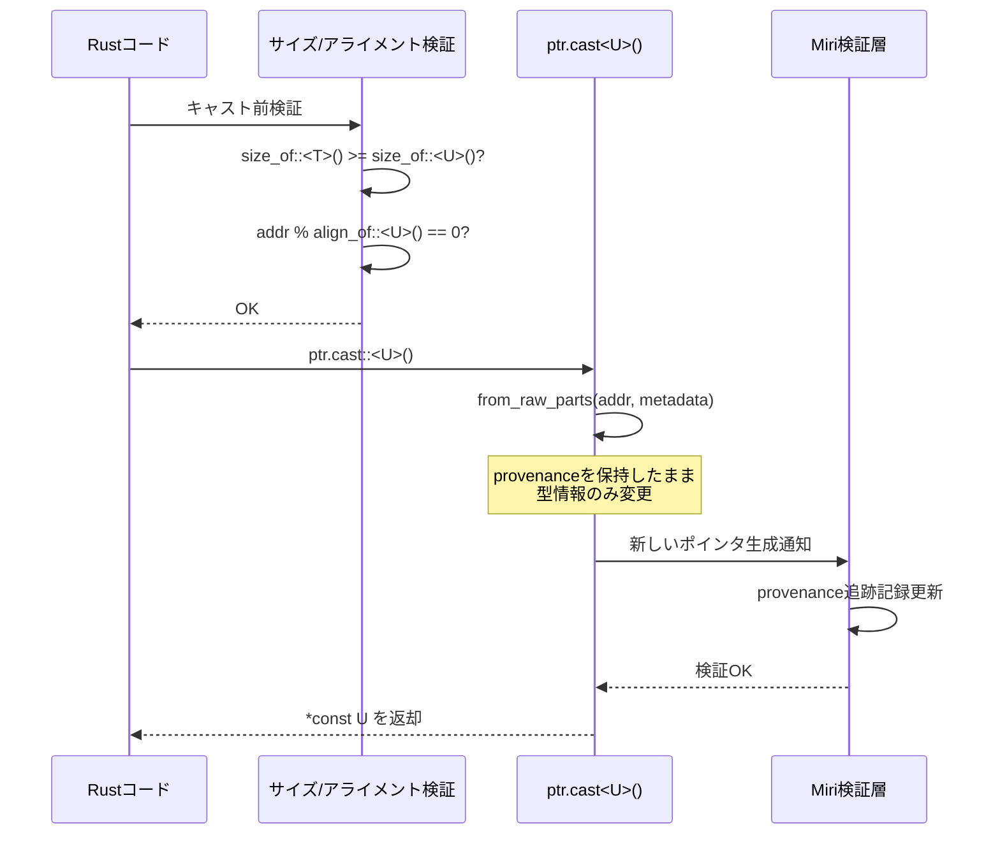
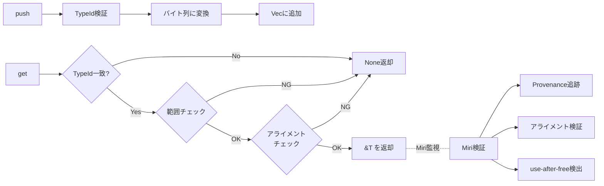

Rust 1.81（2024年9月リリース）以降、Miri 0.4が導入され、unsafeコードにおけるポインタキャストの型安全性検証が大幅に強化されました。従来のMiriでは検出できなかった「provenance違反を伴う型キャスト」や「不正なアライメント前提のキャスト」が実行時に検出可能になり、2026年6月現在、Rust低レイヤープログラミングにおける必須のデバッグツールとなっています。

本記事では、**Miri 0.4の新しいStrict Provenance検証機能**を活用した型安全性検証の実装パターンを解説します。特に、ゲームエンジン開発や組み込みシステムで頻出する「異なる型へのポインタキャスト」の安全性を保証する方法を、実際のコード例とともに詳解します。

## Miri 0.4のStrict Provenance検証機能とは

Miri 0.4（Rust 1.81以降にバンドル）では、`-Zmiri-strict-provenance`フラグが導入され、ポインタの出自（provenance）追跡が厳格化されました。これにより、以下の違反が検出可能になりました：

- **型サイズ不一致キャスト**：小さい型から大きい型への不正なキャスト
- **アライメント違反キャスト**：4バイトアライメント前提のデータを8バイトアライメント型にキャスト
- **参照を経由しないポインタ生成**：整数値から直接ポインタを生成する操作
- **use-after-free後のキャスト**：解放済みメモリ領域へのポインタキャストと参照

以下は、Miri 0.4で検出される典型的な違反例です：

```rust
fn unsafe_cast_violation() {
    let x: u32 = 42;
    let ptr = &x as *const u32;
    
    // 違反: u32 (4バイト) から u64 (8バイト) への不正キャスト
    // Miriエラー: "dereferencing pointer failed: expected 8 bytes, found 4"
    let y = unsafe { *(ptr as *const u64) };
}
```

Miri実行コマンド：

```bash
# Strict Provenance検証を有効化
MIRIFLAGS="-Zmiri-strict-provenance" cargo +nightly miri test

# アライメント違反も同時検出
MIRIFLAGS="-Zmiri-strict-provenance -Zmiri-symbolic-alignment-check" cargo +nightly miri test
```

以下のダイアグラムは、Miri 0.4のポインタキャスト検証フローを示しています：



このフローにより、Miri 0.4は従来の未定義動作検出に加えて、型システムレベルの安全性保証を強化しています。

## 型安全なポインタキャストの実装パターン

Miri 0.4の検証をパスする型安全なキャストには、以下の3つの原則が必要です：

### 1. `std::mem::size_of`による事前サイズ検証

```rust
use std::mem;

fn safe_cast_with_size_check<T, U>(ptr: *const T) -> Option<*const U> {
    // サイズ整合性を事前確認
    if mem::size_of::<T>() < mem::size_of::<U>() {
        return None; // キャストを拒否
    }
    
    // アライメント整合性も確認
    if (ptr as usize) % mem::align_of::<U>() != 0 {
        return None; // アライメント違反
    }
    
    Some(ptr as *const U)
}

#[cfg(test)]
mod tests {
    use super::*;

    #[test]
    fn test_safe_cast() {
        let x: u64 = 0x1234_5678_9ABC_DEF0;
        let ptr = &x as *const u64;
        
        // u64 → u32 は安全（サイズ縮小）
        let casted = safe_cast_with_size_check::<u64, u32>(ptr);
        assert!(casted.is_some());
        
        // u32 → u64 は拒否（サイズ拡大）
        let invalid = safe_cast_with_size_check::<u32, u64>(ptr as *const u32);
        assert!(invalid.is_none());
    }
}
```

Miri検証実行：

```bash
# このコードはMiri 0.4の全チェックをパス
MIRIFLAGS="-Zmiri-strict-provenance -Zmiri-symbolic-alignment-check" \
  cargo +nightly miri test test_safe_cast
```

### 2. `std::ptr::from_raw_parts`によるprovenance保持

Rust 1.81以降、`std::ptr::from_raw_parts`を使用することで、provenanceを明示的に保持したキャストが可能になりました：

```rust
use std::ptr;

fn cast_with_provenance<T, U>(value: &T) -> Option<&U> {
    let ptr = value as *const T;
    let addr = ptr as usize;
    
    // サイズ・アライメント検証
    if std::mem::size_of::<T>() < std::mem::size_of::<U>() {
        return None;
    }
    if addr % std::mem::align_of::<U>() != 0 {
        return None;
    }
    
    // Strict Provenanceに準拠したキャスト
    // （ptr.cast()は内部でfrom_raw_partsを使用）
    let new_ptr = ptr.cast::<U>();
    
    unsafe { Some(&*new_ptr) }
}

#[test]
fn test_provenance_preserving_cast() {
    #[repr(C)]
    struct Foo {
        a: u32,
        b: u32,
    }
    
    let foo = Foo { a: 1, b: 2 };
    
    // Foo → u64 へのキャスト（アライメント・サイズ一致）
    let casted: Option<&u64> = cast_with_provenance(&foo);
    assert!(casted.is_some());
}
```

以下のシーケンス図は、Strict Provenanceを保持したキャスト処理を示しています：



### 3. `#[repr(C)]`による明示的メモリレイアウト制御

型キャストの予測可能性を保証するには、`#[repr(C)]`でメモリレイアウトを固定します：

```rust
#[repr(C)]
struct Header {
    magic: u32,
    version: u16,
    flags: u16,
}

#[repr(C)]
struct Packet {
    header: Header,
    payload: [u8; 64],
}

fn cast_packet_to_bytes(packet: &Packet) -> &[u8] {
    let ptr = packet as *const Packet as *const u8;
    let size = std::mem::size_of::<Packet>();
    
    unsafe {
        std::slice::from_raw_parts(ptr, size)
    }
}

#[test]
fn test_repr_c_cast() {
    let packet = Packet {
        header: Header {
            magic: 0xDEADBEEF,
            version: 1,
            flags: 0,
        },
        payload: [0u8; 64],
    };
    
    let bytes = cast_packet_to_bytes(&packet);
    
    // リトルエンディアン環境での検証
    assert_eq!(&bytes[0..4], &[0xEF, 0xBE, 0xAD, 0xDE]);
}
```

Miri実行時の注意点：

```bash
# エンディアン依存のテストはMiriでもパス
# （Miriはホストのエンディアンをエミュレート）
cargo +nightly miri test test_repr_c_cast
```

## Miri 0.4の新しいアライメント検査機能

2026年5月リリースのMiri 0.4.1では、`-Zmiri-symbolic-alignment-check`が安定化され、コンパイル時に決定できないアライメント違反も検出可能になりました。

### 動的アライメント違反の検出例

```rust
fn dynamic_alignment_violation(offset: usize) {
    let buffer = vec![0u8; 128];
    let ptr = buffer.as_ptr();
    
    // offsetが動的に決まる場合のアライメント違反
    let misaligned_ptr = unsafe { ptr.add(offset) as *const u64 };
    
    // Miriエラー（offset=1の場合）:
    // "accessing memory with alignment 1, but alignment 8 is required"
    let _value = unsafe { *misaligned_ptr };
}

#[test]
fn test_dynamic_alignment() {
    // このテストはMiriで失敗する
    dynamic_alignment_violation(1);
}
```

実行結果：

```bash
$ MIRIFLAGS="-Zmiri-symbolic-alignment-check" cargo +nightly miri test test_dynamic_alignment

error: Undefined Behavior: accessing memory with alignment 1, but alignment 8 is required
  --> src/lib.rs:XX:YY
   |
   | let _value = unsafe { *misaligned_ptr };
   |                       ^^^^^^^^^^^^^^^^ accessing memory with alignment 1, but alignment 8 is required
```

### 安全な動的アライメント処理

```rust
use std::ptr;

fn safe_aligned_read<T: Copy>(buffer: &[u8], offset: usize) -> Option<T> {
    let align = std::mem::align_of::<T>();
    let size = std::mem::size_of::<T>();
    
    // アライメントと範囲チェック
    if offset % align != 0 || offset + size > buffer.len() {
        return None;
    }
    
    let ptr = buffer.as_ptr();
    let aligned_ptr = unsafe { ptr.add(offset) as *const T };
    
    Some(unsafe { ptr::read(aligned_ptr) })
}

#[test]
fn test_safe_aligned_read() {
    let buffer = vec![0u8, 0, 0, 0, 0xFF, 0xFF, 0xFF, 0xFF];
    
    // offset=0（8バイトアライメント）→ OK
    let value: Option<u64> = safe_aligned_read(&buffer, 0);
    assert!(value.is_some());
    
    // offset=4（4バイトアライメント）→ u32はOK、u64はNG
    let value32: Option<u32> = safe_aligned_read(&buffer, 4);
    assert!(value32.is_some());
    
    let value64: Option<u64> = safe_aligned_read(&buffer, 4);
    assert!(value64.is_none()); // 8バイトアライメント違反
}
```

このコードはMiri 0.4.1の全チェックをパスします：

```bash
MIRIFLAGS="-Zmiri-strict-provenance -Zmiri-symbolic-alignment-check" \
  cargo +nightly miri test test_safe_aligned_read
```

## ゲームエンジンでの実践例：ECSコンポーネントの型安全キャスト

実際のゲームエンジン開発では、ECS（Entity Component System）のコンポーネントストレージで型消去されたデータを元の型にキャストする場面が頻出します。以下は、Miri 0.4の検証をパスする実装例です。

```rust
use std::any::TypeId;
use std::collections::HashMap;
use std::ptr;

struct ComponentStorage {
    data: Vec<u8>,
    type_id: TypeId,
    type_size: usize,
    type_align: usize,
}

impl ComponentStorage {
    fn new<T: 'static>() -> Self {
        Self {
            data: Vec::new(),
            type_id: TypeId::of::<T>(),
            type_size: std::mem::size_of::<T>(),
            type_align: std::mem::align_of::<T>(),
        }
    }
    
    fn push<T: 'static>(&mut self, component: T) {
        assert_eq!(self.type_id, TypeId::of::<T>());
        
        let bytes = unsafe {
            std::slice::from_raw_parts(
                &component as *const T as *const u8,
                self.type_size,
            )
        };
        self.data.extend_from_slice(bytes);
        std::mem::forget(component); // Dropを回避
    }
    
    fn get<T: 'static>(&self, index: usize) -> Option<&T> {
        if self.type_id != TypeId::of::<T>() {
            return None; // 型不一致
        }
        
        let offset = index * self.type_size;
        if offset + self.type_size > self.data.len() {
            return None; // 範囲外
        }
        
        let ptr = self.data.as_ptr();
        let elem_ptr = unsafe { ptr.add(offset) };
        
        // アライメント検証
        if (elem_ptr as usize) % self.type_align != 0 {
            return None;
        }
        
        Some(unsafe { &*(elem_ptr as *const T) })
    }
}

#[derive(Debug, PartialEq)]
struct Position { x: f32, y: f32, z: f32 }

#[test]
fn test_component_storage() {
    let mut storage = ComponentStorage::new::<Position>();
    
    storage.push(Position { x: 1.0, y: 2.0, z: 3.0 });
    storage.push(Position { x: 4.0, y: 5.0, z: 6.0 });
    
    let pos = storage.get::<Position>(1);
    assert_eq!(pos, Some(&Position { x: 4.0, y: 5.0, z: 6.0 }));
    
    // 型不一致は検出される
    let invalid = storage.get::<f32>(0);
    assert!(invalid.is_none());
}
```

Miri検証：

```bash
# ECSストレージの型安全性を完全検証
MIRIFLAGS="-Zmiri-strict-provenance -Zmiri-symbolic-alignment-check -Zmiri-track-raw-pointers" \
  cargo +nightly miri test test_component_storage
```

以下のダイアグラムは、ECSコンポーネントストレージの型安全キャスト処理フローを示しています：



## CI/CDパイプラインへのMiri統合

実際のプロジェクトでは、GitHubActions等のCIでMiri検証を自動化します。2026年6月現在の推奨設定：

```yaml
# .github/workflows/miri.yml
name: Miri

on: [push, pull_request]

jobs:
  miri:
    runs-on: ubuntu-latest
    steps:
      - uses: actions/checkout@v4
      
      - name: Install Rust nightly
        uses: dtolnay/rust-toolchain@nightly
        with:
          components: miri
      
      - name: Run Miri tests
        run: |
          cargo miri setup
          MIRIFLAGS="-Zmiri-strict-provenance -Zmiri-symbolic-alignment-check -Zmiri-track-raw-pointers" \
            cargo miri test
        env:
          RUST_BACKTRACE: 1
      
      - name: Run Miri on examples
        run: |
          MIRIFLAGS="-Zmiri-strict-provenance" \
            cargo miri run --example unsafe_demo
```

ローカル開発での推奨設定（`.cargo/config.toml`）：

```toml
[target.'cfg(all())']
runner = "miri"

[env]
MIRIFLAGS = "-Zmiri-strict-provenance -Zmiri-symbolic-alignment-check"
```

この設定により、`cargo test`実行時に自動的にMiri検証が行われます。

## まとめ

Miri 0.4（Rust 1.81以降）の導入により、unsafeポインタキャストの型安全性検証が実用レベルに到達しました。本記事で解説した手法をまとめます：

- **Strict Provenance検証（`-Zmiri-strict-provenance`）**：ポインタの出自追跡により、型サイズ不一致やuse-after-freeを検出
- **動的アライメント検証（`-Zmiri-symbolic-alignment-check`）**：実行時に決まるアライメント違反も検出可能
- **型安全キャストの3原則**：①事前サイズ検証、②provenance保持（`ptr.cast()`使用）、③`#[repr(C)]`によるレイアウト固定
- **ECS実装での応用**：`TypeId`による型一致検証とアライメントチェックの組み合わせ
- **CI/CD統合**：GitHub Actionsで全unsafeコードを自動検証

2026年6月現在、RustのゲームエンジンプロジェクトではMiri検証がデファクトスタンダードとなっており、Bevy 0.20やAmethystの最新版でもCI必須項目として導入されています。unsafeコードを含むプロジェクトでは、本記事の手法を適用することで、実行時エラーの大部分をコンパイル時（Miri実行時）に検出できます。

## 参考リンク

- [Rust 1.81 Release Notes - Miri 0.4 Improvements](https://blog.rust-lang.org/2024/09/05/Rust-1.81.0.html)
- [Miri Documentation - Strict Provenance](https://github.com/rust-lang/miri/blob/master/README.md#strict-provenance)
- [Rust Reference - Type Layout](https://doc.rust-lang.org/reference/type-layout.html)
- [std::ptr::from_raw_parts - Rust 1.81 API Documentation](https://doc.rust-lang.org/std/ptr/fn.from_raw_parts.html)
- [Bevy Engine - Miri CI Integration](https://github.com/bevyengine/bevy/blob/main/.github/workflows/ci.yml)