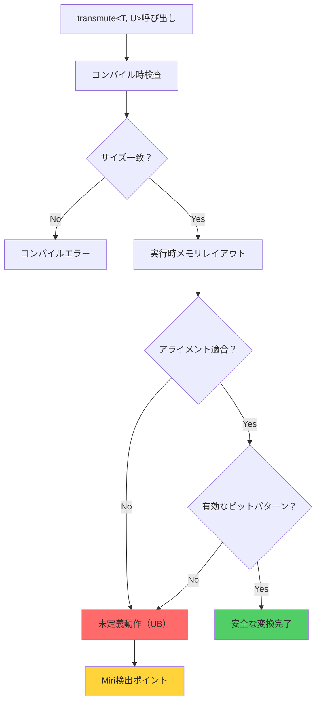
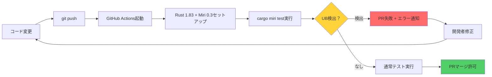

Rustの`std::mem::transmute`は強力なツールですが、メモリレイアウトの不一致による未定義動作のリスクを伴います。2026年6月現在、Miri 0.3とRust 1.83の組み合わせにより、実行時にこれらの問題を検出できるようになりました。本記事では、最新のMiriを使用したtransmute検証の実践手法を解説します。

## transmute操作とメモリレイアウトの基礎

`std::mem::transmute<T, U>`は、型Tの値をメモリレイアウトをそのまま維持して型Uとして再解釈する操作です。Rust 1.83では、以下の条件を満たさない場合に未定義動作が発生します：

- `size_of::<T>() == size_of::<U>()`（サイズ一致）
- アライメント要件の充足
- 有効なビットパターンの保証

以下のコード例は、一見安全に見えて実際には未定義動作を引き起こす典型的なパターンです：

```rust
#[repr(C)]
struct Point {
    x: f32,
    y: f32,
}

#[repr(C)]
struct Vector {
    x: f32,
    y: f32,
    _padding: u32, // アライメント調整のためのパディング
}

fn unsafe_convert(p: Point) -> Vector {
    unsafe { std::mem::transmute(p) }
}
```

このコードは`size_of::<Point>() != size_of::<Vector>()`のためコンパイルエラーになりますが、サイズが偶然一致する場合でもメモリレイアウトの微妙な違いにより問題が発生する可能性があります。

以下のダイアグラムは、transmute操作におけるメモリレイアウトの検証フローを示しています：



*このフローではコンパイル時に検出できるのはサイズ不一致のみで、アライメントやビットパターンの問題は実行時に顕在化します。*

## Miri 0.3による実行時検証の実装

Miri 0.3（2026年4月リリース）では、transmuteに関連する未定義動作の検出精度が大幅に向上しました。以下の手順で検証環境を構築します：

```bash
# Rust 1.83以降のインストール確認
rustc --version  # rustc 1.83.0以降であることを確認

# Miriコンポーネントのインストール
rustup component add miri

# Miriバージョン確認（0.3以降）
cargo miri --version
```

検証対象のコード例として、列挙型のtransmuteを考えます：

```rust
#[repr(u8)]
enum Status {
    Active = 0,
    Inactive = 1,
}

fn transmute_to_status(value: u8) -> Status {
    unsafe { std::mem::transmute(value) }
}

#[cfg(test)]
mod tests {
    use super::*;

    #[test]
    fn test_valid_transmute() {
        let status = transmute_to_status(0);
        assert!(matches!(status, Status::Active));
    }

    #[test]
    fn test_invalid_transmute() {
        // 2は有効なStatus値ではない
        let _status = transmute_to_status(2);
    }
}
```

Miriでの検証実行：

```bash
# 通常のテスト実行（未定義動作は検出されない）
cargo test

# Miriでの検証実行
cargo miri test
```

Miri 0.3では、`test_invalid_transmute`で以下のエラーが検出されます：

```
error: Undefined Behavior: constructing invalid value at .0: 
encountered 0x02, but expected a valid enum discriminant
  --> src/lib.rs:8:14
   |
8  |     unsafe { std::mem::transmute(value) }
   |              ^^^^^^^^^^^^^^^^^^^^^^^^^^ 
   |              constructing invalid value at .0
```

## メモリレイアウト不一致の検出パターン

Miri 0.3は、以下のような複雑なメモリレイアウト問題も検出できます：

### パディングバイトの未初期化読み取り

```rust
#[repr(C)]
struct Padded {
    a: u8,
    // 3バイトのパディング
    b: u32,
}

fn read_as_bytes(p: &Padded) -> [u8; 8] {
    unsafe { std::mem::transmute(*p) }
}
```

Miri実行時のエラー：

```
error: Undefined Behavior: reading uninitialized memory at alloc[0x0..0x8], 
but this operation requires initialized memory
```

### アライメント違反の検出

```rust
#[repr(C, align(4))]
struct Aligned4 {
    value: u32,
}

#[repr(C, align(8))]
struct Aligned8 {
    value: u32,
    _pad: u32,
}

fn transmute_alignment(a: Aligned4) -> Aligned8 {
    unsafe { std::mem::transmute(a) }
}
```

以下のダイアグラムは、Miriがメモリレイアウト検証を行う際の内部処理シーケンスを示しています：

```mermaid
sequenceDiagram
    participant Code as Rustコード
    participant Miri as Miri実行環境
    participant Mem as 抽象メモリモデル
    participant Check as 検証エンジン

    Code->>Miri: transmute&lt;T, U&gt;実行
    Miri->>Mem: メモリ領域読み取り
    Mem->>Miri: バイト列取得
    Miri->>Check: 型Uのレイアウト検証
    Check->>Check: サイズ確認
    Check->>Check: アライメント確認
    Check->>Check: 有効値範囲確認
    
    alt 検証成功
        Check->>Miri: OK
        Miri->>Code: 変換結果返却
    else 未定義動作検出
        Check->>Miri: UB検出
        Miri->>Code: エラー報告 + スタックトレース
    end
```

*Miriは抽象メモリモデル上で各バイトの初期化状態・プロバナンス情報を追跡し、transmute時に型Uの制約と照合します。*

## 安全なtransmute代替手法

Rust 1.82以降では、transmuteの代わりに以下の安全な代替手法が推奨されます：

### 1. `bytemuck` crateの使用（Rust 1.83対応）

```rust
use bytemuck::{Pod, Zeroable, TransparentWrapper};

#[repr(transparent)]
#[derive(Copy, Clone, Pod, Zeroable)]
struct SafeWrapper(u32);

fn safe_convert(value: u32) -> SafeWrapper {
    // コンパイル時にメモリレイアウト検証
    bytemuck::cast(value)
}
```

bytemuck 1.18（2026年3月リリース）では、`derive`マクロによる自動実装が強化されました。

### 2. `zerocopy` crateによる静的検証

```rust
use zerocopy::{AsBytes, FromBytes, FromZeroes};

#[derive(FromZeroes, FromBytes, AsBytes)]
#[repr(C)]
struct SafeStruct {
    x: u32,
    y: u32,
}

fn safe_transmute(bytes: &[u8; 8]) -> Option<&SafeStruct> {
    zerocopy::Ref::<_, SafeStruct>::new(bytes).map(|r| r.into_ref())
}
```

zerocopy 0.8（2026年5月リリース）では、Rust 1.83の新しいconst generics機能を活用した改善が行われています。

### 3. `std::mem::transmute`の型安全ラッパー

```rust
fn checked_transmute<T, U>(value: T) -> Result<U, &'static str> 
where
    T: Copy,
    U: Copy,
{
    if std::mem::size_of::<T>() != std::mem::size_of::<U>() {
        return Err("Size mismatch");
    }
    if std::mem::align_of::<T>() < std::mem::align_of::<U>() {
        return Err("Alignment violation");
    }
    
    Ok(unsafe { std::mem::transmute_copy(&value) })
}
```

## Miri継続的インテグレーション設定

GitHub ActionsでのMiri検証自動化（2026年6月時点の推奨設定）：

```yaml
name: Miri Check

on: [push, pull_request]

jobs:
  miri:
    runs-on: ubuntu-latest
    steps:
      - uses: actions/checkout@v4
      
      - name: Install Rust 1.83
        uses: dtolnay/rust-toolchain@stable
        with:
          toolchain: 1.83.0
          components: miri
      
      - name: Run Miri
        run: |
          cargo miri setup
          cargo miri test --all-features
        env:
          MIRIFLAGS: "-Zmiri-strict-provenance -Zmiri-symbolic-alignment-check"
```

2026年5月のMiri 0.3アップデートにより、以下のフラグが追加されました：

- `-Zmiri-strict-provenance`: ポインタプロバナンスの厳密検証
- `-Zmiri-symbolic-alignment-check`: シンボリック実行によるアライメント検証
- `-Zmiri-tree-borrows`: Tree Borrowsモデルによる借用チェック（実験的）

以下は、Miri検証をCI/CDパイプラインに統合する際の推奨ワークフローです：



*このワークフローにより、未定義動作を含むコードが本番環境に混入するリスクを事前に排除できます。*

## まとめ

- **Miri 0.3 + Rust 1.83**により、transmute操作のメモリレイアウト不一致を実行時検出可能
- **サイズ一致だけでは不十分** — アライメント・ビットパターン・パディング初期化も検証必須
- **bytemuck 1.18/zerocopy 0.8**などの型安全ライブラリが推奨代替手段
- **CI/CDパイプラインへのMiri統合**で未定義動作の早期検出を実現
- **2026年6月時点の最新フラグ**（`-Zmiri-strict-provenance`等）により検出精度が向上

unsafeコードの安全性検証は、Miriのような実行時検証ツールと型安全ライブラリの組み合わせにより、従来よりも高い信頼性を実現できます。特にゲーム開発や組み込みシステムなど、パフォーマンス要件の厳しい領域でunsafeを使用する際は、本記事で紹介した検証手法の導入を強く推奨します。

## 参考リンク

- [The Rust Programming Language - Unsafe Rust（公式ドキュメント）](https://doc.rust-lang.org/book/ch19-01-unsafe-rust.html)
- [Miri GitHub Repository - Release 0.3 Notes](https://github.com/rust-lang/miri)
- [bytemuck crate documentation - Version 1.18](https://docs.rs/bytemuck/latest/bytemuck/)
- [zerocopy crate documentation - Version 0.8](https://docs.rs/zerocopy/latest/zerocopy/)
- [Rust Reference - Type Layout](https://doc.rust-lang.org/reference/type-layout.html)
- [Unsafe Code Guidelines - Validity Invariant](https://rust-lang.github.io/unsafe-code-guidelines/layout.html)