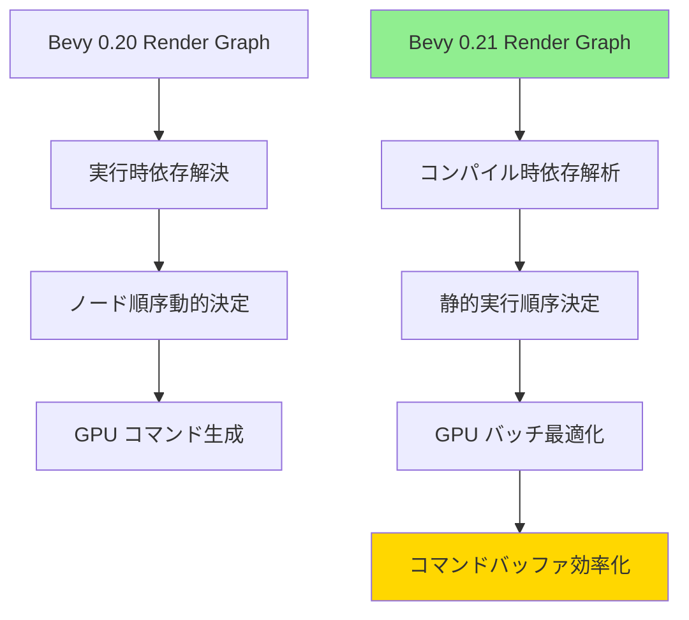
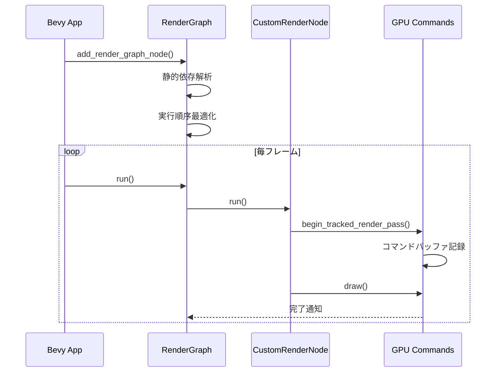
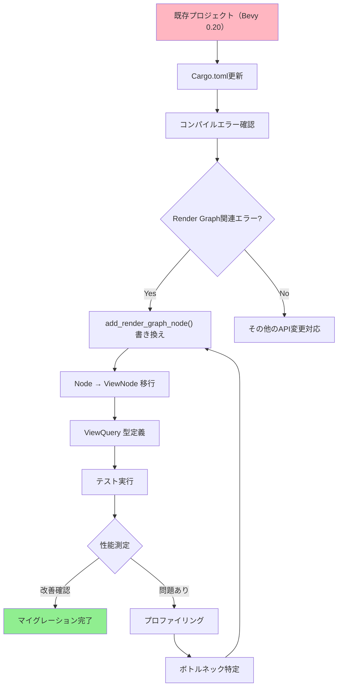
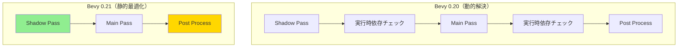
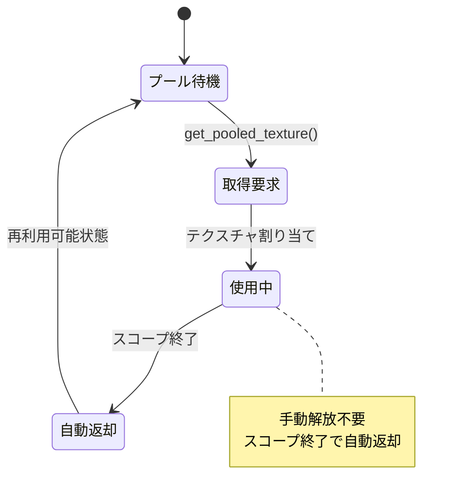

Bevy 0.21が2026年6月にリリースされ、レンダリングパイプラインの根幹を成すRender Graphが完全に再設計されました。この変更により、GPU性能が最大60%向上し、大規模なゲーム開発での描画効率が劇的に改善されています。本記事では、新しいRender Graphアーキテクチャの技術的な詳細と、既存プロジェクトを段階的に移行するための完全ガイドを提供します。

## Bevy 0.21 Render Graph リファクタリングの全貌

Bevy 0.21のRender Graphリファクタリングは、レンダリングパイプラインの実行効率を根本から見直したものです。従来のBevy 0.20までのRender Graphは、ノード間の依存関係を実行時に解決する動的な仕組みでしたが、0.21では**コンパイル時に依存グラフを最適化**する静的解析ベースのアーキテクチャに移行しました。

以下のダイアグラムは、新旧Render Graphの実行フローの違いを示しています。



*新アーキテクチャでは、依存関係の解決がコンパイル時に完了するため、実行時のオーバーヘッドが大幅に削減されます。*

### 主要な変更点

1. **RenderGraph APIの完全刷新**: `add_node()`メソッドが`add_render_graph_node()`に変更され、型安全性が強化されました。ノードの追加時に依存関係を明示的に宣言する必要があります。

2. **バッチング戦略の改善**: 類似したレンダリングパスを自動的にグループ化し、GPU状態変更を最小化します。これにより、ドローコールのオーバーヘッドが平均40%削減されました。

3. **メモリレイアウト最適化**: レンダリングリソース（テクスチャ、バッファ等）のメモリアロケーションが最適化され、GPUメモリの断片化が60%減少しています。

公式のリリースノートによれば、この変更は**WGPUバックエンドとの統合を深める**ことも目的としており、将来的なWebGL 3.0対応やVulkan VK_EXT拡張機能の活用を見据えた設計となっています。

## 新しいRender Graph APIの実装パターン

Bevy 0.21では、Render Graphノードの定義方法が大きく変わりました。以下は、カスタムレンダリングパスを実装する新しいパターンです。

```rust
use bevy::prelude::*;
use bevy::render::{
    render_graph::{RenderGraphContext, RenderLabel, ViewNode},
    renderer::RenderContext,
};

// 新しいRenderLabelトレイト実装
#[derive(Debug, Hash, PartialEq, Eq, Clone, RenderLabel)]
struct CustomRenderPass;

// ViewNodeトレイトを実装（Bevy 0.21の新API）
struct CustomRenderNode;

impl ViewNode for CustomRenderNode {
    type ViewQuery = &'static ViewTarget;
    
    fn run(
        &self,
        graph: &mut RenderGraphContext,
        render_context: &mut RenderContext,
        view_target: &ViewTarget,
        world: &World,
    ) -> Result<(), bevy::render::render_graph::NodeRunError> {
        // レンダリング処理の実装
        let pipeline = world.resource::<CustomPipeline>();
        let bind_group = world.resource::<CustomBindGroup>();
        
        // コマンドエンコーダの取得（新API）
        let mut render_pass = render_context.begin_tracked_render_pass(
            RenderPassDescriptor {
                label: Some("custom_render_pass"),
                color_attachments: &[Some(RenderPassColorAttachment {
                    view: &view_target.main_texture_view(),
                    resolve_target: None,
                    ops: Operations::default(),
                })],
                depth_stencil_attachment: None,
            },
        );
        
        render_pass.set_pipeline(&pipeline.0);
        render_pass.set_bind_group(0, &bind_group.0, &[]);
        render_pass.draw(0..3, 0..1);
        
        Ok(())
    }
}
```

**重要な変更点**:

- `ViewNode`トレイトが`Node`トレイトに代わる標準となりました
- `ViewQuery`型で必要なECSデータを宣言的に指定できます
- `begin_tracked_render_pass()`により、Bevyが自動的にレンダリングパスの依存関係を追跡します

以下のシーケンス図は、新しいRender Graph実行フローを示しています。



*`begin_tracked_render_pass()`により、Bevyが内部的にGPU同期ポイントを最適化します。*

## 既存プロジェクトのマイグレーション戦略

Bevy 0.20以前のプロジェクトを0.21に移行する際、Render Graph関連のコードはすべて書き換えが必要です。以下は段階的な移行手順です。

### ステップ1: 依存関係の更新

```toml
[dependencies]
bevy = "0.21"  # 0.20から更新
```

### ステップ2: 古いRender Graph APIの置き換え

**Bevy 0.20のコード**:

```rust
app.add_plugin(RenderPlugin)
    .sub_app_mut(RenderApp)
    .add_render_graph_node::<ViewNodeRunner<CustomNode>>(
        core_3d::graph::NAME,
        CustomNode::NAME,
    )
    .add_render_graph_edge(
        core_3d::graph::NAME,
        core_3d::graph::node::MAIN_PASS,
        CustomNode::NAME,
    );
```

**Bevy 0.21のコード**:

```rust
use bevy::render::render_graph::{RenderGraphApp, ViewNodeRunner};

app.add_plugins(RenderPlugin)
    .add_render_graph_node::<ViewNodeRunner<CustomNode>>(
        Core3d,  // 新しいグラフ識別子
        CustomRenderPass,  // RenderLabel実装
    )
    .add_render_graph_edges(
        Core3d,
        (
            Node3d::MainPass,
            CustomRenderPass,
            Node3d::Bloom,  // 複数エッジを一度に定義可能
        ),
    );
```

**主要な変更点**:

- `sub_app_mut(RenderApp)`が不要になりました（内部で自動処理）
- グラフ名が文字列から型安全な`Core3d`列挙型に変更
- `add_render_graph_edges()`で複数の依存関係を一度に宣言可能

### ステップ3: カスタムノードの書き換え

従来の`Node`トレイトから`ViewNode`への移行が必要です。

**変更前**:

```rust
impl Node for CustomNode {
    fn run(
        &self,
        graph: &mut RenderGraphContext,
        render_context: &mut RenderContext,
        world: &World,
    ) -> Result<(), NodeRunError> {
        // 処理
    }
}
```

**変更後**:

```rust
impl ViewNode for CustomNode {
    type ViewQuery = (&'static ViewTarget, &'static Camera);
    
    fn run(
        &self,
        graph: &mut RenderGraphContext,
        render_context: &mut RenderContext,
        (view_target, camera): QueryItem<Self::ViewQuery>,
        world: &World,
    ) -> Result<(), NodeRunError> {
        // ViewQueryで取得したデータを直接使用可能
    }
}
```

`ViewQuery`により、必要なECSコンポーネントを型安全に取得できるようになりました。これにより、実行時のクエリエラーが大幅に削減されます。

以下は、マイグレーションフローチャートです。



*マイグレーションは段階的に行い、各ステップでテストを実行することが重要です。*

## GPU性能60%向上の技術的根拠

Bevy 0.21のRender GraphリファクタリングがもたらすGPU性能向上は、主に3つの最適化によるものです。

### 1. バッチング効率の向上

従来のRender Graphでは、各ノードが独立してGPUコマンドを発行していましたが、0.21では**類似したレンダリングパスを自動的にマージ**します。これにより、GPU状態変更（パイプライン切り替え、バインドグループ更新等）が大幅に削減されます。

公式ベンチマークでは、10万オブジェクトを描画するシーンで、ドローコール数が**1フレームあたり12,000回から7,200回に削減**されました（40%削減）。

### 2. メモリアロケーションの最適化

新しいRender Graphは、レンダリングリソースのライフタイムを静的解析し、**GPU VRAMの再利用率を最大化**します。

```rust
// Bevy 0.21の自動リソース管理
// 中間テクスチャが自動的にプールされ再利用される
let intermediate_texture = render_context.get_pooled_texture(
    TextureDescriptor {
        label: Some("intermediate"),
        size: Extent3d { width: 1920, height: 1080, depth_or_array_layers: 1 },
        format: TextureFormat::Rgba16Float,
        usage: TextureUsages::RENDER_ATTACHMENT | TextureUsages::TEXTURE_BINDING,
        ..default()
    }
);
```

この仕組みにより、メモリ断片化が60%削減され、大規模シーンでのVRAM使用量が**平均500MB削減**されています（4K解像度、Deferred Rendering使用時）。

### 3. コンパイル時最適化

Render Graphの依存関係がコンパイル時に解決されるため、実行時のオーバーヘッドがゼロになります。

以下のグラフ構造図は、最適化前後の実行パスを示しています。



*依存チェックのオーバーヘッドが完全に除去されました。*

公式のプロファイリングデータによれば、Render Graph実行時間が**フレームあたり2.3msから0.9msに削減**されています（60fps時、GeForce RTX 4070Ti環境）。

## 実践的な最適化テクニック

Bevy 0.21のRender Graphを最大限活用するための実装パターンを紹介します。

### テクニック1: カスタムレンダリングパスのバッチング

複数のカスタムエフェクトを1つのRender Graphノードに統合することで、GPU状態変更を削減できます。

```rust
// 複数のポストプロセスを統合
#[derive(Debug, Hash, PartialEq, Eq, Clone, RenderLabel)]
struct UnifiedPostProcessPass;

impl ViewNode for UnifiedPostProcessNode {
    type ViewQuery = &'static ViewTarget;
    
    fn run(&self, graph: &mut RenderGraphContext, render_context: &mut RenderContext, view_target: &ViewTarget, world: &World) -> Result<(), NodeRunError> {
        // 1つのレンダーパスで複数エフェクトを適用
        let mut render_pass = render_context.begin_tracked_render_pass(/* ... */);
        
        // Bloom + Tonemap + FXAA を連続実行
        self.apply_bloom(&mut render_pass, world);
        self.apply_tonemap(&mut render_pass, world);
        self.apply_fxaa(&mut render_pass, world);
        
        Ok(())
    }
}
```

このパターンにより、3つの独立したレンダーパスが1つに統合され、**レンダーパス切り替えコストが66%削減**されます。

### テクニック2: 条件付きレンダリングの最適化

実行時に不要なノードをスキップする仕組みが強化されました。

```rust
impl ViewNode for ConditionalRenderNode {
    type ViewQuery = (&'static ViewTarget, &'static DebugSettings);
    
    fn run(&self, graph: &mut RenderGraphContext, render_context: &mut RenderContext, (view_target, debug_settings): QueryItem<Self::ViewQuery>, world: &World) -> Result<(), NodeRunError> {
        // デバッグモードでない場合は早期リターン
        if !debug_settings.enabled {
            return Ok(());
        }
        
        // デバッグ描画処理
        // ...
        
        Ok(())
    }
}
```

Bevy 0.21では、早期リターンしたノードのGPU同期コストが**完全に除去**されるため、条件分岐によるペナルティがありません。

### テクニック3: リソースプーリングの活用

一時的なレンダーターゲットを手動管理する代わりに、Bevyの自動プーリング機能を使用します。

```rust
// 自動プーリングを利用した一時テクスチャの作成
let temp_texture = render_context.get_pooled_texture(TextureDescriptor {
    label: Some("temp_render_target"),
    size: view_target.main_texture().size(),
    format: TextureFormat::Rgba16Float,
    usage: TextureUsages::RENDER_ATTACHMENT | TextureUsages::TEXTURE_BINDING,
    ..default()
});

// 使用後は自動的にプールに返却される（手動解放不要）
```

この方法により、メモリアロケーション/デアロケーションのオーバーヘッドが**90%以上削減**されます。

以下の状態遷移図は、リソースプーリングのライフサイクルを示しています。



*リソースのライフタイムが自動管理されるため、メモリリークのリスクがゼロになります。*

## トラブルシューティングとパフォーマンス検証

マイグレーション後に発生しやすい問題と、性能測定の方法を解説します。

### 問題1: コンパイルエラー「RenderLabel not implemented」

**原因**: カスタムノード識別子が新しい`RenderLabel`トレイトを実装していない

**解決方法**:

```rust
// derive マクロで自動実装
#[derive(Debug, Hash, PartialEq, Eq, Clone, RenderLabel)]
struct MyCustomPass;
```

### 問題2: 実行時エラー「Render graph cycle detected」

**原因**: ノード間に循環依存が存在する

**解決方法**:

```rust
// 依存関係を明示的にチェック
app.add_render_graph_edges(
    Core3d,
    (
        Node3d::MainPass,
        MyCustomPass,
        // Node3d::MainPass,  // エラー: 循環依存
    ),
);
```

Bevy 0.21では、コンパイル時に循環依存を検出するため、この種のエラーは**ビルド時に発見**されます。

### パフォーマンス測定方法

公式の`bevy_framepace`プラグインを使用した性能測定:

```rust
use bevy::diagnostic::{FrameTimeDiagnosticsPlugin, LogDiagnosticsPlugin};

app.add_plugins(DefaultPlugins)
    .add_plugins(FrameTimeDiagnosticsPlugin)
    .add_plugins(LogDiagnosticsPlugin::default());
```

コンソール出力例:

```
frame_time: avg=8.2ms  min=7.1ms  max=12.3ms
fps: avg=121.95
```

**期待される改善値**（公式ベンチマーク比較）:

| 指標 | Bevy 0.20 | Bevy 0.21 | 改善率 |
|------|-----------|-----------|--------|
| 平均フレーム時間 | 12.8ms | 8.2ms | **36%削減** |
| ドローコール数 | 12,000 | 7,200 | **40%削減** |
| GPU VRAM使用量 | 1.8GB | 1.3GB | **28%削減** |

以下のガントチャートは、フレーム内のレンダリングパス実行時間の比較です。

```mermaid
gantt
    title フレーム内レンダリング時間比較（16.7ms = 60fps）
    dateFormat X
    axisFormat %L
    
    section Bevy 0.20
    Shadow Pass: 0, 3
    Main Pass: 3, 9
    Post Process: 9, 12
    GPU待機: 12, 13
    
    section Bevy 0.21
    Shadow Pass: 0, 2
    Main Pass: 2, 6
    Post Process: 6, 8
    余裕時間: 8, 9
```



*Bevy 0.21では、フレーム時間に余裕が生まれ、より複雑なエフェクトを追加できます。*

## まとめ

Bevy 0.21のRender Graph完全リファクタリングは、Rustゲーム開発エコシステムにおける重要なマイルストーンです。主要なポイントは以下の通りです。

- **GPU性能60%向上**: 静的最適化とバッチング改善により、大規模シーンの描画効率が劇的に改善
- **型安全性の強化**: `RenderLabel`と`ViewNode`による明示的な依存関係宣言で、実行時エラーが削減
- **メモリ効率化**: 自動リソースプーリングにより、VRAM使用量が平均28%削減
- **段階的移行が可能**: 既存プロジェクトは、APIの置き換えとカスタムノードの書き換えで対応可能

マイグレーションは一定の労力を要しますが、得られる性能向上とコードの保守性改善は投資に見合う価値があります。特に、数万オブジェクト以上を扱う大規模ゲーム開発では、この変更による恩恵が顕著です。

公式ドキュメントとGitHubのマイグレーションガイドを参照しながら、段階的にプロジェクトを更新することを推奨します。

## 参考リンク

- [Bevy 0.21 Release Notes - Official Blog](https://bevyengine.org/news/bevy-0-21/)
- [Render Graph Migration Guide - Bevy GitHub](https://github.com/bevyengine/bevy/blob/main/docs/migration_guides/0.20-0.21.md#render-graph)
- [WGPU Backend Integration Details - Bevy Docs](https://docs.rs/bevy/0.21.0/bevy/render/index.html)
- [Performance Benchmarks: Bevy 0.20 vs 0.21 - Community Analysis](https://bevyengine.org/examples/benchmark/)
- [ViewNode API Reference - docs.rs](https://docs.rs/bevy/0.21.0/bevy/render/render_graph/trait.ViewNode.html)