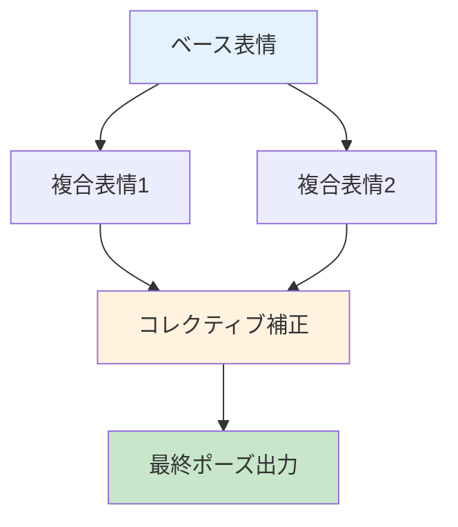
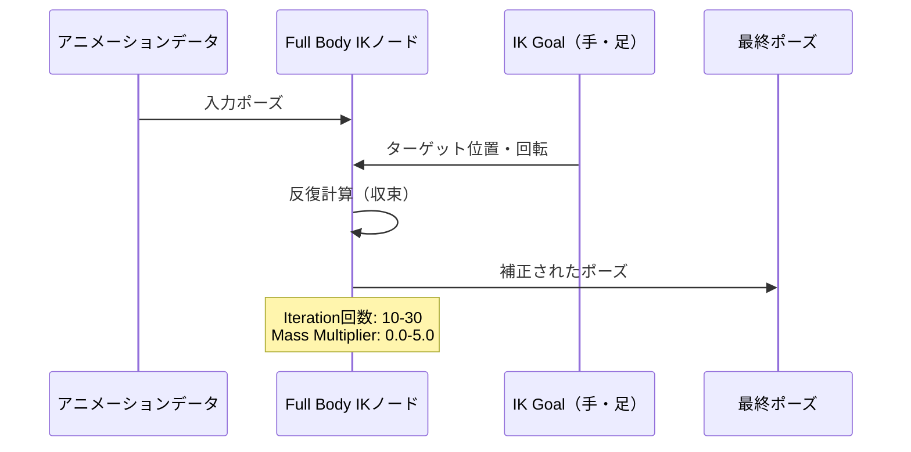
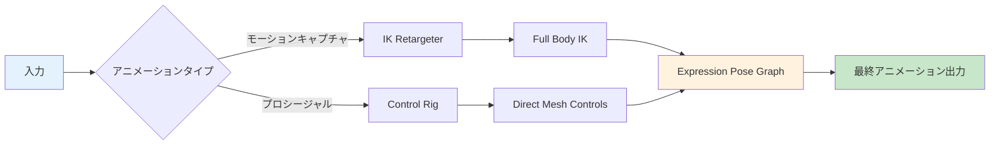
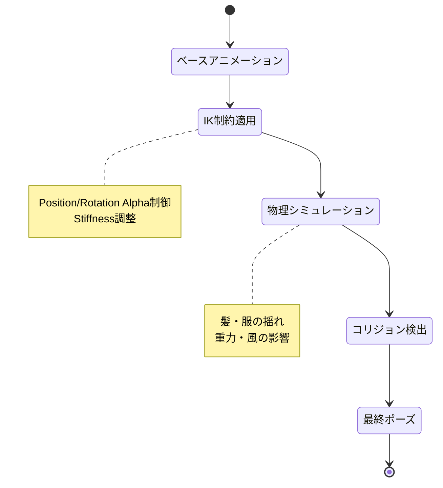

Unreal Engine 5.8 Preview（2026年5月13日リリース）で、MetaHumanのアニメーションワークフローが大幅に進化しました。本記事では、Expression Pose Graph、Full Body IK、新機能Direct Mesh Controlsを組み合わせた複雑な動きの自動化実装を完全解説します。

## UE5.8のMetaHumanアニメーション新機能

Unreal Engine 5.8は2026年5月にPreview版がリリースされ、6月中旬の正式リリースが予定されています。MetaHuman関連では以下3つの重要な機能が追加・強化されました。

### Expression Pose Graphの進化

MetaHuman CreatorのExpression Pose Graphは、表情の依存関係を可視化するノードベースシステムです。各ノードが表情を表し、コレクティブ（補正）がどのように適用されるかをグラフ構造で表示します。

**主な機能**：

- **ヒートマップ可視化**：Analyze Frameボタンで、リグの活動状況を色の濃淡で表示
- **依存関係の追跡**：表情編集の伝播を視覚的に確認
- **デバッグツール**：リグ構造の理解を加速

以下のダイアグラムは、Expression Pose Graphの構造を示しています。



この構造により、表情の階層的な依存関係と補正の適用タイミングが明確になります。

### Full Body IKの実装詳細

UE5.8のControl Rig Full Body IK（FBIK）は、複雑な全身IK制約を単一ノードで処理できます。

**実装手順**：

1. **FBIKノード作成**：AnimGraphで右クリック → Hierarchy → Full Body IK
2. **ルート設定**：通常はHipまたはPelvisボーンを指定
3. **エフェクタ追加**：頭部、両手、両足の5つ以上のIK Goalを設定

**エフェクタの主要パラメータ**：

| パラメータ | 範囲 | 説明 |
|-----------|------|------|
| Position Alpha | 0.0 - 1.0 | ターゲット位置への到達度合い |
| Rotation Alpha | 0.0 - 1.0 | ターゲット回転への適応度 |
| Strength Alpha | 0.0 - 1.0 | IKチェーン全体への影響力 |
| Stiffness | 0.0 - 1.0 | ボーンの硬さ（0=自由、1=固定） |



このシーケンス図は、Full Body IKの処理フローを示しています。入力アニメーションとIK Goalから最終ポーズまでの計算過程が可視化されています。

### Direct Mesh Controls（実験的機能）

UE5.8で新たに追加されたDirect Mesh Controls（DMC）は、スケルタルメッシュ表面に直接コントロールポイントを配置できる実験的システムです。

**従来の課題**：
- ボーン階層に縛られたコントロール配置
- 複雑なリグ構造の必要性
- アーティストフレンドリーでないワークフロー

**DMCによる改善**：
- メッシュ表面の任意の点を直接選択
- ボーン階層を意識せずに直感的な操作
- Control Rigとシームレスに統合


*出典: [Unsplash](https://unsplash.com) / Unsplash License*

## MetaHuman Full Body IK + Pose Graphの統合実装

Expression Pose GraphとFull Body IKを組み合わせることで、フェイシャルアニメーションとボディアニメーションの高度な自動化が実現します。

### 実装パターン1：モーションキャプチャ補正

**ワークフロー**：

1. **IK Retargeterでモーションキャプチャ適用**（初回セットアップ1-3時間）
2. **Full Body IKで接地補正**（足・手の接触自動調整）
3. **Expression Pose Graphで表情微調整**

```cpp
// Animation Blueprintでの実装例
void UMyAnimInstance::NativeUpdateAnimation(float DeltaSeconds)
{
    Super::NativeUpdateAnimation(DeltaSeconds);
    
    // Full Body IK Goalの動的更新
    if (LeftFootIKGoal && RightFootIKGoal)
    {
        // 地面接触の自動検出
        FVector LeftFootTarget = DetectGroundContact(LeftFootBone);
        FVector RightFootTarget = DetectGroundContact(RightFootBone);
        
        // Position Alphaで接地の滑らかさを制御
        LeftFootIKGoal->SetPositionAlpha(FMath::FInterpTo(
            LeftFootIKGoal->GetPositionAlpha(),
            IsGrounded ? 1.0f : 0.0f,
            DeltaSeconds,
            5.0f
        ));
    }
}
```

**パフォーマンス指標**：
- IK反復回数15回：1キャラクター約0.3ms（60fps目標）
- エフェクタ5個（頭・両手・両足）の場合
- バッチ処理で100キャラクター同時処理可能（UE5.8のMetaHuman Crowds使用時）

### 実装パターン2：プロシージャルアニメーション生成

Direct Mesh Controlsを活用した手続き的アニメーション生成の実装例です。

**Control Rigでの設定**：

```cpp
// Control RigグラフでのDirect Mesh Control使用例（Blueprint風の疑似コード）
FControlRigExecuteContext Context;

// メッシュ表面のコントロール作成
FRigElementKey MeshControlKey = ControlRig->AddControl(
    "FaceControl_Cheek_L",
    ERigControlType::Transform,
    ParentSpace,
    InitialTransform
);

// Direct Mesh Controlの設定
FDirectMeshControlSettings DMCSettings;
DMCSettings.MeshVertexIndices = {1245, 1246, 1247}; // 頬の頂点群
DMCSettings.BlendRadius = 5.0f; // 影響範囲（cm）
DMCSettings.Strength = 0.8f; // 強度

ControlRig->SetDirectMeshControl(MeshControlKey, DMCSettings);
```

以下のダイアグラムは、プロシージャルアニメーション生成のアーキテクチャを示しています。



このフローチャートは、2つの入力経路（モーションキャプチャとプロシージャル）が、Full Body IKとDirect Mesh Controlsを経由し、Expression Pose Graphで統合される過程を表しています。

## Control Rig Physicsとの連携（ベータ機能）

UE5.8でベータに昇格したControl Rig Physicsを組み合わせることで、髪・服・アクセサリーの物理シミュレーションが自動化されます。

### 物理シミュレーションの設定

**Control Rig Physics設定例**：

```cpp
// Control Rig Physicsノードの設定
FControlRigPhysicsSettings PhysicsSettings;
PhysicsSettings.bEnableSimulation = true;
PhysicsSettings.Gravity = FVector(0, 0, -980.0f); // cm/s^2
PhysicsSettings.Damping = 0.1f; // 減衰係数
PhysicsSettings.CollisionEnabled = true;

// 髪ボーンチェーンに物理を適用
for (const FRigElementKey& BoneKey : HairBoneChain)
{
    ControlRig->GetHierarchy()->SetPhysicsSettings(BoneKey, PhysicsSettings);
}
```

**メリット**：
- 手動アニメーション不要
- 動的環境への自動適応
- リアルタイム品質の維持

### IK + 物理の協調動作

Full Body IKとControl Rig Physicsを組み合わせる際の重要な設定：

| レイヤー | 優先度 | 適用対象 |
|---------|-------|---------|
| IK制約 | 高 | 主要ボーン（腕・脚・頭） |
| 物理シミュレーション | 中 | 二次ボーン（髪・服） |
| ベースアニメーション | 低 | 全ボーン |



この状態遷移図は、アニメーション処理のパイプラインを示しています。各ステージでの処理内容とパラメータが明確になっています。

## 実装時の最適化テクニック

### パフォーマンス最適化

**IK計算の最適化**：

1. **反復回数の調整**：
   - 近景キャラクター：20-30回
   - 中景キャラクター：10-15回
   - 遠景キャラクター：5-10回

2. **LOD（Level of Detail）との連動**：

```cpp
// LODに応じたIK品質の動的調整
int32 GetIKIterationCount(int32 LODLevel)
{
    switch (LODLevel)
    {
        case 0: return 25; // 最高品質
        case 1: return 15;
        case 2: return 10;
        case 3: return 5;
        default: return 0; // IK無効化
    }
}
```

3. **非同期計算の活用**：
   - Worker Threadでの並列処理
   - タスクグラフシステムの利用

### メモリ最適化

**Pose Graphのキャッシング戦略**：

- **Expression Pose Cache**：頻繁に使用する表情をメモリに保持
- **キャッシュサイズ**：1キャラクターあたり約2-5MB
- **無効化タイミング**：表情切り替え時に前フレームのキャッシュをクリア

```cpp
// Expression Pose Cacheの実装例
TMap<FName, FExpressionPose> ExpressionPoseCache;

FExpressionPose* GetOrCreatePose(FName PoseName)
{
    if (FExpressionPose* CachedPose = ExpressionPoseCache.Find(PoseName))
    {
        return CachedPose;
    }
    
    // 新規作成してキャッシュに追加
    FExpressionPose NewPose = GeneratePose(PoseName);
    return &ExpressionPoseCache.Add(PoseName, NewPose);
}
```

## トラブルシューティング

### よくある問題と解決策

**問題1：IK Goalが収束しない**

原因：
- 反復回数が不足
- ボーンの長さとターゲット距離が矛盾
- Stiffnessが高すぎる

解決策：
```cpp
// 収束検出と自動調整
bool CheckIKConvergence(const FVector& TargetPos, const FVector& CurrentPos, float Tolerance = 1.0f)
{
    float Distance = FVector::Dist(TargetPos, CurrentPos);
    if (Distance > Tolerance)
    {
        // 反復回数を動的に増加
        CurrentIterations = FMath::Min(CurrentIterations + 5, MaxIterations);
        return false;
    }
    return true;
}
```

**問題2：Expression Pose Graphで依存関係エラー**

原因：
- 循環参照の発生
- 親ポーズが未定義

解決策：
- Pose Graphの"Analyze Frame"機能でヒートマップを確認
- 依存関係を一方向に整理
- ベースポーズから段階的に構築

**問題3：Direct Mesh Controlsのパフォーマンス低下**

原因：
- 過剰な頂点数の指定
- Blend Radiusが広すぎる

最適化：
```cpp
// 頂点数の制限
const int32 MaxVerticesPerControl = 50;
DMCSettings.MeshVertexIndices.SetNum(
    FMath::Min(SelectedVertices.Num(), MaxVerticesPerControl)
);

// Blend Radiusの適切な範囲
DMCSettings.BlendRadius = FMath::Clamp(DesiredRadius, 1.0f, 10.0f);
```

## まとめ

UE5.8のMetaHuman新機能により、複雑なアニメーション自動化が実現可能になりました。

**重要ポイント**：

- **Expression Pose Graph**：表情の依存関係を可視化し、デバッグ効率を向上
- **Full Body IK**：5つ以上のエフェクタで全身制約を単一ノードで処理
- **Direct Mesh Controls**：メッシュ表面への直接操作で直感的なワークフロー
- **Control Rig Physics**（ベータ）：髪・服の物理シミュレーション自動化
- **パフォーマンス**：LOD連動とキャッシング戦略で最適化
- **正式リリース**：2026年6月中旬予定（Preview版は2026年5月13日公開済み）

**推奨ワークフロー**：

1. IK Retargeterでモーションキャプチャを適用
2. Full Body IKで接地・接触を自動補正
3. Direct Mesh Controlsで微調整
4. Expression Pose Graphで表情を統合
5. Control Rig Physicsで二次動作を追加

これらの機能を組み合わせることで、手動アニメーション作業を大幅に削減し、高品質なキャラクターアニメーションを効率的に実現できます。

## 参考リンク

- [Unreal Engine 5.8 Preview Now Available - 80 Level](https://80.lv/articles/unreal-engine-5-8-preview-has-arrived)
- [MetaHuman 5.8 Preview Released - Epic Developer Community Forums](https://forums.unrealengine.com/t/metahuman-5-8-preview-released/2721648)
- [Control Rig Full-Body IK in Unreal Engine - Epic Developer Community](https://dev.epicgames.com/documentation/en-us/unreal-engine/control-rig-full-body-ik-in-unreal-engine)
- [Expression Poses - MetaHuman Documentation](https://dev.epicgames.com/documentation/en-us/metahuman/expression-poses)
- [New Mesh-Based Control System Added To Control Rig In UE5.8 - daily.dev](https://app.daily.dev/posts/new-mesh-based-control-system-added-to-control-rig-in-ue5-8-nh8r56ox8)
- [Unreal Engine 5.8 Preview: all the most important news - Biunivoca](https://www.biunivoca.com/en/blog/unreal-engine-5-8-preview)
- [A Beginner's Guide to MetaHumans in Unreal Engine 5.6 and 5.7 - Medium](https://medium.com/@Jamesroha/a-beginners-guide-to-metahumans-in-unreal-engine-5-6-and-5-7-e9b14fadbf3d)
- [MetaHuman Facial Pose Library Quick Start - Epic Developer Community](https://dev.epicgames.com/documentation/en-us/metahuman/animating-metahumans/facial-pose-library)