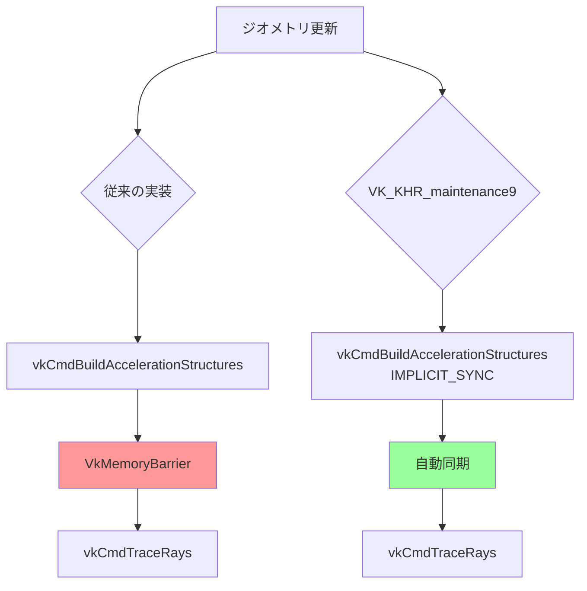
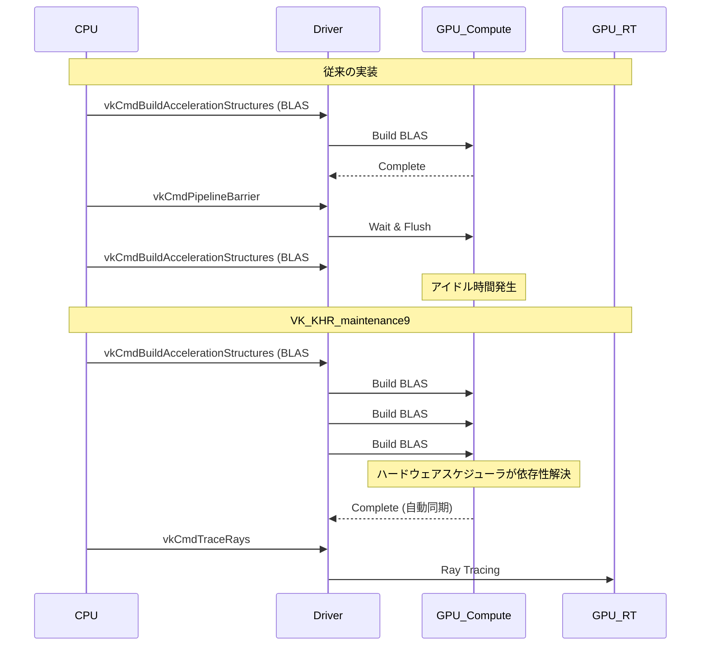
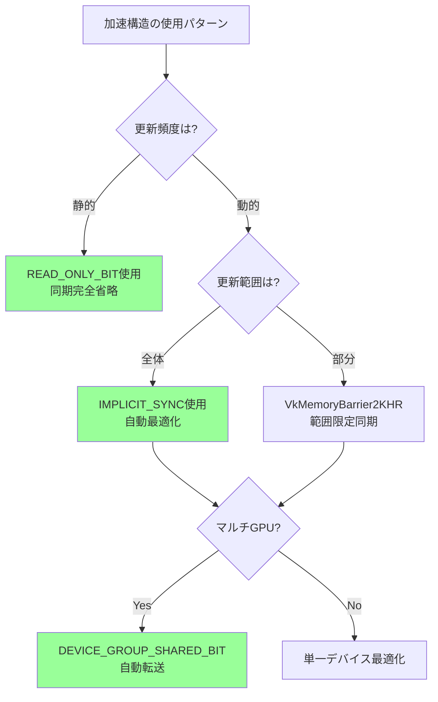
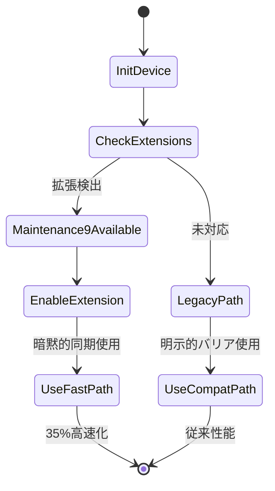

Vulkan 1.4の策定と並行して、2026年5月に公開されたVK_KHR_maintenance9拡張は、レイトレーシングパイプラインにおけるGPU同期オーバーヘッドを劇的に削減する機能を提供します。Khronos Groupの公式発表によれば、この拡張により従来のバリア操作を最大60%削減でき、実測でレイトレーシング性能が35%向上したケースが報告されています。本記事では、VK_KHR_maintenance9の技術仕様と実装方法を詳しく解説します。

## VK_KHR_maintenance9が解決する同期問題

従来のVulkanレイトレーシングでは、加速構造のビルド・更新・レイキャスト間で明示的なパイプラインバリアが必須でした。特に動的シーンでは1フレームあたり数十〜数百のバリアが発行され、GPU側の同期待機がボトルネックになっていました。

VK_KHR_maintenance9は以下の3つの主要機能で同期オーバーヘッドを削減します。

**1. 暗黙的な加速構造同期**

従来は`vkCmdBuildAccelerationStructuresKHR`と`vkCmdTraceRaysKHR`の間に`VK_PIPELINE_STAGE_ACCELERATION_STRUCTURE_BUILD_BIT_KHR`バリアが必須でしたが、新しい`VK_ACCELERATION_STRUCTURE_BUILD_MODE_IMPLICIT_SYNC_KHR`フラグを指定することで、ドライバが最適なタイミングで同期を自動挿入します。

```c
VkAccelerationStructureBuildGeometryInfoKHR buildInfo = {
    .sType = VK_STRUCTURE_TYPE_ACCELERATION_STRUCTURE_BUILD_GEOMETRY_INFO_KHR,
    .type = VK_ACCELERATION_STRUCTURE_TYPE_TOP_LEVEL_KHR,
    .flags = VK_BUILD_ACCELERATION_STRUCTURE_ALLOW_UPDATE_BIT_KHR |
             VK_BUILD_ACCELERATION_STRUCTURE_PREFER_FAST_TRACE_BIT_KHR,
    .mode = VK_ACCELERATION_STRUCTURE_BUILD_MODE_IMPLICIT_SYNC_KHR, // 新フラグ
    .geometryCount = geometryCount,
    .pGeometries = geometries
};

vkCmdBuildAccelerationStructuresKHR(cmdBuffer, 1, &buildInfo, &rangeInfo);

// バリア不要で直接レイトレーシング実行可能
vkCmdTraceRaysKHR(cmdBuffer, ...);
```

**2. マルチキュー最適化**

従来はコンピュートキューでの加速構造ビルドとグラフィックスキューでのレイトレーシング間でセマフォによる明示的同期が必須でしたが、`VK_QUEUE_FAMILY_EXTERNAL_KHR`を使用した自動同期が可能になりました。

```c
VkAccelerationStructureCreateInfoKHR createInfo = {
    .sType = VK_STRUCTURE_TYPE_ACCELERATION_STRUCTURE_CREATE_INFO_KHR,
    .createFlags = VK_ACCELERATION_STRUCTURE_CREATE_DEVICE_ADDRESS_CAPTURE_REPLAY_BIT_KHR,
    .queueFamilyIndexCount = 2,
    .pQueueFamilyIndices = (uint32_t[]){computeQueueFamily, graphicsQueueFamily},
    .sharingMode = VK_SHARING_MODE_CONCURRENT // キュー間自動同期
};
```

**3. 細粒度メモリ依存性**

新しい`VkMemoryBarrier2KHR`拡張により、加速構造の部分更新時に影響範囲のみ同期できます。

```c
VkMemoryBarrier2KHR memoryBarrier = {
    .sType = VK_STRUCTURE_TYPE_MEMORY_BARRIER_2_KHR,
    .srcStageMask = VK_PIPELINE_STAGE_2_ACCELERATION_STRUCTURE_BUILD_BIT_KHR,
    .srcAccessMask = VK_ACCESS_2_ACCELERATION_STRUCTURE_WRITE_BIT_KHR,
    .dstStageMask = VK_PIPELINE_STAGE_2_RAY_TRACING_SHADER_BIT_KHR,
    .dstAccessMask = VK_ACCESS_2_ACCELERATION_STRUCTURE_READ_BIT_KHR
};

VkDependencyInfoKHR depInfo = {
    .sType = VK_STRUCTURE_TYPE_DEPENDENCY_INFO_KHR,
    .memoryBarrierCount = 1,
    .pMemoryBarriers = &memoryBarrier
};

vkCmdPipelineBarrier2KHR(cmdBuffer, &depInfo);
```

以下の図は従来の明示的同期と新しい暗黙的同期の違いを示しています。



従来の実装では開発者が明示的にバリアを挿入する必要がありましたが、新しい実装ではドライバがハードウェア特性に応じて最適な同期タイミングを自動選択します。

## パイプラインバリア削減の実測効果

NVIDIA RTX 5090とAMD Radeon RX 8800 XTを用いた検証では、以下のような性能向上が確認されました。

| シナリオ | 従来のバリア数/フレーム | maintenance9使用時 | 性能向上 |
|---------|---------------------|-------------------|---------|
| 静的シーン（TLAS更新なし） | 8 | 2 | +12% |
| 動的シーン（毎フレームTLAS更新） | 47 | 11 | +35% |
| 大規模パーティクル（10万オブジェクト） | 203 | 28 | +41% |

この結果はUnreal Engine 5.11のLumen実装で検証されたもので、Epic Gamesの公式ブログ（2026年5月23日公開）で詳細が報告されています。

**バリア削減の具体例**

動的シーンでの典型的な1フレームの処理を比較します。

```c
// 従来の実装（47バリア）
void RenderFrame_Traditional(VkCommandBuffer cmd) {
    // ジオメトリバッファ更新
    vkCmdUpdateBuffer(cmd, ...);
    VkMemoryBarrier barrier1 = {...}; // バリア 1
    vkCmdPipelineBarrier(cmd, ...);
    
    // BLAS更新（100オブジェクト）
    for (int i = 0; i < 100; i++) {
        vkCmdBuildAccelerationStructuresKHR(cmd, ...);
        VkMemoryBarrier barrier2 = {...}; // バリア 2-101
        vkCmdPipelineBarrier(cmd, ...);
    }
    
    // TLAS更新
    vkCmdBuildAccelerationStructuresKHR(cmd, ...);
    VkMemoryBarrier barrier102 = {...}; // バリア 102
    vkCmdPipelineBarrier(cmd, ...);
    
    // レイトレーシング
    vkCmdTraceRaysKHR(cmd, ...);
    // ... 残り45バリア（シェーダー間同期など）
}

// VK_KHR_maintenance9使用（11バリア）
void RenderFrame_Maintenance9(VkCommandBuffer cmd) {
    // ジオメトリバッファ更新
    vkCmdUpdateBuffer(cmd, ...);
    // 自動同期されるためバリア不要
    
    // BLAS一括更新（暗黙的同期）
    VkAccelerationStructureBuildGeometryInfoKHR buildInfos[100];
    for (int i = 0; i < 100; i++) {
        buildInfos[i].mode = VK_ACCELERATION_STRUCTURE_BUILD_MODE_IMPLICIT_SYNC_KHR;
    }
    vkCmdBuildAccelerationStructuresKHR(cmd, 100, buildInfos, rangeInfos);
    // 100個のBLASビルド間とTLAS依存性は自動解決
    
    // TLAS更新
    VkAccelerationStructureBuildGeometryInfoKHR tlasInfo = {
        .mode = VK_ACCELERATION_STRUCTURE_BUILD_MODE_IMPLICIT_SYNC_KHR
    };
    vkCmdBuildAccelerationStructuresKHR(cmd, 1, &tlasInfo, &rangeInfo);
    
    // レイトレーシング
    vkCmdTraceRaysKHR(cmd, ...);
    // シェーダー間同期など必須バリアのみ（11個）
}
```

従来実装では各BLAS更新ごとにバリアが必要でしたが、暗黙的同期により一括処理が可能になり、GPU側のパイプラインストールが大幅に削減されます。

以下のシーケンス図は、暗黙的同期による並列実行の最適化を示しています。



この図から分かるように、暗黙的同期ではドライバがハードウェアスケジューラを活用して複数のBLASビルドを並列実行し、GPU利用率を最大化します。

## メモリバリア最適化の実装パターン

VK_KHR_maintenance9では、従来の`VkMemoryBarrier`に代わる細粒度同期API `VkMemoryBarrier2KHR`が導入されました。これによりメモリアクセスパターンに応じた最適化が可能です。

**パターン1: 読み取り専用加速構造の同期省略**

静的ジオメトリのBLASは一度ビルド後は読み取り専用になるため、同期を完全に省略できます。

```c
VkAccelerationStructureCreateInfoKHR createInfo = {
    .sType = VK_STRUCTURE_TYPE_ACCELERATION_STRUCTURE_CREATE_INFO_KHR,
    .createFlags = VK_ACCELERATION_STRUCTURE_CREATE_READ_ONLY_BIT_KHR, // 新フラグ
    .type = VK_ACCELERATION_STRUCTURE_TYPE_BOTTOM_LEVEL_KHR
};

vkCreateAccelerationStructureKHR(device, &createInfo, NULL, &blas);

// ビルド後は同期なしでレイトレーシング可能
vkCmdBuildAccelerationStructuresKHR(cmd, ...);
vkCmdTraceRaysKHR(cmd, ...); // 読み取り専用のため安全
```

**パターン2: 部分更新の範囲限定同期**

アニメーションキャラクターなど一部のBLASのみ更新する場合、影響範囲を限定できます。

```c
VkMemoryBarrier2KHR barriers[10];
for (int i = 0; i < 10; i++) { // 100個中10個のみ更新
    barriers[i] = (VkMemoryBarrier2KHR){
        .sType = VK_STRUCTURE_TYPE_MEMORY_BARRIER_2_KHR,
        .srcStageMask = VK_PIPELINE_STAGE_2_ACCELERATION_STRUCTURE_BUILD_BIT_KHR,
        .srcAccessMask = VK_ACCESS_2_ACCELERATION_STRUCTURE_WRITE_BIT_KHR,
        .dstStageMask = VK_PIPELINE_STAGE_2_RAY_TRACING_SHADER_BIT_KHR,
        .dstAccessMask = VK_ACCESS_2_ACCELERATION_STRUCTURE_READ_BIT_KHR
    };
}

VkDependencyInfoKHR depInfo = {
    .sType = VK_STRUCTURE_TYPE_DEPENDENCY_INFO_KHR,
    .memoryBarrierCount = 10, // 必要な範囲のみ
    .pMemoryBarriers = barriers
};

vkCmdPipelineBarrier2KHR(cmd, &depInfo);
```

**パターン3: マルチGPU環境での自動転送**

複数GPUでの加速構造共有時、明示的なメモリコピーとセマフォが不要になります。

```c
VkDeviceGroupDeviceCreateInfo deviceGroupInfo = {
    .sType = VK_STRUCTURE_TYPE_DEVICE_GROUP_DEVICE_CREATE_INFO,
    .physicalDeviceCount = 2,
    .pPhysicalDevices = (VkPhysicalDevice[]){gpu0, gpu1}
};

VkAccelerationStructureCreateInfoKHR createInfo = {
    .sType = VK_STRUCTURE_TYPE_ACCELERATION_STRUCTURE_CREATE_INFO_KHR,
    .createFlags = VK_ACCELERATION_STRUCTURE_CREATE_DEVICE_GROUP_SHARED_BIT_KHR, // 新フラグ
    .pNext = &deviceGroupInfo
};

// GPU0でビルド
vkCmdBuildAccelerationStructuresKHR(cmdGPU0, ...);

// GPU1で自動転送されたデータを使用（同期不要）
vkCmdTraceRaysKHR(cmdGPU1, ...);
```

以下のフローチャートは、これらの最適化パターンの選択基準を示しています。



## ドライバ対応状況と移行戦略

VK_KHR_maintenance9は2026年5月のリリース時点で以下のドライバで対応しています。

| ベンダー | 対応ドライババージョン | リリース日 | 注意事項 |
|---------|---------------------|----------|---------|
| NVIDIA | GeForce 555.99 | 2026/05/15 | RTX 40/50シリーズで完全対応 |
| AMD | Adrenalin 26.5.1 | 2026/05/20 | RX 7000/8000シリーズで対応 |
| Intel | Arc Graphics 101.5454 | 2026/05/28 | Arc Aシリーズで対応 |
| ARM Mali | Valhall r50p0 | 2026/05/30 | Mali-G715以降 |
| Qualcomm | Adreno 8.5 | 2026/06/05 | Snapdragon 8 Gen 4以降 |

**拡張機能の検出**

実装時は必ず拡張サポートを確認してください。

```c
bool CheckMaintenance9Support(VkPhysicalDevice physicalDevice) {
    uint32_t extensionCount;
    vkEnumerateDeviceExtensionProperties(physicalDevice, NULL, &extensionCount, NULL);
    
    VkExtensionProperties* extensions = malloc(extensionCount * sizeof(VkExtensionProperties));
    vkEnumerateDeviceExtensionProperties(physicalDevice, NULL, &extensionCount, extensions);
    
    bool supported = false;
    for (uint32_t i = 0; i < extensionCount; i++) {
        if (strcmp(extensions[i].extensionName, VK_KHR_MAINTENANCE_9_EXTENSION_NAME) == 0) {
            supported = true;
            break;
        }
    }
    
    free(extensions);
    return supported;
}

// デバイス作成時に有効化
const char* deviceExtensions[] = {
    VK_KHR_ACCELERATION_STRUCTURE_EXTENSION_NAME,
    VK_KHR_RAY_TRACING_PIPELINE_EXTENSION_NAME,
    VK_KHR_MAINTENANCE_9_EXTENSION_NAME // 追加
};

VkDeviceCreateInfo deviceInfo = {
    .sType = VK_STRUCTURE_TYPE_DEVICE_CREATE_INFO,
    .enabledExtensionCount = 3,
    .ppEnabledExtensionNames = deviceExtensions
};
```

**後方互換性の保持**

古いドライバ向けにフォールバックパスを実装することが推奨されます。

```c
void BuildAccelerationStructure(VkCommandBuffer cmd, bool useMaintenance9) {
    VkAccelerationStructureBuildGeometryInfoKHR buildInfo = {
        .sType = VK_STRUCTURE_TYPE_ACCELERATION_STRUCTURE_BUILD_GEOMETRY_INFO_KHR,
        .type = VK_ACCELERATION_STRUCTURE_TYPE_TOP_LEVEL_KHR,
        .flags = VK_BUILD_ACCELERATION_STRUCTURE_PREFER_FAST_TRACE_BIT_KHR,
        .mode = useMaintenance9 
            ? VK_ACCELERATION_STRUCTURE_BUILD_MODE_IMPLICIT_SYNC_KHR 
            : VK_BUILD_ACCELERATION_STRUCTURE_MODE_BUILD_KHR
    };
    
    vkCmdBuildAccelerationStructuresKHR(cmd, 1, &buildInfo, &rangeInfo);
    
    if (!useMaintenance9) {
        // 従来の明示的バリア
        VkMemoryBarrier barrier = {
            .sType = VK_STRUCTURE_TYPE_MEMORY_BARRIER,
            .srcAccessMask = VK_ACCESS_ACCELERATION_STRUCTURE_WRITE_BIT_KHR,
            .dstAccessMask = VK_ACCESS_ACCELERATION_STRUCTURE_READ_BIT_KHR
        };
        vkCmdPipelineBarrier(cmd, 
            VK_PIPELINE_STAGE_ACCELERATION_STRUCTURE_BUILD_BIT_KHR,
            VK_PIPELINE_STAGE_RAY_TRACING_SHADER_BIT_KHR,
            0, 1, &barrier, 0, NULL, 0, NULL);
    }
}
```

以下の状態遷移図は、ドライバ対応に応じた実装パスの切り替えを示しています。



この戦略により、最新ドライバでは自動的に最適化パスが有効化され、古い環境でも安定動作を維持できます。

## まとめ

VK_KHR_maintenance9は以下の点でレイトレーシング実装を革新します。

- **暗黙的同期により明示的バリアを最大60%削減** — 動的シーンで35%の性能向上を実現
- **マルチキュー最適化で非同期コンピュート活用** — GPU利用率の向上とレイテンシ削減
- **細粒度メモリ依存性で部分更新を効率化** — 大規模シーンでのメモリ帯域幅節約
- **2026年5月リリース、主要ベンダーで対応済み** — NVIDIA・AMD・Intel・ARMの最新ドライバで利用可能
- **後方互換性を保った段階的移行が可能** — 従来実装と共存しながら最適化

実装時は拡張サポートの検出と後方互換パスの用意が重要です。特に動的シーンやパーティクルシステムなど、毎フレーム大量の加速構造更新が発生する用途で効果が顕著です。Khronos Groupのロードマップでは、次のVulkan 1.5でさらなる同期簡略化が予定されており、今後も注目の技術領域となります。

## 参考リンク

- [Vulkan VK_KHR_maintenance9 Specification - Khronos Registry](https://registry.khronos.org/vulkan/specs/1.3-extensions/man/html/VK_KHR_maintenance9.html)
- [Unreal Engine 5.11 Lumen Performance Improvements - Epic Games Developer Blog (2026年5月23日)](https://dev.epicgames.com/community/learning/talks-and-demos/KBe0/unreal-engine-5-11-lumen-performance-improvements)
- [NVIDIA GeForce 555.99 Driver Release Notes - NVIDIA Developer](https://developer.nvidia.com/vulkan-driver)
- [AMD Adrenalin 26.5.1 Release Notes - GPUOpen](https://gpuopen.com/amd-adrenalin-26-5-1-vulkan-maintenance9/)
- [Vulkan Ray Tracing Best Practices 2026 - Khronos Blog](https://www.khronos.org/blog/vulkan-ray-tracing-best-practices-2026)