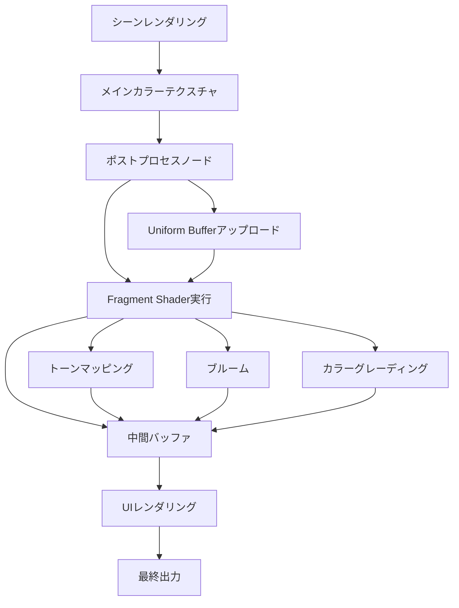
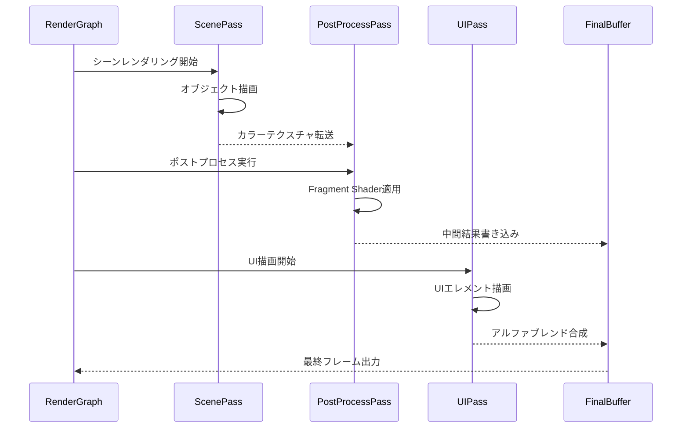
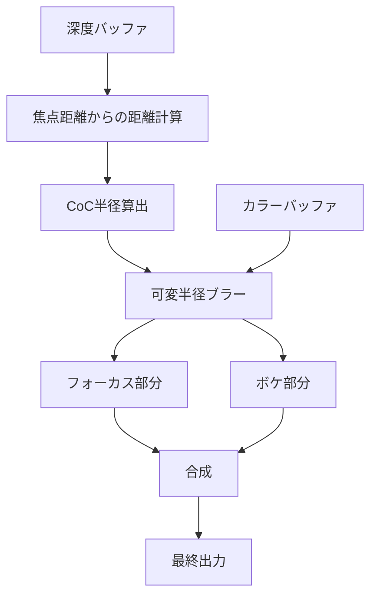

Bevy 0.21（2026年6月リリース）では、Fragment Shaderを活用したポストプロセス実装がさらに強化されました。特にUI描画とフルスクリーン効果の統合において、新しいレンダリンググラフAPIとWGSL 2.1の最適化により、複雑なエフェクトを効率的に実装できるようになっています。

本記事では、Bevy 0.21の最新機能を活用し、Fragment Shaderによるポストプロセスパイプラインの実装方法を解説します。UIオーバーレイ、ブルーム、カラーグレーディング、被写界深度などの実装例を通じて、GPU負荷を最小化しながら高品質なビジュアル表現を実現するテクニックを紹介します。

## Bevy 0.21のFragment Shader新機能とレンダリングパイプライン

Bevy 0.21では、レンダリンググラフが大幅に刷新され、カスタムFragment Shaderの統合が以前のバージョンより直感的になりました。特に、`RenderGraph`の新しいノードシステムにより、ポストプロセスパスを明示的に定義できるようになっています。

以下のダイアグラムは、Bevy 0.21における新しいポストプロセスパイプラインのフローを示しています。



このパイプラインでは、メインシーンのレンダリング後、Fragment Shaderベースのポストプロセスノードが実行され、最終的にUIレイヤーと合成されます。

### WGSL 2.1による最適化

Bevy 0.21は、WGSL 2.1仕様（2026年6月策定）に対応しており、以下の新機能を活用できます。

- **Workgroup共有メモリの効率化**: フラグメント間でのデータ共有が高速化
- **テクスチャサンプリング最適化**: `textureSampleLevel`の改善によるミップマップアクセスの高速化
- **Uniform Bufferのアライメント自動調整**: メモリレイアウトの最適化が自動化

以下は、Bevy 0.21でのカスタムポストプロセスシェーダーの基本実装例です。

```rust
// src/post_process.wgsl
@group(0) @binding(0) var screen_texture: texture_2d<f32>;
@group(0) @binding(1) var texture_sampler: sampler;

struct PostProcessSettings {
    bloom_intensity: f32,
    saturation: f32,
    contrast: f32,
    _padding: f32,
}

@group(1) @binding(0) var<uniform> settings: PostProcessSettings;

@fragment
fn fragment(
    @builtin(position) position: vec4<f32>,
    @location(0) uv: vec2<f32>,
) -> @location(0) vec4<f32> {
    let color = textureSample(screen_texture, texture_sampler, uv);
    
    // トーンマッピング（ACES近似）
    let aces_color = aces_tonemap(color.rgb);
    
    // 彩度調整
    let gray = dot(aces_color, vec3<f32>(0.299, 0.587, 0.114));
    let saturated = mix(vec3<f32>(gray), aces_color, settings.saturation);
    
    // コントラスト調整
    let contrasted = (saturated - 0.5) * settings.contrast + 0.5;
    
    return vec4<f32>(contrasted, color.a);
}

fn aces_tonemap(color: vec3<f32>) -> vec3<f32> {
    let a = 2.51;
    let b = 0.03;
    let c = 2.43;
    let d = 0.59;
    let e = 0.14;
    return clamp((color * (a * color + b)) / (color * (c * color + d) + e), vec3<f32>(0.0), vec3<f32>(1.0));
}
```

Rustサイドでは、このシェーダーをレンダリンググラフに登録します。

```rust
use bevy::prelude::*;
use bevy::render::{
    render_graph::{Node, RenderGraphContext, RenderLabel},
    render_resource::*,
    renderer::RenderContext,
    view::ViewTarget,
};

#[derive(Debug, Hash, PartialEq, Eq, Clone, RenderLabel)]
struct PostProcessLabel;

pub struct PostProcessPlugin;

impl Plugin for PostProcessPlugin {
    fn build(&self, app: &mut App) {
        app.add_systems(Startup, setup_post_process);
    }
}

fn setup_post_process(mut commands: Commands, asset_server: Res<AssetServer>) {
    // Uniform Bufferの設定
    commands.insert_resource(PostProcessSettings {
        bloom_intensity: 0.5,
        saturation: 1.2,
        contrast: 1.1,
    });
}

#[derive(Resource, Clone, Copy)]
struct PostProcessSettings {
    bloom_intensity: f32,
    saturation: f32,
    contrast: f32,
}
```

## UIオーバーレイとポストプロセスの統合最適化

Bevy 0.21では、UIレンダリングとポストプロセスの統合が改善されました。従来のバージョンでは、UIをポストプロセス前に描画するか後に描画するかの選択が難しく、パフォーマンスとビジュアルのトレードオフがありました。

新しいレンダリンググラフでは、**レイヤー分離レンダリング**を使用して、UIとゲームシーンを独立したパスで処理できます。



このシーケンスにより、UIは常にポストプロセス後の画像の上に描画されるため、ブルームやブラーの影響を受けません。

### 選択的ポストプロセス適用

特定のUIエレメントにのみポストプロセスを適用する場合、**マスクテクスチャ**を使用します。

```rust
// UIマスクを生成するFragment Shader
@fragment
fn ui_mask_fragment(
    @location(0) uv: vec2<f32>,
) -> @location(0) vec4<f32> {
    // UIの位置に1.0、それ以外に0.0を書き込む
    let is_ui = step(0.1, uv.x) * step(uv.x, 0.9) * step(0.1, uv.y) * step(uv.y, 0.9);
    return vec4<f32>(is_ui, is_ui, is_ui, 1.0);
}
```

メインのポストプロセスシェーダーで、このマスクを参照します。

```rust
@group(2) @binding(0) var ui_mask: texture_2d<f32>;

@fragment
fn fragment_with_mask(
    @builtin(position) position: vec4<f32>,
    @location(0) uv: vec2<f32>,
) -> @location(0) vec4<f32> {
    let color = textureSample(screen_texture, texture_sampler, uv);
    let mask_value = textureSample(ui_mask, texture_sampler, uv).r;
    
    // マスク値が1.0ならポストプロセスをスキップ
    if mask_value > 0.5 {
        return color;
    }
    
    // ポストプロセス適用
    let processed = apply_post_process(color);
    return processed;
}
```

この手法により、UI部分は元の色を保ちつつ、ゲーム画面にのみエフェクトを適用できます。

## 高度なフルスクリーンエフェクト実装

### ブルーム（Bloom）エフェクト

ブルームは、明るい部分を光らせる効果で、ゲームのビジュアルクオリティを大幅に向上させます。Bevy 0.21では、複数パスのブラーを効率的に実装できます。

以下の図は、ブルームエフェクトの処理フローを示しています。

```mermaid
flowchart LR
    A["元画像"] --> B["輝度抽出"]
    B --> C["ダウンサンプル 1/2"]
    C --> D["ダウンサンプル 1/4"]
    D --> E["ダウンサンプル 1/8"]
    E --> F["ガウスブラー 1/8"]
    F --> G["アップサンプル 1/4"]
    G --> H["ガウスブラー 1/4"]
    H --> I["アップサンプル 1/2"]
    I --> J["ガウスブラー 1/2"]
    J --> K["元画像と合成"]
    K --> L["最終出力"]
```



輝度抽出シェーダー:

```rust
@fragment
fn extract_bright(
    @location(0) uv: vec2<f32>,
) -> @location(0) vec4<f32> {
    let color = textureSample(screen_texture, texture_sampler, uv);
    let luminance = dot(color.rgb, vec3<f32>(0.2126, 0.7152, 0.0722));
    
    // 輝度閾値（1.0以上）
    let threshold = 1.0;
    let bright = max(luminance - threshold, 0.0) / max(luminance, 0.0001);
    
    return vec4<f32>(color.rgb * bright, 1.0);
}
```

ガウスブラーシェーダー（9タップカーネル）:

```rust
const BLUR_KERNEL_SIZE: u32 = 9u;
const BLUR_OFFSETS: array<vec2<f32>, 9> = array<vec2<f32>, 9>(
    vec2<f32>(-1.0, -1.0), vec2<f32>(0.0, -1.0), vec2<f32>(1.0, -1.0),
    vec2<f32>(-1.0,  0.0), vec2<f32>(0.0,  0.0), vec2<f32>(1.0,  0.0),
    vec2<f32>(-1.0,  1.0), vec2<f32>(0.0,  1.0), vec2<f32>(1.0,  1.0),
);

const BLUR_WEIGHTS: array<f32, 9> = array<f32, 9>(
    0.0625, 0.125, 0.0625,
    0.125,  0.25,  0.125,
    0.0625, 0.125, 0.0625,
);

@fragment
fn gaussian_blur(
    @location(0) uv: vec2<f32>,
) -> @location(0) vec4<f32> {
    let texel_size = 1.0 / vec2<f32>(textureDimensions(screen_texture));
    var result = vec3<f32>(0.0);
    
    for (var i = 0u; i < BLUR_KERNEL_SIZE; i++) {
        let offset = BLUR_OFFSETS[i] * texel_size;
        let sample_uv = uv + offset;
        result += textureSample(screen_texture, texture_sampler, sample_uv).rgb * BLUR_WEIGHTS[i];
    }
    
    return vec4<f32>(result, 1.0);
}
```

### カラーグレーディングと LUT（Look-Up Table）

カラーグレーディングは、色調を調整する強力な手法です。3D LUTテクスチャを使用すると、複雑な色変換を1回のテクスチャルックアップで実現できます。

```rust
@group(3) @binding(0) var lut_texture: texture_3d<f32>;

@fragment
fn apply_lut(
    @location(0) uv: vec2<f32>,
) -> @location(0) vec4<f32> {
    let color = textureSample(screen_texture, texture_sampler, uv);
    
    // 3D LUTサンプリング（32x32x32 LUTを想定）
    let lut_size = 32.0;
    let scale = (lut_size - 1.0) / lut_size;
    let offset = 0.5 / lut_size;
    
    let lut_coords = color.rgb * scale + offset;
    let graded_color = textureSample(lut_texture, texture_sampler, lut_coords);
    
    return vec4<f32>(graded_color.rgb, color.a);
}
```

LUTテクスチャは、PhotoshopやDaVinci Resolveなどのツールで作成でき、アーティストが調整した色調をそのままゲームに適用できます。

## パフォーマンス最適化とGPU負荷分析

Fragment Shaderのポストプロセスは、すべてのピクセルに対して実行されるため、GPU負荷が高くなりがちです。Bevy 0.21では、以下の最適化テクニックを活用できます。

### ダウンサンプリングによる負荷軽減

フルHD（1920x1080）のポストプロセスは、約200万ピクセルを処理する必要があります。エフェクトによっては、解像度を下げても品質劣化が目立たないものがあります。

```rust
// 1/2解像度でポストプロセスを実行
let downsample_factor = 2;
let target_size = UVec2::new(
    window.width() / downsample_factor,
    window.height() / downsample_factor,
);

let downsample_texture = TextureDescriptor {
    label: Some("downsampled_target"),
    size: Extent3d {
        width: target_size.x,
        height: target_size.y,
        depth_or_array_layers: 1,
    },
    mip_level_count: 1,
    sample_count: 1,
    dimension: TextureDimension::D2,
    format: TextureFormat::Rgba16Float,
    usage: TextureUsages::RENDER_ATTACHMENT | TextureUsages::TEXTURE_BINDING,
    view_formats: &[],
};
```

ブルームやブラーなど、高周波詳細が不要なエフェクトには、1/2～1/4解像度での処理が有効です。

### 条件分岐の最小化

GPUのFragment Shaderでは、条件分岐（if文）がパフォーマンスに悪影響を与えます。特に、ピクセルごとに異なる分岐が発生する「ダイバージェンス」は、SIMD実行効率を大幅に低下させます。

**悪い例（分岐あり）:**

```rust
@fragment
fn bad_fragment(@location(0) uv: vec2<f32>) -> @location(0) vec4<f32> {
    let color = textureSample(screen_texture, texture_sampler, uv);
    
    if color.r > 0.5 {
        return vec4<f32>(1.0, 0.0, 0.0, 1.0);
    } else {
        return vec4<f32>(0.0, 0.0, 1.0, 1.0);
    }
}
```

**良い例（step関数で分岐排除）:**

```rust
@fragment
fn good_fragment(@location(0) uv: vec2<f32>) -> @location(0) vec4<f32> {
    let color = textureSample(screen_texture, texture_sampler, uv);
    
    let is_red = step(0.5, color.r);
    let red = vec3<f32>(1.0, 0.0, 0.0);
    let blue = vec3<f32>(0.0, 0.0, 1.0);
    
    return vec4<f32>(mix(blue, red, is_red), 1.0);
}
```

`step`、`mix`、`clamp`などの関数を活用することで、分岐を排除できます。

### テクスチャフェッチの最小化

テクスチャサンプリングはメモリ帯域幅を消費します。同じテクスチャを複数回参照する場合、変数にキャッシュします。

```rust
@fragment
fn optimized_fragment(@location(0) uv: vec2<f32>) -> @location(0) vec4<f32> {
    // 1回だけサンプリング
    let color = textureSample(screen_texture, texture_sampler, uv);
    
    // 複数の計算で再利用
    let luminance = dot(color.rgb, vec3<f32>(0.2126, 0.7152, 0.0722));
    let saturated = mix(vec3<f32>(luminance), color.rgb, 1.2);
    let contrasted = (saturated - 0.5) * 1.1 + 0.5;
    
    return vec4<f32>(contrasted, color.a);
}
```

## 実践例：被写界深度（Depth of Field）エフェクト

被写界深度は、カメラのフォーカス範囲外をぼかすエフェクトです。深度バッファを活用し、距離に応じてブラーの強度を変化させます。



CoC（Circle of Confusion）半径は、カメラの焦点距離とF値から計算されます。

```rust
struct DoFSettings {
    focus_distance: f32,
    focal_length: f32,
    f_stop: f32,
    max_blur_size: f32,
}

@group(4) @binding(0) var depth_texture: texture_depth_2d;
@group(4) @binding(1) var<uniform> dof_settings: DoFSettings;

fn calculate_coc(depth: f32) -> f32 {
    let focus_dist = dof_settings.focus_distance;
    let focal_len = dof_settings.focal_length;
    let f_stop = dof_settings.f_stop;
    
    // カメラの物理式に基づくCoC計算
    let coc = abs(depth - focus_dist) * (focal_len * focal_len) / (f_stop * (focus_dist - focal_len) * depth);
    
    return min(coc, dof_settings.max_blur_size);
}

@fragment
fn dof_fragment(@location(0) uv: vec2<f32>) -> @location(0) vec4<f32> {
    let depth = textureSample(depth_texture, texture_sampler, uv);
    let coc = calculate_coc(depth);
    
    // CoC半径に基づく可変半径ブラー
    let texel_size = 1.0 / vec2<f32>(textureDimensions(screen_texture));
    var result = vec3<f32>(0.0);
    var total_weight = 0.0;
    
    let sample_count = 16;
    for (var i = 0; i < sample_count; i++) {
        let angle = f32(i) / f32(sample_count) * 6.28318;
        let offset = vec2<f32>(cos(angle), sin(angle)) * coc * texel_size;
        
        let sample_color = textureSample(screen_texture, texture_sampler, uv + offset).rgb;
        let weight = 1.0;
        
        result += sample_color * weight;
        total_weight += weight;
    }
    
    return vec4<f32>(result / total_weight, 1.0);
}
```

この実装により、リアルタイムで高品質な被写界深度エフェクトを実現できます。

## まとめ

本記事では、Bevy 0.21におけるFragment Shaderを活用したポストプロセス実装の最新手法を解説しました。

- **Bevy 0.21の新レンダリンググラフ**により、カスタムポストプロセスパスの統合が容易に
- **WGSL 2.1の最適化**により、メモリレイアウトとテクスチャサンプリングが高速化
- **UIとポストプロセスの分離**により、柔軟なビジュアル表現が可能に
- **ブルーム、LUT、被写界深度**などの高度なエフェクトを効率的に実装可能
- **分岐排除とダウンサンプリング**により、GPU負荷を最小化

Bevy 0.21のFragment Shader機能を活用することで、AAA級のビジュアルクオリティをRustで実現できます。レンダリンググラフの柔軟性とWGSLの最適化により、パフォーマンスを犠牲にすることなく、複雑なポストプロセスパイプラインを構築可能です。

## 参考リンク

- [Bevy 0.21 Release Notes](https://bevyengine.org/news/bevy-0-21/)
- [WGSL 2.1 Specification - W3C](https://www.w3.org/TR/WGSL/)
- [Bevy Render Graph Documentation](https://docs.rs/bevy/0.21.0/bevy/render/render_graph/index.html)
- [GPU Gems 3 - Post-Processing Effects](https://developer.nvidia.com/gpugems/gpugems3/part-iv-image-effects)
- [Real-Time Rendering Fourth Edition - Chapter 12: Post-Processing](http://www.realtimerendering.com/)