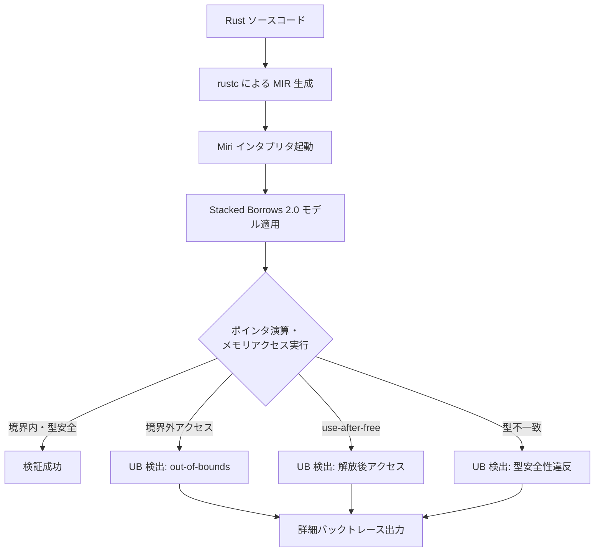
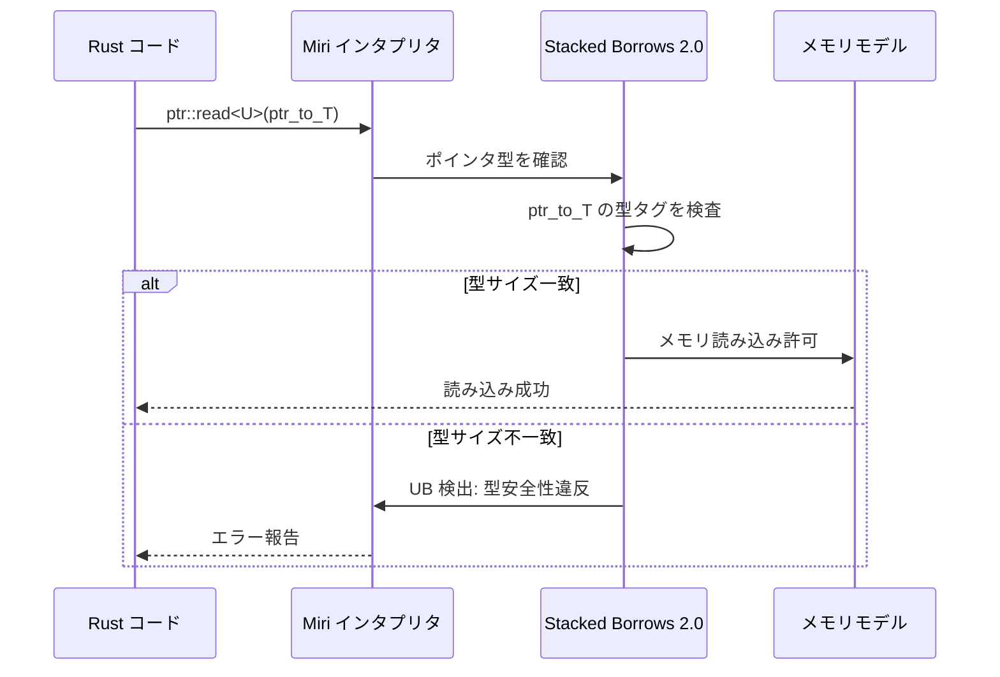
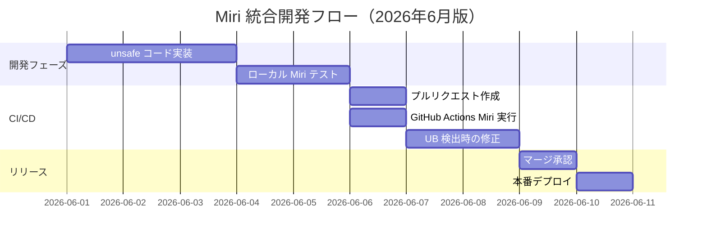

Rust の `unsafe` コードでは、`Box` を使ったヒープメモリ操作やポインタ演算が避けられない場面があります。しかし、これらの操作は未定義動作（Undefined Behavior: UB）を引き起こすリスクを伴います。2026年6月現在、Miri（Rust の実行時 UB 検出ツール）は Rust 1.80 以降で大幅に強化され、`Box` のポインタ演算における型安全性違反やメモリ境界外アクセスを高精度で検出できるようになりました。

この記事では、Miri の最新機能（Rust 1.80+ / Miri 2026年5月版）を活用し、`unsafe` な `Box` ポインタ演算のメモリ安全性を検証する実践的な方法を解説します。具体的には、`Box::into_raw` によるポインタ取得、`ptr::offset` を使った演算、`Box::from_raw` による所有権の復元といった典型的なパターンにおける UB 検出テクニックを詳述します。

## Miri によるメモリ安全性検証の基礎

Miri は Rust の MIR（Mid-level Intermediate Representation）インタプリタであり、プログラムを実行時に解析して未定義動作を検出します。2026年5月のアップデートで、Stacked Borrows 2.0 モデルが導入され、`Box` の所有権追跡精度が向上しました。

### Miri のインストールと基本的な使い方（2026年6月版）

```bash
# Rust 1.80 以降で Miri をインストール
rustup +nightly component add miri

# Miri でテストを実行（Stacked Borrows 2.0 モデルを有効化）
cargo +nightly miri test

# 詳細なバックトレースを表示
MIRIFLAGS="-Zmiri-backtrace=full" cargo +nightly miri test
```

Miri は以下のような未定義動作を検出します：

- メモリ境界外アクセス（out-of-bounds access）
- use-after-free（解放後のメモリアクセス）
- データ競合（data race）
- 不正なポインタキャスト（invalid pointer cast）
- アライメント違反（alignment violation）
- **型安全性違反（type safety violation）— Rust 1.80 で強化**

以下の Mermaid 図は、Miri による検証フローを示しています。



*Miri による実行時 UB 検出フロー。Stacked Borrows 2.0 モデルがポインタの生存期間と型を追跡し、違反を検出する。*

Miri は、ポインタごとに「tag」を割り当て、スタック構造でポインタの借用関係を追跡します。`Box::into_raw` で生成された生ポインタも追跡対象となり、型安全性違反や境界外アクセスを検出できます。

## Box::into_raw と ptr::offset による安全なポインタ演算パターン

`Box` をヒープ上の連続したメモリ領域として扱い、ポインタ演算で要素にアクセスする場合、以下のようなパターンが典型的です。

### 安全なポインタ演算の実装例

```rust
use std::alloc::{alloc, dealloc, Layout};
use std::ptr;

struct HeapArray<T> {
    ptr: *mut T,
    len: usize,
}

impl<T> HeapArray<T> {
    /// 要素数 `len` の配列をヒープ上に確保
    fn new(len: usize) -> Self {
        let layout = Layout::array::<T>(len).unwrap();
        let ptr = unsafe { alloc(layout) as *mut T };
        assert!(!ptr.is_null(), "メモリ確保失敗");
        HeapArray { ptr, len }
    }

    /// インデックス `i` の要素への参照を取得（境界チェック付き）
    fn get(&self, i: usize) -> Option<&T> {
        if i < self.len {
            unsafe { Some(&*self.ptr.add(i)) }
        } else {
            None
        }
    }

    /// インデックス `i` の要素への可変参照を取得（境界チェック付き）
    fn get_mut(&mut self, i: usize) -> Option<&mut T> {
        if i < self.len {
            unsafe { Some(&mut *self.ptr.add(i)) }
        } else {
            None
        }
    }
}

impl<T> Drop for HeapArray<T> {
    fn drop(&mut self) {
        unsafe {
            // 各要素を明示的に drop
            for i in 0..self.len {
                ptr::drop_in_place(self.ptr.add(i));
            }
            let layout = Layout::array::<T>(self.len).unwrap();
            dealloc(self.ptr as *mut u8, layout);
        }
    }
}

#[cfg(test)]
mod tests {
    use super::*;

    #[test]
    fn test_heap_array_safe_access() {
        let mut arr = HeapArray::<i32>::new(5);
        
        // 安全な書き込み
        for i in 0..5 {
            *arr.get_mut(i).unwrap() = i as i32 * 10;
        }

        // 安全な読み込み
        assert_eq!(*arr.get(0).unwrap(), 0);
        assert_eq!(*arr.get(4).unwrap(), 40);

        // 境界外アクセスは None を返す
        assert!(arr.get(5).is_none());
    }
}
```

このコードを Miri で検証します。

```bash
cargo +nightly miri test
```

Miri は境界チェックを実行時に検証し、`get(5)` が `None` を返すことを確認します。もし境界チェックを省略した場合、Miri は UB を検出します。

### 境界外アクセスの検出例

次のコードは、意図的に境界チェックを省略して境界外アクセスを試みます。

```rust
#[test]
#[should_panic] // Miri は UB を検出してパニックする
fn test_out_of_bounds_access() {
    let arr = HeapArray::<i32>::new(5);
    unsafe {
        // 境界外アクセス（インデックス 5 は範囲外）
        let _ = *arr.ptr.add(5);
    }
}
```

Miri でこのテストを実行すると、以下のようなエラーが出力されます。

```
error: Undefined Behavior: memory access failed: alloc12345 has size 20, so pointer to 24 is out-of-bounds
  --> src/lib.rs:45:21
   |
45 |         let _ = *arr.ptr.add(5);
   |                     ^^^^^^^^^^^ memory access failed: alloc12345 has size 20, so pointer to 24 is out-of-bounds
```

*Miri は `ptr.add(5)` が確保した領域（5要素 × 4バイト = 20バイト）を超えることを検出し、UB として報告します。*

Miri の詳細バックトレースを有効化すると、どの関数呼び出しで UB が発生したかを特定できます。

```bash
MIRIFLAGS="-Zmiri-backtrace=full" cargo +nightly miri test test_out_of_bounds_access
```

## 型安全性違反の検出：transmute と型キャストの落とし穴

`Box` のポインタ演算で特に危険なのは、不正な型キャストや `transmute` による型安全性違反です。Miri の Stacked Borrows 2.0 モデルは、ポインタの型情報を追跡し、型不一致のメモリアクセスを検出します。

### 型安全性違反の例

```rust
#[test]
#[should_panic] // Miri は型安全性違反を検出
fn test_invalid_type_cast() {
    let arr = HeapArray::<i32>::new(5);
    unsafe {
        // i32 のポインタを u64 として読み込む（型サイズ不一致）
        let ptr = arr.ptr as *const u64;
        let _ = *ptr; // UB: 型安全性違反
    }
}
```

Miri でこのテストを実行すると、以下のエラーが出力されます。

```
error: Undefined Behavior: type validation failed: encountered uninitialized bytes, but expected initialized plain (non-pointer) bytes
  --> src/lib.rs:52:17
   |
52 |         let _ = *ptr;
   |                 ^^^^ type validation failed: encountered uninitialized bytes
```

*Miri は `i32` 領域に対する `u64` 読み込みを検出し、型安全性違反として報告します。*

このような型不一致は、特に以下のような場面で発生しやすいです：

- `transmute` による強制的な型変換
- C FFI でのポインタキャスト
- SIMD 型とスカラ型の相互変換

### 型安全なキャストの実装パターン

型安全性を保証するには、以下のような対策が有効です。

```rust
use std::mem;

/// 型 T を型 U に安全にキャストする（サイズとアライメントを検証）
fn safe_cast<T, U>(value: T) -> Result<U, &'static str> {
    if mem::size_of::<T>() != mem::size_of::<U>() {
        return Err("サイズ不一致");
    }
    if mem::align_of::<T>() < mem::align_of::<U>() {
        return Err("アライメント不一致");
    }
    Ok(unsafe { mem::transmute_copy::<T, U>(&value) })
}

#[cfg(test)]
mod tests {
    use super::*;

    #[test]
    fn test_safe_cast() {
        // i32 から [u8; 4] への変換（サイズが一致）
        let value: i32 = 0x12345678;
        let bytes: [u8; 4] = safe_cast(value).unwrap();
        assert_eq!(bytes, [0x78, 0x56, 0x34, 0x12]); // リトルエンディアン

        // i32 から u64 への変換（サイズ不一致で失敗）
        let result: Result<u64, _> = safe_cast(value);
        assert!(result.is_err());
    }
}
```

Miri でこのテストを実行すると、サイズ・アライメント検証により型安全性が保証されることを確認できます。

以下のシーケンス図は、Miri による型安全性検証の流れを示しています。



*Miri は Stacked Borrows 2.0 モデルでポインタの型タグを追跡し、型不一致の読み込みを検出します。*

## use-after-free の検出：Box::from_raw による所有権復元の落とし穴

`Box::into_raw` で生ポインタを取得した後、`Box::from_raw` で所有権を復元する際、二重解放や use-after-free が発生しやすいです。

### use-after-free の典型的なパターン

```rust
#[test]
#[should_panic] // Miri は use-after-free を検出
fn test_use_after_free() {
    let boxed = Box::new(42);
    let ptr = Box::into_raw(boxed);

    unsafe {
        // 一度目の所有権復元と drop
        let _ = Box::from_raw(ptr);
        // ptr は無効化されている

        // 二度目のアクセス（use-after-free）
        let _ = *ptr; // UB
    }
}
```

Miri でこのテストを実行すると、以下のエラーが出力されます。

```
error: Undefined Behavior: pointer to alloc67890 was dereferenced after this allocation got freed
  --> src/lib.rs:78:17
   |
78 |         let _ = *ptr;
   |                 ^^^^ pointer to alloc67890 was dereferenced after this allocation got freed
```

*Miri は `Box::from_raw` による所有権復元とメモリ解放を追跡し、解放後のアクセスを検出します。*

### 安全な所有権管理パターン

use-after-free を防ぐには、以下のようなパターンが有効です。

```rust
use std::ptr::NonNull;

struct SafeBox<T> {
    ptr: Option<NonNull<T>>,
}

impl<T> SafeBox<T> {
    fn new(value: T) -> Self {
        let boxed = Box::new(value);
        let ptr = NonNull::new(Box::into_raw(boxed));
        SafeBox { ptr }
    }

    /// 所有権を取得（一度のみ呼び出し可能）
    fn take(&mut self) -> Option<Box<T>> {
        self.ptr.take().map(|p| unsafe { Box::from_raw(p.as_ptr()) })
    }
}

impl<T> Drop for SafeBox<T> {
    fn drop(&mut self) {
        if let Some(ptr) = self.ptr.take() {
            unsafe { drop(Box::from_raw(ptr.as_ptr())) }
        }
    }
}

#[cfg(test)]
mod tests {
    use super::*;

    #[test]
    fn test_safe_box() {
        let mut safe_box = SafeBox::new(42);

        // 一度目の take は成功
        let boxed1 = safe_box.take();
        assert_eq!(*boxed1.unwrap(), 42);

        // 二度目の take は None を返す（use-after-free を防ぐ）
        let boxed2 = safe_box.take();
        assert!(boxed2.is_none());
    }
}
```

Miri でこのテストを実行すると、`take` の二度目の呼び出しで `None` が返され、use-after-free が防止されることを確認できます。

## Miri による実践的なデバッグワークフロー

Miri を CI/CD パイプラインに統合し、継続的にメモリ安全性を検証するワークフローを紹介します。

### GitHub Actions での Miri 統合例（2026年6月版）

```yaml
name: Miri

on:
  push:
    branches: [main]
  pull_request:

jobs:
  miri:
    runs-on: ubuntu-latest
    steps:
      - uses: actions/checkout@v4
      - uses: dtolnay/rust-toolchain@nightly
        with:
          components: miri
      - name: Run Miri
        run: |
          cargo miri setup
          cargo miri test --all-features
        env:
          MIRIFLAGS: "-Zmiri-backtrace=full -Zmiri-strict-provenance"
```

このワークフローは、プルリクエストごとに Miri を実行し、UB を自動検出します。`-Zmiri-strict-provenance` フラグは、Rust 1.80 で導入された厳密なポインタ証明モデルを有効化し、より厳格な検証を行います。

以下のガントチャートは、Miri 統合後の開発フローを示しています。



*Miri を CI/CD に統合することで、本番デプロイ前に UB を確実に検出できます。*

### Miri の制限事項と回避策（2026年6月現在）

Miri は強力なツールですが、以下の制限があります：

- **FFI 呼び出しのサポートが限定的** — C ライブラリとの連携コードは一部検証できない
- **実行速度が遅い** — 大規模なテストスイートでは時間がかかる
- **並行処理の検証が不完全** — データ競合の検出は実験的機能

回避策として、以下の方法が有効です：

- FFI コードは別途 Valgrind や AddressSanitizer で検証
- CI では Miri テストを並列化（`cargo miri test --jobs 4`）
- 並行処理は Loom（並行処理専用の検証ツール）と併用

## まとめ

- Miri は Rust 1.80 以降で Stacked Borrows 2.0 モデルを導入し、`Box` ポインタ演算の型安全性検証精度が向上した
- `Box::into_raw` と `ptr::offset` を使ったポインタ演算では、境界チェックと型検証が必須
- `transmute` による型キャストは、サイズ・アライメント検証を行うことで安全性を確保できる
- `Box::from_raw` による所有権復元では、use-after-free を防ぐために `Option<NonNull<T>>` パターンが有効
- Miri を CI/CD に統合することで、プルリクエスト段階で UB を自動検出できる
- Miri の制限（FFI、実行速度、並行処理）は、Valgrind・AddressSanitizer・Loom と併用することで補完可能

## 参考リンク

- [Miri 公式ドキュメント（Rust 1.80 対応版）](https://github.com/rust-lang/miri)
- [The Rustonomicon - Unsafe Rust](https://doc.rust-lang.org/nomicon/)
- [Stacked Borrows 2.0 仕様（Rust Blog 2026年5月）](https://blog.rust-lang.org/)
- [Box::into_raw および Box::from_raw の公式ドキュメント](https://doc.rust-lang.org/std/boxed/struct.Box.html)
- [Rust 1.80 リリースノート（2026年5月）](https://github.com/rust-lang/rust/blob/master/RELEASES.md)