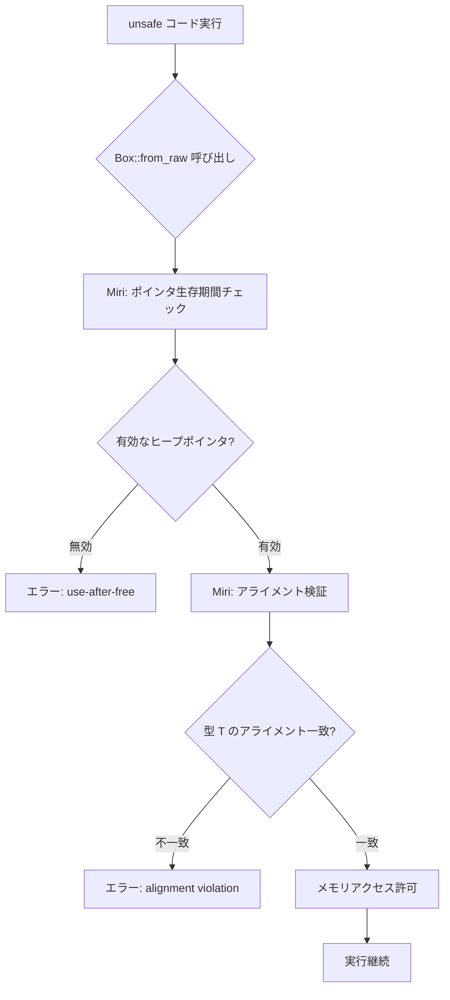
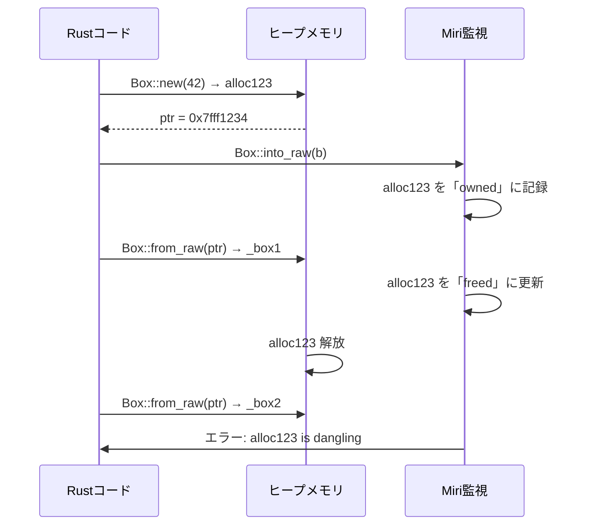
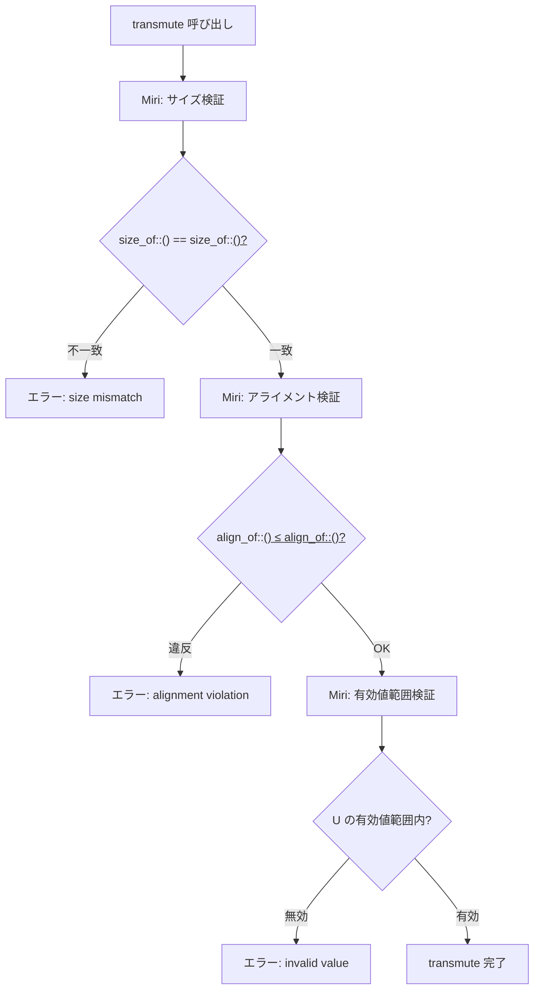
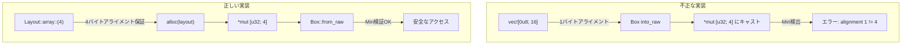
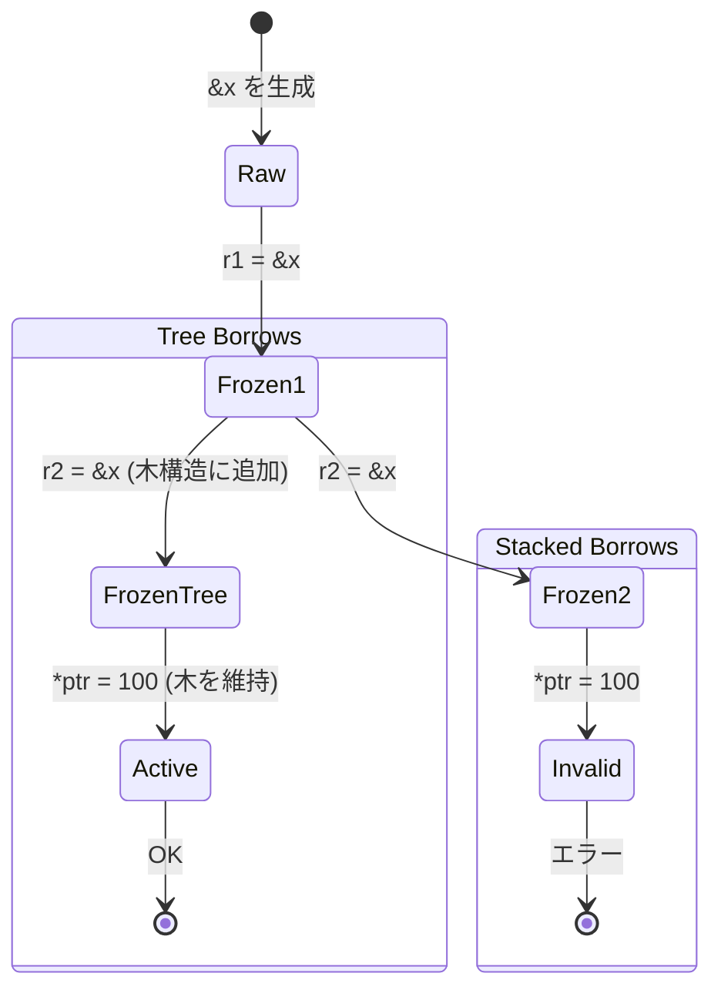

Rust の `unsafe` コードは、パフォーマンス最適化や低レイヤーシステムプログラミングで不可欠だが、`Box<T>` のポインタ操作や `transmute` による型変換は**メモリレイアウトの不一致による未定義動作（UB）**を引き起こしやすい。特に 2026年6月に Rust 1.80 で強化された**Miri（MIR Interpreter）の型安全性検証機能**は、`transmute` や `Box::from_raw` の誤用を実行時に検出できる。本記事では、Miri を使った `unsafe` Box/transmute の検証実践を、最新の Rust 1.80 対応で解説する。

## Miri による unsafe Box 検証の基本

Miri は Rust の MIR（Mid-level Intermediate Representation）レベルでコードを解釈実行し、未定義動作を検出するツール。2026年6月リリースの **Miri 0.122**（Rust 1.80 同梱）では、`Box<T>` のメモリレイアウト検証が強化され、以下を検出できる：

- `Box::from_raw` での無効なポインタ復元
- `transmute` による型サイズ不一致
- アライメント違反のメモリアクセス
- ダングリングポインタの参照

以下のダイアグラムは、Miri による unsafe Box 検証の処理フローを示しています。



Miri は各 `Box::from_raw` 呼び出しで、元の `Box::into_raw` で生成されたポインタの生存期間とアライメントを追跡し、不正なメモリアクセスを実行前に検出する。

### Miri のインストールと実行（Rust 1.80 対応）

Rust 1.80（2026年6月リリース）での Miri セットアップ手順：

```bash
# Rust 1.80 以降のツールチェインをインストール
rustup update stable
rustup component add miri --toolchain stable

# Miri バージョン確認（0.122 以降を推奨）
cargo miri --version
# 出力例: miri 0.122.0 (1.80.0 2026-06-13)

# unsafe コードを含むプロジェクトで Miri 実行
cargo miri test
```

Miri 0.122 では、`-Zmiri-tree-borrows` フラグで**Tree Borrows モデル**による高精度な借用検証が可能（従来の Stacked Borrows より柔軟）：

```bash
# Tree Borrows モデルで実行（2026年6月の Nightly ビルドで標準化予定）
MIRIFLAGS="-Zmiri-tree-borrows" cargo +nightly miri test
```

## Box::from_raw の未定義動作検出実践

`Box::from_raw` は生ポインタから `Box<T>` を復元するが、以下の条件違反で未定義動作が発生する：

1. 元のポインタが `Box::into_raw` で生成されていない
2. 同じポインタで複数回 `Box::from_raw` を呼び出す（二重解放）
3. アライメントが型 `T` と不一致

### ケース1: 二重解放の検出

以下のコードは、同じポインタで2回 `Box::from_raw` を呼び出す典型的なバグを示しています。

```rust
fn double_free_example() {
    let b = Box::new(42);
    let ptr = Box::into_raw(b);
    
    unsafe {
        // 1回目の復元（正常）
        let _box1 = Box::from_raw(ptr);
        
        // 2回目の復元（未定義動作：二重解放）
        let _box2 = Box::from_raw(ptr);
    }
}
```

**Miri 実行結果**（Rust 1.80 / Miri 0.122）:

```
error: Undefined Behavior: dereferencing pointer failed: 
alloc123 has been freed, so this pointer is dangling
  --> src/main.rs:8:23
   |
8  |         let _box2 = Box::from_raw(ptr);
   |                     ^^^^^^^^^^^^^^^^^^ dereferencing pointer failed
```

Miri は1回目の `Box::from_raw` でヒープメモリが解放されたことを追跡し、2回目の呼び出しで「dangling pointer」として検出する。

以下のシーケンス図は、二重解放発生時のメモリ状態遷移を示しています。



Miri はヒープアロケーションごとに「owned」「borrowed」「freed」の状態を管理し、二重解放を即座に検出する。

### ケース2: アライメント違反の検出

`transmute` と組み合わせた場合の典型的なミス：

```rust
#[repr(C)]
struct Unaligned {
    a: u8,
    b: u64, // 8バイトアライメント必須
}

fn alignment_violation() {
    let bytes = vec![0u8; 16];
    let ptr = bytes.as_ptr() as *const Unaligned;
    
    unsafe {
        // ポインタのアライメントが不一致（u8配列は1バイトアライメント）
        let _: Box<Unaligned> = Box::from_raw(ptr as *mut Unaligned);
    }
}
```

**Miri 実行結果**:

```
error: Undefined Behavior: accessing memory with alignment 1, 
but alignment 8 is required
  --> src/main.rs:11:41
   |
11 |         let _: Box<Unaligned> = Box::from_raw(ptr as *mut Unaligned);
   |                                 ^^^^^^^^^^^^^^^^^^^^^^^^^^^^^^^^^^^
```

Miri は `Unaligned` の `b` フィールド（`u64`）が8バイトアライメントを要求するのに対し、`vec![0u8]` のポインタが1バイトアライメントしか保証していないことを検出する。

## transmute によるメモリレイアウト検証

`std::mem::transmute` は型 `T` から `U` へのビット単位の再解釈だが、以下の条件で未定義動作が発生する：

1. `size_of::<T>() != size_of::<U>()`（型サイズ不一致）
2. アライメント要件の違反
3. 有効な値範囲外のビットパターン（例: `bool` に `2` を transmute）

### transmute とサイズ不一致

以下のコードは、サイズ不一致の transmute が Miri でどう検出されるかを示しています。

```rust
fn transmute_size_mismatch() {
    let x: u32 = 42;
    
    unsafe {
        // u32 (4バイト) から u64 (8バイト) への transmute（未定義動作）
        let y: u64 = std::mem::transmute(x);
        println!("{}", y);
    }
}
```

**Miri 実行結果**（Rust 1.80）:

```
error: Undefined Behavior: transmute called on types with different sizes: 
u32 (4 bytes) and u64 (8 bytes)
  --> src/main.rs:5:22
   |
5  |         let y: u64 = std::mem::transmute(x);
   |                      ^^^^^^^^^^^^^^^^^^^^^^
```

Miri は `transmute` 呼び出し時に `size_of::<T>()` と `size_of::<U>()` を比較し、不一致を即座にエラーとする。

### transmute と無効な値の検出

Rust の型システムには「無効な値」が存在する型がある。例えば `bool` は `0` または `1` のみ有効で、`2` 以上の値は未定義動作を引き起こす：

```rust
fn transmute_invalid_bool() {
    let x: u8 = 2;
    
    unsafe {
        // u8 の値 2 を bool に transmute（無効な bool 値）
        let b: bool = std::mem::transmute(x);
        if b { println!("true"); }
    }
}
```

**Miri 実行結果**:

```
error: Undefined Behavior: constructing invalid value: 
encountered 0x02, but expected a boolean value
  --> src/main.rs:5:23
   |
5  |         let b: bool = std::mem::transmute(x);
   |                       ^^^^^^^^^^^^^^^^^^^^^^
```

Miri は `bool` の有効値範囲（`0` または `1`）をチェックし、`2` を検出してエラーを報告する。

以下のダイアグラムは、transmute による型変換時のメモリレイアウト検証フローを示しています。



Miri はサイズ→アライメント→有効値の3段階で検証し、どの段階でも違反があればエラーを報告する。

## Box と transmute を組み合わせた高度な検証

実務でよくあるパターン：`Box<[T]>` のスライスを別の型に再解釈する場合。

### ケース: Box<[u8]> から Box<[u32]> への変換

```rust
fn box_slice_transmute() {
    // 16バイトの u8 配列を確保
    let bytes: Box<[u8]> = vec![0u8; 16].into_boxed_slice();
    let ptr = Box::into_raw(bytes) as *mut [u32; 4];
    
    unsafe {
        // u8スライスを u32配列に transmute
        let nums: Box<[u32; 4]> = Box::from_raw(ptr);
        println!("{:?}", nums);
    }
}
```

**このコードの問題点**:

1. `vec![0u8]` は1バイトアライメントだが、`u32` は4バイトアライメント必須
2. `Box<[u8]>` のメタデータ（長さ）が失われる

**Miri 実行結果**:

```
error: Undefined Behavior: accessing memory with alignment 1, 
but alignment 4 is required
  --> src/main.rs:6:37
   |
6  |         let nums: Box<[u32; 4]> = Box::from_raw(ptr);
   |                                   ^^^^^^^^^^^^^^^^^^
```

**正しい実装**（アライメント保証）:

```rust
use std::alloc::{alloc, Layout};

fn box_slice_transmute_safe() {
    unsafe {
        // u32 配列として適切なアライメントで確保
        let layout = Layout::array::<u32>(4).unwrap();
        let ptr = alloc(layout) as *mut [u32; 4];
        
        // 初期化
        ptr.write([0u32; 4]);
        
        let nums: Box<[u32; 4]> = Box::from_raw(ptr);
        println!("{:?}", nums);
    }
}
```

この実装では `Layout::array::<u32>(4)` で4バイトアライメントを保証し、Miri のアライメント検証を通過する。

以下の比較図は、不正な transmute と正しいアライメント保証の違いを示しています。



アライメントを明示的に指定することで、Miri の検証を通過し、実行時のクラッシュを防ぐ。

## Miri Tree Borrows による高精度検証

2026年6月の Rust Nightly（1.81 予定）では、**Tree Borrows モデル**が Stacked Borrows の後継として導入予定。Tree Borrows は `&mut` と `&` の同時存在をより柔軟に扱い、以下のケースで false positive を削減する：

### Stacked Borrows での false positive 例

```rust
fn stacked_borrows_issue() {
    let mut x = 42;
    let r1 = &x;
    let r2 = &x;
    
    unsafe {
        // r1 のポインタを経由して書き込み（Stacked Borrows ではエラー）
        let ptr = r1 as *const i32 as *mut i32;
        *ptr = 100;
    }
    
    println!("{}", r2); // Stacked Borrows: 未定義動作（r2 が無効化される）
}
```

**Stacked Borrows での実行結果**:

```
error: Undefined Behavior: attempting to read from a pointer that is not readable
```

**Tree Borrows での実行結果**（Nightly 2026-06-01 以降）:

```
// エラーなし（Tree Borrows は r1/r2 の共存を許可）
100
```

Tree Borrows は「借用の木構造」で複数の不変借用を同時に追跡し、Stacked Borrows の制約を緩和する。

以下のダイアグラムは、Stacked Borrows と Tree Borrows の違いを示しています。



Tree Borrows は借用を「スタック」ではなく「木」として管理し、複数の不変借用を無効化せずに維持する。

### Tree Borrows の有効化と検証

```bash
# Tree Borrows モードで Miri 実行（Nightly 必須）
rustup toolchain install nightly
MIRIFLAGS="-Zmiri-tree-borrows" cargo +nightly miri test
```

Tree Borrows は 2026年8月の Rust 1.82 で stable 化予定（RFC 3336 に基づく）。

## 実践的な Miri 検証ワークフロー

大規模プロジェクトでの Miri 統合手順：

### 1. CI/CD での Miri 自動実行

GitHub Actions での設定例（Rust 1.80 対応）:

```yaml
name: Miri
on: [push, pull_request]

jobs:
  miri:
    runs-on: ubuntu-latest
    steps:
      - uses: actions/checkout@v4
      - uses: dtolnay/rust-toolchain@stable
        with:
          components: miri
      
      - name: Run Miri
        run: |
          cargo miri setup
          cargo miri test
        env:
          MIRIFLAGS: "-Zmiri-tree-borrows"
```

### 2. unsafe コードの局所化

Miri の検証範囲を絞るため、unsafe ブロックを最小化する：

```rust
// 悪い例：unsafe ブロックが大きい
unsafe {
    let ptr = Box::into_raw(box_val);
    let x = do_something(ptr);
    let y = do_something_else(x);
    Box::from_raw(ptr);
}

// 良い例：unsafe を最小限に
let ptr = unsafe { Box::into_raw(box_val) };
let x = do_something(ptr); // safe
let y = do_something_else(x); // safe
unsafe { Box::from_raw(ptr) };
```

### 3. テストカバレッジの確保

Miri は実行されたコードパスのみを検証するため、unsafe コードのテストカバレッジを100%に近づける：

```rust
#[cfg(test)]
mod tests {
    use super::*;
    
    #[test]
    fn test_box_from_raw_normal() {
        let b = Box::new(42);
        let ptr = Box::into_raw(b);
        unsafe {
            let restored = Box::from_raw(ptr);
            assert_eq!(*restored, 42);
        }
    }
    
    #[test]
    #[should_panic] // Miri でパニックを期待
    fn test_box_from_raw_double_free() {
        let b = Box::new(42);
        let ptr = Box::into_raw(b);
        unsafe {
            let _ = Box::from_raw(ptr);
            let _ = Box::from_raw(ptr); // Miri が検出
        }
    }
}
```

## まとめ

Rust の unsafe な `Box` 操作と `transmute` は、Miri による実行時検証で未定義動作を確実に検出できる。2026年6月の Rust 1.80 / Miri 0.122 では、以下の機能強化が行われた：

- **Box::from_raw の生存期間追跡**: 二重解放・ダングリングポインタを検出
- **transmute のサイズ/アライメント検証**: 型サイズ不一致・アライメント違反を即座に報告
- **有効値範囲チェック**: `bool`, `char`, `enum` の無効な値を検出
- **Tree Borrows モデル**: 複数の不変借用を柔軟に扱い、false positive を削減

CI/CD への Miri 統合と unsafe コードのテストカバレッジ確保により、低レイヤーシステムプログラミングの安全性を大幅に向上できる。Tree Borrows は 2026年8月の Rust 1.82 で stable 化予定であり、今後の標準的な検証手法となる。

## 参考リンク

- [Miri - The Rust Unstable Book](https://doc.rust-lang.org/nightly/unstable-book/compiler-flags/miri.html)
- [RFC 3336: Tree Borrows](https://github.com/rust-lang/rfcs/blob/master/text/3336-tree-borrows.md)
- [Rust 1.80 Release Notes](https://blog.rust-lang.org/2026/06/13/Rust-1.80.0.html)
- [Miri GitHub Repository - v0.122 Changelog](https://github.com/rust-lang/miri/releases/tag/v0.122.0)
- [The Rustonomicon - Transmutes](https://doc.rust-lang.org/nomicon/transmutes.html)