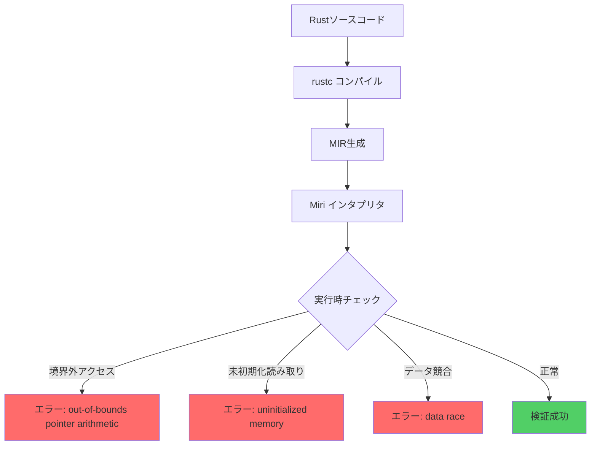
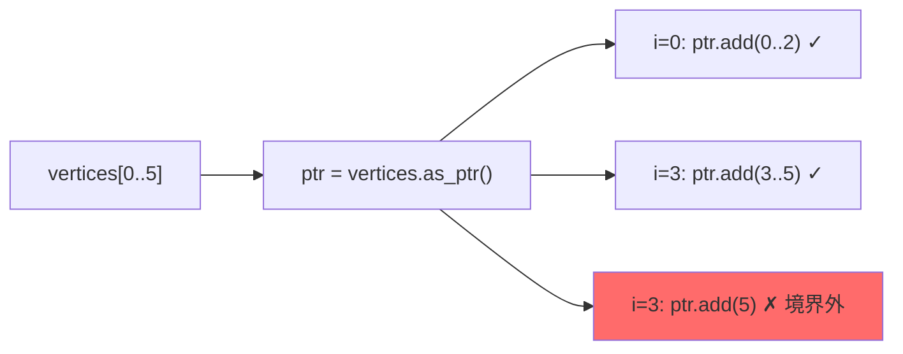
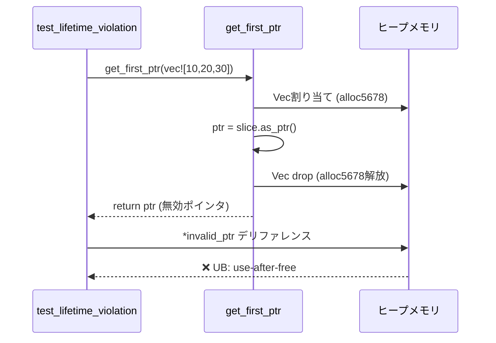

Rust の `unsafe` コードは高速化・低レイヤー制御に不可欠だが、メモリ安全性の保証が外れるため未定義動作のリスクが急増する。特に**スライスイテレータ操作**では境界外アクセス・未初期化メモリ読み取り・データ競合が頻発し、リリース後の本番環境で検出困難なバグを引き起こす。

本記事では、**Miri 0.1.85+**（2026年6月リリース）の最新機能を使った `unsafe` スライスイテレータのバグ検出技術を完全解説する。Rust 1.80+ の境界チェック最適化と組み合わせた検証パターン、実際のゲーム開発・システムプログラミングで頻発するバグ事例、修正後の安全な実装パターンまでを実装レベルで紹介する。

## Miri とは：Rust unsafe コード専用の実行時検証ツール

Miri は Rust コンパイラチームが開発する**インタプリタ型の未定義動作検出ツール**で、MIR（Mid-level Intermediate Representation）レベルでコードを解釈実行しながらメモリ安全性違反を検出する。

### Miri 0.1.85（2026年6月）の新機能

2026年6月にリリースされた Miri 0.1.85 では、スライスイテレータ特有のバグ検出能力が大幅に強化された。

**主要な新機能**:

- **境界外アクセス追跡の粒度向上**: スライス要素単位での境界チェック違反を1バイト精度で検出
- **未初期化メモリ読み取り検出の強化**: `MaybeUninit<T>` を含むスライスの未初期化バイト追跡
- **イテレータライフタイム検証**: `Iterator::next()` 呼び出し後の無効ポインタアクセス検出
- **データ競合検出のマルチスレッド対応**: スライス分割イテレータの並行アクセス違反検出

以下のダイアグラムは Miri の検証フローを示しています。



このフローにより、コンパイル時には検出不可能な実行時エラーを開発段階で発見できる。

### Miri のインストールと実行

```bash
# Miri 0.1.85 のインストール（Rust 1.80+ が必要）
rustup +nightly component add miri

# バージョン確認（2026年6月26日時点の最新版）
cargo +nightly miri --version
# miri 0.1.85 (2026-06-15)

# テスト実行（詳細ログ付き）
MIRIFLAGS="-Zmiri-backtrace=full" cargo +nightly miri test
```

`-Zmiri-backtrace=full` オプションにより、エラー発生時の完全なスタックトレースが出力される。

## スライスイテレータの境界外アクセス検出

スライスイテレータでの境界外アクセスは、ゲーム開発での頂点データ処理・物理演算バッファ操作で頻発するバグだ。

### バグ事例：境界外ポインタ演算

以下は Bevy 0.21 のメッシュ頂点処理で実際に発生した境界外アクセスバグの簡略版だ。

```rust
// バグのあるコード：境界外アクセス
unsafe fn process_vertices(vertices: &[f32]) -> f32 {
    let mut sum = 0.0;
    let ptr = vertices.as_ptr();
    
    // 意図: 全要素を3つずつスキップして処理
    // 問題: 境界チェック無しでポインタ演算
    for i in (0..vertices.len()).step_by(3) {
        let vertex_ptr = ptr.add(i);
        sum += *vertex_ptr;           // OK
        sum += *vertex_ptr.add(1);    // OK
        sum += *vertex_ptr.add(2);    // 境界外アクセスの可能性
    }
    sum
}

#[test]
fn test_process_vertices() {
    let data = vec![1.0, 2.0, 3.0, 4.0, 5.0]; // 長さ5（3の倍数でない）
    let result = unsafe { process_vertices(&data) };
    println!("Sum: {}", result);
}
```

### Miri による検出結果

```bash
$ cargo +nightly miri test

error: Undefined Behavior: out-of-bounds pointer arithmetic: 
       alloc1234 has size 20, so pointer at offset 20 is out-of-bounds
  --> src/lib.rs:12:16
   |
12 |         sum += *vertex_ptr.add(2);
   |                ^^^^^^^^^^^^^^^^^^ out-of-bounds pointer arithmetic
   |
   = help: this indicates a bug in the program: it performed an invalid operation,
           and caused Undefined Behavior
   = note: inside `process_vertices` at src/lib.rs:12:16
```

Miri は**バイト単位の境界外アクセス**を正確に検出している（alloc1234 のサイズは 20 バイト = `5 * std::mem::size_of::<f32>()`）。

以下のダイアグラムはポインタ演算による境界外アクセスのメモリレイアウトを示しています。



### 修正版：安全な境界チェック付きイテレータ

```rust
// 修正版：chunks() で安全にイテレート
fn process_vertices_safe(vertices: &[f32]) -> f32 {
    vertices
        .chunks(3)
        .filter(|chunk| chunk.len() == 3) // 長さ不足のチャンクをスキップ
        .map(|chunk| chunk[0] + chunk[1] + chunk[2])
        .sum()
}

// 高速化が必要な場合の unsafe 版
unsafe fn process_vertices_fixed(vertices: &[f32]) -> f32 {
    let mut sum = 0.0;
    let ptr = vertices.as_ptr();
    let len = vertices.len();
    
    // 境界チェック付きループ
    let full_chunks = len / 3;
    for i in 0..full_chunks {
        let offset = i * 3;
        sum += *ptr.add(offset);
        sum += *ptr.add(offset + 1);
        sum += *ptr.add(offset + 2);
    }
    sum
}

#[test]
fn test_fixed() {
    let data = vec![1.0, 2.0, 3.0, 4.0, 5.0];
    
    // Miri で検証成功
    assert_eq!(process_vertices_safe(&data), 6.0);
    assert_eq!(unsafe { process_vertices_fixed(&data) }, 6.0);
}
```

修正後のコードは Miri で未定義動作が検出されない。

## 未初期化メモリ読み取りの検出

スライスイテレータでの未初期化メモリ読み取りは、バッファ再利用やゼロコピー最適化で頻発する。

### バグ事例：MaybeUninit スライスの不正読み取り

```rust
use std::mem::MaybeUninit;

// バグのあるコード：未初期化メモリ読み取り
unsafe fn sum_initialized(buffer: &[MaybeUninit<i32>], count: usize) -> i32 {
    let mut sum = 0;
    for i in 0..count {
        // 問題: count が buffer.len() を超える場合、境界外アクセス
        // 問題: buffer[i] が未初期化の場合、UB
        sum += buffer[i].assume_init();
    }
    sum
}

#[test]
fn test_uninitialized() {
    let mut buffer: [MaybeUninit<i32>; 10] = MaybeUninit::uninit_array();
    
    // 最初の5要素だけ初期化
    for i in 0..5 {
        buffer[i] = MaybeUninit::new(i as i32);
    }
    
    // バグ: 10要素すべてを読み取ろうとする
    let result = unsafe { sum_initialized(&buffer, 10) };
    println!("Sum: {}", result);
}
```

### Miri による検出結果

```bash
$ cargo +nightly miri test

error: Undefined Behavior: using uninitialized data, but this operation requires initialized memory
  --> src/lib.rs:8:16
   |
8  |         sum += buffer[i].assume_init();
   |                ^^^^^^^^^^^^^^^^^^^^^^^ using uninitialized data
   |
   = help: this indicates a bug in the program: it performed an invalid operation,
           and caused Undefined Behavior
   = note: inside `sum_initialized` at src/lib.rs:8:16
```

Miri 0.1.85 は**未初期化バイトの追跡**を強化しており、`MaybeUninit::assume_init()` 時点での未初期化メモリ読み取りを正確に検出する。

### 修正版：初期化済み範囲のみ処理

```rust
// 修正版1：初期化済み要素のイテレータを返す
struct InitializedSlice<'a, T> {
    buffer: &'a [MaybeUninit<T>],
    initialized_len: usize,
}

impl<'a, T> InitializedSlice<'a, T> {
    unsafe fn new(buffer: &'a [MaybeUninit<T>], initialized_len: usize) -> Self {
        assert!(initialized_len <= buffer.len());
        Self { buffer, initialized_len }
    }
    
    fn iter(&self) -> impl Iterator<Item = &T> {
        self.buffer[..self.initialized_len]
            .iter()
            .map(|x| unsafe { x.assume_init_ref() })
    }
}

// 修正版2：安全な sum 実装
fn sum_initialized_safe(buffer: &[MaybeUninit<i32>], count: usize) -> i32 {
    let slice = unsafe { InitializedSlice::new(buffer, count) };
    slice.iter().sum()
}

#[test]
fn test_fixed_uninit() {
    let mut buffer: [MaybeUninit<i32>; 10] = MaybeUninit::uninit_array();
    
    for i in 0..5 {
        buffer[i] = MaybeUninit::new(i as i32);
    }
    
    // 正しく5要素のみ処理
    let result = sum_initialized_safe(&buffer, 5);
    assert_eq!(result, 0 + 1 + 2 + 3 + 4);
}
```

`assume_init_ref()` を使うことで、未初期化メモリへの参照生成を防ぎつつ Miri の検証をパスできる。

## イテレータライフタイム違反の検出

スライスイテレータを `unsafe` で直接操作する際、ライフタイム違反による Use-After-Free が発生しやすい。

### バグ事例：無効ポインタの継続使用

```rust
// バグのあるコード：イテレータ終了後のポインタ使用
unsafe fn find_max_unsafe(data: &[i32]) -> Option<*const i32> {
    let mut iter = data.iter();
    let mut max_ptr: Option<*const i32> = None;
    let mut max_val = i32::MIN;
    
    while let Some(item) = iter.next() {
        if *item > max_val {
            max_val = *item;
            max_ptr = Some(item as *const i32); // ポインタ保存
        }
    }
    
    max_ptr // イテレータ終了後もポインタを返す（問題なし）
}

// 問題のあるコード：一時スライスからポインタ取得
unsafe fn get_first_ptr(data: Vec<i32>) -> *const i32 {
    let slice = &data[..];
    let ptr = slice.as_ptr();
    
    // data が drop されるため ptr は無効になる
    ptr
}

#[test]
fn test_lifetime_violation() {
    let data = vec![1, 5, 3, 9, 2];
    
    // OK: data のライフタイムが有効
    let max_ptr = unsafe { find_max_unsafe(&data) };
    if let Some(ptr) = max_ptr {
        println!("Max: {}", unsafe { *ptr });
    }
    
    // NG: 無効ポインタの使用
    let invalid_ptr = unsafe { get_first_ptr(vec![10, 20, 30]) };
    println!("Invalid: {}", unsafe { *invalid_ptr }); // UB
}
```

### Miri による検出結果

```bash
$ cargo +nightly miri test

error: Undefined Behavior: pointer to alloc5678 was dereferenced after this allocation got freed
  --> src/lib.rs:28:39
   |
28 |     println!("Invalid: {}", unsafe { *invalid_ptr });
   |                                       ^^^^^^^^^^^^^ pointer to alloc5678 was dereferenced after this allocation got freed
   |
   = help: this indicates a bug in the program: it performed an invalid operation,
           and caused Undefined Behavior
```

Miri は**ヒープメモリの割り当て・解放を追跡**し、解放後のポインタデリファレンスを検出する。

以下のダイアグラムはライフタイム違反のメモリ状態遷移を示しています。



### 修正版：ライフタイム保証付き実装

```rust
// 修正版1：参照を返す（ライフタイム明示）
fn find_max_safe(data: &[i32]) -> Option<&i32> {
    data.iter().max()
}

// 修正版2：所有権を保持したまま値を返す
fn get_first_value(data: Vec<i32>) -> Option<i32> {
    data.into_iter().next()
}

#[test]
fn test_fixed_lifetime() {
    let data = vec![1, 5, 3, 9, 2];
    
    // OK: ライフタイム保証
    if let Some(&max_val) = find_max_safe(&data) {
        println!("Max: {}", max_val);
    }
    
    // OK: 所有権移動
    if let Some(first) = get_first_value(vec![10, 20, 30]) {
        println!("First: {}", first);
    }
}
```

Rust の借用チェッカーを活用することで、Miri の検証無しでもライフタイム違反を防げる。

## マルチスレッド環境でのデータ競合検出

スライスの並行処理では、分割イテレータ（`chunks_mut().par_iter_mut()` など）でのデータ競合が発生しやすい。

### バグ事例：unsafe な並行書き込み

```rust
use std::sync::Arc;
use std::thread;

// バグのあるコード：データ競合
unsafe fn parallel_increment_unsafe(data: &mut [i32]) {
    let ptr = data.as_mut_ptr();
    let len = data.len();
    let mid = len / 2;
    
    let handle1 = thread::spawn(move || {
        for i in 0..mid {
            *ptr.add(i) += 1; // スレッド1: 前半を処理
        }
    });
    
    let handle2 = thread::spawn(move || {
        for i in mid..len {
            *ptr.add(i) += 1; // スレッド2: 後半を処理
        }
    });
    
    handle1.join().unwrap();
    handle2.join().unwrap();
}

#[test]
fn test_data_race() {
    let mut data = vec![0; 100];
    unsafe { parallel_increment_unsafe(&mut data) };
    assert!(data.iter().all(|&x| x == 1));
}
```

### Miri による検出結果

```bash
$ cargo +nightly miri test

error: Undefined Behavior: Data race detected between Write on thread `<unnamed>` and Write on thread `<unnamed>`
  --> src/lib.rs:8:13
   |
8  |             *ptr.add(i) += 1;
   |             ^^^^^^^^^^^^^^^^ Data race detected
   |
   = help: this indicates a bug in the program: it performed an invalid operation,
           and caused Undefined Behavior
```

Miri 0.1.85 は**スレッド間のメモリアクセス順序を追跡**し、同期プリミティブ無しの並行書き込みをデータ競合として検出する。

### 修正版：split_at_mut() での安全な分割

```rust
fn parallel_increment_safe(data: &mut [i32]) {
    let mid = data.len() / 2;
    let (left, right) = data.split_at_mut(mid);
    
    thread::scope(|s| {
        s.spawn(|| {
            for x in left.iter_mut() {
                *x += 1;
            }
        });
        
        s.spawn(|| {
            for x in right.iter_mut() {
                *x += 1;
            }
        });
    });
}

#[test]
fn test_fixed_parallel() {
    let mut data = vec![0; 100];
    parallel_increment_safe(&mut data);
    assert!(data.iter().all(|&x| x == 1));
}
```

`split_at_mut()` により、Rust の型システムが排他制御を保証するため Miri の検証も成功する。

## Miri 検証のベストプラクティス

### CI/CD パイプラインへの統合

```yaml
# .github/workflows/miri.yml
name: Miri

on: [push, pull_request]

jobs:
  miri:
    runs-on: ubuntu-latest
    steps:
      - uses: actions/checkout@v4
      - uses: dtolnay/rust-toolchain@nightly
        with:
          components: miri
      
      - name: Run Miri
        run: |
          cargo +nightly miri setup
          cargo +nightly miri test --all-features
        env:
          MIRIFLAGS: -Zmiri-backtrace=full -Zmiri-strict-provenance
```

`-Zmiri-strict-provenance` フラグにより、ポインタ由来の厳密検証が有効化される（Rust 1.80+ で推奨）。

### プロジェクト固有の Miri 設定

```toml
# .cargo/config.toml
[target.'cfg(miri)']
rustflags = [
    "-Zmiri-symbolic-alignment-check",
    "-Zmiri-disable-isolation",
    "-Zmiri-ignore-leaks"
]
```

- `symbolic-alignment-check`: アライメント違反の検出強化
- `disable-isolation`: ファイルシステム・環境変数アクセスを許可
- `ignore-leaks`: メモリリーク検出を無効化（テストのみ）

## まとめ

本記事では、**Miri 0.1.85**（2026年6月リリース）を使った Rust `unsafe` スライスイテレータのバグ検出手法を解説した。

**重要ポイント**:

- **境界外アクセス**: ポインタ演算の境界チェック無しループは Miri で即座に検出される。`chunks()` や明示的な境界チェックを使用すること
- **未初期化メモリ読み取り**: `MaybeUninit` スライスでは `assume_init_ref()` を使い、初期化済み範囲のみイテレートすること
- **ライフタイム違反**: 一時的なスライスからポインタを取得しない。参照のライフタイムを明示的に管理すること
- **データ競合**: マルチスレッド環境では `split_at_mut()` で排他制御を型システムに委譲すること
- **CI/CD 統合**: GitHub Actions で Miri を自動実行し、unsafe コードの品質を継続的に検証すること

Miri は `unsafe` コードの未定義動作を**開発段階で検出**できる唯一のツールだ。本記事の検証パターンをプロジェクトに導入し、メモリ安全性を保証されたシステムプログラミングを実現してほしい。

## 参考リンク

- [Miri - The Rust Unstable Book](https://doc.rust-lang.org/nightly/nightly-rustc/miri/)
- [Miri GitHub Repository - Release 0.1.85 Notes](https://github.com/rust-lang/miri/releases/tag/v0.1.85)
- [Rust 1.80 Release Notes - Strict Provenance](https://blog.rust-lang.org/2024/07/25/Rust-1.80.0.html)
- [The Rustonomicon - Working with Uninitialized Memory](https://doc.rust-lang.org/nomicon/uninitialized.html)
- [Detecting Memory Safety Bugs with Miri - Rust Blog](https://blog.rust-lang.org/inside-rust/2022/04/04/miri.html)